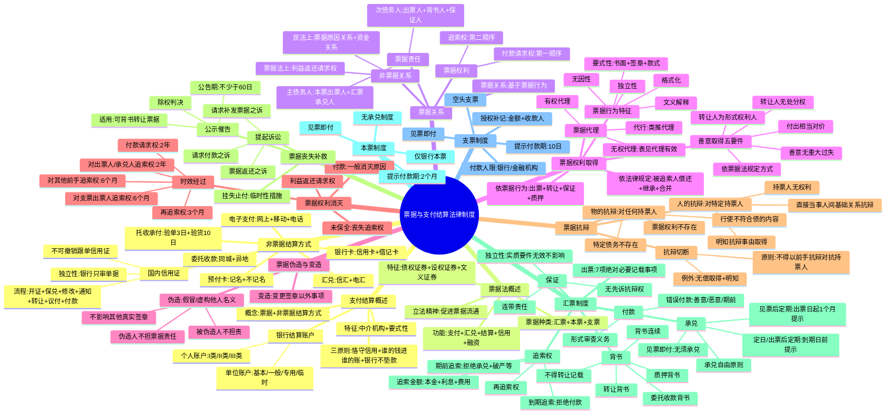

## 1. 章节定位

| 项目 | 信息 |
|------|------|
| 所属科目 | 经济法 |
| 难度等级 | 3 |
| 历年分值 | 4-5分 |
| 建议学时 | 5-6h |

## 2. 考情分析

本章是经济法的**次重点章节**，历年分值 4-5 分，客观题与案例分析题并重，案例分析题常单独命题，是近年必考的案例分析题章节之一。

近年命题热点集中在：(1) 票据权利的取得（依票据行为取得、依法律规定取得、善意取得的五项要件）；(2) 票据行为的无因性与独立性（基础关系瑕疵不影响票据行为效力、各票据行为独立生效）；(3) 票据权利善意取得（转让人为形式权利人但无处分权、受让人善意无重大过失、付出相当对价）；(4) 票据伪造与变造（被伪造人不承担票据责任、不影响其他真实签章效力）；(5) 票据抗辩切断（物的抗辩与人的抗辩、抗辩切断的两种例外）；(6) 票据保证（独立性——被保证人债务因实质要件欠缺无效时不影响保证效力、连带责任、不享有先诉抗辩权）；(7) 汇票的承兑与追索权（承兑自由原则、期前追索权与到期追索权、追索金额范围、再追索权）；(8) 票据贴现（国家特许经营、无因性不适用、善意取得救济）；(9) 票据时效（付款请求权 2 年、追索权 6 个月、再追索权 3 个月）；(10) 票据丧失补救（挂失止付、公示催告、提起诉讼）。

本章学习关键在于**构建"票据关系全流程"知识链**：票据行为（出票/背书/承兑/保证）→ 票据权利（付款请求权/追索权）→ 票据抗辩（物的抗辩/人的抗辩/抗辩切断）→ 票据消灭（付款/时效/保全失败）→ 票据救济（挂失止付/公示催告/诉讼）。案例分析题常围绕票据保证独立性、善意取得、抗辩切断、贴现效力展开，建议结合 2024、2025 年真题系统掌握。

## 3. 知识框架

## 4. 核心精讲

### 一、支付结算概述

#### （一）支付结算的概念与方式

**支付结算**是指单位、个人在社会经济活动中使用票据、银行卡、汇兑、托收承付、委托收款、信用证、电子支付等结算方式进行货币给付及资金清算的行为。货币结算分为**现金结算**和**非现金结算**；我国实行现金管理制度，除按规定可使用现金的情形外，单位之间的货币结算都需通过银行转账进行。

**支付结算的特征**：

| 特征 | 内容 |
|------|------|
| 必须通过法律规定的中介机构进行 | 银行（含农村信用社）是主要中介机构；非银行金融机构和其他单位未经中国人民银行批准不得经营支付结算业务；依法设立并取得支付业务许可的有限责任公司或股份有限公司可从事支付业务 |
| 必须遵循法律规定的特定形式要求 | 必须使用按中国人民银行统一规定印制的票据凭证和结算凭证；未使用统一印制票据的，**票据无效**；未使用统一格式结算凭证的，银行不予受理 |

**支付结算的三原则**（《支付结算办法》2024年修正第16条）：

| 原则 | 内容 |
|------|------|
| 恪守信用，履约付款 | 承担付款义务的一方应按约定金额、时间和方式支付；银行应以善意且符合规定的正常操作程序审查票据和结算凭证 |
| 谁的钱进谁的账，由谁支配 | 银行应遵循委托人意志，准确及时办理支付结算；除法律另有规定外，银行不得为任何单位或个人查询、冻结、扣款 |
| 银行不垫款 | 银行只是中介机构，不承担垫付款项责任；账户内须有足够资金保证支付 |

#### （二）银行结算账户

**银行结算账户的种类**（按存款人不同）：

| 类型 | 适用对象 | 子类 |
|------|----------|------|
| 单位银行结算账户 | 以单位名称开立（个体工商户以字号或经营者姓名开立纳入单位管理） | 基本存款账户、一般存款账户、专用存款账户、临时存款账户 |
| 个人银行结算账户 | 自然人因投资、消费、结算等开立 | I类户、II类户、III类户 |

**单位银行结算账户四类的对比**：

| 账户类型 | 功能特点 | 特殊要求 |
|----------|----------|----------|
| 基本存款账户 | 办理日常转账结算和现金收付的主办账户 | 一个单位只能开立一个；企业由核准制改为备案制 |
| 一般存款账户 | 借款转存、借款归还和其他结算 | 可现金缴存，**不得现金支取**；在基本户开户行以外的银行开立 |
| 专用存款账户 | 特定资金专项管理和使用 | 适用于基本建设资金、证券交易结算资金等15种资金 |
| 临时存款账户 | 临时需要并在规定期限内使用 | 有效期最长**不得超过2年**；建筑施工可按项目合同数开立 |

**个人银行账户分类管理**：

| 类型 | 功能 |
|------|------|
| I类户 | 存款、购买投资理财产品、转账、消费缴费、支取现金（全功能） |
| II类户 | 存款、购买理财、限额消费缴费、限额向非绑定账户转出；经面对面确认可存取现金、非绑定账户转入 |
| III类户 | 限额消费缴费、限额向非绑定账户转出 |

同一银行法人为同一个人开立II类户、III类户的数量原则上分别不得超过**5个**。

### 二、票据与票据法概述

#### （一）票据的概念和种类

**票据**是出票人签发的、承诺由本人或者委托他人在见票时或者在票载日期无条件支付一定金额给持票人的有价证券。我国《票据法》第2条规定的"票据"是**汇票、本票和支票**的合称。

| 票据种类 | 定义 | 出票人责任 |
|----------|------|------------|
| 汇票 | 出票人签发，委托付款人在见票时或指定日期无条件支付确定金额给收款人或持票人的票据 | 委托票据，担保承兑和付款 |
| 本票 | 出票人签发，承诺自己在见票时无条件支付确定金额给收款人或持票人的票据 | 自付票据，自己承担付款义务 |
| 支票 | 出票人签发，委托办理支票存款业务的银行或其他金融机构在见票时无条件支付确定金额给收款人或持票人的票据 | 委托票据，付款人限于银行 |

#### （二）票据的特征

票据作为有价证券的独特性质：

| 特征 | 内容 |
|------|------|
| 债权证券和金钱证券 | 持票人对票据债务人享有请求支付一定金额的债权 |
| 设权证券 | 权利由出票这种票据行为创设，没有票据就没有票据权利 |
| 文义证券 | 票据权利义务严格依照票据记载的文义而定，文义之外的理由不得作为根据；保护善意持票人 |

**纸质票据与电子票据**：自2017年1月1日起，单张出票金额在300万元以上应全部通过电票办理；自2018年1月1日起，单张出票金额在100万元以上的商业汇票原则上全部通过电子商业汇票办理。2024年起，**中国票据业务系统**取代电子商业汇票系统，整合纸质票据和电子票据交易。

> **电子票据的特殊规则**：①票据行为只能在票据业务系统中实施；②签章只能是电子签名；③票据交付变为电子交付；④出票或背书记载"不得转让"的，后续无法再背书转让；⑤系统自动发起付款提示，影响遵期提示规则的适用。

#### （三）票据法的立法精神——促进票据流通

票据法的特殊设计旨在**促进票据流通**，通过两种方法保护票据受让人利益：

| 方法 | 具体制度 |
|------|----------|
| 使受让人迅速取得权利 | 票据凭证格式严格规定、背书或交付转让无须通知债务人、易于辨别前手是否有权转让 |
| 使受让人安全取得权利 | 票据行为独立性、善意取得制度、抗辩切断制度、追索权制度、利益偿还请求权、公示催告制度 |

### 三、票据关系

#### （一）票据关系与非票据关系

**票据关系**是基于票据行为而发生的、以请求支付票据金额为内容的债权债务关系。**非票据关系**是与票据有密切联系但并非基于票据行为的法律关系。

| 非票据关系类型 | 内容 |
|----------------|------|
| 票据法上的非票据关系 | 如利益返还请求权关系 |
| 民法上的非票据关系（票据基础关系） | 票据原因关系（买卖、租赁等）、票据资金关系（出票人与付款人之间的资金安排） |

#### （二）票据权利

**票据权利**是持票人基于票据行为取得的、向票据债务人请求支付票据金额的权利，包括**付款请求权**和**追索权**两个方面。

| 权利类型 | 性质 | 对象 |
|----------|------|------|
| 付款请求权 | 第一顺序权利 | 主债务人（本票出票人、汇票承兑人） |
| 追索权 | 第二顺序权利 | 偿还义务人（出票人、背书人、保证人、承兑人） |

#### （三）票据责任

**票据责任**是票据债务人基于票据行为向持票人支付票据金额的义务。

| 债务人类型 | 包括 | 特点 |
|------------|------|------|
| 主债务人 | 本票出票人、汇票承兑人 | 最后持票人应首先对其请求付款；为最终偿还义务人，不享有再追索权 |
| 次债务人 | 汇票出票人、背书人及保证人；本票背书人及保证人；支票出票人、背书人及保证人 | 只能在追索关系中对其主张追索权；偿还后可向前手再追索 |

> **重要提示**：支票的付款人以及未经承兑的汇票付款人，**并非票据义务人**，仅是票据关系的"关系人"——未在票据上签章，不承担票据债务。

### 四、票据权利的取得

#### （一）票据权利的取得原因

| 取得原因 | 具体情形 |
|----------|----------|
| 依票据行为取得 | ①依出票行为；②依转让（转让背书、空白票据单纯交付、善意取得）；③依票据保证；④依票据质押 |
| 依法律规定取得 | ①被追索人（含保证人）偿还后取得；②因继承、法人合并或分立、税收等原因取得 |

#### （二）票据行为的特征

| 特征 | 内容 |
|------|------|
| 要式性 | 必须书面记载于票据、行为人必须签章、每种行为有特定款式（绝对必要记载事项、相对必要记载事项、任意记载事项等） |
| 文义解释为主 | 原则上仅使用文义解释（《票据法》第4条第1、3款） |
| 格式化 | 当事人只能按法定要求作为，法律效果明确 |
| 独立性 | 各票据行为独立生效，一个无效原则上不影响其他（《票据法》第6条、第14条第2款、第49条） |
| 无因性 | 票据基础关系瑕疵不影响票据行为效力 |

**票据行为款式（记载事项）分类**：

| 记载事项类型 | 未记载/记载的后果 |
|--------------|-------------------|
| 绝对必要记载事项 | 未记载则票据行为**无效**（如票据金额） |
| 相对必要记载事项 | 未记载则依法确定（如付款日期、付款地） |
| 任意记载事项 | 不记载不生效，记载则发生票据法效力（如"不得转让"） |
| 记载不生票据法上效力事项 | 不产生票据法效力，但可能产生民法效力（如背书附条件） |
| 记载无效事项 | 该记载无效但不影响票据行为效力（如免除担保责任记载） |
| 记载使票据行为无效事项 | 导致整个票据行为无效（如出票附条件、承兑附条件） |

#### （三）票据行为的代理

**票据代理的生效要件**：①须明示本人（被代理人）名义并表明代理意思；②代理人签章；③代理人有代理权。

**无权代理的处理**：

| 情形 | 法律效果 |
|------|----------|
| **不符合表见代理要件**（相对人明知或因过失不知） | 代理行为对被代理人不生效力；相对人不能取得票据权利；**无权代理人承担票据责任**（《票据法》第5条第2款） |
| 符合表见代理要件 | 相对人取得票据权利；**被代理人承担票据责任**；无权代理人不承担票据责任 |

> **票据代行**：行为人在票据上记载他人之名或盖他人之章，未签署自己姓名。类推适用代理规定——有授权则本人承担，无授权则构成票据伪造。

#### （四）票据权利的善意取得（必考）

**善意取得**是指无处分权人处分他人票据权利，受让人依票据法规定的转让方式取得票据，并且善意且无重大过失，则可取得票据权利的制度。

**善意取得的五项要件**：

| 要件 | 内容 |
|------|------|
| ① **转让人是形式上的票据权利人** | 转让人须为票据记载的最后持票人（收款人或被背书人） |
| ② **转让人没有处分权** | 如前手无完全民事行为能力、意思表示不真实、无权代理且不符合表见代理、票据被伪造等 |
| ③ **受让人依票据法规定的转让方式取得** | 基于背书转让方式取得，背书须符合一般形式和实质要件 |
| ④ **受让人善意且无重大过失** | 不知转让人无处分权，且非因重大过失不知情；受让人无义务审查转让人与前手之间的法律关系 |
| ⑤ **受让人付出相当对价** | 无偿取得票据的受让人权利不得优于前手（《票据法》第11条） |

**善意取得的法律后果**：①受让人取得票据权利；②原权利人丧失票据权利；③无权处分人以自己名义签章的承担背书人票据责任，未以自己名义签章的（伪造人）不承担票据责任；④原权利人未在票据上签章的不承担票据责任，曾签章的原则上承担票据责任。

#### （五）票据基础关系对票据行为效力的影响

**票据行为的无因性**：最高人民法院近年来明确承认票据行为无因性理论——**票据基础关系的瑕疵不影响票据行为的效力**，但适用范围仍有限制。

| 基础关系瑕疵情形 | 票据行为效力 |
|------------------|--------------|
| 原因关系合同未成立、无效或被撤销 | 票据行为**有效** |
| 票据权利买卖（票据贴现形式） | 构成"票据贴现"，受特许经营限制；贴现人无资格的，转让背书无效，无因性不适用 |

> **无因性的适用限制**：票据贴现属于国家特许经营业务，只有经批准的金融机构才有资格从事。其他组织和个人从事票据贴现业务，转让背书行为无效，贴现款和票据应当相互返还。但贴现人又将票据背书转让时，符合善意取得要件的，新持票人取得票据权利。

**赠与等无偿原因的特别规则**：《票据法》第11条第1款承认赠与等无偿原因可以是票据授受的合法原因，但**持票人所取得的票据权利不得优于其前手**。

### 五、票据的伪造和变造

**票据伪造**是假冒或虚构他人名义而为的票据行为。

| 伪造类型 | 法律效果 |
|----------|----------|
| 假冒他人名义 | 类似于无权代理；狭义无权代理则票据行为不生效力；符合表见代理要件则票据行为有效 |
| 虚构他人名义 | 票据行为**无效** |

> **伪造的法律后果**（《票据法》第14条第2款）：①被伪造人**不承担**票据责任；②伪造人未以自己名义签章，**不承担票据责任**（但可能承担刑事、行政、民事赔偿责任）；③**不影响票据上其他真实签章的效力**（体现票据行为独立性）。

**票据变造**是没有变更权限的人变更票据上签章以外的其他记载事项的行为。由于电子商业票据业务的推广，票据变造的情形已极为罕见。

### 六、票据权利的消灭

#### （一）追索权因未进行票据权利保全而消灭

**票据权利的保全**包括**遵期提示**和**依法取证**：

| 保全行为 | 具体要求 | 未进行的后果 |
|----------|----------|--------------|
| 遵期提示承兑 | 定日付款/出票后定期付款：到期日前提示；见票后定期付款：出票日起**1个月**内提示 | 丧失对**出票人之外**的前手的追索权（仍保留对出票人的追索权） |
| 遵期提示付款 | 见票即付汇票：出票日起1个月内；远期汇票：到期日起10日内；本票：出票日起2个月内；支票：出票日起10日内 | 丧失对**出票人、汇票承兑人之外**的前手的追索权 |
| 依法取证 | 取得拒绝证明或退票理由书；付款人破产或被责令终止业务的，以相关文书替代 | 未取得证明或行使追索权时不出示的，不能行使对前手的追索权（仍享有对出票人、承兑人的追索权） |

#### （二）票据时效（必考）

| 权利类型 | 时效期间 | 起算点 |
|----------|----------|--------|
| 持票人对**汇票承兑人、本票出票人**的付款请求权及追索权 | 2年 | 票据到期日；见票即付的自出票日 |
| 持票人对**支票出票人**的追索权 | 6个月 | 出票日 |
| 持票人对**其他前手**的追索权 | 6个月 | 被拒绝承兑或被拒绝付款之日 |
| **被追索人对前手**的再追索权 | 3个月 | 清偿日或被提起诉讼之日 |

> **票据时效的中止、中断**（《票据法司法解释》第19条）：票据时效可发生中断、中止，但**只对发生时效中断事由的当事人有效**，持票人对其他票据债务人的时效计算不受影响。

> **利益返还请求权**（《票据法》第18条）：持票人因超过票据权利时效或因票据记载事项欠缺而丧失票据权利的，仍享有民事权利，可请求出票人或承兑人返还与未支付的票据金额相当的利益。该权利**非票据权利**，适用民法上诉讼时效的一般规定。

### 七、票据抗辩（必考）

#### （一）物的抗辩（绝对抗辩）

**物的抗辩**是票据所记载的债务人可以对**任何持票人**主张的抗辩：

| 情形 | 内容 |
|------|------|
| 票据所记载的全部票据权利均不存在 | 出票行为因法定形式要件欠缺无效；票据权利已消灭（如已全额付款） |
| 特定债务人的债务不存在 | 签章人为无/限制民事行为能力人；狭义无权代理的本人；票据伪造的被伪造人；票据变造前签章的债务人；对特定债务人的票据时效经过；对特定债务人的追索权因未保全而丧失 |
| 票据权利的行使不符合债的内容 | 行使时间、地点、方式不符合记载或法律规定；除权判决后持票据（而非除权判决）主张权利 |

#### （二）人的抗辩（相对抗辩）

**人的抗辩**是票据债务人仅可对**特定持票人**主张的抗辩：

| 情形 | 内容 |
|------|------|
| 持票人不享有票据权利 | 票据上仍有权利，但占有人并非真正权利人 |
| 持票人不能证明其权利 | 背书不连续且不能证明中断原因 |
| 背书记载"不得转让" | 记载人对其直接后手的后手不承担票据责任 |
| 直接当事人间的基础关系抗辩 | 《票据法》第13条第2款：票据债务人可对不履行约定义务的与自己有直接债权债务关系的持票人抗辩 |
| 持票人未给付对价而取得票据 | 无偿取得票据的，权利不得优于前手（《票据法》第11条） |
| 持票人明知抗辩事由而取得票据 | 《票据法》第13条第1款：明知票据债务人与出票人或与前手之间存在抗辩事由仍受让的，可对其主张抗辩（要求"明知"，非"应知"） |

#### （三）抗辩切断制度（必考）

**抗辩切断**（《票据法》第13条第1款）：除上述两种例外情形外，票据债务人**不得**以自己与出票人或与持票人前手之间的抗辩事由对抗持票人。

| 抗辩切断的两种例外（可对抗持票人） |
|------------------------------------|
| ① 持票人**无偿取得**票据（前手权利未受抗辩切断保护时） |
| ② 持票人**明知**抗辩事由而取得票据 |

> **抗辩切断与善意取得的关系**：两者目的均在于保障持票人利益，但是不同制度。善意取得处理的是无权处分下受让人是否取得权利的问题；抗辩切断处理的是前手间基础关系抗辩能否对抗持票人的问题。善意取得的构成要件（善意无重大过失、给付相当对价）使善意受让人必然受到抗辩切断保护。

### 八、票据丧失及补救

| 救济方式 | 性质 | 适用范围 | 关键时限 |
|----------|------|----------|----------|
| 挂失止付 | 临时性措施 | 已承兑的商业汇票、支票、填明"现金"和代理付款人的银行汇票、填明"现金"的银行本票 | 付款人收到通知书之日起**12日内**未收到法院止付通知的，自第13日起挂失止付失效 |
| 公示催告 | 非讼程序 | 可以背书转让的票据（填明"现金"的银行汇票、银行本票、现金支票不得申请） | 公告期不得少于**60日**，且届满日不得早于票据付款日后15日；申请人应在届满次日起**1个月内**申请除权判决 |
| 提起民事诉讼 | 诉讼程序 | 票据返还之诉、请求补发票据之诉、请求付款之诉 | 利害关系人因正当理由未申报权利的，自知道或应知判决公告之日起**1年内**可起诉请求撤销除权判决 |

> **挂失止付非公示催告前置程序**：失票人可不申请挂失止付，直接向法院申请公示催告。申请挂失止付的当事人，必须在通知挂失止付后**3日内**向法院申请公示催告或起诉。

### 九、汇票的具体制度

#### （一）汇票的出票

**汇票出票的绝对必要记载事项**（《票据法》第22条，7项）：①表明"汇票"的字样；②无条件支付的委托；③确定的金额；④付款人名称；⑤收款人名称；⑥出票日期；⑦出票人签章。未记载任一事项的，汇票无效。

**银行汇票的特殊金额**：银行汇票存在三个金额——出票金额、实际结算金额、多余金额。其中**实际结算金额**是票据法意义上的票据金额。

#### （二）汇票的背书

**背书**包括转让背书、委托收款背书和质押背书。

**转让背书禁止的两类情形**：

| 禁止情形 | 效果 |
|----------|------|
| 出票人记载"不得转让" | 汇票不得转让；收款人背书转让的，背书行为无效，取得票据的人不取得票据权利（《票据法司法解释》第47条、第52条） |
| 法定的转让背书禁止 | 填明"现金"的银行汇票不得背书转让；期后背书禁止 |

> **背书人记载"不得转让"的效力**（与出票人记载不同）：背书人记载"不得转让"的，**不影响后手背书行为的效力**，但背书人仅对其直接后手承担票据责任，不对其直接后手的后手承担票据责任（《票据法》第34条、《票据法司法解释》第50条、第53条）。

**转让背书的效力**：

| 效力 | 内容 |
|------|------|
| 权利转移效力 | 被背书人取得票据权利，原权利人权利消灭；并有抗辩切断的适用 |
| 权利担保效力 | 背书人对所有后手承担担保承兑和担保付款责任；例外：记载"不得转让"的、回头背书 |
| 权利证明效力 | 背书连续证明票据权利（《票据法》第31条）；第一背书人应为收款人，最后持有人应为最后被背书人 |

> **回头背书的追索限制**（《票据法》第69条）：持票人为出票人的，对其前手无追索权；持票人为背书人的，对其后手无追索权。

#### （三）汇票的承兑

**承兑**是远期汇票的付款人在票据正面作出承诺在到期日无条件支付票据金额的记载并签章的票据行为。

| 汇票类型 | 是否需提示承兑 | 提示承兑期限 |
|----------|----------------|--------------|
| 见票即付 | 无须承兑 | — |
| 定日付款、出票后定期付款 | 应当提示承兑 | 到期日前 |
| 见票后定期付款 | 应当提示承兑 | 出票日起**1个月**内 |

**承兑的程序**：①持票人提示承兑；②付款人签发回单；③付款人自收到汇票之日起**3日内**承兑或拒绝承兑。

> **承兑自由原则**：付款人是否承兑是其自由。即便付款人与出票人之间有承兑协议，付款人拒绝承兑的，仍发生拒绝承兑的法律效果；其违约责任属民法问题。

**承兑的效力**：①付款人成为票据债务人（承兑人），是汇票上的**主债务人**；②持票人取得对承兑人的付款请求权；③持票人即使未按期提示付款或依法取证，**也不丧失对承兑人的追索权**。

> **承兑附条件的效力**（《票据法》第43条）：承兑附有条件的，**视为拒绝承兑**（承兑行为无效）。

#### （四）汇票的保证（必考）

**票据保证**是票据债务人之外的人，为担保特定票据债务人的债务履行，以负担同一内容的票据债务为目的的票据行为。

**票据保证的独立性**（《票据法》第49条）——必考：

| 被保证人债务无效的原因 | 保证人是否承担保证责任 |
|------------------------|------------------------|
| 因汇票记载事项欠缺（形式要件）而无效 | 保证人**不承担**票据责任 |
| **因实质要件欠缺而无效**（如欠缺民事行为能力、签章伪造、无权代理、欺诈、胁迫等） | **不影响**保证人承担票据责任 |

> **票据保证与民法保证的区别**：票据保证人不享有**先诉抗辩权**；持票人可直接对保证人行使权利，无须在被保证人迟延履行后才能主张。票据保证赋予持票人更优厚的保护。

**票据保证人的责任三重特性**：

| 特性 | 内容 |
|------|------|
| 从属性 | 保证人与被保证人负同一责任；行使权利顺序一致 |
| 独立性 | 被保证人债务因实质要件欠缺无效时，保证仍有效 |
| 连带性 | 保证人与被保证人对持票人承担连带责任；保证人为二人以上的，保证人之间承担连带责任 |

**票据保证的款式**：

| 记载事项类型 | 内容 |
|--------------|------|
| 绝对必要记载事项 | 保证文句（"保证"字样）、保证人名称和住所、保证人签章 |
| 相对必要记载事项 | 被保证人名称（未记载的，已承兑的以承兑人为被保证人，未承兑的以出票人为被保证人）；保证日期（未记载的，以出票日期为保证日期） |
| 记载不生票据法上效力事项 | 保证附条件（《票据法》第48条）：所附条件不具有票据法上的效力，不影响保证责任 |

> **票据保证必须在票据上记载**（《票据法司法解释》第61条）：保证人未在票据或粘单上记载"保证"字样而另行签订保证合同或保证条款的，**不属于票据保证**，适用《民法典》关于保证的规定。**电子商业汇票的保证必须通过票据业务系统进行保证记载**，否则不构成票据保证。（2024年案例分析题考点）

#### （五）汇票的付款

**付款人的审查义务**：

| 审查事项 | 审查性质 |
|----------|----------|
| **票据权利的真实性**（背书连续、票据形式） | **形式审查**义务（无实质审查义务） |
| 提示付款人身份的真实性 | **实质审查**义务 |

**错误付款的法律效果**（《票据法》第57条第2款）：

| 付款人过错状态 | 法律效果 |
|----------------|----------|
| 善意且无重大过失 | 付款与一般付款效力相同，票据关系全部消灭；真正权利人权利消灭，只能依侵权或不当得利向获得金额者主张 |
| 恶意或重大过失 | "自行承担责任"——付款不发生通常效力，票据关系不消灭，真正权利人权利仍存在，各票据债务人（含承兑人）责任继续存在 |
| **期前错误付款**（《票据法》第58条） | 远期汇票到期日前付款，即使付款人善意且无过失，仍"自行承担所产生的责任"（法律效果同恶意或重大过失付款） |

#### （六）汇票的追索权和再追索权

**追索权的取得**：

| 追索权类型 | 发生原因 |
|------------|----------|
| 到期追索权 | 汇票到期被拒绝付款（《票据法》第61条第1款） |
| 期前追索权 | ①被拒绝承兑（含承兑附条件）；②承兑人或付款人死亡、逃匿；③承兑人或付款人被宣告破产或因违法被责令终止业务活动（《票据法》第61条第2款） |

**追索权的行使**：

| 步骤 | 要求 |
|------|------|
| 通知 | 自收到拒绝证明之日起**3日内**书面通知直接前手（可同时通知其他追索义务人）；未通知仍可行使追索权，但应赔偿迟延通知造成的损失（以汇票金额为限） |
| 选择被追索人 | 出票人、背书人、承兑人、保证人承担**连带责任**；可不按顺序对一人、数人或全体行使追索权；对一人或数人追索后，仍可对其他人行使追索权 |
| **追索金额**（《票据法》第70条） | ①被拒绝付款的汇票金额；②自到期日或提示付款日至清偿日按中国人民银行规定利率计算的利息；③取得拒绝证明和发出通知书的费用 |
| **再追索金额**（《票据法》第71条） | ①已清偿的全部金额；②自清偿日至再追索清偿日按央行规定利率计算的利息；③发出通知书的费用 |

> **再追索权**：被追索人清偿后，与持票人享有同一权利，可向其前手再追索。但保证人清偿后，可向被保证人及其前手追索（《票据法》第52条）；基于回头背书限制（《票据法》第69条），对其后手无再追索权。

### 十、本票的具体制度

| 项目 | 内容 |
|------|------|
| 种类 | 我国现行法下仅有**银行本票**（无商业本票）；均为见票即付（无远期本票） |
| 出票人 | 经中国人民银行当地分支行批准办理银行本票业务的银行机构 |
| **绝对必要记载事项**（6项） | 表明"本票"字样、无条件支付的承诺、确定金额、收款人名称、出票日期、出票人签章 |
| 提示付款期限 | 自出票日起**2个月**内（《票据法》第78条） |
| 超过提示付款期限的后果 | 丧失对**出票人之外**的前手的追索权（《票据法》第79条） |
| 与汇票的区别 | 无承兑制度、无付款人（出票人自付）、出票人为最终票据责任人 |

### 十一、支票的具体制度

| 项目 | 内容 |
|------|------|
| 付款人限制 | 必须是办理支票存款业务的银行或其他金融机构 |
| 特点 | 仅为见票即付（无远期支票）；不得承兑；主要发挥支付功能 |
| **绝对必要记载事项**（6项） | 表明"支票"字样、无条件支付的委托、确定金额、付款人名称、出票日期、出票人签章 |
| 授权补记事项 | ①支票金额（未补记前不得使用）；②收款人名称（《票据法》第85条、第86条） |
| 提示付款期限 | 自出票日起**10日**内；异地使用的支票由中国人民银行另行规定 |
| 超过提示付款期限的后果 | 丧失对**出票人之外**的前手的追索权 |
| 空头支票 | 出票人存款金额不足支付支票金额的，付款人不予付款 |

> **支票的"不得转让"记载**：基于《票据法》第93条第1款、第27条第2款，出票人可记载"不得转让"字样。

### 十二、非票据结算方式

#### （一）汇兑

**汇兑**是汇款人委托银行将其款项支付给收款人的结算方式，分为**信汇**和**电汇**两种。适用于单位和个人的各种款项结算，不受金额起点限制。

| 操作 | 规则 |
|------|------|
| 撤销 | 汇款人对汇出银行**尚未汇出**的款项可申请撤销 |
| 退汇 | 汇款人对**已汇出**的款项可申请退汇；汇入银行对收款人拒绝接受的汇款应立即办理退汇；向收款人发出取款通知经过**2个月**无法交付的，应主动办理退汇 |

#### （二）托收承付

**托收承付**是根据买卖合同由收款人发货后委托银行向异地付款人收取款项，由付款人向银行承认付款的结算方式。每笔金额起点为**1万元**（新华书店系统为1000元）。

**适用条件**（严格）：①收款单位和付款单位须为国有企业、供销合作社及经营管理较好的城乡集体所有制工业企业；②款项须为商品交易及因商品交易产生的劳务供应款项（代销、寄销、赊销商品款项不得办理）；③须签有符合法律规定的买卖合同并订明使用异地托收承付结算方式；④须具有商品确已发运的证件；⑤收付双方须重合同守信用（累计三次收不回货款或三次无理拒付的，暂停办理）。

**承付方式**：

| 承付方式 | 承付期 |
|----------|--------|
| 验单付款 | **3天**，从付款人开户银行发出承付通知的次日算起（遇法定休假日顺延） |
| 验货付款 | **10天**，从运输部门向付款人发出提货通知的次日算起 |

#### （三）委托收款

**委托收款**是收款人委托银行向付款人收取款项的结算方式，适用范围广泛，同城和异地均可办理。

**付款规则**：①以银行为付款人的，银行应在当日将款项主动支付给收款人；②以单位为付款人的，银行应及时通知付款人，付款人应于接到通知的当日书面通知银行付款；未在接到通知日的次日起**3日内**通知银行付款的，视同同意付款。

#### （四）国内信用证

**国内信用证**是银行依照申请人申请开立的、对相符交单予以付款的承诺。我国的信用证是以人民币计价、**不可撤销的跟单信用证**，适用于国内企事业单位之间的货物和服务贸易。

**信用证的独立性原则**：

| 独立性表现 | 内容 |
|------------|------|
| 银行只处理单据 | 银行处理的只是单据，而不是单据所涉及的货物或服务；只对单据进行表面审核 |
| 信用证与贸易合同相互独立 | 即使信用证含有对合同的援引，银行也与该合同无关且不受其约束 |
| 银行付款承诺不受申请人与开证行、申请人与受益人之间关系影响 | 受益人不得利用银行之间或申请人与开证行之间的契约关系 |
| 只能用于转账结算 | 不得支取现金 |

**信用证业务流程关键时限**：

| 环节 | 时限 |
|------|------|
| 通知行通知信用证 | 收到信用证次日起**3个营业日内**通知受益人 |
| 议付行决定是否议付 | 受理议付申请的次日起**5个营业日内**审核并决定 |
| 开证行/保兑行审核单据 | 收到单据的次日起**5个营业日内**核对是否相符交单 |
| 即期信用证付款 | 收到单据次日起5个营业日内支付 |
| 远期信用证发出到期付款确认书 | 收到单据次日起5个营业日内发出 |
| 拒付通知 | 收到单据的次日起**5个营业日内**一次性将全部不符点通知交单行或受益人 |

> **议付的追索权**：议付行议付时必须与受益人书面约定是否有追索权。约定有追索权的，到期不获付款可向受益人追索；约定无追索权的，不得追索（受益人存在信用证欺诈的除外）。**保兑行议付时，对受益人不具有追索权**（受益人存在信用证欺诈的除外）。

#### （五）银行卡

**银行卡的分类**：

| 分类标准 | 类型 |
|----------|------|
| 按结算方式 | **信用卡**（贷记卡、准贷记卡）、**借记卡**（转账卡、专用卡、储值卡） |
| 按使用对象 | 单位卡、个人卡 |
| 按币种 | 人民币卡、外币卡 |
| 按信息载体 | 磁条卡、芯片（IC）卡 |

**银行卡使用的关键规则**：

| 项目 | 规则 |
|------|------|
| 单位卡账户资金 | 一律从基本存款账户转账存入，不得存取现金，不得将销货收入存入 |
| **ATM取现上限**（借记卡） | 每卡每日累计不超过**2万元** |
| **ATM现金提取**（信用卡） | 每卡每日累计不得超过人民币**1万元** |
| 信用卡透支利率 | 自2021年1月1日起，由发卡机构与持卡人自主协商确定，取消上限和下限管理 |
| 信用卡滞纳金 | 已取消；对于违约逾期未还款，发卡机构应与持卡人通过协议约定是否收取违约金 |
| 挂失服务 | 发卡银行应提供**24小时**挂失服务 |

#### （六）预付卡

**预付卡**是发卡机构以特定载体和形式发行的、可在发卡机构之外购买商品或服务的预付价值。

| 预付卡类型 | 特点 |
|------------|------|
| 记名预付卡 | 应可挂失、可赎回，**不得设置有效期** |
| 不记名预付卡 | 一般不挂失、不赎回；有效期不得低于**3年** |

> **预付卡不得具有透支功能**。预付卡发行与受理属国家特许经营业务。

#### （七）电子支付

**电子支付**是单位、个人直接或授权他人通过电子终端发出支付指令，实现货币支付与资金转移的行为。

**电子支付的分类**：

| 分类标准 | 类型 |
|----------|------|
| 按电子终端 | 网上支付、电话支付、移动支付、销售点终端交易、自动柜员机交易 |
| 按业务类型（非银行支付机构） | 储值账户运营I类（互联网支付或互联网+移动支付）、储值账户运营II类（预付卡）、支付交易处理I类（银行卡收单）、支付交易处理II类（仅移动/电话/电视支付） |

**电子支付的基本流程**：①电子支付指令的发起；②电子支付指令的确认（发起行应能向客户提供纸质或电子交易回单，保存记录至交易后**5年**）；③电子支付指令的执行（执行后客户不得要求变更或撤销）；④电子支付指令的接收。

## 5. 典型例题

### 例题 1（2024 年案例分析题）

2024年1月7日，A公司为支付B公司软件开发服务费，在票据业务系统中向B公司签发了由C公司承兑、金额为200万元、2024年7月6日到期的电子商业承兑汇票。为提升票据信用，2024年1月8日，D公司、E公司、F公司先后与B公司签订保证合同，为C公司的票据债务提供保证。D公司、E公司通过票据业务系统在该汇票上进行了保证记载，**F公司未通过票据业务系统在该汇票上进行保证记载**。

2024年1月9日，B公司为偿付所欠G公司租金，将前述汇票背书转让给G公司。次日，G公司按照约定将该汇票背书转让给H保理公司。

2024年7月6日，票据业务系统自动向C公司发起提示付款申请，因C公司当日未处理，票据业务系统对该申请自动拒付。H公司向人民法院起诉，对A公司、B公司、C公司、D公司、E公司、F公司、G公司进行追索。A公司主张，H公司取得汇票缺乏真实交易关系，不享有票据权利。D公司主张，其应当就票据债务承担按份清偿责任。E公司主张，H公司应当先向C公司进行追索。F公司主张其不应承担票据保证责任。

**问题**：(1) A公司关于H公司取得汇票缺乏真实交易关系不享有票据权利的主张是否成立？(2) D公司关于按份清偿责任的主张是否成立？(3) E公司关于H公司应先向C公司追索的主张是否成立？(4) F公司关于其不应承担票据保证责任的主张是否成立？

**答案**：

(1) **不成立**。根据票据法律制度的规定，票据的转让应当具有真实交易关系和债权债务关系，但票据行为具有无因性，基础关系的瑕疵不影响票据行为的效力。H公司基于背书转让取得汇票并支付了对价，有权取得票据权利。

(2) **不成立**。根据票据法律制度的规定，票据保证人应当与被保证人对持票人承担**连带责任**；保证人为二人以上的，保证人之间承担连带责任。因此D公司应承担连带清偿责任，而非按份清偿责任。

(3) **不成立**。根据票据法律制度的规定，票据保证人**不享有先诉抗辩权**。持票人可直接对保证人行使权利，无须先向被保证人（C公司）追索。

(4) **成立**。根据票据法律制度的规定，票据保证是一种票据行为，必须在票据上记载有关事项才能发生票据保证的效力。F公司未通过票据业务系统在该汇票上进行保证记载，不属于票据保证，不承担票据保证责任。

### 例题 2（2025 年多项选择题）

根据票据法律制度的规定，下列有关票据消灭时效的表述中，正确的有（　）。
A. 汇票的被追索人对前手的再追索权，消灭时效期间为6个月
B. 持票人对支票出票人的追索权，消灭时效期间为6个月
C. 持票人对本票出票人的追索权，消灭时效期间为2年
D. 持票人对汇票承兑人的付款请求权，消灭时效期间为1年

**答案：BC**

**解析**：①选项A错误，汇票的被追索人对前手的再追索权，消灭时效期间为**3个月**（自清偿日或被提起诉讼之日起算）。②选项B正确，持票人对支票出票人的追索权，消灭时效期间为6个月，自出票日起算。③选项C正确，持票人对本票出票人的追索权，消灭时效期间为2年。④选项D错误，持票人对汇票承兑人的付款请求权，消灭时效期间为**2年**。

### 例题 3（2025 年案例分析题）

2024年12月14日，A公司为支付房租，在票据业务系统向B公司签发并承兑了一张300万元的电子商业承兑汇票，到期日为2025年5月13日。2025年1月16日，B公司与C贸易公司约定，B公司将该汇票转让给C贸易公司，转让价格为298万元。次日，C贸易公司向B公司支付了298万元价款，B公司将该汇票背书转让给C贸易公司。

2025年1月18日，C贸易公司将该汇票背书转让给D公司，用以支付之前拖欠的设备款。2025年3月8日，D公司将该汇票背书转让给E公司，用以支付原料采购款，同时与E公司达成书面协议，约定：E公司自愿放弃对D公司的票据追索权。2025年3月30日，E公司将该汇票背书转让给F公司，用以支付侵害F公司专利的损害赔偿。2025年4月3日，E公司将其与D公司达成的放弃追索权协议复印件邮寄给F公司，要求F公司也放弃追索权。2025年4月7日，F公司收到邮件后未予答复。

汇票到期后，票据业务系统自动向A公司提示付款，A公司拒绝付款。F公司向各前手追索。A公司主张B公司和C贸易公司之间票据背书行为无效。B公司辩称，G公司不属于被背书人，不能取得票据权利。D公司辩称，E公司放弃了追索权，并且已将该事实通知F公司，F公司对其不享有追索权。C贸易公司辩称，E公司与F公司之间不存在交易关系，F公司不能取得票据权利。

**问题**：(1) A公司关于B公司和C贸易公司之间票据背书行为无效的主张是否成立？(2) D公司关于E公司放弃追索权并通知F公司后F公司对其不享有追索权的主张是否成立？(3) C公司关于E公司与F公司不存在交易关系F公司不能取得票据权利的主张是否成立？

**答案**：

(1) **成立**。根据票据法律制度的规定，**票据贴现属于国家特许经营业务**，只有经批准的金融机构才有资格从事票据贴现业务。B公司与C贸易公司约定以298万元购买300万元的汇票，实质是票据贴现行为，C贸易公司并非经批准的金融机构，故该背书转让行为无效。

(2) **不成立**。根据票据法律制度的规定，票据债务人原则上不得以自己与持票人的前手之间的抗辩事由对抗持票人，即**抗辩切断**原则。E公司放弃追索权的约定是E公司与D公司之间的内部约定，属于D公司与E公司之间的抗辩事由。F公司不知情（4月3日邮寄，4月7日收到，未予答复，不能认定为明知），D公司不得以此对抗F公司。且F公司是基于侵权损害赔偿背书取得票据，支付了对价。

(3) **不成立**。根据票据法律制度的规定，票据行为具有无因性，基础关系的瑕疵不影响票据行为的效力。E公司与F公司之间是侵权损害赔偿关系，属于真实的债权债务关系，F公司支付了对价（以票据抵偿损害赔偿债务），可以取得票据权利。

### 例题 4（2024 年单选题）

根据票据法律制度的规定，下列关于票据保证的表述中，正确的是（　）。
A. 票据保证人享有先诉抗辩权
B. 被保证人的债务因实质要件欠缺而无效的，不影响票据保证的效力
C. 票据保证人与被保证人对持票人承担按份责任
D. 保证人未在票据上记载"保证"字样而另行签订保证合同的，构成票据保证

**答案：B**

**解析**：①选项A错误，票据保证人**不享有先诉抗辩权**。②选项B正确，被保证人的债务因实质要件欠缺（如欠缺民事行为能力、签章伪造、无权代理、欺诈、胁迫等）而无效的，不影响票据保证的效力（《票据法》第49条）。③选项C错误，票据保证人与被保证人承担**连带责任**，而非按份责任。④选项D错误，未在票据上记载"保证"字样而另行签订保证合同的，**不属于票据保证**，适用《民法典》关于保证的规定。

### 例题 5（案例分析题）

甲公司签发一张以A银行为付款人、以乙公司为收款人的汇票，金额100万元。A银行予以承兑。乙公司将汇票背书转让给丙公司。丙公司为支付货款，将汇票背书转让给丁公司，并在背书时记载"不得转让"字样。丁公司又将汇票背书转让给戊公司。戊公司向A银行提示付款被拒绝，遂向甲公司、乙公司、丙公司、丁公司追索。

**问题**：(1) 丙公司记载"不得转让"字样的效力如何？(2) 戊公司能否向丙公司追索？说明理由。

**答案**：

(1) 丙公司记载"不得转让"字样**有效**，但效力不同于出票人记载。根据《票据法》第34条，背书人记载"不得转让"的，**不影响后手背书行为的效力**（丁公司仍可背书转让给戊公司），但背书人（丙公司）**仅对其直接后手（丁公司）承担票据责任**，不对其直接后手的后手（戊公司）承担票据责任。

(2) **不能**向丙公司追索。根据《票据法》第34条及《票据法司法解释》第50条、第53条，背书人记载"不得转让"字样后，仅对其直接后手承担票据责任，对后手的被背书人不承担票据责任。戊公司为丙公司的后手的后手，丙公司对戊公司不承担票据责任。

## 6. 记忆口诀

**票据种类与特征**：
- 汇票委托支票银，本票自付仅银行
- 设权文义要式性，独立无因促流通

**票据权利两顺序**：
- 付款请求第一序，追索第二保实现
- 主债本票出票人，汇票承兑是主债

**善意取得五要件**：
- 形式权利无处分，票据方式善无重
- 相当对价不可少，五项具备取权利

**票据抗辩切断口诀**：
- 物的抗辩对一切，人的抗辩对特定
- 抗辩切断护持票，例外无偿与明知

**票据时效口诀**：
- 主债付款请二载（2年）
- 支票出票追半年（6个月）
- 前手追索也是半（6个月）
- 再追索权仅三月（3个月）

**票据保证三特性**：
- 从属独立连带性
- 形式无效保证免，实质无效保证存
- 不享先诉抗辩权，直接追索也可以

**追索权行使要点**：
- 三日通知直接前手
- 连带责任不按序
- 本金利息加费用
- 清偿之后可再追

**背书"不得转让"区分**：
- 出票记载全禁转，收款人转也无效
- 背书记载仅限责，后手转仍有效力

**公示催告关键期**：
- 公告不少于六十日
- 届满次月内申请判决
- 撤销判决一年内

## 7. 同步练习

**1.（单选题）** 根据银行结算账户法律制度的规定，存款人注册验资需要开立的银行账户是（　）。
A. 专用存款账户
B. 一般存款账户
C. 基本存款账户
D. 临时存款账户

**2.（单选题）** 根据票据法律制度的规定，下列商业汇票记载事项中不会导致票据无效的是（　）。
A. 金额不超过9900元
B. 未记载收款人名称
C. 更改出票日期
D. 未记载付款日期

**3.（单选题）** 甲公司向乙公司签发一张银行承兑汇票，付款银行为A银行，乙公司取得该票据后将 该票据背书转让给丙公司，丙公司背书转让给丁公司，B银行作为票据保证人在票据 上签章，但是未记载被保证人名称，丁公司按期提示承兑遭到A银行拒绝。根据票据 法律制度的规定，被保证人是（　）。
A. 甲公司
B. A银行
C. 乙公司
D. 丙公司

**4.（单选题）** 根据票据法律制度的规定，下列票据需要提示承兑的是（　）。
A. 支票
B. 定日付款的商业汇票
C. 银行本票
D. 银行汇票

**5.（单选题）** 票据权利人为将票据权利出质给他人而进行背书时，如果未记载“ 质押” 等字样，只是 签章并记载被背书人名称，则该背书行为的效力属于（　）。
A. 票据贴现
B. 票据质押
C. 票据抵押
D. 票据转让

**6.（单选题）** 根据支付结算法律制度的规定，下列有关结算凭证的表述中，错误的是（　）。
A. 单位、个人和银行办理支付结算，未使用中国人民银行统一规定格式的结算凭证，银行不予受理
B. 结算凭证的金额不得更改；更改的，银行不予受理
C. 结算凭证金额须以中文大写和阿拉伯数字同时记载，两者不一致的，以中文大写魏为标准
D. 结算凭证的签发日期不得更改

**7.（单选题）** 根据票据法律制度的规定，下列关于票据转让背书的表述中，正确的是（　）。
A. 背书人未记载被背书人名称的，背书无效
B. 质押背书的被背书人不得再进行委托收款背书
C. 背书人将票据金额分别转让给二人以上的，背书无效
D. 背书人在票据上记载“ 不得转让” 字样的，其后手的转让背书无效

**8.（单选题）** 关于票据行为的代理，下列说法不正确的是（　）。
A. 票据当事人必须有委托代理的意思表示
B. 代理人应在票据上表明代理关系
C. 没有代理权而以代理人名义在票据上签章的，应当由签章人承担票据责任
D. 代理人超越代理权限的，应当由代理人承担全部票据责任

**9.（单选题）** 关于票据权利保全，下列表述不正确的是（　）。
A. 见票即付的商业汇票无须提示承兑
B. 汇票未按照规定期限提示承兑的，持票人丧失对其前手（包括出票人）的追索权
C. 如果未在规定期限内提示付款，持票人即丧失对出票人、汇票承兑人之外的前手的追索权
D. 如果持票人未取得拒绝证明或者具有相同效力的其他证明，或者在行使追索权时不出示该证明，则不能行使追索权，但仍享有对出票人、承兑人的追索权

**10.（单选题）** 1月1日，李某因出差采购，公司财务部门按规定给李某开具了一张载明金额10万元 的现金支票。1月15日，李某持支票到银行取款，银行拒绝付款。根据票据法律制度 的规定，下列银行拒付的理由，不能够得到支持的是（　）。
A. 支票上未记载出票地
B. 李某超过规定的期限提示付款
C. 公司在银行的存款不足
D. 支票上记载“ 货到公司且检验合格方能付款”

**11.（单选题）** 根据票据法律制度的规定，下列有关汇票记载事项的表述中，错误的是（　）。
A. 承兑附条件的，视为拒绝承兑，票据有效
B. 付款人名称属于出票行为的绝对必要记载事项，未记载的，票据无效
C. 背书附条件的，背书无效，票据有效
D. 汇票上未记载付款地的，付款人的营业场所、住所或经常居住地为付款地

**12.（单选题）** 下列关于票据权利丧失及补救的表述，正确的是（　）。
A. 挂失止付是票据丧失后票据权利补救的必经程序
B. 挂失止付后，失票人可以申请仲裁
C. 出票人已经签章的授权补记的支票丧失后，持票人不能申请公示催告
D. 填明“ 现金” 字样的银行汇票不能申请公示催告

**13.（单选题）** （2024年）根据票据法律制度的规定，关于支票的下列表述，正确的是（　）。
A. 个体工商户可以作为支票的付款人
B. 出票人在出票时可以记载“ 不得转让” 字样
C. 支票分为远期支票和即期支票
D. 支票的收款人名称是绝对必要记载事项

**14.（单选题）** （2023年）根据支付结算法律制度的规定，下列关于银行结算账户的表述中，正确的 是（　）。
A. 在个人银行结算账户中，I 类银行账户、Ⅱ类银行账户、Ⅲ类银行账户均可用于存取现金
B. 银行结算账户是银行为存款人开立的办理资金收付结算的人民币定期存款账户
C. 个体工商户凭营业执照以字号或经营者姓名开立的银行结算账户纳入单位银行结算账户管理
D. 单位银行结算账户的存款人可以在银行开立多个基本存款账户

**15.（单选题）** （2022年）根据票据法律制度的规定，票据承兑时，承兑人记载的下列事项会导致承兑 无效的是（　）。
A. 承兑字样
B. 承兑期限
C. 承兑人签章
D. 承兑的条件

**16.（单选题）** （2019年）甲公司向乙公司签发一张金额为50万元的银行承兑汇票，用于购买乙公司 产品。乙公司随即将汇票背书转让给丙公司。在丙公司提示付款前，甲、乙公司之间 的买卖合同因乙公司欺诈而被人民法院撤销。甲公司的下列主张中，符合票据法律制 度规定的是（　）。
A. 请求乙公司返还汇票
B. 请求承兑银行对丙公司拒绝付款
C. 请求乙公司返还50万元价款
D. 请求丙公司返还汇票

**17.（单选题）** 关于支付结算的方式与特征，下列表述错误的是（　）。
A. 汇兑、委托收款、托收承付是借记支付工具，银行汇票、银行本票、支票是贷记支付工具
B. 汇兑、商业汇票、委托收款、银行卡等结算方式同城和异地均可采用
C. 银行（包括农村信用社）是支付结算和资金清算的主要中介机构
D. “ 银行不垫款” 属于支付结算的原则之一

**18.（单选题）** 根据票据法律制度的规定，在票据上记载利息和违约金，属于（　）。
A. 相对必要记载事项
B. 任意记载事项
C. 记载不生票据法上效力的事项
D. 记载使票据行为无效事项

**19.（单选题）** 根据票据法律制度的规定，下列各项中，属于票据抗辩中“ 人的抗辩” 的是（　）。
A. 票据上的收款人名称进行了修改
B. 记载“ 不得转让” 字样的背书人对其直接后手的被背书人拒绝承担责任
C. 票据时效期间经过
D. 除权判决后，持票人持原票据主张权利

**20.（单选题）** 根据支付结算法律制度的规定，下列关于公示催告和挂失止付的表述中，错误的 是（　）。
A. 未填明“ 现金” 字样和代理付款人的银行汇票以及未填明“ 现金” 字样的银行本票丧失，不得挂失止付
B. 公示催告期间届满以后，没有人申报票据权利的，申请人可以在届满次日起1个月内，申请法院作出除权判决
C. 公示催告的期间，由人民法院根据情况决定，但不得少于60日，且公示催告期间届满日不得早于票据付款日后30日
D. 利害关系人因为正当理由不能在除权判决之前向法院及时申报权利的，自知道或者应当知道判决公告之日起1年内，可以向作出除权判决的法院起诉，请求撤销除权判决

**21.（单选题）** 甲是汇票的出票人，乙、丙、丁依次为背书人，戊从丁处取得该汇票，为持票人。乙 在背书时在票面上记载“ 不得转让” 字样；丙是限制民事行为能力人。根据票据法律制 度的规定，在戊提示承兑遭到拒绝后，下列表述正确的是（　）。
A. 因为乙、丙不对戊承担票据责任，戊只能向甲、丁行使追索权
B. 丙的背书无效，但戊可以向甲、乙、丁行使票据权利，请求支付票面金额
C. 因为乙背书时记载“ 不得转让” 字样，戊只能向丁行使票据权利
D. 以上说法均不对，因为乙在背书时已在票面记载“ 不得转让”，所以丙之后的背书行为都无效，戊不是票据权利人

**22.（单选题）** 电子商业汇票的付款期限自出票日起至到期日止，最长不得超过（　）。
A. 3个月
B. 6个月
C. 1年
D. 2年

**23.（多选题）** 根据票据法律制度的相关规定，票据质押背书的被背书人所为的下列背书行为中，无 效的有（　）。
A. 再质押背书
B. 有偿转让背书
C. 委托收款背书
D. 无偿转让背书

**24.（多选题）** 下列关于预付卡的表述中，正确的有（　）。
A. 记名预付卡可挂失，可赎回，不得设置有效期
B. 不记名预付卡一般不挂失，不赎回
C. 预付卡可以具有透支功能
D. 不记名预付卡有效期不得低于3年

**25.（多选题）** 根据票据法律制度的规定，下列关于票据权利与票据责任，表述正确的有（　）。
A. 票据权利包括付款请求权和追索权，追索权是第二顺序权利
B. 本票出票人、汇票承兑人属于票据的主债务人
C. 票据保证中，如果被保证人是主债务人，则保证人也属于主债务人
D. 支票上的付款人，以及未经承兑的汇票的付款人，不是票据义务人

**26.（多选题）** 下列关于本票的说法中，符合规定的有（　）。
A. 本票为见票即付的票据
B. 本票的收款人名称可以授权补记
C. 我国现行法律规定的本票仅为银行本票
D. 本票未记载付款地的，出票人的营业场所为付款地

**27.（多选题）** 根据票据法律制度的规定，下列关于票据提示承兑与提示付款的说法，正确的 有（　）。
A. 出票后定期付款的商业汇票，持票人应当在票据到期日前提示承兑，自到期日起10日内提示付款
B. 本票无需提示承兑，应当自出票日起1个月内提示付款
C. 见票后定期付款的商业汇票，持票人需要在出票后1个月内提示承兑，自到期日起10日内提示付款
D. 支票无需提示承兑，自出票日起10日内提示付款

**28.（多选题）** 下列关于票据的表述中，正确的有（　）。
A. 票据是设权证券、债权证券、金钱证券和文义证券
B. 支票和本票均属于自付、即期票据
C. 汇票可以是即期票据，也可以是远期票据
D. 票据具有支付结算功能，不具有融资功能

**29.（多选题）** 根据《票据法》的规定，下列选项中，关于票据权利时效的表述，正确的有（　）。
A. 持票人对商业汇票出票人、承兑人权利，自到期日起2年内未行使的，权利消灭
B. 持票人对银行本票出票人的权利，自出票日起2年内未行使的，权利消灭
C. 持票人对支票出票人的权利，自出票日起2年内未行使的，权利消灭
D. 持票人对商业汇票的出票人、承兑人行使追索权的，自被拒绝承兑或者被拒绝付款之日起6个月内未行使的，权利消灭

**30.（多选题）** 根据支付结算法律制度规定，下列关于银行结算账户的表述中，正确的有（　）。
A. 临时存款账户的有效期不得超过2年
B. 一般存款账户可以办理现金缴存和支取
C. 一般存款账户是存款单位的主办账户
D. 银行结算账户分为单位银行结算账户和个人银行结算账户

**31.（多选题）** （2024年）甲公司计划申领银行卡，根据支付结算法律制度的规定，下列表述中正确的 有（　）。
A. 甲公司可以将销货收取的现金存入单位人民币账户
B. 公司单位人民币卡账户销户时，不得提取现金
C. 甲公司可以在境内将外币现钞存入单位外币卡账户
D. 公司只能从其基本存款账户转账存入单位人民币卡账户

**32.（多选题）** （2024年）下列关于个体工商户开立的账户的表述正确的有（　）。
A. 个体工商户凭营业执照以字号或经营者姓名开立的银行结算账户纳入单位银行结算账户管理
B. 个体工商户可以申请开立基本存款账户
C. 个体工商户可以申请开立一般存款账户
D. 个体工商户可用银行结算账户存入定期存款

**33.（多选题）** （2024年）根据支付与结算法律制度规定，下列关于电子支付表述，正确的有（　）。
A. 发起行执行电子支付指令后，客户可在24小时内要求撤销电子支付令
B. 移动支付只能以银行为中介
C. 移动电话支付属于电子支付
D. 电子支付指令日志文件记录应保存至交易后5年

**34.（多选题）** （2024年）根据支付结算法律制度的规定，关于国内信用证，下列表述正确的 有（　）。
A. 受益人提交了相符单据，开证行到期即使未收到价款也应该支付
B. 信用证没有写不得转让，则可以随意转让
C. 议付需要与受益人书面约定是否有追索权
D. 信用证只能用于货物贸易不得用于服务贸易

**35.（多选题）** （2023年）根据支付结算法律制度的规定，下列关于国内信用证的表述中，正确的 有（　）。
A. 信用证只能用于转账结算，不得支取现金
B. 信用证的开立与转让应当具有真实的贸易背景
C. 信用证与作为其依据的贸易合同相互独立
D. 银行对信用证没有规定的单据进行实质审核

**36.（多选题）** 甲向乙开具一张商业承兑汇票，乙将该票据背书转让给丙，并注明“ 不得转让” 字样， 后丙又将该票据背书转让给丁，丁在向承兑人提示付款时被拒绝付款。关于丁行使追 索权的说法中，正确的有（　）。
A. 丁可以向丙追索，且行使追索权的期限为到期日起2年
B. 丙清偿票据债务后取得票据权利，可以向乙追索，且行使再追索权的期限为3个月
C. 乙对丙承担票据责任，但对丁不承担票据责任
D. 丁可以向甲追索，且行使追索权的期限为6个月

**37.（多选题）** 根据票据法律制度的规定，单位、个人和银行在票据上签章时，必须按照规定进行。 下列签章无效的有（　）。
A. 单位在票据上使用该单位财务专用章或公章加其法定代表人的签名或盖章
B. 无民事行为能力人在票据上签章
C. 银行作为出票人在银行汇票上仅使用了经中国人民银行批准使用的银行汇票专用章
D. 银行本票的出票人在票据上的签章，是经中国人民银行批准使用的该银行本票专用章加其法定代表人的签名

**38.（多选题）** 根据票据法律制度的规定，关于票据保证的下列表述中，正确的有（　）。
A. 保证人未记载保证日期的，出票日期为保证日期
B. 保证人与被保证人负同一责任，如果以特定的背书人作为被保证人，则持票人不得对保证人主张付款请求权，只能对其行使追索权
C. 保证附有条件的，不影响对汇票的保证责任
D. 被保证人的债务因汇票记载事项欠缺而无效，保证人则不用承担保证责任

**39.（案例分析题）** A公司为结清欠款，向B公司签发一张金额为50万元的支票，交付给B公司销售经理 甲，甲偶然得知B公司欲将其辞退，心怀愤懑。甲知悉B公司欠C公司50万元的货 款，且与C公司负责人乙熟识，遂伪造B公司的财务专用章和财务负责人名章，加盖 于支票背书人栏内，并将该支票交付给乙，但未在被背书人栏填写C公司名称。C公 司因欠D公司50万元货款，遂直接将D公司记载为B公司的被背书人，并将支票交 付给D公司。 D公司在提示付款日期内按支票记载的付款银行要求付款，银行发现支票上B公司的 财务专用章和财务负责人名章系伪造，于是拒付。D公司遂向A、B、C三公司追索。 三公司均以票据为甲伪造为由拒绝付款。D公司遂要求甲承担票据责任。

要求：根据上述内容，分别回答下列问题。
（1）A公司是否应当承担票据责任？说明理由。
（2）B公司是否应当承担票据责任？说明理由。
（3）C公司是否应当承担票据责任？说明理由。
（4）甲是否应当承担票据责任？说明理由。

**40.（案例分析题）** （2024年）甲公司与乙公司签订合同，为向乙公司支付费用，甲公司2024年4月1日签 发了一张金额500万元的电子商业汇票，甲公司在票据业务系统中对出票事项进行了 相应记载，由丙公司作为付款人。丙公司与甲公司私下签订协议，约定"甲公司向丙 公司提供保证金50万和服务费2500元”。4月2日丙公司在电子商业汇票系统完成承 兑。4月3日乙公司对该汇票完成受领。4月4日甲公司向丙公司支付了保证金，但没 有支付服务费。 乙公司欠丁公司款项，双方签订协议，约定丁公司在该汇票金额范围内可以自行处置。 乙公司将账号密码、U盾等交给丁公司，丁公司登陆乙公司的电子汇票系统将票据背 书给对前述情况知情的戊公司。票据到期后戊公司向丙公司提示付款，丙公司主张自 己虽然承兑了，但甲没有按约定支付手续费，承兑不成立，遂拒绝付款；戊公司向乙 公司追索，乙公司主张该背书行为不是自己操作的，而拒绝承担票据责任；戊公司向 甲公司追索，甲公司主张追索范围应当不包括票据金额的利息。

要求：根据上述资料，回答下列问题。
（1）甲公司的出票行为何时成立？并说明理由。
（2）丙公司的承兑是否成立？并说明理由。
（3）乙公司主张不承担票据责任，是否成立？并说明理由。
（4）甲公司主张追索范围应当不包括票据金额的利息，是否成立？并说明理由。

**41.（案例分析题）** （2024年）2024年1月7日，A公司为支付B公司软件开发服务费，在票据业务系统中 向B公司签发了由C公司承兑、金额为200万元、2024年7月6日到期的电子商业承 兑汇票。为提升票据信用，2024年1月8日D公司、E公司、F公司先后与B公司签 订保证合同，为C公司的票据债务提供保证。D公司、E公司通过票据业务系统在该 汇票上进行了保证记载，F公司签订了保证合同但未通过票据业务系统在该汇票上进 行保证记载。 此前，G公司于2023年12月5日将其因B公司拖欠2022年度房屋租金产生的应收账 款400万元转让给H保理公司，双方约定：G公司因租金债务清偿取得票据的，应当 将该票据背书转让给H公司。2024年1月9日，B公司为偿付所欠G公司租金，将前 述汇票背书转让给G公司。次日，G公司按照约定将该汇票背书转让给H公司。 2024年7月6日，票据业务系统自动向C公司发起提示付款申请，因C公司当日未处 理，票据业务系统对该申请自动拒付。H公司向人民法院起诉，对A公司、B公司、C 公司、D公司、E公司、F公司、G公司进行追索，要求上述公司对票据债务承担连带 责任。A公司主张，H公司取得汇票缺乏真实交易关系，不享有票据权利。D公司主 张，其应当就票据债务承担按份清偿责任。E公司主张，H公司应当先向C公司进行 追索。F公司主张，其不应承担票据保证责任。

要求：根据上述资料，回答下列问题。
（1）A公司关于H公司取得汇票缺乏真实交易关系，不享有票据权利的主张是否成立？并说明理由。
（2）D公司关于其应当就票据债务承担按份清偿责任的主张是否成立？并说明理由。
（3）E公司关于H公司应当先向C公司进行追索的主张是否成立？并说明理由。
（4）F公司关于其不应承担票据保证责任的主张是否成立？并说明理由。

**42.（案例分析题）** （2023年）A公司承建B公司厂房，按照双方合同约定，B公司需向A公司支付工程款 200万元。2022年8月15日，B公司作为出票人和承兑人，向A公司签发了金额 200万元的电子商业汇票，到期日为2023年2月14日。A公司取得票据后，为提升票 据信用，请求C公司为其票据提供保证。2022年8月20日，双方在票据系统进行了保 证记载。 2022年8月29日，A公司将票据背书转让给D公司，用以支付原材料款。 2023年1月24日，D公司急需资金，向E小额贷款公司借款210万元，约定以该汇票 进行质押，但双方未通过票据业务系统进行质押记载。1月25日，D公司与F机械公 司签订票据转让协议，约定将该汇票以197万元转让给F公司。签订协议当日，D公 司将该汇票背书转让给F公司，F公司收到后，于1月25日向D公司付款197万元。 F公司为支付设备采购款又将该汇票背书转让给对其取得票据原因不知情的G公司。 2月14日，票据业务系统自动向B公司提示付款，B公司拒绝。G公司于2月18日向 F公司进行追索，又于2月22日向A、B、C公司进行追索。A公司在得知F公司取得 票据的事实后，以该行为无效导致背书不连续为由拒绝承担对G公司的票据责任。 2月27日，C公司主动清偿对G公司的票据债务并拟再追索。

要求：根据上述资料，回答下列问题。
（1）E公司是否享有票据质权？并说明理由。
（2）A公司以F公司取得票据的行为无效导致背书不连续为由，拒绝承担对G公司票据责任的主张是否成立？并说明理由。
（3）G公司向F公司进行追索是否会导致其对B公司的追索时效发生中断？并说明理由。
（4）C公司可以向哪些人再追索？并说明理由。

**43.（案例分析题）** （2023年）2023年2月15日，A公司为了支付货款在电子商业汇票系统中，签发并承 兑了一张商业承兑汇票给B公司，记载到期日是2023年8月14日。 B公司为了支付买卖合同的款项，将该汇票背书转让给C公司，C公司交付的产品有 问题构成违约。后C公司为了支付装修款将汇票背书转让给了D公司，D公司为了购 买原材料背书转让给了E公司。其中，E公司交付的原材料有问题构成了违约。E公 司为了支付租金将汇票背书转让给F公司，F公司一个月后方知晓D公司、E公司之 间的违约纠纷。 F公司在2023年7月1日得知A公司因为污染严重被责令关闭。F公司拿到相关证明 后，向B公司、C公司、D公司、E公司进行追索。B公司以票据未到期为由拒绝承担 票据责任；D公司以E公司违约且F公司知情为由拒绝承担票据责任；E公司以票据 未提示付款为由拒绝承担票据责任。C公司承担票据责任后对B公司进行追索，B公 司以C公司违约为由拒绝承担票据责任。

要求：根据上述资料，分别回答下列问题。
（1）B公司以票据未到期为由拒绝承担票据责任是否合理？请说明理由。
（2）D公司以E公司违约且F公司知情为由拒绝承担票据责任是否合理？请说明理由。
（3）E公司以票据未提示付款为由拒绝承担票据责任是否合理？请说明理由。
（4）B公司主张C公司违约拒绝承担票据责任是否合理？请说明理由。

**44.（案例分析题）** 2024年5月5日，甲公司与乙公司签订合同，合同约定货款为20万元，为支付货款， 当日，甲公司向乙公司签发一张电子银行承兑汇票，A银行为付款人，付款日期为见 票后3个月，但由于工作人员没注意，误将票面金额记载为80万元。5月6日甲公司 在票据系统内作为出票人签章，A公司作为承兑人签章。乙公司为增加票据的信用， 请张某作保证人，张某在系统内完成票据保证相关记载事项。 甲公司随后发现错误，要求乙公司退回汇票，但乙拿到汇票后，由于要向丙公司支付 货款，已经将汇票背书转让，且丙公司因为欠丁公司借款，已经将票据背书转让给了 丁公司。甲公司要求丁公司返还汇票，否则只承担20万元的票据责任。此时，丁公司 已被戊公司合并。 2024年8月15日，戊公司持该汇票向A银行提示付款，A银行以戊公司合并取得票据 导致该汇票背书不连续为由拒绝付款。戊公司于是向前手追索。后经查证，张某在提 供保证时已经被宣告为限制民事行为能力人。

要求：根据上述内容，分别回答下列问题。
（1）甲公司应当承担多少金额的票据责任？并说明理由。
（2）银行拒绝付款的理由是否成立？并说明理由。
（3）戊公司能否向甲公司、乙公司、丙公司以及张某追索？并分别说明理由。
（4）若戊公司提示承兑时超过期限，能否向乙公司追索？并说明理由。

**45.（案例分析题）** A公司为了支付货款，向B公司签发电子银行承兑汇票，出票日为2021年6月16日， 到期日为2021年12月16日，甲银行作为承兑人与A公司签订承兑协议并在系统中 签章。 7月5日，B公司为结清货款，将汇票背书转让给C公司，C公司随即将汇票背书转让 给D公司，用于支付咨询合同前期款项。后C公司与D公司就咨询合同的后续履行发 生争执，D公司诉至法院请求解除合同。 8月，D公司将汇票背书转让给E公司，支付装修费。 9月，E公司被F公司吸收合并，E公司注销工商登记。 10月11日，F公司为支付办公楼租金将汇票背书转让给G公司。 G公司于汇票到期后向甲银行提示付款，甲银行以A公司账户余额不足为由拒绝付款， G公司持拒绝证明和E、F公司合并证明，向D公司请求付款，D公司以汇票背书不连 续为由拒绝。 G公司最后以B公司为被告诉至法院，请求B公司付款，B公司在诉讼中提出抗辩：G 公司应先向前手进行追索，而不应越过C、D公司等背书人直接向其追索。

要求：根据上述资料，分别回答下列问题。
（1）甲银行拒绝向G公司付款的理由是否成立？并说明理由。
（2）C公司与D公司之间的背书转让行为是否有效？并说明理由。
（3）D公司拒绝付款的理由是否成立？并说明理由。
（4）B公司在诉讼中的抗辩是否成立？并说明理由。

---

**练习答案**：

1. D【解析】存款人有下列情况的，可以申请开立临时存款账户：①设立临时机构；②异地临时经营活动；③注册验资；④境外（含港澳台地区）机构在境内从事经营活动。

2. D【解析】选项A，应当是“ 确定的金额”；金额不确定，票据无效。选项B，收款人名称是汇票的绝对记载事项，未记载的，票据无效。选项C，票据金额、出票日期、收款人名称不得更改，更改的票据无效。选项D，汇票上未记载付款日期的，为见票即付。

3. A【解析】已承兑的汇票，承兑人为被保证人；未承兑的汇票，出票人为被保证人。本题中，票据被拒绝承兑，所以出票人甲公司为被保证人。

4. B【解析】支票、本票和银行汇票属于见票即付的票据，无需提示承兑。记载付款期限的商业汇票，应依法提示承兑。

5. D【解析】未记载“ 质押” “ 设质” 或者“ 担保” 字样，只是签章并记载被背书人名称，形式上构成票据转让背书。

6. C【解析】选项A，单位、个人和银行办理支付结算，必须使用按中国人民银行统一规定印制的票据凭证和结算凭证。未使用按中国人民银行统一规定印制的票据，票据无效；未使用中国人民银行统一规定格式的结算凭证，银行不予受理。选项B、D，结算凭证的金额、签发日期、收款人名称不得更改，更改的结算凭证，银行不予受理。选项C，票据和结算凭证金额须以中文大写和阿拉伯数字同时记载，二者必须一致，二者不一致的票据无效，二者不一致的结算凭证，银行不予受理。

7. C【解析】选项A，背书人未记载被背书人名称即将票据交付他人的，持票人在票据被背书人栏内记载自己的名称与背书人记载具有同等法律效力。选项B，质押背书的被背书人并不享有对票据权利的处分权。被背书人再行转让背书或者质押背书的，背书行为无效。但是，被背书人可以再进行委托收款背书。选项D，背书人在汇票上记载“ 不得转让” 字样，其后手再背书转让的，原背书人对后手的被背书人不承担票据责任。

8. D【解析】代理人超越代理权限的，应当就其超越权限的部分承担票据责任。很会解题行为人在进行票据行为时如果在票据上记载他人之名，或者盖他人之章，而未签署自己的姓名或者盖自己的章，此种行为构成代行，并不构成代理。如果代行人获得了本人的授权，则应类推适用有权代理的规定，本人承担票据行为的法律效果。如果代行人未获得本人的授权，其行为构成票据签章的伪造，本人和代行人均不承担票据责任；但是，如果相对人有理由相信代行人获得了本人的授权，则类推适用表见代理的规定，由本人承担票据责任。

9. B【解析】选项B，汇票的持票人未遵期提示承兑的，并不丧失对出票人的追索权。

10. A【解析】本题容易错选D。支票上未记载出票地的，出票人的营业场所、住所或者经常居住地为出票地。选项A不能够得到支持。支票的持票人应当自出票日起10日内提示付款。超过该期限提示付款的，付款人可以拒绝付款，且持票人丧失对出票人之外的前手的追索权。选项B可以得到支持。如果持票人提示付款时，出票人的存款金额不足以支付支票金额，付款人不予付款。选项C可以得到支持。“ 无条件支付的委托” 为绝对必要记载事项，假如出票人记载了付款人支付票据金额的条件，即应认为欠缺该绝对必要记载事项，支票无效。选项D可以得到支持。

11. C【解析】本题容易错选B。选项C，背书附条件的，条件无效，背书有效。很会解题具体规定项目出票附条件出票不得附条件，出票无效背书不得附条件，附有条件的，所附条件无效，背书有效背书附条件承兑附条件承兑不得附条件，附有条件的，视为拒绝承兑保证附条件保证不得附条件；附有条件的，所附条件无效，保证有效

12. D【解析】本题容易错选C。选项A，挂失止付并不是票据丧失后票据权利补救的必经程序，而只是一种暂时的预防措施，失票人可以直接申请公示催告或提起普通诉讼来补救票据权利。选项B，我国《票据法》规定的补救措施主要有三种形式，即挂失止付、公示催告、普通诉讼；不包括“ 仲裁”。选项C，出票人已经签章的授权补记的支票丧失后，持票人也可以申请公示催告。选项D，填明“ 现金” 字样的银行汇票、银行本票和现金支票不得背书转让，因此这些票据不能申请公示催告。很会解题出票人已经签章的授权补记的支票丧失后，持票人也可以申请公示催告。出票人只是签章，对于金额等由出票人授权补记其他内容，这样的支票丢失，持票人可以申请公示催告，也可以挂失止付，但是挂失止付只是暂时性的措施。比如：甲签发一张支票给乙，没有填写收款人的名称，甲授权乙自己填收款人的名字，乙拿到票据后不小心丢了，乙可以申请公示催告。

13. B【解析】选项A，支票的付款人，必须是办理支票存款业务的银行或者其他金融机构。选项C，支票是见票即付，属于即期票据。选项D，收款人名称并非出票行为的绝对必要记载事项，可以授权补记。

14. C【解析】选项A，I 类银行账户、Ⅱ类银行账户可以存取现金，Ⅲ类银行账户不得存取现金（但可以通过移动支付工具进行小额取现）。选项B。银行结算账户，是指银行为存款人开立的办理资金收付结算的人民币活期存款账户。选项D，单位银行结算账户的存款人只能在银行开立1个基本存款账户。

15. D【解析】选项A、C属于承兑的绝对必要记载事项。选项B属于相对必要记载事项。选项D，承兑附条件的，视为拒绝承兑，属于记载使票据行为无效的事项。

16. C【解析】作为原因关系的合同被撤销，此时票据基础关系的瑕疵并不影响票据行为的效力。甲公司不能要求丙公司或乙公司返还票据。甲公司可以请求乙公司返还与未支付的票据金额相当的利益。

17. A【解析】选项A表述错误，汇兑、委托收款、托收承付是贷记支付工具，银行汇票、银行本票、支票是借记支付工具。

18. C【解析】记载不生票据法上效力的事项，记载此类事项并不产生票据法上的效力。

19. B【解析】选项A，票据金额、日期、收款人名称不得更改，更改的票据无效；票据无效的，债务人可以对任何持票人主张抗辩，因此属于物的抗辩。选项B，背书人记载“ 不得转让” 字样的，其后手再背书转让的，背书人对其后手的背书行为不承担票据责任，债务人可以对特定的持票人主张抗辩，因此是人的抗辩。选项C，票据时效期间经过，票据债务消灭。因此属于物的抗辩。选项D，除权判决后，票据本身已经失效，不可以再作为权利凭证。因此属于物的抗辩。

20. C【解析】选项C，公示催告的期间，由人民法院根据情况决定，但不得少于60日，且公示催告期间届满日不得早于票据付款日后15日。

21. A【解析】背书人在票据上记载“ 不得转让” 字样的，原背书人对后手的被背书人不承担保证责任。但之后的背书有效，持票人可以向其他票据债务人行使票据权利。

22. C【解析】电子商业汇票的付款期限自出票日起至到期日止，最长不得超过1年。

23. ABD【解析】质押背书的被背书人并不享有对票据权利的处分权。被背书人再行转让背书或者质押背书的，背书行为无效。但是，被背书人可以再进行委托收款背书。

24. ABD【解析】预付卡不得具有透支功能。

25. ABCD【解析】票据上的主债务人，是指本票出票人、汇票承兑人。次债务人包括：①汇票上的出票人、背书人、保证人；②本票上的背书人、保证人；③支票上的出票人、背书人、保证人。

26. ACD【解析】选项B，支票的收款人名称可以授权补记，本票的收款人名称不可以授权补记。

27. ACD【解析】选项B，本票需要在出票日起2个月内提示付款，银行汇票是自出票日起1个月内提示付款。

28. AC【解析】本题容易错选B。自付票据是指由出票人自己承担付款义务的票据。委托票据是指出票人不担任票据付款人，而是记载他人为付款人的票据。银行本票是自付票据，即出票银行自己承担付款义务。支票的出票人是单位或个人，付款人是出票人的开户银行，不是自付票据。票据在经济上的功能包括：支付功能、汇兑功能、结算功能、信用功能、融资功能。

29. AB【解析】本题容易漏选B。选项A，持票人对商业汇票的出票人和承兑人的权利，自票据到期日起2年。选项B，持票人对银行汇票、本票的出票人的权利，自票据出票日起2年。选项C，持票人对支票出票人的权利，自出票日起6个月，持票人对前手（除出票人、承兑人）的追索权，在被拒绝承兑或者被拒绝付款之日起6个月。选项D，对出票人、承兑人的追索权自到期日起2年未行使，票据权利消灭。

30. AD【解析】本题容易错选B。选项B，一般存款账户用于办理存款人借款转存、借款归还和其他结算的资金收付；该账户可以办理现金缴存，但不得办理现金支取。选项C，基本存款账户是存款人的主办账户。

31. BD【解析】选项A，单位人民币卡账户的资金一律从其基本存款账户转账存人，不得存取现金，不得将销货收入存入单位卡账户。选项C，单位外币卡账户的资金应从其单位的外汇账户转账存入，不得在境内存取外币现钞。

32. ABC【解析】银行结算账户是活期存款账户，与定期存款账户不同。

33. CD【解析】选项A错误，发起行在确认客户电子支付指令完整和准确后，通过安全程序执行电子支付指令。发起行执行该指令后，客户不得要求变更或撤销电子支付指令。选项B错误，移动支付是指依托移动互联网或专用网络，通过移动终端（通常是手机）实现收付款人之间货币资金转移的支付服务，包括但不限于近场支付（通过具有近距离无线通信技术的移动终端实现本地化通讯进行货币资金的转移）和远程支付（通过移动网络与后台支付系统建立连接，尤其是利用网银、第三方支付平台等互联网支付工具，实现各种转账、消费等）等业务。

34. AC【解析】选项A正确，若受益人提交了相符单据或开证行已发出付款承诺，即使申请人交存的保证金及其存款账户余额不足支付，开证行仍应在规定的时间内付款。选项B错误，可转让信用证指特别标注“ 可转让” 字样的信用证。因此没有标注“ 可转让”，就不能转让。选项C正确，议付行议付时，必须与受益人书面约定是否有追索权。选项D错误，国内信用证适用于国内企事业单位之间货物和服务贸易。

35. ABC【解析】选项D，银行只对单据进行表面审核。

36. BC【解析】选项A，丁向丙行使初次追索权的期限为被拒绝付款之日起6个月。选项D，甲是出票人，因此丁向甲行使追索权的期限为自到期日起2年，不是6个月。

37. BC【解析】选项A，单位在票据上的签章，应为该单位的财务专用章或者公章加其法定代表人的签名或者盖章。选项B，无行为能力人或者限制民事行为能力人在票据上签章的，其签章无效。选项C，银行汇票的出票人在票据上的签章，应为经中国人民银行批准使用的该银行汇票专用章加其法定代表人或者其授权的代理人的签名或者盖章；选项C中缺少“ 法定代表人或者其授权的代理人的签名或者盖章”，签章不符合规定。选项D，银行本票的出票人在票据上的签章，应为经中国人民银行批准使用的该银行本票专用章加其法定代表人或其授权的代理人的签名或者盖章。

38. ABCD【解析】选项A，票据保证中，未记载保证日期的，出票日期为保证日期。选项B，若承兑人是被保证人，持票人有权向保证人行使付款请求权；若出票人、转让背书人是被保证人，持票人有权对其行使追索权。选项C，保证不得附有条件；附有条件的，不影响对汇票的保证责任。选项D，被保证人债务因欠缺票据形式要件而无效时，保证人的票据责任解除。汇票记载事项属于形式要件。很会解题形式要件，是指票据签章与记载事项。比如签章不符合规定、绝对记载事项欠缺，是形式要件不符合规定。实质要件，主要是指行为人欠缺行为能力、签章被伪造、被欺诈胁迫等。

39.（1）A公司应当承担票据责任。根据规定，票据上有伪造签章的，不影响票据上其他真实签章的效力。支票上实际签章的当事人（A公司），是票据债务人，应当对持票人承担票据责任。
39.（2）B公司不承担票据责任。根据规定，票据伪造的被伪造人，一般不承担票据责任。因此被伪造人B公司不承担票据责任。
39.（3）C公司不承担票据责任。根据规定，背书人未记载被背书人名称即将票据交付他人的，持票人在票据被背书人栏内记载自己的名称与背书人记载具有同等法律效力。C 公司直接补记D公司为被背书人，C公司并未在票据上签章，不是票据债务人，不承担票据责任。
39.（4）甲不承担票据责任。根据规定，伪造人并未以自己名义在票据上签章，不承担票据责任。

40.（1）出票行为于4月3日成立。根据规定，票据行为人拟交付票据时，在系统内将电子商业汇票发送给相对方，相对方若同意接受则签章并发送电子指令予以确认，交付完成。
40.（2）承兑成立。根据规定，出票人与承兑人之间的承兑协议无效或被撤销，承兑行为的效力不因此而受影响，持票人有权请求承兑人承担票据责任。即票据基础关系的瑕疵一般不影响票据行为的效力。
40.（3）乙公司的主张不成立。根据规定，票据行为的代行，是指行为人在进行票据行为时在票据上记载他人之名，或者盖他人之章，而未签署自己的姓名或者盖自己的章。如果代行人获得了本人的授权，则应类推适用有权代理的规定，本人承担票据行为的法律效果。题目中，丁公司是代行人，获得了本人乙公司的授权，因此乙公司应当承担票据责任。
40.（4）甲公司的主张不成立。根据规定，持票人行使追索权，可以请求被追索人支付的金额和费用包括：①被拒绝付款的汇票金额；②汇票金额自到期日或者提示付款日起至清偿日止，按照中国人民银行规定的同档次流动资金贷款利率计算的利息；③取得有关拒绝证明和发出通知书的费用。

41.（1）A公司的主张不成立。根据规定，票据缺乏真实交易关系，主要是指票据权利买卖。题目中是基于应收账款的转让而背书票据，属于有真实交易关系。
41.（2）D公司的主张不成立。根据规定，保证人为二人以上的，保证人之间承担连带责任。
41.（3）E公司的主张不成立。根据规定，票据保证人不享有先诉抗辩权，保证人应当与被保证人对持票人承担连带责任。
41.（4）F公司的主张成立。根据规定，保证人未在票据上记载“ 保证” 字样而另行签订保证合同或者保证条款的，不属于票据保证。题目中，F公司未通过票据业务系统在该汇票上进行保证记载，不属于票据保证。

42.（1）E公司不享有票据质权。根据规定，以汇票设定质押时，出质人在汇票上只记载了 “ 质押” 字样未在票据上签章的，或者出质人未在汇票、粘单上记载“ 质押” 字样而另行签订质押合同、质押条款的，不构成票据质押。双方未通过票据业务系统进行质押记载，不构成票据质押。
42.（2）该主张不成立。根据规定，无处分权人处分他人之票据权利，受让人依照票据法所规定的票据转让方式取得票据，善意且无重大过失，支付了合理对价，可以善意取得票据权利。本题中，D公司与F公司之间买卖票据，属于非法贴现行为，该背书行为无效，F公司不享有票据权利。但G公司对此不知情，善意且无重大过失，支付了合理对价，善意取得票据权利。且票据债务人不得以自己与持票人的前手之间的抗辩事由，对抗善意持票人。因此A公司不能以该理由对抗G公司。
42.（3）不会导致其对B公司的追索时效发生中断。根据规定，票据权利时效发生中断的，只对发生时效中断事由的当事人有效。G公司向F公司进行追索，只导致其对F公司的追索时效中断，不能导致G公司对B公司的追索时效中断。
42.（4）C公司可以向A公司、B公司再追索。根据规定，保证人清偿汇票债务后，可以行使持票人对被保证人及其前手的追索权。A公司是被保证人，其前手是B公司。因此C公司可以向A公司、B公司再追索。

43.（1）B公司以票据未到期为由拒绝承担票据责任不合理。根据规定，持票人被拒绝承兑，承兑人或者付款人死亡、逃匿，承兑人或者付款人被宣告破产或者因违法被责令终止业务活动的，持票人取得期前追索权。本题中，A公司因污染严重被责令关闭，故持票人F公司取得期前追索权。
43.（2）D公司以E公司违约且F公司知情为由拒绝承担票据责任不合理。根据规定，票据债务人原则上不得以自己与持票人的前手之间的抗辩事由对抗持票人，但是持票人明知票据债务人与持票人的前手之间存在抗辩事由，而仍然受让票据权利的除外。“ 明知” 与否的判断时点，应为票据交付之时。如果持票人在票据交付后才知道的，票据债务人不得对其主张前述抗辩。
43.（3）E公司以票据未提示付款为由拒绝承担票据责任不合理。根据规定，一般情况下，持票人须遵期提示、依法取证，才能保全其追索权。但在例外情形下，持票人可以不必提示承兑或者提示付款，即可基于有关证据而行使追索权，而不发生丧失追索权的后果。这主要包括：在票据到期之前或者到期时，出现付款人死亡、逃匿、被宣告破产、被责令终止业务活动等情形，持票人无法对其提示承兑或者提示付款。
43.（4）B公司主张C公司违约拒绝承担票据责任合理。根据规定，票据债务人可以对“ 不履行约定义务” 的与自己有“ 直接” 债权债务关系的持票人进行抗辩。

44.（1）甲公司应当承担80万元的票据责任。根据规定，票据行为的内容如果与基础关系不一致，票据关系的内容应当依据票据行为来确定。因此出票人甲公司的票据责任应当根据票面上的记载（80万元）来确定，而不是根据买卖合同中的20万元来确定。
44.（2）银行拒绝付款的理由不成立。根据规定，以背书转让的汇票，背书应当连续。持票人以背书的连续，证明其汇票权利；非经背书转让，而以其他合法方式取得汇票的，依法举证，证明其汇票权利。戊公司因合并而取得票据权利，戊公司只需要证明合并的事实即可行使票据权利。
44.（3）首先，戊公司可以向甲公司、乙公司、丙公司追索。根据规定，持票人行使追索权时不分顺序，可以向所有票据债务人追索。其次，戊公司不能向张某追索。根据规定，无民事行为能力人或者限制民事行为能力人在票据上签章的，其签章无效，张某虽然在票据上提供了保证，但由于其是限制民事行为能力人，不承担票据责任。
44.（4）若戊公司提示承兑时超过期限，戊公司不能向乙公司追索。根据规定，持票人未按期提示承兑的，丧失对出票人以外的前手的追索权。

45.（1）甲银行拒绝向G公司付款的理由不成立。根据规定，票据债务人不得以自己与出票人之间的抗辩事由，对抗持票人。但是，持票人明知存在抗辩事由而取得票据的除外。题目中，甲银行作为承兑人，不能以资金关系为由拒绝付款。
45.（2）C公司与D公司之间的背书转让行为有效。根据规定，票据基础关系的瑕疵并不影响票据行为的效力。本题中，C公司与D公司之间的合同虽然解除，但背书行为仍旧有效。
45.（3）D公司拒绝付款的理由不成立。根据规定，以背书转让的汇票，背书应当连续。持票人以背书的连续，证明其票据权利；非经背书转让，而以其他合法方式取得汇票的，应依法举证，证明其汇票权利。在本题中，G公司应当证明：E公司被F公司吸收合并，E公司的所有权利、义务均由F公司承受，那么尽管票据不连续，但相关证据证明了E公司与F公司之间权利转移的事实，G公司就可以主张票据权利了。
45.（4）B公司在诉讼中的抗辩不成立。根据规定，汇票的出票人、背书人、承兑人和保证人对持票人承担连带责任。持票人可以不按照汇票债务人的先后顺序，对其中任何一人、数人或者全体行使追索权。
