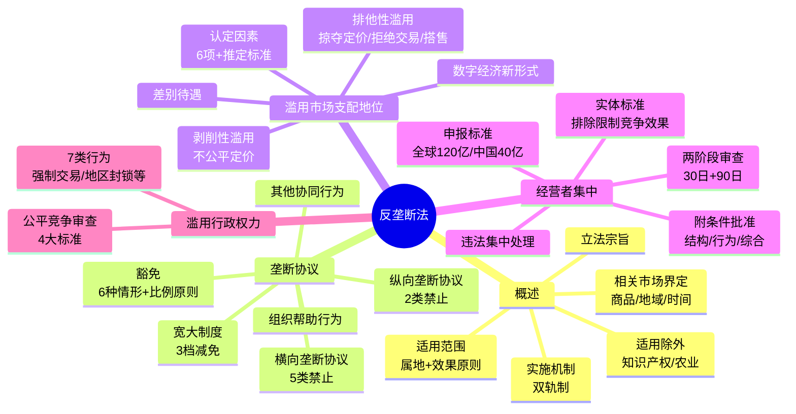

## 📍 章节定位

| 项目 | 信息 |
|------|------|
| **所属科目** | ⚖️ 经济法 |
| **难度等级** | ⭐⭐ |
| **历年分值** | 2-3 分 |
| **建议学时** | 3-4h |
| **教材地位** | 经济法体系中的竞争法核心，2022 年《反垄断法》修正后内容更新较多，必考单选、多选，偶出案例 |

## 📝 考情分析

### 历年考点分布

| 年份 | 题型 | 考点 |
|------|------|------|
| 2024 | 单选 | 适用除外领域；宽大制度减免幅度 |
| 2024 | 多选 | 反垄断法适用主体；划分市场协议表现形式 |
| 2023 | 单选 | 经营者集中违法处理措施 |
| 2023 | 多选 | 纵向垄断协议抗辩事由（安全港、豁免、无排除限制效果） |
| 2025 | 单选 | 公平竞争审查制度主管部门（指导实施 vs 组织实施） |
| 2025 | 多选 | 掠夺性定价认定及正当理由 |

### 命题规律

1. **重者恒重**：垄断协议（横向/纵向）、宽大制度、经营者集中违法处理几乎每年必考；
2. **新增必考**：2022 年修正新增的"组织帮助行为""安全港""公平竞争审查制度""约谈制度"为高频考点；
3. **数字敏感**：罚款比例（1%-10%、上一年度销售额）、宽大减免幅度（80%/30-50%/20-30%）、申报标准（120 亿/40 亿/8 亿）频繁出题；
4. **审慎判断**：滥用市场支配地位的 6 类行为均以"无正当理由"为要件，正当理由是核心命题点。

## 🧠 知识框架

## 📖 核心精讲

### 一、反垄断法概述

#### （一）立法宗旨

> 《反垄断法》第一条：预防和制止垄断行为，保护市场公平竞争，鼓励创新，提高经济运行效率，维护消费者利益和社会公共利益，促进社会主义市场经济健康发展。

四大目标层级：**保护竞争**（最基本）→ 鼓励创新 → 提高经济效率 → 提升消费者福利。

#### （二）适用范围

**1. 地域范围——属地原则 + 效果原则**

> 《反垄断法》第二条：中华人民共和国境内经济活动中的垄断行为，适用本法。中华人民共和国境外的垄断行为，对境内市场竞争产生排除、限制影响的，适用本法。

**2. 适用主体和行为**

| 主体 | 行为类型 |
|------|----------|
| 经营者 | ①垄断协议 ②滥用市场支配地位 ③经营者集中 |
| 行业协会 | 不得组织本行业经营者从事垄断行为 |
| 行政机关及授权组织 | 不得滥用行政权力排除、限制竞争 |

> **重点提示**：铁路、石油、电信、电网、烟草等国有垄断企业从事垄断协议、滥用市场支配地位或经营者集中行为，同样受《反垄断法》规制。

**3. 适用除外**

| 领域 | 规则 |
|------|------|
| 知识产权正当行使 | 不适用反垄断法；但滥用知识产权排除、限制竞争的，适用 |
| 农业生产联合 | 农产品生产、加工、销售、运输、储存中的联合或协同行为，排除适用 |

#### （三）相关市场界定

**1. 三维度**：相关商品市场、相关地域市场、相关时间市场（时间维度仅在特定情形使用）。

**2. 基本标准**：商品间的"较为紧密的相互替代性"。需求替代是主要分析视角，供给替代为补充。

**3. 假定垄断者测试（SSNIP 测试）**

- 思路：假设垄断者能否持久（1 年）小幅（5%-10%）涨价仍有利可图；
- 若能 → 单独构成相关市场；若不能 → 将替代商品纳入继续测试。

**4. 平台经济领域**：基于平台功能、商业模式、应用场景、用户群体、多边市场等因素进行替代性分析。

#### （四）实施机制

**双轨制**：行政执法 + 民事诉讼并行（民事诉讼不以行政执法查处为前置条件）。

**1. 反垄断机构（双层制）**

| 机构 | 性质 | 职责 |
|------|------|------|
| 国务院反垄断反不正当竞争委员会 | 议事协调机构（非执法机构） | 研究竞争政策、发布指南、协调执法 |
| 国家市场监督管理总局 | 国务院反垄断执法机构 | 统一执法，可授权省级市场监管部门 |

**2. 法律责任三类型**

- **行政责任**：责令停止违法行为、没收违法所得、罚款、限期恢复原状；
- **民事责任**：停止侵害、赔偿损失（含直接损失+可得利益减少，可计入律师费等合理开支）、恢复竞争；
- **刑事责任**：2022 年修正新增，"违反本法规定，构成犯罪的，依法追究刑事责任"。

**3. 经营者承诺制度（中止调查）**

| 适用范围 | 不适用情形 |
|----------|------------|
| 垄断协议、滥用市场支配地位案件 | ①已认定构成违法的；②固定价格、限制数量、分割市场三类严重横向协议 |

中止调查 / 终止调查决定**不构成**对垄断行为的认定，也不得作为相关证据。

**4. 反垄断约谈**

针对涉嫌违法主体的柔性执法方式，经反垄断执法机构主要负责人批准可对法定代表人/负责人约谈，要求提出改进措施。

### 二、垄断协议规制制度

#### （一）概念与分类

> 《反垄断法》第十六条：垄断协议是指排除、限制竞争的协议、决定或者其他协同行为。

| 类型 | 主体关系 | 危害程度 | 违法性认定 |
|------|----------|----------|------------|
| 横向垄断协议（卡特尔） | 具有竞争关系的经营者 | 最严重 | 法律推定排除、限制竞争，无须举证 |
| 纵向垄断协议 | 经营者与交易相对人 | 较复杂 | 法律假定排除、限制竞争，但可抗辩 |

#### （二）横向垄断协议（5 类禁止）

| 序号 | 类型 | 具体表现 |
|------|------|----------|
| 1 | 固定/变更价格（价格卡特尔） | 固定价格水平、变动幅度、利润水平、折扣；约定价格公式；限制自主定价权 |
| 2 | 限制数量 | 限制产量、固定产量、停止生产；限制投放量 |
| 3 | 分割市场 | 划分销售地域、市场份额、销售对象、销售收入、销售利润、商品种类；划分原材料采购区域、种类、供应商 |
| 4 | 限制创新 | 限制购买使用新技术/新设备；限制研发新技术/新产品；拒绝使用新技术 |
| 5 | 联合抵制交易 | 联合拒绝向特定经营者供货；联合拒绝采购；联合限定不得与特定经营者交易 |

**反向支付协议**（药品领域特殊横向协议）：原研药公司向仿制药公司提供利益补偿，仿制药公司承诺不质疑专利有效性或延迟进入市场，同时具备两条件的构成横向垄断协议。

#### （三）纵向垄断协议

**《反垄断法》明列禁止的 2 类**：
1. 固定向第三人转售商品的价格；
2. 限定向第三人转售商品的最低价格。

**安全港规则**（第十八条第三款）：经营者能够证明其在相关市场的市场份额低于国务院反垄断执法机构规定的标准，并符合其他条件的，不予禁止。

**经济效果对比**：

| 消极效果 | 积极效果 |
|----------|----------|
| 促成价格卡特尔、导致市场进入障碍 | 减少"搭便车"、克服销售商加价、有利于市场进入 |

#### （四）豁免制度

> **豁免 vs 适用除外**：适用外外是根本不予适用；豁免是适用过程中符合法定条件而不予禁止。

**可豁免的 6 种情形**（《反垄断法》第二十条）：
1. 改进技术、研发新产品；
2. 提高产品质量、降低成本、增进效率，统一规格标准或专业化分工；
3. 提高中小经营者经营效率、增强竞争力；
4. 节约能源、保护环境、救灾救助等社会公共利益；
5. 经济不景气时缓解销售量严重下降或生产明显过剩；
6. 保障对外贸易和对外经济合作中的正当利益（出口卡特尔）。

**比例原则**（前 5 项须证明）：①能实现目的；②为实现目的所必需；③不会严重限制相关市场竞争；④能使消费者分享利益。

#### （五）其他协同行为认定

考虑 4 因素：①经营者的市场行为一致性；②意思联络、信息交流；③相关市场结构、竞争状况；④能否作出合理解释。

民事诉讼中：原告提供①②或①③初步证据，证明可能性较大的，被告应作出合理解释，否则可认定协同行为成立。

#### （六）组织、帮助行为

| 主体 | 规则 | 民事责任 |
|------|------|----------|
| 行业协会 | 禁止制定含排限竞争内容的章程/规则；禁止召集推动达成垄断协议 | / |
| 经营者 | 不得组织其他经营者达成垄断协议；不得提供实质性帮助 | 依据《民法典》1168/1169 条承担连带责任（帮助者不知且不应知道的除外） |

#### （七）行政法律责任

| 违法主体 | 罚款标准 |
|----------|----------|
| 经营者（达成并实施） | 上一年度销售额 1%-10%；无销售额的 500 万以下 |
| 经营者（尚未实施） | 300 万以下 |
| 法定代表人/主要负责人/直接责任人员 | 100 万以下 |
| 行业协会 | 300 万以下；情节严重的撤销登记 |

#### （八）宽大制度

**适用条件**：参与垄断协议的经营者主动报告并提供"重要证据"（执法机构尚未掌握、对立案或认定起关键作用的证据）。

**减免幅度（按申请顺序）**：

| 顺位 | 减免幅度 |
|------|----------|
| 第一顺位 | 免除处罚或按不低于 80% 幅度减轻 |
| 第二顺位 | 30%-50% 幅度减轻 |
| 第三顺位 | 20%-30% 幅度减轻 |

> **重要提示**：组织、胁迫其他经营者参与达成、实施垄断协议或妨碍他人停止违法行为的，**不免除**处罚，但可相应减轻。执法机构减免罚款时可考虑相应减免没收违法所得。

### 三、滥用市场支配地位规制制度

#### （一）市场支配地位概念

> 经营者在相关市场内具有能够控制商品价格、数量或者其他交易条件，或者能够阻碍、影响其他经营者进入相关市场能力的市场地位。

**三要点**：①未必是独占者；②可单一也可多个共同具有；③法律不否定市场支配地位本身（行为主义）。

#### （二）认定因素与推定标准

**6 项认定因素**：
1. 市场份额及相关市场竞争状况；
2. 控制销售市场或原材料采购市场的能力；
3. 财力和技术条件；
4. 其他经营者的交易依赖程度；
5. 其他经营者进入相关市场的难易程度；
6. 互联网等新经济业态特殊因素（网络效应、锁定效应、数据掌握能力等）。

**推定标准（基于市场份额）**：

| 情形 | 市场份额门槛 |
|------|--------------|
| 单一经营者 | 达 1/2 |
| 两个经营者 | 合计达 2/3 |
| 三个经营者 | 合计达 3/4 |

> **例外**：多个经营者被推定共同占支配地位时，其中份额不足 1/10 的，不推定该经营者具有市场支配地位。被推定者可反证。

#### （三）6 类禁止行为

| 行为类型 | 关键要点 | 正当理由示例 |
|----------|----------|--------------|
| ① 不公平高价销售/低价购买 | 剥削性滥用，目的在超额利润 | / |
| ② 低于成本销售（掠夺性定价） | 重点考察是否低于平均可变成本 | 降价处理鲜活/季节性/即将到期商品；清偿债务、转产、歇业；合理期限内推广新产品促销 |
| ③ 拒绝交易 | 包括实质性削减、拖延、中断、设限制条件、拒绝使用必需设施 | 不可抗力；交易相对人不良信用；交易将使经营者利益不当减损；相对人不遵守平台规则 |
| ④ 限定交易 | 限制相对人只能与自己或指定经营者交易，或不得与特定经营者交易 | 满足产品安全；保护知识产权/数据安全；保护特定投资；维护平台合理经营模式 |
| ⑤ 搭售或附加不合理条件 | 被搭售商品须为独立商品 | 行业惯例；产品安全；特定技术；保护消费者利益 |
| ⑥ 差别待遇 | 条件相同的相对人在价格等交易条件上实行差别（含"大数据杀熟"） | 实际需求差异；新用户首次优惠；平台规则下的随机性交易 |

**数字经济新形式**（第二十二条第二款）：具有市场支配地位的经营者不得利用数据和算法、技术以及平台规则等从事滥用行为，如自我优待、强制"二选一"、"大数据杀熟"等。

#### （四）行政责任

经营者滥用市场支配地位的：责令停止违法行为、没收违法所得，并处上一年度销售额 **1%-10%** 罚款。

### 四、经营者集中反垄断审查制度

#### （一）概念与分类

**3 种情形**：①合并（吸收合并/新设合并）；②取得股权或资产取得控制权；③通过合同等方式取得控制权或决定性影响。

**分类**：

| 类型 | 关系 | 效果偏向 |
|------|------|----------|
| 横向集中 | 同业竞争者 | 减少竞争者数量，易形成支配地位 |
| 纵向集中 | 上下游买卖关系 | 可能产生市场进入障碍 |
| 混合集中 | 跨行业 | 降低经营风险 |

#### （二）申报标准与豁免

**强制事前申报标准**（满足任一即应申报）：

| 标准 | 全球营业额 | 中国境内营业额 |
|------|------------|----------------|
| 标准 1 | 合计 > 120 亿元 | 至少两个经营者各 > 8 亿元 |
| 标准 2 | —— | 合计 > 40 亿元，且至少两个经营者各 > 8 亿元 |

**申报豁免**（2 种情形）：
1. 参与集中的一个经营者拥有其他每个经营者 50% 以上表决权股份或资产；
2. 参与集中的每个经营者 50% 以上表决权股份或资产被同一个未参与集中的经营者拥有。

#### （三）两阶段审查程序

| 阶段 | 期限 | 决定 |
|------|------|------|
| 初步审查 | 收到符合规定文件起 **30 日** | 决定是否进一步审查；决定前不得实施集中 |
| 进一步审查 | 自决定之日起 **90 日** | 决定是否禁止；审查期间不得实施集中 |
| 延长 | 最长 **60 日** | 经营者同意延长/文件不准确需核实/情况重大变化 |

**审查期限中止**（3 种情形）：未按规定提交文件；新情况新事实需核实；需评估限制性条件且经营者提出中止请求。

**简易程序**：公示期 10 日；份额门槛 15%（同一市场）/25%（上下游或不同市场）。

#### （四）审查决定

| 决定类型 | 适用情形 |
|----------|----------|
| 禁止集中 | 具有或可能具有排除、限制竞争效果 |
| 不予禁止 | 不具有排除、限制竞争效果，或有利影响明显大于不利影响，或符合社会公共利益 |
| 附条件不予禁止 | 附加限制性条件消除不利影响 |

#### （五）限制性条件（救济措施）

| 类型 | 示例 |
|------|------|
| 结构性条件 | 剥离有形资产、知识产权、数据等 |
| 行为性条件 | 开放网络/平台、许可关键技术、终止排他性协议、修改平台规则、承诺兼容 |
| 综合性条件 | 结构性 + 行为性相结合 |

#### （六）违法实施集中处理

**4 类违法情形**：①达到标准未申报径行实施；②申报后未经批准实施；③未达标准但有排除限制效果且未按要求申报实施；④违反审查决定。

> 《反垄断法》第五十八条：具有或可能具有排除、限制竞争效果的——责令停止实施集中、限期处分股份或资产、限期转让营业、恢复到集中前状态，处上一年度销售额 **10% 以下**罚款；不具有排除、限制竞争效果的——处 **500 万元以下**罚款。

**2025 年 2 月《违法实施经营者集中行政处罚裁量权基准（试行）》**：
- 一般情形初步罚款 250 万元；
- 从轻情形 100 万元；
- 从重情形 400 万元。

### 五、滥用行政权力排除、限制竞争规制制度

#### （一）7 类禁止行为

| 序号 | 行为类型 | 表现形式 |
|------|----------|----------|
| 1 | 行政强制交易 | 限定或变相限定经营、购买、使用指定经营者商品 |
| 2 | 利用合作协议实施垄断 | 通过签订合作协议、备忘录妨碍其他经营者进入或平等待遇 |
| 3 | 地区封锁 | 歧视性收费/技术/许可；设置关卡；优先采购本地商品 |
| 4 | 排斥或限制招标投标 | 不依法发布信息；歧视性资质要求；设置无关资格条件 |
| 5 | 限制外地投资或设立分支机构 | 拒绝/强制外地投资；歧视性待遇 |
| 6 | 强制经营者从事垄断行为 | 强制达成垄断协议、滥用支配地位、违法集中 |
| 7 | 抽象行政性垄断 | 制定含有排除、限制竞争内容的规定（办法、决定、公告、通知等） |

#### （二）公平竞争审查制度

> 2024 年 8 月 1 日施行的《公平竞争审查条例》为效力层级最高的立法。

**4 大审查标准**：

| 标准 | 核心内容 |
|------|----------|
| 市场准入和退出标准 | 不得违法设置审批；不得违法授予特许经营权；不得设置不合理或歧视性准入退出条件 |
| 商品和要素自由流动标准 | 不得限制外地商品进入或本地商品输出；不得排斥外地经营者参与政府采购、招标投标 |
| 影响生产经营成本标准 | 没有法律行政法规依据或未经国务院批准，不得给予特定经营者税收优惠、财政奖励或补贴 |
| 影响生产经营行为标准 | 不得强制经营者实施垄断行为；不得超越权限制定政府指导价/定价；不得违法干预市场调节价 |

**例外规定**（4 种情形可出台）：维护国家安全和发展利益；促进科技进步、增强自主创新能力；节约能源、保护环境、救灾救助等社会公共利益；法律行政法规规定的其他情形。须满足"无对公平竞争影响更小的替代方案"+"合理实施期限或终止条件"。

**审查机制**：
- 拟由部门出台：起草单位自我审查；
- 拟由县级以上政府出台或提请人大审议：本级政府市场监管部门会同起草单位审查。

## 💡 典型例题

### 例题 1（2024 单选）——适用除外领域

根据反垄断法律制度的规定，下列各项中，属于《反垄断法》适用除外领域的是（　　）。
A. 期刊出版行业
B. 农业生产中的联合行为
C. 滥用知识产权的行为
D. 电信、电网等重点行业

**【答案】B**

**【解析】**《反垄断法》适用外外的两类：①知识产权的正当行使；②农业生产中的联合或者协同行为。选项 C"滥用"知识产权排除、限制竞争的，仍适用反垄断法；选项 D 国有垄断企业从事垄断协议、滥用市场支配地位或经营者集中行为同样受规制。

### 例题 2（2024 单选）——宽大制度

根据反垄断法律制度的规定，下列关于宽大制度减免处罚的表述中，正确的是（　　）。
A. 反垄断执法机构应当对第一个申请者免除处罚
B. 对第二个申请者，可以按照不低于 80% 的幅度减轻罚款
C. 经营者胁迫其他经营者实施垄断协议的，不得减轻处罚
D. 执法机构在减免罚款的同时可以考虑相应减免没收违法所得

**【答案】D**

**【解析】**
- A 错：第一顺位是"可以免除处罚**或者**按照不低于 80% 幅度减轻"（非"应当"）；
- B 错：80% 适用于第一顺位；第二顺位按 30%-50% 减轻；
- C 错：胁迫他人参与垄断协议的，不得**免除**处罚，但仍可相应**减轻**；
- D 对：执法机构在减免罚款的同时还可以考虑相应减免没收违法所得。

### 例题 3（2025 多选）——掠夺性定价

根据反垄断法律制度的规定，下列关于掠夺性定价行为的表述中，正确的有（　　）。
A. 掠夺性定价行为是指无正当理由以低于成本的价格销售商品的行为
B. 因歇业而降价销售商品，可构成低于成本价销售的正当理由
C. 低于成本的价格是指低于同行业其他经营者平均可变成本
D. 低于成本的价格是指低于经营者的平均不变成本

**【答案】ABC**

**【解析】**认定以低于成本的价格销售商品，应当重点考虑价格是否低于**平均可变成本**（随着生产数量变化而变动的每单位成本），不是平均不变成本。正当理由包括：①降价处理鲜活/季节性/即将到期/积压商品；②因清偿债务、转产、歇业降价销售；③合理期限内为推广新产品促销。

### 例题 4（2024 多选）——划分市场协议

根据反垄断法律制度的规定，划分市场的垄断协议表现形式有（　　）。
A. 划分商品销售地域
B. 划分原材料采购区域
C. 划分商品销售对象
D. 划分原材料供应商

**【答案】ABCD**

**【解析】**划分市场协议包括：①划分商品销售地域、市场份额、销售对象、销售收入、销售利润或销售商品的种类、数量、时间；②划分原料、半成品、零部件、相关设备等原材料的采购区域、种类、数量、时间或供应商等。原材料还包括经营者生产经营所必需的数据、技术和服务等。

### 例题 5（2023 多选）——纵向垄断协议抗辩

根据反垄断法律制度的规定，涉嫌纵向垄断协议的经营者可以提出的抗辩事由有（　　）。
A. 协议不具有排除、限制竞争效果
B. 达成垄断协议的经营者满足安全港规则
C. 纵向垄断协议不具有排除、限制竞争效果
D. 纵向垄断协议符合豁免的条件

**【答案】ABCD（选项 A 与 C 重复，实质均为抗辩事由）**

**【解析】**对于纵向垄断协议，经营者可主张：①依据第十八条第二款提出"不具有排除、限制竞争效果"的抗辩；②依据第十八条第三款主张"安全港"规则；③依据第二十条提出豁免抗辩。三种抗辩可任择其一或并用。

### 例题 6（2023 多选）——违法实施经营者集中

经营者违反反垄断法律制度的规定，未经申报实施经营者集中，且集中具有排除、限制竞争效果的，市场监管总局可以采取的措施有（　　）。
A. 处以罚款
B. 责令停止实施集中
C. 限期处分股份或者资产
D. 限期转让营业

**【答案】ABCD**

**【解析】**《反垄断法》第五十八条规定，违法实施集中且具有或可能具有排除、限制竞争效果的，执法机构可：①责令停止实施集中；②限期处分股份或资产；③限期转让营业；④采取其他必要措施恢复到集中前状态；⑤处上一年度销售额 10% 以下罚款。五项措施可并用。

### 例题 7（2025 单选）——公平竞争审查主管部门

根据反垄断法律制度的规定，负责**指导实施**公平竞争审查制度的主管部门是（　　）。
A. 国务院市场监督管理部门
B. 县级以上地方人民政府市场监督管理部门
C. 县级以上人民政府
D. 国务院反垄断委员会

**【答案】A**

**【解析】**注意区分"指导实施"与"组织实施"：
- **指导实施**：国务院市场监督管理部门（国家层面）；
- **组织实施**（本行政区域）：县级以上地方人民政府市场监督管理部门。

## 🎯 记忆口诀

### 1. 反垄断法适用主体（口诀：经营行授）

> **经营**者 + **行**业协会 + **授**权组织（行政机关和法律法规授权的具有管理公共事务职能的组织）

### 2. 横向垄断协议 5 类（口诀：价量市创抵）

> **价**（固定/变更价格）→ **量**（限制数量）→ **市**（分割市场）→ **创**（限制创新）→ **抵**（联合抵制交易）

### 3. 滥用市场支配地位 6 类（口诀：高低拒限搭差）

> **高**价销售/**低**价购买 → **拒**绝交易 → **限**定交易 → **搭**售附加不合理条件 → **差**别待遇（含大数据杀熟）

### 4. 宽大制度三档减免（口诀：一免八，二五折，三三折）

> 第一顺位：**免**除或**80%** 减轻；第二顺位：**30-50%**（约 5 折）；第三顺位：**20-30%**（约 3 折）

### 5. 经营者集中申报标准（口诀：120 全球 8 中国，40 中国 8 单家）

> 标准 1：全球 **120** 亿 + 至少 2 家中国境内各 **8** 亿；标准 2：中国境内合计 **40** 亿 + 至少 2 家各 **8** 亿

### 6. 两阶段审查期限（口诀：三九六十）

> 初步审查 **30** 日 → 进一步审查 **90** 日 → 延长最长 **60** 日

### 7. 公平竞争审查 4 标准（口诀：入流本行）

> **入**（市场准入和退出）→ **流**（商品和要素自由流动）→ **本**（影响生产经营成本）→ **行**（影响生产经营行为）

### 8. 豁免 6 情形（口诀：研质中小公衰贸）

> **研**（研发新产品）→ **质**（提高质量/降本/增效）→ **中小**（提高中小企业效率）→ **公**（社会公共利益）→ **衰**（经济不景气）→ **贸**（对外贸易正当利益）

## ✅ 同步练习

### 单项选择题

1. 根据反垄断法律制度的规定，下列关于反垄断法适用范围的表述中，正确的是（　　）。
   A. 反垄断法仅适用于中国境内经济活动中的垄断行为
   B. 港澳台地区的垄断行为直接适用本法
   C. 经营者滥用知识产权排除、限制竞争的，不适用反垄断法
   D. 农业生产者及农村经济组织在农产品生产、加工、销售等经营活动中实施的联合或协同行为，排除适用

2. 根据反垄断法律制度的规定，假定垄断者测试中"持久而小幅涨价"通常指（　　）。
   A. 持久 6 个月、涨幅 5%-10%
   B. 持久 1 年、涨幅 5%-10%
   C. 持久 1 年、涨幅 10%-15%
   D. 持久 2 年、涨幅 5% 以内

3. 根据反垄断法律制度的规定，经营者集中达到申报标准但属于关联企业之间的特定集中可以免于申报。下列情形中，可以免于申报的是（　　）。
   A. 参与集中的一个经营者拥有其他每个经营者 30% 以上有表决权的股份
   B. 参与集中的一个经营者拥有其他每个经营者 50% 以上有表决权的股份
   C. 参与集中的每个经营者 30% 以上有表决权的股份被同一个未参与集中的经营者拥有
   D. 参与集中的每个经营者 50% 以上有表决权的股份被同一参与集中的经营者拥有

4. 根据反垄断法律制度的规定，下列关于经营者承诺制度的表述中，正确的是（　　）。
   A. 经营者承诺制度适用于所有类型的垄断案件
   B. 反垄断执法机构对涉嫌固定价格的横向垄断协议案件可以接受经营者承诺
   C. 中止调查决定构成对经营者行为构成垄断行为的认定
   D. 经营者履行承诺的，反垄断执法机构可以决定终止调查

5. 根据反垄断法律制度的规定，市场份额推定经营者具有市场支配地位的标准是（　　）。
   A. 一个经营者在相关市场的市场份额达到 1/3
   B. 一个经营者在相关市场的市场份额达到 1/2
   C. 两个经营者在相关市场的市场份额合计达到 1/2
   D. 三个经营者在相关市场的市场份额合计达到 2/3

### 多项选择题

6. 根据反垄断法律制度的规定，下列主体中，属于反垄断法适用主体的有（　　）。
   A. 行政机关
   B. 行业协会
   C. 法律法规授权的具有管理公共事务职能的组织
   D. 关系国民经济命脉的行业的国有经营者

7. 根据反垄断法律制度的规定，下列属于《反垄断法》禁止的横向垄断协议的有（　　）。
   A. 固定或者变更商品价格的协议
   B. 限制购买新技术的协议
   C. 限定向第三人转售商品的最低价格的协议
   D. 联合抵制交易

8. 根据反垄断法律制度的规定，下列关于经营者集中审查程序的表述中，正确的有（　　）。
   A. 初步审查期限为 30 日
   B. 进一步审查期限为 90 日
   C. 延长审查期限最长不得超过 60 日
   D. 进一步审查期间，经营者可以实施集中

9. 根据反垄断法律制度的规定，公平竞争审查制度的审查标准包括（　　）。
   A. 市场准入和退出标准
   B. 商品和要素自由流动标准
   C. 影响生产经营成本标准
   D. 影响生产经营行为标准

10. 根据反垄断法律制度的规定，下列属于滥用行政权力排除、限制竞争行为的有（　　）。
    A. 行政机关限定单位购买其指定经营者提供的商品
    B. 行政机关对外地商品设定歧视性收费标准
    C. 行政机关排斥外地经营者参加本地招标投标活动
    D. 行政机关制定含有排除、限制竞争内容的规定

### 案例分析题

11. **【综合案例】**甲公司、乙公司、丙公司均为中国境内知名白酒生产商。2024 年 5 月，三家公司在某行业协会组织下召开"白酒行业价格协调会"，达成以下协议：①各公司将统一上调白酒出厂价 15%；②各公司划分销售区域，互不进入对方"领地"。丁公司因未参加协议被三家联合拒绝供货，损失严重。经调查，三家公司合计市场份额达 75%。

**要求**：
（1）分析三家公司达成的协议属于何种类型的垄断协议，并说明理由。
（2）分析行业协会在本案中应承担何种法律责任。
（3）分析三家公司联合拒绝供货给丁公司的行为性质。
（4）若其中一家公司主动向执法机构报告并提供重要证据，可以享受何种制度待遇？具体减免幅度如何？

**【参考答案】**

（1）三家公司达成的协议同时构成两类横向垄断协议：①**固定/变更价格协议**（统一上调出厂价 15%），属于《反垄断法》第十七条禁止的价格卡特尔；②**分割销售市场协议**（划分销售区域），属于该条禁止的划分市场协议。两类协议均属于严重限制竞争的横向垄断协议，由法律推定具有排除、限制竞争效果，无须执法机构举证。同时由于属于固定价格、分割市场两类严重横向协议，经营者**不得**援引经营者承诺制度中止调查，也**不得**援引宽大制度免除处罚（但可减轻）。

（2）行业协会组织本行业经营者达成垄断协议的，由反垄断执法机构责令改正，可以处 **300 万元以下**罚款；情节严重的，社会团体登记管理机关可以依法撤销登记。

（3）三家公司联合拒绝向丁公司供货，构成**联合抵制交易**，属于《反垄断法》第十七条禁止的横向垄断协议。同时三家公司合计市场份额达 75%，被推定共同具有市场支配地位，该行为也可能构成**滥用市场支配地位**（拒绝交易），承担上一年度销售额 1%-10% 的罚款。

（4）该公司可适用**宽大制度**。具体减免幅度按申请顺位确定：若为第一顺位申请者且提供重要证据，可以**免除处罚或按不低于 80% 幅度减轻罚款**；若为第二顺位，按 30%-50% 减轻；若为第三顺位，按 20%-30% 减轻。但因其参与组织该垄断协议（涉嫌组织者），不得免除处罚，只能相应减轻。执法机构还可考虑相应减免没收违法所得。

---

> **复习建议**：本章重点把握"原则禁止+例外豁免"的违法性认定模式，理解横向与纵向垄断协议的区别对待，掌握市场支配地位的推定标准与 6 类滥用行为的"无正当理由"要件，熟悉经营者集中两阶段审查的期限与决定类型，牢记公平竞争审查 4 大标准与行政垄断 7 类行为。
