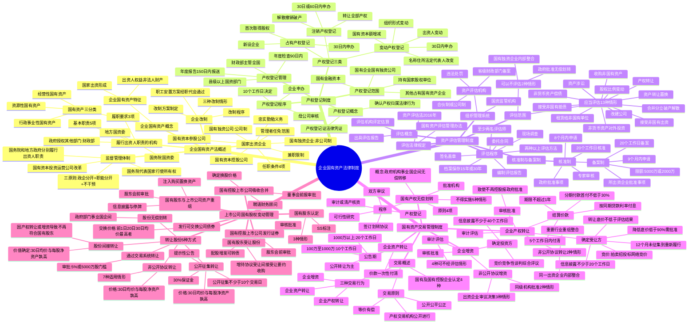

## 1. 章节定位

| 项目 | 信息 |
|------|------|
| 所属科目 | 经济法 |
| 难度等级 | 2 |
| 历年分值 | 3-5 分 |
| 建议学时 | 4-5 小时 |
| 知识关联章节 | 第1章 法律基本原理（法律渊源）；第2章 基本民事法律制度（代理、诉讼时效）；第3章 物权法律制度（所有权、担保物权）；第4章 合同法律制度（合同效力、债权债务）；第6章 公司法律制度（国有独资公司、公司治理、董监高义务）；第7章 证券法律制度（上市公司国有股权变动、信息披露）；第8章 企业破产法律制度（国有资产破产程序） |

## 2. 考情分析

本章是经济法科目的"次重点章节"，分值约 3-5 分，以客观题为主，偶有案例分析题涉及国有资产交易的程序性规则。命题重点集中在国有资产交易的程序要求（产权转让的信息披露期限、转让底价确定、价款支付方式）、资产评估的核准制与备案制、企业改制的类型与程序、上市公司国有股权变动的管理规则。

**命题规律**：本章命题注重程序性与数字性考点的记忆，重点考查企业国有资产的概念与特征、履行出资人职责的机构的职责、国家出资企业的类型、企业改制的三种情形、产权登记的三种类型（占有/变动/注销）、资产评估的核准制与备案制区分、国有资产交易的三种行为（产权转让/增资/资产转让）的程序要求、企业国有产权无偿划转的条件与程序、上市公司国有股权变动的管理规则。近年命题趋势是结合《企业国有资产交易监督管理办法》（32号令）、《上市公司国有股权监督管理办法》（36号令）出题。

**高频考点分布**：

1. **企业国有资产的概念与特征**：国有资产的三分类（经营性、行政事业性、资源性）；企业国有资产仅指经营性国有资产；企业国有资产的两个特征（国家出资形成、国家作为出资人的权益）；企业国有资产与企业法人财产的区别。
2. **监督管理体制**：国务院代表国家行使所有权；国务院和地方政府分别代表国家履行出资人职责；政企分开、社会公共管理职能与出资人职能分开、不干预企业自主经营三原则；国有资本投资运营公司改革。
3. **履行出资人职责的机构**：国务院国资委、地方国资委、政府授权其他部门（财政部对金融企业、中央文化企业等）；基本职责（5项）；履职要求（3项）。
4. **国家出资企业四种类型**：国有独资企业（非公司制）、国有独资公司（公司制）、国有资本控股公司（控股地位）、国有资本参股公司（无控股地位）；管理者任免范围、任职条件、兼职限制、义务。
5. **企业改制三种情形**：国有独资企业改为国有独资公司；国有独资企业/公司改为国有资本控股或非控股公司；国有资本控股公司改为非国有资本控股公司；改制程序与方案制定；职工安置方案经职代会审议通过。
6. **产权登记制度**：占有产权登记、变动产权登记、注销产权登记的适用情形与时限（30日/60日）；产权登记程序（申办→审核→10个工作日内决定）；年度检查（90日内）；产权登记管理机关。
7. **资产评估制度**：应当评估的13种情形；可以不评估的2种情形（无偿划转、国有独资企业内部整合）；核准制（政府批准事项、8个月内申请、20个工作日核准）vs 备案制（所出资企业批准事项、9个月内申请、20个工作日备案）；评估程序（委托→现场调查→两种以上方法→报告→档案保存15年/30年）。
8. **企业国有资产交易**：三种交易行为（产权转让、增资、资产转让）；国有及国有控股企业、国有实际控制企业的四种认定情形；交易原则（等价有偿、公开公平公正、产权交易机构公开进行）。
9. **企业产权转让程序**：审核批准（致使国家不再控股的报政府批准）；审计评估；确定受让方（信息披露不少于20个工作日、转让底价不低于评估结果、降低底价低于90%需批准、12个月未征集到需重新履行程序）；结算价款（5个工作日内付清、分期付款首付不低于30%、期限不超过1年）；非公开协议转让的两种情形。
10. **企业增资程序**：审核批准；审计评估（4种可不经评估情形）；确定投资方（信息披露不少于40个工作日）；非公开协议增资的特殊规定。
11. **企业资产转让**：公告期（100万-1000万不少于10个工作日、1000万以上不少于20个工作日）；价款一次性付清。
12. **企业国有产权无偿划转**：概念（政府机构、事业单位、国有独资企业/公司之间的无偿转移）；原则（4项）；程序（可行性研究→双方审议→审计/清产核资→签订划转协议→产权登记）；批准机构；不得实施的5种情形。
13. **上市公司国有股权变动管理**：国有股东认定（3种情形、SS标注）；国有股东转让股份的5种方式（交易系统转让、公开征集转让、非公开协议转让、无偿划转、间接转让）；转让价格底线（30日加权均价与每股净资产孰高）；国有股东受让股份；发行可交换公司债券；国有控股上市公司发行证券、吸收合并、资产重组。

**联动考查方式**：

- 与第6章公司法律制度联动：国有独资公司的特别规定、公司治理结构、董监高义务；
- 与第7章证券法律制度联动：上市公司国有股权变动、信息披露、要约收购；
- 与第3章物权法律制度联动：担保物权与国有资产交易的关系；
- 内部综合联动：资产评估 + 产权转让程序 + 价款支付方式（典型综合题模式）。

**备考建议**：

- 本章以记忆性考点为主，必须建立"管理—登记—评估—交易"四环节知识链；
- 数字考点密集：20个工作日（信息披露）、40个工作日（增资信息披露）、30日（变动登记）、60日（破产注销登记）、90日（年检）、8个月（核准申请）、9个月（备案申请）、5个工作日（付款）、30%（首付）、90%（底价降低门槛）、12个月（重新履行程序）等；
- 区分易混淆概念：核准制 vs 备案制、产权转让 vs 企业增资 vs 资产转让、公开转让 vs 非公开协议转让、国有独资企业 vs 国有独资公司、企业改制三种情形；
- 上市公司国有股权变动管理是本章难点，需结合36号令重点掌握。

## 3. 知识框架

## 4. 核心精讲

### 4.1 企业国有资产法律制度概述

#### 4.1.1 企业国有资产的概念

**国有资产**是指属于国家所有的一切财产的总称，按用途和性质分为三类：

| 国有资产类型 | 内容 | 典型例子 |
|-------------|------|---------|
| **经营性国有资产** | 国家作为出资者在企业中依法拥有的资产及权益 | 国有企业中的国家出资权益 |
| **行政事业性国有资产** | 各级政府监管的、由各部门各单位直接支配的国有资产 | 政府机关办公楼、事业单位设备 |
| **资源性国有资产** | 以资源形态存在并能带来一定经济价值的国有资源 | 国有土地、矿藏、森林、水流 |

**企业国有资产**仅指国有资产中的经营性国有资产。根据《企业国有资产法》规定，企业国有资产是指**国家对企业各种形式的出资所形成的权益**。企业国有资产具有两个特征：

| 特征 | 内容 |
|------|------|
| **国家以各种形式对企业的出资形成** | 国家对企业的出资包括货币出资和实物、知识产权、土地使用权等非货币财产作价出资 |
| **国家作为出资人对出资企业的权益** | 企业国有资产是出资人权益，不是企业法人财产；出资人对企业法人财产不具有直接所有权，其对企业享有的是出资人权利（资产收益、参与重大决策、选择管理者） |

> **重要区分**：企业国有资产 ≠ 企业法人财产。出资人将出资投入企业形成的厂房、机器设备等具体财产，属于企业法人财产权所指向的对象，由企业依法享有占有、使用、收益和处分的权利。出资人享有的是出资人权利，而非对具体财产的直接所有权。

《企业国有资产法》于2008年10月28日通过，自2009年5月1日起施行。

#### 4.1.2 企业国有资产的监督管理体制

《企业国有资产法》对企业国有资产的监督管理体制作出了明确规定：

| 要点 | 内容 |
|------|------|
| **所有权归属** | 企业国有资产属于国家所有（全民所有），**国务院代表国家**行使企业国有资产所有权 |
| **出资人职责** | 国务院和地方人民政府依照法律、行政法规的规定，**分别代表国家**对国家出资企业履行出资人职责，享有出资人权益 |
| **国务院履行职责范围** | 关系国民经济命脉和国家安全的大型国家出资企业、重要基础设施和重要自然资源等领域的国家出资企业 |
| **地方政府履行职责范围** | 其他的国家出资企业 |

**三原则**：国务院和地方政府应当依照以下原则履行出资人职责：
1. **政企分开**；
2. **社会公共管理职能与企业国有资产出资人职能分开**；
3. **不干预企业依法自主经营**。

**国有资本授权经营体制改革**（2015年《关于改革和完善国有资产管理体制的若干意见》）：

| 改革举措 | 内容 |
|---------|------|
| **改组组建国有资本投资、运营公司** | 通过划拨国有股权、国有资本经营预算注资组建；以股权运作、价值管理、有序进退方式促进国有资本合理流动 |
| **明确国资监管机构与投资运营公司关系** | 政府授权国资监管机构对投资运营公司履行出资人职责；投资运营公司对授权范围内国有资本履行出资人职责 |
| **界定投资运营公司与所出资企业关系** | 依据公司法行使股东权利，以出资额为限承担责任；财务性持股或战略性核心业务控股 |

**金融企业国有资产管理**：财政部门是金融企业国有资产的监督管理部门。财政部负责金融机构国有资产的基础管理工作（清产核资、资本金权属界定和登记、统计、分析、评估，转让、划转处置管理，监交国有资产收益）。

#### 4.1.3 履行出资人职责的机构

**履行出资人职责的机构**是指根据本级人民政府的授权，代表本级人民政府对国家出资企业履行出资人职责的机构、部门。

| 机构类型 | 职责 |
|---------|------|
| **国务院国有资产监督管理委员会（国务院国资委）** | 代表国务院对中央所属企业（不含金融类企业）的国有资产履行出资人职责 |
| **地方人民政府设立的国有资产监督管理机构（地方国资委）** | 代表地方人民政府对国家出资企业履行出资人职责 |
| **国务院和地方政府授权的其他部门、机构** | 如财政部对金融行业国有资产、中央文化企业、中国铁路、中国烟草、中国邮政集团等履行出资人职责 |

**履行出资人职责的机构的基本职责**（5项）：

1. 代表本级人民政府对国家出资企业依法享有资产收益、参与重大决策和选择管理者等出资人权利；
2. 依照法律、行政法规的规定，制定或者参与制定国家出资企业的章程；
3. 对于须经本级人民政府批准的履行出资人职责的重大事项，报请本级人民政府批准；
4. 委派股东代表参加国有资本控股公司、国有资本参股公司召开的股东会会议（股东代表应按委派机构指示提出提案、发表意见、行使表决权，并报告履职情况）；
5. 定期向本级人民政府报告企业国有资产总量、结构、变动、收益等汇总分析情况。

**履职要求**（3项）：
1. 依照法律、行政法规以及企业章程履行出资人职责，保障出资人权益，防止企业国有资产损失；
2. 维护企业作为市场主体依法享有的权利，除依法履行出资人职责外，不得干预企业经营活动；
3. 对本级人民政府负责，接受监督和考核，对企业国有资产的保值增值负责。

#### 4.1.4 国家出资企业

**国家出资企业**是指国家出资的国有独资企业、国有独资公司，以及国有资本控股公司、国有资本参股公司。

| 类型 | 组织形式 | 特点 |
|------|---------|------|
| **国有独资企业** | 依《全民所有制工业企业法》设立，非公司制 | 企业全部注册资本均为国有资本；高级管理人员由政府或履行出资人职责的机构直接任免；政府派出监事组成监事会 |
| **国有独资公司** | 依《公司法》设立，公司制 | 企业全部资本均为国有资本；2023年修订《公司法》对国有独资公司作了专门规定 |
| **国有资本控股公司** | 依《公司法》设立，有限责任公司或股份有限公司 | 国有资本出资人具有控股股东地位（出资额/持股超过50%，或虽低于50%但表决权足以对股东会决议产生重大影响） |
| **国有资本参股公司** | 依《公司法》设立 | 公司资本包含部分国有资本，但国有资本没有控股地位 |

> **子企业的出资人权利行使**：由国家出资企业出资设立的子企业不属于国家直接出资的企业。对国家出资企业履行出资人职责的机构，应通过对国家出资企业行使出资人权利，决定或参与决定母企业的对外投资，并通过母企业行使对子企业的出资人权利。

**国家出资企业管理者的任免范围**：

| 企业类型 | 任免范围 |
|---------|---------|
| 国有独资企业 | 履行出资人职责的机构任免经理、副经理、财务负责人和其他高级管理人员 |
| 国有独资公司 | 履行出资人职责的机构任免董事长、副董事长、董事、监事会主席和监事 |
| 国有资本控股公司、参股公司 | 向股东会提出董事、监事人选 |

**管理者任职条件**（4项）：①有良好的品行；②有符合职位要求的专业知识和工作能力；③有能够正常履行职责的身体条件；④法律、行政法规规定的其他条件。

**兼职限制**：

| 情形 | 限制 |
|------|------|
| 国有独资企业、国有独资公司的董事、高级管理人员 | 未经履行出资人职责的机构同意，不得在其他企业兼职 |
| 国有资本控股公司、参股公司的董事、高级管理人员 | 未经股东会同意，不得在经营同类业务的其他企业兼职 |
| 国有独资公司的董事长 | 未经履行出资人职责的机构同意，不得兼任经理 |
| 国有资本控股公司的董事长 | 未经股东会同意，不得兼任经理 |
| 所有董事、高级管理人员 | 不得兼任监事 |

**管理者义务**：董事、监事、高级管理人员应遵守法律、行政法规和企业章程，对企业负有**忠实义务和勤勉义务**，不得利用职权收受贿赂或取得其他非法收入和不正当利益，不得侵占、挪用企业资产，不得超越职权或违反程序决定企业重大事项。

#### 4.1.5 企业改制

**企业改制的三种情形**：

| 情形 | 内容 |
|------|------|
| **国有独资企业改为国有独资公司** | 依《全民所有制工业企业法》登记的国有独资企业，依《公司法》改制为国有独资公司 |
| **国有独资企业、国有独资公司改为国有资本控股公司或非国有资本控股公司** | 吸收其他法人、自然人出资，或出让部分资产，改制为多主体投资的公司 |
| **国有资本控股公司改为非国有资本控股公司** | 吸收其他法人、自然人改制为国有资本只参股不控股的公司，或转让全部国有资本出资 |

**企业改制的程序**：
1. 由履行出资人职责的机构决定或由公司股东会决定；
2. 重要的国有独资企业、国有独资公司、国有资本控股公司的改制，履行出资人职责的机构在作出决定或向股东代表作出指示前，应将改制方案报请**本级人民政府批准**。

**改制方案的制定**：应载明改制后的企业组织形式、企业资产和债权债务处理方案、股权变动方案、改制的操作程序、资产评估和财务审计等中介机构的选聘等事项。涉及重新安置企业职工的，还应制定**职工安置方案**，并经**职工代表大会或职工大会审议通过**。

> **职工安置的关键规则**：
> - 改制为国有控股企业的，继续履行改制前企业与留用职工签订的劳动合同；留用职工在改制前企业的工作年限合并计算为改制后企业的工作年限；原企业不得向继续留用职工支付经济补偿金。
> - 改制为非国有企业的，对解除劳动合同且不再继续留用的职工，应支付经济补偿金。企业国有产权持有单位不得强迫职工将经济补偿金等费用用于对改制后企业的投资或借给改制后企业使用。

### 4.2 企业国有资产产权登记制度

#### 4.2.1 产权登记的概念与范围

**企业国有资产产权登记**是指履行出资人职责的机构代表政府对占有国有资产的各类企业的资产、负债、所有者权益等产权状况进行登记，依法确认产权归属关系的行为。履行出资人职责的机构向企业颁发**《中华人民共和国企业国有资产产权登记证》**，该登记证是依法确认企业产权归属关系的法律凭证，也是企业的资信证明文件。

**产权登记的范围**：

| 应当办理产权登记的主体 | 特殊规定 |
|----------------------|---------|
| 国有企业、国有独资公司、持有国家股权的单位以及以其他形式占有国有资产的企业 | — |
| 国有控股金融机构拥有实际控制权的境内外各级企业及投资参股企业 | 包括非金融企业 |
| 国家出资企业及国家出资企业（不含国有资本参股公司）拥有实际控制权的境内外各级企业及其投资参股企业 | 所属事业单位视为子企业登记 |

**不进行产权登记的股权**（为交易目的持有）：
1. 为了赚取差价从二级市场购入的上市公司股权；
2. 为了近期内（一年以内）出售而持有的其他股权。

**"拥有实际控制权"的认定**：直接或间接合计持股比例超过50%，或持股比例虽未超过50%但为第一大股东，并通过股东协议、公司章程、董事会决议或其他协议安排能够实际支配企业行为。

#### 4.2.2 产权登记的三种类型

| 登记类型 | 适用情形 | 时限要求 |
|---------|---------|---------|
| **占有产权登记** | 因投资、分立、合并而新设企业；因收购、投资入股而首次取得企业股权；其他应当办理占有产权登记的情形 | 已取得法人资格的企业在细则实施后申办；申请取得法人资格的企业于申请企业注册登记前30日内办理 |
| **变动产权登记** | 企业名称、住所或法定代表人改变；企业组织形式发生变动；企业国有资本额发生增减变动；企业国有资本出资人发生变动；其他变动情形 | 第(1)项情形：市场监督管理部门核准变动登记后30日内；第(2)-(5)项：自出资人或有关部门批准、股东会或董事会作出决定之日起30日内，在申请变更登记前申办 |
| **注销产权登记** | 企业解散、被依法撤销或被依法宣告破产；企业转让全部国有资产产权或改制后不再设置国有股权；其他情形 | 解散：自批准之日起30日内；被撤销：自政府决定之日起30日内；被宣告破产：自法院裁定之日起60日内由破产清算机构申办；转让全部产权：自批准后30日内 |

#### 4.2.3 产权登记的程序与管理

**产权登记程序**：
1. 企业按规定填写产权登记表，提交有关文件资料；
2. 经政府管理的企业或企业集团母公司出具审核意见；
3. 产权登记机关收到符合规定的全部文件资料后，发给《产权登记受理通知书》，于**10个工作日内**作出准予或不予登记的决定；
4. 不予登记的，自决定之日起**3日内**通知申请人并说明原因。

**产权登记管理机关**：县级以上各级政府负责国有资产管理的部门。财政部主管全国产权登记工作。

**年度检查**：企业应当于每个公历年度终了后**90日内**，办理企业年检登记之前，向原产权登记机关申办产权登记年度检查。下级产权登记机关应于每个公历年度终了后**150日内**编制并报送产权登记与产权变动状况分析报告。

### 4.3 企业国有资产评估管理制度

#### 4.3.1 评估的概念与范围

**资产评估**是指资产评估机构及其资产评估专业人员根据委托对不动产、动产、无形资产、企业价值、资产损失或者其他经济权益进行评定、估算，并出具资产评估报告的专业服务行为。

**应当进行资产评估的13种情形**（国家出资企业及其各级子企业有下列行为之一）：

| 序号 | 情形 |
|------|------|
| 1 | 整体或部分改建为有限责任公司或股份有限公司 |
| 2 | 以非货币资产对外投资 |
| 3 | 合并、分立、破产、解散 |
| 4 | 非上市公司国有股东股权比例变动 |
| 5 | 产权转让 |
| 6 | 资产转让、置换 |
| 7 | 整体资产或部分资产租赁给非国有单位 |
| 8 | 以非货币资产偿还债务 |
| 9 | 资产涉讼 |
| 10 | 收购非国有单位的资产 |
| 11 | 接受非国有单位以非货币资产出资 |
| 12 | 接受非国有单位以非货币资产抵债 |
| 13 | 法律、行政法规规定的其他需要评估的事项 |

> 金融企业除以上情形外，有资产拍卖、债权转股权、债务重组、接受非货币性资产抵押或质押、处置不良资产等情形的也应当委托评估。

**可以不进行资产评估的2种情形**：
1. 经各级人民政府或其履行出资人职责的机构批准，对企业整体或部分资产实施**无偿划转**；
2. 国有独资企业与其下属独资企业（事业单位）之间或其下属独资企业（事业单位）之间的**合并、资产（产权）置换和无偿划转**。

#### 4.3.2 核准制与备案制

| 比较项 | 核准制 | 备案制 |
|-------|--------|--------|
| **适用范围** | 经各级人民政府批准经济行为的事项涉及的资产评估项目 | 经国资监管机构或所出资企业批准经济行为的事项涉及的资产评估项目 |
| **核准/备案机关** | 履行出资人职责的机构（金融企业：中央报财政部，地方报本级财政部门） | 国资监管机构或中央企业 |
| **申请时限** | 自评估基准日起**8个月内** | 自评估基准日起**9个月内** |
| **办理时限** | **20个工作日**内完成核准 | **20个工作日**内办理备案手续 |
| **限额规定** | — | 国家授权投资机构中央企业：5000万元以下自行备案，以上报国资委；其他中央企业：2000万元以下自行备案，以上报国资委 |

**核准制的审核事项**（9项）：①经济行为是否获批准；②评估机构是否具备资质；③评估人员是否具备执业资格；④评估基准日选择是否适当；⑤评估范围与经济行为批准文件是否一致；⑥评估依据是否适当；⑦企业是否对资料真实性作出承诺；⑧评估过程是否符合准则；⑨专家是否达成一致意见。

#### 4.3.3 评估程序

| 步骤 | 内容 |
|------|------|
| **1. 委托** | 委托人依法选择评估机构，订立委托合同；委托人对提供的权属证明、财务会计信息和其他资料的真实性、完整性和合法性负责 |
| **2. 承办** | 评估机构指定至少**两名**相应专业类别的评估师承办；现场调查、收集资料、核查验证、分析整理 |
| **3. 评估方法** | 除依准则只能选择一种方法外，应选择**两种以上**评估方法，经综合分析形成评估结论 |
| **4. 报告** | 评估报告由至少两名评估师签名并加盖评估机构印章；评估机构进行内部审核 |
| **5. 档案** | 评估档案保存期限不少于**15年**；属于法定评估业务的，保存期限不少于**30年** |

> **评估机构违法处罚**：违反规定的，警告+责令停业1-6个月+没收违法所得+处违法所得1-5倍罚款；情节严重的吊销营业执照；出具虚假评估报告的，责令停业6个月-1年。

### 4.4 企业国有资产交易管理制度

#### 4.4.1 交易概述

**企业国有资产交易**是指履行出资人职责的机构、国有及国有控股企业、国有实际控制企业转让产权，或者增加资本、进行重大资产转让的活动。

**三种交易行为**：

| 交易行为 | 内容 |
|---------|------|
| **企业产权转让** | 转让其对企业各种形式出资所形成权益的行为 |
| **企业增资** | 增加资本的行为（政府以增加资本金方式对国家出资企业的投入除外） |
| **企业资产转让** | 重大资产转让行为 |

**国有及国有控股企业、国有实际控制企业的四种认定情形**：
1. 政府部门、机构、事业单位出资设立的国有独资企业（公司），以及上述单位、企业直接或间接合计持股为100%的国有全资企业；
2. 上述第(1)项中所列单位、企业单独或共同出资，合计拥有产（股）权比例超过50%且其中之一为最大股东的企业；
3. 上述第(1)、(2)项中所列企业对外出资，拥有股权比例超过50%的各级子企业；
4. 政府部门、机构、事业单位、单一国有及国有控股企业直接或间接持股比例未超过50%但为第一大股东，并且通过股东协议、公司章程、董事会决议或其他协议安排能够对其实际支配的企业。

**交易原则**：等价有偿和公开、公平、公正原则；在依法设立的**产权交易机构**中公开进行；交易标的应当权属清晰。

#### 4.4.2 企业产权转让

**（一）审核批准**

履行出资人职责的机构负责审核国家出资企业的产权转让事项。因产权转让致使国家不再拥有所出资企业控股权的，须由履行出资人职责的机构报**本级人民政府批准**。

**（二）审计评估**

产权转让事项经批准后，由转让方委托会计师事务所对转让标的企业进行审计。产权转让价格应以经核准或备案的评估结果为基础确定。

**（三）确定受让方**

| 程序要点 | 具体要求 |
|---------|---------|
| **信息披露** | 正式披露信息时间不得少于**20个工作日**；导致实际控制权转移的，应在获批后10个工作日内进行信息预披露，时间不少于20个工作日 |
| **转让底价** | 首次正式信息披露的转让底价不得低于经核准或备案的评估结果 |
| **降低底价** | 新的转让底价低于评估结果的**90%**时，应经转让行为批准单位书面同意 |
| **重新履行** | 自首次正式披露信息之日起超过**12个月**未征集到合格受让方的，应重新履行审计、评估、信息披露等程序 |
| **竞价方式** | 拍卖、招投标、网络竞价及其他竞价方式 |

**（四）结算交易价款**

| 付款方式 | 要求 |
|---------|------|
| **一次性付清** | 原则上自合同生效之日起**5个工作日**内一次付清 |
| **分期付款** | 首期付款不得低于总价款的**30%**，在合同生效之日起5个工作日内支付；其余款项应提供合法有效担保，按同期银行贷款利率支付利息，付款期限不得超过**1年** |

**（五）非公开协议方式转让的特殊规定**

可以采取非公开协议转让方式的**两种情形**：
1. 涉及主业处于关系国家安全、国民经济命脉的重要行业和关键领域企业的重组整合，对受让方有特殊要求，企业产权需要在国有及国有控股企业之间转让的，经履行出资人职责的机构批准；
2. 同一国家出资企业及其各级控股企业或实际控制企业之间因实施内部重组整合进行产权转让的，经该国家出资企业审议决策。

非公开协议转让价格不得低于经核准或备案的评估结果。但同一国家出资企业内部实施重组整合（转让方和受让方为该出资企业及其直接或间接全资拥有的子企业）等情形，转让价格可以评估报告或最近一期审计报告确认的净资产值为基础确定。

#### 4.4.3 企业增资

**审核批准**：履行出资人职责的机构负责审核国家出资企业的增资行为。因增资致使国家不再拥有控股权的，须报本级人民政府批准。

**可以不经评估的4种情形**（依《公司法》、企业章程履行决策程序后）：
1. 增资企业原股东同比例增资的；
2. 履行出资人职责的机构对国家出资企业增资的；
3. 国有控股或国有实际控制企业对其独资子企业增资的；
4. 增资企业和投资方均为国有独资或国有全资企业的。

**确定投资方**：通过产权交易机构网站对外披露信息公开征集投资方，时间不得少于**40个工作日**。通过资格审查的意向投资方数量较多时，可以采用竞价、竞争性谈判、综合评议等方式进行多轮次遴选。

**非公开协议方式增资**：
- 经同级履行出资人职责的机构批准的2种情形（国有资本布局结构调整需要、战略合作伙伴需要）；
- 经国家出资企业审议决策的3种情形（出资企业直接或指定子企业参与增资、债权转股权、原股东增资）。

#### 4.4.4 企业资产转让

企业一定金额以上的生产设备、房产、在建工程以及土地使用权、债权、知识产权等资产对外转让，应在产权交易机构公开进行。

| 转让底价 | 信息公告期 |
|---------|-----------|
| 高于100万元、低于1000万元 | 不少于**10个工作日** |
| 高于1000万元 | 不少于**20个工作日** |

资产转让价款原则上一次性付清。

#### 4.4.5 企业国有产权无偿划转

**概念**：企业国有产权在政府机构、事业单位、国有独资企业、国有独资公司之间的无偿转移行为。

**原则**（4项）：①符合国家法律法规和产业政策；②符合国有经济布局和结构调整需要；③有利于优化产业结构和提高企业核心竞争力；④划转双方协商一致。

**程序**：

| 步骤 | 内容 |
|------|------|
| **1. 可行性研究** | 编制无偿划转可行性论证报告 |
| **2. 双方审议** | 国有独资企业由总经理办公会议审议（已设董事会的由董事会审议）；国有独资公司由董事会审议（未设董事会的由总经理办公会议审议）；职工分流安置事项经职代会审议通过 |
| **3. 审计或清产核资** | 以中介机构审计报告或经批准的清产核资结果为依据 |
| **4. 签订划转协议** | 协议生效前不得履行或部分履行 |
| **5. 产权登记** | 依据批复文件及划转协议进行账务调整，办理产权登记 |

**不得实施无偿划转的5种情形**：
1. 被划转企业主业不符合划入方主业及发展规划的；
2. 中介机构对被划转企业划转基准日的财务报告出具否定意见、无法表示意见或保留意见的审计报告的；
3. 无偿划转涉及的职工分流安置事项未经被划转企业职代会审议通过的；
4. 被划转企业或有负债未有妥善解决方案的；
5. 划出方债务未有妥善处置方案的。

### 4.5 上市公司国有股权变动管理

#### 4.5.1 国有股东的认定

**国有股东**是指符合以下情形之一的企业和单位，其证券账户标注**"SS"**：
1. 政府部门、机构、事业单位、境内国有独资或全资企业；
2. 上述第(1)项中所述单位或企业独家持股比例超过50%或合计持股比例超过50%且其中之一为第一大股东的境内企业；
3. 上述第(2)项中所述企业直接或间接持股的各级境内独资或全资企业。

> 国有出资的有限合伙企业**不作国有股东认定**，其所持上市公司股份按有关规定管理。

#### 4.5.2 国有股东转让所持上市公司股份的五种方式

**（一）通过证券交易系统转让**

应报履行出资人职责的机构审核批准的三种情形：
1. 国有控股股东转让可能导致持股比例低于合理持股比例的；
2. 总股本不超过10亿股的，国有控股股东一个会计年度内累计净转让达到总股本5%以上的；总股本超过10亿股的，累计净转让达到5000万股及以上的；
3. 国有参股股东一个会计年度内累计净转让达到总股本5%以上的。

**（二）公开征集转让**

| 程序要点 | 要求 |
|---------|------|
| **提示性公告** | 履行内部决策程序后书面告知上市公司，由上市公司依法披露；可能导致控股权转移的应申请停牌 |
| **公开征集期限** | 不得少于**10个交易日** |
| **转让价格** | 不得低于提示性公告日前**30个交易日**每日加权平均价格的算术平均值与最近一个会计年度经审计的**每股净资产值**两者之中的较高者 |
| **保证金** | 协议签订后5个工作日内收取不低于转让价款**30%**的保证金 |
| **价款结清** | 其余价款在股份过户前全部结清 |
| **过户前限制** | 受让方人员不能提前进入上市公司董事会和经理层 |

可能导致控股权转移的，应聘请具有上市公司并购重组财务顾问业务资格的证券公司等担任财务顾问。

**（三）非公开协议转让**

可以非公开协议转让的**7种情形**：
1. 上市公司连续两年亏损并存在退市风险或严重财务危机，受让方提出重大资产重组计划及时间表的；
2. 企业主业处于关系国家安全、国民经济命脉的重要行业和关键领域，主要承担重大专项任务，对受让方有特殊要求的；
3. 为实施国有资源整合或资产重组，在国有股东、潜在国有股东之间转让的；
4. 上市公司回购股份涉及国有股东所持股份的；
5. 国有股东因接受要约收购方式转让的；
6. 国有股东因解散、破产、减资、被依法责令关闭等原因转让的；
7. 国有股东以所持上市公司股份出资的。

转让价格不得低于提示性公告日前30个交易日每日加权平均价格的算术平均值与最近一个会计年度经审计的每股净资产值两者之中的较高者。

**特殊情形的定价**：
- 国有股东为实施资源整合或重组上市公司并在转让完成后全部回购主业资产的，股份转让价格由国有股东根据中介机构出具的合理估值结果确定；
- 为实施国有资源整合或资产重组在国有股东之间转让且国有权益并不因此减少的，应根据每股净资产值、净资产收益率、合理市盈率等因素合理确定。

**（四）股份无偿划转**

政府部门、机构、事业单位、国有独资或全资企业之间可以依法无偿划转所持上市公司股份。

**（五）股份间接转让**

因国有产权转让或增资扩股等原因导致国有股东不再符合规定情形的行为。

| 要点 | 要求 |
|------|------|
| **信息披露** | 履行内部决策程序后书面通知上市公司进行信息披露；涉及国有控股股东的应申请停牌 |
| **股份价值确定** | 不得低于提示性公告日前30个交易日每日加权平均价格的算术平均值与最近一个会计年度经审计的每股净资产值两者之中的较高者 |
| **基准日一致性** | 上市公司股份价值确定的基准日应与国有股东资产评估的基准日一致，且与决策日期相差不得超过**1个月** |
| **审批时点** | 在产权转让或增资扩股协议签订后、产权交易机构出具交易凭证前报履行出资人职责的机构审核批准 |

#### 4.5.3 国有股东受让上市公司股份

国有股东受让上市公司股份行为包括通过证券交易系统增持、协议受让、间接受让、要约收购和认购上市公司发行股票等。按照审批权限由国家出资企业审核批准或由履行出资人职责的机构审核批准。

#### 4.5.4 国有股东发行可交换公司债券

**交换价格**：应不低于债券募集说明书公告日前**1个交易日、前20个交易日、前30个交易日**该上市公司股票均价中的**最高者**。

#### 4.5.5 国有股东所控股上市公司发行证券

包括配售股份、向不特定对象公开募集股份、向特定对象发行股份以及发行可转换公司债券等。应当在**股东会召开前**按照审批权限由国家出资企业审核批准或由履行出资人职责的机构审核批准。

#### 4.5.6 国有股东所控股上市公司吸收合并

| 步骤 | 内容 |
|------|------|
| **聘请财务顾问** | 对吸收合并的双方进行尽职调查和内部核查 |
| **确定换股价格** | 根据股票交易价格并参考可比交易案例合理确定 |
| **审批** | 在上市公司董事会审议吸收合并方案前报履行出资人职责的机构审核批准 |

#### 4.5.7 国有股东与上市公司进行资产重组

指国有股东向上市公司注入、购买或置换资产并涉及国有股东所持上市公司股份发生变化的情形。

| 步骤 | 内容 |
|------|------|
| **信息披露** | 内部决策后书面通知上市公司依法披露并申请停牌；在董事会审议前将可行性研究报告报预审核 |
| **审批** | 经上市公司董事会审议通过后，在股东会召开前按照审批权限由国家出资企业审核批准或由履行出资人职责的机构审核批准 |

## 5. 典型例题

### 一、单项选择题

1. 根据企业国有资产法律制度的规定，下列关于企业国有资产概念的表述中，正确的是（　）。
A. 企业国有资产是指国家出资企业的各项具体财产
B. 企业国有资产包括经营性国有资产、行政事业性国有资产和资源性国有资产
C. 企业国有资产是国家对企业各种形式的出资所形成的权益
D. 出资人对企业法人财产享有直接所有权

**答案**：C

**解析**：企业国有资产仅指国有资产中的经营性国有资产（选项B错误），是国家作为出资人对出资企业所享有的权益，而不是指国家出资企业的各项具体财产（选项A错误）。出资人对企业法人财产不具有直接所有权，其对企业享有的是出资人权利（选项D错误）。

2. 根据企业国有资产交易管理制度的规定，企业产权转让首次正式信息披露的转让底价不得低于（　）。
A. 经核准或备案的评估结果
B. 经核准或备案的评估结果的90%
C. 转让标的企业的净资产值
D. 转让标的企业的注册资本

**答案**：A

**解析**：产权转让项目首次正式信息披露的转让底价，不得低于经核准或备案的转让标的评估结果。新的转让底价低于评估结果的90%时，应当经转让行为批准单位书面同意。

3. 根据企业国有资产评估管理制度的规定，企业国有资产评估项目的核准申请应当在评估基准日起（　）内提出。
A. 6个月
B. 8个月
C. 9个月
D. 12个月

**答案**：B

**解析**：核准制下，企业应自评估基准日起8个月内向履行出资人职责的机构提出核准申请；备案制下，应自评估基准日起9个月内提出备案申请。

4. 根据企业国有资产交易管理制度的规定，企业产权转让采用分期付款方式的，首期付款不得低于总价款的（　），付款期限不得超过（　）。
A. 20%；6个月
B. 30%；1年
C. 30%；2年
D. 50%；1年

**答案**：B

**解析**：采用分期付款方式的，首期付款不得低于总价款的30%，在合同生效之日起5个工作日内支付；其余款项应当提供转让方认可的合法有效担保，并按同期银行贷款利率支付延期付款期间的利息，付款期限不得超过1年。

5. 根据上市公司国有股权变动管理的规定，国有股东公开征集转让上市公司股份的价格不得低于提示性公告日前30个交易日的每日加权平均价格的算术平均值与最近一个会计年度上市公司经审计的每股净资产值两者之中的（　）。
A. 较低者
B. 较高者
C. 平均值
D. 加权平均值

**答案**：B

**解析**：国有股东公开征集转让上市公司股份的价格不得低于提示性公告日前30个交易日的每日加权平均价格的算术平均值与最近一个会计年度上市公司经审计的每股净资产值两者之中的较高者。

### 二、多项选择题

1. 根据企业国有资产法律制度的规定，下列关于国家出资企业的表述中，正确的有（　）。
A. 国有独资企业是依照《全民所有制工业企业法》设立的非公司制企业
B. 国有独资公司是依照《公司法》设立的公司制企业
C. 国有资本控股公司包括有限责任公司和股份有限公司
D. 国有资本参股公司中国有资本具有控股地位

**答案**：ABC

**解析**：国有资本参股公司是指公司资本包含部分国有资本，但国有资本没有控股地位的公司（选项D错误）。选项A、B、C的表述均正确。

2. 根据企业国有资产评估管理制度的规定，下列情形中，应当对相关资产进行评估的有（　）。
A. 整体或部分改建为有限责任公司或股份有限公司
B. 以非货币资产对外投资
C. 经政府批准对企业整体资产实施无偿划转
D. 产权转让

**答案**：ABD

**解析**：经各级人民政府或其履行出资人职责的机构批准，对企业整体或部分资产实施无偿划转的，可以不对相关国有资产进行评估（选项C不选）。选项A、B、D均属于应当评估的情形。

3. 根据企业国有产权无偿划转的规定，下列情形中不得实施无偿划转的有（　）。
A. 被划转企业主业不符合划入方主业及发展规划的
B. 中介机构出具保留意见审计报告的
C. 职工分流安置事项未经职代会审议通过的
D. 被划转企业或有负债未有妥善解决方案的

**答案**：ABCD

**解析**：不得实施无偿划转的5种情形包括：(1)被划转企业主业不符合划入方主业及发展规划的；(2)中介机构出具否定意见、无法表示意见或保留意见审计报告的；(3)职工分流安置事项未经职代会审议通过的；(4)被划转企业或有负债未有妥善解决方案的；(5)划出方债务未有妥善处置方案的。四个选项均属于不得实施无偿划转的情形。

4. 根据企业国有资产交易管理制度的规定，下列关于企业增资的表述中，正确的有（　）。
A. 企业增资通过产权交易机构网站对外披露信息公开征集投资方，时间不得少于40个工作日
B. 增资企业原股东同比例增资的，可以依据评估报告或最近一期审计报告确定企业资本及股权比例
C. 因增资致使国家不再拥有所出资企业控股权的，须报本级人民政府批准
D. 通过资格审查的意向投资方数量较多时，可以采用竞价、竞争性谈判、综合评议等方式进行多轮次遴选

**答案**：ABCD

**解析**：四个选项的表述均符合企业国有资产交易监督管理办法关于企业增资的规定。

### 三、案例分析题

甲公司为一家国有独资公司，持有上市公司乙公司35%的股份，为乙公司第一大股东。2024年3月，甲公司拟通过公开征集转让方式转让其所持乙公司15%的股份，可能导致乙公司控股权发生转移。已知提示性公告日前30个交易日乙公司股票每日加权平均价格的算术平均值为每股10元，最近一个会计年度乙公司经审计的每股净资产值为每股8元。甲公司已于2024年3月1日履行内部决策程序。

要求：根据上述资料，回答下列问题：

(1) 甲公司公开征集转让乙公司股份，公开征集期限不得少于多少个交易日？转让价格不得低于每股多少元？说明理由。

(2) 甲公司在公开征集转让中，是否应当聘请财务顾问？说明理由。

(3) 甲公司在股份转让协议签订后，应在多少个工作日内收取不低于多少比例的保证金？说明理由。

(4) 在全部转让价款支付完毕前，能否办理股份过户登记手续？说明理由。

**答题思路**：

(1) **公开征集期限不得少于10个交易日；转让价格不得低于每股10元。**

根据《上市公司国有股权监督管理办法》的规定，公开征集信息对受让方的资格条件不得设定指向性或违反公平竞争要求的条款，公开征集期限不得少于10个交易日。国有股东公开征集转让上市公司股份的价格不得低于提示性公告日前30个交易日的每日加权平均价格的算术平均值（10元）与最近一个会计年度上市公司经审计的每股净资产值（8元）两者之中的较高者，即10元。

(2) **应当聘请财务顾问。**

根据规定，公开征集转让可能导致上市公司控股权转移的，国有股东应当聘请具有上市公司并购重组财务顾问业务资格的证券公司、证券投资咨询机构或者其他符合条件的财务顾问机构担任财务顾问。本案中甲公司转让15%股份可能导致乙公司控股权转移，因此应当聘请财务顾问。财务顾问应当对上市公司股份的转让方式、转让价格、股份转让对国有股东和上市公司的影响等方面出具专业意见，并对拟受让方进行尽职调查。

(3) **应在协议签订后5个工作日内收取不低于转让价款30%的保证金。**

根据规定，国有股东应在股份转让协议签订后5个工作日内收取不低于转让价款30%的保证金，其余价款应在股份过户前全部结清。

(4) **不能办理股份过户登记手续。**

根据规定，在全部转让价款支付完毕或交由转让双方共同认可的第三方妥善保管前，不得办理股份过户登记手续。此外，上市公司股份过户前，原则上受让方人员不能提前进入上市公司董事会和经理层，不得干预上市公司正常生产经营。

## 6. 记忆口诀

**企业国有资产概念**："经营性才算是企业国资，出资形成权益非法人财产"——企业国有资产仅指经营性国有资产，是国家出资形成的权益，不是企业法人财产。

**国资监管三原则**："政企分开、职能分开、不干预"——政企分开、社会公共管理职能与出资人职能分开、不干预企业自主经营。

**国家出资企业四类型**："独资企业非公司，独资公司依公司法，控股公司超50%，参股公司不控股"——国有独资企业（非公司制）、国有独资公司（公司制）、国有资本控股公司（超50%）、国有资本参股公司（不控股）。

**企业改制三情形**："独企改独司，独企独司改控股或非控股，控股改非控股"——国有独资企业改为国有独资公司；国有独资企业/公司改为控股或非控股公司；国有资本控股公司改为非国有资本控股公司。

**产权登记三类型**："占有新设首取得，变动五情形30日，注销解散撤销破产60日"——占有产权登记（新设企业、首次取得股权）；变动产权登记（5种情形，30日内申办）；注销产权登记（解散撤销30日、破产60日）。

**评估核准vs备案**："核准政府批准8个月，备案企业批准9个月，都是20个工作日"——核准制适用于政府批准事项，8个月内申请；备案制适用于企业批准事项，9个月内申请；均为20个工作日办结。

**评估程序**："委托两师两方法，签名盖章存档案15年30年"——委托合同、至少两名评估师、两种以上评估方法、签名盖章、档案保存15年（一般）或30年（法定评估）。

**产权转让关键数字**："20个工作日披露，底价不低于评估结果，降90%要批准，12个月要重来，5个工作日付款，分期首付30%限1年"——信息披露不少于20个工作日；底价不低于评估结果；降低底价低于90%需批准；12个月未征集到重新履行程序；5个工作日内付款；分期付款首付不低于30%、期限不超过1年。

**企业增资关键数字**："40个工作日披露，4种情形不评估"——增资信息披露不少于40个工作日；原股东同比例增资、机构对出资企业增资、控股企业对独资子企业增资、均为国有独资或全资企业等4种情形可以不评估。

**资产转让公告期**："100万到1000万10个工作日，1000万以上20个工作日"——按转让底价区间确定公告期。

**无偿划转不得实施5情形**："主业不符、审计非标、职工未通过、或有负债未解决、债务未处置"——主业不符合、审计报告否定/无法表示/保留意见、职工分流安置未通过职代会、或有负债未解决、划出方债务未处置。

**上市公司国有股东认定**："政府事业国企全资，超50%最大股东，间接独资全资"——三种情形，证券账户标注"SS"。

**国有股东转让股份5方式**："交易系统、公开征集、非公开协议、无偿划转、间接转让"——五种转让方式。

**转让价格底线**："30日均价与每股净资产孰高"——提示性公告日前30个交易日每日加权平均价格的算术平均值与最近一个会计年度经审计的每股净资产值两者之中的较高者。

**公开征集转让关键数字**："10个交易日征集期，30%保证金5日内收"——公开征集期限不少于10个交易日；协议签订后5个工作日内收取不低于30%的保证金。

**可交换公司债券交换价格**："前1日20日30日均价最高者"——不低于债券募集说明书公告日前1个交易日、前20个交易日、前30个交易日股票均价中的最高者。

## 7. 同步练习

**1.（单选题）** 根据企业国有资产法律制度的规定，代表国家行使企业国有资产所有权的是（　）。
A. 国务院
B. 中国人民银行
C. 国有资产监督管理委员会
D. 财政部

**2.（单选题）** 根据企业国有资产法律制度的规定，下列情形中，经同级履行出资人职责的机构批 准，可以采取非公开协议方式进行增资的是（　）。
A. 因国有资本布局结构调整需要，由特定的国有及国有控股企业或国有实际控制企业参与增资
B. 国家出资企业直接或指定其控股、实际控制的其他子企业参与增资
C. 企业债权转为股权
D. 企业原股东增资

**3.（单选题）** 根据《企业国有资产法》的规定，企业改制的情形不包括（　）。
A. 国有独资企业改为国有独资公司
B. 国有独资公司改为国有独资企业
C. 国有独资公司改为国有资本控股公司
D. 国有资本控股公司改为非国有资本控股公司

**4.（单选题）** 根据企业国有资产管理法律制度的规定，下列关于以公开方式进行企业资产转让的表 述，正确的是（　）。
A. 应当按照企业内部管理制度履行相应决策程序后，在产权交易机构公开进行
B. 转让底价高于100万元、低于1000万元的资产转让项目，信息公告期不少于20个工作日
C. 转让底价高于1000万元的资产转让项目，信息公告期不少于30个工作日
D. 资产转让价款原则上一次性付清，确需采取分期付款的，受让方须提供合法的担保

**5.（单选题）** 根据企业国有资产法律制度的规定，国家出资企业及其各级子企业发生特定行为时， 应当对相关资产进行评估。下列各项中，属于此类特定行为的是（　）。
A. 经各级人民政府或其国有资产监督管理机构批准，对企业整体实施无偿划转
B. 国有独资企业与其下属独资企业之间的资产置换
C. 国家出资企业整体或部分改制为有限责任公司或股份有限公司
D. 国有独资企业与其下属的独资企业进行合并

**6.（单选题）** 根据企业国有资产法律制度的规定，下列关于企业国有资产的表述中，正确的 是（　）。
A. 企业国有资产是指国家对企业各种形式的出资所形成的权益
B. 国家作为出资人对所出资企业的法人财产享有所有权
C. 企业国有资产即国家出资企业的法人财产
D. 国家对企业出资所形成的厂房、机器设备等固定资产的所有权属于国家

**7.（单选题）** 国有股东所持上市公司股份通过证券交易系统转让，应报履行出资人职责的机构审核 批准的法定标准不包括（　）。
A. 国有控股股东转让上市公司股份可能导致持股比例低于合理持股比例
B. 总股本不超过10亿股的上市公司，国有控股股东拟于1个会计年度内，累计净转让股份的比例达到上市公司总股本的10？以上
C. 总股本超过10亿股的上市公司，国有控股股东拟于1个会计年度内，累计净转让股份的数量达到5000万股及以上的
D. 国有参股股东拟于一个会计年度内累计净转让达到上市公司总股本5？以上

**8.（单选题）** （2024年）根据企业国有资产法律制度的规定，对于国家出资企业的管理者，履行出资 人职责的机构可以（　）。
A. 任免国有独资公司的副董事长
B. 任免国有独资公司的财务负责人
C. 任免国有资本控股公司的监事
D. 任免国有资本参股公司的董事

**9.（单选题）** （2024年）企业国有产权在同一履行出资人职责的机构所出资企业之间无偿划转的，应 当经下列哪一机构批准（　）。
A. 国务院
B. 省级政府机关
C. 本级政府
D. 履行出资人职责的机构

**10.（单选题）** （2023年）根据《资产评估法》的相关规定，下列关于企业国有资产评估程序的表述中， 正确的是（　）。
A. 资产评估报告应由承办该业务的评估机构的法定代表人签名
B. 法定评估业务的评估档案保存期限不少于30年
C. 资产评估机构受理企业国有资产评估业务后，应当指定至少1名相应专业类别的评估师承办
D. 企业国有资产评估业务流程由国务院国有资产监督管理机构确定，无需企业国有资产评估业务委托人与评估机构另行订立合同

**11.（单选题）** （2023年）根据企业国有资产法律制度的规定，中央国有金融资本产权登记机关 是（　）。
A. 国有资产监督管理部门
B. 财政部
C. 国务院
D. 市场监管局

**12.（单选题）** （2022年）根据企业国有资产法律制度的规定，下列关于国有股东拟公开征集转让上市 公司股份的表述中，正确的是（　）。
A. 国有股东拟公开征集转让上市公司股份的，应在履行内部决策程序前，书面告知上市公司
B. 公开征集信息对受让方的资格条件不得设定指向性的条款
C. 国有股东在收取转让价款30%保证金后，可以办理股份过户登记手续
D. 国有控股股东公开征集转让上市公司股份可能导致上市公司控股权转移的，不得公开征集转让

**13.（单选题）** 根据企业国有资产法律制度的规定，下列有关企业产权转让价款支付的方式，符合规 定的是（　）。
A. 交易价款应当自合同生效之日起10个工作日内付清
B. 交易价款应当以人民币计价，通过产权交易机构以货币进行结算
C. 采取分期付款方式的，受让方首期付款不得低于总价款的20%
D. 首期付款以外的其余款项应当提供合法的担保，并应当按同期银行贷款利率向转让方支付延期付款期间的利息，付款期限不得超过2年

**14.（单选题）** 下列关于国家出资企业管理者的任职要求，说法正确的是（　）。
A. 未经履行出资人职责的机构同意，董事、高级管理人员不得兼任监事
B. 未经履行出资人职责的机构同意，国有独资企业、国有独资公司的董事、高级管理人员不得在其他经营同类业务的企业兼职
C. 未经履行出资人职责的机构同意，国有独资公司的董事长不得兼任经理
D. 未经股东会同意，国有资本控股公司、国有资本参股公司的董事、高级管理人员不得在其他企业兼职

**15.（多选题）** 上市公司国有股东发行的可交换公司债券，交换为上市公司每股股份的价格，不得低 于下列价格之中的较高者（　）。
A. 债券募集说明书公告日前1个交易日公司股票均价
B. 债券募集说明书公告日前10个交易日公司股票均价
C. 债券募集说明书公告日前20个交易日公司股票均价
D. 债券募集说明书公告日前30个交易日公司股票均价

**16.（多选题）** 根据企业国有资产法律制度的规定，下列属于上市公司国有股权变动方式的 有（　）。
A. 国有股东所持上市公司股份通过非公开协议转让
B. 国有股东发行可交换公司债券
C. 国有股东所控股上市公司吸收合并、发行证券
D. 国有股东与上市公司进行资产重组

**17.（多选题）** 根据企业国有资产法律制度的规定，企业发生下列情形时，应当申办变动产权登记的 有（　）。
A. 企业名称、住所或法定代表人改变的
B. 企业组织形式发生变动
C. 因分立、合并而新设企业的
D. 企业改制后不再设置国有股权的鳞

**18.（多选题）** 根据企业国有资产法律制度的规定，下列各项中，属于企业国有资产产权登记内容的 有（　）。
A. 出资人名称、住所
B. 企业的现金流
C. 企业的实收资本
D. 企业的投资情况

**19.（多选题）** 关于国有股东转让所持上市公司股份非公开协议转让，下列表述错误的有（　）。
A. 国有股东因解散、破产、减资、被依法责令关闭等原因转让其所持上市公司股份的，国有股东可以非公开协议转让上市公司股份
B. 国有股东在履行内部决策程序后，应当及时与受让方签订股份转让协议
C. 以现金支付股份转让价款的，国有股东应在股份转让协议签订后3个工作日内收取不低于转让价款50%保证金，其余价款应在股份过户前全部结清
D. 国有股东为实施资源整合或重组上市公司，并在其所持上市公司股份转让完成后全部回购上市公司主业资产的，股份转让价格由国有股东自主确定

**20.（多选题）** 关于企业国有资产的评估，下列选项表述正确的有（　）。
A. 企业国有资产评估项目实行核准制和备案制
B. 中央金融企业资产评估项目报财政部核准
C. 经国务院国有资产监督管理机构或国务院授权的部门批准经济行为的事项涉及的资产评估项目，由中央企业负贵备案
D. 资产评估机构的组织形式为合伙制或者公司制

**21.（多选题）** （2024年）下列属于国家出资企业的有（　）。
A. 国有资本参股公司
B. 国有资本控股公司
C. 国有独资公司
D. 依照《全民所有制工业企业法》设立的企业财产属于全民所有的非公司制企业

**22.（多选题）** （2024年）根据企业国有资产法律制度的规定，下列各项中，符合国有独资企业特征的 有（　）。
A. 以《公司法》为设立依据
B. 企业全部注册资本为国有资本
C. 企业财产属于全民所有
D. 自主经营、自负盈亏、独立核算

**23.（多选题）** （2024年）根据企业国有资产管理法律制度的规定，关于国有资产评估备案，下列表述 正确的有（　）。
A. 企业收到资产评估机构出具的评估报告后，将备案材料逐级报送给履行出资人职责的机构或其所出资企业
B. 企业应自评估基准日起9个月内提出备案申请
C. 履行出资人职责的机构或所出资企业收到备案材料后，对材料齐全的，应在10个工作日内办理备案手续
D. 必要时可以组织有关专家参与备案评审

**24.（多选题）** （2023年）根据企业国有资产法律制度的规定，下列关于企业国有产权无偿划转程序的 表述中，正确的有（　）。
A. 经划入方履行出资人职责的机构批准的清产核资结果可以作为企业国有产权无偿划转的依据
B. 划入方应当就无偿划转事项通知本企业债权人，并制订相应的债务处置方案
C. 无偿划转事项按照规定程序批准后，划转协议生效
D. 划出方为国有独资公司的，无偿划转事项应当由董事会审议

**25.（多选题）** （2023年）根据企业国有资产法律制度的规定，下列关于我国企业国有资产监督管理体 制的表述中，正确的有（　）。
A. 企业国有资产属于国家所有，国务院代表国家对所有国家出资企业履行出资人职责
B. 地方人民政府无权代表国家对国家出资企业履行出资人职责
C. 国有资本投资、运营公司可对授权范围内的国有资本履行出资人职责
D. 履行出资人职责应当坚持政企分开、社会公共管理职能与企业国有资产出资人职能分开、不干预企业依法自主经营的原则

**26.（多选题）** （2022年）根据企业国有资产法律制度的规定，下列关于企业产权转让的表述中，正确 的有（　）。
A. 产权转让事项经批准后，应由受让方委托会计师事务所对转让标的企业进行审计
B. 产权转让原则上通过产权市场公开进行
C. 产权交易合同订立后，交易双方可以交易期间企业经营性损益为由对交易价格进行适当调整
D. 交易价款金额较大、一次付清确有困难的，可以采取分期付款方式

**27.（多选题）** 根据《企业国有资产产权登记管理办法》的规定，下列关于产权登记的表述中，正确的 有（　）。
A. 国有控股金融机构拥有实际控制权的境内外各级企业及前述企业投资参股的企业，应当纳入产权登记范围
B. 产权登记机关收到企业提交的符合规定的全部文件、资料后，应当于10个工作日内对企业申报的产权登记作出准予登记或不予登记的决定
C. 产权登记机关不予登记的，应当自做出决定之日起3日内通知登记申请人，并说明原因
D. 国务院主管全国产权登记工作，统一制定产权登记的各项政策法规

**28.（多选题）** 根据企业国有产权无偿划转的有关规定，下列选项中，企业国有产权不得实施无偿划 转的情形有（　）。
A. 被划转企业的或有负债未有妥善解决方案
B. 被划转企业职工代表大会未通过无偿划转涉及的职工分流安置事项
C. 被划转企业主业不符合划入方主业及发展规划
D. 中介机构对被划转企业划转基准日的财务报告出具了保留意见的审计报告

---

**练习答案**：

1. A【解析】国有资产属于国家所有即全民所有，国务院代表国家行使国有资产所有权。

2. A【解析】以下情形经同级履行出资人职责的机构批准，可以采取非公开协议方式进行增资：①因国有资本布局结构调整需要，由特定的国有及国有控股企业或国有实际控制企业参与增资；②因国家出资企业与特定投资方建立战略合作伙伴或利益共同体需要，由该投资方参与国家出资企业或其子企业增资。以下情形经国家出资企业审议决策，可以采取非公开协议方式进行增资：①国家出资企业直接或指定其控股、实际控制的其他子企业参与增资；②企业债权转为股权；③企业原股东增资。选项B、C、D是经国家出资企业审议决策，而非经同级履行出资人职责的机构批准，所以不选。

3. B【解析】企业改制是指：①国有独资企业改为国有独资公司；②国有独资企业、国有独资公司改为国有资本控股公司或者非国有资本控股公司；③国有资本控股公司改为非国有资本控股公司。选项B不属于企业改制的情形。

4. A【解析】选项B、C，转让方应当根据转让标的情况合理确定转让底价和转让信息公告期：①转让底价高于100万元、低于1000万元的资产转让项目，信息公告期应不少于10个工作日；②转让底价高于1000万元的资产转让项目，信息公告期应不少于20个工作日。选项D，资产转让价款原则上一次性付清。并无分期付款的规定。

5. C【解析】国家出资企业及其各级子企业有下列行为之一的，应当对相关资产进行评估：①整体或者部分改建为有限责任公司或者股份有限公司（选项C）；②以非货币资产对外投资；③合并、分立、破产、解散；④非上市公司国有股东股权比例变动；⑤产权转让；⑥资产转让、置换；⑦整体资产或者部分资产租赁给非国有单位；⑧以非货币资产偿还债务；⑨资产涉讼；⑩收购非国有单位的资产；①接受非国有单位以非货币资产出资；？接受非国有单位以非货币资产抵债；？法律、行政法规规定的其他需要进行资产评估的事项。金融企业除以上情形外，有资产拍卖、债权转股权、债务重组、接受非货币性资产抵押或者质押、处置不良资产等情形的也应当委托资产评估机构进行资产评估。选项A、B、D，企业有下列行为之一的可以不对相关资产进行评估：①经各级人民政府或其国有资产监督管理机构批准，对企业整体或者部分资产实行无偿划转；②国有独资企业与其下属独资企业（事业单位）之间或者其下属的独资企业（事业单位）之间的合并、资产（产权）置换和无偿划转。

6. A【解析】本题容易错选B。选项B，国家作为出资人对所出资企业所享有的权益，通常表现为资产收益、参与重大决策和选择管理者等权利。出资人对企业法人财产不具有直接的所有权。选项C、D，企业国有资产与企业法人财产不同。企业国有资产是指国家作为出资人对所出资企业所享有的权益，而不是指国家出资企业的各项具体财产。企业法人财产权指出资人将出资投入企业，所形成的企业的厂房、机器设备等企业的各项具体财产。

7. B【解析】本题容易错选A。国有股东通过证券交易系统转让上市公司股份，按照国家出资企业内部决策程序决定，有以下情形之一的，应报履行出资人职责的机构审核批准：①国有控股股东转让上市公司股份可能导致持股比例低于合理持股比例的；②总股本不超过10亿股的上市公司，国有控股股东拟于一个会计年度内累计净转让达到总股本5？以上的；总股本超过10亿股的上市公司，国有控股股东拟于一个会计年度内累计净转让数量达到5000万股及以上的；③国有参股股东拟于一个会计年度内累计净转让达到上市公司总股本5？以上的。

8. A【解析】履行出资人职责的机构依照法律、行政法规以及企业章程的规定，任免或者建议任免国家出资企业的下列人员：①任免国有独资企业的经理、副经理、财务负责人和其他高级管理人员；②任免国有独资公司的董事长、副董事长、董事、监事会主席和监事；③向国有资本控股公司、国有资本参股公司的股东会提出董事、监事人选。

9. D【解析】企业国有产权在同一履行出资人职责的机构所出资企业之间无偿划转的，由所出资企业共同报履行出资人职责的机构批准。

10. B【解析】选项A、C，资产评估报告应当由至少2名承办该项业务的评估师签名并加盖资产评估机构印章。选项B，评估档案的保存期限不少于15年；属于法定评估业务的，保存期限不少于30年。选项D，委托人应当与“ 评估机构” 订立委托合同，约定双方的权利和义务。

11. B【解析】财政部负责中央国有金融资本产权登记管理工作。

12. B【解析】选项A，国有股东拟公开征集转让上市公司股份的，在履行内部决策程序后，应书面告知上市公司，由上市公司依法披露，进行提示性公告。选项C，在全部转让价款支付完毕或交由转让双方共同认可的第三方妥善保管前，不得办理股份过户登记手续。选项D，国有控股股东公开征集转让上市公司股份可能导致上市公司控股权转移的，应当一并通知上市公司申请停牌。

13. B【解析】选项A，交易价款原则上应当自合同生效之日起5个工作日内一次付清。选项C、D，采用分期付款方式的，首期付款不得低于总价款的30%？余款项应当提供转让方认可的合法有效担保，并按同期银行贷款利率支付延期付款期间的利息，付款期限不得超过1年。

14. C【解析】选项A，董事、高级管理人员不得兼任监事是法定的要求。选项B，未经履行出资人职责的机构同意，国有独资企业、国有独资公司的董事、高级管理人员不得在其他企业兼职。选项D，未经股东会同意，国有资本控股公司、国有资本参股公司的董事、高级管理人员不得在经营同类业务的其他企业兼职。

15. ACD【解析】国有股东发行的可交换公司债券交换为上市公司每股股份的价格，应不低于债券募集说明书公告日前1个交易日、前20个交易日、前30个交易日该上市公司股票均价中的最高者。

16. ABCD【解析】上市公司国有股权变动，是指上市公司国有股权持股主体、数量或比例等发生变化的行为，具体包括：国有股东所持上市公司股份通过证券交易系统转让、公开征集转让、非公开协议转让、无偿划转、间接转让、国有股东发行可交换公司债券；国有股东通过证券交易系统增持、协议受让、间接受让、要约收购上市公司股份和认购上市公司发行股票；国有股东所控股上市公司吸收合并、发行证券；国有股东与上市公司进行资产重组等行为。

17. AB【解析】企业发生下列情形之一的，应当申办变动产权登记：①企业名称、住所或法定代表人改变的；②企业组织形式发生变动的；③企业国有资本额发生增减变动的；④企业国有资本出资人发生变动的；⑤产权登记机关规定的其他变动情形。选项C属于应当办理“ 占有” 产权登记。选项D是“ 注销” 产权登记。

18. ACD【解析】企业国有资产产权登记包括占有产权登记、变动产权登记、注销产权登记。其中，占有产权登记的主要内容包括：①出资人名称、住所、出资金额及法定代表人；②企业名称、住所及法定代表人；③企业的资产、负债及所有者权益；④企业实收资本、国有资本；⑤企业投资情况；⑥国务院国有资产监督管理机构规定的其他事项。

19. CD【解析】选项C，以现金支付股份转让价款的，国有股东应在股份转让协议签订后5个工作日内收取不低于转让价款30%保证金，其余价款应在股份过户前全部结清。选项D，国有股东为实施资源整合或重组上市公司，并在其所持上市公司股份转让完成后全部回购上市公司主业资产的，股份转让价格由国有股东根据中介机构出具的该上市公司股票价格的合理估值结果确定。

20. ABD【解析】本题容易错选C。中央金融企业资产评估项目报财政部核准；地方金融企业资产评估项目报本级财政部门核准。经国务院国有资产监督管理机构或国务院授权的部门批准经济行为的事项涉及的资产评估项目，由国务院国有资产监督管理机构或国务院授权的部门负责备案。

21. ABCD【解析】国家出资企业，是指国家出资的国有独资企业、国有独资公司，以及国有资本控股公司、国有资本参股公司。选项D是指国有独资企业。

22. BCD【解析】国有独资企业，即依照《全民所有制工业企业法》设立的，企业全部注册资本均为国有资本的非公司制企业。根据《全民所有制工业企业法》的规定，全民所有制企业是依法自主经营、自负盈亏、独立核算的商品生产和经营单位。企业财产属于全民所有，国家依照所有权和经营权分离的原则授予企业经营管理。

23. ABD【解析】履行出资人职责的机构或所出资企业收到备案材料后，对材料齐全的，应在20个工作日内办理备案手续。

24. CD【解析】选项A，划转双方应当组织被划转企业按照有关规定开展审计或清产核资，以中介机构出具的审计报告或经划出方履行出资人职责的机构批准的清产核资结果作为企业国有产权无偿划转的依据。选项B，划出方应当就无偿划转事项通知本企业（单位）债权人，并制订相应的债务处置方案。

25. CD【解析】选项A、B，国务院和地方各级人民政府依法代表国家对国家出资企业履行出资人职责。国务院确定的关系国民经济命脉和国家安全的大型国家出资企业、重要基础设施和重要自然资源等领域的国家出资企业，由国务院代表国家履行出资人职责；其他的国家出资企业，由地方人民政府代表国家履行出资人职责。

26. BD【解析】选项A，产权转让事项经批准后，由转让方委托会计师事务所对所转让标的企业进行审计。选项C，受让方确定后，转让方与受让方应当签订产权交易合同，交易双方不得以交易期间企业经营性损益等理由对已达成的交易条件和交易价格进行调整。

27. ABC【解析】选项D，产权登记机关是县级以上各级政府负责国有资产管理的部门。财政部主管全国产权登记工作，统一制定产权登记的各项政策法规。

28. ABCD【解析】有下列情况之一的，不得实施无偿划转：①被划转企业主业不符合划入方主业及发展规划的；②中介机构对被划转企业划转基准日的财务报告出具否定意见、无法表示意见或保留意见的审计报告的；③无偿划转涉及的职工分流安置事项未经被划转企业的职工代表大会审议通过的；④被划转企业或有负债未有妥善解决方案的；⑤划出方债务未有妥善处置方案的。
