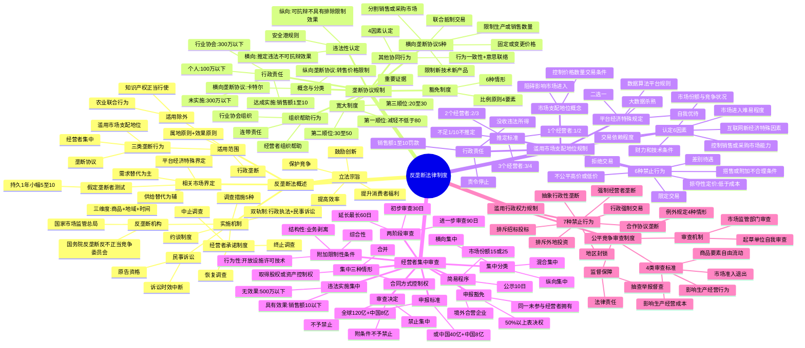

## 1. 章节定位

| 项目 | 信息 |
|------|------|
| 所属科目 | 经济法 |
| 难度等级 | 3 |
| 历年分值 | 4-6 分 |
| 建议学时 | 5-6 小时 |
| 知识关联章节 | 第1章 法律基本原理（法律渊源、适用范围）；第2章 基本民事法律制度（诉讼时效、民事责任）；第3章 物权法律制度（知识产权）；第4章 合同法律制度（合同效力、垄断协议效力）；第6章 公司法律制度（经营者集中、公司合并）；第7章 证券法律制度（上市公司收购与经营者集中审查）；第10章 企业国有资产法律制度（国有垄断企业） |

## 2. 考情分析

本章是经济法科目的"次重点章节"，分值约 4-6 分，客观题与案例分析题并重。2022年《反垄断法》修正后，本章重要性有所提升，命题趋势向新增制度（平台经济领域反垄断、安全港规则、公平竞争审查制度、宽大制度、经营者承诺制度）倾斜。

**命题规律**：本章命题注重体系性与实务性结合，重点考查垄断协议的认定（横向5种+纵向2种）、垄断协议的豁免条件、市场支配地位的推定标准（1/2、2/3、3/4）、滥用市场支配地位的6种禁止行为、经营者集中的申报标准与审查程序、滥用行政权力排除限制竞争的7种行为。近年命题趋势是结合《反垄断法》2022年修正、平台经济反垄断指南、公平竞争审查条例（2024年）出题。

**高频考点分布**：

1. **反垄断法概述**：立法宗旨（保护竞争、鼓励创新、提高效率、提升消费者福利）；适用范围（属地原则+效果原则）；适用除外（知识产权正当行使、农业联合行为）；相关市场界定三维度（商品、地域、时间）；需求替代与供给替代；假定垄断者测试（持久小幅涨价5%-10%）；平台经济领域相关市场界定。
2. **实施机制**：双轨制（行政执法+民事诉讼）；反垄断机构双层制（国家市场监管总局执法+国务院反垄断委员会协调）；反垄断调查措施（5种）；反垄断约谈制度；经营者承诺制度（中止调查→终止调查→恢复调查）；反垄断民事诉讼（原告资格、举证责任、诉讼时效中断）。
3. **垄断协议**：横向垄断协议5种（固定价格、限制数量、分割市场、限制创新、联合抵制交易）；纵向垄断协议2种（固定转售价格、限定最低转售价格）；违法性认定（横向推定违法vs纵向可抗辩）；安全港规则；豁免6种情形+比例原则；"其他协同行为"认定4因素；行业协会组织行为；经营者组织帮助行为；行政责任（上一年度销售额1%-10%罚款、500万/300万/100万）；宽大制度（第一顺位减轻不低于80%、第二顺位30%-50%、第三顺位20%-30%）。
4. **滥用市场支配地位**：市场支配地位认定6因素；推定标准（1/2、2/3、3/4、不足1/10除外）；6种禁止行为（不公平高价/低价、掠夺性定价、拒绝交易、限定交易、搭售、差别待遇）+平台经济特殊规定（数据算法平台规则）；各种行为的正当理由。
5. **经营者集中**：三种情形（合并、取得股权/资产控制权、合同方式控制权）；三种分类（横向/纵向/混合集中）；申报标准（全球120亿+中国8亿，或中国40亿+中国8亿）；申报豁免（50%以上表决权）；两阶段审查（初步30日+进一步90日+延长60日）；简易程序（公示10日）；审查决定（禁止/不予禁止/附条件不予禁止）；附加限制性条件（结构性/行为性/综合性）；违法实施集中处罚（具有排除限制竞争效果处上一年度销售额10%以下罚款，不具有处500万元以下罚款）。
6. **滥用行政权力排除限制竞争**：7种禁止行为（行政强制交易、合作协议垄断、地区封锁、排斥招标投标、排斥外地投资、强制经营者垄断、抽象行政性垄断）；公平竞争审查制度（4类审查标准+例外规定）。

**联动考查方式**：

- 与第6章公司法律制度联动：经营者集中与公司合并；
- 与第7章证券法律制度联动：上市公司收购与经营者集中审查；
- 内部综合联动：相关市场界定 + 市场支配地位认定 + 滥用行为认定（典型综合题模式）。

**备考建议**：

- 本章必须建立"四大制度"知识框架：垄断协议规制 + 滥用市场支配地位规制 + 经营者集中审查 + 滥用行政权力规制；
- 数字考点密集：1/2、2/3、3/4、1/10、50%、15%、25%、120亿、40亿、8亿、30日、90日、60日、10日、1%-10%、500万、300万、100万、80%、30%-50%、20%-30%、5%-10%等；
- 区分易混淆概念：横向vs纵向垄断协议、本身违法vs合理原则、适用除外vs豁免、结构性vs行为性限制条件、核准制vs备案制；
- 关注2022年《反垄断法》修正新增内容：平台经济反垄断、安全港规则、经营者承诺制度、宽大制度、公平竞争审查制度。

## 3. 知识框架

## 4. 核心精讲

### 4.1 反垄断法律制度概述

#### 4.1.1 反垄断法的立法宗旨与适用范围

**立法宗旨**（《反垄断法》第1条）：预防和制止垄断行为，保护市场公平竞争，鼓励创新，提高经济运行效率，维护消费者利益和社会公共利益，促进社会主义市场经济健康发展。

**适用的地域范围**——"属地原则+效果原则"：
- **属地原则**：中华人民共和国境内经济活动中的垄断行为，适用本法；
- **效果原则**：中华人民共和国境外的垄断行为，对境内市场竞争产生排除、限制影响的，适用本法。

> "境内"不含我国港、澳、台地区。

**适用的主体和行为**：

| 主体 | 规制行为 |
|------|---------|
| **经营者**（从事商品生产、经营或提供服务的自然人、法人和非法人组织） | ①达成垄断协议；②滥用市场支配地位；③具有或可能具有排除、限制竞争效果的经营者集中 |
| **行业协会** | 不得组织本行业的经营者从事垄断行为 |
| **行政机关和法律、法规授权的具有管理公共事务职能的组织** | 不得滥用行政权力排除、限制竞争（行政垄断） |

**适用除外**：
1. **知识产权正当行使**：经营者依照知识产权法律法规行使知识产权的行为，不适用反垄断法；但滥用知识产权排除、限制竞争的，不可排除适用。
2. **农业联合行为**：农业生产者及农村经济组织在农产品生产、加工、销售、运输、储存等经营活动中的联合或协同行为。

> 国有经济占控制地位的关系国民经济命脉和国家安全的行业，国家对其合法经营活动予以保护，但国有垄断企业从事垄断协议、滥用市场支配地位或违法经营者集中的，同样受《反垄断法》规制。

#### 4.1.2 相关市场界定

**相关市场**是经营者在一定时期内就特定商品或服务进行竞争的商品范围和地域范围。界定维度包括**商品、地域、时间**三个维度。

| 界定视角 | 内容 |
|---------|------|
| **需求替代**（主要视角） | 根据需求者对商品功能用途的需求、质量认可、价格接受及获取难易程度等因素，分析商品间的相互替代程度 |
| **供给替代**（辅助视角） | 当一种商品需求增加时，其他经营者转产该商品以进入市场、增加供给的可能性；转产成本越低、提供紧密替代商品越迅速，供给替代程度越高 |

**假定垄断者测试**：假设经营者是以利润最大化为目标的垄断者，在其他商品销售条件不变的情况下，看其能否**持久（一般为1年）而小幅（一般为5%-10%）**提高商品价格并仍有利可图。如果能，则其商品可以单独构成一个相关市场；如果不能，则需要将需求者转向的其他商品也纳入同一相关市场。

**平台经济领域的相关市场界定**：可以基于平台功能、商业模式、应用场景、用户群体、多边市场、线下交易等因素进行需求替代分析；根据平台特点，相关地域市场通常界定为中国市场或特定区域市场，也可以界定为全球市场。

#### 4.1.3 反垄断法的实施机制

**双轨制模式**：行政执法与民事诉讼并行。

**反垄断机构**（双层制）：

| 机构 | 性质 | 职责 |
|------|------|------|
| **国家市场监督管理总局** | 国务院反垄断执法机构 | 负责反垄断法的行政执法；可授权省级市场监管部门负责有关执法工作 |
| **国务院反垄断反不正当竞争委员会** | 议事协调机构（非执法机构） | 研究拟订竞争政策；组织调查评估市场总体竞争状况；制定发布反垄断指南；协调反垄断行政执法工作 |

**反垄断调查措施**（5种）：①进入营业场所检查；②询问被调查者；③查阅复制文件资料；④查封扣押证据；⑤查询银行账户。

**经营者承诺制度**（和解制度）：

| 阶段 | 内容 |
|------|------|
| **中止调查** | 被调查经营者承诺在认可期限内采取措施消除后果，执法机构决定中止调查 |
| **终止调查** | 经营者履行承诺的，执法机构可以决定终止调查 |
| **恢复调查** | ①未履行承诺；②事实重大变化；③基于不完整或不真实信息作出中止决定 |

> **不适用承诺制度的情形**：①执法机构已认定构成违法垄断行为的；②涉嫌固定价格、限制数量、分割市场等三类严重横向垄断协议的。

**反垄断民事诉讼**：
- **原告资格**：自然人、法人或非法人组织因垄断行为受到损失及因合同内容或经营者团体章程决议决定违反反垄断法而发生争议，均可提起诉讼。间接购买人的消费者也可作为原告。
- **民事诉讼与行政执法的关系**：法院受理垄断民事纠纷不以执法机构已查处为前提。
- **诉讼时效**：从原告知道或应当知道权益受到损害及义务人之日起计算。原告向执法机构举报的，诉讼时效从举报之日起中断。

### 4.2 垄断协议规制制度

#### 4.2.1 垄断协议的概念与分类

**垄断协议**是指排除、限制竞争的协议、决定或者其他协同行为。

| 特征 | 内容 |
|------|------|
| **主体复数性** | 两个或两个以上经营者 |
| **形式多样化** | 协议（书面/口头）、决定（行业协会决议）、其他协同行为（默示意思联络）；利用算法、技术、平台规则达成的垄断协议也被禁止 |
| **排除限制竞争** | 旨在避免竞争风险、实施市场垄断 |

**基本分类**：

| 类型 | 定义 | 危害程度 |
|------|------|---------|
| **横向垄断协议**（卡特尔） | 具有竞争关系的经营者之间达成的垄断协议 | 最原始、最直接、危害最大 |
| **纵向垄断协议** | 经营者与交易相对人（买卖关系）之间达成的垄断协议 | 效果更为复杂，有限制竞争又有促进效率的效果 |

#### 4.2.2 横向垄断协议

**《反垄断法》禁止的5种横向垄断协议**：

| 序号 | 类型 | 内容 |
|------|------|------|
| 1 | **固定或变更商品价格**（价格卡特尔） | 固定价格水平、变动幅度、利润水平、折扣等；约定价格计算公式、算法；限制自主定价权 |
| 2 | **限制商品的生产或销售数量** | 限制产量、固定产量、停止生产；限制商品投放量 |
| 3 | **分割销售市场或原材料采购市场** | 划分地域、客户、产品；划分销售地域、市场份额、销售对象、销售收入、利润 |
| 4 | **限制购买新技术、新设备或限制开发新技术、新产品** | 限制购买使用新技术新工艺；限制投资研发；拒绝使用新技术 |
| 5 | **联合抵制交易** | 联合拒绝向特定经营者供应或销售；联合拒绝采购特定经营者商品；联合限定不得与竞争者交易 |

> **反向支付协议**：原研药公司向仿制药公司提供对价，后者承诺不进入该药品市场的协议。同时具备"给予明显不合理的利益补偿"和"承诺不质疑专利有效性或延迟进入市场"两个条件的，构成横向垄断协议。

**违法性认定规则**：5种横向垄断协议由法律推定具有排除、限制竞争效果，执法机构无须调查效果即可禁止。民事诉讼中原告无须举证反竞争效果。行为人无权提出不具有反竞争效果的抗辩，但可依据第20条提出豁免抗辩。

#### 4.2.3 纵向垄断协议

**《反垄断法》禁止的2种纵向垄断协议**：
1. 固定向第三人转售商品的价格的协议；
2. 限定向第三人转售商品的最低价格的协议。

**违法性认定规则**：法律假定上述两种纵向协议具有排除、限制竞争效果，但**行为人可以提出协议不具有排除、限制竞争效果的抗辩**（第18条第2款），也可以提出豁免抗辩。

**安全港规则**（第18条第3款）：经营者能够证明其在相关市场的市场份额低于国务院反垄断执法机构规定的标准，并符合其他条件的，不予禁止。

**法院审查因素**（认定是否具有排除限制竞争效果）：
1. 被告在相关市场的市场力量和协议的累积作用；
2. 是否具有提高进入壁垒、阻碍更有效率经营者或经营模式、限制品牌间或品牌内竞争等不利效果；
3. 是否具有防止搭便车、促进品牌间竞争、维护品牌形象、提升售后服务、促进创新等有利效果且所必需；
4. 其他因素。有利竞争效果明显超过不利竞争效果的，认定不具有排除、限制竞争效果。

#### 4.2.4 垄断协议的豁免

**豁免与适用除外的区别**：适用除外是将特定领域排除在反垄断法适用范围之外；豁免是在适用过程中发现违反反垄断法的行为符合法定条件而不予禁止。

**可被豁免的6种情形**（《反垄断法》第20条第1款）：

| 序号 | 情形 |
|------|------|
| 1 | 为改进技术、研究开发新产品 |
| 2 | 为提高产品质量、降低成本、增进效率，统一产品规格、标准或实行专业化分工 |
| 3 | 为提高中小经营者经营效率，增强中小经营者竞争力 |
| 4 | 为实现节约能源、保护环境、救灾救助等社会公共利益 |
| 5 | 因经济不景气，为缓解销售量严重下降或生产明显过剩 |
| 6 | 为保障对外贸易和对外经济合作中的正当利益（出口卡特尔） |

**比例原则**（第20条第2款，适用于第1-5项情形）：主张豁免时应证明：①协议能够实现相关目的或效果；②为实现相关目的或效果所必需；③不会严重限制相关市场的竞争；④能够使消费者分享由此产生的利益。

#### 4.2.5 "其他协同行为"的认定

**"其他协同行为"**是指经营者之间虽未明确订立协议或决定，但实质上存在协调一致的行为。

**认定因素**（4项）：
1. 经营者的市场行为是否具有一致性；
2. 经营者之间是否进行过意思联络、信息交流；
3. 相关市场的结构情况、竞争状况、市场变化情况；
4. 经营者能否对行为的一致性作出合理解释。

> **举证规则**：原告提供第(1)项和第(2)项的初步证据，或第(1)项和第(3)项的初步证据，证明协同行为可能性较大的，被告应当提供证据或充分说明作出合理解释；不能合理解释的，法院可以认定协同行为成立。

#### 4.2.6 垄断协议的组织、帮助行为与行政责任

**行业协会的组织行为**：禁止行业协会制定发布含有排除限制竞争内容的章程、规则、决定等；召集组织推动经营者达成垄断协议。

**经营者的组织帮助行为**（2022年修正新增）：经营者不得组织其他经营者达成垄断协议或为其他经营者达成垄断协议提供**实质性帮助**（对达成或实施具有直接、重要促进作用的引导产生违法意图、提供便利条件、充当信息渠道、帮助实施惩罚等）。

**民事责任**：组织者承担连带责任（依《民法典》第1168条）；帮助者承担连带责任（依《民法典》第1169条第1款），但能证明不知道且不应当知道的除外。

**行政责任**：

| 违法主体 | 处罚 |
|---------|------|
| 经营者达成并实施垄断协议 | 责令停止违法行为、没收违法所得、处上一年度销售额**1%以上10%以下**罚款；上一年度没有销售额的处**500万元以下**罚款 |
| 经营者达成但尚未实施垄断协议 | 可以处**300万元以下**罚款 |
| 经营者的法定代表人、主要负责人和直接责任人员 | 可以处**100万元以下**罚款 |
| 行业协会组织垄断协议 | 责令改正，可以处**300万元以下**罚款；情节严重的撤销登记 |

#### 4.2.7 宽大制度

**宽大制度**是指参与垄断协议的经营者主动向反垄断执法机构报告达成垄断协议的有关情况并提供重要证据的，反垄断执法机构可以对其宽大处理，酌情减轻或免除处罚。

| 要素 | 内容 |
|------|------|
| **"重要证据"** | 执法机构尚未掌握的，能够对立案调查或认定垄断协议起到关键性作用的证据 |
| **申请时限** | 在反垄断执法机构行政处罚告知前提出申请 |
| **第一顺位** | 可以免除处罚或按照不低于**80%**幅度减轻罚款 |
| **第二顺位** | 可以按照**30%-50%**幅度减轻罚款 |
| **第三顺位** | 可以按照**20%-30%**幅度减轻罚款 |

> 组织、胁迫其他经营者参与达成实施垄断协议或妨碍其他经营者停止违法行为的，执法机构不对其免除处罚，但可以相应给予减轻处罚。

### 4.3 滥用市场支配地位规制制度

#### 4.3.1 市场支配地位的认定

**市场支配地位**是指经营者在相关市场内具有能够控制商品价格、数量或者其他交易条件，或者能够阻碍、影响其他经营者进入相关市场能力的市场地位。

**认定因素**（6项）：

| 序号 | 因素 | 考虑内容 |
|------|------|---------|
| 1 | **市场份额及竞争状况** | 经营者特定商品销售金额、销售数量在相关市场所占比重；竞争者数量、市场集中度、商品差异程度 |
| 2 | **控制销售市场或原材料采购市场的能力** | 控制产业链上下游能力、控制销售或采购渠道能力、影响价格数量能力 |
| 3 | **财力和技术条件** | 资产规模、盈利能力、融资能力、研发能力、技术装备、知识产权（不能仅凭拥有知识产权推定） |
| 4 | **交易依赖程度** | 交易关系、交易量、交易持续时间、转向其他交易相对人的难易程度 |
| 5 | **市场进入难易程度** | 市场准入、获取必要资源难度、资金门槛、技术壁垒、品牌依赖、用户转换成本 |
| 6 | **互联网等新经济业态特殊因素** | 交易金额、交易数量、用户数量、网络效应、锁定效应、技术特性、控制流量能力、掌握处理数据能力、关联市场力量 |

**推定标准**：

| 情形 | 推定标准 |
|------|---------|
| 1个经营者 | 市场份额达到**1/2** |
| 2个经营者 | 市场份额合计达到**2/3** |
| 3个经营者 | 市场份额合计达到**3/4** |

> 被推定为共同占有市场支配地位的经营者中，有的经营者市场份额不足**1/10**的，不应当推定该经营者具有市场支配地位。被推定具有市场支配地位的经营者，如有证据证明不具有的，不应当认定。

#### 4.3.2 禁止的滥用市场支配地位行为

**6种禁止行为 + 平台经济特殊规定**：

| 序号 | 禁止行为 | 核心要点 | 正当理由（示例） |
|------|---------|---------|----------------|
| 1 | **不公平高价销售或低价购买** | 剥削性滥用；价格明显高于/低于其他经营者或同一经营者在其他市场条件下 | — |
| 2 | **没有正当理由低于成本销售**（掠夺性定价） | 重点考虑价格是否低于平均可变成本 | 降价处理鲜活/季节性/即将到期商品；清偿债务/转产/歇业；合理期限推广新产品 |
| 3 | **没有正当理由拒绝交易** | 实质性削减现有交易、拖延中断、拒绝新交易、设置限制条件、拒绝使用必需设施 | 不可抗力；交易相对人不良信用；经营者利益不当减损；不遵守平台规则 |
| 4 | **没有正当理由限定交易** | 限定只能与其或其指定经营者交易；不得与特定经营者交易 | 产品安全要求；保护知识产权/商业秘密/数据安全；保护特定投资；维护平台合理经营模式 |
| 5 | **没有正当理由搭售或附加不合理条件** | 捆绑销售/组合销售；附加不合理限制；附加不合理费用；附加无关交易条件 | 行业惯例；产品安全；特定技术；保护消费者利益 |
| 6 | **没有正当理由差别待遇** | 不同价格/数量/品种/品质；不同折扣/付款条件/售后服务 | 正当交易习惯；新用户优惠；公平平台规则的随机性交易 |
| 7 | **平台经济特殊规定**（第22条第2款） | 不得利用数据、算法、技术、平台规则从事滥用行为（自我优待、二选一、大数据杀熟） | — |

> **被搭售商品须为独立商品**：如果两个商品从交易习惯或功能上看必须搭配使用（如鞋和鞋带），则不属于独立商品，不构成搭售。

**行政责任**：责令停止违法行为、没收违法所得、处上一年度销售额**1%以上10%以下**罚款。

### 4.4 经营者集中反垄断审查制度

#### 4.4.1 经营者集中的概念与申报

**经营者集中三种情形**：
1. **合并**（吸收合并+新设合并）；
2. 通过取得股权或资产的方式取得对其他经营者的控制权；
3. 通过合同等方式取得控制权或施加决定性影响（委托经营、联营、人事兼任等）。

**申报标准**（达到之一即应申报）：

| 标准 | 全球范围 | 中国境内 |
|------|---------|---------|
| **标准一** | 所有经营者上一会计年度全球营业额合计超过**120亿元** | 至少两个经营者中国境内营业额均超过**8亿元** |
| **标准二** | — | 所有经营者中国境内营业额合计超过**40亿元**，且至少两个经营者均超过**8亿元** |

> 未达到申报标准但有证据证明具有或可能具有排除、限制竞争效果的，国务院反垄断执法机构可以要求经营者申报。

**申报豁免**（2种情形）：
1. 参与集中的一个经营者拥有其他每个经营者**50%以上**有表决权的股份或资产的；
2. 参与集中的每个经营者**50%以上**有表决权的股份或资产被同一个未参与集中的经营者拥有的。

#### 4.4.2 审查程序

**两阶段审查**：

| 阶段 | 期限 | 内容 |
|------|------|------|
| **第一阶段（初步审查）** | 自收到符合规定的文件资料之日起**30日**内 | 作出是否实施进一步审查的决定；决定前经营者不得实施集中；不实施进一步审查或逾期未决定的，可以实施集中 |
| **第二阶段（进一步审查）** | 自决定之日起**90日**内 | 作出是否禁止集中的决定；审查期间经营者不得实施集中；逾期未决定的，可以实施集中 |
| **延长** | 最长不得超过**60日** | ①经营者同意延长；②文件资料不准确需核实；③申报后情况重大变化 |

**审查期限中止**（暂停计算）：①经营者未按规定提交文件资料；②出现重大新情况新事实；③需对限制性条件进一步评估且经营者提出中止请求。

**简易程序**（公示期**10日**）：
- 同一相关市场份额之和小于15%，或上下游市场份额均小于25%；
- 境外设立合营企业不在境内从事经济活动；
- 收购境外企业不在境内从事经济活动；
- 共同控制的合营企业被其中一个或以上经营者控制。

**审查决定**（3种）：

| 决定类型 | 条件 |
|---------|------|
| **禁止集中** | 具有或可能具有排除、限制竞争效果 |
| **不予禁止** | 不具有排除、限制竞争效果；或虽有效果但有利影响明显大于不利影响或符合社会公共利益 |
| **附条件不予禁止** | 附加减少集中对竞争不利影响的限制性条件 |

#### 4.4.3 附加限制性条件

| 条件类型 | 内容 |
|---------|------|
| **结构性条件** | 剥离有形资产、知识产权、数据等无形资产或相关权益（业务剥离） |
| **行为性条件** | 开放网络或平台等基础设施、许可关键技术、终止排他性协议、保持独立运营、修改平台规则或算法、承诺兼容等 |
| **综合性条件** | 结构性条件与行为性条件相结合 |

**限制性条件的履行监督与变更**：义务人应严格履行并报告；市场监管总局可自行或通过受托人监督检查；期限到期自动解除（需核查未违反）或申请解除；审查决定生效期间可变更或解除（考虑集中交易方是否重大变化、相关市场竞争状况是否实质性变化、实施限制性条件是否无必要或不可能）。

#### 4.4.4 违法实施集中的处罚

| 情形 | 处罚 |
|------|------|
| 具有或可能具有排除、限制竞争效果 | 责令停止实施集中、限期处分股份或资产、限期转让营业、恢复到集中前状态，处上一年度销售额**10%以下**罚款 |
| 不具有排除、限制竞争效果 | 处**500万元以下**罚款（初步罚款数额250万元；从轻100万元；从重400万元） |

### 4.5 滥用行政权力排除、限制竞争规制制度

#### 4.5.1 禁止的7种行为

| 序号 | 行为类型 | 具体表现 |
|------|---------|---------|
| 1 | **行政强制交易** | 限定或变相限定单位或个人经营、购买、使用指定经营者提供的商品；通过行政审批、限制投标人、设置项目库等方式 |
| 2 | **利用合作协议实施垄断行为** | 通过签订合作协议、备忘录等方式妨碍其他经营者进入市场或实行不平等待遇 |
| 3 | **地区封锁** | 对外地商品设定歧视性收费/价格/补贴；歧视性技术要求/检验标准；歧视性行政许可；设置关卡或软件屏蔽；优先采购本地经营者商品 |
| 4 | **排斥或限制招标投标** | 不依法发布信息；排除外地经营者参与；设定歧视性资质要求/评审标准；设定与实际需要不相适应的资格条件 |
| 5 | **排斥或限制外地投资** | 拒绝/强制外地经营者在本地投资或设立分支机构；限制投资规模/方式；规定与本地经营者不同的要求 |
| 6 | **强制经营者从事垄断行为** | 强制或变相强制经营者达成实施垄断协议、滥用市场支配地位、违法经营者集中 |
| 7 | **抽象行政性垄断行为** | 制定含有排除、限制竞争内容的规定（办法、决定、公告、通知、意见、会议纪要、函件等） |

#### 4.5.2 公平竞争审查制度

**基本原则**：尊重市场，竞争优先；立足全局，统筹兼顾；依法审查，强化监督。

**适用范围**：涉及经营者经济活动的法律、行政法规、地方性法规、规章、规范性文件以及具体政策措施的起草活动。

**4类审查标准**：

| 审查标准 | 禁止内容 |
|---------|---------|
| **市场准入和退出标准** | 违法设置审批程序；违法设置特许经营权；限定经营购买使用特定商品；设置不合理或歧视性准入退出条件 |
| **商品和要素自由流动标准** | 限制外地商品进入或本地商品输出；排斥外地经营者投资/招标投标；对外地商品设置歧视性收费/价格/补贴；对外地经营者设置歧视性资质要求 |
| **影响生产经营成本标准** | 无法律依据给予特定经营者税收优惠；选择性差异化财政奖励或补贴；要素获取/收费/基金/社保优惠 |
| **影响生产经营行为标准** | 强制经营者实施垄断行为；超越权限制定政府指导价/定价；违法干预市场调节价 |

**例外规定**（可出台的情形，需无对公平竞争影响更小的替代方案且确定合理实施期限或终止条件）：
1. 为维护国家安全和发展利益；
2. 为促进科学技术进步、增强国家自主创新能力；
3. 为实现节约能源、保护环境、救灾救助等社会公共利益；
4. 法律、行政法规规定的其他情形。

**审查机制**：
- 拟由部门出台的：起草单位自我审查；
- 拟由县级以上政府出台的：市场监管部门会同起草单位审查（起草单位初审→市场监管部门审查）。
- 未经公平竞争审查或经审查违反规定且不符合例外规定的，不得出台。

## 5. 典型例题

### 一、单项选择题

1. 根据反垄断法律制度的规定，下列关于相关市场界定的表述中，正确的是（　）。
A. 相关市场界定仅涉及商品和地域两个维度
B. 需求替代是界定相关市场的主要分析视角
C. 假定垄断者测试中的"小幅"一般为1%-3%
D. 供给替代是界定相关市场的主要分析视角

**答案**：B

**解析**：相关市场界定涉及商品、地域和时间三个维度（选项A错误，大部分分析只需商品和地域两个维度，但特定情形下也用到时间维度）。需求替代是界定相关市场的主要分析视角，供给替代为辅助（选项B正确，选项D错误）。假定垄断者测试中的"小幅"一般为5%-10%（选项C错误）。

2. 根据反垄断法律制度的规定，下列垄断协议中，适用宽大制度时第一顺位经营者可以获得的宽大幅度是（　）。
A. 不低于50%幅度减轻罚款
B. 不低于80%幅度减轻罚款
C. 免除处罚或按照不低于80%幅度减轻罚款
D. 按照30%-50%幅度减轻罚款

**答案**：C

**解析**：对于第一顺位的经营者，反垄断执法机构可以免除处罚或者按照不低于80%幅度减轻罚款；第二顺位按照30%-50%幅度减轻；第三顺位按照20%-30%幅度减轻。

3. 根据反垄断法律制度的规定，下列关于经营者集中申报的表述中，正确的是（　）。
A. 参与集中的所有经营者上一会计年度在全球范围内的营业额合计超过100亿元人民币，并且其中至少两个经营者在中国境内的营业额均超过8亿元人民币的，应当申报
B. 经营者集中申报后，执法机构作出不实施进一步审查决定的，经营者不得实施集中
C. 参与集中的一个经营者拥有其他每个经营者50%以上有表决权的股份的，可以不向国务院反垄断执法机构申报
D. 进一步审查应当自执法机构收到申报材料之日起90日内完毕

**答案**：C

**解析**：申报标准为全球营业额合计超过120亿元（非100亿元，选项A错误）。执法机构作出不实施进一步审查决定或逾期未作出决定的，经营者可以实施集中（选项B错误）。参与集中的一个经营者拥有其他每个经营者50%以上有表决权的股份或资产的，可以不申报（选项C正确）。进一步审查应自执法机构作出实施进一步审查决定之日起90日内完毕（非自收到申报材料之日起，选项D错误）。

4. 根据反垄断法律制度的规定，一个经营者在相关市场的市场份额达到（　）时，可以推定为具有市场支配地位。
A. 1/3
B. 1/2
C. 2/3
D. 3/4

**答案**：B

**解析**：一个经营者在相关市场的市场份额达到1/2的，推定为具有市场支配地位；两个经营者合计达到2/3的，或三个经营者合计达到3/4的，推定为共同占有市场支配地位。

5. 根据反垄断法律制度的规定，经营者违反规定实施集中，且具有或者可能具有排除、限制竞争效果的，由国务院反垄断执法机构处（　）。
A. 上一年度销售额1%以上10%以下罚款
B. 上一年度销售额10%以下罚款
C. 500万元以下罚款
D. 300万元以下罚款

**答案**：B

**解析**：经营者违法实施集中且具有或可能具有排除、限制竞争效果的，责令停止实施集中、限期处分股份或资产、限期转让营业以及恢复到集中前状态，处上一年度销售额10%以下罚款。不具有排除、限制竞争效果的，处500万元以下罚款。

### 二、多项选择题

1. 根据反垄断法律制度的规定，下列属于《反垄断法》禁止的横向垄断协议的有（　）。
A. 固定或者变更商品价格
B. 限制商品的生产数量或者销售数量
C. 分割销售市场或者原材料采购市场
D. 固定向第三人转售商品的价格

**答案**：ABC

**解析**：固定或变更价格、限制数量、分割市场均属于禁止的横向垄断协议（选项A、B、C正确）。固定向第三人转售商品的价格属于禁止的纵向垄断协议（选项D不属于横向垄断协议）。

2. 根据反垄断法律制度的规定，下列关于垄断协议豁免的表述中，正确的有（　）。
A. 为改进技术、研究开发新产品的垄断协议可以豁免
B. 为提高中小经营者经营效率的垄断协议可以豁免
C. 豁免应当符合比例原则，包括协议不会严重限制相关市场的竞争
D. 所有豁免情形均无需证明协议能够使消费者分享由此产生的利益

**答案**：ABC

**解析**：为改进技术研发新产品、为提高中小企业效率均可豁免（选项A、B正确）。对于第20条第1款第(1)至第(5)项情形的豁免，应符合比例原则，包括协议不会严重限制相关市场竞争且能够使消费者分享由此产生的利益（选项C正确，选项D错误）。

3. 根据反垄断法律制度的规定，下列关于经营者承诺制度的表述中，正确的有（　）。
A. 经营者承诺制度主要适用于垄断协议和滥用市场支配地位案件
B. 执法机构已认定构成违法垄断行为的，不再接受经营者提出承诺
C. 涉嫌固定价格的横向垄断协议，执法机构不应接受经营者提出承诺
D. 中止调查决定是对经营者的行为是否构成垄断行为作出认定

**答案**：ABC

**解析**：经营者承诺制度主要适用于垄断协议和滥用市场支配地位案件（选项A正确）。已认定构成违法垄断行为的不再接受承诺（选项B正确）。涉嫌固定价格、限制数量、分割市场等三类严重横向垄断协议的不接受承诺（选项C正确）。中止调查及终止调查决定不是对行为是否构成垄断行为作出认定（选项D错误）。

4. 根据反垄断法律制度的规定，下列属于滥用行政权力排除、限制竞争行为的有（　）。
A. 行政机关限定单位或个人购买其指定经营者提供的商品
B. 行政机关对外地商品设定歧视性收费项目
C. 行政机关排斥外地经营者参加本地招标投标活动
D. 行政机关制定含有排除、限制竞争内容的规定

**答案**：ABCD

**解析**：选项A属于行政强制交易，选项B属于地区封锁，选项C属于排斥或限制招标投标，选项D属于抽象行政性垄断行为。四种行为均属于滥用行政权力排除、限制竞争行为。

### 三、案例分析题

甲公司和乙公司均为从事日化用品生产和销售的有限责任公司，在中国日化用品市场的市场份额分别为25%和20%。2024年1月，甲公司和乙公司达成协议，约定：(1)双方将日化用品的批发价格统一提高15%；(2)双方将各自的销售区域进行划分，甲公司负责北方市场，乙公司负责南方市场，互不越界销售。

2024年3月，丙公司（日化用品零售商）发现批发价格异常上涨，遂向国家市场监督管理总局举报。调查过程中，甲公司主动向执法机构报告了协议的详细情况并提供了重要证据，是第一个报告的经营者。

要求：根据上述资料，回答下列问题：

(1) 甲公司和乙公司达成的协议属于何种类型的垄断协议？说明理由。

(2) 该协议是否可以适用垄断协议的豁免？说明理由。

(3) 甲公司和乙公司的行政责任如何认定？

(4) 甲公司主动报告并提供重要证据，可以适用什么制度？具体宽大幅度如何？

**答题思路**：

(1) **甲公司和乙公司达成的协议属于横向垄断协议。**

甲公司和乙公司均为日化用品生产和销售企业，在同一个相关市场中具有竞争关系，属于具有竞争关系的经营者。双方达成的协议包含两种被《反垄断法》禁止的横向垄断协议：①固定或变更商品价格——约定统一提高批发价格15%；②分割销售市场——约定甲公司负责北方市场、乙公司负责南方市场。这两种行为均属于《反垄断法》第十七条禁止的横向垄断协议。

(2) **不可以适用垄断协议的豁免。**

该协议涉及固定价格和分割市场，属于严重限制竞争的横向垄断协议。首先，该协议不属于《反垄断法》第20条规定的6种豁免情形（为改进技术研发新产品、为提高质量降低成本增进效率、为提高中小企业效率、为社会公共利益、因经济不景气、为保障对外贸易正当利益）。其次，即使主张豁免，也需符合比例原则，包括协议能够实现目的、为实现目的所必需、不会严重限制相关市场竞争、能够使消费者分享利益。本案中提高价格和分割市场仅是为了获取垄断利润，不符合任何豁免情形。此外，固定价格和分割市场属于三类严重横向垄断协议，执法机构不应接受经营者提出的承诺。

(3) **甲公司和乙公司的行政责任为：责令停止违法行为、没收违法所得、处上一年度销售额1%以上10%以下罚款。**

根据《反垄断法》规定，经营者达成并实施垄断协议的，由反垄断执法机构责令停止违法行为，没收违法所得，并处上一年度销售额1%以上10%以下罚款。上一年度没有销售额的，处500万元以下罚款。甲公司和乙公司已实施该垄断协议（批发价格已实际提高15%），因此应承担上述行政责任。此外，对达成垄断协议负有个人责任的法定代表人、主要负责人和直接责任人员，可以处100万元以下罚款。

(4) **甲公司可以适用宽大制度。**

甲公司主动向反垄断执法机构报告达成垄断协议的有关情况并提供重要证据，且为第一顺位报告的经营者。根据宽大制度，反垄断执法机构可以对其免除处罚或者按照不低于80%的幅度减轻罚款。但需要注意，如果甲公司存在组织、胁迫其他经营者参与达成实施垄断协议或妨碍其他经营者停止违法行为的情况，则不对其免除处罚，但可以相应给予减轻处罚。

## 6. 记忆口诀

**反垄断法四大制度**："垄断协议、滥用支配、经营者集中、行政垄断"——反垄断法的四大支柱制度。

**立法宗旨四目标**："保护竞争、鼓励创新、提高效率、消费者福利"——四个立法目标，保护竞争是最基本最直接的。

**适用范围两原则**："属地+效果"——境内垄断行为适用属地原则；境外垄断行为对境内产生排除限制影响的适用效果原则。

**相关市场三维度**："商品、地域、时间"——大部分情况只需商品和地域两个维度，特定情形下才用到时间维度。

**假定垄断者测试**："持久1年小幅5-10"——持久一般为1年，小幅一般为5%-10%涨价。

**横向垄断5种**："固定价格、限制数量、分割市场、限制创新、联合抵制"——五种禁止的横向垄断协议，推定违法不可抗辩效果。

**纵向垄断2种**："固定转售价、限定最低转售价"——两种禁止的纵向垄断协议，可抗辩不具有排除限制效果。

**豁免6情形**："技术研发、质量效率、中小企业、公共利益、经济不景气、出口卡特尔"——六种可豁免情形，前五种需符合比例原则。

**比例原则4要素**："能实现、所必需、不严重限制、消费者分享"——协议能够实现目的、所必需、不会严重限制竞争、消费者分享利益。

**宽大制度3顺位**："第一80免、第二30至50、第三20至30"——第一顺位减轻不低于80%或免除，第二顺位30%-50%，第三顺位20%-30%。

**市场支配地位推定**："1个1/2、2个2/3、3个3/4、不足1/10不推定"——市场份额推定标准。

**滥用支配6行为**："不公平高价、掠夺定价、拒绝交易、限定交易、搭售、差别待遇"——六种禁止行为，均以"没有正当理由"为前提。

**经营者集中3情形**："合并、股权资产控制、合同控制"——三种集中情形。

**申报2标准**："全球120亿+中国8亿，或中国40亿+中国8亿"——两个申报标准，满足其一即应申报。

**申报豁免2情形**："50%以上股份拥有或被拥有"——参与集中的一个经营者拥有其他每个经营者50%以上表决权股份，或每个经营者50%以上被同一未参与者拥有。

**两阶段审查**："初步30日、进一步90日、延长60日"——初步审查30日，进一步审查90日，延长最长60日。

**审查3决定**："禁止、不予禁止、附条件不予禁止"——三种审查决定。

**限制性条件3类型**："结构性剥离、行为性开放、综合性结合"——结构性（业务剥离）、行为性（开放设施/许可技术）、综合性。

**违法集中处罚**："有效果10%以下，无效果500万以下"——具有排除限制竞争效果处上一年度销售额10%以下，不具效果处500万以下。

**行政垄断7行为**："强制交易、合作协议、地区封锁、排斥招投标、排斥投资、强制垄断、抽象垄断"——七种滥用行政权力排除限制竞争行为。

**公平竞争审查4标准**："准入退出、自由流动、生产经营成本、生产经营行为"——四类审查标准。

**经营者承诺不适用3情形**："已认定违法、固定价格、限制数量、分割市场"——执法机构已认定构成违法的不接受承诺；涉嫌固定价格、限制数量、分割市场三类严重横向垄断协议的不接受承诺。
