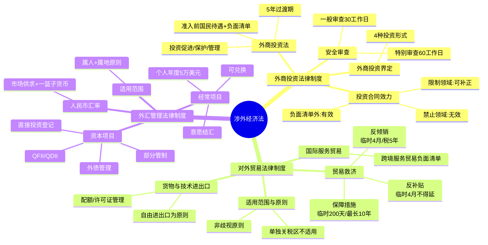

## 📍 章节定位

| 项目 | 信息 |
|------|------|
| **所属科目** | ⚖️ 经济法 |
| **难度等级** | ⭐⭐ |
| **历年分值** | 2-3 分 |
| **建议学时** | 3-4h |
| **教材地位** | 涉外经济法三大板块（外商投资+对外贸易+外汇管理），内容广而杂，多以小题考查，2025 年《对外贸易法》全面修订为新增考点 |

## 📝 考情分析

### 历年考点分布

| 年份 | 题型 | 考点 |
|------|------|------|
| 2024 | 单选 | 临时保障措施形式与期限；B 类企业外汇管理措施（已删除） |
| 2024 | 多选 | 合格境内机构投资者（QDII）的范围与监管 |
| 2025 | 多选 | 反补贴措施调查机关、损害审查、专向性、临时措施期限 |
| 2023 | 多选 | 反补贴调查终止情形；外商投资企业投诉工作机制 |

### 命题规律

1. **三大板块轮流考**：外商投资法、对外贸易救济（反倾销/反补贴/保障措施）、外汇管理每年至少各出一题；
2. **数字密集**：反倾销调查 12+6 个月、临时反倾销 4/9 个月、反倾销税 5 年、临时保障 200 天、保障措施 4+6 年（最长 10 年）、个人年度购汇 5 万美元；
3. **三措施对比**：反倾销 vs 反补贴 vs 保障措施的异同（针对对象、措施形式、期限）是高频命题点；
4. **新增考点**：2025 年《对外贸易法》修订、跨境服务贸易负面清单、外商投资安全审查为热点。

## 🧠 知识框架

## 📖 核心精讲

### 一、外商投资法律制度

#### （一）《外商投资法》的四大特色

2019 年《外商投资法》通过，2020 年 1 月 1 日施行，"外资三法"同时废止。四大特色：

| 特色 | 内容 |
|------|------|
| 从企业组织法转型为投资行为法 | 外商投资企业组织形式适用《公司法》《合伙企业法》等；5 年过渡期保留原企业组织形式 |
| 强调促进与保护 | 征收补偿标准提升为"公平、合理"；不得强制转让技术 |
| 全面落实国民待遇 | 准入前国民待遇加负面清单管理制度 |
| 周延覆盖外商投资 | 涵盖新设、并购、新建项目、其他方式 4 种投资形式 |

#### （二）外商投资界定（4 种情形）

> 《外商投资法》第二条：本法所称外商投资，是指外国的自然人、企业或者其他组织（外国投资者）直接或者间接在中国境内进行的投资活动。

1. 外国投资者单独或与其他投资者共同在中国境内设立外商投资企业；
2. 外国投资者取得中国境内企业的股份、股权、财产份额或其他类似权益；
3. 外国投资者单独或与其他投资者共同在中国境内投资新建项目；
4. 法律、行政法规或国务院规定的其他方式的投资。

**特别提示**：《实施条例》明确"其他投资者"包括中国自然人；港澳台投资者及定居国外的中国公民投资参照适用。

#### （三）准入前国民待遇加负面清单管理制度

> 《外商投资法》第四条：国家对外商投资实行准入前国民待遇加负面清单管理制度。

| 概念 | 含义 |
|------|------|
| 准入前国民待遇 | 在投资准入阶段给予外国投资者及其投资不低于本国投资者及其投资的待遇 |
| 负面清单 | 国家规定在特定领域对外商投资实施的准入特别管理措施 |
| 负面清单外 | 给予国民待遇（内外资一视同仁） |
| 负面清单禁止领域 | 外国投资者不得投资 |
| 负面清单限制领域 | 须符合股权要求、高管要求等限制性准入特别管理措施 |

**2024 年版负面清单**：制造业领域外资准入限制"清零"，特别管理措施缩减至 29 条。

#### （四）外商投资保护要点

| 保护内容 | 具体规则 |
|----------|----------|
| 征收 | 原则上不征收；特殊情况为公共利益可征收，依法定程序、非歧视方式，按市场价值及时补偿 |
| 外汇自由 | 出资、利润、资本收益、知识产权许可费等可依法以人民币或外汇自由汇入汇出 |
| 知识产权 | 保护知识产权；行政机关不得利用行政手段强制或变相强制转让技术 |
| 政府守约 | 不得以行政区划调整、政府换届、机构调整等为由违约毁约 |
| 投诉机制 | 县级以上政府指定部门受理投诉；协调解决不影响行政复议、行政诉讼 |

#### （五）外商投资安全审查制度

**《外商投资安全审查办法》**（2021 年 1 月 18 日施行），工作机制办公室设在国家发改委，由国家发改委、商务部牵头。

**申报范围**：
1. 投资军工、军工配套等关系国防安全的领域，以及军事设施和军工设施周边地域投资；
2. 投资关系国家安全的重要领域并取得所投资企业的实际控制权（50% 以上股权，或不足 50% 但有重大影响，或其他重大影响情形）。

**审查程序**：

| 阶段 | 期限 | 决定 |
|------|------|------|
| 一般审查 | 自决定之日起 **30 个工作日** | 通过 / 启动特别审查 |
| 特别审查 | 自启动之日起 **60 个工作日**（特殊情况可延长） | 通过 / 禁止 / 附条件通过 |

**审查期间当事人不得实施投资**。安全审查决定为**最终决定**。

#### （六）外商投资合同效力认定

| 投资领域 | 合同效力 |
|----------|----------|
| 负面清单**之外**领域 | 当事人以合同未经批准、登记为由主张无效或未生效的，法院**不予支持** |
| 负面清单**禁止**投资领域 | 投资合同**无效** |
| 负面清单**限制**投资领域 | 违反限制性准入特别管理措施的，**无效**；但在生效裁判作出前当事人采取必要措施满足要求的，**有效** |
| 负面清单调整 | 生效裁判作出前因负面清单调整不再属于禁止或限制领域的，**有效** |

### 二、对外贸易法律制度

#### （一）《对外贸易法》适用范围与原则

**适用范围**：适用于货物进出口、技术进出口、国际服务贸易及与此相关的知识产权保护。**不适用于港澳台单独关税区**。

**6 大基本原则**：统一管理、公平自由、多边开放、平等互利、区域合作、非歧视（最惠国待遇+国民待遇）。

#### （二）对外贸易经营者

- 包括**个人和组织**（2025 年修订将个人提到前面，展现更宽松姿态）；
- 对外贸易经营**无须专门许可**（2022 年删除备案登记要求）；
- **国营贸易**：判断标准是是否享有专营权或特许权，与所有制形式无必然联系。

#### （三）货物与技术进出口管理

| 管理方式 | 适用情形 |
|----------|----------|
| 自由进出口 | 原则上准许自由进出口 |
| 自动许可 | 部分自由进出口货物，基于监测需要，商务部"应当许可" |
| 合同备案登记 | 自由进出口技术，合同自依法成立时生效，登记仅备案意义 |
| 配额管理 | 有数量限制的限制进出口货物 |
| 许可证管理 | 其他限制进出口货物；限制进出口技术 |
| 关税配额 | 配额内低税率，配额外高税率 |

#### （四）国际服务贸易

- **跨境服务贸易负面清单管理制度**（2025 年新增）：商务部会同有关部门制定发布；
- 商业存在模式适用《外商投资法》等规定；
- 不实行统一备案登记制，由相关行业主管部门分别管理。

#### （五）对外贸易救济措施（核心考点）

**三种措施对比**：

| 对比项 | 反倾销 | 反补贴 | 保障措施 |
|--------|--------|--------|----------|
| **针对对象** | 不公平贸易（倾销） | 不公平贸易（补贴） | 公平贸易下特殊情形 |
| **调查机关** | 商务部 | 商务部 | 商务部 |
| **损害标准** | 实质损害/威胁/阻碍 | 实质损害/威胁/阻碍 | 严重损害/威胁 |
| **临时措施形式** | 临时反倾销税、担保 | 临时反补贴税、担保 | 提高关税 |
| **临时措施期限** | ≤4 个月，特殊可延至 9 个月 | ≤4 个月，**不得延长** | ≤200 天 |
| **最终措施** | 反倾销税（≤5 年，可延长） | 反补贴税 | 提高关税、数量限制（≤4 年，可延，最长 10 年） |
| **特有终止情形** | 倾销幅度低于 2% | 补贴金额为微量补贴；磋商达成协议 | / |
| **立案前禁止** | 立案之日起 60 天内不得采取临时措施 | 同反倾销 | / |

**反倾销调查关键期限**：
- 商务部审查申请：收到申请书及证据之日起 **60 日**内决定是否立案；
- 调查期限：自立案调查决定公告之日起 **12 个月**内结束，特殊可延长 **6 个月**；
- 临时措施不得早于立案之日起 **60 天**。

**反补贴专向性认定 5 种情形**：
1. 政府明确确定的某些企业、产业获得的补贴；
2. 法律法规明确规定的某些企业、产业获得的补贴；
3. 指定特定区域内企业、产业获得的补贴；
4. 以出口实绩为唯一或条件之一获得的补贴；
5. 以使用本国产品替代进口为条件获得的补贴。

**保障措施特殊规定**：
- 数量限制后进口量不得低于最近 3 个有代表性年度的平均进口量；
- 实施期限不超过 **4 年**，可延长，但最长不超过 **10 年**；
- 延长条件：仍有必要 + 产业正在调整 + 已履行通知磋商义务 + 延长后不严于延长前。

### 三、外汇管理法律制度

#### （一）基本制度

**适用范围**：属人主义 + 属地主义相结合。

| 主体 | 适用范围 |
|------|----------|
| 境内机构和境内个人 | 境内外外汇收支或经营活动中外汇收支 |
| 境内个人 | 中国公民 + 在境内连续居住满 1 年的外国人（外交人员除外） |

**基本原则**：经常项目开放（可自由兑换），资本项目部分管制。

#### （二）经常项目外汇管理

| 制度 | 内容 |
|------|------|
| 收入 | 意愿结汇制（可保留或卖给金融机构） |
| 支出 | 凭有效单证，无须审批 |
| 真实性审核 | 金融机构对交易单证真实性及与外汇收支一致性进行合理审查 |

**货物贸易企业分类管理（A/B/C 三类）**：

| 类别 | 管理措施 |
|------|----------|
| A 类 | 便利化管理措施 |
| B 类 | 单证审核、业务类型及办理程序、结算方式等方面审慎监管 |
| C 类 | 审慎监管；近 12 个月受处罚且情节严重、阻挠核查、提供虚假资料等列入 |

**个人外汇管理**：
- 年度总额管理：每人每年等值 **5 万美元**；
- 经营性外汇收支视同机构管理；
- 境外买房、投资等资本项下交易按资本项目管理原则办理。

#### （三）资本项目外汇管理

**直接投资**：

| 类型 | 管理 |
|------|------|
| 外商直接投资 | 外汇登记管理制度；资本金结汇符合真实自用原则 |
| 境外直接投资 | 取消外汇资金来源审核，实行登记备案制度；利润可留存境外 |

**间接投资（QFII/QDII）**：

| 制度 | 含义 | 监管 |
|------|------|------|
| QFII（含 RQFII） | 合格境外机构投资者境内证券期货投资 | 证监会+人民银行监督管理；外管局负责账户、资金汇兑 |
| QDII（含 RQDII） | 合格境内机构投资者境外证券投资 | 金融监管总局+证监会负责市场准入；外管局负责额度、账户、资金汇兑。RQDII 不得将人民币资金汇出境外购汇 |

**外债管理**：
- 外债登记：债务人借用外债后向所在地外汇局登记；
- 外商投资企业外债资金可结汇使用；境内金融机构和中资企业外债资金**不得结汇**使用；
- 短期外债原则上只能用于流动资金，不得用于固定资产投资等中长期用途。

#### （四）人民币汇率制度

> 2005 年 7 月 21 日起，实行以市场供求为基础、参考"一篮子"货币进行调节、有管理的浮动汇率制度。

**三方面内容**：
1. 以市场供求为基础的汇率浮动；
2. 根据经常项目主要是贸易平衡状况动态调节汇率浮动幅度；
3. 参考"一篮子"货币。

**"8·11"汇改**（2015 年）：做市商参考上日收盘汇率报价，增强中间价市场化程度。

#### （五）人民币加入 SDR

- 2016 年 10 月 1 日生效，权重 10.92%；
- 2022 年 8 月 1 日起权重调整为 12.28%（仍排名第三）；
- SDR 货币篮：美元 43.38%、欧元 29.31%、人民币 12.28%、日元 7.59%、英镑 7.44%。

## 💡 典型例题

### 例题 1（2024 单选）——临时保障措施

根据对外贸易法律制度的规定，下列关于临时保障措施的表述中，正确的是（　　）。
A. 临时保障措施采取提高关税的形式
B. 临时保障措施的实施期限为 4 年
C. 采取临时保障措施由国务院关税税则委员会提出建议
D. 临时保障措施由国家税务总局负责执行

**【答案】A**

**【解析】**
- A 对：临时保障措施采取**提高关税**的形式；
- B 错：临时保障措施实施期限不超过 **200 天**（4 年是保障措施本身的期限）；
- C 错：由**商务部**提出建议，国务院关税税则委员会根据建议作出决定；
- D 错：由**海关**自公告规定实施之日起执行。

### 例题 2（2025 多选）——反补贴措施

根据涉外经济法律制度的规定，下列关于反补贴措施的表述中，正确的有（　　）。
A. 对补贴的调查和确定，由商务部负责
B. 在确定补贴对国内产业造成的损害时，应当审查补贴进口产品的数量
C. 在确定补贴的专向性时，应当考虑接受补贴企业的数量
D. 临时反补贴措施的实施期限不得延长

**【答案】ABCD**

**【解析】**
- A 对：对补贴的调查和确定，由商务部负责；
- B 对：损害审查事项包括补贴可能对贸易造成的影响、补贴进口产品的数量、价格、对国内产业的影响等；
- C 对：确定补贴专向性时，还应考虑受补贴企业的数量和企业受补贴的数额、比例、时间以及给予补贴的方式等因素；
- D 对：临时反补贴措施实施期限不超过 **4 个月**，**不得延长**（区别于反倾销的 4 个月可延至 9 个月）。

### 例题 3（2024 多选）——QDII 制度

根据外汇管理法律制度的规定，下列关于合格境内机构投资者的表述中，正确的有（　　）。
A. 我国合格境内机构投资者不包括信托公司
B. 人民币合格境内投资者开展境外投资，不得将人民币资金汇出境外购汇
C. 获得国家金融监管机构许可的境内金融机构，可以募集个人的人民币资金投资于境外金融市场的人民币计价产品
D. 国家外汇管理局负责境内金融机构境外投资业务的市场准入

**【答案】BC**

**【解析】**
- A 错：QDII 包括商业银行、证券公司、**信托公司**、保险公司和基金管理公司等；
- B 对：RQDII 开展境外投资，**不得**将人民币资金汇出境外购汇；
- C 对：获得国家金融监管机构许可的境内金融机构，可以使用自有人民币资金或募集境内机构和个人的**人民币资金**，投资于境外金融市场的人民币计价产品；
- D 错：市场准入由**国家金融监督管理总局和中国证监会**分别负责，国家外汇管理局负责 QDII 机构境外投资**额度、账户及资金汇兑管理**。

### 例题 4（2023 多选）——反补贴调查终止情形

根据对外贸易法律制度的规定，下列各项中，属于应当终止反补贴调查的情形有（　　）。
A. 补贴金额为微量补贴
B. 申请人撤销申请
C. 没有足够证据证明存在补贴或损害
D. 没有足够证据证明补贴与损害之间存在因果关系

**【答案】ABCD**

**【解析】**反补贴调查终止情形包括：①申请人撤销申请；②没有足够证据证明存在补贴、损害或二者有因果关系；③补贴金额为微量补贴（注意与反倾销的"倾销幅度低于 2%"区别）；④补贴进口产品实际或潜在的进口量或损害属于可忽略不计的；⑤通过与有关国家（地区）政府磋商达成协议，不需要继续进行反补贴调查（此为反补贴特有）；⑥商务部认为不适宜继续进行的。

### 例题 5（模拟）——外商投资合同效力

某外国投资者甲拟投资中国境内乙公司，乙公司所属领域为外商投资准入负面清单中规定的限制投资领域，要求外资持股比例不得超过 50%。甲与乙签订股权转让协议，甲持股 70%。下列关于该合同效力的表述中，正确的是（　　）。
A. 合同有效，因为外商投资合同不以批准为生效要件
B. 合同无效，因为违反限制性准入特别管理措施
C. 合同效力待定，需经商务主管部门确认
D. 合同可撤销，因为乙公司未如实告知负面清单要求

**【答案】B**

**【解析】**外国投资者投资外商投资准入负面清单规定**限制**投资的领域，当事人以违反限制性准入特别管理措施为由，主张投资合同**无效**的，人民法院应予支持。但是，在人民法院作出生效裁判前，当事人采取必要措施满足准入特别管理措施的要求（如将持股比例降至 50% 以下），并据此主张所涉投资合同有效的，人民法院应予支持。本题甲持股 70% 违反了 50% 的限制要求，且未采取补正措施，合同无效。

## 🎯 记忆口诀

### 1. 三种贸易救济措施对比（口诀：倾补保，四月九二百天，五年四加十）

> **倾**销（反**倾**销）：临时 4 月/可延 9 月；反**倾**销税 5 年
> **补**贴（反**补**贴）：临时 4 月/**不得延**；反**补**贴税 5 年
> **保**障措施：临时 **200 天**；保障措施 4 年/最长 **10 年**

### 2. 反倾销调查关键期限（口诀：六十六，十二加六）

> 审查申请 **60 日**决定立案 → 立案后 **60 日**内不得采取临时措施 → 调查 **12 个月**结束，特殊延长 **6 个月**

### 3. 反补贴专向性 5 情形（口诀：明定法规定区出口替代）

> **明定**（政府明确确定）→ **法规定**（法律法规规定）→ **定区**（指定特定区域）→ **出口**（出口实绩为条件）→ **替代**（使用本国产品替代进口）

### 4. 外商投资 4 种形式（口诀：设企购股建项其他）

> **设企**（设立外商投资企业）→ **购股**（取得股份股权等权益）→ **建项**（投资新建项目）→ **其他**（法律行政法规规定的其他方式）

### 5. 外商投资合同效力（口诀：外有效，禁无效，限可补）

> 负面清单**外**：**有效**；负面清单**禁**止：**无效**；负面清单**限**制：**可补正**有效

### 6. 外汇管理基本原则（口诀：经开放，资管制）

> **经**常项目**开放**（可自由兑换）→ **资**本项目部分**管制**

### 7. 个人外汇年度总额（口诀：五万美元）

> 个人结汇和境内个人购汇年度总额每人每年等值 **5 万美元**

### 8. QFII vs QDII（口诀：QFII 进来，QDII 出去）

> **QFII**（合格**境外**机构投资者）：境外资金**进来**投资境内证券
> **QDII**（合格**境内**机构投资者）：境内资金**出去**投资境外证券

## ✅ 同步练习

### 单项选择题

1. 根据外商投资法律制度的规定，下列关于外商投资安全审查的表述中，正确的是（　　）。
   A. 外商投资安全审查决定可以依法申请行政复议
   B. 一般审查应当自决定之日起 60 个工作日内完成
   C. 特别审查应当自启动之日起 60 个工作日内完成，特殊情况下可以延长
   D. 审查期间，当事人可以先行实施投资

2. 根据对外贸易法律制度的规定，反倾销调查应当自立案调查决定公告之日起一定期限内结束。该期限为（　　）。
   A. 6 个月
   B. 12 个月
   C. 18 个月
   D. 24 个月

3. 根据外汇管理法律制度的规定，下列关于个人外汇管理的表述中，正确的是（　　）。
   A. 个人结汇实行年度总额管理，年度总额为每人每年等值 1 万美元
   B. 境内个人购汇实行年度总额管理，年度总额为每人每年等值 5 万美元
   C. 个人经常项目项下经营性外汇收支按照资本项目管理
   D. 境外个人在境内买房按照经常项目管理

4. 根据外商投资法律制度的规定，在负面清单之外领域形成的外商投资合同，当事人以合同未经有关行政主管部门批准、登记为由主张合同无效或未生效的，人民法院应当（　　）。
   A. 予以支持
   B. 不予支持
   C. 驳回起诉
   D. 移送商务主管部门处理

5. 根据对外贸易法律制度的规定，下列关于保障措施的表述中，正确的是（　　）。
   A. 保障措施针对的是不公平贸易行为
   B. 临时保障措施采取数量限制的形式
   C. 保障措施的实施期限不超过 4 年，但可以适当延长
   D. 保障措施的实施期限及其延长期限在任何情况下不得超过 8 年

### 多项选择题

6. 根据外商投资法律制度的规定，下列属于外商投资形式的情形有（　　）。
   A. 外国投资者单独在中国境内设立外商投资企业
   B. 外国投资者取得中国境内企业的股份、股权
   C. 外国投资者在中国境内投资新建项目
   D. 外国投资者在中国境内证券市场购买股票

7. 根据对外贸易法律制度的规定，下列关于反倾销措施的表述中，正确的有（　　）。
   A. 临时反倾销措施包括征收临时反倾销税和要求提供担保
   B. 临时反倾销税税额不得超过初裁决定确定的倾销幅度
   C. 临时反倾销措施实施的期限不超过 4 个月，在特殊情形下可以延长至 9 个月
   D. 反倾销税的纳税人为倾销进口产品的出口经营者

8. 根据外汇管理法律制度的规定，下列关于资本项目外汇管理的表述中，正确的有（　　）。
   A. 资本项目外汇收入保留或卖给金融机构，应当经外汇管理机关批准
   B. 外商投资企业借用的外债资金可以结汇使用
   C. 境内金融机构借用的外债资金不得结汇使用
   D. 短期外债可以用于固定资产投资

9. 根据对外贸易法律制度的规定，我国《对外贸易法》适用的贸易活动包括（　　）。
   A. 货物进出口贸易
   B. 技术进出口贸易
   C. 国际服务贸易
   D. 与对外贸易有关的知识产权保护

10. 根据外商投资法律制度的规定，下列关于外商投资企业投诉工作机制的表述中，正确的有（　　）。
    A. 国家建立外商投资企业投诉工作机制
    B. 县级以上人民政府应当指定部门或机构负责受理本地区外商投资企业投诉
    C. 外商投资企业通过投诉工作机制申请协调解决问题的，不得再申请行政复议
    D. 任何单位和个人不得压制或打击报复通过投诉机制反映问题的外商投资企业

### 案例分析题

11. **【综合案例】**2025 年 3 月，外国投资者甲公司拟收购中国境内乙公司（属于外商投资准入负面清单中限制投资的领域，要求外资持股比例不得超过 50%）60% 的股权。甲公司与乙公司股东签订了股权转让协议。后因合同履行发生争议，甲公司起诉至法院。在诉讼期间（法院作出生效裁判前），甲公司将其持股比例调整为 49%。

**要求**：
（1）分析甲公司最初签订的股权转让协议的效力，并说明理由。
（2）分析甲公司在诉讼期间将持股比例调整为 49% 后，合同效力如何认定？
（3）若乙公司所属领域为负面清单中**禁止**投资领域，合同效力如何？
（4）若乙公司所属领域为负面清单**之外**的领域，当事人能否以合同未经批准、登记为由主张无效？

**【参考答案】**

（1）甲公司最初签订的股权转让协议**无效**。根据《外商投资法》司法解释，外国投资者投资外商投资准入负面清单规定**限制**投资的领域，当事人以违反限制性准入特别管理措施为由，主张投资合同无效的，人民法院应予支持。甲公司持股 60% 违反了"不得超过 50%"的限制性准入特别管理措施，故合同无效。

（2）合同**有效**。根据司法解释，在人民法院作出生效裁判前，当事人采取必要措施满足准入特别管理措施的要求，并据此主张所涉投资合同有效的，人民法院应予支持。甲公司将持股比例调整为 49%，已满足"不得超过 50%"的要求，采取了必要补正措施，故合同有效。

（3）若乙公司所属领域为负面清单**禁止**投资领域，投资合同**无效**。这本质上属于合同因违反法律、行政法规的强制性规定而无效的情形，且不可通过补正措施使其有效。

（4）若乙公司所属领域为负面清单**之外**的领域，当事人以合同未经有关行政主管部门批准、登记为由主张合同无效或未生效的，人民法院**不予支持**。即负面清单之外领域的外商投资合同，无须审批，合同自依法成立时生效。

---

> **复习建议**：本章重点把握三大板块：①外商投资法的负面清单管理制度与合同效力认定规则；②三种贸易救济措施（反倾销/反补贴/保障措施）的对比记忆，特别是期限和终止情形的差异；③外汇管理"经常项目可兑换+资本项目部分管制"的基本架构及 QFII/QDII 制度。数字考点务必牢记。
