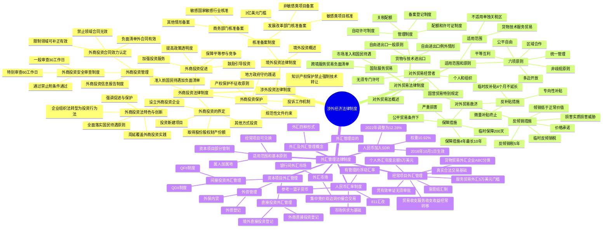

## 1. 章节定位

| 项目 | 信息 |
|------|------|
| 所属科目 | 经济法 |
| 难度等级 | 3 |
| 历年分值 | 3-5 分 |
| 建议学时 | 4-5 小时 |
| 知识关联章节 | 第1章 法律基本原理（国际条约与协定的效力）；第4章 合同法律制度（外商投资合同效力）；第6章 公司法律制度（外商投资企业组织形式适用公司法）；第7章 证券法律制度（QFII/QDII制度）；第11章 反垄断法律制度（外资并购经营者集中审查） |

## 2. 考情分析

本章是经济法科目的"次重点章节"，分值约 3-5 分，以客观题为主，偶有涉及外商投资合同效力、反倾销措施等的简答或案例分析题。2019年《外商投资法》施行及2020年配套法规出台后，本章内容更新较大，命题重点向新制度倾斜。

**命题规律**：本章命题注重对三大制度体系（涉外投资、对外贸易、外汇管理）的框架性理解，重点考查《外商投资法》的四项特色创新、准入前国民待遇加负面清单管理制度、外商投资合同效力认定、对外贸易救济措施（反倾销、反补贴、保障措施）的区别、经常项目与资本项目的区别管理。近年命题趋势是结合《外商投资法》及配套司法解释、《外商投资安全审查办法》（2021年）、《外商投资准入特别管理措施（负面清单）（2024年版）》出题。

**高频考点分布**：

1. **外商投资法律制度**：《外商投资法》四项特色创新（从企业组织法转型为投资行为法、强调促进与保护、全面落实国民待遇、周延覆盖实践）；外商投资的四种情形界定；准入前国民待遇加负面清单管理制度（负面清单之外给予国民待遇）；外商投资信息报告制度；外商投资安全审查制度（申报范围、一般审查30工作日、特别审查60工作日）；外商投资合同效力认定（负面清单外有效、禁止领域无效、限制领域可补正）。
2. **境外投资法律制度**：商务部门与发展改革部门的双重核准备案制度；敏感国家/地区和敏感行业的界定；3亿美元备案门槛。
3. **对外贸易法律制度**：《对外贸易法》的适用范围（单独关税区不适用）与六项原则；对外贸易经营者（无须专门许可）；国营贸易（判断标准是专营权而非所有制）；货物与技术进出口管理（自动许可、备案登记、配额与许可证）；贸易救济措施（反倾销、反补贴、保障措施）的区别与各自程序。
4. **外汇管理法律制度**：经常项目可兑换与资本项目部分管制的基本原则；经常项目外汇收支管理（意愿结汇制、凭有效单证无须审批）；企业分类管理（A/B/C三类）；个人外汇年度总额管理（5万美元）；直接投资外汇管理（登记制度）；QFII/QDII制度；外债登记管理；人民币汇率制度（以市场供求为基础、参考一篮子货币、有管理的浮动汇率）。

**联动考查方式**：

- 与第4章合同法律制度联动：外商投资合同的效力认定；
- 与第6章公司法律制度联动：外商投资企业组织形式适用《公司法》《合伙企业法》；
- 与第11章反垄断法律制度联动：外资并购境内企业的经营者集中审查与国家安全审查。

**备考建议**：

- 建立三大制度框架：涉外投资法律制度 + 对外贸易法律制度 + 外汇管理法律制度；
- 数字考点密集：5年过渡期、30工作日一般审查、60工作日特别审查、3亿美元备案门槛、60日反倾销审查、12个月+6个月调查期限、2%倾销幅度、4个月临时反倾销（可延至9个月）、5年反倾销税征收期限、4个月临时反补贴（不得延长）、200天临时保障措施、4年保障措施（最长10年）、5万美元个人年度总额、10.92%人民币SDR权重等；
- 区分易混淆概念：外商投资vs境外投资、核准vs备案、反倾销vs反补贴vs保障措施、经常项目vs资本项目、QFIIvsQDII、负面清单内vs外；
- 关注《外商投资法》（2020年施行）和《外商投资安全审查办法》（2021年施行）的新制度内容。

## 3. 知识框架

## 4. 核心精讲

### 4.1 涉外经济法律制度概述

**涉外经济法律制度**是调整涉外经济关系的法律规范的总称。涉外经济关系是指具有涉外因素的经济关系，是因国际经贸往来（货物、服务、资本和劳动力的跨境流动）而形成的经济关系。

涉外经济关系的突出特点：必然涉及两个或两个以上国家（地区）的人（自然人、法人和其他实体）或物。因此，一国的涉外经济法律制度虽属国内法，但需较多地考虑其他国家（地区）的相关法律制度以及通行的国际规则。一国缔结或参加的双边和多边国际条约、协定，对其涉外经济法律制度有重要影响。

涉外经济法律制度由三大子制度构成，有着不可分割的内在联系：

| 子制度 | 主要内容 | 外汇管理关联 |
|--------|---------|-------------|
| 涉外投资法律制度 | 外商投资法律制度 + 境外投资法律制度 | 主要涉及资本项目外汇管理 |
| 对外贸易法律制度 | 货物、技术进出口贸易 + 国际服务贸易 | 主要涉及经常项目外汇管理 |
| 外汇管理制度 | 经常项目 + 资本项目外汇管理 | 贯穿涉外投资与对外贸易 |

### 4.2 涉外投资法律制度

#### 4.2.1 外商投资法律制度

**（一）《外商投资法》的特色与创新**

2019年3月15日通过《中华人民共和国外商投资法》（以下简称《外商投资法》），自2020年1月1日起施行；原"外资三法"（《中外合资经营企业法》《中外合作经营企业法》《外资企业法》）同时废止。《外商投资法》分为6章（总则、投资促进、投资保护、投资管理、法律责任、附则），共42条。

相较于"外资三法"，《外商投资法》的特色与创新体现在四个方面：

**1. 从企业组织法转型为投资行为法**

- "外资三法"基本上是企业组织法，主要规制外商投资企业的组织形式和设立变更，与《公司法》《合伙企业法》存在大量重复和局部冲突。
- 《外商投资法》不再是以企业组织为着眼点，而是以投资行为为着眼点。第三十一条明确规定外商投资企业的组织形式、组织机构适用《公司法》《合伙企业法》等法律的规定。
- 主管部门不再对外商投资企业进行有别于内资企业的概括式管理，而是以内外资企业相同对待为原则。
- 设置了**5年过渡期**：在《外商投资法》施行前依照"外资三法"设立的外商投资企业，在施行后5年内可以继续保留原企业组织形式。

**2. 强调对外商投资的促进与保护**

- "投资促进"章（第二章）有11条，"投资保护"章（第三章）有8条，共计19条，远超"投资管理"章（第四章）的8条。
- 保护标准实质性提高：第二十条规定国家对外国投资者的投资不实行征收，特殊情况需要征收的应依照法定程序进行，并及时给予**公平、合理的补偿**（相比"外资三法"的"相应的补偿"，保护标准有实质提高）。
- 禁止行政机关利用行政手段强制转让技术（第二十二条）。

**3. 全面落实国民待遇原则**

- "外资三法"时代，外商投资的国民待遇仅限于准入后。
- 2013年起在上海自贸试验区试行准入前国民待遇加负面清单管理模式，2018年6月推出全国版外商投资负面清单。
- 《外商投资法》第四条以法律形式确认：国家对外商投资实行**准入前国民待遇加负面清单管理制度**。
  - **准入前国民待遇**：在投资准入阶段给予外国投资者及其投资不低于本国投资者及其投资的待遇。
  - **负面清单**：国家规定在特定领域对外商投资实施的准入特别管理措施。
  - 国家对负面清单之外的外商投资，给予国民待遇。

**4. 更加周延地覆盖外商投资实践**

- "外资三法"仅涉及新设投资，对跨国并购、间接投资等未予规定。
- 《外商投资法》第二条对外商投资作了更全面的界定，将现有和将来可能的各种外商投资形式都涵盖在内。

**（二）关于外商投资的界定**

《外商投资法》第二条规定，外商投资是指外国的自然人、企业或者其他组织（外国投资者）直接或者间接在中国境内进行的投资活动，包括四种情形：

1. 外国投资者单独或者与其他投资者共同在中国境内设立外商投资企业（其中"其他投资者"包括中国的自然人）；
2. 外国投资者取得中国境内企业的股份、股权、财产份额或者其他类似权益；
3. 外国投资者单独或者与其他投资者共同在中国境内投资新建项目（不设立企业、不取得股权，以服务费、特许经营费等方式获取收益）；
4. 法律、行政法规或者国务院规定的其他方式的投资。

**特殊规定**：
- 外国投资者投资银行、证券、保险等金融行业，或在证券市场、外汇市场等金融市场进行投资，国家另有规定的，依照其规定。
- 港澳台投资者及定居国外的中国公民（华侨）投资：港澳投资者参照执行；台湾投资者适用《台湾同胞投资保护法》及其实施细则，未规定事项参照执行；华侨参照执行。

**（三）关于外商投资促进**

《外商投资法》和《实施条例》在投资促进方面的主要规定：

1. **提高外商投资政策透明度**：制定与外商投资有关的法规规章规范性文件，应听取外商投资企业和商会协会的意见；未经公布的不得作为行政管理依据。
2. **保障平等参与市场竞争**：外商投资企业依法平等参与标准制定、政府采购活动；国家强制性标准对外商投资企业和内资企业平等适用；政府采购不得对外商投资企业实行差别待遇或歧视待遇。
3. **加强外商投资服务**：建立健全外商投资服务体系，通过政府网站等集中列明法律法规政策措施和投资项目信息。
4. **依法依规鼓励和引导**：设立特殊经济区域；制定鼓励外商投资产业目录；外国投资者以其在中国境内的投资收益在中国境内扩大投资的，依法享受优惠待遇；县级以上地方政府可制定外商投资促进和便利化政策措施。

**（四）关于外商投资保护**

1. **加强产权保护**：
   - 国家对外国投资者的投资原则上不实行征收；特殊情况为了公共利益可以征收或征用，但应依照法定程序、以非歧视性方式进行，并按照被征收投资的**市场价值**及时给予补偿。
   - 外国投资者的出资、利润、资本收益、资产处置所得、知识产权许可使用费、补偿赔偿、清算所得等，可以依法以人民币或外汇自由汇入、汇出。
   - 保护知识产权，禁止行政机关利用行政手段强制或变相强制转让技术。
   - 行政机关确需提供涉及商业秘密的材料信息的，应限定在必需范围内并严格控制知悉范围。

2. **强化对规范性文件的约束**：没有法律、行政法规依据的，不得减损外商投资企业合法权益或增加其义务，不得设置市场准入和退出条件。

3. **促使地方政府守约践诺**：地方政府应履行依法作出的政策承诺和依法订立的各类合同，不得以行政区划调整、政府换届、机构或职能调整以及相关责任人更替等为由违约毁约；因国家利益、社会公共利益需要改变政策承诺、合同约定的，应依法对损失予以公平、合理的补偿。

4. **建立投诉工作机制**：国家建立外商投资企业投诉工作机制；国务院商务主管部门会同有关部门建立部际联席会议制度；县级以上地方政府应指定部门负责受理投诉。通过投诉工作机制申请协调解决不影响依法申请行政复议或提起行政诉讼。

**（五）关于外商投资管理**

**1. 准入前国民待遇加负面清单管理制度**

- 负面清单规定**禁止投资**的领域，外国投资者不得投资。
- 负面清单规定**限制投资**的领域，外国投资者进行投资应当符合股权要求、高级管理人员要求等限制性准入特别管理措施。
- 不符合负面清单规定的，不予办理许可、企业登记注册等相关事项；投资有股权要求的领域，不得设立外商投资合伙企业。
- 2024年9月发布的《外商投资准入特别管理措施（负面清单）（2024年版）》自2024年11月1日施行，规定29条特别管理措施，实现了制造业领域外资准入限制措施的"清零"。

**外商投资信息报告制度**：外国投资者或外商投资企业应通过企业登记系统及国家企业信用信息公示系统向商务主管部门报送投资信息（初始报告、变更报告、注销报告、年度报告），所报信息应真实、准确、完整。

**2. 外商投资安全审查制度**

《外商投资法》明确规定国家建立外商投资安全审查制度。2020年12月19日公布的《外商投资安全审查办法》（以下简称《安审办法》），自2021年1月18日起施行。

**工作机制**：国家建立外商投资安全审查工作机制，办公室设在国家发展改革委，由国家发展改革委、商务部牵头。

**申报范围**（当事人应在实施投资前主动申报）：

| 情形 | 内容 |
|------|------|
| 国防安全领域 | 投资军工、军工配套等关系国防安全的领域，以及在军事设施和军工设施周边地域投资 |
| 重要领域并取得实际控制权 | 投资关系国家安全的重要农产品、重要能源和资源、重大装备制造、重要基础设施、重要运输服务、重要文化产品与服务、重要信息技术和互联网产品与服务、重要金融服务、关键技术及其他重要领域，并取得所投资企业的实际控制权 |

**"实际控制权"的认定**：①外国投资者持有所投资企业50%以上股权；②股权不足50%但所享有的表决权能对董事会、股东会决议产生重大影响；③其他导致外国投资者能对经营决策、人事、财务、技术等产生重大影响的情形。

**审查程序**：

| 阶段 | 期限 | 决定 |
|------|------|------|
| 一般审查 | 自决定之日起**30个工作日** | 不影响国家安全→通过安全审查；影响或可能影响→启动特别审查 |
| 特别审查 | 自启动之日起**60个工作日**（特殊情况可延长） | 不影响国家安全→通过；影响国家安全→禁止投资；附条件可消除影响且当事人书面承诺→附条件通过 |

- 审查期间，当事人不得实施投资。
- 作出禁止投资决定的，当事人不得实施投资；已经实施的，应限期处分股权或资产，恢复到投资实施前的状态。
- 作出附条件通过决定的，当事人应按附加条件实施投资。

**3. 外商投资合同效力的认定**

最高人民法院《关于适用〈中华人民共和国外商投资法〉若干问题的解释》区分负面清单所列投资领域与负面清单之外投资领域，对投资合同效力作出规定：

| 情形 | 合同效力 | 说明 |
|------|---------|------|
| 负面清单之外的领域 | **有效** | 当事人以合同未经批准、登记为由主张无效或未生效的，法院不予支持 |
| 负面清单禁止投资的领域 | **无效** | 本质上属于违反法律、行政法规强制性规定而无效 |
| 负面清单限制投资的领域 | 原则上**无效**，但可**补正** | 当事人以违反限制性准入特别管理措施为由主张无效的，法院应予支持；但在生效裁判作出前，当事人采取必要措施满足要求的，主张合同有效的，法院应予支持 |
| 负面清单调整 | 可**动态认定** | 在生效裁判作出前，因负面清单调整，外国投资者投资不再属于禁止或限制领域，当事人主张合同有效的，法院应予支持 |

**投资合同**的范围：设立外商投资企业合同、股份转让合同、股权转让合同、财产份额或其他类似权益转让合同、新建项目合同等。

#### 4.2.2 境外投资法律制度

**（一）境外投资概述**

**境外投资**是指中华人民共和国境内投资主体直接或通过其控制的境外主体，以投入资产、权益或提供融资、担保等方式，获得境外所有权、控制权、经营管理权及其他相关权益的投资活动。

投资活动包括但不限于：获得境外土地所有权/使用权、自然资源勘探开发特许权、基础设施所有权/经营管理权、境外企业或资产所有权/经营管理权；新建或改扩建境外固定资产；新建境外企业或向既有境外企业增加投资；新设或参股境外股权投资基金；通过协议、信托等方式控制境外企业或资产。

境外投资与外商投资均属国际直接投资，区别在于资金流向：外商投资中中国是资金输入国（东道国）；境外投资中中国是资金输出国（母国）。

**（二）境外投资核准备案制度**

我国对境外投资实行商务部门和发展改革部门双重管理的核准备案制度。

**1. 商务部门的核准和备案**

依据《境外投资管理办法》（商务部2014年发布）：

| 管理类型 | 适用情形 | 主管机关 |
|---------|---------|---------|
| 核准管理 | 涉及敏感国家和地区、敏感行业 | 中央企业→商务部；地方企业→省级商务主管部门转报商务部 |
| 备案管理 | 其他情形 | 中央企业→商务部；地方企业→所在地省级商务主管部门 |

- **敏感国家**：与中华人民共和国未建交的国家、受联合国制裁的国家（必要时可另行公布其他名单）。
- **敏感行业**：涉及出口限制出口的产品和技术的行业、影响一国（地区）以上利益的行业。
- **禁止情形**：危害国家主权安全和社会公共利益；损害与有关国家关系；违反国际条约协定；出口禁止出口的产品和技术。

**2. 发展改革部门的核准和备案**

依据《企业境外投资管理办法》（国家发改委2017年发布，2018年3月1日起施行）：

| 管理类型 | 适用情形 | 核准/备案机关 |
|---------|---------|--------------|
| 核准管理 | 敏感类项目（涉及敏感国家地区或敏感行业） | 国家发展改革委 |
| 备案管理（中央企业） | 非敏感类项目 | 国家发展改革委 |
| 备案管理（地方企业，中方投资额3亿美元及以上） | 非敏感类项目 | 国家发展改革委 |
| 备案管理（地方企业，中方投资额3亿美元以下） | 非敏感类项目 | 投资主体注册地省级政府发展改革部门 |

- **敏感国家和地区**：与我国未建交的国家和地区；发生战争、内乱的国家和地区；根据国际条约协定需限制投资的国家和地区；其他敏感国家和地区。
- **敏感行业**：武器装备研制生产维修；跨境水资源开发利用；新闻传媒；根据法律法规和调控政策需限制企业境外投资的行业。
- **大额非敏感类项目报告**：投资主体通过其控制的境外企业开展中方投资额3亿美元及以上的非敏感类项目，应在项目实施前提交大额非敏感类项目情况报告表。
- **重大不利情况报告**：发生外派人员重大伤亡、境外资产重大损失等，应在5个工作日内提交报告。
- **项目完成报告**：属于核准、备案管理范围的项目，应在项目完成之日起20个工作日内提交项目完成情况报告表。

### 4.3 对外贸易法律制度

#### 4.3.1 对外贸易法律制度概述

**对外贸易**是指中国同其他国家或地区之间发生的贸易活动，包括货物进出口贸易、技术进出口贸易和国际服务贸易。

《中华人民共和国对外贸易法》（以下简称《对外贸易法》）是调整对外贸易的基本法律依据。1994年制定，2004年全面修订（履行入世承诺），2025年再次全面修订。此外，《货物进出口管理条例》《技术进出口管理条例》《反倾销条例》《反补贴条例》《保障措施条例》等行政法规也构成重要内容。

#### 4.3.2 《对外贸易法》的适用范围和原则

**（一）适用范围**

- **对象范围**：适用于对外贸易以及与对外贸易有关的知识产权保护（货物进出口、技术进出口、国际服务贸易及相关知识产权保护）。
- **地域范围**：仅适用于中国内地，不适用于香港、澳门特别行政区和台湾地区。
  - **单独关税区**：在对外经济贸易方面有自主权而在政治外交方面无自主权的地方政府所颁布的海关法规得以全面实施的区域。港澳台已分别以"中国香港""中国澳门""台湾、澎湖、金门、马祖单独关税区"（中国台北）名义加入世贸组织，成为我国的单独关税区。

**（二）《对外贸易法》的原则**

| 原则 | 内容 |
|------|------|
| 统一管理原则 | 实行统一的对外贸易制度，商务部主管全国对外贸易工作 |
| 公平自由原则 | 鼓励发展对外贸易，维护公平、自由的对外贸易秩序；坚持自由贸易与公平贸易并重 |
| 多边开放原则 | 主动对接国际高标准经贸规则，维护多边贸易体制，扩大高标准自由贸易区网络 |
| 平等互利原则 | 根据平等互利原则促进和发展同其他国家和地区的贸易关系 |
| 区域合作原则 | 通过签订区域贸易协定、参加区域经济组织等方式，积极参与区域经济合作 |
| 非歧视原则 | 包括最惠国待遇原则和国民待遇原则；有国际条约协定的依规定给予，没有的根据互惠、对等原则给予 |

**最惠国待遇**：一国（给惠国）给予另一国（受惠国）的个人、企业、商品等的待遇不低于给惠国给予任何第三国（最惠国）的相应待遇。

**国民待遇**：一国给予他国国民（包括个人和企业）与本国国民相同的待遇。

#### 4.3.3 对外贸易经营者

**（一）对外贸易经营者的概念**

对外贸易经营者是指依法办理经营主体登记或者其他执业手续，依照《对外贸易法》和其他有关法律、行政法规的规定从事对外贸易活动的个人、组织。

- **包括个人和组织**：2004年修订将范围扩展为"法人、其他组织或者个人"，2025年修订表述调整为"个人、组织"，将个人提到前面。
- **对外贸易经营无须专门许可**：2004年修订取消了外贸特许制，依法办理工商登记或其他执业手续的单位和个人均可从事外贸经营。2022年12月修订进一步删除了货物/技术进出口经营者备案登记的要求。

**（二）关于国营贸易的特别规定**

国家可以对部分货物的进出口实行国营贸易管理。实行国营贸易管理货物的进出口业务只能由经授权的企业经营。

- **国营贸易**：国家通过授予对外贸易经营者在特定贸易领域内的专营权或特许权的方式，对特定产品进出口实施的管理。
- **判断标准**：国营贸易企业是否在国际贸易中享有专营权或特许权，与所有制形式无必然联系（与过去的"国营企业"是不同概念）。
- 国营贸易是世贸组织明文允许的贸易制度。

#### 4.3.4 货物进出口与技术进出口

**（一）一般原则**

国家准许货物与技术的自由进出口，但法律、行政法规另有规定的除外。我国对货物和技术进出口实施一定限制管理下的自由贸易制度。

**（二）自由进出口的例外情形**

《对外贸易法》第十八条规定了12项可以禁止或限制货物、技术进出口的原因（维护国家安全社会公共利益、保护人畜植物健康环境、国内供应短缺、出口秩序混乱、建立国内特定产业等）。

第十九条规定对与裂变、聚变物质有关的货物技术进出口，以及与武器弹药军用物资有关的进出口，可以采取任何必要措施维护国家安全；战时或紧急情况下可采取任何必要措施。

**（三）货物和技术进出口的管理制度**

**1. 货物进出口自动许可制度**

- 商务部基于监测进出口情况的需要，可以对部分自由进出口的货物实行进出口自动许可。
- 自动许可仅具有"备案"意义，商务部对于申请应当许可。
- 实行自动进口许可管理的货物目录，至少在实施前21天以公告形式发布。

**2. 技术进出口备案登记制度**

- 进出口属于自由进出口的技术，应当向商务部或其委托的机构办理合同备案登记。
- 合同登记仅具有备案意义，合同自依法成立时生效，不以登记作为合同生效的条件。

**3. 配额和许可证制度**

| 管理方式 | 适用对象 | 内容 |
|---------|---------|------|
| 配额管理 | 国家规定有数量限制的限制进出口货物 | 进出口经营者凭配额证明向海关办理报关验放手续 |
| 许可证管理 | 其他限制进出口货物、限制进出口的技术 | 凭许可证向海关办理报关验放手续；许可证管理部门自收到申请之日起30日内决定是否许可 |
| 关税配额 | 部分进口货物 | 配额内适用较低关税税率，配额外适用较高关税税率 |

**技术进出口许可证制度**的特殊程序：
- 进口限制类技术→向商务部申请→会同国务院有关部门审查→30工作日内决定→批准发给技术进出口许可意向书→对外签订合同→提交合同副本申请许可证→合同自许可证颁发之日起生效。

#### 4.3.5 国际服务贸易

我国在国际服务贸易方面根据国际条约协定所作承诺，给予其他缔约方市场准入和国民待遇。国家鼓励以跨境交付、境外消费、商业存在、自然人移动等各种模式开展国际服务贸易。

**跨境服务贸易负面清单管理制度**：《对外贸易法》第三十一条规定，国家对境外服务提供者以跨境交付、境外消费、自然人移动模式开展国际服务贸易实行跨境服务贸易负面清单管理制度。以商业存在模式开展的，应遵守《外商投资法》等法律法规。

我国对国际服务贸易不实行统一的备案登记制，而是由相关行业主管部门分别予以管理。

#### 4.3.6 对外贸易救济

贸易救济措施是指对外贸易中其他国家或地区的不公平贸易行为或者特定条件下的公平贸易行为对我国相关产业造成损害时，我国根据国际条约协定和国内法律法规所采取的措施。

**（一）反倾销措施**

**1. 基本概念**

- **倾销**：在正常贸易过程中进口产品以低于其正常价值的出口价格进入中国市场。
- **正常价值的确定**：①出口国国内市场可比价格；②无国内销售或不可公平比较的，以出口到适当第三国的可比价格或原产国生产成本加合理费用利润。
- **出口价格的确定**：①有实际支付价格的以该价格为准；②无出口价格或价格不可靠的，以首次转售给独立购买人的价格推定。
- **倾销幅度**：出口价格低于正常价值的幅度。
- **损害**：倾销对已建立的国内产业造成实质损害或产生实质损害威胁，或对建立国内产业造成实质阻碍。
- **国内产业**：中国国内同类产品的全部生产者，或总产量占国内全部总产量主要部分的生产者（与出口/进口经营者有关联的或本身为进口经营者的可排除在外）。

**2. 反倾销调查**

- **申请**：国内产业或代表国内产业的自然人、法人或组织可向商务部提出书面申请。
- **立案审查**：商务部自收到申请书及证据之日起**60日内**审查决定是否立案。
- **支持比例要求**：支持申请者的产量占支持和反对者总产量的**50%以上**，可启动调查；支持者产量不足国内同类产品总产量的**25%**，不得启动。
- **自行立案**：特殊情形下，商务部有充分证据认为存在倾销和损害及因果关系的，可自行决定立案。
- **调查期限**：自立案调查决定公告之日起**12个月内**结束，特殊情况可延长但延长期不得超过**6个月**。
- **终止情形**：申请人撤销申请；没有足够证据；倾销幅度低于**2%**；进口量或损害可忽略不计；商务部认为不适宜继续。

**3. 反倾销措施**

| 措施 | 条件 | 内容 |
|------|------|------|
| 临时反倾销措施 | 初裁确定倾销成立并造成损害 | ①征收临时反倾销税；②要求提供保证金、保函等担保。税额/金额不得超过倾销幅度。实施期限不超过**4个月**，特殊情形可延长至**9个月**。立案之日起60天内不得采取 |
| 价格承诺 | 反倾销调查期间 | 出口经营者可作出改变价格或停止倾销出口的价格承诺。商务部不得强迫。肯定初裁前不得寻求或接受。违反承诺可恢复调查并追溯征收（前90天内，违反前进口的除外） |
| 反倾销税 | 终裁确定倾销成立并造成损害 | 纳税人为进口经营者。税额不超过倾销幅度。征收期限不超过**5年**，经复审可适当延长 |

**（二）反补贴措施**

**1. 基本概念**

- **补贴**：出口国政府或公共机构提供的并为接受者带来利益的财政资助以及任何形式的收入或价格支持。
- **财政资助**包括：直接提供资金或潜在转让资金/债务；放弃或不收缴应收收入；提供除一般基础设施以外的货物服务或购买货物；通过筹资机构付款或委托私营机构履行。
- **专向性**：依《反补贴条例》进行调查的补贴必须具有专向性。专向性情形：明确确定某些企业产业获得；法律法规明确规定某些企业产业获得；指定特定区域内企业产业获得；以出口实绩为条件获得；以使用本国产品替代进口为条件获得。

**2. 反补贴调查与措施**

反补贴调查在申请、启动、实施、终止等方面的条件和程序与反倾销调查基本相同。差异：

| 差异点 | 反倾销 | 反补贴 |
|--------|--------|--------|
| 终止情形 | 倾销幅度低于2% | **补贴金额为微量补贴** |
| 特有终止情形 | 无 | 通过与有关国家政府磋商达成协议，不需要继续调查 |
| 临时措施期限 | 不超过4个月，特殊可延至9个月 | 不超过**4个月**，**不得延长** |

反补贴措施包括临时反补贴措施、取消/限制补贴或其他有关措施的承诺、反补贴税。

**（三）保障措施**

**1. 基本概念**

保障措施与反倾销、反补贴措施的性质不同：反倾销和反补贴措施针对不公平贸易行为，保障措施针对**公平贸易条件下的特殊情形**。

- **适用条件**：进口产品数量大量增加（绝对增加或相对增加），对生产同类产品或直接竞争产品的国内产业造成**严重损害**或严重损害威胁。
- **损害标准**：保障措施采用"严重损害"标准（高于反倾销/反补贴的"实质损害"标准）。

**2. 损害调查与保障措施**

| 措施 | 条件 | 内容 |
|------|------|------|
| 临时保障措施 | 有明确证据表明进口数量增加，不采取将造成难以补救的损害 | 采取提高关税形式。实施期限不超过**200天** |
| 保障措施 | 终裁确定进口数量增加并造成损害 | 可采取提高关税、数量限制等形式。数量限制后进口量不得低于最近3个有代表性年度的平均进口量。实施期限不超过**4年**，符合条件的可延长，但任何情况下实施期限及延长期限不得超过**10年** |

**三种贸易救济措施对比**：

| 对比项 | 反倾销 | 反补贴 | 保障措施 |
|--------|--------|--------|---------|
| 针对行为 | 不公平贸易（倾销） | 不公平贸易（补贴） | 公平贸易条件下特殊情形 |
| 损害标准 | 实质损害 | 实质损害 | 严重损害 |
| 临时措施期限 | 4个月（可延至9个月） | 4个月（不得延长） | 200天 |
| 最终措施期限 | 5年（可延长） | 5年（可延长） | 4年（最长10年） |
| 特有终止情形 | 倾销幅度低于2% | 微量补贴、磋商达成协议 | — |

### 4.4 外汇管理法律制度

#### 4.4.1 外汇及外汇管理的概念

**外汇**包括：外币现钞（纸币和铸币）、外币支付凭证或支付工具（票据、银行存款凭证、银行卡等）、外币有价证券（债券、股票等）、特别提款权及其他外汇资产。

**特别提款权（SDR）**：国际货币基金组织创设的一种特殊的国际储备和支付手段，根据各成员国出资份额按比例分配。

**外汇管理**（外汇管制）：一国为保持国际收支平衡，对外汇的买卖、借贷、转让、收支、国际清偿、汇率和市场实施一定限制的管理制度。目的：维持国际收支平衡、稳定汇率、限制资本外流、防止外汇投机、促进经济发展。

《外汇管理条例》（1996年发布，1997年和2008年两次修订）是现行外汇管理制度的基本法律依据。

#### 4.4.2 适用范围和基本原则

**（一）适用范围**

采取属人主义与属地主义相结合的原则：

| 主体 | 适用范围 |
|------|---------|
| 境内机构和境内个人 | 外汇收支或外汇经营活动，不论发生在境内或境外，均适用 |
| 境外机构和境外个人 | 仅对其发生在中国境内的外汇收支和外汇经营活动适用 |

- **境内机构**：中国境内的国家机关、企业、事业单位、社会团体、部队等（外国驻华外交领事机构和国际组织驻华代表机构除外）。
- **境内个人**：中国公民和在境内连续居住满1年的外国人（外国驻华外交人员和国际组织驻华代表除外）。

**（二）基本原则**

**经常项目与资本项目区别管理原则**：经常项目开放（可自由兑换），资本项目部分管制。

- 经常项目可兑换：取消对经常性国际交易支付和转移的所有汇兑限制，只要确系经常项目下的国际交易支付和转移即可对外支付。
- 资本项目部分管制：主要通过外汇管理部门进行事前审批和事后备案。

#### 4.4.3 经常项目外汇管理制度

**（一）经常项目及经常项目外汇的概念**

经常项目是指一个国家或地区对外交往中经常发生的交易项目，包括：

| 项目 | 内容 |
|------|------|
| 贸易收支（货物贸易收支） | 出口外汇收入和进口外汇支出 |
| 服务收支（服务贸易收支） | 国际运输、旅游等外汇收支 |
| 收益 | 职工报酬（工资薪金福利）+ 投资收益（利息红利） |
| 经常转移（单方面转移） | 个人转移（无偿赠与赔偿）+ 政府转移（军事经济援助赔款赠与） |

**（二）经常项目外汇收支管理的一般规定**

1. **经常项目外汇收入实行意愿结汇制**：可以按照国家有关规定保留或者卖给经营结汇、售汇业务的金融机构（此前实行强制结汇制）。
2. **经常项目外汇支出凭有效单证，无须审批**：凭有效单证以自有外汇支付或向金融机构购汇支付。
3. **经常项目外汇收支需有真实、合法的交易基础**：金融机构应按规定对交易单证的真实性及其与外汇收支的一致性进行合理审查。

**（三）经常项目外汇业务的分类管理**

**1. 货物贸易外汇业务**

- **企业分类管理**：外汇局根据企业遵守外汇管理规定等情况，将企业分为A、B、C三类。
  - **A类企业**：适用便利化管理措施。
  - **B类企业**：在单证审核、业务类型及办理程序、结算方式等方面实施审慎监管。
  - **C类企业**：实施更严格监管。B、C类企业分类监管有效期原则上为1年。

- **企业名录管理**（《2024年通知》）：取消了由外汇局核准办理名录登记的要求，改为在境内银行直接办理。开展货物贸易外汇收支业务的企业应于办理首笔收支前在境内银行办理名录登记。小微跨境电商企业（年度收汇或付汇累计金额低于等值20万美元）可免于办理名录登记。

- **货物贸易外汇收支原则**："谁出口谁收汇、谁进口谁付汇"。

**2. 服务贸易外汇业务**

- 办理单笔等值**5万美元以下**（含）的服务贸易外汇收支业务，银行原则上可不审核交易单证。
- 办理单笔等值**5万美元以上**（不含）的，银行应按展业原则审核交易单证。

**（四）个人外汇管理制度**

- 对个人结汇和境内个人购汇实行**年度总额管理**，年度总额为每人每年等值**5万美元**。
- 个人经常项目项下外汇收支分为经营性外汇收支和非经营性外汇收支。经营性外汇收支视同机构按照货物贸易有关原则管理。
- 境内个人：持有中华人民共和国居民身份证、军人身份证件、武装警察身份证件的中国公民。
- 境外个人：持外国护照、港澳居民来往内地通行证、台湾居民来往大陆通行证的外国公民及港澳台同胞。

#### 4.4.4 资本项目外汇管理制度

**（一）概述**

资本项目是指国际收支中引起对外资产和负债水平发生变化的交易项目，包括资本转移、非生产及非金融资产的收买或放弃、直接投资、证券投资、衍生产品投资及贷款等。

资本项目外汇管理的一般规定：
- **资本项目外汇收入**：保留或卖给金融机构，应经外汇管理机关批准（国家规定无须批准的除外）。
- **资本项目外汇支出**：凭有效单证以自有外汇支付或购汇支付；国家规定应经批准的，应在支付前办理批准手续。
- **资本项目外汇及结汇资金的使用**：按批准的用途使用。

**（二）直接投资项下的外汇管理**

**1. 外商直接投资**

- 实行**登记管理制度**：外国投资者应先在外汇局办理登记；登记事项发生变化的应办理变更登记。
- 外商投资企业资本金结汇及使用应符合真实自用原则，在企业经营范围内使用。
- 银行办理相关业务前应确认已按规定办理登记，并进行真实性、一致性审核。

**2. 境外直接投资**

- 境内机构、境内个人向境外直接投资，应按规定办理登记。
- 取消了境外投资外汇资金来源审核，改为实行登记备案制度。
- 可使用自有外汇资金、符合规定的外汇贷款、人民币购汇或实物、无形资产等进行境外直接投资。
- 境外直接投资所得利润可留存境外用于其境外直接投资，汇回境内的可保存在经常项目外汇账户或办理结汇。

**（三）间接投资项下的外汇管理**

**1. 合格境外机构投资者（QFII）制度**

- 允许符合条件的境外机构投资者经批准汇入一定额度的外汇资金，转换为当地货币，投资当地证券市场。
- 2020年《合格境外机构投资者和人民币合格境外机构投资者境内证券期货投资管理办法》将QFII和RQFII合二为一，统称合格境外机构投资者。
- 管制内容：资格条件限制、投资规模限制、投资通道控制（专用账户制度）、资金汇出入限制。

**2. 合格境内机构投资者（QDII）制度**

- QFII的反向制度，允许符合条件的境内机构经批准在一定额度内通过专用账户投资境外证券市场。
- 包括商业银行、证券公司、信托公司、保险公司和基金管理公司等。
- **RQDII制度**：境内金融机构可使用自有人民币资金或募集境内机构和个人的人民币资金，投资境外金融市场的人民币计价产品，但不得将人民币资金汇出境外购汇。

**（四）外债管理**

**外债**：境内机构对非居民承担的以外币表示的债务，包括境外借款、发行债券、国际融资租赁等。

- **外债登记**：债务人借用外债后，按规定向所在地外汇局登记或报送外债的签约、提款、偿还和结售汇等信息。
- 外商投资企业借用的外债资金可以结汇使用；除另有规定外，境内金融机构和中资企业借用的外债资金不得结汇使用。
- 短期外债原则上只能用于流动资金，不得用于固定资产投资等中长期用途。
- **外保内贷**：境内非金融机构从境内金融机构借款时可接受境外机构或个人提供的担保。担保履约形成的对外负债，未偿本金余额不得超过其上年度末经审计的净资产数额。

#### 4.4.5 人民币汇率制度

我国现行汇率制度：以市场供求为基础、参考"一篮子"货币进行调节、有管理的浮动汇率制度。包含三个方面：

1. 以市场供求为基础的汇率浮动，发挥汇率的价格信号作用；
2. 根据经常项目主要是贸易平衡状况动态调节汇率浮动幅度，发挥"有管理"的优势；
3. 参考"一篮子"货币，不片面关注人民币与某个单一货币的双边汇率。

**汇率制度演进**：

| 时间 | 制度变化 |
|------|---------|
| 1994年1月1日 | 取消外汇留成，两种汇率并轨，实行以市场供求为基础、单一的、有管理的浮动汇率制度 |
| 2005年7月21日 | 实行以市场供求为基础，参考"一篮子"货币进行调节、有管理的浮动汇率制度 |
| 2015年8月11日 | "8·11"新汇改：做市商参考上日收盘汇率向中国外汇交易中心提供中间价报价，中间价与收盘价关联度增强 |

#### 4.4.6 外汇市场

外汇市场分为外汇零售市场（银行与企业/个人之间柜台式外汇买卖）和外汇批发市场（银行间外汇市场）。

《外汇管理条例》所称的"外汇市场"特指银行间外汇市场。

- **交易主体**：经营结汇、售汇业务的金融机构和符合规定条件的其他机构。
- **交易模式**：集中竞价、双边询价和撮合交易三种。
- **交易品种**：人民币对多种外币的即期、远期、掉期、货币掉期、期权交易，外币对交易，外币拆借和外币同业存款交易等。

#### 4.4.7 人民币加入特别提款权货币篮及其影响

- 2015年12月，基金组织执行董事会正式批准人民币加入特别提款权货币篮，权重为**10.92%**，自**2016年10月1日**起生效。
- 人民币成为继美元、欧元、日元、英镑之后的第五种可自由使用货币。
- 2022年5月11日，基金组织完成5年一次的SDR定值审查，人民币权重调整为**12.28%**（上升1.36个百分点），自2022年8月1日起生效。
- **可自由使用货币**：基金组织认定同时符合两个条件的成员国货币：①事实上在国际交易中广泛用于支付；②在主要外汇市场上被广泛交易。与货币是否自由兑换、汇率是否自由浮动是不同的概念。

## 5. 典型例题

### 例题1（单选题）：外商投资合同效力

外国投资者甲公司拟投资负面清单中限制投资的领域，与境内乙公司签订了投资合同。合同签订后，甲公司未满足负面清单规定的股权要求。乙公司主张合同无效。关于该合同效力，下列说法正确的是？

A. 合同自始无效，无补救余地
B. 合同无效，但在法院作出生效裁判前，甲公司采取必要措施满足准入特别管理措施要求的，可主张合同有效
C. 合同效力待定，须经商务部批准后有效
D. 合同有效，因为《外商投资法》取消了审批制

**答案：B**

**解析**：根据最高人民法院《关于适用〈外商投资法〉若干问题的解释》，外国投资者投资负面清单规定限制投资的领域，当事人以违反限制性准入特别管理措施为由主张投资合同无效的，法院应予支持。但在法院作出生效裁判前，当事人采取必要措施满足准入特别管理措施要求的，主张合同有效的，法院应予支持。这体现了尽可能认定相关投资合同有效、平等保护中外投资者合法权益的宗旨。A错误，因为允许补正；C错误，因为负面清单限制领域无需审批，但需满足特别管理措施；D错误，违反限制性措施原则上是无效的。

### 例题2（单选题）：反倾销措施

关于反倾销措施，下列说法正确的是？

A. 倾销幅度低于3%的，反倾销调查应当终止
B. 临时反倾销措施的实施期限不超过4个月，在任何情况下都不得延长
C. 反倾销税的纳税人为倾销进口产品的出口经营者
D. 反倾销税的征收期限不超过5年，经复审可以适当延长

**答案：D**

**解析**：A错误，倾销幅度低于**2%**（非3%）的，反倾销调查应当终止。B错误，临时反倾销措施实施期限不超过4个月，在**特殊情形下可以延长至9个月**（反补贴的临时措施才不得延长）。C错误，反倾销税的纳税人为倾销进口产品的**进口经营者**（非出口经营者）。D正确，反倾销税征收期限不超过5年，经商务部复审确定终止征收可能导致倾销和损害继续或再度发生的，可以适当延长。

### 例题3（多选题）：外商投资安全审查

根据《外商投资安全审查办法》，下列关于外商投资安全审查的说法，正确的有？

A. 工作机制办公室设在国家发展改革委，由国家发展改革委、商务部牵头
B. 一般审查应当自决定之日起30个工作日内完成
C. 特别审查应当自启动之日起60个工作日内完成，特殊情况下可以延长
D. 审查期间，当事人可以先行实施投资，待审查决定作出后调整
E. 当事人未按规定申报即实施投资的，由工作机制办公室责令限期申报

**答案：ABCE**

**解析**：A正确，工作机制办公室设在国家发展改革委，由国家发展改革委、商务部牵头。B正确，一般审查自决定之日起30个工作日内完成。C正确，特别审查自启动之日起60个工作日内完成，特殊情况下可以延长。D错误，**审查期间，当事人不得实施投资**。E正确，未按规定申报即实施投资的，由工作机制办公室责令限期申报；拒不申报的，责令限期处分股权或资产，恢复到投资实施前的状态。

### 例题4（单选题）：保障措施

关于保障措施与反倾销、反补贴措施的区别，下列说法正确的是？

A. 三者针对的都是不公平贸易行为
B. 保障措施针对的是公平贸易条件下的特殊情形
C. 保障措施的损害标准为"实质损害"，与反倾销、反补贴相同
D. 临时保障措施的实施期限不超过4个月

**答案：B**

**解析**：A错误，反倾销和反补贴针对不公平贸易行为（倾销、补贴），保障措施针对**公平贸易条件下的特殊情形**。B正确。C错误，保障措施的损害标准为"**严重损害**"（高于反倾销、反补贴的"实质损害"标准）。D错误，临时保障措施的实施期限不超过**200天**（而非4个月）。

### 例题5（多选题）：外汇管理制度

关于我国外汇管理制度，下列说法正确的有？

A. 我国目前外汇管理的基本原则是经常项目与资本项目区别管理原则
B. 经常项目外汇收入实行意愿结汇制
C. 经常项目外汇支出凭有效单证，无须审批
D. 个人结汇和境内个人购汇实行年度总额管理，年度总额为每人每年等值5万美元
E. 资本项目外汇支出无须审批，凭有效单证即可支付

**答案：ABCD**

**解析**：A正确，我国目前外汇管理的基本原则是经常项目可兑换、资本项目部分管制。B正确，经常项目外汇收入实行意愿结汇制（此前为强制结汇制）。C正确，经常项目外汇支出凭有效单证以自有外汇支付或购汇支付，无须审批。D正确，个人结汇和境内个人购汇年度总额为每人每年等值5万美元。E错误，资本项目外汇支出国家规定应当经外汇管理机关批准的，应在外汇支付前办理批准手续（资本项目部分管制）。

## 6. 记忆口诀

### 6.1 涉外经济法律制度三大板块

> **投资、贸易、外汇三板块，资本流出流入全管遍。**
> - 涉外投资：外商投资法 + 境外投资核准备案
> - 对外贸易：货物技术服务贸易 + 贸易救济
> - 外汇管理：经常项目可兑换 + 资本项目部分管制

### 6.2 《外商投资法》四项特色创新

> **组织转行为，促保更加强，国民待遇全，覆盖更周延。**
> - 从企业组织法→投资行为法
> - 强调促进与保护
> - 全面落实准入前国民待遇
> - 周延覆盖外商投资实践

### 6.3 外商投资安全审查期限

> **一般三十特别六十，审查期间不得实施。**
> - 一般审查：30个工作日
> - 特别审查：60个工作日（特殊情况可延长）
> - 审查期间当事人不得实施投资

### 6.4 外商投资合同效力认定

> **清单外有效，禁止则无效，限制可补正，调整动态认。**
> - 负面清单之外：合同有效
> - 禁止投资领域：合同无效
> - 限制投资领域：可补正为有效
> - 负面清单调整：可动态认定有效

### 6.5 境外投资核准备案双重管理

> **商务发改双管理，敏感核准其他备，三亿美元分门槛。**
> - 商务部：敏感国家/行业核准，其他备案
> - 发改委：敏感类项目核准，非敏感类项目备案
> - 地方企业3亿美元为分界线（及以上→国家发改委，以下→省级发改委）

### 6.6 对外贸易法六项原则

> **统一公平多边，平等区域非歧视。**
> - 统一管理
> - 公平自由
> - 多边开放
> - 平等互利
> - 区域合作
> - 非歧视（最惠国待遇+国民待遇）

### 6.7 三种贸易救济措施对比

> **倾销补贴不公平，保障措施对公平；实质损害vs严重损；临时四月/二百天；最终五年/最长十年。**
> - 反倾销、反补贴：针对不公平贸易，"实质损害"标准
> - 保障措施：针对公平贸易条件下特殊情形，"严重损害"标准
> - 临时措施：反倾销4个月（可延至9月），反补贴4个月（不延长），保障措施200天
> - 最终措施：反倾销/反补贴5年（可延长），保障措施4年（最长10年）

### 6.8 外汇管理基本原则

> **经常开放资本管，意愿结汇凭单证，五万美元个人额。**
> - 经常项目可自由兑换，资本项目部分管制
> - 经常项目外汇收入意愿结汇，支出凭有效单证无须审批
> - 个人年度总额5万美元

### 6.9 人民币汇率制度三要素

> **市场供求为基础，参考篮子来调节，有管理地浮动着。**
> - 以市场供求为基础
> - 参考"一篮子"货币进行调节
> - 有管理的浮动汇率制度

### 6.10 人民币加入SDR关键数字

> **一六十一启，十点九二初；二二八一调，十二点二八升。**
> - 2016年10月1日生效，初始权重10.92%
> - 2022年8月1日调整，权重升至12.28%（上升1.36个百分点）

## 7. 同步练习

**1.（单选题）** 根据外汇管理法律制度的规定，负责合格境内机构投资者境外投资额度、账户及资金 汇兑管理的部门是（　）。
A. 国家金融监督管理总局
B. 证监会
C. 中国人民银行
D. 国家外汇管理局

**2.（单选题）** 根据外汇管理法律制度的规定，我国对企业和个人经常项目下用汇的管理，主要体现 为（　）。
A. 对用汇额度的审核
B. 对外汇用途的审核
C. 对外汇收支及汇兑环节真实性的审核
D. 强制结售汇的管理

**3.（单选题）** 下列关于境外投资的表述，正确的是（　）。
A. 我国境内投资者境外投资不属于国际直接投资
B. 我国境内投资者境外投资不适用我国国内法
C. 我国设有专门调整境外投资行为的法律、行政法规
D. 我国按照境外投资的不同情形，实行核准或备案管理

**4.（单选题）** 根据涉外投资法律制度的规定，下列关于准入前国民待遇加负面清单管理模式的表述 中，正确的是（　）。
A. 准入前国民待遇是指在企业设立阶段给予外资国民待遇，不包括企业设立后的经营阶段
B. 负面清单由商务部发布或批准发布
C. 准入前国民待遇加负面清单管理模式目前在我国仅适用于自由贸易试验区
D. 负面清单是指国家规定的准入特别管理措施

**5.（单选题）** 某非敏感类境外投资项目，投资主体为地方企业，中方投资额为2亿美元。根据涉外 投资法律制度的规定，下列表述中，正确的是（　）。
A. 该项目应由国家发展改革委备案
B. 该项目应由国家发展改革委核准
C. 该项目应由投资主体注册地的省级政府发展改革部门核准
D. 该项目应由投资主体注册地的省级政府发展改革部门备案

**6.（单选题）** 根据《外汇管理条例》的规定，对于特定主体，仅对其发生在中国境内的外汇收支和外 汇经营活动适用该条例。下列各项中，属于该特定主体的是（　）。
A. 在广州旅游1个月的美国公民甲
B. 已经在我国连续居住3年的法国公民丙
C. 持中华人民共和国居民身份证的中国公民丁
D. 在北京设立的中德合资经营企业乙

**7.（单选题）** 下列关于临时反倾销和临时反补贴实施的期限的说法正确的是（　）。
A. 临时反倾销措施实施的期限不超过4个月
B. 临时反倾销措施实施的期限一般不超过9个月，特殊情况下可以延长
C. 临时反补贴措施实施的期限一般不超过4个月，特殊情况下可以延长至9个月
D. 临时反补贴措施实施的期限是不超过4个月，不可以延长

**8.（单选题）** 下列关于保障措施的说法正确的是（　）。
A. 保障措施和反倾销措施一样，针对的是不公平的交易行为
B. 对涉及农产品的保障措施国内产业损害的调查，由商务部进行
C. 商务部根据调查结果，可以作出初裁决定，也可以直接作出终裁决定并予以公告
D. 保障措施的实施期限不得延长

**9.（单选题）** 下列关于人民币加入特别提款权货币篮的表述中，错误的是（　）。
A. 人民币成为与美元、欧元、日元、瑞士法朗并列的第五种可自由使用货币
B. 货币篮组成货币的权重由基金组织执行董事会每5年审议一次
C. 特别提款权本身不是货币
D. 特别提款权本身有价值·

**10.（单选题）** （2024年）某外商投资了外商投资准入负面清单规定禁止投资的领域，下列关于其所签 订的投资合同效力的表述中正确的是（　）。
A. 效力待定
B. 可撤销
C. 无效
D. 有效

**11.（单选题）** （2024年）在分类管理有效期内，国家外汇管理局对B类企业贸易外汇收支实施的管理 措施是（　）。
A. 便利化管理
B. 在单证审核、业务类型及办理程序、结算方式等方面的审慎监管
C. 事后逐笔登记管理
D. 事前逐笔登记管理

**12.（单选题）** （2023年）根据外汇管理法律制度的规定，我国目前外汇管理的基本原则是（　）。
A. 经常项目开放，资本项目部分管制
B. 经常项目和资本项目全面开放
C. 资本项目开放，经常项目部分管制
D. 经常项目部分管制，资本项目全面管制

**13.（单选题）** （2023年）根据涉外经济法律制度的规定，“ 任何国家或地区在贸易方面对我国采取歧 视性的禁止、限制或其他类似措施的，我国可以根据实际情况对该国家或地区采取相 应措施。” 指的是（　）。
A. 互惠对等原则
B. 最惠国待遇原则
C. 平等互利原则
D. 非歧视原则

**14.（单选题）** （2023年）根据外汇管理法律制度的规定，下列关于外保内贷业务的表达中，正确的 是（　）。
A. 外汇管理部门在债务人报送信息环节，对外保内贷业务的合规性进行事前核查
B. 外保内贷业务中的境外担保人只能是机构，不能是个人
C. 外保内贷业务中的债权人为在境内注册经营的金融机构
D. 外保内贷业务中的债务人为在境外注册经营的非金融机构

**15.（单选题）** （2022年）根据外汇管理法律制度的规定，对于个人结汇和境内个人购汇实行年度总额 管理，年度总额为每人每年等值（　）。
A. 3万美元
B. 5万美元
C. 10万美元
D. 50万美元

**16.（单选题）** 根据涉外投资法律制度的规定，关于地方各级人民政府向外国投资者、外商投资企业 所作的政策承诺，下列表述正确的是（　）。
A. 政府换届后可以不再履行上届政府所作的政策承诺
B. 行政区划调整可以作为不履行政策承诺的合理理由
C. 因国家利益、社会公共利益需要可以依照法定权限和程序改变政策承诺
D. 政策承诺包括书面承诺和口头承诺

**17.（单选题）** 根据涉外投资法律制度的规定，关于外商投资安全审查，下列表述正确的是（　）。
A. 外商投资安全审查分为一般审查和特别审查
B. 外商投资安全审查制度系中国首创
C. 对香港特别行政区投资者的投资免于安全审查
D. 外商投资安全审查工作机制由公安部牵头

**18.（单选题）** 下列关于我国国营贸易制度的表述中，符合对外贸易法律制度规定的是（　）。
A. 国家可以对全部货物的进出口实行国营贸易管理
B. 判断一个企业是否为国营贸易企业，关键是看该企业的所有制形式
C. 实行国营贸易管理的货物进出口业务只能由经授权的企业专属经营，一律不得由其他企业经营
D. 实行国营贸易管理的货物和经授权经营企业的目录，由商务部会同国务院其他有关部门确定、调整并公布

**19.（多选题）** 下列选项适用《对外贸易法》的有（　）。
A. 货物进出口
B. 技术进出口
C. 国际服务贸易
D. 与技术进出口相关的知识产权保护

**20.（多选题）** 根据涉外投资法律制度规定，外商投资的下列情形中，外国投资者或者境内相关当事 人应当在实施投资前主动向外商投资安全审查工作机制办公室申报的有（　）。
A. 投资军工配套领域
B. 在军事设施周边地域投资
C. 在军工设施周边地域投资
D. 投资关系国家安全的重要基础设施，并取得所投资企业的实际控制权

**21.（多选题）** 由于某类产品进口数量激增，对生产同类产品的国内产业造成严重损害。根据对外贸 易法律制度的规定，针对这样的情况，下列说法正确的有（　）。
A. 商务部可以对进口商采取反倾销措施
B. 商务部可以对进口商采取反补贴措施
C. 商务部可以建议关税税则委员会对进口产品临时提高进口关税
D. 商务部可以限制进口产品的数量

**22.（多选题）** 《外汇管理条例》对经常项目外汇收支管理的一般规定主要包括（　）。
A. 经常项目外汇收支需有真实、合法的交易基础
B. 经常项目外汇收入的结汇需要凭有效单证，并且需要经过外汇管理机关的审批
C. 经常项目外汇收入实行意愿结汇制
D. 经常项目外汇支出凭有效单证，无须审批

**23.（多选题）** 下列关于外债管理的说法，正确的有（　）。
A. 除另有规定外，境内金融机构和中资企业借用的外债资金不得结汇使用
B. 短期外债原则上不得用于固定资产投资
C. 借款人借款合同中约定的外债资金用途应当符合外汇管理规定
D. 境内债务人因外保内贷项下担保履约形成的对外负债，其未偿本金余额不得超过其上年度末经审计的净资产数额

**24.（多选题）** 关于外商投资法律制度，下列表述正确的有（　）。
A. 在特殊情况下、为了公共利益的需要，可以依照法律规定对外国投资者的投资实行征收或者征用，但应依法进行，并按照被征收投资的市场价值及时给予补偿
B. 鼓励外商投资产业目录应当报国务院批准
C. 外商投资企业的登记注册，应当由国务院市场监督管理部门依法办理
D. 外商投资企业可以依法在中国境内或者境外通过公开发行股票、公司债券等证券，以及公开或者非公开发行其他融资工具、借用外债等方式进行融资

**25.（多选题）** （2024年）根据外汇管理法律制度的规定，下列关于合格境内机构投资者的表述中，正 确的有（　）。
A. 获得国家金融管理机构许可的境内金融机构，可以募集个人的人民币资金投资于境外金融市场的人民币计价产品
B. 人民币合格境内机构投资者开展境外投资，不得将人民币资金汇出境外购汇
C. 我国合格境内机构投资者不包括信托公司
D. 国家外汇管理局负责境内金融机构境外投资业务的市场准入

**26.（多选题）** （2024年）根据对外贸易法律制度的规定，下列属于技术进出口合同的有（　）。
A. 专利权转让合同
B. 专利申请权转让合同
C. 技术秘密转让合同
D. 注册商标专用权转让合同

**27.（多选题）** （2023年）根据涉外投资法律制度的规定，下列关于外商投资企业和外国投资者享有的 相关权利及其行使方式的表述中，正确的有（　）。
A. 资本收益可以依法以人民币或者外汇自由汇出
B. 其合法权益遭受侵犯，应当首先通过外商投资企业投诉工作机制反映问题
C. 在依法对行政行为申请行政复议或者提起行政诉讼时，可以一并请求对相关行政行为所依据的规范性文件进行审查
D. 可以依法成立商会、协会

**28.（多选题）** （2023年）根据对外贸易法律制度的规定，下列各项中，属于应当终止反补贴调查的情 形有（　）。
A. 补贴金额为微量补贴
B. 申请人撤销申请
C. 没有足够证据证明存在补贴或损害
D. 没有足够证据证明补贴与损害之间存在因果关系

**29.（多选题）** （2023年）下列关于涉外经济法律制度的表述中，正确的有（　）。
A. 一国的涉外经济法律制度属于其国内法
B. 一国缔结或参加的双边或多边国际条约、协定，对其涉外经济法律制度有重要影响
C. 涉外经济法律制度是调整涉外经济关系的法律规范的总称
D. 外商投资法律制度和境外投资法律制度同属涉外投资法律制度

**30.（多选题）** （2022年）根据涉外投资法律制度的规定，下列各项中，属于“ 外商投资” 的有（　）。
A. 外国投资者单独在中国境内设立外商投资企业
B. 外国投资者与中国自然人共同在中国境内设立外商投资企业
C. 外国投资者与中国企业共同在中国境内设立外商投资企业
D. 外国投资者在中国境内对特定项目建设进行投资，但不设立外商投资企业，以特许经营费的方式获取投资收益

**31.（多选题）** （2022年）根据对外贸易法律制度的规定，国家基于特定的原因，需要限制或者禁止有 关货物、技术的进出口。下列属于该原因的有（　）。
A. 保护动植物生命或者健康
B. 保护环境
C. 维护社会公共利益
D. 维护公共道德热

**32.（多选题）** 对于经常项目与资本项目外汇管理分别有不同的规定，下列选项中，不属于资本项目 的有（　）。
A. 中国出口青花瓷的外汇收入
B. 中国某旅行社与法国某小学签订了北京5日游合同，取得的外汇收入
C. 中国公民李某取得担任美国某上市公司经理的工资薪酬
D. 中国耗巨资援助日本地震灾后重建家园

**33.（多选题）** 关于人民币汇率制度与外汇市场，下列表述正确的有（　）。
A. 我国实行以市场供求为基础，参考“ 一篮子” 货币进行调节、有管理的浮动汇率制度
B. 我国的银行间外汇市场（批发市场）的参与主体仅包括境内银行业金融机构，不包括非银行金融机构和非金融企业
C. 外汇市场交易的币种和形式由国务院外汇管理部门规定
D. 目前银行间外汇市场提供集中竞价、双边询价和撮合交易三种交易模式

---

**练习答案**：

1. D【解析】根据职责分工，国家金融监督管理总局和证监会分别负责各自监管范围内金融机构境外投资业务的市场准入，包括资格审批、投资品种确定以及相关风险管理；国家外汇管理局负责QDII（合格境内机构投资者）机构境外投资额度、账户及资金汇兑管理等。

2. C【解析】我国对企业和个人经常项目下用汇的管理，主要体现为对外汇收支及汇兑环节的真实性审核。

3. D【解析】选项A，境外投资与外商投资从性质上说均属国际直接投资。选项B，中国境内投资者在境外投资，作为投资者的母国，中国国内法中的相关规定当然要予以适用。选项C，从法律层级看，目前我国还没有专门调整境外投资行为的法律或行政法规，所依据的法律规范主要是国家发展改革委、商务部、国资委、人民银行、国家外汇管理局等部委发布的部门规章。选项D，境外投资实行核准或备案制度。

4. D【解析】选项A，准入前国民待遇，包含准入阶段和准人后的运营阶段在内的整个投资阶段。选项B，负面清单由国务院发布或批准发布。选项C，“ 准入前国民待遇+负面清单” 模式已经推广到全国范围。

5. D【解析】实行备案管理的范围是投资主体直接开展的非敏感类项目。投资主体是地方企业且中方投资额3亿美元以下的，备案机关是投资主体注册地的省级政府发展改革部门。

6. A【解析】境内机构、境内个人的外汇收支或者外汇经营活动，以及境外机构、境外个人在境内的外汇收支或者外汇经营活动，适用《外汇管理条例》。境内个人，是指中国公民和在中华人民共和国境内连续居住满1年的外国人，外国驻华外交人员和国际组织驻华代表除外。题目让选择“ 仅对其在我国境内的外汇收支和外汇经营，适用我国管理制度的”，这是指“ 境外机构、境外个人”，选项B、C、D都属于境内机构或境内个人。

7. D【解析】本题容易错选C。临时反倾销措施实施的期限，自临时反倾销措施决定公告规定实施之日起，不超过4个月；在特殊情形下，可以延长至9个月。临时反补贴措施实施的期限，自临时反补贴措施决定公告规定实施之日起不超过4个月，不得延长。

8. C【解析】本题容易错选B。选项A，反倾销和反补贴措施针对的是倾销和补贴这样的不公平贸易行为，保障措施针对的是公平贸易条件下的特殊情形。选项B，涉及农产品的保障措施国内产业损害的调查，由商务部会同农业农村部进行。选项D，保障措施的实施期限不超过4年。符合特定条件的，可以适当延长。但在任何情况下，一项保障措施的实施期限及其延长期限不得超过10年。

9. A【解析】本题容易错选C。人民币成为与美元、欧元、日元、英镑并列的第五种可自由使用货币。

10. C【解析】外国投资者投资外商投资准入负面清单规定禁止投资的领域，当事人主张投资合同无效的，人民法院应予支持。

11. B【解析】在分类管理有效期内，对A类企业的货物贸易外汇收支，适用便利化的管理措施。对B、C类企业的货物贸易外汇收支，在单证审核、业务类型及办理程序、结算方式等方面实施审慎监管。

12. A【解析】根据外汇管理法律制度的规定，我国目前外汇管理的基本原则是“ 经常项目开放，资本项目部分管制”。

13. A【解析】互惠、对等是指我国给予另一国某种待遇或者对其采取某种措施，以该国给予我国相应待遇或者对我国采取相应措施为前提。这意味着，一方面，对于没有相关国际条约、协定或者相关国际条约、协定没有规定的情形，我国可以根据互惠、对等原则给予他国最惠国待遇和国民待遇；另一方面，任何国家或地区在贸易方面对我国采取歧视性的禁止、限制或其他类似措施的，我国可以根据实际情况对该国家或地区采取相应措施。

14. C【解析】选项A，境内债务人应到所在地外汇局办理短期外债签约登记及相关信息备案手续，外汇局在外债签约登记环节对债务人外保内贷业务的合规性进行事后核查。选项B，符合规定的债务人向境内金融机构借款时，可以接受境外机构或个人提供的担保。选项C、D，债务人为在境内注册经营的非金融机构；债权人为在境内注册经营的金融机构。

15. B【解析】目前，对于个人结汇和境内个人购汇实行年度总额管理，年度总额为每人每年等值5万美元，国家外汇管理局根据国际收支状况对年度总额进行调整。

16. C【解析】选项A、B，地方各级人民政府及其有关部门应当履行向外国投资者、外商投资企业依法作出的政策承诺以及依法订立的各类合同，不得以行政区划调整、政府换届、机构或者职能调整以及相关责任人更替等为由违约毁约。选项C，因国家利益、社会公共利益需要改变政策承诺、合同约定的，应当依照法定权限和程序进行，并依法对外国投资者、外商投资企业因此受到的损失及时予以公平、合理的补偿。选项D，政策承诺，是指地方各级人民政府及其有关部门在法定权限内，就外国投资者、外商投资企业在本地区投资所适用的支持政策、享受的优惠待遇和便利条件等作出的“ 书面” 承诺。

17. A【解析】选项B，外商投资安全审查制度系美国首创。选项C，香港特别行政区、澳门特别行政区、台湾地区投资者进行投资，影响或可能影响国家安全的，参照《安审办法》的规定执行。选项D，在审查机制方面，采取部际联席会议形式，由国家发展改革委和商务部“ 双牵头”，会同相关部门共同进行审查。

18. D【解析】选项A，国家可以对部分货物的进出口实行国营贸易管理。选项B，判断一个企业是不是国营贸易企业，关键是看该企业是否在国际贸易中享有专营权或特许权，与该企业的所有制形式并无必然联系。选项C，实行国营贸易管理货物的进出口业务只能由经授权的企业经营；但是，国家允许部分数量的国营贸易管理货物的进出口业务由非授权企业经营的除外。

19. ABCD【解析】从对象上看，我国此法律制度适用于货物进出口、技术进出口、国际服务贸易以及与此相关的知识产权保护。

20. ABCD【解析】下列范围内的外商投资，外国投资者或者境内相关当事人应当在实施投资前主动向工作机制办公室申报：①投资军工、军工配套等关系国防安全的领域，以及在军事设施和军工设施周边地域投资；②投资关系国家安全的重要农产品、重要能源和资源、重大装备制造、重要基础设施、重要运输服务、重要文化产品与服务、重要信息技术和互联网产品与服务、重要金融服务、关键技术以及其他重要领域，并取得所投资企业的实际控制权。

21. CD【解析】因进口产品数量大量增加，对生产同类产品或者与其直接竞争的产品的国内产业造成严重损害或者严重损害威胁的，国家可以采取必要的保障措施，消除或者减轻这种损害或者损害的威胁，并可以对该产业提供必要的支持。从性质上说，保障措施与反倾销和反补贴措施有所不同，因此选项A、B错误。保障措施可以采取提高关税、数量限制等形式。保障措施采取提高关税形式的，由商务部提出建议，国务院关税税则委员会根据商务部的建议作出决定，由商务部予以公告；采取数量限制形式的，由商务部作出决定并予以公告。因此选项C、D正确。

22. ACD【解析】经常项目外汇收支管理的一般规定包括：①经常项目外汇收人实行意愿结汇制（选项C）；②经常项目外汇支出凭有效单证，无须审批（选项B、D）；③经常项目外汇收支需有真实、合法的交易基础（选项A）。

23. ABCD【解析】本题容易漏选A。选项A，外商投资企业借用的外债资金可以结汇使用；除另有规定外，境内金融机构和中资企业借用的外债资金不得结汇使用。选项B，短期外债原则上只能用于流动资金，不得用于固定资产投资等中长期用途。

24. ABD【解析】本题容易漏选B。选项C，外商投资企业的登记注册，由国务院市场监督管理部门或者其授权的地方人民政府市场监督管理部门依法办理，注册资本可用人民币或可自由兑换货币表示。

25. AB【解析】选项A，根据有关规定，获得国家金融监管机构许可的境内金融机构，可以使用自有人民币资金或募集境内机构和个人的人民币资金，投资于境外金融市场的人民币计价产品。选项B，人民币合格境内机构投资者开展境外投资，不得将人民币资金汇出境外购汇。选项C，目前，我国的合格境内机构投资者包括但不限于商业银行、证券公司、信托公司、保险公司和基金管理公司。选项D，国家金融监管总局和证监会分别负责各自监管范围内金融机构境外投资业务的市场准入。

26. ABC【解析】技术进出口合同包括专利权转让合同、专利申请权转让合同、专利实施许可合同、技术秘密转让合同、技术服务合同和含有技术进出口的其他合同。

27. ACD【解析】选项B，外商投资企业或其投资者认为行政机关及其工作人员的行政行为侵犯其合法权益，通过外商投资企业投诉工作机制申请协调解决的，不影响其依法申请行政复议、提起行政诉讼。

28. ABCD【解析】反补贴调查终止情形：①申请人撤销申请；②没有足够证据证明存在倾销、损害或二者之间有因果关系；③倾销幅度<2%？倾销进口产品实际或潜在的进口量或损害属于可忽略不计；⑤商务部认为不适宜继续进行反倾销调查。

29. ABCD【解析】选项A、C，涉外经济法律制度是调整涉外经济关系的法律规范的总称。一国的涉外经济法律制度尽管仍属国内法，却必然需要较多地考虑其他国家（地区）的相关法律制度以及通行的国际规则。选项B，一国缔结或参加的双边和多边国际条约、协定，对于其涉外经济法律制度有着重要影响。选项D，按照资本流入、流出的方向不同，涉外投资习惯上又区分为外商投资和境外（海外）投资，从而形成外商投资法律制度和境外投资法律制度这两套各有特点而又相互联系的法律制度。

30. ABCD【解析】外商投资，是指外国投资者直接或者间接在中国境内进行的投资活动，包括：①外国投资者单独或者与其他投资者共同在中国境内设立外商投资企业；②外国投资者取得中国境内企业的股份、股权、财产份额或者其他类似权益；③外国投资者单独或者与其他投资者共同在中国境内投资新建项目；④法律、行政法规或者国务院规定的其他方式的投资。

31. ABCD【解析】国家基于下列原因，可以限制或者禁止有关货物、技术的进出口：①为维护国家安全、社会公共利益或者公共道德，需要限制或者禁止进口或者出口的；②为保护人的健康或者安全，保护动物、植物的生命或者健康，保护环境，需要限制或者禁止进口或者出口的；③为实施与黄金或者白银进出口有关的措施，需要限制或者禁止进口或者出口的；④国内供应短缺或者为有效保护可能用竭的自然资源，需要限制或者禁止出口的；⑤输往国家或者地区的市场容量有限，需要限制出口的；⑥出口经营秩序出现严重混乱，需要限制出口的；⑦为建立或者加快建立国内特定产业，需要限制进口的；⑧对任何形式的农业、牧业、渔业产品有必要限制进口的；⑨为保障国家国际金融地位和国际收支平衡，需要限制进口的；⑩依照法律、行政法规的规定，其他需要限制或者禁止进口或者出口的；①根据我国缔结或者参加的国际条约、协定的规定，其他需要限制或者禁止进口或者出口的。

32. ABCD【解析】资本项目，是指国际收支中引起对外资产和负债水平发生变化的交易项目，包括资本转移、非生产及非金融资产的收买或放弃、直接投资、证券投资、衍生产品投资及贷款等。经常项目，通常是指一个国家或地区对外交往中经常发生的交易项目，包括贸易收支、服务收支、收益和经常转移。选项A，贸易收支又称货物贸易收支，是一国出口货物所得外汇收入和进口货物所需外汇支出的总称。选项B，服务收支又称服务贸易收支，是一国对外提供各类服务所得外汇收人和接受服务所需外汇支出的总称，包括“ 国际运输、旅游” 等项下外汇收支。选项C，收益包括“ 职工报酬和投资收益” 两部分，其中职工报酬主要为工资、薪金和其他福利，投资收益主要是利息、红利等。选项D，经常转移也称单方面转移，是指国家间单方面进行、无须归还或偿还的外汇收支。经常转移又分为个人转移和政府转移，前者指个人之间的无偿赠与或赔偿等，后者是指政府间的“ 军事或经济援助、赔款、赠与” 等。四个选项均属于经常项目。

33. ACD【解析】选项B，我国的银行间外汇市场的参与主体以境内银行业金融机构为主，同时包括部分非银行金融机构和非金融企业。
