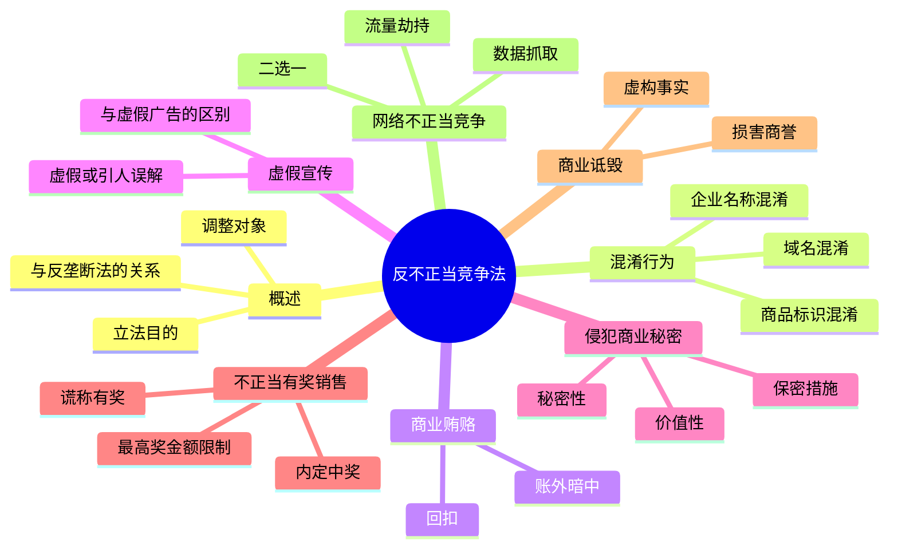

## 📍 章节定位

| 项目 | 信息 |
|------|------|
| **所属科目** | ⚖️ 经济法 |
| **难度等级** | ⭐⭐ |
| **历年分值** | 2-3 分（旧大纲） |
| **建议学时** | 3-4h |
| **教材地位** | **本章节已从现行 JC 教材和 CPA 经济法考试大纲中移除**，以下内容基于《反不正当竞争法》（2019 年修正）整理，仅供知识储备与延伸学习参考 |

> ⚠️ **重要提示**：现行 JC 注册会计师《经济法》官方教材共 12 章，最后一章为"涉外经济法律制度"，**不再单独设置**"反不正当竞争法律制度"一章。2019 年《反垄断法》修正后，国务院反垄断委员会已更名为"**国务院反垄断反不正当竞争委员会**"，反不正当竞争的相关执法职能由国家市场监督管理总局统一承担。近年（2022-2025）CPA 经济法考试中**未出现**反不正当竞争法的单独考题。本节内容为延伸学习资料，非考试重点。

## 📝 考情分析

### 历史考点回顾（已不考）

| 历史年份 | 题型 | 历史考点 |
|----------|------|----------|
| 2020 及以前 | 单选/多选 | 混淆行为认定、商业秘密构成要件、虚假宣传与虚假广告的区别 |
| 2019 及以前 | 单选 | 不正当有奖销售的最高奖金额限制、商业贿赂的认定 |

### 当前考试形势

- **2022-2025 年真题**：未出现反不正当竞争法单独考题；
- **现行教材**：JC 教材未单独设章，部分内容散见于反垄断法章节中关于"国务院反垄断反不正当竞争委员会"的介绍；
- **学习建议**：本章节内容可作为法律常识了解，**不建议投入大量复习时间**。如时间充裕，可重点了解混淆行为、商业秘密保护、网络不正当竞争等与实务相关的知识点。

## 🧠 知识框架

## 📖 核心精讲

### 一、反不正当竞争法概述

#### （一）立法目的

> 《反不正当竞争法》第一条：为了促进社会主义市场经济健康发展，鼓励和保护公平竞争，制止不正当竞争行为，保护经营者和消费者的合法权益，制定本法。

#### （二）调整对象

不正当竞争行为是指经营者在生产经营活动中，违反本法规定，扰乱市场竞争秩序，损害其他经营者或者消费者合法权益的行为。

#### （三）与反垄断法的关系

| 对比项 | 反垄断法 | 反不正当竞争法 |
|--------|----------|----------------|
| 规制对象 | 垄断行为（结构性） | 不正当竞争行为（行为性） |
| 关注重点 | 市场结构、竞争格局 | 经营者具体竞争行为 |
| 行为性质 | 限制、排除竞争 | 违反诚信、扰乱秩序 |
| 执法机构 | 国家市场监督管理总局 | 国家市场监督管理总局（统一执法） |

> 2019 年《反垄断法》修正后，国务院反垄断委员会更名为"**国务院反垄断反不正当竞争委员会**"，统筹协调反垄断和反不正当竞争工作。

### 二、七类不正当竞争行为

#### （一）混淆行为

经营者不得实施下列混淆行为，引人误认为是他人商品或者与他人存在特定联系：

1. 擅自使用与他人有一定影响的商品名称、包装、装潢等相同或近似的标识；
2. 擅自使用他人有一定影响的企业名称（包括简称、字号等）、社会组织名称（包括简称等）、姓名（包括笔名、艺名、译名等）；
3. 擅自使用他人有一定影响的域名主体部分、网站名称、网页等；
4. 其他足以引人误认为是他人商品或者与他人存在特定联系的混淆行为。

**构成要件**：①被仿冒对象须"有一定影响"；②足以引人误认。

#### （二）商业贿赂

经营者不得采用财物或者其他手段贿赂下列单位或者个人，以谋取交易机会或者竞争优势：

1. 交易相对方的工作人员；
2. 受交易相对方委托办理相关事务的单位或者个人；
3. 利用职权和影响力影响交易的单位或者个人。

> **关键要点**：经营者在交易活动中，可以以明示方式向交易相对方支付折扣，或者向中间人支付佣金。但支付方和接收方均须**如实入账**。"账外暗中"是认定商业贿赂的核心要件。

#### （三）虚假宣传

经营者不得对其商品的性能、功能、质量、销售状况、用户评价、曾获荣誉等作虚假或者引人误解的商业宣传，欺骗、误导消费者。

**与虚假广告的区别**：
- 虚假宣传：通过广告以外的其他方式（如产品说明、现场演示、网络评论等）进行虚假宣传，由市场监管部门查处；
- 虚假广告：通过广告方式进行虚假宣传，适用《广告法》，由市场监管部门查处。

#### （四）侵犯商业秘密

**商业秘密构成三要件**：

| 要件 | 含义 |
|------|------|
| 秘密性 | 不为公众所知悉 |
| 价值性 | 具有商业价值 |
| 保密性 | 经权利人采取相应保密措施 |

**侵犯商业秘密的行为类型**：

1. 以盗窃、贿赂、欺诈、胁迫、电子侵入或者其他不正当手段获取权利人的商业秘密；
2. 披露、使用或者允许他人使用以前项手段获取的权利人的商业秘密；
3. 违反保密义务或者违反权利人有关保守商业秘密的要求，披露、使用或者允许他人使用其所掌握的商业秘密；
4. 第三人明知或者应知商业秘密权利人的员工、前员工或者其他单位、个人实施上述违法行为，仍获取、披露、使用或者允许他人使用该商业秘密的，视为侵犯商业秘密。

#### （五）不正当有奖销售

经营者进行有奖销售不得存在下列情形：

1. 所设奖的种类、兑奖条件、奖金金额或者奖品等有奖销售信息不明确，影响兑奖；
2. 采用谎称有奖或者故意让内定人员中奖的欺骗方式进行有奖销售；
3. 抽奖式的有奖销售，最高奖的金额超过**5 万元人民币**。

> **重点提示**：5 万元限额仅适用于"抽奖式"有奖销售；"附赠式"有奖销售不受此限额约束。

#### （六）商业诋毁

经营者不得编造、传播虚假信息或者误导性信息，损害竞争对手的商业信誉、商品声誉。

**构成要件**：①主观故意；②编造、传播虚假或误导性信息；③损害竞争对手商誉；④行为对象须为竞争对手（有竞争关系）。

#### （七）网络不正当竞争（2019 年新增）

经营者利用网络从事生产经营活动，应当遵守本法的各项规定。经营者不得利用技术手段，通过影响用户选择或者其他方式，实施下列妨碍、破坏其他经营者合法提供的网络产品或者服务正常运行的行为：

1. 未经其他经营者同意，在其合法提供的网络产品或服务中，插入链接、强制进行目标跳转；
2. 误导、欺骗、强迫用户修改、关闭、卸载其他经营者合法提供的网络产品或服务；
3. 恶意对其他经营者合法提供的网络产品或服务实施不兼容；
4. 其他妨碍、破坏其他经营者合法提供的网络产品或服务正常运行的行为。

### 三、法律责任

| 行为类型 | 行政责任 |
|----------|----------|
| 混淆行为 | 没收违法商品，并处违法经营额 5 倍以下罚款；情节严重的，吊销营业执照 |
| 商业贿赂 | 没收违法所得，并处 10 万-300 万元罚款；情节严重的，吊销营业执照 |
| 虚假宣传 | 处 20 万-100 万元罚款；情节严重的，处 100 万-200 万元罚款，可吊销营业执照 |
| 侵犯商业秘密 | 处 10 万-100 万元罚款；情节严重的，处 50 万-500 万元罚款 |
| 不正当有奖销售 | 处 5 万-50 万元罚款 |
| 商业诋毁 | 处 10 万-50 万元罚款 |

民事责任：因不正当竞争行为受到损害的经营者的赔偿数额，按权利人因被侵权受到的实际损失或侵权人因侵权获得的利益确定；情节严重的，可在上述数额的 1 倍以上 5 倍以下确定赔偿数额。

## 💡 典型例题

### 例题 1（历史真题改编）——混淆行为

根据反不正当竞争法律制度的规定，下列行为中，属于混淆行为的有（　　）。
A. 擅自使用与他人有一定影响的商品包装近似的标识
B. 擅自使用他人有一定影响的企业字号
C. 擅自使用他人有一定影响的域名主体部分
D. 在商品上使用自己注册的商标

**【答案】ABC**

**【解析】**混淆行为的 4 种法定情形包括：①擅自使用有一定影响的商品名称、包装、装潢等相同或近似标识；②擅自使用有一定影响的企业名称（含简称、字号）、社会组织名称、姓名；③擅自使用有一定影响的域名主体部分、网站名称、网页等；④其他足以引人误认的混淆行为。选项 D 使用自己注册的商标属于合法行为。

### 例题 2（模拟）——商业秘密

根据反不正当竞争法律制度的规定，下列关于商业秘密的表述中，正确的是（　　）。
A. 商业秘密的构成要件包括秘密性、价值性和保密性
B. 经营者通过自行研发获得的技术信息，构成侵犯他人商业秘密
C. 第三人不知情获取并使用他人商业秘密的，视为侵犯商业秘密
D. 商业秘密一旦公开，仍受反不正当竞争法保护

**【答案】A**

**【解析】**
- A 对：商业秘密构成三要件为秘密性、价值性、保密性；
- B 错：通过自行研发、反向工程等合法方式获得的技术信息，不构成侵犯商业秘密；
- C 错：第三人**明知或应知**商业秘密权利人的员工等实施违法行为，仍获取、披露、使用或允许他人使用的，才视为侵犯商业秘密。第三人**不知情**的，不构成侵权；
- D 错：商业秘密一旦公开，丧失"秘密性"要件，不再受反不正当竞争法保护。

### 例题 3（模拟）——不正当有奖销售

根据反不正当竞争法律制度的规定，下列关于有奖销售的表述中，正确的是（　　）。
A. 抽奖式有奖销售最高奖金额不得超过 10 万元
B. 附赠式有奖销售的最高奖金额不得超过 5 万元
C. 采用谎称有奖的方式进行有奖销售，属于不正当有奖销售
D. 经营者可以采用故意让内定人员中奖的方式举办促销活动

**【答案】C**

**【解析】**
- A 错：抽奖式有奖销售最高奖金额不得超过 **5 万元**；
- B 错：5 万元限额仅适用于"抽奖式"有奖销售，"附赠式"有奖销售不受此限额约束；
- C 对：谎称有奖或故意让内定人员中奖均属于不正当有奖销售；
- D 错：故意让内定人员中奖属于欺骗方式进行有奖销售，被法律禁止。

## 🎯 记忆口诀

### 1. 七类不正当竞争行为（口诀：混贿虚秘奖诋网）

> **混**淆行为 → 商业**贿**赂 → **虚**假宣传 → 侵犯商业**秘**密 → 不正当有**奖**销售 → 商业**诋**毁 → **网**络不正当竞争

### 2. 商业秘密三要件（口诀：秘价保）

> **秘**密性（不为公众所知悉）→ **价**值性（具有商业价值）→ **保**密性（采取保密措施）

### 3. 抽奖式有奖销售限额（口诀：五万抽奖）

> 抽奖式有奖销售最高奖金额不得超过 **5 万元**

### 4. 网络不正当竞争三情形（口诀：插跳强关不兼容）

> **插**入链接强制**跳**转 → **强**迫用户**关**闭卸载 → 恶意实施**不兼容**

### 5. 反垄断与反不正当竞争对比（口诀：垄断结构，竞争行为）

> **反垄断法**：规制**结构性**垄断（市场支配地位、经营者集中等）
> **反不正当竞争法**：规制**行为性**不正当竞争（混淆、贿赂、虚假宣传等）

## ✅ 同步练习

### 单项选择题

1. 根据反不正当竞争法律制度的规定，抽奖式有奖销售的最高奖金额不得超过（　　）。
   A. 1 万元
   B. 5 万元
   C. 10 万元
   D. 50 万元

2. 根据反不正当竞争法律制度的规定，商业秘密的构成要件不包括（　　）。
   A. 秘密性
   B. 价值性
   C. 保密性
   D. 独创性

3. 根据反不正当竞争法律制度的规定，经营者在交易活动中支付折扣的，支付方和接收方均须（　　）。
   A. 经商务主管部门批准
   B. 如实入账
   C. 签订书面协议
   D. 向消费者公示

4. 根据反不正当竞争法律制度的规定，下列行为中，属于商业诋毁的是（　　）。
   A. 经营者编造、传播虚假信息，损害竞争对手的商业信誉
   B. 经营者在广告中夸大自己商品的功效
   C. 经营者以低于成本的价格销售商品
   D. 经营者擅自使用他人商品的包装

5. 根据反不正当竞争法律制度的规定，下列关于网络不正当竞争的表述中，正确的是（　　）。
   A. 经营者可以未经同意在其他经营者的网络产品中插入链接
   B. 经营者可以误导用户关闭其他经营者合法提供的网络产品
   C. 经营者不得恶意对其他经营者合法提供的网络产品实施不兼容
   D. 网络不正当竞争行为不适用《反不正当竞争法》

### 多项选择题

6. 根据反不正当竞争法律制度的规定，下列行为中，属于混淆行为的有（　　）。
   A. 擅自使用与他人有一定影响的商品名称相同的标识
   B. 擅自使用他人有一定影响的企业简称
   C. 擅自使用他人有一定影响的网页设计
   D. 使用自己合法注册的商标

7. 根据反不正当竞争法律制度的规定，商业秘密的构成要件包括（　　）。
   A. 不为公众所知悉
   B. 具有商业价值
   C. 经权利人采取相应保密措施
   D. 已获得专利权保护

8. 根据反不正当竞争法律制度的规定，下列关于不正当有奖销售的表述中，正确的有（　　）。
   A. 谎称有奖属于不正当有奖销售
   B. 故意让内定人员中奖属于不正当有奖销售
   C. 抽奖式有奖销售最高奖金额不得超过 5 万元
   D. 附赠式有奖销售最高奖金额不得超过 5 万元

9. 根据反不正当竞争法律制度的规定，下列行为中，属于侵犯商业秘密的有（　　）。
   A. 以盗窃手段获取权利人的商业秘密
   B. 违反保密义务披露所掌握的商业秘密
   C. 通过自行研发获得与权利人相同的技术信息
   D. 第三人明知他人以不正当手段获取商业秘密，仍使用该商业秘密

10. 根据反不正当竞争法律制度的规定，经营者利用网络从事生产经营活动，不得实施的行为包括（　　）。
    A. 未经同意插入链接、强制目标跳转
    B. 误导、欺骗、强迫用户修改、关闭、卸载其他经营者的网络产品
    C. 恶意对其他经营者的网络产品实施不兼容
    D. 在自己经营的平台发布自营商品广告

### 案例分析题

11. **【综合案例】**甲公司是一家知名饮料生产商，其"清风"牌饮料在市场上具有较高知名度，包装装潢具有显著特征。乙公司是新成立的饮料生产商，其生产的"轻风"牌饮料在包装、装潢、颜色搭配上与甲公司产品高度相似，且"轻风"与"清风"读音相近。丙公司是甲公司的前员工，离职前掌握了甲公司的核心配方和客户名单。丙离职后成立丁公司，使用甲公司的核心配方和客户名单生产销售同类饮料。

**要求**：
（1）分析乙公司的行为是否构成不正当竞争？如构成，属于何种类型？
（2）分析丙公司使用甲公司核心配方和客户名单的行为是否构成侵犯商业秘密？说明理由。
（3）若丙公司在离职前与甲公司签订了保密协议，分析其责任。
（4）若丁公司明知丙是通过不正当手段获取的甲公司商业秘密，仍使用该商业秘密，分析丁公司的责任。

**【参考答案】**

（1）乙公司的行为**构成不正当竞争**，属于**混淆行为**。乙公司生产的"轻风"牌饮料在包装、装潢、颜色搭配上与甲公司有一定影响的"清风"牌饮料高度相似，且名称读音相近，足以引人误认为是甲公司商品或与甲公司存在特定联系，违反《反不正当竞争法》关于混淆行为的规定。

（2）丙公司使用甲公司核心配方和客户名单的行为**构成侵犯商业秘密**。理由：①核心配方和客户名单符合商业秘密的三要件（秘密性、价值性、保密性）；②丙作为甲公司前员工，违反保密义务或甲公司关于保守商业秘密的要求，披露、使用其所掌握的商业秘密，属于侵犯商业秘密的法定情形。

（3）丙公司在离职前与甲公司签订保密协议，进一步证明甲公司对商业秘密采取了相应的保密措施，满足商业秘密"保密性"要件。丙违反保密协议使用商业秘密，不仅构成侵犯商业秘密，还构成违约，甲公司可依据保密协议追究其违约责任或侵权责任（择一适用）。

（4）丁公司**视为侵犯商业秘密**。根据《反不正当竞争法》，第三人**明知或者应知**商业秘密权利人的员工、前员工或其他单位、个人实施侵犯商业秘密的违法行为，仍获取、披露、使用或者允许他人使用该商业秘密的，视为侵犯商业秘密。丁公司明知丙通过不正当手段获取商业秘密仍使用，应承担相应的法律责任。

---

> **复习建议**：本章节已从现行 CPA 经济法考试大纲中移除，建议仅在时间充裕时作为法律常识了解。重点把握七类不正当竞争行为的类型化记忆，特别是混淆行为的"有一定影响"要件、商业秘密的三要件（秘价保）、抽奖式有奖销售 5 万元限额、网络不正当竞争的三种典型情形。如时间紧张，可跳过本章，将精力投入反垄断法、涉外经济法等必考章节。
