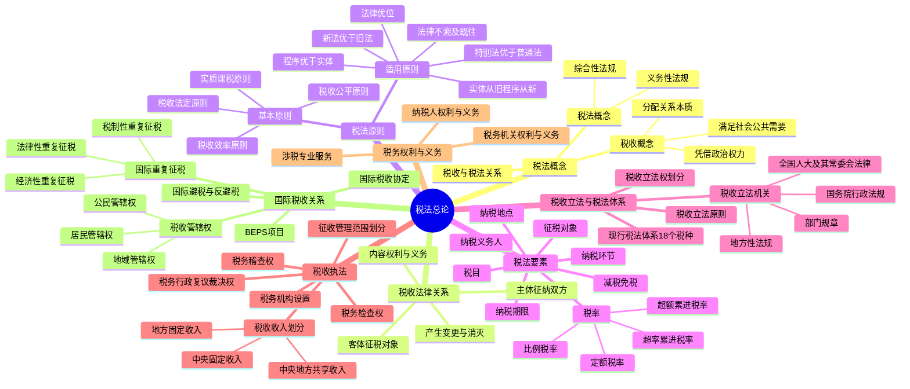

## 1. 章节定位

| 项目 | 信息 |
|------|------|
| 所属科目 | 税法 |
| 难度等级 | 2 |
| 历年分值 | 2-3 分 |
| 建议学时 | 4-5 小时 |
| 知识关联章节 | 第2章 增值税法、第4章 企业所得税法、第5章 个人所得税法、第14章 税收征收管理法 |

## 2. 考情分析

本章是税法科目的开篇总论章，系统阐述税法基础理论与我国税法体系框架。历年分值约 2-3 分，以客观题形式考查，偶尔在综合题中涉及税法原则的运用。虽然分值不高，但所建立的概念体系是后续各税种学习的基础，税法要素（纳税人、征税对象、税率等）的分类与含义贯穿全书。

**命题规律**：本章考查集中在概念辨析与框架性知识，出题点较为固定。高频考点包括：税法基本原则与适用原则的辨析（特别是税收法定原则、法律优位原则、实体从旧程序从新原则）、税法要素中税率形式的判断（比例税率、超额累进税率、定额税率、超率累进税率）、税收立法权的划分层次与立法机关对应的法律级次、税收执法权的种类、税收收入在中央与地方之间的划分、国际重复征税的三种类型与消除方法。

**复习建议**：本章以记忆性内容为主，复习时应重点把握原则性、框架性内容，无需深究细节条文。建议制作税收立法机关与法律级次对照表、税率形式分类表、税收收入划分表进行对比记忆。注意区分税法基本原则（4 项）与税法适用原则（6 项）的范围，以及超额累进税率与全额累进税率的计算差异。

## 3. 知识框架

## 4. 核心精讲

### 4.1 税收与税法的概念

#### 4.1.1 税收的概念

税收是政府为了满足社会公共需要，凭借政治权力，按照法律的规定，强制、无偿地取得财政收入的一种形式。理解税收的内涵需要从三个方面把握：

1. **税收是国家取得财政收入的一种重要工具，其本质是一种分配关系。** 国家要行使职能必须有一定的财政收入作为保障。取得财政收入的手段多种多样（如征税、发行货币、发行国债、收费、罚没等），其中税收是大部分国家取得财政收入的主要形式。税收解决的是分配问题，是国家参与社会产品价值分配的法定形式，处于社会再生产的分配环节，因而从本质上它体现的是一种分配关系。

2. **国家征税的依据是政治权力，它有别于按生产要素进行的分配。** 税收分配是以国家为主体进行的分配，而一般分配则是以各生产要素的所有者为主体进行的分配；税收分配是国家凭借政治权力、以法律的形式进行的分配，而一般分配则是基于生产要素进行的分配。

3. **国家征税的目的是满足社会公共需要。** 公共产品提供的特殊性决定了公共支出一般情况下不可能由公民个人、企业采取自愿出价的方式，而只能采用由国家强制征税的方式。国家征税的目的是满足提供社会公共产品的需要，以及弥补市场失灵、促进公平分配等的需要。

#### 4.1.2 税法的概念与特征

税法是指用以调整国家与纳税人之间在征纳税方面的权利及义务关系的法律规范的总称，它构建了国家及纳税人依法征税、依法纳税的行为准则体系，其目的是保障国家利益和纳税人的合法权益，维护正常的税收秩序，保证国家的财政收入。

税法具有两个显著特征：

- **义务性法规**：从法律性质上看，税法属于义务性法规，以规定纳税人的义务为主。税法属于义务性法规，并不是指税法没有规定纳税人的权利，而是指纳税人的权利是建立在其纳税义务的基础之上，处于从属地位。这一特点由税收的无偿性和强制性所决定。
- **综合性法规**：税法是由一系列单行税收法律法规及行政规章制度组成的体系，其内容涉及课税的基本内容、征纳双方的权利和义务、税收管理规则、法律责任、解决税务争议的法律规范等。

#### 4.1.3 税收与税法的关系

税收与税法之间既存在区别又有联系。税收是经济学概念，其调整的对象是征税形成的分配关系；税法是法学概念，其调整的对象是税收法律关系主体的权利与义务关系。税收的无偿性、强制性、固定性决定了税收分配关系属于基本经济制度，应该以法律的形式来实现，因而税收是税法的主体内容，税法是税收的存在形式。

### 4.2 税收法律关系

税收法律关系是税法所确认和调整的国家与纳税人之间、国家与国家之间以及各级政府之间在税收分配过程中形成的权利与义务关系。

#### 4.2.1 税收法律关系的构成

税收法律关系由主体、客体和内容三方面构成：

1. **税收法律关系的主体**：即税收法律关系中享有权利和承担义务的当事人。在我国，税收法律关系的主体包括征纳双方：一方是代表国家行使征税职责的国家行政机关（包括国家各级税务机关和海关）；另一方是履行纳税义务的人（包括法人、自然人和其他组织，在华的外国企业、组织、外籍人、无国籍人等）。我国采取属地兼属人的原则。

2. **税收法律关系的客体**：即税收法律关系主体的权利、义务所共同指向的对象，也就是征税对象。例如，所得税法律关系的客体是生产经营所得和其他所得，财产税法律关系的客体是财产，流转税法律关系的客体是货物或劳务收入。

3. **税收法律关系的内容**：即主体所享有的权利和应承担的义务，这是税收法律关系中最实质的东西。税务机关的权利主要表现在依法征税、税务检查以及对违章者进行处罚；其义务主要是宣传辅导税法、及时解缴税款、依法受理税收争议申诉等。纳税人的权利包括多缴税款申请退还权、延期纳税权、依法申请减免税权、申请复议和提起诉讼权等；其义务包括办理税务登记、进行纳税申报、接受税务检查、依法缴纳税款等。

#### 4.2.2 税收法律关系的产生、变更与消灭

税法是引起税收法律关系的前提条件，但税法本身并不能产生具体的税收法律关系。税收法律关系的产生、变更与消灭必须由税收法律事实来决定。税收法律事实分为：

- **税收法律事件**：不以税收法律关系权力主体的意志为转移的客观事件（如自然灾害导致税收减免）。
- **税收法律行为**：税收法律关系主体在正常意志支配下作出的活动（如纳税人开业经营产生税收法律关系，转业或停业造成变更或消灭）。

### 4.3 税法与其他法律的关系

税法以税收关系为调整对象，属于公法，但具有一些私法属性。

| 关系 | 区别 | 联系 |
|------|------|------|
| 税法与宪法 | 宪法是根本大法，效力最高 | 税法依据宪法原则制定；《宪法》第五十六条规定公民有依法纳税的义务 |
| 税法与民法 | 民法调整平等主体关系，特点为平等、等价、有偿；税法调整国家与纳税人关系，带有强制特点 | 税法某些规范相同时援引民法条款；涉及税收征纳关系时以税法为准 |
| 税法与刑法 | 刑法关于犯罪与刑罚，税法调整征纳关系 | 违反税法不一定构成刑事犯罪，情节严重者承担刑事责任；2009年起"偷税"被"逃避缴纳税款"取代 |
| 税法与行政法 | 行政法多为授权性法规；税法具有经济分配性质，是义务性法规 | 税法具有行政法一般特性；争议解决按行政复议和行政诉讼程序 |

### 4.4 税法原则

税法原则反映税收活动的根本属性，是税收法律制度建立的基础，包括税法基本原则和税法适用原则。

#### 4.4.1 税法基本原则（4 项）

税法基本原则是统领所有税收规范的根本准则。

| 原则 | 含义 |
|------|------|
| 税收法定原则 | 税法主体的权利义务必须由法律加以规定，税法各类构成要素必须且只能由法律予以明确。包括税收要件法定原则和税务合法性原则。是税法基本原则的核心 |
| 税收公平原则 | 包括横向公平和纵向公平，税收负担必须根据纳税人的负担能力分配，负担能力相等税负相同，负担能力不等税负不同 |
| 税收效率原则 | 包含经济效率（有利于资源有效配置和经济体制有效运行）和行政效率（提高税收行政效率，节约征管成本）两方面 |
| 实质课税原则 | 应根据客观事实确定是否符合课税要件，根据纳税人的真实负担能力决定税负，不能仅考虑外观和形式 |

#### 4.4.2 税法适用原则（6 项）

税法适用原则是税务行政机关和司法机关运用税收法律规范解决具体问题所必须遵循的准则，含有更多的法律技术性准则。

| 原则 | 含义 |
|------|------|
| 法律优位原则 | 法律的效力高于行政立法的效力，税收法律效力高于税收行政法规，行政法规效力优于行政规章 |
| 法律不溯及既往原则 | 新法实施后，对新法实施之前人们的行为不得适用新法，只能沿用旧法。目的在于维护税法稳定性和可预测性 |
| 新法优于旧法原则 | 新法、旧法对同一事项有不同规定时，新法效力优于旧法。当新法与旧法处于普通法与特别法关系时，可例外 |
| 特别法优于普通法原则 | 对同一事项两部法律分别订有一般和特别规定时，特别规定效力高于一般规定。打破了税法效力等级限制 |
| 实体从旧、程序从新原则 | 实体税法不具备溯及力（以纳税义务发生时税法为准）；程序性税法在特定条件下具备一定溯及力（新税法公布前发生但公布后进入征收程序的，新税法有约束力） |
| 程序优于实体原则 | 在诉讼发生时税收程序法优于税收实体法，确保国家课税权实现，不因争议影响税款及时足额入库 |

### 4.5 税法要素

税法要素是指各种单行税法具有的共同的基本要素的总称。税法要素既包括实体性的，也包括程序性的，是所有完善的单行税法都共同具备的。税种要素通常包含纳税义务人、征税对象、税目、税率、纳税环节、纳税期限、纳税地点、税收优惠等。

#### 4.5.1 纳税义务人

纳税义务人（纳税人）是税法规定的直接负有纳税义务的单位和个人。纳税人有两种基本形式：自然人和法人。

与纳税人紧密联系的两个概念：

- **代扣代缴义务人**：虽不承担纳税义务，但在向纳税人支付收入、结算货款、收取费用时有义务代扣代缴其应纳税款的单位和个人。如出版社代扣代缴作者稿酬所得个人所得税。
- **代收代缴义务人**：虽不承担纳税义务，但在向纳税人收取商品或劳务收入时有义务代收代缴其应纳税款的单位和个人。如委托加工应税消费品，由受托方代收代缴消费税。

#### 4.5.2 征税对象与税基

**征税对象**（课税对象）是税法规定的对什么征税，是征纳税双方权利义务共同指向的客体，是区别一种税与另一种税的重要标志，也是税法最基本的要素。征税对象按性质可划分为流转额、所得额、财产、资源、特定行为五大类。

**税基**（计税依据）是据以计算征税对象应纳税款的直接数量依据，解决对征税对象课税的计算问题，是对课税对象的量的规定。计税依据有两种基本形态：

| 形态 | 含义 | 举例 |
|------|------|------|
| 从价计征 | 按征税对象的货币价值计算 | 化妆品消费税以销售收入为税基 |
| 从量计征 | 按征税对象物理形态的自然单位计算 | 城镇土地使用税以占用土地面积为税基 |

#### 4.5.3 税目

税目是在税法中对征税对象分类规定的具体的征税项目，反映具体的征税范围，是对课税对象质的界定。并非所有税种都需要规定税目（如企业所得税不设税目），有些税种具体课税对象复杂需要规定税目（如消费税）。

#### 4.5.4 税率

税率是对征税对象的征收比例或征收程度，是计算税额的尺度，也是衡量税负轻重与否的重要标志。我国现行税率主要有四种：

**（1）比例税率**

对同一征税对象，不分数额大小，规定相同的征收比例。分为三种具体形式：

| 形式 | 含义 | 举例 |
|------|------|------|
| 单一比例税率 | 对同一征税对象的所有纳税人都适用同一比例税率 | — |
| 差别比例税率 | 对同一征税对象的不同纳税人适用不同比例（产品差别、行业差别、地区差别） | 消费税（产品）、增值税（行业）、城市维护建设税（地区） |
| 幅度比例税率 | 税法只规定最低和最高税率，各地区在幅度内确定具体适用税率 | — |

**（2）超额累进税率**

把征税对象按数额大小分成若干等级，每一等级规定一个税率，税率依次提高，每一位纳税人的征税对象依所属等级同时适用几个税率分别计算，将计算结果相加得出应纳税额。目前我国采用超额累进税率的税种是个人所得税。

**速算扣除数法**：为了简化计算，采用速算法。

- 速算扣除数 = 按全额累进方法计算的税额 − 按超额累进方法计算的税额
- 按超额累进方法计算的税额 = 按全额累进方法计算的税额 − 速算扣除数

**【计算示例】** 某人某月应纳税所得额为 6000 元，适用三级超额累进税率表（5000 元以下 10%，5000-20000 元 20%，20000 元以上 30%，速算扣除数分别为 0、500、2500）：

- 分步计算：第 1 级 5000×10% = 500 元；第 2 级 (6000−5000)×20% = 200 元；合计 700 元
- 速算法：6000×20% − 500 = 700 元

**（3）定额税率**

按征税对象确定的计算单位，直接规定一个固定的税额。目前采用定额税率的有城镇土地使用税、车船税等。

**（4）超率累进税率**

以征税对象数额的相对率划分为若干级距，分别规定相应的差别税率，相对率每超过一个级距的，对超过的部分按高一级的税率计算征税。目前我国采用超率累进税率的是土地增值税。

#### 4.5.5 纳税环节、纳税期限与纳税地点

- **纳税环节**：税法规定的征税对象在从生产到消费的流转过程中应当缴纳税款的环节。按某税种征税环节的多少，可分为一次课征制或多次课征制。
- **纳税期限**：关于税款缴纳时间方面的限定，包含三个概念：纳税义务发生时间（应税行为发生的时间）、纳税期限（每隔固定时间汇总一次纳税义务的时间）、缴库期限（纳税期满后将税款缴入国库的期限）。
- **纳税地点**：根据各税种纳税对象的纳税环节和有利于对税款的源泉控制而规定的纳税人申报缴纳税款的具体地点。

### 4.6 税收立法与我国税法体系

#### 4.6.1 税收立法原则

税收立法主要遵循以下原则：从实际出发的原则、公平原则、民主决策的原则、原则性与灵活性相结合的原则、法律的稳定性与连续性及废改立相结合的原则。

#### 4.6.2 税收立法权及其划分

税收立法权是制定、修改、解释或废止税收法律、法规、规章和规范性文件的权力。我国税收立法权的划分根据税收执法的级次来划分，具体层次如下：

1. 全国性税种的立法权属于全国人大及其常委会。
2. 经全国人大及其常委会授权，全国性税种可先由国务院以"条例"或"暂行条例"形式发布施行。
3. 经授权，国务院有制定税法实施细则、增减税目和调整税率的权力。
4. 经授权，国务院有税法具体应用问题的解释权；国家税务主管部门（财政部、国家税务总局及海关总署）有税收条例的解释权和制定实施细则的权力。
5. 对于尚未制定税收法律的地方税种，经国务院授权，省级人民政府有制定实施细则的权力。

#### 4.6.3 税收立法机关与法律级次

| 立法机关 | 法律形式 | 法律效力 | 举例 |
|----------|----------|----------|------|
| 全国人大及其常委会 | 税收法律 | 仅次于宪法，最高 | 《企业所得税法》《个人所得税法》《税收征收管理法》 |
| 全国人大及其常委会授权国务院 | 授权立法（暂行条例） | 具有国家法律性质，高于行政法规 | 增值税、消费税等暂行条例 |
| 国务院 | 税收行政法规 | 低于法律，高于地方法规和规章 | 《企业所得税法实施条例》《税收征收管理法实施细则》 |
| 省、自治区、直辖市人大及常委会 | 税收地方性法规 | 不得与法律、行政法规抵触 | 海南省、民族自治地区可制定 |
| 财政部、国家税务总局、海关总署 | 税收部门规章 | 全国范围适用，不得与法律、行政法规抵触 | 《消费税暂行条例实施细则》 |
| 地方政府 | 税收地方规章 | 须在法律、法规授权前提下 | 各省制定的实施细则 |

#### 4.6.4 我国现行税法体系

我国现行一共有 **18 个税种**，按照征税对象不同分为五类：

| 类别 | 税种 |
|------|------|
| 商品（货物）和劳务税类 | 增值税、消费税、关税 |
| 所得税类 | 企业所得税、个人所得税 |
| 财产和行为税类 | 房产税、车船税、印花税、契税 |
| 资源税和环境保护税类 | 资源税、环境保护税、城镇土地使用税 |
| 特定目的税类 | 城市维护建设税、车辆购置税、耕地占用税、船舶吨税、烟叶税、土地增值税 |

其他分类标准：
- 按税负是否容易转嫁：直接税（企业所得税、个人所得税等）和间接税（消费税、关税等）。
- 按计税价格是否包含税款：价内税（消费税）和价外税（增值税）。
- 按主权国家行使税收管辖权：国内税法和国际税法。

### 4.7 税收执法

#### 4.7.1 税务机构设置

现行税务机构设置为：中央政府设立国家税务总局（正部级），省及省以下国税地税机构合并整合，统一设置为省、市、县三级税务局，实行以国家税务总局为主与省（自治区、直辖市）人民政府双重领导管理体制。海关总署及下属机构负责关税征收管理和受托征收进口增值税、消费税等。

#### 4.7.2 税收征收管理范围划分

| 征收系统 | 负责征收的税种 |
|----------|----------------|
| 税务系统 | 增值税、消费税、车辆购置税、企业所得税、个人所得税、资源税、城镇土地使用税、耕地占用税、土地增值税、房产税、车船税、印花税、契税、城市维护建设税、环境保护税、烟叶税（共 16 个税种） |
| 海关系统 | 关税、船舶吨税；代征进口环节增值税和消费税 |

#### 4.7.3 税收收入划分

| 收入类型 | 税种 |
|----------|------|
| 中央政府固定收入 | 消费税（含进口环节海关代征部分）、车辆购置税、关税、船舶吨税、海关代征进口环节增值税 |
| 地方政府固定收入 | 城镇土地使用税、耕地占用税、土地增值税、房产税、车船税、契税、环境保护税、烟叶税 |
| 中央与地方共享收入 | 增值税（中央 50%、地方 50%）、企业所得税（中央 60%、地方 40%）、个人所得税（同企业所得税）、资源税（海洋石油企业归中央，其余归地方）、城市维护建设税（铁路/银行总行/保险总公司集中缴纳归中央，其余归地方）、印花税（证券交易印花税全部归中央，其他归地方） |

#### 4.7.4 税收执法权的种类

税收执法权具体包括：税款征收管理权、税务检查权、税务稽查权、税务行政复议裁决权及其他税务管理权（如税务行政处罚权）。

税务行政处罚的种类包括：警告（责令限期改正）、罚款、停止出口退税权、没收违法所得、收缴发票或停止发售发票、提请吊销营业执照、通知出境管理机关阻止出境等。

### 4.8 税务权利与义务

#### 4.8.1 税务机关的权利与义务

**权利**：负责税收征收管理工作；依法执行职务，任何单位和个人不得阻挠。

**义务**（主要）：广泛宣传税收法律、行政法规；加强队伍建设；秉公执法、清正廉洁；不得索贿受贿、徇私舞弊；建立健全内部制约和监督管理制度；为检举人保密并给予奖励；税务人员在特定关系下应回避（夫妻关系、直系血亲关系、三代以内旁系血亲关系、近姻亲关系、可能影响公正执法的其他利益关系）。

#### 4.8.2 纳税人的权利与义务

**权利**：向税务机关了解税收法律规定的权利；要求税务机关保密商业秘密及个人隐私的权利；依法申请减税、免税、退税的权利；陈述权、申辩权；申请行政复议、提起行政诉讼、请求国家赔偿的权利；控告和检举税务机关违法违纪行为的权利。

**义务**：依照法律、行政法规规定缴纳税款，代扣代缴、代收代缴税款；如实向税务机关提供与纳税有关的信息；接受税务机关依法进行的税务检查。

#### 4.8.3 涉税专业服务

涉税专业服务机构包括税务师事务所和从事涉税专业服务的会计师事务所、律师事务所、代理记账机构、税务代理公司、财税类咨询公司等。涉税业务内容包括：纳税申报代理、一般税务咨询、专业税务顾问、税收策划、涉税鉴证、纳税情况审查、其他税务事项代理等。

### 4.9 国际税收关系

#### 4.9.1 税收管辖权

税收管辖权属于国家主权在税收领域中的体现。按照国际公认的划分原则：

| 管辖权类型 | 确立原则 | 含义 |
|------------|----------|------|
| 居民管辖权 | 属人原则 | 对本国居民来自世界范围的全部所得行使征税权 |
| 地域管辖权 | 属地原则 | 对发生于领土范围内的应税活动和来源于境内的全部所得行使征税权（又称收入来源地管辖权） |
| 公民管辖权 | 属人原则 | 依据纳税人国籍行使税收管辖权 |

#### 4.9.2 国际重复征税

国际重复征税是指两个或两个以上国家对同一跨国纳税人的同一征税对象分别进行征税所形成的交叉重叠征税。

**三种类型**：

| 类型 | 含义 |
|------|------|
| 法律性国际重复征税 | 不同国家对同一纳税人的同一税源进行的重复征税，因不同国家采取不同征税原则导致税收管辖权重叠 |
| 经济性国际重复征税 | 不同国家对不同纳税人的同一税源进行的重复征税，一般由股份公司经济组织形式引起（公司利润和股息红利属于同源所得） |
| 税制性国际重复征税 | 各国普遍实行复合税制度导致的不同国家对同一税源课征多次相同或类似税种 |

**产生原因**：各国行使的税收管辖权的重叠是国际重复征税的根本原因。主要情形包括：居民（公民）管辖权与地域管辖权的重叠、居民（公民）管辖权与居民（公民）管辖权的重叠、地域管辖权与地域管辖权的重叠。其中最主要的是收入来源地管辖权和居民管辖权的重叠。

#### 4.9.3 国际税收协定

国际税收协定是两个或两个以上主权国家为了协调相互间处理跨国纳税人征税事务的税收关系，本着对等原则经由政府谈判所签订的书面协议或条约。

国际税收协定的主要内容包括：适用范围（人和税种的范围）、基本用语的定义、对所得和财产的课税、避免双重征税的办法（免税法、抵免法等）、税收无差别待遇（国籍无差别、常设机构无差别、支付无差别、资本无差别）、防止国际偷税漏税和国际避税（情报交换和转让定价）。

#### 4.9.4 国际避税、反避税与国际税收合作

**国际避税**是指纳税人利用两个或两个以上国家的税法和国家间税收协定的漏洞、特例和缺陷，规避或减轻其全球总纳税义务的行为。

**BEPS（税基侵蚀和利润转移）**是指跨国企业利用国际税收规则的不足、各国税制差异和征管漏洞，最大限度地减少其全球总体税负，甚至达到双重不征税的效果。BEPS 项目由 G20 领导人背书，委托 OECD 推进。

我国签署的 3 项国际多边合作协定：

1. **《多边税收征管互助公约》**（2013 年 8 月 27 日签署）——通过国际税收征管互助应对和防范跨境逃避税。
2. **《金融账户涉税信息自动交换多边主管当局间协议》**（2015 年 12 月 16 日签署）——加强国际税收信息交换，截至 2023 年 4 月已有 119 个国家（地区）签署，我国交换伙伴有 106 个。
3. **《实施税收协定相关措施以防止税基侵蚀和利润转移（BEPS）的多边公约》**（2017 年 6 月 7 日签署）——全球首个对所得税税收协定进行多边协调的法律文件，2022 年 9 月 1 日对我国生效。

## 5. 典型例题

### 例题 1

**题目**：下列各项中，属于税法适用原则的有（ ）。

A. 法律优位原则
B. 税收法定原则
C. 实体从旧、程序从新原则
D. 实质课税原则
E. 程序优于实体原则

**答案**：A、C、E

**解析**：税法原则分为税法基本原则和税法适用原则。税法基本原则包括税收法定原则、税收公平原则、税收效率原则、实质课税原则（共 4 项）。税法适用原则包括法律优位原则、法律不溯及既往原则、新法优于旧法原则、特别法优于普通法原则、实体从旧程序从新原则、程序优于实体原则（共 6 项）。B 项和 D 项属于税法基本原则而非适用原则。

### 例题 2

**题目**：下列税种中，由海关系统负责征收管理的有（ ）。

A. 关税
B. 船舶吨税
C. 消费税
D. 车辆购置税

**答案**：A、B

**解析**：海关系统负责征收管理的税种有关税和船舶吨税，同时海关负责代征进口环节的增值税和消费税。消费税和车辆购置税由税务系统负责征收管理。注意：进口环节的增值税和消费税虽由海关代征，但消费税本身的征收管理由税务机关负责，进口环节只是代征。

### 例题 3

**题目**：下列关于税收收入划分的表述中，正确的是（ ）。

A. 增值税收入全部归中央政府
B. 企业所得税中央与地方按 50% : 50% 比例分享
C. 证券交易印花税全部为中央收入
D. 资源税收入全部归地方政府

**答案**：C

**解析**：A 错误，增值税国内部分中央与地方各分享 50%，进口环节由海关代征的增值税为中央收入。B 错误，企业所得税中央与地方按 60% : 40% 比例分享（中国国家铁路集团、各银行总行及海洋石油企业缴纳的部分归中央）。C 正确，证券交易印花税全部为中央收入。D 错误，资源税中海洋石油企业缴纳的部分归中央政府，其余部分归地方政府。

### 例题 4

**题目**：某人某月应纳税所得额为 25000 元，适用三级超额累进税率表：5000 元以下税率 10%（速算扣除数 0）；5000-20000 元税率 20%（速算扣除数 500）；20000 元以上税率 30%（速算扣除数 2500）。请用速算扣除数法计算其应纳税额。

**答案**：

25000 元属于第 3 级（20000 元以上），适用税率 30%，速算扣除数 2500。

应纳税额 = 25000 × 30% − 2500 = 7500 − 2500 = 5000（元）

**解析**：速算扣除数法的公式为"应纳税额 = 应纳税所得额 × 适用税率 − 速算扣除数"。首先根据应纳税所得额确定所属级次及对应税率和速算扣除数，然后代入公式计算。验证：分步计算 = 5000×10% + (20000−5000)×20% + (25000−20000)×30% = 500 + 3000 + 1500 = 5000（元），结果一致。

## 6. 记忆口诀

1. **税法两特征**："义务性加综合性"——税法属于义务性法规（以规定纳税人义务为主），又是综合性法规（一系列单行税收法律法规组成的体系）。

2. **税收本质三要点**："分配关系、政治权力、公共需要"——税收本质是分配关系，依据是政治权力，目的是满足社会公共需要。

3. **税法基本原则四项**："法定、公平、效率、实质课税"——税收法定原则（核心）、税收公平原则、税收效率原则、实质课税原则。

4. **税法适用原则六项**："法律优位、不溯及既往、新法优于旧法、特别法优于普通法、实体从旧程序从新、程序优于实体"——前四项处理法律效力冲突，后两项处理实体与程序的关系。

5. **税率四种形式**："比例、超额累进、定额、超率累进"——增值税等用比例税率，个人所得税用超额累进税率，城镇土地使用税和车船税用定额税率，土地增值税用超率累进税率。

6. **速算扣除数公式**："全额减超额等于速算扣除数"——速算扣除数 = 按全额累进方法计算的税额 − 按超额累进方法计算的税额。

7. **立法机关与法律级次**："人大法律、国务院法规、部委规章、地方法规"——全国人大及其常委会制定税收法律（效力最高），国务院制定行政法规，财政部/国家税务总局/海关总署制定部门规章，省级人大制定地方性法规。

8. **18 个税种五分类**："商品劳务三（增值税、消费税、关税），所得两（企业、个人），财产行为四（房产、车船、印花、契税），资源环保三（资源税、环保税、城镇土地使用税），特定目的六（城建税、车辆购置税、耕地占用税、船舶吨税、烟叶税、土地增值税）"。

9. **税收收入划分**："中央消费车购关税船舶吨，地方城镇土地耕占土地增值房产车船契税环保烟叶，共享增值企业个人资源城建印花"——消费税、车辆购置税、关税、船舶吨税归中央；城镇土地使用税、耕地占用税、土地增值税、房产税、车船税、契税、环境保护税、烟叶税归地方；增值税、企业所得税、个人所得税、资源税、城市维护建设税、印花税为共享。

10. **增值税分享比例**："五五分"——国内增值税中央 50%、地方 50%。

11. **所得税分享比例**："六四分"——企业所得税和个人所得税均为中央 60%、地方 40%。

12. **国际重复征税三类型**："法律性同源同主体，经济性同源不同主体，税制性复合税制所致"——法律性是对同一纳税人同一税源，经济性是不同纳税人同一税源（股份公司利润与股息），税制性是复合税制度导致。

13. **税收管辖权三类型**："居民管全球、地域管境内、公民管国籍"——居民管辖权（属人，全球所得）、地域管辖权（属地，境内所得）、公民管辖权（属人，按国籍）。

14. **我国签署三项国际协定**："征管互助、金融账户信息交换、BEPS 公约"——2013 年《多边税收征管互助公约》、2015 年《金融账户涉税信息自动交换多边主管当局间协议》、2017 年《BEPS 多边公约》。

## 7. 同步练习

**1.（单选题）** 下列法律中，明确确定"中华人民共和国公民有依照法律纳税的义务"的是（　）。

A. 《中华人民共和国宪法》
B. 《中华人民共和国民法典》
C. 《中华人民共和国个人所得税法》
D. 《中华人民共和国税收征收管理法》

**2.（单选题）** 下列各项税法原则中，属于税法适用原则的是（　）。

A. 税收公平原则
B. 税收法定原则
C. 实质课税原则
D. 程序优于实体原则

**3.（单选题）** 下列税种中，不是由税务机关负责征收的是（　）。

A. 房产税
B. 车辆购置税
C. 车船税
D. 关税

**4.（单选题）** 下列关于中央政府和地方政府共享税收收入的表述中，正确的是（　）。

A. 企业所得税 $50\%$ 归中央，$50\%$ 归地方
B. 国内增值税 $50\%$ 归中央，$50\%$ 归地方
C. 资源税 $3\%$ 归中央，$97\%$ 归地方
D. 印花税 $3\%$ 归中央，$97\%$ 归地方

**5.（单选题）** 下列各项税收法律法规中，属于部门规章的是（　）。

A. 《中华人民共和国环境保护税法》
B. 《中华人民共和国消费税暂行条例》
C. 《税务代理试行办法》
D. 《中华人民共和国企业所得税法实施条例》

**6.（单选题）** 税收法律关系中最实质的东西，也是税法灵魂的是（　）。

A. 税收法律关系的征税主体
B. 税收法律关系的纳税主体
C. 税收法律关系的客体
D. 税收法律关系的内容

**7.（单选题）** 在税法的适用原则中，为了确保国家课税权的实现，不因争议的发生而影响税款的及时、足额入库的原则是（　）。

A. 法律优位原则
B. 法律不溯及既往原则
C. 程序优于实体原则
D. 实体从旧、程序从新原则

**8.（单选题）**（2024年）下列原则中，属于税法基本原则核心的是（　）。

A. 税收法定原则
B. 税收公平原则
C. 税收效率原则
D. 实质课税原则

**9.（单选题）**（2024年）下列各项中，采用超率累进税率的是（　）。

A. 增值税
B. 消费税
C. 土地增值税
D. 个人所得税

**10.（单选题）**（2024年）下列税种中，不是以国家法律形式颁布的是（　）。

A. 车船税
B. 契税
C. 资源税
D. 房产税

**11.（单选题）**（2024年）在国际税收协定中，解决重复征税问题的重点项目是（　）。

A. 劳务所得
B. 投资所得
C. 经营所得
D. 财产所得

**12.（单选题）**（2023年）下列选项中，属于一种税区别于另一种税的重要标志是（　）。

A. 税目
B. 税率
C. 征税对象
D. 纳税环节

**13.（单选题）**（2023年）下列关于海上石油资源税收入政府分配比例的表述中，正确的是（　）。

A. 归中央政府
B. $50\%$ 归中央政府，$50\%$ 归地方政府
C. 归地方政府
D. $60\%$ 归中央政府，$40\%$ 归地方政府

**14.（单选题）**（2023年）下列税种在生产销售环节缴纳的是（　）。

A. 资源税
B. 车船税
C. 城镇土地使用税
D. 耕地占用税

**15.（单选题）**（2022年）下列税种中，由海关征收管理的是（　）。

A. 车船税
B. 船舶吨税
C. 车辆购置税
D. 烟叶税

**16.（单选题）** 国际重复征税的根本原因是（　）。

A. 纳税人所得的国际化
B. 纳税人收益的国际化
C. 各国行使的税收管辖权的重叠
D. 各国所得税制的普遍化

**17.（单选题）** 现行证券交易印花税收入在中央政府和地方政府间划分的比例是（　）。

A. $100\%$ 归中央政府
B. 中央政府和地方政府各分享 $50\%$
C. $100\%$ 归地方政府
D. 中央政府分享 $97\%$，地方政府分享 $3\%$

**18.（单选题）** 涉税专业服务的机构，为纳税人提供符合法律法规的纳税计划和方案的业务是（　）。

A. 税收策划
B. 涉税鉴证
C. 涉税代理
D. 纳税审查

**19.（多选题）** 下列税种中，属于中央与地方共享收入的有（　）。

A. 资源税
B. 城镇土地使用税
C. 城市维护建设税
D. 增值税

**20.（多选题）** 下列关于税法要素的表述中，正确的有（　）。

A. 比例税率计算简单、税负透明度高，符合税收效率原则
B. 比例税率不能针对不同收入水平的纳税人实施不同的税收负担，在调节纳税人的收入水平方面难以体现税收的公平原则
C. 我国税收体系中采用超率累进税率的是土地增值税
D. 税法要素通常包含税种要素，税种要素通常包括总则、纳税义务人、征税对象等

**21.（多选题）** 下列关于税收和税法的表述中，正确的有（　）。

A. 税收是经济学概念，其调整的对象是征税形成的分配关系
B. 税法是法学概念，其调整的对象是税收法律关系主体的权利与义务关系
C. 税收是税法的主体内容，税法是税收的存在形式
D. 税收的无偿性、强制性、固定性决定了税收分配关系属于基本经济制度

**22.（多选题）** 下列税种中，由全国人民代表大会或其常务委员会通过，以国家法律形式发布实施的有（　）。

A. 资源税
B. 车辆购置税
C. 土地增值税
D. 环境保护税

**23.（多选题）**（2024年）下列原则中，属于税收立法原则的有（　）。

A. 公平原则
B. 从实际出发原则
C. 民主决策原则
D. 税收行政原则

**24.（多选题）**（2024年）下列税种中，属于地方政府固定收入的有（　）。

A. 烟叶税
B. 房产税
C. 环境保护税
D. 耕地占用税

**25.（多选题）**（2022年）下列税法原则中，属于税法适用原则的有（　）。

A. 税收法定原则
B. 程序法优于实体法原则
C. 法律不溯及既往原则
D. 特别法优于普通法原则

**26.（多选题）**（2022年）下列各项中，采用差别比例税率计算税额的有（　）。

A. 增值税
B. 土地增值税
C. 车船税
D. 城市维护建设税

**27.（多选题）**（2022年）税收法律关系由主体、客体和内容三方面构成。下列各项中，属于税收法律关系主体和客体的有（　）。

A. 企业生产经营所得
B. 个人所得税纳税人
C. 纳税人的权利与义务
D. 征收税款的税务机关

**28.（多选题）**（2021年）下列各项中属于涉税专业服务机构服务内容的有（　）。

A. 纳税申报代理业务
B. 税收策划业务
C. 税务咨询业务
D. 涉税鉴证业务

**29.（多选题）** 下列属于中央政府固定收入的有（　）。

A. 车辆购置税
B. 消费税
C. 船舶吨税
D. 车船税

**30.（多选题）** 税收立法程序是法定步骤，目前我国税收立法程序经过的主要阶段有（　）。

A. 提议阶段
B. 通过阶段
C. 审议阶段
D. 公布阶段

---

**练习答案**：1.A（《宪法》第五十六条规定）　2.D（A、B、C 属于税法基本原则）　3.D（关税由海关征收）　4.B（企业所得税中央 60%、地方 40%；资源税海洋石油归中央，其余归地方；证券交易印花税全归中央）　5.C（《税务代理试行办法》属部门规章）　6.D（税收法律关系的内容是税法灵魂）　7.C（程序优于实体原则）　8.A（税收法定原则是核心）　9.C（土地增值税采用超率累进税率）　10.D（房产税尚未以法律形式颁布）　11.C（经营所得是处理重复征税的重点项目）　12.C（征税对象是区别一种税与另一种税的重要标志）　13.A（海洋石油企业缴纳的资源税归中央）　14.A（资源税在生产销售环节缴纳）　15.B（船舶吨税由海关征收管理）　16.C（税收管辖权重叠是根本原因）　17.A（证券交易印花税全部为中央收入）　18.A（税收策划）　19.ACD（城镇土地使用税为地方固定收入）　20.ABC（税法要素包含总则，税种要素不包含）　21.ABCD　22.ABD（土地增值税由国务院以暂行条例形式发布）　23.ABC（税收立法原则无"税收行政原则"）　24.ABCD　25.BCD（税收法定原则属基本原则）　26.AD（增值税行业差别比例税率、城建税地区差别比例税率）　27.ABD（纳税人的权利与义务属于内容）　28.ABCD　29.ABC（车船税归地方）　30.ABCD
