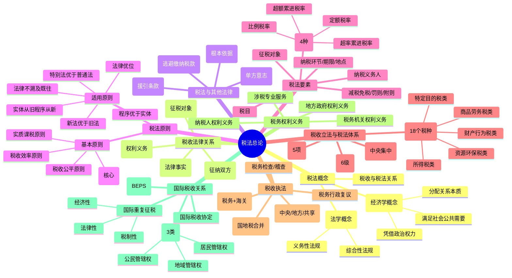

## 📍 章节定位

| 项目 | 信息 |
|------|------|
| **所属科目** | 💰 税法 |
| **难度等级** | ⭐ |
| **历年分值** | 1-2分 |
| **建议学时** | 2-3h |

## 📝 考情分析

税法总论是 CPA 税法课程的开篇章节，主要阐述税法基础理论与我国税法体系框架。本章在考试中所占分值较低（1-2 分），以客观题形式考查，但所建立的概念体系是后续各税种学习的基础。考查重点集中于：税法基本原则与适用原则的辨析、税法要素（特别是税率形式）、税收立法权划分与立法机关、税收执法权的种类、国际重复征税的类型与消除方法等。复习时应重点把握原则性、框架性内容，无需深究细节条文。

## 🧠 知识框架

## 📖 核心精讲

### 一、税法概念

#### （一）税收与税法的概念

**税收**是政府为了满足社会公共需要，凭借政治权力，按照法律的规定，强制、无偿地取得财政收入的一种形式。理解税收内涵需把握三个方面：

1. **本质是一种分配关系**——税收是国家取得财政收入的重要工具，处于社会再生产的分配环节；
2. **依据是政治权力**——有别于按生产要素进行的分配，国家征税凭借的是政治权力而非财产权利；
3. **目的是满足社会公共需要**——提供公共产品、弥补市场失灵、促进公平分配。

**税法**是国家立法机关制定的用以调整国家与纳税人之间在征纳税方面的权利及义务关系的法律规范的总称。税法具有两大特点：

| 特点 | 内涵 | 决定因素 |
|------|------|----------|
| **义务性法规** | 以规定纳税人义务为主，纳税人权利建立在纳税义务基础上，处于从属地位 | 税收的无偿性、强制性 |
| **综合性法规** | 由一系列单行税收法律法规及行政规章制度组成的体系 | 税收分配关系与税收法律关系的复杂性 |

#### （二）税收与税法的关系

| 比较项 | 税收 | 税法 |
|--------|------|------|
| 学科属性 | 经济学概念 | 法学概念 |
| 调整对象 | 征税形成的分配关系 | 税收法律关系主体的权利与义务关系 |
| 关系 | 税收是税法的主体内容 | 税法是税收的存在形式 |

### 二、税收法律关系

税收法律关系是税法所确认和调整的国家与纳税人之间、国家与国家之间以及各级政府之间在税收分配过程中形成的权利与义务关系。

#### （一）税收法律关系的构成

| 要素 | 内容 |
|------|------|
| **主体** | 征纳双方：一方为代表国家行使征税职责的国家税务机关和海关；另一方为履行纳税义务的法人、自然人和其他组织（属地兼属人原则） |
| **客体** | 征税对象——流转税为货物或劳务收入，所得税为所得，财产税为财产 |
| **内容** | 主体享有的权利和应承担的义务（税收法律关系中最实质的东西，是税法的灵魂） |

#### （二）税收法律关系的产生、变更与消灭

税法是前提条件，但具体法律关系由**税收法律事实**决定，分为：

- **税收法律事件**：不以主体意志为转移的客观事件（如自然灾害导致税收减免）；
- **税收法律行为**：主体在正常意志支配下的活动（如纳税人开业、停业）。

### 三、税法与其他法律的关系

| 法律 | 关系要点 |
|------|----------|
| **宪法** | 税法的根本依据；《宪法》第 56 条规定公民有依照法律纳税的义务 |
| **民法** | 调整方法不同（民法平等等价有偿；税法命令服从）；税法可援引民法条款（如经济合同关系、房屋产权认定）；涉税征纳问题以税法为准 |
| **刑法** | 调整范围不同；2009 年起刑法以"逃避缴纳税款"取代"偷税"概念 |
| **行政法** | 税法具有行政法特性（单方意志、复议诉讼程序）；但税法具有经济分配性质，且为义务性法规 |

### 四、税法原则

#### （一）税法基本原则

| 原则 | 核心内容 |
|------|----------|
| **税收法定原则**（核心） | 税法主体的权利义务必须由法律加以规定；包括税收要件法定原则和税务合法性原则 |
| **税收公平原则** | 横向公平（负担能力相等税负相同）与纵向公平（负担能力不等税负不同）；禁止歧视性对待和无正当理由的特别优惠 |
| **税收效率原则** | 经济效率（资源有效配置）+ 行政效率（节约征管成本） |
| **实质课税原则** | 根据客观事实和纳税人真实负担能力决定税负，不能仅考虑外观和形式 |

#### （二）税法适用原则

| 原则 | 含义 |
|------|------|
| **法律优位原则** | 法律效力高于行政立法；税收行政法规优于税收行政规章 |
| **法律不溯及既往原则** | 新法实施前人们的行为沿用旧法；维护税法稳定性和可预测性 |
| **新法优于旧法原则** | 新旧法对同一事项有不同规定时，新法效力优于旧法（特别法关系及"实体从旧、程序从新"时例外） |
| **特别法优于普通法原则** | 特别规定效力高于一般规定；打破效力等级限制 |
| **实体从旧、程序从新原则** | 实体税法不具备溯及力；程序性税法在特定条件下具备一定溯及力 |
| **程序优于实体原则** | 税收争讼法原则；诉讼时税收程序法优于税收实体法，确保国家课税权实现 |

### 五、税法（种）要素

税法要素是各种单行税法共同具备的基本要素，包括总则、纳税义务人、征税对象、税目、税率、纳税环节、纳税期限、纳税地点、税收优惠、罚则、附则等。

#### （一）纳税义务人

纳税人有两种基本形式：**自然人**和**法人**。

与纳税人紧密联系的两个概念：

| 概念 | 定义 | 举例 |
|------|------|------|
| **代扣代缴义务人** | 在向纳税人支付收入、结算货款、收取费用时有义务代扣代缴其应纳税款的单位和个人 | 出版社代扣代缴作者稿酬所得个人所得税 |
| **代收代缴义务人** | 在向纳税人收取商品或劳务收入时有义务代收代缴其应纳税款的单位和个人 | 委托加工应税消费品由受托方代收代缴消费税 |

#### （二）征税对象与税基

- **征税对象**：区别一种税与另一种税的重要标志，是税法最基本的要素；
- **税基**（计税依据）：据以计算应纳税款的直接数量依据。

| 税基形态 | 计征方法 | 举例 |
|----------|----------|------|
| 价值形态 | 从价计征 | 化妆品消费税按销售收入计算 |
| 物理形态 | 从量计征 | 城镇土地使用税按占用土地面积计算 |

#### （三）税率

税率是计算税额的尺度，也是衡量税负轻重的重要标志。我国现行税率主要有四种：

| 税率形式 | 含义 | 适用税种 |
|----------|------|----------|
| **比例税率** | 对同一征税对象不分数额大小规定相同征收比例 | 增值税、企业所得税、城市维护建设税 |
| **超额累进税率** | 按数额大小分若干等级，每级规定一个税率，逐级提高，分别计算后相加 | 个人所得税 |
| **定额税率** | 按征税对象确定的计算单位，直接规定固定的税额 | 城镇土地使用税、车船税 |
| **超率累进税率** | 以征税对象数额的相对率划分若干级距，对超过部分按高一级税率计算 | 土地增值税 |

**比例税率的三种形式**：单一比例税率、差别比例税率（产品/行业/地区差别）、幅度比例税率。

**速算扣除数**——为简化超额累进税率计算而设计：

$$\text{速算扣除数}=\text{按全额累进方法计算的税额}-\text{按超额累进方法计算的税额}$$

$$\text{应纳税额}=\text{课税对象数额}\times\text{适用税率}-\text{速算扣除数}$$

#### （四）纳税环节与纳税期限

- **纳税义务发生时间**：应税行为发生的时间；
- **纳税期限**：每隔固定时间汇总一次纳税义务的时间（如增值税计税期间为 10 日、15 日、1 个月或 1 个季度）；
- **缴库期限**：纳税期满后纳税人将税款缴入国库的期限（如以 1 个月为计税期间的，自期满之日起 15 日内申报纳税）。

### 六、税收立法与我国税法体系

#### （一）税收立法原则

1. 从实际出发的原则；
2. 公平原则；
3. 民主决策的原则；
4. 原则性与灵活性相结合的原则；
5. 法律的稳定性、连续性与废、改、立相结合的原则。

#### （二）税收立法权划分

**核心原则**：中央税、中央与地方共享税以及全国统一实行的地方税的立法权集中在中央。

| 税收类别 | 主要税种 |
|----------|----------|
| **中央税** | 消费税、关税、车辆购置税 |
| **中央与地方共享税** | 增值税、企业所得税、个人所得税 |
| **地方税** | 资源税、土地增值税、印花税、城市维护建设税、城镇土地使用税、房产税、车船税 |

#### （三）税收立法机关及法律效力

| 制定机关 | 法律形式 | 法律效力 | 举例 |
|----------|----------|----------|------|
| 全国人大及其常委会 | **税收法律** | 最高（仅次于宪法） | 《企业所得税法》《个人所得税法》《税收征收管理法》 |
| 全国人大及其常委会授权国务院 | **授权立法**（暂行条例） | 具有法律性质地位，高于行政法规 | 增值税、消费税、资源税等暂行条例 |
| 国务院 | **税收行政法规** | 低于宪法、法律，高于地方法规、部门规章 | 《企业所得税法实施条例》《税收征收管理法实施细则》 |
| 地方人大及其常委会 | **税收地方性法规** | 限于授权范围 | 仅海南省、民族自治地区可制定 |
| 财政部、国家税务总局、海关总署 | **税收部门规章** | 不得与税收法律、行政法规抵触 | 《消费税暂行条例实施细则》 |
| 地方政府 | **税收地方规章** | 必须在税收法律、法规授权前提下 | 城建税、房产税实施细则 |

#### （四）我国现行税法体系

我国现行共有 **18 个税种**，按征税对象不同分为五类：

| 类别 | 税种 | 征收机关 |
|------|------|----------|
| **商品（货物）和劳务税类** | 增值税、消费税、关税 | 海关征收关税及代征进口环节增值税、消费税 |
| **所得税类** | 企业所得税、个人所得税 | 税务机关 |
| **财产和行为税类** | 房产税、车船税、印花税、契税 | 税务机关 |
| **资源税和环境保护税类** | 资源税、环境保护税、城镇土地使用税 | 税务机关 |
| **特定目的税类** | 城市维护建设税、车辆购置税、耕地占用税、船舶吨税、烟叶税 | 船舶吨税由海关征收 |

按税负是否容易转嫁：**直接税**（企业所得税、个人所得税）与**间接税**（消费税、关税）。
按计税价格中是否包含税款：**价内税**（消费税）与**价外税**（增值税）。

### 七、税收执法

#### （一）税务机构设置

2018 年国税地税征管体制改革后，中央设立国家税务总局（正部级），省及省以下国税地税机构合并整合为省、市、县三级税务局，实行以国家税务总局为主与省人民政府双重领导管理体制。海关总署及下属机构负责关税征收管理和受托征收进口增值税、消费税。

#### （二）税收征收管理范围划分

| 征收系统 | 征收税种 |
|----------|----------|
| **税务系统** | 增值税、消费税、车辆购置税、企业所得税、个人所得税、资源税、城镇土地使用税、耕地占用税、土地增值税、房产税、车船税、印花税、契税、城市维护建设税、环境保护税、烟叶税（共 16 个） |
| **海关系统** | 关税、船舶吨税；代征进口环节增值税、消费税 |

#### （三）税收收入划分

| 收入类别 | 税种 |
|----------|------|
| **中央政府固定收入** | 消费税（含进口环节）、车辆购置税、关税、船舶吨税、海关代征进口环节增值税 |
| **地方政府固定收入** | 城镇土地使用税、耕地占用税、土地增值税、房产税、车船税、契税、环境保护税、烟叶税 |
| **中央与地方共享收入** | 增值税（50:50）、企业所得税（60:40）、个人所得税（60:40）、资源税（海洋石油归中央）、城市维护建设税、印花税（证券交易印花税全归中央） |

#### （四）税收执法权的种类

1. **税款征收管理权**；
2. **税务检查权**——经常性检查（行政检查权）与特别调查（行政性调查 + 刑事调查）；
3. **税务稽查权**；
4. **税务行政复议裁决权**；
5. **其他税收执法权**（如税务行政处罚权）。

税务行政处罚种类包括：警告（责令限期改正）、罚款、停止出口退税权、没收违法所得、收缴发票或停止发售发票、提请吊销营业执照、通知出境管理机关阻止出境。

### 八、税务权利与义务

#### （一）税务机关和税务人员的权利与义务

| 权利 | 义务 |
|------|------|
| 负责税收征收管理工作；依法执行职务不受阻挠 | 宣传税法、普及纳税知识、无偿提供纳税咨询；秉公执法、清正廉洁；不得索贿受贿、徇私舞弊；建立内部制约和监督管理制度；为检举人保密并给予奖励；回避制度 |

**回避情形**：夫妻关系、直系血亲关系、三代以内旁系血亲关系、近姻亲关系、可能影响公正执法的其他利益关系。

#### （二）纳税人、扣缴义务人的权利与义务

| 权利 | 义务 |
|------|------|
| 向税务机关了解国家税收法律、行政法规的规定及纳税程序；要求税务机关保密（商业秘密及个人隐私）；申请减税、免税、退税；陈述权、申辩权、申请行政复议、提起行政诉讼、请求国家赔偿；控告和检举税务机关、税务人员的违法违纪行为 | 依照法律、行政法规的规定缴纳税款、代扣代缴、代收代缴税款；如实向税务机关提供与纳税有关的信息；接受税务机关依法进行的税务检查 |

### 九、国际税收关系

#### （一）税收管辖权

税收管辖权是国家主权在税收领域中的体现，分为三类：

| 类型 | 确立原则 | 含义 |
|------|----------|------|
| **居民管辖权** | 属人原则 | 对本国居民来自世界范围的全部所得行使征税权 |
| **地域管辖权**（收入来源地管辖权） | 属地原则 | 对发生于其领土范围内的应税活动和来源于境内的全部所得行使征税权 |
| **公民管辖权** | 属人原则 | 依据纳税人国籍，对本国公民来自世界范围的全部所得行使征税权 |

#### （二）国际重复征税

国际重复征税是指两个或两个以上国家对同一跨国纳税人的同一征税对象分别进行征税所形成的交叉重叠征税。

| 类型 | 含义 |
|------|------|
| **法律性国际重复征税** | 不同国家对同一纳税人的同一税源进行的重复征税（税收管辖权重叠） |
| **经济性国际重复征税** | 不同国家对不同纳税人的同一税源进行的重复征税（如股份公司利润与股息） |
| **税制性国际重复征税** | 各国普遍实行复合税制度导致的不同国家对同一税源课征多次相同或类似税种 |

**产生原因**：纳税人所得或收益的国际化与各国所得税制的普遍化是前提条件，各国行使的税收管辖权的重叠是根本原因。最主要的重叠情形是居民管辖权与地域管辖权的重叠。

#### （三）国际税收协定

国际税收协定是两个或两个以上主权国家为协调相互间处理跨国纳税人征税事务的税收关系，本着对等原则签订的书面协议。

**主要内容**：
1. 适用范围（人和税种范围，限于所得税或一般财产税类）；
2. 基本用语的定义（人、公司、居民、常设机构等）；
3. 对所得和财产的课税（协调各缔约国行使税收管辖权范围）；
4. 避免双重征税的办法（免税法、抵免法）；
5. 税收无差别待遇（国籍无差别、常设机构无差别、支付无差别、资本无差别）；
6. 防止国际偷税、漏税和国际避税（情报交换、转让定价）。

**避免双重征税的方法**：

| 方法 | 含义 |
|------|------|
| **免税法** | 居住国对本国居民来源于境外并已向来源国纳税的所得免税 |
| **抵免法** | 居住国对本国居民来源于境外的所得已纳的境外税款，允许在本国应纳税额中抵免 |
| **饶让抵免** | 居住国对本国居民在来源国享受的减免税视为已纳税款给予抵免 |

#### （四）国际避税与反避税

**国际避税**：纳税人利用两个或两个以上国家的税法和国家间税收协定的漏洞、特例和缺陷，规避或减轻其全球总纳税义务的行为。

**BEPS（税基侵蚀和利润转移）**：跨国企业利用国际税收规则不足、各国税制差异和征管漏洞，最大限度减少其全球总体税负，甚至达到双重不征税效果。

**我国签署的 3 项国际多边合作协定**：

| 协定 | 签署时间 | 意义 |
|------|----------|------|
| 《多边税收征管互助公约》 | 2013.8.27 | 应对和防范跨境逃避税，维护公平税收秩序 |
| 《金融账户涉税信息自动交换多边主管当局间协议》 | 2015.12.16 | 加强国际税收信息交换，截至 2023 年我国交换伙伴有 106 个 |
| 《实施税收协定相关措施以防止 BEPS 的多边公约》 | 2017.6.7 | 全球首个对所得税税收协定进行多边协调的法律文件；2022 年 9 月 1 日对我国生效，截至 2023 年 5 月适用于 53 个双边税收协定 |

## 💡 典型例题

### 例题 1：税法原则辨析

下列各项中，属于税法适用原则的有（ ）。

A. 税收法定原则
B. 法律优位原则
C. 新法优于旧法原则
D. 实体从旧、程序从新原则
E. 实质课税原则

**答案**：BCD

> 解析：税法基本原则包括税收法定原则、税收公平原则、税收效率原则、实质课税原则；税法适用原则包括法律优位、法律不溯及既往、新法优于旧法、特别法优于普通法、实体从旧程序从新、程序优于实体。

### 例题 2：税率计算（速算扣除数）

某纳税人某月应纳税所得额为 6,000 元，适用三级超额累进税率表：

| 级数 | 全月应纳税所得额（元） | 税率 | 速算扣除数 |
|------|------------------------|------|------------|
| 1 | 5,000（含）以下 | 10% | 0 |
| 2 | 5,000-20,000（含） | 20% | 500 |
| 3 | 20,000 以上 | 30% | 2,500 |

分别用分级计算法和速算法计算应纳税额。

**解答**：

**分级计算法**：
- 第 1 级：5,000 × 10% = 500（元）
- 第 2 级：(6,000 - 5,000) × 20% = 200（元）
- 应纳税额 = 500 + 200 = **700（元）**

**速算法**：
- 应纳税额 = 6,000 × 20% - 500 = 1,200 - 500 = **700（元）**

### 例题 3：税收立法机关

下列税法中，属于全国人大及其常委会制定的有（ ）。

A. 《中华人民共和国企业所得税法》
B. 《中华人民共和国增值税法》
C. 《中华人民共和国消费税暂行条例》
D. 《中华人民共和国个人所得税法》
E. 《税收征收管理法》

**答案**：ADE

> 解析：《企业所得税法》《个人所得税法》《税收征收管理法》属于税收法律，由全国人大及其常委会制定；《消费税暂行条例》属于授权立法；《增值税法》虽已立法，但《增值税暂行条例》属授权立法形式。

### 例题 4：税收收入划分

下列税种中，属于中央政府固定收入的有（ ）。

A. 消费税
B. 关税
C. 增值税
D. 车辆购置税
E. 印花税

**答案**：ABD

> 解析：中央政府固定收入包括消费税、车辆购置税、关税、船舶吨税、海关代征进口环节增值税；增值税为中央地方共享税（50:50）；证券交易印花税全归中央，其他印花税归地方，但印花税整体不属于中央固定收入。

### 例题 5：国际重复征税类型

某跨国股份公司在 A 国缴纳了公司所得税，其股东（B 国居民）就分得的股息又在 B 国缴纳个人所得税。该重复征税属于（ ）。

A. 法律性国际重复征税
B. 经济性国际重复征税
C. 税制性国际重复征税
D. 管辖权性国际重复征税

**答案**：B

> 解析：经济性国际重复征税是指不同国家对不同纳税人的同一税源进行的重复征税，一般由股份公司经济组织形式引起（公司利润和股息红利所得属同源所得）。

## 🎯 记忆口诀

**税法四大基本原则**：
> 法定公平效率实质——税收法定是核心，公平横向加纵向，效率经济加行政，实质课税看真相。

**税法六大适用原则**：
> 法律优位不溯及，新法优于旧法先，特别法优于普通法，实体从旧程序新，程序优于实体权。

**税率四种形式**：
> 比例税率算简单，超额累进个税用，定额税率按单位，超率累进土增税。

**税收立法机关效力排序**：
> 宪法最高法律次，授权立法同法律，行政法规再下来，地方规章部门规。

**18 个税种五大类**：
> 商劳税类增消关，所得类企所个所，财行类房车印契，资源类资环土使，特定目的城车耕船烟。

**税收管辖权三类**：
> 居民管辖全球征（属人），地域管辖境内征（属地），公民管辖按国籍（属人）。

**国际重复征税三类型**：
> 法律同源又同纳，经济同源不同纳，税制复合重复征。

## ✅ 同步练习

### 一、单选题

1. 下列各项中，不属于税法基本原则的是（ ）。
   A. 税收法定原则
   B. 税收公平原则
   C. 法律优位原则
   D. 实质课税原则

2. 我国现行税率中，采用超率累进税率的是（ ）。
   A. 增值税
   B. 个人所得税
   C. 土地增值税
   D. 城镇土地使用税

3. 下列税种中，由海关系统负责征收管理的是（ ）。
   A. 增值税
   B. 消费税
   C. 关税
   D. 城市维护建设税

4. 纳税人因计算错误等失误，未缴或少缴税款，税务机关追征税款的期限一般为（ ）。
   A. 1 年
   B. 3 年
   C. 5 年
   D. 无限期

5. 下列各项中，属于税收法律的是（ ）。
   A. 《增值税暂行条例》
   B. 《消费税暂行条例》
   C. 《中华人民共和国企业所得税法》
   D. 《企业所得税法实施条例》

### 二、多选题

1. 下列各项中，属于税法适用原则的有（ ）。
   A. 法律优位原则
   B. 法律不溯及既往原则
   C. 特别法优于普通法原则
   D. 程序优于实体原则
   E. 税收法定原则

2. 我国税收立法权划分的具体层次包括（ ）。
   A. 全国性税种的立法权属于全国人大及其常委会
   B. 经授权国务院可以"条例"或"暂行条例"形式发布施行全国性税种
   C. 国务院有制定税法实施细则的权力
   D. 省级人民政府有权制定所有地方税种的法规
   E. 国家税务主管部门有税收条例的解释权

3. 下列税种中，属于中央与地方共享税的有（ ）。
   A. 增值税
   B. 企业所得税
   C. 个人所得税
   D. 关税
   E. 消费税

4. 国际重复征税的类型包括（ ）。
   A. 法律性国际重复征税
   B. 经济性国际重复征税
   C. 税制性国际重复征税
   D. 管辖权性国际重复征税
   E. 政策性国际重复征税

5. 下列关于税收法律关系的说法，正确的有（ ）。
   A. 税收法律关系的主体包括征纳双方
   B. 税收法律关系的客体是征税对象
   C. 税收法律关系的内容是主体享有的权利和应承担的义务
   D. 税法本身可以产生具体的税收法律关系
   E. 税收法律事实包括税收法律事件和税收法律行为

### 三、判断题

1. 税法属于义务性法规，因此税法没有规定纳税人的权利。（ ）
2. 我国税收立法权全部集中在中央，地方无任何立法权。（ ）
3. 税收优先于无担保债权，但法律另有规定的除外。（ ）
4. 国际税收协定的效力一定高于国内税法。（ ）
5. 个人所得税采用超额累进税率。（ ）

### 参考答案

**一、单选题**：1.C  2.C  3.C  4.B  5.C

**二、多选题**：1.ABCD  2.ABCE  3.ABC  4.ABC  5.ABCE

**三、判断题**：1.×（纳税人权利建立在纳税义务基础上，处于从属地位，但仍有权利）
2.×（经授权，省级人民政府可制定实施细则，并在规定幅度内确定本地区适用税率）
3.√
4.×（国际税收协定与国内税法的地位关系有两种模式：一是协定优于国内税法；二是同等效力，按"新法优于旧法"等原则协调）
5.√（部分所得项目采用超额累进税率，如综合所得；但利息股息红利等采用比例税率）

  
📚

  
本章节为 CPA 税法总论基础篇，建议结合后续各税种章节学习，加深对税法体系的整体理解。

