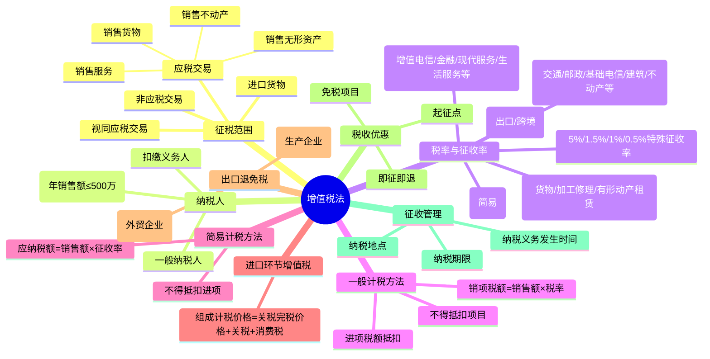

## 📍 章节定位

| 项目 | 信息 |
|------|------|
| **所属科目** | 💰 税法 |
| **难度等级** | ⭐⭐⭐⭐⭐ |
| **历年分值** | 10-12分 |
| **建议学时** | 15-18h |

## 📝 考情分析

增值税是 CPA 税法考试的"第一大户"，历年分值稳定在 10-12 分，是计算综合题的必考章节。命题以"销项税额+进项税额+应纳税额"主线展开，常结合消费税、城建税及教育费附加出综合题。2026 年 1 月 1 日起施行的《增值税法》及《实施条例》是本轮考试的核心法律依据，考生须重点关注新法变化：应税交易三要件、视同应税交易范围收窄、非应税交易情形、不得抵扣进项税额的五类项目（含"不得抵扣非应税交易"）等。

题型分布上：单选题考查税率适用、征收率、纳税义务发生时间等基础点；多选题考查征税范围、视同应税交易、税收优惠；计算题和综合题考查一般计税方法应纳税额计算、进口环节增值税、简易计税、出口免抵退税。易错点集中在：折扣销售/销售折扣/销售折让三者的税务处理差异、包装物押金的处理（一般货物 vs 酒类）、不得抵扣进项税额项目的界定与转出计算、混用长期资产的进项税额处理、免抵退税公式中"免抵税额"与"应退税额"的区分。

## 🧠 知识框架

## 📖 核心精讲

### 一、征税范围

增值税征税范围包括 **应税交易** 和 **进口货物** 两类。应税交易是指在境内销售货物、服务、无形资产、不动产。其构成有三要件：

1. **销售**：有偿转让货物、不动产的所有权，有偿提供服务，有偿转让无形资产的所有权或者使用权。"有偿"指通过交易取得货币、货物或其他经济利益。
2. **境内**：货物起运地或所在地在境内；不动产、自然资源所在地在境内；金融商品在境内发行或销售方为境内单位；服务、无形资产在境内消费或销售方为境内单位。
3. **标的范围**：货物（有形动产、电力、热力、气体）、服务（交通运输、邮政、电信、建筑、金融、生产生活服务）、无形资产、不动产。

**视同应税交易**（《增值税法》第五条）：
- 单位和个体工商户将自产或委托加工的货物用于集体福利或个人消费；
- 单位和个体工商户无偿转让货物；
- 单位和个人无偿转让无形资产、不动产或金融商品。

**非应税交易**（《增值税法》第六条，不征增值税）：
- 员工为受雇单位或雇主提供取得工资、薪金的服务；
- 收取行政事业性收费、政府性基金；
- 依照法律规定被征收、征用而取得补偿；
- 取得存款利息收入。

资产重组符合条件（业务相对独立运营、资产与对应债权负债员工一并转让、合理商业目的、转让方与接收方均为一般纳税人）的，不征收增值税。

### 二、纳税人和扣缴义务人

**小规模纳税人**：年应征增值税销售额 ≤ 500 万元。年销售额指连续不超过 12 个月或四个季度的经营期内累计应征增值税销售额；偶然发生的销售无形资产、转让不动产销售额不计入。

**一般纳税人**：年应征增值税销售额超过 500 万元须办理登记；未超过标准但会计核算健全的可选择登记。一经登记不得转为小规模纳税人。生效之日原则上为超过标准当期 1 日。

**扣缴义务人**：境外单位或个人在境内发生应税交易，以购买方为扣缴义务人（国务院规定委托境内代理人申报的除外）。

### 三、税率与征收率

| 税率 | 适用范围 |
|------|----------|
| **13%** | 销售货物、加工修理修配服务、有形动产租赁服务、进口货物（除适用 9%/零税率外） |
| **9%** | 交通运输、邮政、基础电信、建筑、不动产租赁服务、销售不动产、转让土地使用权；销售或进口农产品、食用植物油、食用盐、自来水、暖气、煤气、天然气、图书报纸杂志、饲料化肥农药农机农膜等 |
| **6%** | 增值电信服务、金融服务、现代服务（不动产租赁除外）、生活服务、销售无形资产（转让土地使用权除外） |
| **0%** | 出口货物（国务院另有规定除外）；跨境销售国务院规定范围内的服务、无形资产（国际运输、航天运输、研发服务、设计服务等） |

**征收率**：适用于简易计税方法，基本为 3%；特定情形 5%、1.5%、1%、0.5%。小规模纳税人适用 3% 征收率的应税销售收入减按 1% 征收（执行至 2027 年 12 月 31 日）。

**兼营与混合销售**：两项以上应税交易涉及不同税率/征收率的应分别核算，未分别核算的从高适用；一项应税交易涉及两个以上税率/征收率但具有主附关系的，按主要业务适用税率。

### 四、一般计税方法应纳税额的计算

**核心公式**：

$$\text{当期应纳税额} = \text{当期销项税额} - \text{当期进项税额}$$

$$\text{销项税额} = \text{销售额} \times \text{适用税率}$$

其中，销售额为不含税价款。含税销售额换算：

$$\text{销售额} = \frac{\text{含税销售额}}{1 + \text{税率}}$$

#### （一）销售额的确认

**一般销售方式**：销售额包括纳税人发生应税交易取得的与之相关的全部价款（货币与非货币形式），不包括销项税额。不包括：政府性基金或行政事业性收费、受托加工应征消费税的消费品的消费税、车辆购置税和车船税、以委托方名义开具发票代委托方收取的款项。

**特殊销售方式**：

| 销售方式 | 销售额确定 |
|---------|------------|
| 折扣销售 | 同一张发票"金额"栏分别注明价款和折扣额的，可按折扣后销售额征税；仅在备注栏注明或未分别注明的，不得扣减 |
| 销售折扣（现金折扣） | 不得从销售额中减除（融资性质） |
| 销售折让 | 按折让后的货款为销售额 |
| 以旧换新 | 按新货物同期销售价格确定（金银首饰除外，可扣减旧物收购价） |
| 还本销售 | 按货物销售价格，不得扣减还本支出 |
| 以物易物 | 双方均作购销处理，分别核算销项与进项 |
| 包装物押金 | 一般货物 1 年内未过期不并入；逾期未退或超过 1 年并入；啤酒黄酒按一般规定；其他酒类无论是否返还均并入当期 |
| 直销 | 直销员模式：直销企业向直销员收取的全部价款；直接向消费者：向消费者收取的全部价款 |

**差额征税**（财税 2026 年第 12 号公告）：转让金融商品、融资租赁及融资性售后回租、一般纳税人提供劳务派遣服务、航空运输销售代理、签证代理等，按扣除相关价款后的余额为销售额。注意：扣除部分不得开具增值税专用发票。

#### （二）进项税额的抵扣

**准予抵扣的进项税额**：
1. 增值税专用发票（含机动车销售统一发票）上注明的增值税额；
2. 海关进口增值税专用缴款书上注明的增值税额；
3. 购进农产品：取得一般纳税人开具的增值税专用发票或海关进口增值税专用缴款书的，以发票上注明的增值税额为进项税额；从按 3% 征收率计税的小规模纳税人取得增值税专用发票的，以发票注明的金额和 9% 扣除率计算；购进用于生产销售或委托加工 13% 税率货物的，按 10% 扣除率计算；
4. 国内旅客运输服务（电子发票列明税额、铁路电子客票、航空运输电子客票行程单；公路水路等其他客票按 $\frac{\text{票面金额}}{1+3\%}\times 3\%$ 计算）；
5. 桥、闸通行费按 $\frac{\text{金额}}{1+5\%}\times 5\%$ 计算；
6. 资源回收企业反向开具的增值税专用发票上注明的税款。

**不得抵扣的进项税额**（重点记忆五类不允许抵扣项目）：
1. 适用简易计税方法计税项目对应的进项税额；
2. 免征增值税项目对应的进项税额；
3. 购进并用于集体福利的货物、服务、无形资产、不动产对应的进项税额；
4. 购进并用于个人消费的货物、服务、无形资产、不动产对应的进项税额（含交际应酬消费）；
5. 不得抵扣非应税交易对应的进项税额（同时符合：发生《增值税法》第三至五条以外经营活动并取得经济利益；不属于第六条规定的四项非应税交易情形）。

此外还包括：
6. **非正常损失**（管理不善造成被盗、丢失、霉烂变质，及违法被没收、销毁、拆除）对应的进项税额；
7. 购进并直接用于消费的餐饮服务、居民日常服务和娱乐服务对应的进项税额；
8. 购进贷款服务及与该笔贷款直接相关的投融资顾问费、手续费、咨询费等对应的进项税额。

**不得抵扣进项税额的计算**（无法划分的情形）：

$$\text{当期不得抵扣的进项税额} = \text{当期无法划分的全部进项税额} \times \frac{\text{简易计税+免税+不得抵扣非应税交易销售额}}{\text{当期全部销售额}}$$

**长期资产混用的特殊处理**：
- 原值 ≤ 500 万元的单项长期资产，混用可全额抵扣；
- 原值 > 500 万元的单项长期资产，购进时先全额抵扣，此后根据调整年限计算不得抵扣部分，逐年调整。

### 五、简易计税方法

$$\text{应纳税额} = \text{销售额} \times \text{征收率}$$

$$\text{销售额} = \frac{\text{含税销售额}}{1 + \text{征收率}}$$

**适用 3% 征收率的主要情形**（一般纳税人可选择）：销售自采砂土石料及自产砖瓦石灰、小型水力发电、自来水、寄售代销、典当死当、公共交通运输、清包工建筑、老项目建筑、农村信用社金融服务、电影放映/仓储/装卸搬运/收派/文化体育、非学历教育、资管产品运营、抗癌/罕见病药品、再生资源回收等。

**适用 5% 征收率的主要情形**：2016 年 4 月 30 日前的不动产融资租赁、出租或销售不动产、转让土地使用权、房地产开发企业销售出租老项目。

**减按征收的特殊规定**：
- 销售自己使用过的不得抵扣且未抵扣进项税额的固定资产：依 3% 减按 2%；
- 销售旧货：依 3% 减按 2%；
- 个人出租住房：依 3% 减按 1.5%；
- 二手车经销：减按 0.5%（2026-2027 年）；
- 小规模纳税人 3% 应税收入减按 1%（2026-2027 年）。

### 六、进口环节增值税

**组成计税价格与应纳税额**：

$$\text{组成计税价格} = \text{关税完税价格} + \text{关税} + \text{消费税}$$

$$\text{应纳税额} = \text{组成计税价格} \times \text{税率}$$

进口环节增值税不得抵扣发生在境外的税金。跨境电子商务零售进口商品以实际交易价格（含货物零售价格、运费、保险费）为完税价格，限额内关税税率为 0%，进口环节增值税和消费税按法定应纳税额的 70% 征收。

### 七、出口货物和跨境销售增值税政策

三类政策：
1. **出口退（免）税**（又免又退）：出口免税并退还以前环节已纳税款；
2. **出口免税不退税**（只免不退）：出口环节免税但不退税（如前道环节免税的货物、简易计税的服务）；
3. **出口不免税也不退税**（征税）：国家限制或禁止出口的货物视同内销征税（如 2026 年 4 月 1 日起取消光伏出口退税）。

**免抵退税办法（生产企业）**：

① 当期不得免征和抵扣税额 = 出口货物离岸价 ×（出口货物适用税率 − 出口退税率）

② 当期应纳税额 = 当期销项税额 −（当期进项税额 − 当期不得免征和抵扣税额）− 上期期末留抵税额

③ 当期免抵退税额 = 出口货物离岸价 × 出口退税率

④ 当期应退税额 = min（当期期末留抵税额，当期免抵退税额）

⑤ 当期免抵税额 = 当期免抵退税额 − 当期应退税额

**免退税办法（外贸企业）**：

$$\text{应退税额} = \text{购进不含税金额} \times \text{退税率}$$

退税率低于适用税率的差额计入出口业务成本。

### 八、税收优惠

**起征点**（2026-2027 年）：按月 10 万元；按季 30 万元；按次 1000 元。未达起征点免征；达到起征点全额计征。

**主要免税项目**（重点）：
- 农业生产者销售自产农产品；
- 医疗机构提供的医疗服务；
- 古旧图书，自然人销售自己使用过的物品；
- 直接用于科研、教学的进口仪器设备；
- 外国政府、国际组织无偿援助的进口物资；
- 残疾人个人提供的服务；
- 托儿所、幼儿园、养老机构、残疾人服务机构提供的育养服务，婚姻介绍，殡葬服务；
- 学校提供的学历教育服务，学生勤工俭学；
- 纪念馆、博物馆等举办文化活动的第一道门票收入；
- 个人从事金融商品转让业务；
- 个人（不含个体工商户中的一般纳税人）销售自建自用住房；
- 涉及家庭财产分割的个人无偿转让不动产、土地使用权；
- 个人转让著作权；
- 纳税人提供技术转让、技术开发和相关的技术咨询、技术服务。

**即征即退**：软件产品、动漫产业、安置残疾人就业、资源综合利用产品等。

### 九、征收管理

**纳税义务发生时间**：销售货物为收讫销售款或取得索取销售款凭据的当天；先开具发票的为开具发票的当天；进口货物为报关进口的当天。

**纳税地点**：固定业户向机构所在地税务机关申报；非固定业户向销售地税务机关申报；进口货物向海关申报。

**纳税期限**：1 日、3 日、5 日、10 日、15 日、1 个月或 1 个季度。一般纳税人以 1 个月为主；小规模纳税人可选 1 个季度。

## 💡 典型例题

**【例题 1】（2024 年计算题改编）**
某自营出口的生产企业为增值税一般纳税人，出口货物征税率为 13%、退税率为 10%。某月经营业务：购进原材料取得增值税专用发票注明价款 200 万元，进项税额 26 万元；上月末留抵税额 3 万元；本月内销货物不含税销售额 100 万元，收款 113 万元；本月出口货物销售额折合人民币 200 万元。计算当期应退税额和免抵税额。

**答案**：
① 当期不得免征和抵扣税额 = 200 ×（13% − 10%）= 6（万元）
② 当期应纳税额 = 100 × 13% −（26 − 6）− 3 = 13 − 20 − 3 = −10（万元）
③ 当期免抵退税额 = 200 × 10% = 20（万元）
④ 当期期末留抵税额 10 万元 ≤ 免抵退税额 20 万元，故当期应退税额 = 10（万元）
⑤ 当期免抵税额 = 20 − 10 = 10（万元）

**解析**：免抵退税计算关键是按步骤走：先算"不得免征和抵扣税额"作进项税额转出，再算当期应纳税额（结果为负即留抵），再算免抵退税限额，最后比较留抵与限额取小者为应退税额，差额为免抵税额。

**【例题 2】（教材例题改编）**
某一般纳税人购进农产品一批，取得按 3% 征收率计税的小规模纳税人开具的增值税专用发票，注明金额 100 万元。该企业将所购农产品的 60% 用于生产 13% 税率的食品，40% 用于集体福利。计算可抵扣的进项税额。

**答案**：
- 用于生产 13% 税率货物的部分：100 × 60% × 10% = 6（万元）
- 用于集体福利部分不得抵扣
- 可抵扣进项税额合计 = 6（万元）

**解析**：购进农产品用于生产 13% 税率货物的，扣除率为 10%；用于集体福利（不得抵扣项目）的部分不得抵扣。

## 🎯 记忆口诀

**税率适用口诀**：
> 13% 卖货修机动；9% 农水暖书肥、交邮建不动；6% 金融现代生活无形；0% 出口跨境

**不得抵扣五类项目**（"简、免、福、个、非"）：
> 简易计税、免税项目、集体福利、个人消费、不得抵扣非应税交易

**视同应税交易三情形**：
> 自产委托加工货物用于福利或个消；无偿转让货物；无偿转让无形资产、不动产或金融商品

**免抵退税五步法**：
> 一算不得抵扣（税率差）；二算应纳税额（负数即留抵）；三算免抵退税限额（退税率）；四比留抵与限额取小者退税；五算差额即免抵。

## ✅ 同步练习

**1.** 某一般纳税人销售货物同时提供安装服务，未分别核算。该笔业务适用税率应为（ ）。
A. 货物 13%、安装 9%
B. 全部 13%
C. 全部 9%
D. 由税务机关核定

**2.** 下列各项中，属于《增值税法》规定的非应税交易情形的是（ ）。
A. 资产重组转让资产
B. 存款利息收入
C. 转让非上市公司股权
D. 单位无偿转让货物

**3.** 某小规模纳税人按季申报，2026 年第二季度取得不含税销售额 28 万元（均开具普通发票），另销售一处闲置不动产取得不含税销售额 80 万元。该纳税人第二季度应纳增值税为（ ）万元。

**4.** 某外贸企业购进出口商品 A，取得增值税专用发票注明金额 100 万元、税额 13 万元，退税率为 13%；购进出口商品 B，取得增值税专用发票注明金额 200 万元、税额 26 万元，退税率为 9%（征税率 13%）。计算应退税额及计入成本的税额。

**5.** 简述"折扣销售""销售折扣""销售折让"在增值税销售额确认上的差异。
