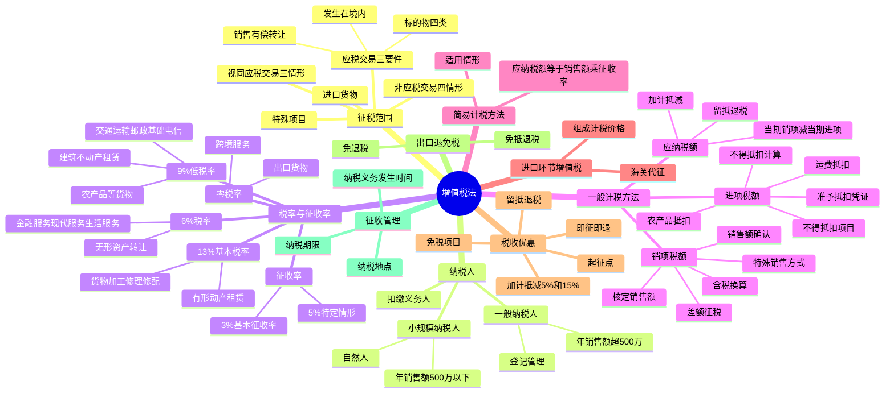

## 1. 章节定位

| 项目 | 信息 |
|------|------|
| 所属科目 | 税法 |
| 难度等级 | 5 |
| 历年分值 | 15-20 分 |
| 建议学时 | 20-25 小时 |
| 知识关联章节 | 第1章 税法总论、第3章 消费税法、第4章 企业所得税法、第7章 关税法（进口环节增值税）、第14章 税收征收管理法 |

## 2. 考情分析

增值税是我国第一大税种，2024 年全国国内增值税收入约 6.57 万亿元，占全部税收收入的 38%。本章是 CPA 税法科目的核心章节，历年分值约 15-20 分，是分值最高、内容最丰富的章节，几乎每年必考主观题（计算题或综合题），同时大量出现在客观题中。

**命题规律**：本章考查综合性强、计算量大，主观题常以业务情境为载体，要求考生对多项业务的销项税额、进项税额进行判断和计算。2024 年 12 月 25 日《中华人民共和国增值税法》通过，自 2026 年 1 月 1 日起施行，标志着增值税从暂行条例上升为法律，新法的变化点是重要考查方向。

**高频考点分布**：
1. 征税范围的界定：应税交易三个要件（销售、境内、标的物范围）、视同应税交易三种情形、非应税交易四种情形。
2. 税率与征收率：13%、9%、6%、零税率四档税率的适用范围，3%、5% 征收率的适用情形。
3. 一般计税方法：销项税额计算（含税销售额换算、特殊销售方式销售额确认、差额征税）、进项税额抵扣（准予抵扣的凭证、不得抵扣的项目、农产品进项税额计算）、应纳税额计算。
4. 简易计税方法：适用情形及计算。
5. 进口环节增值税：组成计税价格计算。
6. 税收优惠：起征点、免税项目、即征即退、加计抵减、留抵退税。
7. 出口退（免）税。

**备考建议**：增值税学习要抓住"销项—进项—应纳税额"的主线。重点掌握：含税与不含税的换算、差额征税的适用情形、不得抵扣进项税额的项目、农产品抵扣的计算、视同销售与不得抵扣的区分。建议大量练习计算题，熟悉各类业务场景的税务处理。

## 3. 知识框架

## 4. 核心精讲

### 4.1 征税范围

在中华人民共和国境内销售货物、服务、无形资产、不动产（以下简称应税交易），以及进口货物的单位和个人，为增值税的纳税人。增值税的征税范围包括应税交易和进口货物两类。

#### 4.1.1 应税交易的构成要件

应税交易是指在我国境内销售货物、服务、无形资产、不动产。确认一项交易构成应税交易需满足三个要件：

**（1）"销售"的含义**

销售是指有偿转让货物、不动产的所有权，有偿提供服务，有偿转让无形资产的所有权或者使用权。其中，"有偿"是指通过交易取得货币、货物或者其他经济利益。

**（2）发生在"境内"的界定**

| 标的物类型 | 境内界定标准 |
|------------|-------------|
| 货物 | 货物的起运地或者所在地在境内 |
| 不动产、自然资源使用权 | 不动产、自然资源所在地在境内 |
| 金融商品 | 金融商品在境内发行，或者销售方为境内单位和个人 |
| 服务、无形资产（除上述外） | 服务、无形资产在境内消费，或者销售方为境内单位和个人 |

其中，服务、无形资产在境内消费的情形包括：境外单位或个人向境内单位或个人销售服务、无形资产（境外现场消费的服务除外）；境外单位或个人销售的服务、无形资产与境内的货物、不动产、自然资源直接相关等。

**（3）货物、服务、无形资产、不动产的具体范围**

- **货物**：包括有形动产、电力、热力、气体等。
- **服务**：包括交通运输服务、邮政服务、电信服务、建筑服务、金融服务、现代服务（研发和技术服务、信息技术服务、文化创意服务、物流辅助服务、租赁服务、鉴证咨询服务、广播影视服务、商务辅助服务、文化体育服务、教育医疗服务、旅游娱乐服务、餐饮住宿服务、居民日常服务、加工修理修配服务等）。
- **无形资产**：包括技术、商标、著作权、商誉、自然资源使用权和其他无形资产。
- **不动产**：包括建筑物、构筑物等。

#### 4.1.2 视同应税交易情形

有下列情形之一的，视同应税交易，应按规定缴纳增值税：

1. 单位和个体工商户将自产或者委托加工的货物用于集体福利或者个人消费；
2. 单位和个体工商户无偿转让货物；
3. 单位和个人无偿转让无形资产、不动产或者金融商品。

#### 4.1.3 非应税交易情形

有下列情形之一的，不属于应税交易，不征收增值税：

1. 员工为受雇单位或者雇主提供取得工资、薪金的服务；
2. 收取行政事业性收费、政府性基金；
3. 依照法律规定被征收、征用而取得补偿；
4. 取得存款利息收入。

此外，纳税人通过合并、分立、出售、置换等方式实施资产重组，同时符合特定条件的，不属于增值税应税交易，不征收增值税。转让非上市公司股权也不属于增值税征税范围。

### 4.2 纳税人和扣缴义务人

#### 4.2.1 一般纳税人与小规模纳税人的区分

增值税制度区分一般纳税人和小规模纳税人分别进行征收管理：

| 项目 | 小规模纳税人 | 一般纳税人 |
|------|-------------|-----------|
| 标准 | 年应征增值税销售额未超过 500 万元 | 年应征增值税销售额超过 500 万元 |
| 计税方法 | 简易计税方法（按销售额和征收率计算） | 一般计税方法（销项税额抵扣进项税额） |
| 特殊规定 | 自然人属于小规模纳税人；会计核算健全的可登记为一般纳税人 | 登记后不得转为小规模纳税人 |

**年应征增值税销售额**的确定：指纳税人在连续不超过 12 个月或四个季度的经营期内累计应征增值税销售额。纳税人偶然发生的销售无形资产、转让不动产的销售额，不计入年应征增值税销售额的计算。

#### 4.2.2 扣缴义务人

境外单位和个人在境内发生应税交易，以购买方为扣缴义务人（按照国务院规定委托境内代理人申报缴纳税款的除外）。扣缴义务人按照销售额乘以税率计算应扣缴税额。

### 4.3 税率与征收率

增值税税率适用于一般计税方法，包括 13%、9%、6%、零税率四档。征收率适用于简易计税方法。

#### 4.3.1 13% 税率适用范围

纳税人销售货物、加工修理修配服务、有形动产租赁服务以及进口货物，除按规定应适用 9% 或零税率的以外，适用 13% 基本税率。

#### 4.3.2 9% 税率适用范围

纳税人销售交通运输、邮政、基础电信、建筑、不动产租赁服务，销售不动产，转让土地使用权，销售或者进口下列货物，除按规定适用零税率的以外，税率为 9%：

1. 农产品、食用植物油、食用盐；
2. 自来水、暖气、冷气、热水、煤气、石油液化气、天然气、二甲醚、沼气、居民用煤炭制品；
3. 图书、报纸、杂志、音像制品、电子出版物；
4. 饲料、化肥、农药、农机、农膜。

#### 4.3.3 6% 税率适用范围

纳税人销售增值电信服务、金融服务、现代服务（不动产租赁除外）、生活服务以及销售无形资产（转让土地使用权除外），除按规定适用零税率的以外，税率为 6%。

#### 4.3.4 零税率适用范围

1. 纳税人出口货物，税率为零（国务院另有规定的除外）。
2. 境内单位和个人跨境销售国务院规定范围内的服务、无形资产，税率为零。包括：向境外单位销售的完全在境外消费的研发服务、设计服务、软件服务等；国际运输服务、航天运输服务等。

#### 4.3.5 征收率

增值税征收率适用于简易计税方法，基本征收率为 3%，特定情形下适用 5%。小规模纳税人及符合规定的一般纳税人适用简易计税方法。

#### 4.3.6 不同税率、征收率的适用规定

- 纳税人发生两项以上应税交易涉及不同税率、征收率的，应当分别核算；未分别核算的，从高适用税率。
- 纳税人发生一项应税交易涉及两个以上税率、征收率的，按照应税交易的主要业务适用税率、征收率（须同时符合：包含两个以上不同税率的业务；业务之间具有明显的主附关系）。

### 4.4 一般计税方法应纳税额的计算

一般计税方法属于间接计算法，其计算公式为：

**当期应纳税额 = 当期销项税额 − 当期进项税额**

#### 4.4.1 销项税额的计算

销项税额是指纳税人发生应税交易，按照销售额乘以规定的税率计算的增值税税额。

**销项税额 = 销售额 × 适用税率**

**（1）销售额的基本规定**

销售额是指纳税人发生应税交易取得的与之相关的价款，包括货币和非货币形式的经济利益对应的全部价款，不包括按照一般计税方法计算的销项税额（增值税为价外税）。

销售额不包括纳税人代为收取的下列税费或款项：政府性基金或行政事业性收费；受托加工应征消费税的消费品所产生的消费税；车辆购置税、车船税；以委托方名义开具发票代委托方收取的款项。

纳税人采用销售额和增值税税额合并定价方法的，按照下列公式计算销售额：

**销售额 = 含税销售额 ÷ (1 + 税率)**

**（2）特殊销售方式下的销售额确认**

| 销售方式 | 销售额确认方法 |
|----------|---------------|
| 折扣销售（商业折扣） | 价款和折扣额在同一张发票"金额"栏分别注明的，可按折扣后销售额征收；未在同一张发票"金额"栏注明的，不得扣减折扣额 |
| 销售折扣（现金折扣） | 不得从销售额中减除（属于融资性质的理财费用） |
| 销售折让 | 以折让后的货款为销售额 |
| 以旧换新 | 按新货物同期销售价格确定销售额，不得扣减旧货物收购价（金银首饰除外，可扣减旧首饰作价） |
| 还本销售 | 销售额为货物的销售价格，不得减除还本支出 |
| 以物易物 | 双方都应作购销处理，以各自发出的应税交易核算销售额计算销项税额 |
| 包装物押金 | 1 年以内且未过期的，不并入销售额；逾期未退还的，按所包装货物适用税率计算（先换算为不含税价）。除啤酒、黄酒外的酒类产品押金，无论是否返还均并入当期销售额 |

**（3）差额征税（按扣除相关价款后的余额计算销售额）**

由于"营改增"后仍存在纳税人无法通过抵扣机制避免重复征税的情形，引入了按差额征税的办法。主要适用情形包括：

- 金融商品转让：以卖出价扣除买入价后的余额为销售额。
- 客运场站服务：以全部含税价款扣除支付给承运方运费后的余额为销售额。
- 航空运输服务：以全部含税价款扣除代售其他航空运输企业客票而代收转付的价款后的余额为销售额。
- 旅游服务：向购买方收取并支付给其他单位或个人的住宿费、餐饮费、交通费、签证费、门票费和支付给其他接团旅游企业的旅游费用，允许从含税销售额中扣除。
- 劳务派遣服务：代用工单位支付给劳务派遣员工的工资、福利和为其办理的社会保险及住房公积金，允许从含税销售额中扣除。
- 融资租赁和融资性售后回租：支付的借款利息、发行债券利息和车辆购置税，允许从含税销售额中扣除。
- 房地产开发企业销售房地产项目：受让土地时向政府部门支付的土地价款等，允许从含税销售额中扣除。

**【计算示例】** 某旅游公司为一般纳税人，2026 年 6 月取得旅游收入 106 万元（含税），其中支付给其他单位的住宿费、餐饮费、交通费、门票费等合计 63.6 万元（含税）。

销售额 = (106 − 63.6) ÷ (1 + 6%) = 42.4 ÷ 1.06 = 40（万元）
销项税额 = 40 × 6% = 2.4（万元）

**（4）税务机关核定销售额**

销售额明显偏低或者偏高且无正当理由的，税务机关可按顺序依照下列方法核定：
1. 按纳税人最近时期销售同类货物、服务、无形资产或不动产的平均价格确定。
2. 按其他纳税人最近时期销售同类货物、服务、无形资产或不动产的平均价格确定。
3. 按组成计税价格确定：**组成计税价格 = 成本 × (1 + 成本利润率) + 消费税税额**（成本利润率为 10%）。

#### 4.4.2 进项税额的确认和计算

进项税额是指纳税人购进货物、服务、无形资产、不动产所支付或者负担的增值税税额。

**（1）准予从销项税额中抵扣的进项税额**

一般纳税人应当凭增值税扣税凭证从销项税额中抵扣进项税额，具体包括：

| 凭证类型 | 抵扣方法 |
|----------|---------|
| 增值税专用发票 | 发票上注明的增值税税额 |
| 海关进口增值税专用缴款书 | 缴款书上注明的增值税税额 |
| 完税凭证（境外购进） | 完税凭证上注明的增值税税额 |
| 农产品销售发票或收购发票 | 买价 × 扣除率（9%） |
| 小规模纳税人开具的增值税专用发票（农产品） | 发票金额 × 9% 扣除率 |
| 国内旅客运输服务（铁路/航空电子客票） | 发票上列明的增值税税额 |
| 公路、水路等其他客票 | 票面金额 ÷ (1+3%) × 3% |
| 桥、闸通行费发票 | 发票金额 ÷ (1+5%) × 5% |

**农产品进项税额抵扣的特殊规定**：
- 一般纳税人购进农产品，取得一般纳税人开具的增值税专用发票或海关进口增值税专用缴款书的，以发票上注明的增值税额为进项税额。
- 从按照 3% 征收率计算缴纳增值税的小规模纳税人取得增值税专用发票的，以发票上注明的金额和 9% 扣除率计算进项税额。
- 取得（开具）农产品销售发票或收购发票的，以发票上注明的农产品买价和 9% 扣除率计算进项税额。
- 购进农产品用于生产销售或委托加工 13% 税率货物的，按照 10% 的扣除率计算进项税额。

**（2）不得从销项税额中抵扣的进项税额**

下列项目的进项税额不得从销项税额中抵扣：

1. 适用简易计税方法计税项目对应的进项税额。
2. 免征增值税项目对应的进项税额。
3. 购进并用于集体福利的货物、服务、无形资产、不动产对应的进项税额。
4. 购进并用于个人消费的货物、服务、无形资产、不动产对应的进项税额（包括纳税人的交际应酬消费）。
5. 不得抵扣非应税交易（不属于应税交易和视同应税交易，且不属于四项非应税交易，但经营活动取得了经济利益）对应的进项税额。
6. 非正常损失项目对应的进项税额：因管理不善造成货物被盗、丢失、霉烂变质，以及因违反法律法规造成货物或不动产被依法没收、销毁、拆除的情形。
7. 购进并直接用于消费的餐饮服务、居民日常服务和娱乐服务对应的进项税额。
8. 购进贷款服务，及与该笔贷款直接相关的投融资顾问费、手续费、咨询费等费用支出对应的进项税额。

**非正常损失的范围**：
- 非正常损失的购进货物，以及相关的加工修理修配服务和交通运输服务。
- 非正常损失的在产品、产成品所耗用的购进货物（不含固定资产）、加工修理修配服务和交通运输服务。
- 非正常损失的不动产，以及该不动产所耗用的购进货物和建筑服务。
- 非正常损失的不动产在建工程所耗用的购进货物和建筑服务。

**（3）不得抵扣进项税额的计算**

一般纳税人购进货物（不含固定资产）、服务，用于简易计税方法计税项目、免征增值税项目和不得抵扣非应税交易而无法划分不得抵扣的进项税额的，按销售额占比计算：

**当期不得抵扣的进项税额 = 当期无法划分的全部进项税额 × (当期简易计税方法计税项目销售额 + 当期免征增值税项目销售额 + 当期不得抵扣非应税交易收入) ÷ (当期全部销售额 + 当期全部非应税交易收入)**

**长期资产进项税额抵扣的特殊规定**：
- 专用于一般计税方法计税项目的长期资产，进项税额全额抵扣。
- 专用于五类不允许抵扣项目的，进项税额不得抵扣。
- 既用于一般计税方法又用于五类不允许抵扣项目的（混合用途）：原值不超过 500 万元的单项长期资产，进项税额全额抵扣；原值超过 500 万元的单项长期资产，购进时先全额抵扣，此后在混合用途期间根据调整年限逐年调整。
- 调整年限：不动产、土地使用权为 20 年；飞机、火车、轮船为 10 年；其他长期资产为 5 年。

**用途改变的进项税处理**：
- 已抵扣后改变用途专用于不得抵扣项目的：不得抵扣的进项税额 = 长期资产对应的进项税额 × 净值率，其中净值率 = (当月期初长期资产净值 ÷ 长期资产原值) × 100%。
- 原专用于不得抵扣项目后改变用途用于一般计税方法的：可抵扣进项税额 = 长期资产对应的进项税额 × 净值率。

#### 4.4.3 应纳税额的计算

**（1）当期的规定**

纳税人必须严格把握当期进项税额从当期销项税额中抵扣。"当期"是指税务机关依照税法规定对纳税人确定的计税期间。

**（2）加计抵减政策**

自 2023 年 1 月 1 日至 2027 年 12 月 31 日：

| 企业类型 | 加计抵减比例 |
|----------|-------------|
| 先进制造业企业 | 当期可抵扣进项税额的 5% |
| 集成电路企业 | 当期可抵扣进项税额加计 15% |
| 工业母机企业 | 当期可抵扣进项税额加计 15% |

加计抵减的适用规则：
- 抵减前应纳税额等于零的，当期可抵减加计抵减额全部结转下期。
- 抵减前应纳税额大于零且大于当期可抵减加计抵减额的，当期全额抵减。
- 抵减前应纳税额大于零且小于等于当期可抵减加计抵减额的，抵减至零，未抵减完的结转下期。

**（3）留抵退税**

当期进项税额大于当期销项税额的部分，纳税人可以选择结转下期继续抵扣或者申请退还。留抵退税政策区分三类纳税人：
- 制造业等 4 个行业纳税人：可以按月申请退还期末留抵税额（全额退税）。
- 房地产开发经营业纳税人：增量退税（与 2019 年 3 月 31 日期末留抵税额相比，连续 6 个月新增留抵税额均大于零且第 6 个月不低于 50 万元的，可申请退还第 6 个月期末新增留抵税额的 60%）。
- 其他纳税人：按比例退还新增留抵税额（不超过 1 亿元的部分退税比例 60%，超过 1 亿元的部分退税比例 30%）。

### 4.5 简易计税方法

简易计税方法按照销售额和征收率计算应纳税额，不得抵扣进项税额。

**应纳税额 = 销售额 × 征收率**

销售额不含增值税，含税销售额换算公式为：

**销售额 = 含税销售额 ÷ (1 + 征收率)**

简易计税方法的适用情形主要包括：
1. 小规模纳税人发生应税交易。
2. 一般纳税人销售自产的下列货物，可选择按照 3% 征收率计算缴纳：县级及县级以下小型水力发电单位生产的电力；建筑用和生产建筑材料所用的砂、土、石料；以自己采掘的砂、土、石料或其他矿物连续生产的砖、瓦、石灰等；用微生物、微生物代谢产物、动物毒素、人或动物的血液或组织制成的生物制品；自来水；商品混凝土等。
3. 一般纳税人销售其 2016 年 4 月 30 日前取得的不动产，可选择适用简易计税方法，按 5% 征收率。
4. 房地产开发企业销售自行开发的房地产项目，老项目可选简易计税方法按 5% 征收率。
5. 不动产经营租赁服务，出租其 2016 年 4 月 30 日前取得的不动产，可选简易计税方法按 5% 征收率。

### 4.6 进口环节增值税

进口货物增值税由海关代征，按照组成计税价格和适用税率计算。

**组成计税价格 = 关税完税价格 + 关税 + 消费税**

**应纳税额 = 组成计税价格 × 税率**

进口货物增值税的组成计税价格中包括关税完税价格和关税税额，如果进口货物属于消费税应税消费品，还需包括消费税税额。

**【计算示例】** 某企业进口一批货物，关税完税价格为 100 万元，关税税率为 20%，消费税税率为 10%。

关税 = 100 × 20% = 20（万元）
组成计税价格 = (100 + 20) ÷ (1 − 10%) = 120 ÷ 0.9 = 133.33（万元）
进口环节增值税 = 133.33 × 13% = 17.33（万元）

### 4.7 税收优惠

#### 4.7.1 起征点

增值税起征点适用于个人（不包括登记为一般纳税人的个体工商户）。未达到起征点的，免征增值税；达到起征点的，全额计算缴纳增值税。按期纳税的，起征点为月销售额 5000-20000 元（含本数）；按次纳税的，起征点为每次（日）销售额 300-500 元（含本数）。

#### 4.7.2 主要免税项目

1. 农业生产者销售的自产农产品。
2. 避孕药品和用具。
3. 古旧图书。
4. 直接用于科学研究、科学试验和教学的进口仪器、设备。
5. 外国政府、国际组织无偿援助的进口物资和设备。
6. 由残疾人的组织直接进口供残疾人专用的物品。
7. 销售的自己使用过的物品（指自然人个人销售自己使用过的物品）。
8. 托儿所、幼儿园提供的保育和教育服务，养老机构提供的养老服务，残疾人福利机构提供的育养服务，婚姻介绍服务，殡葬服务。
9. 医疗机构提供的医疗服务。
10. 从事学历教育的学校提供的教育服务，学生勤工俭学提供的服务。
11. 农业机耕、排灌、病虫害防治、植物保护、农牧保险以及相关技术培训业务，家禽、牲畜、水生动物的配种和疾病防治。
12. 纪念馆、博物馆、文化馆、文物保护单位管理机构、美术馆、展览馆、书画院、图书馆举办文化活动的门票收入，宗教场所举办文化、宗教活动的门票收入。

#### 4.7.3 即征即退

- 软件产品：增值税一般纳税人销售其自行开发生产的软件产品，按 13% 税率征收增值税后，对其增值税实际税负超过 3% 的部分实行即征即退政策。
- 资源综合利用产品和劳务：符合相关条件的，可享受增值税即征即退政策，退税比例分别为 30%、50%、70%、100%。
- 安置残疾人就业：按安置残疾人人数实行限额即征即退。

#### 4.7.4 小规模纳税人减免

自 2023 年 1 月 1 日至 2027 年 12 月 31 日，对月销售额 10 万元以下（含本数）的增值税小规模纳税人，免征增值税。增值税小规模纳税人适用 3% 征收率的应税销售收入，减按 1% 征收率征收增值税；适用 3% 预征率的预缴增值税项目，减按 1% 预征率预缴增值税。

### 4.8 出口退（免）税

我国增值税出口退（免）税办法主要有三种：

| 办法 | 适用对象 | 内容 |
|------|----------|------|
| 免退税 | 不具有生产能力的外贸企业 | 免征增值税，退还相应进项税额 |
| 免抵退税 | 生产企业 | 免征增值税，相应进项税额抵减内销应纳税额，未抵减完的予以退还 |
| 免税 | 出口免税不退税的情形 | 出口环节免征增值税，不退还进项税额 |

### 4.9 征收管理

#### 4.9.1 纳税义务发生时间

- 纳税人发生应税交易，纳税义务发生时间为收讫销售款项或者取得索取销售款项凭据的当天；先开具发票的，为开具发票的当天。
- 进口货物，纳税义务发生时间为报关进口的当天。
- 采取直接收款方式销售货物，不论货物是否发出，均为收到销售款或取得索取销售款凭据的当天。
- 采取托收承付和委托银行收款方式销售货物，为发出货物并办妥托收手续的当天。
- 采取赊销和分期收款方式销售货物，为书面合同约定的收款日期的当天；无书面合同或书面合同没有约定收款日期的，为货物发出的当天。
- 采取预收款方式销售货物，为货物发出的当天（但生产销售生产工期超过 12 个月的大型机械设备、船舶、飞机等货物，为收到预收款或书面合同约定的收款日期的当天）。
- 纳税人提供有形动产租赁服务，采取预收款方式的，纳税义务发生时间为收到预收款的当天。

#### 4.9.2 纳税期限

增值税的计税期间分别为 10 日、15 日、1 个月或者 1 个季度。纳税人的具体计税期间，由主管税务机关根据纳税人应纳税额的大小分别核定；不经常发生应税交易的纳税人，可以按次纳税。

纳税人以 1 个月或者 1 个季度为 1 个计税期间的，自期满之日起 15 日内申报纳税；以 10 日或者 15 日为 1 个计税期间的，自次月 1 日起 15 日内申报纳税。

#### 4.9.3 纳税地点

- 固定业户应当向其机构所在地的主管税务机关申报纳税。
- 总机构和分支机构不在同一县（市）的，应当分别向各自所在地的主管税务机关申报纳税；经批准，可以由总机构汇总向总机构所在地的主管税务机关申报纳税。
- 非固定业户应当向应税交易发生地的主管税务机关申报纳税。
- 进口货物，应当向报关地海关申报纳税。

## 5. 典型例题

### 例题 1

**题目**：某生产企业为增值税一般纳税人，2026 年 6 月发生以下业务：
（1）销售甲产品，开具增值税专用发票，注明销售额 200 万元，税额 26 万元。
（2）以折扣方式销售乙产品，销售额 100 万元，折扣额 10 万元，在同一张发票"金额"栏分别注明。
（3）将自产丙产品用于集体福利，同类产品不含税售价 20 万元，成本 15 万元。
（4）购进原材料，取得增值税专用发票注明税额 13 万元。
（5）购进职工食堂用餐设备，取得增值税专用发票注明税额 0.65 万元。
（6）因管理不善导致上月购进的原材料毁损，账面成本 10 万元（其中含运费 1 万元）。

计算该企业 6 月应缴纳的增值税。（以上金额均为不含税价，适用税率 13%）

**答案**：

（1）销项税额 = 26 万元

（2）折扣销售，同一张发票"金额"栏分别注明的，按折扣后销售额计税：
销项税额 = (100 − 10) × 13% = 11.7（万元）

（3）将自产货物用于集体福利，视同应税交易：
销项税额 = 20 × 13% = 2.6（万元）

当期销项税额合计 = 26 + 11.7 + 2.6 = 40.3（万元）

（4）购进原材料，进项税额 = 13 万元（可抵扣）

（5）购进职工食堂用餐设备，用于集体福利，进项税额不得抵扣 = 0 万元

（6）管理不善导致的非正常损失，进项税额转出：
原材料部分：(10 − 1) × 13% = 1.17（万元）
运费部分：1 × 9% = 0.09（万元）
进项税额转出 = 1.17 + 0.09 = 1.26（万元）

当期可抵扣进项税额 = 13 − 1.26 = 11.74（万元）

当期应纳税额 = 40.3 − 11.74 = 28.56（万元）

**解析**：本题考查销项税额计算（折扣销售、视同销售）和进项税额抵扣（集体福利不得抵扣、非正常损失进项税额转出）。注意折扣销售必须同一张发票"金额"栏分别注明才能按折扣后计税；自产货物用于集体福利视同销售；购进用于集体福利的设备不得抵扣；管理不善导致的非正常损失需进项税额转出，其中运费适用 9% 税率。

### 例题 2

**题目**：某餐饮企业为增值税一般纳税人，2026 年 7 月发生以下业务：
（1）提供餐饮服务取得含税收入 106 万元。
（2）购进食材，取得增值税专用发票注明金额 30 万元，税额 3.9 万元。
（3）购进啤酒，取得增值税专用发票注明税额 1.3 万元，其中 40% 用于员工免费餐饮。
（4）支付水电费，取得增值税专用发票注明税额 0.52 万元。

计算该企业 7 月应缴纳的增值税。

**答案**：

餐饮服务适用 6% 税率。

（1）销项税额 = 106 ÷ (1 + 6%) × 6% = 100 × 6% = 6（万元）

（2）购进食材用于餐饮服务，可全额抵扣：进项税额 = 3.9 万元

（3）购进啤酒 40% 用于员工免费餐饮（集体福利），不得抵扣；60% 可抵扣：
可抵扣进项税额 = 1.3 × 60% = 0.78（万元）

（4）水电费可抵扣进项税额 = 0.52 万元

当期进项税额合计 = 3.9 + 0.78 + 0.52 = 5.2（万元）

当期应纳税额 = 6 − 5.2 = 0.8（万元）

**解析**：餐饮服务适用 6% 税率。购进货物部分用于集体福利的，需按比例计算不得抵扣的进项税额。注意购进并直接用于消费的餐饮服务不得抵扣，但餐饮企业购进食材用于提供餐饮服务（应税交易），其进项税额可以抵扣。

### 例题 3

**题目**：某进出口公司（一般纳税人）2026 年 8 月进口一批化妆品，关税完税价格 200 万元，关税税率 25%，消费税税率 15%。计算进口环节应缴纳的增值税。

**答案**：

关税 = 200 × 25% = 50（万元）
组成计税价格 = (200 + 50) ÷ (1 − 15%) = 250 ÷ 0.85 = 294.12（万元）
进口环节增值税 = 294.12 × 13% = 38.24（万元）

**解析**：进口环节增值税的组成计税价格 = 关税完税价格 + 关税 + 消费税。对于消费税应税消费品，组成计税价格 = (关税完税价格 + 关税) ÷ (1 − 消费税税率)。化妆品属于消费税应税消费品，适用 13% 增值税税率。

### 例题 4

**题目**：某先进制造业企业为增值税一般纳税人，2026 年 9 月当期销项税额 500 万元，当期可抵扣进项税额 400 万元，上期留抵税额 20 万元。计算该企业 9 月应缴纳的增值税（考虑加计抵减政策）。

**答案**：

抵减前应纳税额 = 500 − (400 + 20) = 80（万元）

加计抵减额 = 400 × 5% = 20（万元）

抵减后应纳税额 = 80 − 20 = 60（万元）

**解析**：先进制造业企业可按照当期可抵扣进项税额的 5% 计提加计抵减额。抵减前应纳税额大于零且大于当期可抵减加计抵减额（80 > 20），当期可抵减加计抵减额全额从抵减前应纳税额中抵减。注意加计抵减额按当期可抵扣进项税额计算，不包括上期留抵税额。

### 例题 5

**题目**：某建筑公司为增值税一般纳税人，2026 年 10 月发生以下业务：
（1）提供建筑服务，取得含税收入 218 万元（适用一般计税方法，税率 9%）。
（2）支付分包款，取得增值税专用发票注明税额 18 万元。
（3）购进建筑材料，取得增值税专用发票注明税额 13 万元。
（4）购进挖掘机一台，取得增值税专用发票注明税额 6.5 万元，用于一般计税方法项目。

计算该建筑公司 10 月应缴纳的增值税。

**答案**：

建筑服务适用差额纳税，以取得的全部价款和价外费用扣除支付的分包款后的余额为销售额。

销售额 = (218 − 18 ÷ 9%) ÷ (1 + 9%) ×（注：分包款含税，先换算）
分包款含税金额 = 18 ÷ 9% = 200（万元），即含税分包款为 218 万元中的一部分
更正：分包款增值税专用发票注明税额 18 万元，则分包款不含税金额 = 18 ÷ 9% = 200 万元，含税分包款 = 200 + 18 = 218 万元

销售额 = (218 − 218) ÷ (1 + 9%) = 0

这里需要重新理解题意：假设含税总收入 218 万元，含税分包款 109 万元（其中税额 9 万元）。

重新计算：
销售额 = (218 − 109) ÷ (1 + 9%) = 109 ÷ 1.09 = 100（万元）
销项税额 = 100 × 9% = 9（万元）

进项税额 = 9（分包款，但差额扣除部分不得抵扣进项）+ 13（建筑材料）+ 6.5（挖掘机）

注意：差额扣除的分包款对应的进项税额不得抵扣。因此分包款的进项税额 9 万元不得抵扣。

可抵扣进项税额 = 13 + 6.5 = 19.5（万元）

应纳税额 = 9 − 19.5 = −10.5（万元），形成期末留抵税额 10.5 万元，结转下期继续抵扣。

本期应缴纳增值税 = 0（万元），期末留抵税额 = 10.5 万元。

**解析**：建筑服务适用差额征税，以全部含税价款扣除分包款后的余额为销售额。差额扣除部分对应的进项税额不得抵扣。本题关键在于区分差额征税和进项税额抵扣的关系——同一笔分包款，在差额征税时已从销售额中扣除，就不能再抵扣其进项税额，避免重复减税。

## 6. 记忆口诀

1. **增值税四大特点**："中性、普遍、抵扣、价外"——避免重复征税（中性特征）、普遍征收、税款抵扣制度、价外税制度。

2. **应税交易三要件**："有偿销售、境内发生、四类标的"——销售（有偿转让）、境内（起运地/所在地/消费地）、标的物（货物/服务/无形资产/不动产）。

3. **视同应税交易三情形**："自产委托用于福利消费、单位无偿转让货物、单位个人无偿转让无形资产不动产金融商品"。

4. **非应税交易四情形**："员工工资、行政收费、征收补偿、存款利息"。

5. **税率四档**："13 货物加工动产租赁，9 交通邮政基础电信建筑不动产农产，6 金融现代生活无形资产，0 出口跨境"。

6. **含税换算公式**："含税除以 1 加税率"——销售额 = 含税销售额 ÷ (1 + 税率)。

7. **折扣销售 vs 销售折扣**："折扣销售同票金额栏可减，销售折扣不得减"——商业折扣在同一张发票"金额"栏注明可减除；现金折扣属于融资费用不得减除。

8. **不得抵扣进项税额**："简易免税福利消费、非正常损失、餐饮居民娱乐、贷款服务"——简易计税项目、免税项目、集体福利、个人消费的进项不得抵扣；非正常损失、直接消费的餐饮/居民日常/娱乐服务、贷款服务的进项不得抵扣。

9. **非正常损失**："管理不善被盗丢失霉烂、违法没收销毁拆除"——非因管理不善的自然灾害损失不属于非正常损失，其进项税额无需转出。

10. **农产品扣除率**："买价乘 9%，生产 13% 货物用 10%"——购进农产品基本扣除率 9%，用于生产销售 13% 税率货物的按 10% 扣除。

11. **组成计税价格**："成本乘以 1 加利润率，再加消费税"——组成计税价格 = 成本 × (1 + 成本利润率) + 消费税税额，成本利润率 10%。

12. **进口增值税组价**："完税价格加关税加消费税"——组成计税价格 = 关税完税价格 + 关税 + 消费税，应纳税额 = 组成计税价格 × 税率。

13. **加计抵减比例**："先进制造 5%，集成电路和工业母机 15%"——先进制造业企业加计 5%，集成电路企业和工业母机企业加计 15%。

14. **留抵退税三类**："制造等四行业全额退，房地产增量退 60%，其他按比例 60%/30%"——制造业等 4 个行业按月全额退税，房地产开发经营业退还增量留抵的 60%，其他纳税人新增留抵不超过 1 亿元部分退 60%，超过部分退 30%。

15. **纳税义务发生时间**："收讫销售款或取得索取凭据当天，先开发票为开票当天"——一般规定以收讫销售款或取得索取销售款凭据的当天为准，先开发票的以开票当天为准。

16. **小规模纳税人标准**："500 万"——年应征增值税销售额未超过 500 万元的为小规模纳税人。

## 7. 同步练习

**1.（单选题）** 下列承包经营的情形中，应以发包人为增值税纳税人的是（　）。

A. 以承包人名义对外经营，由承包人承担法律责任的
B. 以发包人名义对外经营，由发包人承担法律责任的
C. 以发包人名义对外经营，由承包人承担法律责任的
D. 以承包人名义对外经营，由发包人承担法律责任的

**2.（单选题）** 下列收入中，应当征收增值税的是（　）。

A. 纳税人在资产重组过程中，通过合并方式，将全部或部分实物资产以及与其相关联的债权、负债和劳动力一并转让给其他单位，其中涉及的货物转让
B. 向关联方无偿提供铁路运输服务
C. 纳税人取得的与销售货物、劳务、服务、无形资产、不动产的收入或数量无关的中央财政补贴
D. 融资性售后回租业务中承租方出售资产取得的收入

**3.（单选题）** 纳税人发生的下列应税行为中，按"租赁服务"征收增值税的是（　）。

A. 停车场管理公司提供车辆停放服务
B. 航运公司提供程租服务
C. 航空公司之间互换舱位
D. 汽车公司提供融资性售后回租业务

**4.（单选题）** 关于二手车开具增值税专用发票时，适用的税率或征收率为（　）。

A. $2\%$
B. $0.5\%$
C. $13\%$
D. $3\%$

**5.（单选题）** 下列关于增值税一般纳税人登记管理的说法，正确的是（　）。

A. 增值税一般纳税人中的"年应税销售额"不包含稽查查补销售额
B. 年应税销售额超过规定标准的其他个人，不得办理一般纳税人登记
C. 销售服务、无形资产或者不动产，有扣除项目的纳税人，其应税行为年应税销售额按扣除之后的销售额计算
D. 纳税人偶然发生的销售无形资产、转让不动产的销售额，计入应税行为年应税销售额

**6.（单选题）** 下列经营行为中，属于增值税混合销售行为的是（　）。

A. 4S店销售汽车及内饰用品
B. 商场销售空调并提供送货上门、安装服务
C. 餐厅提供餐饮及音乐舞蹈表演
D. 酒店提供住宿及机场接送服务

**7.（单选题）** 下列属于增值税视同发生应税销售行为的是（　）。

A. 将自产的货物用于无偿赠送其他单位
B. 将外购的货物用于职工福利
C. 将外购的货物用于个人消费
D. 设在同一县（市）的两个机构之间移送货物

**8.（单选题）** 自2023年1月1日至2027年12月31日，允许先进制造业企业按当期可抵扣进项税额加计抵减企业应纳增值税税额，该加计抵减的比例是（　）。

A. $5\%$
B. $10\%$
C. $15\%$
D. $20\%$

**9.（单选题）** 商业企业一般纳税人零售下列商品可以开具增值税专用发票的是（　）。

A. 食品
B. 劳保用品
C. 服装
D. 化妆品

**10.（单选题）** 下列关于增值税税务处理的表述中，正确的是（　）。

A. 某活动板房厂销售自产活动板房并提供安装服务，应该按照"销售货物"缴纳 $13\%$ 的增值税
B. 运输工具舱位互换业务，按照"交通运输服务"缴纳增值税
C. 纳税人对安装运行后的机器设备提供的维护保养服务，按照"建筑服务"缴纳增值税
D. 出租车公司向使用本公司自有出租车的出租车司机收取的管理费用，按"租赁服务"征收增值税

**11.（单选题）** 境内单位和个人发生的下列跨境应税行为中，适用增值税零税率的是（　）。

A. 向境外单位转让的完全在境外使用的技术
B. 在境外提供的广播影视节目的播映服务
C. 无运输工具承运业务的经营者提供的国际运输服务
D. 向境外单位销售的完全在境外消费的鉴证咨询服务

**12.（单选题）** 甲县某企业为增值税一般纳税人，2025年5月在乙县购进一商铺并将其出租，其取得的商铺租金收入应在乙县适用的预征率为（　）。

A. $2\%$
B. $5\%$
C. $1.5\%$
D. $3\%$

**13.（单选题）** 某企业属于高新技术企业中的制造业一般纳税人，符合先进制造业企业增值税加计抵减的条件。2024年11月该公司的销项税额为40万元，进项税额为10万元，上期末加计抵减额余额为3万元。涉及的相关票据已申报抵扣。该企业当月实际缴纳的增值税额为（　）万元。

A. 25.50
B. 26
C. 30
D. 26.50

**14.（单选题）** 下列关于纳税人提供不动产经营租赁服务增值税征收管理的规定，表述不符合规定的是（　）。（不考虑小规模纳税人免征增值税优惠）

A. 属于小规模纳税人的个体工商户出租住房，按照 $5\%$ 征收率计算应纳税额
B. 单位和个体工商户出租不动产，向不动产所在地主管税务机关预缴的增值税款，可以在当期增值税应纳税额中抵减，抵减不完的，结转下期继续抵减
C. 一般纳税人出租其2016年4月30日前取得的不动产，可以选择适用简易计税方法，按照 $5\%$ 征收率计算应纳税额
D. 小规模纳税人中的单位和个体工商户出租不动产（不含个体工商户出租住房），按照 $5\%$ 征收率计算应纳税额

**15.（单选题）** 甲汽车配件商店（小规模纳税人，以1个月为1个纳税期）2025年5月购进零配件15000元，支付电费500元，当月销售取得含税收入130000元。该商店当月应纳增值税为（　）元。

A. 1287.13
B. 720
C. 524.27
D. 0

**16.（单选题）** 2024年8月某省会城市居民李某出租自有商铺取得当月含税租金收入93000元，李某出租商铺应缴纳的增值税为（　）元。

A. 0
B. 900
C. 1834.95
D. 5380.95

**17.（单选题）** 下列关于房地产开发企业在销售其开发产品时，差额缴纳增值税的表述中，不符合规定的是（　）。

A. 如果采用简易计税方式，可以差额纳税
B. 支付给政府部门的土地价款，允许在计算销售额时扣除
C. 在取得土地时向其他单位或个人支付的拆迁补偿费用允许在计算销售额时扣除
D. 一般纳税人的房地产开发企业销售开发产品一般计税时才能差额计税

**18.（单选题）** 下列关于增值税先征后退的表述中，正确的是（　）。

A. 外文图书出版适用增值税 $100\%$ 先征后退政策
B. 少数民族文字出版物印刷业务适用增值税 $50\%$ 先征后退政策
C. 盲文印刷出版物适用增值税 $100\%$ 先征后退政策
D. 少年儿童期刊出版适用增值税 $50\%$ 先征后退政策

**19.（单选题）** 某生产企业为增值税一般纳税人，2024年8月将闲置半年的一处厂房对外出租，一次性收取全年含税租金60万元。该厂房购于2015年12月，该企业采用简易计税方法计算缴纳增值税。该企业2024年8月应缴纳的增值税为（　）万元。

A. 2.38
B. 2.86
C. 4.95
D. 5.50

**20.（单选题）** 某企业为增值税一般纳税人，2024年7月对外转让一栋闲置厂房，取得含税收入1800万元。该厂房为企业2015年购入，购入成本为1200万元，该企业选择按简易计税方法计算纳税。则该企业应纳的增值税为（　）万元。

A. 28.57
B. 59.46
C. 85.71
D. 178.38

**21.（单选题）** 某建筑公司是注册在A市的增值税一般纳税人，2025年2月其承建了B市的一项建筑工程，该建筑工程总价1200万元，该建筑公司选择将非主体工程分包给其他建筑公司，分包价款200万元，该建筑公司适用简易计税方法计税。2025年2月该建筑公司应预缴增值税为（　）万元。

A. 29.13
B. 34.95
C. 18.02
D. 27.03

**22.（单选题）** 下列关于资管产品增值税处理的规定，表述错误的是（　）。

A. 自2018年1月1日起，资管产品管理人运营资管产品过程中发生的增值税应税行为，暂适用简易计税方法，按照 $3\%$ 征收率缴纳增值税
B. 资管产品管理人应分别核算资管产品运营业务和其他业务的销售额和增值税应纳税额
C. 资管产品管理人应按照规定的纳税期限，汇总申报缴纳资管产品运营业务和其他业务增值税
D. 对资管产品在2018年1月1日前运营过程中发生的增值税应税行为，应照章缴纳增值税

**23.（单选题）** 某企业为增值税一般纳税人，2024年9月从农民手中收购一批苹果，农产品收购发票上注明的收购价款为8万元，该企业将这一批苹果当月全部加工成苹果酱对外销售，本月取得不含税销售额16万元，则该企业当月应缴纳的增值税为（　）万元。

A. 1.28
B. 1.36
C. 2.08
D. 1.04

**24.（单选题）** 甲企业受托对居民生活垃圾采取填埋、焚烧等方式进行专业化处理后产生货物，且货物归属甲企业所有，甲企业收取的处理费用属于（　）。

A. 加工劳务
B. 专业技术服务
C. 生活服务
D. 其他现代服务

**25.（单选题）** 某航空公司为增值税一般纳税人并具有国际运输经营资质，2024年6月购进飞机配件取得的增值税专用发票上注明价款650万元、税额84.5万元；开展航空服务开具普通发票取得的含税收入包括国内运输收入1375万元、国际运输收入288.6万元、飞机清洗消毒收入127.2万元。该公司6月应缴纳的增值税为（　）万元。

A. 36.23
B. 60.06
C. 64.78
D. 68.21

**26.（单选题）** 下列各项中，实行增值税免退税办法的是（　）。

A. 生产企业自产货物出口
B. 外贸企业外购货物后委托其他外贸企业出口
C. 进料加工复出口货物
D. 工业企业委托外贸企业出口自产货物

**27.（单选题）** 研发机构已办理增值税退税的国产设备，在规定的期限内，设备所有权转移或移作他用的，研发机构须按照计算公式，向主管税务机关补缴已退税款。该规定的期限是（　）。

A. 自增值税专用发票开具之日起1年内
B. 自增值税专用发票开具之日起2年内
C. 自增值税专用发票开具之日起3年内
D. 自增值税专用发票开具之日起5年内

**28.（单选题）**（2024年）纳税人发生的下列应税行为中，按"现代服务"征收增值税的是（　）。

A. 邮政公司提供包裹寄递服务
B. 美容院提供美容服务
C. 影视公司提供影视节目制作服务
D. 委托方提供原材料，受托方提供加工劳务

**29.（单选题）**（2024年）增值税一般纳税人购进的下列服务中，准予抵扣其进项税额的是（　）。

A. 娱乐服务
B. 贷款服务
C. 设备安装服务
D. 居民日常服务

**30.（单选题）**（2024年）2024年7月，某汽车生产企业采用以旧换新销售节能冰箱50台，含增值税价格4000元/台，旧冰箱折价200元/台，政府向消费者补贴300元/台，则当月该企业的增值税销项税额为（　）元。

A. 20132.74
B. 21283.19
C. 21858.41
D. 23008.85

**31.（单选题）**（2024年）某企业是从事服装零售业务的增值税小规模纳税人，按月缴纳增值税，2024年2月取得不含增值税销售额12万元。该企业当月应缴纳的增值税为（　）万元。

A. 0.36
B. 0.02
C. 0.12
D. 0.06

**32.（单选题）**（2024年）2024年2月，某小规模纳税人A公司提供劳务派遣服务取得含税收入100万元，A公司代用工单位支付劳务派遣员工工资、社会保险共计90万元，已知A公司选择差额纳税，应缴纳增值税（　）万元。

A. 0.1
B. 0.29
C. 0.48
D. 2.91

**33.（单选题）**（2024年）纳税人销售的下列货物中，免征增值税的是（　）。

A. 肥料厂生产销售的无机肥
B. 饲料厂生产销售的花生粕饲料
C. 软件公司销售进口的软件产品
D. 食品店销售外购的熟食制品

**34.（单选题）**（2023年）下列业务属于"生活服务"的是（　）。

A. 提供餐饮服务的纳税人销售外卖食品
B. 收派服务
C. 物流辅助服务
D. 租赁服务

**35.（单选题）**（2022年）下列关于增值税一般纳税人"增量留抵税额"的表述中，正确的是（　）。（不考虑存量留抵退税因素）

A. 指与纳税人上一年度末相比新增加的期末留抵税额
B. 指与纳税人2019年3月底相比新增加的期末留抵税额
C. 指与纳税人2016年4月底相比新增加的期末留抵税额
D. 指与纳税人上一月份末相比新增加的期末留抵税额

**36.（单选题）**（2022年）下列各项出口货物，适用增值税征税政策的是（　）。

A. 外贸企业出口取得普通发票的货物
B. 小规模纳税人出口货物
C. 销售给国际运输工具上的航空食品
D. 销售给保税区内的生活用品

**37.（单选题）**（2022年）下列情形属于可以抵扣进项税额的是（　）。

A. 被拆除违章建筑所耗用的建筑服务
B. 兼用于征税、免税项目的固定资产
C. 非正常损失毁损在产品原料的运费
D. 保险公司现金赔付直接支付给汽修厂

**38.（单选题）**（2021年）下列经营活动中，应按照"其他现代服务"计征增值税的是（　）。

A. 为安装运行后的机器设备提供的维护保养服务
B. 武装守护押运服务
C. 安全保护服务
D. 车辆停放服务

**39.（单选题）**（2021年）某二手车经销公司2024年4月销售其收购的二手车40辆，取得含税销售额120.6万元。该公司当月销售二手车应缴纳增值税（　）万元。

A. 2.34
B. 3.51
C. 0.60
D. 0.59

**40.（单选题）**（2020年）增值税一般纳税人发生的下列行为中，可以采用简易计税方法计征增值税的是（　）。

A. 销售矿泉水
B. 销售沥青混凝土
C. 以清包工方式提供建筑服务
D. 出租2016年5月1日后取得的不动产

**41.（单选题）**（2020年）增值税一般纳税人发生的下列应税行为中，适用 $6\%$ 税率计征增值税的是（　）。

A. 提供建筑施工服务
B. 通过省级土地行政主管部门设立的交易平台转让补充耕地指标
C. 出租2020年新购入的房产
D. 销售非现场制作食品

**42.（单选题）** 下列行为中，应视同销售货物征收增值税的是（　）。

A. 企业将上月购进的办公用品转移至分支机构使用
B. 企业将购进的酒发给职工作为福利
C. 将委托加工收回的卷烟用于赠送客户
D. 将自产货物用于换取生产资料

**43.（单选题）** A公司为一家劳务派遣公司，为增值税小规模纳税人，2025年1月与B公司签订劳务派遣协议，为B公司提供劳务派遣服务。A公司代B公司给劳务派遣员工支付工资，并缴纳社会保险和住房公积金。A公司共取得劳务派遣收入40万元（含税），其中代B公司支付给劳务派遣员工工资16万元、为其办理社会保险9万元及缴纳住房公积金6万元。A公司选择按差额纳税。当月A公司应缴纳增值税为（　）万元。（不考虑小规模纳税人免税优惠政策）

A. 0.43
B. 0.26
C. 1.14
D. 1.9

**44.（单选题）** 下列关于数电发票的表述中，不符合税法规定的是（　）。

A. 数电发票与纸质发票具有同等法律效力
B. 数电发票为单一联次
C. 数电发票的开具无须通过实人认证等方式进行身份验证
D. 已开具的数电发票通过电子发票服务平台自动交付

**45.（单选题）** 下列增值税纳税人中，以1个月为纳税期限的是（　）。

A. 信用社
B. 商业银行
C. 保险公司
D. 财务公司

**46.（单选题）** 某软件企业为增值税一般纳税人，2024年9月销售自行开发的软件产品，取得不含税销售收入200万元，本月购进材料用于软件产品的开发，取得增值税专用发票，注明税额13万元。则该软件企业即征即退的增值税为（　）万元。

A. 6
B. 7
C. 13
D. 21

**47.（单选题）** 某银行为增值税一般纳税人，2024年8月该银行将其抵债取得的不动产出售，取得含税售价500万元，该不动产抵偿债务时作价450万元（含税），已取得人民法院生效的法律文书，银行选择采用差额纳税的方法计税，当期转让不动产应纳增值税为（　）万元。

A. 2.38
B. 4.13
C. 23.81
D. 41.28

**48.（单选题）** 某公司员工赵某2025年5月出差，取得飞机票，其中纸质航空运输电子客票行程单上注明了旅客身份信息，票价1820元，燃油费附加60元，机场建设费50元，则该项业务可以抵扣的进项税额为（　）元。

A. 150.28
B. 154.40
C. 155.23
D. 159.36

**49.（多选题）** 下列与交通运输有关的增值税计税项目的说法中，正确的有（　）。

A. 出租车公司向使用本公司自有出租车的出租车司机收取的管理费用，按照"现代服务"缴纳增值税
B. 纳税人提供运输工具舱位承包业务，按照"交通运输服务"缴纳增值税
C. 纳税人提供武装守护押运服务，按照"交通运输服务"缴纳增值税
D. 航空运输企业的干租业务，按照"有形动产经营性租赁服务"缴纳增值税

**50.（多选题）** 金融企业提供金融服务取得的下列收入中，按"贷款服务"缴纳增值税的有（　）。

A. 以货币资金投资收取的保底利润
B. 融资性售后回租业务取得的利息收入
C. 买入返售金融商品利息收入
D. 金融商品持有期间取得的非保本收益

**51.（多选题）** 下列应税货物或应税服务中，纳税人可以选择适用增值税简易计税方法计税的有（　）。

A. 典当业销售死当物品
B. 自来水公司销售自来水
C. 商业银行提供贷款服务
D. 为甲供工程提供的建筑服务

**52.（多选题）** 在增值税留抵退税管理中，进项构成比例是指2019年4月至申请退税前一税款所属期已抵扣的增值税凭证上注明的增值税额占同期全部已抵扣进项税额的比重。下列属于符合条件的增值税凭证的有（　）。

A. 增值税专用发票
B. 收费公路通行费电子普通发票
C. 过路、过桥费发票
D. 海关进口增值税专用缴款书

**53.（多选题）** 跨境电子商务零售进口商品按照货物征收关税和进口环节增值税、消费税。下列企业可以作为代收代缴义务人的有（　）。

A. 物流企业
B. 电子商务企业
C. 商品生产企业
D. 电子商务交易平台企业

**54.（多选题）** 下列情形中，属于可以抵扣进项税额的有（　）。

A. 因管理不善毁损的外购货物的进项税额
B. 专用于免税项目的其他权益性无形资产
C. 自然灾害造成的产成品霉烂变质
D. 保险公司以现金赔付直接支付给汽修厂

**55.（多选题）** 下列选项中属于增值税视同发生应税销售行为的有（　）。

A. 单位或者个体工商户向其关联方企业无偿提供应税服务
B. 单位或者个人向公益事业单位无偿转让无形资产或者不动产
C. 将自产、委托加工的货物用于集体福利
D. 将自产、委托加工的货物用于个人消费

**56.（多选题）** 下列金融业务中，免征增值税的有（　）。

A. 个人从事金融商品转让业务
B. 商业银行提供国家助学贷款业务
C. 人民银行对金融机构提供贷款业务
D. 证券投资基金管理人运用基金买卖债券

**57.（多选题）** 下列关于资源回收企业向自然人报废产品出售者"反向开票"有关事项的表述中，正确的有（　）。

A. 出售者，是指销售自己使用过的报废产品或销售收购的报废产品、连续不超过12个月（自然月）"反向开票"累计不含增值税销售额不超过500万元的自然人
B. 自然人销售报废产品连续12个月"反向开票"累计不含增值税销售额超过500万元的，资源回收企业应向其"反向开票"
C. 资源回收企业销售报废产品适用增值税简易计税方法的，可以反向开具普通发票，不得反向开具增值税专用发票
D. 资源回收企业可以按规定抵扣反向开具的增值税专用发票上注明的税款

**58.（多选题）** 某航空公司为增值税一般纳税人，2024年7月取得的含税收入包括航空培训收入57.72万元、航空摄影收入222.6万元、湿租业务收入196.2万元、干租业务收入237.3万元。该公司计算的下列增值税销项税额，正确的有（　）。

A. 航空培训收入的销项税额3.27万元
B. 航空摄影收入的销项税额12.6万元
C. 湿租业务收入的销项税额22.57万元
D. 干租业务收入的销项税额27.3万元

**59.（多选题）** 下列关于增值税税率和征收率的说法，正确的有（　）。

A. 增值税一般纳税人生产销售和批发、零售罕见病药品，选择简易办法的，适用 $3\%$ 征收率
B. 航空运输的湿租业务按照交通运输服务适用 $9\%$ 税率
C. 境内单位和个人向境外单位提供的完全在境外消费的研发服务，税率为零
D. 小规模纳税人提供劳务派遣服务选择差额纳税的，适用 $3\%$ 征收率

**60.（多选题）** 根据《增值税专用发票使用规定》，一般纳税人的下列销售行为中，不得开具增值税专用发票的有（　）。

A. 向一般纳税人销售货物
B. 商业企业零售的烟、酒
C. 向消费者个人销售服务
D. 销售免税货物

**61.（多选题）** 下列关于增值税计税销售额确定的说法中，正确的有（　）。

A. 航空运输企业的销售额，不包括代收的机场建设费和代售其他航空运输企业客票而代收转付的价款
B. 一般纳税人提供客运场站服务，以其取得的全部价款和价外费用，扣除支付给承运方运费后的余额为销售额
C. 纳税人提供知识产权代理服务，以其取得的全部价款和价外费用，扣除向委托方收取并代为支付的政府性基金或者行政事业性收费后的余额为销售额
D. 融资性售后回租业务，以收取的全部价款和价外费用，扣除支付的借款利息、发行债券利息、保险费、安装费和车辆购置税后的余额为销售额

**62.（多选题）** 境内的单位和个人销售的下列服务和无形资产，适用零税率的有（　）。

A. 对境内不动产提供的设计服务
B. 有国际运输资质的运输企业，提供国际运输服务
C. 向境外单位提供的完全在境外消费的研发服务
D. 有国际运输资质的运输企业，提供的往返香港、澳门、台湾的交通运输服务

**63.（多选题）** 根据增值税相关规定，下列情形不属于在境内提供应税服务的有（　）。

A. 境外单位或者个人向境内单位或者个人销售完全在境内发生的服务
B. 境外单位或者个人向境内单位或者个人出租完全在境外使用的有形动产
C. 境外单位或者个人向境内单位或者个人出租完全在境内使用的有形动产
D. 境外单位或者个人向境内单位或者个人销售完全在境外发生的服务

**64.（多选题）** 下列关于增值税计税销售额的规定，说法正确的有（　）。

A. 以物易物方式销售货物，由多交付货物的一方以价差计算缴纳增值税
B. 以旧换新方式销售货物，以实际收取的不含增值税的价款计算缴纳增值税（金银首饰除外）
C. 还本销售方式销售货物，以货物销售额计算缴纳增值税
D. 销售折扣方式销售货物，不得从计税销售额中扣减折扣额

**65.（多选题）** 根据增值税规定，下列各项在流通环节免征增值税的有（　）。

A. 蔬菜
B. 水果
C. 鸡蛋
D. 鲜猪肉

**66.（多选题）** 下列关于增值税的纳税义务发生时间和纳税地点的表述中，正确的有（　）。

A. 采取预收货款方式销售货物、提供租赁服务，纳税义务发生时间一律为货物发出或服务提供的当天
B. 委托其他纳税人代销货物，未收到代销清单不发生纳税义务
C. 一般纳税人跨县市出租不动产，应该在不动产所在地主管税务机关预缴增值税，向机构所在地主管税务机关申报纳税
D. 固定业户的分支机构与总机构不在同一县（市）的，除经相关部门批准汇总纳税的，应当分别向各自所在地主管税务机关申报纳税

**67.（多选题）** 下列关于一般纳税人购进农产品抵扣进项税额的表述中，正确的有（　）。

A. 纳税人购进用于生产或者委托加工 $13\%$ 税率货物的农产品，合计按照 $10\%$ 扣除率计算进项税额
B. 纳税人购进农产品，取得一般纳税人开具的增值税专用发票或海关进口增值税专用缴款书的，以增值税专用发票或海关进口增值税专用缴款书上注明的增值税额为进项税额
C. 纳税人购进农产品，从按照简易计税方法依照 $3\%$ 征收率计算缴纳增值税的小规模纳税人处取得增值税专用发票的，以不含税销售额乘以 $3\%$ 征收率计算进项税额
D. 不考虑加计抵扣因素，纳税人取得（开具）农产品销售发票或收购发票的，以农产品销售发票或收购发票上注明的农产品买价和 $9\%$ 扣除率计算进项税额

**68.（多选题）** 增值税一般纳税人取得的增值税专用发票列入异常凭证范围的，下列处理符合规定的有（　）。

A. 尚未申报抵扣增值税进项税额的，暂不允许抵扣
B. 已经申报抵扣增值税进项税额的，一律作进项税额转出处理
C. 尚未申报出口退税或者已申报但尚未办理出口退税的，除另有规定外，暂不允许办理出口退税
D. 消费税纳税人以外购或委托加工收回的已税消费品为原料连续生产应税消费品，尚未申报扣除原料已纳消费税税款的，暂不允许抵扣

**69.（多选题）**（2024年）下列项目属于其他权益性无形资产的有（　）。

A. 经销权
B. 冠名权
C. 著作权
D. 探矿权

**70.（多选题）**（2024年）纳税人发生的下列应税行为中，应缴纳增值税的有（　）。

A. 将自产货物分配给股东
B. 将外购货物用于集体福利
C. 为聘用的员工提供工作场所
D. 境内销售我国自然资源使用权

**71.（多选题）**（2024年）下列出口行为中，适用增值税免税政策的有（　）。

A. 国家计划内出口的卷烟
B. 增值税小规模纳税人出口的玩具
C. 外贸企业出口已取得增值税普通发票的家用电器
D. 来料加工复出口的服装

**72.（多选题）**（2024年）下列关于纳税人享受现行增值税优惠的表述中，符合税法规定的有（　）。

A. 对出版社专为儿童出版的报刊取得的收入执行增值税先征后退
B. 对金融机构向农户发放小额贷款取得的利息收入免征增值税
C. 对经营公租房取得的租金收入减半征收增值税
D. 对科普单位取得的门票收入免征增值税

**73.（多选题）**（2023年）汽车销售公司销售汽车取得的销售额中，应计算缴纳增值税的有（　）。

A. 为客户代办保险代收的保险费
B. 为新车提供的保养服务费用
C. 汽车内部装饰费
D. 为客户更换配件收取的料件费

**74.（多选题）**（2021年）下列行为中，属于增值税征收范围的有（　）。

A. 珠宝公司购入执罚部门拍卖的罚没珠宝再销售
B. 铁路运输公司根据国家指令无偿提供铁路运输服务
C. 化妆品销售公司销售其代销的某品牌化妆品
D. 房地产开发公司将自建商品房奖励给优秀营销员工

**75.（多选题）**（2021年）2024年1月，李先生通过与海关联网的甲电子商务平台购买列入《跨境电子商务进口零售进口商品清单》中的配方奶粉，这笔交易付款3000元，本月未发生其他交易。针对这笔交易的说法中正确的有（　）。

A. 适用关税税率 $0\%$
B. 纳税人为甲电子商务平台
C. 进口环节增值税按法定应纳税额的 $70\%$ 计算
D. 由海关核定关税

**76.（多选题）**（2020年）下列情形中的增值税专用发票，应列入异常凭证范围的有（　）。

A. 纳税人丢失的税控设备中已开具并上传的增值税专用发票
B. 经国家税务总局大数据分析发现纳税人未按规定缴纳消费税的增值税专用发票
C. 非正常户纳税人未向税务机关申报缴纳税款的增值税专用发票
D. 经国家税务总局大数据分析发现纳税人涉嫌虚开的增值税专用发票

**77.（多选题）** 增值税进项税额核定扣除，仅限于以购进农产品为原料生产销售的有（　）。

A. 液体乳及乳制品
B. 酒及酒精
C. 植物油
D. 烟丝

**78.（多选题）** 增值税一般纳税人发生的下列业务中，可以选择适用简易计税方法的有（　）。

A. 提供文化体育服务
B. 提供装卸搬运服务
C. 提供公共交通运输服务
D. 提供税务咨询服务

**79.（多选题）** 房地产开发企业中的增值税一般纳税人，销售其开发的房地产项目（选择简易计税的老项目除外），下列支付的款项中，可以从销售额中扣除的有（　）。

A. 向政府部门支付的征地费用
B. 向政府部门支付的拆迁补偿费用
C. 向建筑企业支付的土地前期开发费用
D. 向其他单位或个人支付的拆迁补偿费用

**80.（多选题）** 下列项目中符合增值税纳税义务发生时间的有（　）。

A. 纳税人提供有形动产租赁服务采取预收款方式的，其纳税义务发生时间为收到预收款的当天
B. 纳税人发生视同提供应税服务的，其纳税义务发生时间为应税服务完成的当天
C. 纳税人进口货物，其纳税义务发生时间为报关进口的当天
D. 纳税人转让金融商品，其纳税义务发生时间为收到款项的当天

**81.（多选题）** 下列关于增值税专用发票开具，表述正确的有（　）。

A. 保险机构作为车船税扣缴义务人，在代收车船税并开具增值税发票时，应在增值税发票备注栏中注明代收车船税税款信息
B. 出租不动产，纳税人自行开具或者税务机关代开增值税发票时，应在备注栏注明不动产的详细地址
C. 提供建筑服务，纳税人自行开具或者税务机关代开增值税发票时，应在发票的备注栏注明建筑服务发生地县（市、区）名称及项目名称
D. 销售不动产，纳税人自行开具或者税务机关代开增值税发票时，应在发票的备注栏注明不动产名称、房屋产权证书号码及面积单位

**82.（综合题）**（2024年）位于县城的某大型超市为增值税一般纳税人，兼营商业地产经营租赁业务。2025年5月，经营业务如下：

(1) 采用还本销售方式销售空调1000台，不含税价格6000元/台。合同约定6个月后全额退款。款项已收，已开具增值税发票。
(2) 销售单用途商业预付卡100张，预收资金30万元。购卡人当月未消费。
(3) 批发销售从农场购进的有机蔬菜，开具增值税普通发票注明金额10万元，对其单独核算。
(4) 签订3年期租赁合同，出租上月购置的当地写字楼。合同约定3年不含税租金合计360万元，当月一次性预收1年不含税租金120万元，尚未开具发票。
(5) 因前期某品牌厨具销售良好，按销售额向供货方收取返还收入5万元。该批厨具的进项税额已抵扣。
(6) 进口高档化妆品一批，进口货物的计税价格为170万元。该批高档化妆品已报关，取得海关开具的进口增值税专用缴款书。
(7) 采购酒水一批，取得增值税专用发票注明金额200万元、税额26万元。
(8) 为贵重商品购买财产保险，取得增值税专用发票注明金额8万元、税额0.48万元。
(9) 购进商品一批，取得增值税专用发票注明金额1万元、税额0.13万元。当月因管理不善霉烂变质。

（其他相关资料：进口高档化妆品的关税税率为 $50\%$，消费税税率为 $15\%$，租赁合同印花税税率为 $1‰$。）

要求：根据上述资料，按照下列顺序计算回答问题，如有计算需计算出合计数。

(1) 计算业务(1)的销项税额。
(2) 判断业务(2)是否需要在5月缴纳增值税并说明理由。如需计算，计算具体的销项税额。
(3) 判断业务(3)是否需要在5月缴纳增值税并说明理由。如需计算，计算具体的销项税额。
(4) 计算业务(4)的销项税额及应缴纳的印花税。
(5) 说明业务(5)从供货方收取的返还收入的增值税处理方法。
(6) 计算业务(6)进口环节已缴纳的关税、消费税、增值税。
(7) 计算该企业5月可抵扣的进项税额。
(8) 计算该企业5月应向主管税务机关申报缴纳的增值税。
(9) 计算该企业5月应缴纳的城市维护建设税及教育费附加和地方教育附加。

**83.（综合题）**（2023年）位于市区的某食品加工厂在职的残疾工作人员有50名（非本年招录）。2024年6月发生业务如下：

(1) 从农户手中购入一批鸡蛋，开具农产品收购发票注明的金额为100万元，当月全部领用制成蛋黄酱。另从商贸企业购入鸭蛋，取得增值税普通发票注明的金额为200万元。
(2) 进口三文鱼一批，取得进口增值税专用缴款书上注明的税额是60万元，当月已申报抵扣。
(3) 将加工生产完成的蛋黄酱全部对外销售，取得不含税销售额120万元。
(4) 将购入的鸭蛋，$50\%$ 直接销售取得不含税销售额120万元。另外 $50\%$ 加工成预制菜对外销售，取得不含税销售额150万元。
(5) 将进口的三文鱼用于加工三文鱼罐头并全部销售，取得不含税销售额200万元。
(6) 销售购进的玉米罐头，取得不含税销售额180万元。
(7) 由于仓库保管不善，导致一批包装袋被盗，已经申报抵扣的增值税是5万元。取得保险公司赔款10万元。
(8) 2023年1月至12月期间取得的20张运费增值税专用发票（已申报抵扣），被税务局认定为虚开发票，税额合计为27万元。经过核实情况，认定为善意取得，但开票企业已走逃（失联）无法换开发票。

（其他相关资料：本题不适用农产品核定扣除政策，月最低工资标准1600元。）

要求：根据上述资料，按照下列顺序计算回答问题，如有计算需计算出合计数。

(1) 计算业务(1)可以抵扣的进项税额。
(2) 计算业务(2)可以抵扣的进项税额。
(3) 计算业务(3)的销项税额。
(4) 计算业务(4)的销项税额。
(5) 计算业务(5)的销项税额。
(6) 计算业务(6)的销项税额。
(7) 计算业务(7)应转出的进项税额。
(8) 说明业务(8)进项税额是否可以抵扣，并说明理由。
(9) 说明企业雇佣残疾人员的增值税、企业所得税和个人所得税可以享受的优惠政策和计算方法。
(10) 计算该企业6月份应缴纳的增值税。
(11) 计算该企业6月份应缴纳的城市维护建设税、教育费附加和地方教育附加。

**84.（综合题）**（2023年）位于市区的某电脑生产企业为增值税一般纳税人，兼营电脑技术研发和技术服务。2025年3月经营业务如下：

(1) 采用直接收款方式销售A型电脑2000台，不含增值税价格0.5万元/台，因购货方购货数量较大给予购货方 $20\%$ 的价格折扣，货款已收讫，并已按规定开具增值税专用发票。
(2) 采用赊销方式销售B型电脑5000台，不含增值税价格0.5万元/台，签订的书面合同中未约定收款日期，电脑已发出。
(3) 将C型电脑的境外经销权转让给境外某公司，取得价款200万元，该经销权完全在境外使用。
(4) 为客户提供技术开发服务以及与之相关的技术咨询服务，开具的同一张增值税普通发票上分别注明价款1000万元和159万元。
(5) 购买电脑配件一批，取得的增值税专用发票上注明的价款为1500万元、税额195万元。该批配件入库后因管理不善损毁 $10\%$，用于职工福利发放 $10\%$。
(6) 进口铅蓄电池一批，进口货物的计税价格为96万元，该批电池已报关，取得海关开具的进口增值税专用缴款书。
(7) 在市区购入占地2000平方米的一处厂房，取得增值税普通发票上注明不含税价款1200万元、税额60万元，已办理房屋权属转移登记。
(8) 上月购进配件取得的增值税专用发票被税务机关认定为异常凭证，已申报抵扣进项税额60万元。

（其他相关资料：进口铅蓄电池关税税率 $10\%$，铅蓄电池消费税税率 $4\%$，当地契税税率为 $3\%$，城镇土地使用税年税额20元/平方米，上月末"应交税费——应交增值税"科目无借方余额。）

要求：根据上述资料，按照下列顺序计算回答问题，如有计算需计算出合计数。

(1) 计算业务(1)的销项税额。
(2) 判断业务(2)是否需要在2025年3月缴纳增值税，并说明理由。
(3) 判断业务(3)是否需要缴纳增值税，并说明理由。
(4) 判断业务(4)是否免征增值税，并说明理由。
(5) 计算业务(5)可抵扣的进项税额。
(6) 计算业务(6)应缴纳的关税、进口环节增值税和消费税。
(7) 计算业务(7)应缴纳的契税及2025年应缴纳的城镇土地使用税。
(8) 计算该企业3月可抵扣的进项税额。
(9) 计算该企业3月应向主管税务机关申报缴纳的增值税。
(10) 计算该企业3月应缴纳的城市维护建设税、教育费附加和地方教育附加。

**85.（综合题）**（2022年）位于县城的某货物运输企业为增值税一般纳税人，兼营汽车租赁业务。2025年2月的经营业务如下：

(1) 提供境内运输服务取得运费收入价税合计545万元。
(2) 获得保险公司赔付10万元。
(3) 无偿为公益事业提供境内运输服务，当月同类服务的不含增值税价格为10万元。
(4) 出租载货汽车一辆，不含增值税租金5000元/月，一次性预收10个月租金5万元，尚未开具发票。
(5) 支付桥、闸通行费，通行费发票注明收费金额1.05万元。
(6) 进口燃油小汽车一辆，进口货物的计税价格为60万元。该小汽车已报关，取得海关开具的进口增值税专用缴款书。
(7) 支付银行贷款利息5.3万元，取得增值税普通发票。
(8) 购买汽车零部件一批，取得增值税专用发票注明金额10万元、税额1.3万元。
(9) 上月购进的一批办公用品因管理不善毁损，该批办公用品的进项税额0.26万元已在上期申报抵扣。

（其他相关资料：进口小汽车的关税税率为 $15\%$，消费税税率为 $25\%$。）

要求：根据上述资料，按照下列顺序计算回答问题，如有计算需计算出合计数。

(1) 计算业务(1)的销项税额。
(2) 判断业务(2)是否需要缴纳增值税，并说明理由。
(3) 判断业务(3)是否需要缴纳增值税，并说明理由。
(4) 计算业务(4)的销项税额。
(5) 计算业务(5)允许抵扣的进项税额。
(6) 计算业务(6)进口环节应缴纳的关税、消费税、增值税。
(7) 判断业务(7)能否抵扣进项税额，并说明理由。
(8) 计算该企业当月可抵扣的进项税额。
(9) 计算该企业当月应向主管税务机关缴纳的增值税。
(10) 计算该企业当月应缴纳的城市维护建设税、教育费附加和地方教育附加。

**86.（综合题）**（2022年）甲企业是一家大型零售网络平台，为增值税一般纳税人。2024年10月发生相关业务如下：

(1) 销售服装取得不含增值税销售额2000万元；销售金银首饰取得不含增值税销售额4000万元；销售国产高档化妆品取得不含增值税销售额1000万元。
(2) 销售给乙企业电脑800台，取得不含增值税价款为1000万元，因销售量较大，给予对方 $5\%$ 折扣，货物已发出并按折扣后价格950万元开具发票，折扣款和销售额在"金额"栏分别注明。
(3) 向网络平台支付不含增值税广告价款100万元，从其他网络平台收取不含增值税广告价款120万元。
(4) 开展网络销售房产业务，当月应收含增值税佣金530万元，开发商以开发的房产抵顶佣金，房价为含增值税525万元，另收取现金5万元，双方均已开具增值税专用发票。
(5) 在促销活动中，随机发放网络现金红包10000个，发生货币支出2万元。随机发放可在本平台消费一定数额使用的抵扣券1万张价值10万元。
(6) 甲企业拥有一宗土地，欲建设物流仓储园使用。因国家建设需要，政府要收回该宗土地并支付给甲企业土地补偿金1亿元，该宗土地历史成本为0.8亿元。
(7) 经计算甲企业当月符合税法扣除条件的增值税进项税额为1100万元。

（其他相关资料：销售金银首饰消费税为 $5\%$，销售高档化妆品消费税为 $15\%$，开发商销售房产依照相关规定选择简易计税办法，契税税率为 $3\%$，上述业务涉及票据均已申报抵扣。）

要求：根据上述资料，按照下列顺序计算回答问题，如有计算需计算出合计数。

(1) 计算业务(1)的销项税额并判断业务(1)适用消费税的项目，并计算相应消费税。
(2) 计算业务(2)的销项税额。
(3) 计算业务(3)的销项税额。
(4) 计算业务(4)甲企业的销项税额和甲企业办理房产过户手续应缴纳的契税。
(5) 判断业务(5)中甲企业是否代扣代缴个人所得税，如果应代扣代缴，计算相应的个人所得税额。
(6) 分别判断业务(6)中甲企业收到的土地补偿款是否需要缴纳增值税和土地增值税，并说明理由。
(7) 计算甲企业2024年10月应缴纳的增值税税额。

**87.（综合题）**（2021年）位于市区的某文创企业为增值税一般纳税人，2024年5月经营业务如下：

(1) 提供文创产品设计服务，价税合计954万元，未开具发票。
(2) 转让位于市区的2015年购入的商品房，取得含税金额515万元，购入价200万元，选择简易计税方法。
(3) 取得流动资金存款利息收入2万元。
(4) 购买燃油小汽车一辆自用，价税合计金额为39.55万元。已取得一般纳税人开具的增值税专用发票。
(5) 向境外某公司提供发生在境外的广告服务，取得收入200万元。
(6) 员工因公境内出差，取得注明旅客身份信息的航空电子客票行程单，票价4.8万元，燃油附加费0.65万元、民航发展基金0.54万元。
(7) 支付信息技术服务费，取得增值税专用发票，注明的价款400万元，税额24万元。

（其他相关资料：车船税240元/年；员工与该企业签订了劳动合同；上述业务所涉及的进项税相关票据均已申报抵扣。）

要求：根据上述资料，按照下列顺序计算回答问题，如有计算需计算出合计数。

(1) 计算业务(1)的销项税额。
(2) 计算业务(2)中应纳增值税额。
(3) 判断业务(3)是否需要缴纳增值税并说明理由。
(4) 计算业务(4)应纳的车辆购置税、2024年应缴纳的车船税。
(5) 判断业务(5)是否需要缴纳增值税并说明理由。
(6) 判断业务(6)能否抵扣进项税额，并说明理由。
(7) 计算该企业5月份可抵扣的进项税额。
(8) 计算该企业5月份应向主管税务机关缴纳的增值税。
(9) 计算该企业应缴纳的城市维护建设税，教育费附加和地方教育附加。

**88.（综合题）**（2020年）某连锁娱乐企业是增值税一般纳税人，主要经营室内游艺设施。2025年1月经营业务如下：

(1) 当月游艺收入价税合计636万元，其中门票收入为300万元，游戏机收入为336万元。当月通过税控系统实际开票价款为280万元。
(2) 当月以融资性售后回租形式融资，作为承租人向出租人出售一台设备，设备公允价值为80万元。
(3) 当月举办了卡通人物展览，消费者使用本企业发行的储值卡购买周边产品优惠 $10\%$，当月使用储值卡售出的周边产品原价为10万元，优惠活动价为9万元，购物发票注明金额为10万元，优惠的 $10\%$ 以现金形式返还给消费者。
(4) 进口一台应征消费税的小轿车，用于高管个人消费，进口货物的计税价格为2万元。
(5) 当月申报抵扣的增值税专用发票的进项税合计40万元，其中包括：由于仓库管理员失职丢失的一批玩偶，进项税额为3万元，外购用于公司周年庆典的装饰用品，进项税额为4万元，外购用于发放给优秀员工的手机，进项税额为2万元。

（其他相关资料：进口小轿车的关税税率为 $15\%$，消费税税率为 $5\%$，进口业务当月取得海关进口增值税专用缴款书，上述业务涉及的相关票据均已申报抵扣。）

要求：根据上述资料，按照下列顺序计算回答问题，如有计算需计算出合计数。

(1) 计算业务(1)的销项税额。
(2) 回答业务(2)出售设备的行为是否应缴纳增值税，并说明理由。
(3) 计算业务(3)的销项税额。
(4) 判断业务(3)在不考虑其他商业因素的情况下，是否存在税务规划的空间。如存在税务规划的空间，请说明规划方法及依据。
(5) 计算业务(4)应缴纳的进口关税、消费税、车辆购置税以及进口环节增值税。
(6) 计算当期可以抵扣的进项税额。
(7) 计算当期应缴纳的增值税。

**89.（综合题）** 位于市区的某先进制造企业为增值税一般纳税人，符合进项税额加计抵减的相关要求，2025年6月经营业务如下：

(1) 销售一批产品，价税合计226万元，因购货方在5天内付款，给予现金折扣，实际收取223.74万元。
(2) 购进生产材料一批，取得增值税专用发票上注明的金额20万元，增值税税额2.6万元。取得承运公司一般纳税人开具的增值税专用发票上注明的运费金额为1万元。
(3) 一批年初外购钢材因管理不善被盗，增值税专用发票上注明的价款为40万元，增值税税额为5.2万元，购入时已经抵扣进项税额并进行加计抵减。公司将40万元作为待处理财产损溢入账。
(4) 将一栋位于市区的办公楼对外出租，预收半年的租金价税合计105万元，该办公楼于2015年购入，企业选择采用简易计税方法计征增值税。
(5) 购买银行非保本理财产品取得收益300万元。
(6) 处置使用过的一台设备，取得含税金额2万元，当年采购该设备时按规定未抵扣过增值税进项税额。
(7) 转让位于市区的一处厂房，取得含税金额1040万元，该厂房2010年购入，购置价200万元，能够提供购房发票，企业选择采用简易计税方法计征增值税。
(8) 进口1台厢式货车，关税计税价格为100万元/台。
(9) 为销售应税货物，取得销售部门人员交回的国内航空运输电子客票行程单，行程单上注明票价9.17万元、燃油附加费0.46万元、民航发展基金0.6万元，增值税税额0.87万元。
(10) 购入市区办公楼一栋，取得增值税普通发票，占地1000平方米，当月底交付使用。

（其他相关资料：销售产品的增值税税率为 $13\%$，进口厢式货车的关税税率为 $15\%$，进口业务当月取得海关进口增值税专用缴款书，上述业务涉及的相关票据均已申报抵扣，期初进项税额"加计抵减"余额10万元，城镇土地使用税年税额24元/平方米。）

要求：根据上述资料，按照下列顺序计算回答问题，如有计算需计算出合计数。

(1) 判断业务(1)中的现金折扣能否在销售额中扣除，并计算业务(1)的销项税额。
(2) 计算业务(2)可以抵扣的增值税进项税额。
(3) 判断业务(3)的处理是否正确，并说明理由。
(4) 说明预收房租的纳税义务发生时间，并计算业务(4)应缴纳的增值税。
(5) 判断业务(5)是否需要缴纳增值税，并说明理由。
(6) 计算业务(6)应缴纳的增值税。
(7) 计算业务(7)应缴纳的增值税。
(8) 计算业务(8)进口厢式货车应缴纳的关税、车辆购置税和增值税。
(9) 判断业务(9)中民航发展基金能否抵扣进项税额，并说明该业务的进项税额如何抵扣。
(10) 计算业务(10)当年应缴纳的城镇土地使用税。
(11) 计算当期计提进项税加计抵减额。
(12) 计算当期应向主管税务机关实际缴纳的增值税。
(13) 计算当期应缴纳的城市维护建设税、教育费附加和地方教育附加合计金额。

**90.（综合题）** 位于市区的某集团总部为增值税一般纳税人，2025年4月，企业经营业务如下：

(1) 内销一批服装，向客户开具的增值税专用发票的金额中分别注明了价款300万元，折扣额30万元。
(2) 取得统借统还利息收入50万元，保本理财产品利息收入10.6万元。
(3) 转让其 $100\%$ 持股的一家非上市公司的股权，初始投资成本2000万元，转让价5000万元。
(4) 在境内开展连锁经营，取得含税商标权使用费106万元。
(5) 转让位于市区的一处仓库，取得含税金额1040万元，该仓库2010年购入，购置价200万元，适用简易方法计征增值税。
(6) 向小规模纳税人销售一台使用过的设备，当年采购该设备时按当时政策规定未抵扣进项税额，取得含税金额10.3万元，企业未放弃减税，开具增值税普通发票。
(7) 聘请境外公司来华提供商务咨询并支付费用200万元，合同约定增值税由支付方承担。
(8) 进口3辆厢式货车，关税计税价格为40万元/辆；其中一辆用于本企业生产经营，其余两辆待售。
(9) 发生其他无法准确划分用途支出，取得增值税专用发票注明税额100万元。

（其他相关资料：销售货物的增值税税率 $13\%$，进口厢式货车关税税率 $15\%$，当月未取得代扣代缴税款的完税凭证，进口业务当月取得海关进口增值税专用缴款书；除特别指明外，上述业务涉及的相关票据均已申报抵扣。）

要求：根据上述资料，按照下列顺序计算回答问题，如有计算需计算出合计数。

(1) 计算业务(1)中的销项税额。
(2) 判断业务(2)是否缴纳增值税，如需缴纳请计算出结果。
(3) 判断业务(3)是否需要缴纳增值税并说明理由。
(4) 计算业务(4)中的销项税额。
(5) 计算业务(5)中应纳增值税额。
(6) 计算业务(6)中应纳增值税额。
(7) 计算业务(7)当期代扣代缴的增值税额。
(8) 分别计算业务(8)进口厢式货车时应纳的关税、车辆购置税和增值税额。
(9) 计算当期无法划分用途支出不可抵扣的进项税额。
(10) 计算当期应向主管税务机关缴纳的增值税额。
(11) 不考虑扣缴因素，计算当期应纳的城市维护建设税、教育费附加及地方教育附加。

**91.（综合题）** 位于市区的某餐饮企业为增值税一般纳税人。2024年12月经营业务如下：

(1) 当月取得餐饮服务收入价税合计848万元，通过税控系统实际开票价款为390万元。
(2) 将一家经营不善的餐厅连同所有资产、负债和员工一并打包转让给某个体工商户，取得转让对价100万元。
(3) 向居民张某租入一家门面房用于餐厅经营，合同约定每月租金为8万元，租期为12个月，签约后已在本月一次性支付全额租金。
(4) 当月向消费者发行餐饮储值卡3000张，取得货币资金300万元；当月消费者使用储值卡购买了该餐饮企业委托外部工厂生产的点心礼盒，确认不含税收入100万元。
(5) 将其拥有的某上市公司限售股在解禁流通后对外转让，相关收入和成本情况如下：售价10.00元/股，股数500000股，初始投资成本1.20元/股，IPO发行价6.82元/股。
(6) 转让其拥有的一个餐饮品牌的连锁经营权，取得不含税收入300万元。
(7) 当月申报抵扣的进项税额合计40万元，其中包含：由于仓库管理员失职丢失的一批食品，进项税额为3万元；外购用于公司周年庆典的装饰用品，进项税额为4万元；外购用于发放给优秀奖员工的手机，进项税额为2万元。

（其他相关资料：租赁合同的印花税税率为 $0.1\%$。）

要求：根据上述材料，按照下列顺序计算回答问题，如有计算需计算出合计数。

(1) 计算业务(1)的销项税额。
(2) 判断业务(2)是否需要缴纳增值税，并说明理由。
(3) 判断业务(3)张某个人出租房屋是否可以享受增值税免税待遇，并说明理由。
(4) 计算业务(3)餐饮企业应缴纳的印花税。
(5) 判断业务(4)向消费者发行餐饮储值卡是否需要缴纳增值税，并说明理由。计算业务(4)的销项税额。
(6) 说明业务(5)转让解禁后的限售股，如何确定金融商品的买入价，并计算业务(5)的销项税额。
(7) 说明转让连锁经营权的增值税计税项目及税率，并计算业务(6)的销项税额。
(8) 计算当期应缴纳的增值税。
(9) 计算当期应缴纳的城市维护建设税、教育费附加及地方教育附加。

---

**练习答案**：

1.B（以发包人名义对外经营并由发包人承担责任的，以发包人为纳税人）　2.B（A 不征收增值税；C 与销售无关的财政补贴不征税；D 融资性售后回租承租方出售资产不征税）　3.A（停车场停放服务属不动产租赁服务）　4.B（$0.5\%$）　5.B（A 年应税销售额包含稽查查补销售额；C 按未扣除之前计算；D 偶然销售不计入）　6.B（销售空调并送货上门、安装属混合销售）　7.A（B、C 属不得抵扣进项情形；D 同县移送不视同销售）　8.A（加计 $5\%$）　9.B（商业零售烟、酒、食品、服装、化妆品不得开具专票，劳保用品除外）　10.B　11.A（B、D 免征增值税；C 无运输工具承运业务免税）　12.D（一般纳税人出租 2016 年 5 月 1 日后取得的不动产，异地预征率 $3\%$）　13.D（加计抵减额 $=10\times5\%+3=3.5$ 万元，实际缴纳 $40-10-3.5=26.5$ 万元）　14.A（个体工商户出租住房按 $5\%$ 减按 $1.5\%$ 计算）　15.A（$130000\div(1+1\%)\times1\%=1287.13$ 元）　16.A（月租金 $93000\div12=7750$ 元 < 10 万元，免征）　17.A（简易计税方法不得差额纳税）　18.C（盲文印刷出版物适用 $100\%$ 先征后退）　19.B（$60\div(1+5\%)\times5\%=2.86$ 万元）　20.A（$(1800-1200)\div(1+5\%)\times5\%=28.57$ 万元）　21.A（$(1200-200)\div(1+3\%)\times3\%=29.13$ 万元）　22.D（2018 年 1 月 1 日前已缴纳的可抵减，未缴纳的不再缴纳）　23.A（$16\times13\%-8\times10\%=1.28$ 万元）　24.B（专业化处理产生货物归受托方的，按"专业技术服务"缴税）　25.A（$1375\div(1+9\%)\times9\%+127.2\div(1+6\%)\times6\%-84.5=36.23$ 万元）　26.B（外贸企业实行免退税办法）　27.C（自增值税专用发票开具之日起 3 年内）　28.C（影视节目制作属现代服务）　29.C（设备安装服务可抵扣进项税）　30.D（$4000\times50\div(1+13\%)\times13\%=23008.85$ 元）　31.C（$12\times1\%=0.12$ 万元）　32.C（$(100-90)\div(1+5\%)\times5\%=0.48$ 万元）　33.B（花生粕属其他粕类饲料，免征增值税）　34.A（提供餐饮服务的纳税人销售外卖食品属"生活服务"）　35.B（与 2019 年 3 月底相比新增加的期末留抵税额）　36.D（销售给保税区内的生活用品，出口不免税也不退税）　37.B（兼用于征税、免税项目的固定资产进项税额可以抵扣）　38.A（对安装运行后机器设备的维护保养按"其他现代服务"）　39.C（$120.6\div(1+0.5\%)\times0.5\%=0.60$ 万元）　40.C（以清包工方式提供建筑服务可选择简易计税）　41.B（转让补充耕地指标按销售无形资产适用 $6\%$）　42.C（将委托加工收回的卷烟用于赠送客户，视同销售）　43.A（$(40-16-9-6)\div(1+5\%)\times5\%=0.43$ 万元）　44.C（数电发票开具须通过实人认证等身份验证）　45.C（银行、财务公司、信用社以 1 个季度为纳税期限，保险公司以 1 个月为纳税期限）　46.B（应纳增值税 $200\times13\%-13=13$ 万元，税负 $13\div200=6.5\%$，即征即退 $13-200\times3\%=7$ 万元）　47.B（$(500-450)\div(1+9\%)\times9\%=4.13$ 万元）　48.C（$(1820+60)\div(1+9\%)\times9\%=155.23$ 元，机场建设费不计入）　49.BD（A 按陆路运输服务；C 按安全保护服务）　50.ABC（D 非保本收益不属于利息性质收入，不征收增值税）　51.ABD（商业银行贷款服务不得选择简易计税）　52.ABD（过路、过桥费发票不属于进项构成比例的凭证）　53.ABD（商品生产企业不得作为代收代缴义务人）　54.BC（A 管理不善非正常损失、D 现金赔付方式不得抵扣）　55.ACD（向公益事业单位无偿转让无形资产、不动产不视同销售）　56.ABCD　57.ACD（B 累计超过 500 万元后不得再反向开票）　58.ABD（湿租业务收入销项税额 $196.2\div(1+9\%)\times9\%=16.2$ 万元，C 错误）　59.ABC（小规模纳税人劳务派遣选择差额纳税适用 $5\%$ 征收率）　60.BCD（向一般纳税人销售货物可以开具增值税专用发票）　61.ABC（融资性售后回租不得扣除保险费、安装费和车辆购置税）　62.BCD（对境内不动产提供的设计服务不适用零税率）　63.BD（完全在境外发生的服务、完全在境外使用的有形动产出租不属于在境内销售）　64.CD（A 以物易物双方按购销处理；B 除金银首饰外以新货物价格计税）　65.ACD（水果流通环节暂不免征增值税）　66.CD（A 预收款销售货物与提供租赁服务纳税义务时间不同；B 发出代销货物满 180 天发生纳税义务）　67.ABD（C 应按增值税专用发票注明的金额和 $9\%$ 扣除率计算进项税额）　68.ACD（B 除另有规定外一律作进项税额转出，表述绝对化错误）　69.AB（著作权属无形资产，探矿权属自然资源使用权）　70.AD（B 外购货物用于集体福利不视同销售、进项转出；C 为员工提供工作场所不属应税行为）　71.ABCD　72.ABD（经营公租房取得的租金收入免征增值税）　73.BCD（代收的保险费属于代收转付款项，不计入销售额）　74.ACD（国家指令无偿提供的铁路运输、航空运输服务属公益事业，不征收增值税）　75.AC（纳税义务人为购买个人而非平台；单次交易限值 5000 元内关税税率暂设为 0，不由海关核定）　76.BCD（A 已开具并上传的增值税专用发票不列入异常凭证范围）　77.ABC（进项税额核定扣除不包括烟丝）　78.ABC（提供税务咨询服务不得选择简易计税）　79.ABD（土地前期开发费用须向政府部门支付才可扣除，向建筑企业支付不得扣除）　80.ABC（转让金融商品纳税义务发生时间为所有权转移的当天）　81.ABC（销售不动产备注栏注明不动产详细地址即可，无需注明产权证书号码及面积单位）

82.（综合题）(1) $6000\times1000\div10000\times13\%=78$ 万元；(2) 不缴，单用途卡售卡或接受充值时不缴增值税；(3) 不缴，蔬菜批发、零售免征增值税；(4) 销项税额 $120\times9\%=10.8$ 万元，印花税 $360\times1‰=0.36$ 万元；(5) 平销返利冲减当期增值税进项税额；(6) 关税 $170\times50\%=85$ 万元，消费税 $(170+85)\div(1-15\%)\times15\%=45$ 万元，增值税 $(170+85)\div(1-15\%)\times13\%=39$ 万元；(7) 可抵扣进项税额 $39+26+0.48-5\div(1+13\%)\times13\%=64.90$ 万元；(8) 应纳增值税 $78+10.8-64.90=23.90$ 万元；(9) 城建税 $23.90\times5\%=1.20$ 万元，教育费附加 $23.90\times3\%=0.72$ 万元，地方教育附加 $23.90\times2\%=0.48$ 万元，合计 2.4 万元。

83.（综合题）(1) $100\times10\%=10$ 万元（深加工按 $10\%$ 扣除）；(2) 60 万元；(3) $120\times13\%=15.6$ 万元；(4) $150\times13\%=19.5$ 万元；(5) $200\times13\%=26$ 万元；(6) $180\times13\%=23.4$ 万元；(7) 转出 5 万元；(8) 不得抵扣，善意取得虚开发票无法重新取得合法有效凭证的，不得抵扣；(9) 增值税：即征即退 $50\times1600\times4\div10000=32$ 万元；企业所得税：残疾职工工资 $100\%$ 加计扣除；个人所得税：无；(10) 应纳增值税 $=(15.6+19.5+26+23.4)-(10+60+60\div9\times1-5-27)=84.5-44.67=39.83$ 万元；(11) 附加税费合计 $39.83\times(7\%+3\%+2\%)=4.78$ 万元。

84.（综合题）(1) $2000\times0.5\times(1-20\%)\times13\%=104$ 万元；(2) 需要缴纳，赊销无书面合同或未约定收款日期的，为货物发出的当天，电脑已发出发生纳税义务；(3) 不需要，向境外单位销售的完全在境外消费的无形资产（技术除外）免征增值税；(4) 免征，与技术开发价款开在同一张发票上的相关技术服务免征增值税；(5) $195\times(1-10\%-10\%)=156$ 万元；(6) 关税 $96\times10\%=9.6$ 万元，进口消费税 $(96+9.6)\div(1-4\%)\times4\%=4.4$ 万元，进口增值税 $(96+9.6)\div(1-4\%)\times13\%=14.3$ 万元；(7) 契税 $1200\times3\%=36$ 万元，城镇土地使用税 $2000\times20\div12\times9\div10000=3$ 万元；(8) 可抵扣进项税额 $156+14.3-60=110.3$ 万元（异常凭证作进项转出）；(9) 应纳增值税 $104+5000\times0.5\times13\%-110.3=318.7$ 万元；(10) 附加税费合计 $318.7\times(7\%+3\%+2\%)=38.24$ 万元。

85.（综合题）(1) $545\div(1+9\%)\times9\%=45$ 万元；(2) 不缴，被保险人获得的保险赔付不征增值税；(3) 不缴，无偿用于公益事业不视同销售；(4) $5\times13\%=0.65$ 万元；(5) $1.05\div(1+5\%)\times5\%=0.05$ 万元；(6) 关税 $60\times15\%=9$ 万元，消费税 $(60+9)\div(1-25\%)\times25\%=23$ 万元，增值税 $(60+9+23)\times13\%=11.96$ 万元；(7) 不能抵扣，贷款服务的进项税额不得抵扣；(8) 可抵扣进项税额 $0.05+11.96+1.3-0.26=13.05$ 万元；(9) 应纳增值税 $45+0.65-13.05=32.6$ 万元；(10) 附加税费合计 $32.6\times(5\%+3\%+2\%)=3.26$ 万元。

86.（综合题）(1) 销项税额 $(2000+4000+1000)\times13\%=910$ 万元，金银首饰消费税 $4000\times5\%=200$ 万元；(2) $950\times13\%=123.5$ 万元；(3) $120\times6\%=7.2$ 万元；(4) 销项税额 $530\div(1+6\%)\times6\%=30$ 万元，契税 $525\div(1+5\%)\times3\%=15$ 万元；(5) 应代扣代缴个税 $2\times20\%=0.4$ 万元（网络现金红包按偶然所得，抵扣券不需代扣）；(6) 均不需要缴纳：土地使用权归还国家免征增值税，因国家建设需要依法征用收回的房地产免征土地增值税；(7) 应纳增值税 $910+123.5+7.2+30-1100=-29.3$ 万元（形成留抵，无需缴纳）。

87.（综合题）(1) $954\div(1+6\%)\times6\%=54$ 万元；(2) $(515-200)\div(1+5\%)\times5\%=15$ 万元；(3) 不缴，存款利息不属于增值税征税范围；(4) 车辆购置税 $39.55\div(1+13\%)\times10\%=3.5$ 万元，车船税 $1\times240\div12\times8=160$ 元；(5) 不缴，广告投放地在境外的广告服务免征增值税；(6) 可以抵扣，员工因公出差取得注明旅客身份信息的航空客票可计算抵扣，民航发展基金不计入销售收入；(7) 可抵扣进项税额 $39.55\div(1+13\%)\times13\%+(4.8+0.65)\div(1+9\%)\times9\%+24=4.55+0.45+24=29$ 万元；(8) 应纳增值税 $54-29+15=40$ 万元；(9) 附加税费合计 $40\times(7\%+3\%+2\%)=4.8$ 万元。

88.（综合题）(1) $636\div(1+6\%)\times6\%=36$ 万元；(2) 不缴，融资性售后回租中承租方出售资产不征增值税；(3) $10\div(1+13\%)\times13\%=1.15$ 万元；(4) 存在税务规划空间，将折扣返现改为折扣销售，并将折扣额在同一张发票金额栏注明，可按折扣后金额计税；(5) 关税 $2\times15\%=0.3$ 万元，消费税 $(2+0.3)\div(1-5\%)\times5\%=0.12$ 万元，车辆购置税 $(2+0.3)\div(1-5\%)\times10\%=0.24$ 万元，进口增值税 $(2+0.3)\div(1-5\%)\times13\%=0.31$ 万元；(6) 可抵扣进项税额 $40-3-2=35$ 万元（进口轿车用于个人消费、丢失玩偶、手机发员工均不得抵扣）；(7) 应纳增值税 $36+1.15-35=2.15$ 万元。

89.（综合题）(1) 现金折扣不得在销售额中扣除，销项税额 $226\div(1+13\%)\times13\%=26$ 万元；(2) $2.6+1\times9\%=2.69$ 万元；(3) 处理不正确，管理不善被盗属非正常损失，应作进项税额转出 $5.2$ 万元；(4) 纳税义务发生时间为收到预收款的当天，$105\div(1+5\%)\times5\%=5$ 万元；(5) 不缴，非保本理财产品收益不征增值税；(6) $2\div(1+3\%)\times2\%=0.04$ 万元；(7) $(1040-200)\div(1+5\%)\times5\%=40$ 万元；(8) 关税 $100\times15\%=15$ 万元，车辆购置税 $(100+15)\times10\%=11.5$ 万元，增值税 $(100+15)\times13\%=14.95$ 万元；(9) 民航发展基金属政府性基金不得抵扣，航空旅客运输按电子行程单注明税额 0.87 万元抵扣；(10) 城镇土地使用税 $1000\times24\div12\times6\div10000=1.2$ 万元；(11) 加计抵减额 $(2.69+14.95+0.87)\times5\%=0.93$ 万元；(12) 应纳增值税 $=12.69-10.67+45.04=47.06$ 万元；(13) 附加税费合计 $47.06\times(7\%+3\%+2\%)=5.65$ 万元。

90.（综合题）(1) $(300-30)\times13\%=35.1$ 万元；(2) 统借统还利息收入免征增值税，保本理财产品利息收入 $10.6\div(1+6\%)\times6\%=0.6$ 万元；(3) 不缴，非上市公司股权转让不属于增值税征税范围；(4) $106\div(1+6\%)\times6\%=6$ 万元；(5) $(1040-200)\div(1+5\%)\times5\%=40$ 万元；(6) $10.3\div(1+3\%)\times2\%=0.2$ 万元；(7) 代扣代缴增值税 $200\times6\%=12$ 万元；(8) 关税 $40\times3\times15\%=18$ 万元，车辆购置税 $40\times(1+15\%)\times10\%=4.6$ 万元，进口增值税 $(40\times3+18)\times13\%=17.94$ 万元；(9) 不得抵扣进项税额 $100\times(50+800+10)\div(270+50+10+100+800+10)=69.35$ 万元；(10) 应纳增值税 $=40+0.2=40.2$ 万元（一般计税方法下形成留抵 6.89 万元）；(11) 附加税费合计 $40.2\times(7\%+3\%+2\%)=4.82$ 万元。

91.（综合题）(1) $848\div(1+6\%)\times6\%=48$ 万元；(2) 不缴，资产重组中整体转让资产、负债、劳动力不属于增值税征税范围；(3) 可以享受，其他个人一次性收取租金可在租赁期内平均分摊，分摊后月租金 $8$ 万元不超过 10 万元，免征增值税；(4) 印花税 $8\times12\times1‰=0.096$ 万元（960 元）；(5) 发行储值卡不缴增值税，销项税额 $100\times13\%=13$ 万元；(6) 限售股以首次公开发行（IPO）的发行价 6.82 元/股为买入价，销项税额 $(10-6.82)\times500000\div(1+6\%)\times6\%\div10000=9$ 万元；(7) 连锁经营权属"无形资产——其他权益性无形资产"，适用 $6\%$ 税率，销项税额 $300\times6\%=18$ 万元；(8) 应纳增值税 $48+13+9+18-(40-3-2)=53$ 万元；(9) 附加税费合计 $53\times(7\%+3\%+2\%)=6.36$ 万元。
