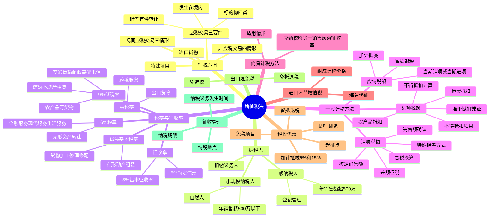

## 1. 章节定位

| 项目 | 信息 |
|------|------|
| 所属科目 | 税法 |
| 难度等级 | 5 |
| 历年分值 | 15-20 分 |
| 建议学时 | 20-25 小时 |
| 知识关联章节 | 第1章 税法总论、第3章 消费税法、第4章 企业所得税法、第7章 关税法（进口环节增值税）、第14章 税收征收管理法 |

## 2. 考情分析

增值税是我国第一大税种，2024 年全国国内增值税收入约 6.57 万亿元，占全部税收收入的 38%。本章是 CPA 税法科目的核心章节，历年分值约 15-20 分，是分值最高、内容最丰富的章节，几乎每年必考主观题（计算题或综合题），同时大量出现在客观题中。

**命题规律**：本章考查综合性强、计算量大，主观题常以业务情境为载体，要求考生对多项业务的销项税额、进项税额进行判断和计算。2024 年 12 月 25 日《中华人民共和国增值税法》通过，自 2026 年 1 月 1 日起施行，标志着增值税从暂行条例上升为法律，新法的变化点是重要考查方向。

**高频考点分布**：
1. 征税范围的界定：应税交易三个要件（销售、境内、标的物范围）、视同应税交易三种情形、非应税交易四种情形。
2. 税率与征收率：13%、9%、6%、零税率四档税率的适用范围，3%、5% 征收率的适用情形。
3. 一般计税方法：销项税额计算（含税销售额换算、特殊销售方式销售额确认、差额征税）、进项税额抵扣（准予抵扣的凭证、不得抵扣的项目、农产品进项税额计算）、应纳税额计算。
4. 简易计税方法：适用情形及计算。
5. 进口环节增值税：组成计税价格计算。
6. 税收优惠：起征点、免税项目、即征即退、加计抵减、留抵退税。
7. 出口退（免）税。

**备考建议**：增值税学习要抓住"销项—进项—应纳税额"的主线。重点掌握：含税与不含税的换算、差额征税的适用情形、不得抵扣进项税额的项目、农产品抵扣的计算、视同销售与不得抵扣的区分。建议大量练习计算题，熟悉各类业务场景的税务处理。

## 3. 知识框架

## 4. 核心精讲

### 4.1 征税范围

在中华人民共和国境内销售货物、服务、无形资产、不动产（以下简称应税交易），以及进口货物的单位和个人，为增值税的纳税人。增值税的征税范围包括应税交易和进口货物两类。

#### 4.1.1 应税交易的构成要件

应税交易是指在我国境内销售货物、服务、无形资产、不动产。确认一项交易构成应税交易需满足三个要件：

**（1）"销售"的含义**

销售是指有偿转让货物、不动产的所有权，有偿提供服务，有偿转让无形资产的所有权或者使用权。其中，"有偿"是指通过交易取得货币、货物或者其他经济利益。

**（2）发生在"境内"的界定**

| 标的物类型 | 境内界定标准 |
|------------|-------------|
| 货物 | 货物的起运地或者所在地在境内 |
| 不动产、自然资源使用权 | 不动产、自然资源所在地在境内 |
| 金融商品 | 金融商品在境内发行，或者销售方为境内单位和个人 |
| 服务、无形资产（除上述外） | 服务、无形资产在境内消费，或者销售方为境内单位和个人 |

其中，服务、无形资产在境内消费的情形包括：境外单位或个人向境内单位或个人销售服务、无形资产（境外现场消费的服务除外）；境外单位或个人销售的服务、无形资产与境内的货物、不动产、自然资源直接相关等。

**（3）货物、服务、无形资产、不动产的具体范围**

- **货物**：包括有形动产、电力、热力、气体等。
- **服务**：包括交通运输服务、邮政服务、电信服务、建筑服务、金融服务、现代服务（研发和技术服务、信息技术服务、文化创意服务、物流辅助服务、租赁服务、鉴证咨询服务、广播影视服务、商务辅助服务、文化体育服务、教育医疗服务、旅游娱乐服务、餐饮住宿服务、居民日常服务、加工修理修配服务等）。
- **无形资产**：包括技术、商标、著作权、商誉、自然资源使用权和其他无形资产。
- **不动产**：包括建筑物、构筑物等。

#### 4.1.2 视同应税交易情形

有下列情形之一的，视同应税交易，应按规定缴纳增值税：

1. 单位和个体工商户将自产或者委托加工的货物用于集体福利或者个人消费；
2. 单位和个体工商户无偿转让货物；
3. 单位和个人无偿转让无形资产、不动产或者金融商品。

#### 4.1.3 非应税交易情形

有下列情形之一的，不属于应税交易，不征收增值税：

1. 员工为受雇单位或者雇主提供取得工资、薪金的服务；
2. 收取行政事业性收费、政府性基金；
3. 依照法律规定被征收、征用而取得补偿；
4. 取得存款利息收入。

此外，纳税人通过合并、分立、出售、置换等方式实施资产重组，同时符合特定条件的，不属于增值税应税交易，不征收增值税。转让非上市公司股权也不属于增值税征税范围。

### 4.2 纳税人和扣缴义务人

#### 4.2.1 一般纳税人与小规模纳税人的区分

增值税制度区分一般纳税人和小规模纳税人分别进行征收管理：

| 项目 | 小规模纳税人 | 一般纳税人 |
|------|-------------|-----------|
| 标准 | 年应征增值税销售额未超过 500 万元 | 年应征增值税销售额超过 500 万元 |
| 计税方法 | 简易计税方法（按销售额和征收率计算） | 一般计税方法（销项税额抵扣进项税额） |
| 特殊规定 | 自然人属于小规模纳税人；会计核算健全的可登记为一般纳税人 | 登记后不得转为小规模纳税人 |

**年应征增值税销售额**的确定：指纳税人在连续不超过 12 个月或四个季度的经营期内累计应征增值税销售额。纳税人偶然发生的销售无形资产、转让不动产的销售额，不计入年应征增值税销售额的计算。

#### 4.2.2 扣缴义务人

境外单位和个人在境内发生应税交易，以购买方为扣缴义务人（按照国务院规定委托境内代理人申报缴纳税款的除外）。扣缴义务人按照销售额乘以税率计算应扣缴税额。

### 4.3 税率与征收率

增值税税率适用于一般计税方法，包括 13%、9%、6%、零税率四档。征收率适用于简易计税方法。

#### 4.3.1 13% 税率适用范围

纳税人销售货物、加工修理修配服务、有形动产租赁服务以及进口货物，除按规定应适用 9% 或零税率的以外，适用 13% 基本税率。

#### 4.3.2 9% 税率适用范围

纳税人销售交通运输、邮政、基础电信、建筑、不动产租赁服务，销售不动产，转让土地使用权，销售或者进口下列货物，除按规定适用零税率的以外，税率为 9%：

1. 农产品、食用植物油、食用盐；
2. 自来水、暖气、冷气、热水、煤气、石油液化气、天然气、二甲醚、沼气、居民用煤炭制品；
3. 图书、报纸、杂志、音像制品、电子出版物；
4. 饲料、化肥、农药、农机、农膜。

#### 4.3.3 6% 税率适用范围

纳税人销售增值电信服务、金融服务、现代服务（不动产租赁除外）、生活服务以及销售无形资产（转让土地使用权除外），除按规定适用零税率的以外，税率为 6%。

#### 4.3.4 零税率适用范围

1. 纳税人出口货物，税率为零（国务院另有规定的除外）。
2. 境内单位和个人跨境销售国务院规定范围内的服务、无形资产，税率为零。包括：向境外单位销售的完全在境外消费的研发服务、设计服务、软件服务等；国际运输服务、航天运输服务等。

#### 4.3.5 征收率

增值税征收率适用于简易计税方法，基本征收率为 3%，特定情形下适用 5%。小规模纳税人及符合规定的一般纳税人适用简易计税方法。

#### 4.3.6 不同税率、征收率的适用规定

- 纳税人发生两项以上应税交易涉及不同税率、征收率的，应当分别核算；未分别核算的，从高适用税率。
- 纳税人发生一项应税交易涉及两个以上税率、征收率的，按照应税交易的主要业务适用税率、征收率（须同时符合：包含两个以上不同税率的业务；业务之间具有明显的主附关系）。

### 4.4 一般计税方法应纳税额的计算

一般计税方法属于间接计算法，其计算公式为：

**当期应纳税额 = 当期销项税额 − 当期进项税额**

#### 4.4.1 销项税额的计算

销项税额是指纳税人发生应税交易，按照销售额乘以规定的税率计算的增值税税额。

**销项税额 = 销售额 × 适用税率**

**（1）销售额的基本规定**

销售额是指纳税人发生应税交易取得的与之相关的价款，包括货币和非货币形式的经济利益对应的全部价款，不包括按照一般计税方法计算的销项税额（增值税为价外税）。

销售额不包括纳税人代为收取的下列税费或款项：政府性基金或行政事业性收费；受托加工应征消费税的消费品所产生的消费税；车辆购置税、车船税；以委托方名义开具发票代委托方收取的款项。

纳税人采用销售额和增值税税额合并定价方法的，按照下列公式计算销售额：

**销售额 = 含税销售额 ÷ (1 + 税率)**

**（2）特殊销售方式下的销售额确认**

| 销售方式 | 销售额确认方法 |
|----------|---------------|
| 折扣销售（商业折扣） | 价款和折扣额在同一张发票"金额"栏分别注明的，可按折扣后销售额征收；未在同一张发票"金额"栏注明的，不得扣减折扣额 |
| 销售折扣（现金折扣） | 不得从销售额中减除（属于融资性质的理财费用） |
| 销售折让 | 以折让后的货款为销售额 |
| 以旧换新 | 按新货物同期销售价格确定销售额，不得扣减旧货物收购价（金银首饰除外，可扣减旧首饰作价） |
| 还本销售 | 销售额为货物的销售价格，不得减除还本支出 |
| 以物易物 | 双方都应作购销处理，以各自发出的应税交易核算销售额计算销项税额 |
| 包装物押金 | 1 年以内且未过期的，不并入销售额；逾期未退还的，按所包装货物适用税率计算（先换算为不含税价）。除啤酒、黄酒外的酒类产品押金，无论是否返还均并入当期销售额 |

**（3）差额征税（按扣除相关价款后的余额计算销售额）**

由于"营改增"后仍存在纳税人无法通过抵扣机制避免重复征税的情形，引入了按差额征税的办法。主要适用情形包括：

- 金融商品转让：以卖出价扣除买入价后的余额为销售额。
- 客运场站服务：以全部含税价款扣除支付给承运方运费后的余额为销售额。
- 航空运输服务：以全部含税价款扣除代售其他航空运输企业客票而代收转付的价款后的余额为销售额。
- 旅游服务：向购买方收取并支付给其他单位或个人的住宿费、餐饮费、交通费、签证费、门票费和支付给其他接团旅游企业的旅游费用，允许从含税销售额中扣除。
- 劳务派遣服务：代用工单位支付给劳务派遣员工的工资、福利和为其办理的社会保险及住房公积金，允许从含税销售额中扣除。
- 融资租赁和融资性售后回租：支付的借款利息、发行债券利息和车辆购置税，允许从含税销售额中扣除。
- 房地产开发企业销售房地产项目：受让土地时向政府部门支付的土地价款等，允许从含税销售额中扣除。

**【计算示例】** 某旅游公司为一般纳税人，2026 年 6 月取得旅游收入 106 万元（含税），其中支付给其他单位的住宿费、餐饮费、交通费、门票费等合计 63.6 万元（含税）。

销售额 = (106 − 63.6) ÷ (1 + 6%) = 42.4 ÷ 1.06 = 40（万元）
销项税额 = 40 × 6% = 2.4（万元）

**（4）税务机关核定销售额**

销售额明显偏低或者偏高且无正当理由的，税务机关可按顺序依照下列方法核定：
1. 按纳税人最近时期销售同类货物、服务、无形资产或不动产的平均价格确定。
2. 按其他纳税人最近时期销售同类货物、服务、无形资产或不动产的平均价格确定。
3. 按组成计税价格确定：**组成计税价格 = 成本 × (1 + 成本利润率) + 消费税税额**（成本利润率为 10%）。

#### 4.4.2 进项税额的确认和计算

进项税额是指纳税人购进货物、服务、无形资产、不动产所支付或者负担的增值税税额。

**（1）准予从销项税额中抵扣的进项税额**

一般纳税人应当凭增值税扣税凭证从销项税额中抵扣进项税额，具体包括：

| 凭证类型 | 抵扣方法 |
|----------|---------|
| 增值税专用发票 | 发票上注明的增值税税额 |
| 海关进口增值税专用缴款书 | 缴款书上注明的增值税税额 |
| 完税凭证（境外购进） | 完税凭证上注明的增值税税额 |
| 农产品销售发票或收购发票 | 买价 × 扣除率（9%） |
| 小规模纳税人开具的增值税专用发票（农产品） | 发票金额 × 9% 扣除率 |
| 国内旅客运输服务（铁路/航空电子客票） | 发票上列明的增值税税额 |
| 公路、水路等其他客票 | 票面金额 ÷ (1+3%) × 3% |
| 桥、闸通行费发票 | 发票金额 ÷ (1+5%) × 5% |

**农产品进项税额抵扣的特殊规定**：
- 一般纳税人购进农产品，取得一般纳税人开具的增值税专用发票或海关进口增值税专用缴款书的，以发票上注明的增值税额为进项税额。
- 从按照 3% 征收率计算缴纳增值税的小规模纳税人取得增值税专用发票的，以发票上注明的金额和 9% 扣除率计算进项税额。
- 取得（开具）农产品销售发票或收购发票的，以发票上注明的农产品买价和 9% 扣除率计算进项税额。
- 购进农产品用于生产销售或委托加工 13% 税率货物的，按照 10% 的扣除率计算进项税额。

**（2）不得从销项税额中抵扣的进项税额**

下列项目的进项税额不得从销项税额中抵扣：

1. 适用简易计税方法计税项目对应的进项税额。
2. 免征增值税项目对应的进项税额。
3. 购进并用于集体福利的货物、服务、无形资产、不动产对应的进项税额。
4. 购进并用于个人消费的货物、服务、无形资产、不动产对应的进项税额（包括纳税人的交际应酬消费）。
5. 不得抵扣非应税交易（不属于应税交易和视同应税交易，且不属于四项非应税交易，但经营活动取得了经济利益）对应的进项税额。
6. 非正常损失项目对应的进项税额：因管理不善造成货物被盗、丢失、霉烂变质，以及因违反法律法规造成货物或不动产被依法没收、销毁、拆除的情形。
7. 购进并直接用于消费的餐饮服务、居民日常服务和娱乐服务对应的进项税额。
8. 购进贷款服务，及与该笔贷款直接相关的投融资顾问费、手续费、咨询费等费用支出对应的进项税额。

**非正常损失的范围**：
- 非正常损失的购进货物，以及相关的加工修理修配服务和交通运输服务。
- 非正常损失的在产品、产成品所耗用的购进货物（不含固定资产）、加工修理修配服务和交通运输服务。
- 非正常损失的不动产，以及该不动产所耗用的购进货物和建筑服务。
- 非正常损失的不动产在建工程所耗用的购进货物和建筑服务。

**（3）不得抵扣进项税额的计算**

一般纳税人购进货物（不含固定资产）、服务，用于简易计税方法计税项目、免征增值税项目和不得抵扣非应税交易而无法划分不得抵扣的进项税额的，按销售额占比计算：

**当期不得抵扣的进项税额 = 当期无法划分的全部进项税额 × (当期简易计税方法计税项目销售额 + 当期免征增值税项目销售额 + 当期不得抵扣非应税交易收入) ÷ (当期全部销售额 + 当期全部非应税交易收入)**

**长期资产进项税额抵扣的特殊规定**：
- 专用于一般计税方法计税项目的长期资产，进项税额全额抵扣。
- 专用于五类不允许抵扣项目的，进项税额不得抵扣。
- 既用于一般计税方法又用于五类不允许抵扣项目的（混合用途）：原值不超过 500 万元的单项长期资产，进项税额全额抵扣；原值超过 500 万元的单项长期资产，购进时先全额抵扣，此后在混合用途期间根据调整年限逐年调整。
- 调整年限：不动产、土地使用权为 20 年；飞机、火车、轮船为 10 年；其他长期资产为 5 年。

**用途改变的进项税处理**：
- 已抵扣后改变用途专用于不得抵扣项目的：不得抵扣的进项税额 = 长期资产对应的进项税额 × 净值率，其中净值率 = (当月期初长期资产净值 ÷ 长期资产原值) × 100%。
- 原专用于不得抵扣项目后改变用途用于一般计税方法的：可抵扣进项税额 = 长期资产对应的进项税额 × 净值率。

#### 4.4.3 应纳税额的计算

**（1）当期的规定**

纳税人必须严格把握当期进项税额从当期销项税额中抵扣。"当期"是指税务机关依照税法规定对纳税人确定的计税期间。

**（2）加计抵减政策**

自 2023 年 1 月 1 日至 2027 年 12 月 31 日：

| 企业类型 | 加计抵减比例 |
|----------|-------------|
| 先进制造业企业 | 当期可抵扣进项税额的 5% |
| 集成电路企业 | 当期可抵扣进项税额加计 15% |
| 工业母机企业 | 当期可抵扣进项税额加计 15% |

加计抵减的适用规则：
- 抵减前应纳税额等于零的，当期可抵减加计抵减额全部结转下期。
- 抵减前应纳税额大于零且大于当期可抵减加计抵减额的，当期全额抵减。
- 抵减前应纳税额大于零且小于等于当期可抵减加计抵减额的，抵减至零，未抵减完的结转下期。

**（3）留抵退税**

当期进项税额大于当期销项税额的部分，纳税人可以选择结转下期继续抵扣或者申请退还。留抵退税政策区分三类纳税人：
- 制造业等 4 个行业纳税人：可以按月申请退还期末留抵税额（全额退税）。
- 房地产开发经营业纳税人：增量退税（与 2019 年 3 月 31 日期末留抵税额相比，连续 6 个月新增留抵税额均大于零且第 6 个月不低于 50 万元的，可申请退还第 6 个月期末新增留抵税额的 60%）。
- 其他纳税人：按比例退还新增留抵税额（不超过 1 亿元的部分退税比例 60%，超过 1 亿元的部分退税比例 30%）。

### 4.5 简易计税方法

简易计税方法按照销售额和征收率计算应纳税额，不得抵扣进项税额。

**应纳税额 = 销售额 × 征收率**

销售额不含增值税，含税销售额换算公式为：

**销售额 = 含税销售额 ÷ (1 + 征收率)**

简易计税方法的适用情形主要包括：
1. 小规模纳税人发生应税交易。
2. 一般纳税人销售自产的下列货物，可选择按照 3% 征收率计算缴纳：县级及县级以下小型水力发电单位生产的电力；建筑用和生产建筑材料所用的砂、土、石料；以自己采掘的砂、土、石料或其他矿物连续生产的砖、瓦、石灰等；用微生物、微生物代谢产物、动物毒素、人或动物的血液或组织制成的生物制品；自来水；商品混凝土等。
3. 一般纳税人销售其 2016 年 4 月 30 日前取得的不动产，可选择适用简易计税方法，按 5% 征收率。
4. 房地产开发企业销售自行开发的房地产项目，老项目可选简易计税方法按 5% 征收率。
5. 不动产经营租赁服务，出租其 2016 年 4 月 30 日前取得的不动产，可选简易计税方法按 5% 征收率。

### 4.6 进口环节增值税

进口货物增值税由海关代征，按照组成计税价格和适用税率计算。

**组成计税价格 = 关税完税价格 + 关税 + 消费税**

**应纳税额 = 组成计税价格 × 税率**

进口货物增值税的组成计税价格中包括关税完税价格和关税税额，如果进口货物属于消费税应税消费品，还需包括消费税税额。

**【计算示例】** 某企业进口一批货物，关税完税价格为 100 万元，关税税率为 20%，消费税税率为 10%。

关税 = 100 × 20% = 20（万元）
组成计税价格 = (100 + 20) ÷ (1 − 10%) = 120 ÷ 0.9 = 133.33（万元）
进口环节增值税 = 133.33 × 13% = 17.33（万元）

### 4.7 税收优惠

#### 4.7.1 起征点

增值税起征点适用于个人（不包括登记为一般纳税人的个体工商户）。未达到起征点的，免征增值税；达到起征点的，全额计算缴纳增值税。按期纳税的，起征点为月销售额 5000-20000 元（含本数）；按次纳税的，起征点为每次（日）销售额 300-500 元（含本数）。

#### 4.7.2 主要免税项目

1. 农业生产者销售的自产农产品。
2. 避孕药品和用具。
3. 古旧图书。
4. 直接用于科学研究、科学试验和教学的进口仪器、设备。
5. 外国政府、国际组织无偿援助的进口物资和设备。
6. 由残疾人的组织直接进口供残疾人专用的物品。
7. 销售的自己使用过的物品（指自然人个人销售自己使用过的物品）。
8. 托儿所、幼儿园提供的保育和教育服务，养老机构提供的养老服务，残疾人福利机构提供的育养服务，婚姻介绍服务，殡葬服务。
9. 医疗机构提供的医疗服务。
10. 从事学历教育的学校提供的教育服务，学生勤工俭学提供的服务。
11. 农业机耕、排灌、病虫害防治、植物保护、农牧保险以及相关技术培训业务，家禽、牲畜、水生动物的配种和疾病防治。
12. 纪念馆、博物馆、文化馆、文物保护单位管理机构、美术馆、展览馆、书画院、图书馆举办文化活动的门票收入，宗教场所举办文化、宗教活动的门票收入。

#### 4.7.3 即征即退

- 软件产品：增值税一般纳税人销售其自行开发生产的软件产品，按 13% 税率征收增值税后，对其增值税实际税负超过 3% 的部分实行即征即退政策。
- 资源综合利用产品和劳务：符合相关条件的，可享受增值税即征即退政策，退税比例分别为 30%、50%、70%、100%。
- 安置残疾人就业：按安置残疾人人数实行限额即征即退。

#### 4.7.4 小规模纳税人减免

自 2023 年 1 月 1 日至 2027 年 12 月 31 日，对月销售额 10 万元以下（含本数）的增值税小规模纳税人，免征增值税。增值税小规模纳税人适用 3% 征收率的应税销售收入，减按 1% 征收率征收增值税；适用 3% 预征率的预缴增值税项目，减按 1% 预征率预缴增值税。

### 4.8 出口退（免）税

我国增值税出口退（免）税办法主要有三种：

| 办法 | 适用对象 | 内容 |
|------|----------|------|
| 免退税 | 不具有生产能力的外贸企业 | 免征增值税，退还相应进项税额 |
| 免抵退税 | 生产企业 | 免征增值税，相应进项税额抵减内销应纳税额，未抵减完的予以退还 |
| 免税 | 出口免税不退税的情形 | 出口环节免征增值税，不退还进项税额 |

### 4.9 征收管理

#### 4.9.1 纳税义务发生时间

- 纳税人发生应税交易，纳税义务发生时间为收讫销售款项或者取得索取销售款项凭据的当天；先开具发票的，为开具发票的当天。
- 进口货物，纳税义务发生时间为报关进口的当天。
- 采取直接收款方式销售货物，不论货物是否发出，均为收到销售款或取得索取销售款凭据的当天。
- 采取托收承付和委托银行收款方式销售货物，为发出货物并办妥托收手续的当天。
- 采取赊销和分期收款方式销售货物，为书面合同约定的收款日期的当天；无书面合同或书面合同没有约定收款日期的，为货物发出的当天。
- 采取预收款方式销售货物，为货物发出的当天（但生产销售生产工期超过 12 个月的大型机械设备、船舶、飞机等货物，为收到预收款或书面合同约定的收款日期的当天）。
- 纳税人提供有形动产租赁服务，采取预收款方式的，纳税义务发生时间为收到预收款的当天。

#### 4.9.2 纳税期限

增值税的计税期间分别为 10 日、15 日、1 个月或者 1 个季度。纳税人的具体计税期间，由主管税务机关根据纳税人应纳税额的大小分别核定；不经常发生应税交易的纳税人，可以按次纳税。

纳税人以 1 个月或者 1 个季度为 1 个计税期间的，自期满之日起 15 日内申报纳税；以 10 日或者 15 日为 1 个计税期间的，自次月 1 日起 15 日内申报纳税。

#### 4.9.3 纳税地点

- 固定业户应当向其机构所在地的主管税务机关申报纳税。
- 总机构和分支机构不在同一县（市）的，应当分别向各自所在地的主管税务机关申报纳税；经批准，可以由总机构汇总向总机构所在地的主管税务机关申报纳税。
- 非固定业户应当向应税交易发生地的主管税务机关申报纳税。
- 进口货物，应当向报关地海关申报纳税。

## 5. 典型例题

### 例题 1

**题目**：某生产企业为增值税一般纳税人，2026 年 6 月发生以下业务：
（1）销售甲产品，开具增值税专用发票，注明销售额 200 万元，税额 26 万元。
（2）以折扣方式销售乙产品，销售额 100 万元，折扣额 10 万元，在同一张发票"金额"栏分别注明。
（3）将自产丙产品用于集体福利，同类产品不含税售价 20 万元，成本 15 万元。
（4）购进原材料，取得增值税专用发票注明税额 13 万元。
（5）购进职工食堂用餐设备，取得增值税专用发票注明税额 0.65 万元。
（6）因管理不善导致上月购进的原材料毁损，账面成本 10 万元（其中含运费 1 万元）。

计算该企业 6 月应缴纳的增值税。（以上金额均为不含税价，适用税率 13%）

**答案**：

（1）销项税额 = 26 万元

（2）折扣销售，同一张发票"金额"栏分别注明的，按折扣后销售额计税：
销项税额 = (100 − 10) × 13% = 11.7（万元）

（3）将自产货物用于集体福利，视同应税交易：
销项税额 = 20 × 13% = 2.6（万元）

当期销项税额合计 = 26 + 11.7 + 2.6 = 40.3（万元）

（4）购进原材料，进项税额 = 13 万元（可抵扣）

（5）购进职工食堂用餐设备，用于集体福利，进项税额不得抵扣 = 0 万元

（6）管理不善导致的非正常损失，进项税额转出：
原材料部分：(10 − 1) × 13% = 1.17（万元）
运费部分：1 × 9% = 0.09（万元）
进项税额转出 = 1.17 + 0.09 = 1.26（万元）

当期可抵扣进项税额 = 13 − 1.26 = 11.74（万元）

当期应纳税额 = 40.3 − 11.74 = 28.56（万元）

**解析**：本题考查销项税额计算（折扣销售、视同销售）和进项税额抵扣（集体福利不得抵扣、非正常损失进项税额转出）。注意折扣销售必须同一张发票"金额"栏分别注明才能按折扣后计税；自产货物用于集体福利视同销售；购进用于集体福利的设备不得抵扣；管理不善导致的非正常损失需进项税额转出，其中运费适用 9% 税率。

### 例题 2

**题目**：某餐饮企业为增值税一般纳税人，2026 年 7 月发生以下业务：
（1）提供餐饮服务取得含税收入 106 万元。
（2）购进食材，取得增值税专用发票注明金额 30 万元，税额 3.9 万元。
（3）购进啤酒，取得增值税专用发票注明税额 1.3 万元，其中 40% 用于员工免费餐饮。
（4）支付水电费，取得增值税专用发票注明税额 0.52 万元。

计算该企业 7 月应缴纳的增值税。

**答案**：

餐饮服务适用 6% 税率。

（1）销项税额 = 106 ÷ (1 + 6%) × 6% = 100 × 6% = 6（万元）

（2）购进食材用于餐饮服务，可全额抵扣：进项税额 = 3.9 万元

（3）购进啤酒 40% 用于员工免费餐饮（集体福利），不得抵扣；60% 可抵扣：
可抵扣进项税额 = 1.3 × 60% = 0.78（万元）

（4）水电费可抵扣进项税额 = 0.52 万元

当期进项税额合计 = 3.9 + 0.78 + 0.52 = 5.2（万元）

当期应纳税额 = 6 − 5.2 = 0.8（万元）

**解析**：餐饮服务适用 6% 税率。购进货物部分用于集体福利的，需按比例计算不得抵扣的进项税额。注意购进并直接用于消费的餐饮服务不得抵扣，但餐饮企业购进食材用于提供餐饮服务（应税交易），其进项税额可以抵扣。

### 例题 3

**题目**：某进出口公司（一般纳税人）2026 年 8 月进口一批化妆品，关税完税价格 200 万元，关税税率 25%，消费税税率 15%。计算进口环节应缴纳的增值税。

**答案**：

关税 = 200 × 25% = 50（万元）
组成计税价格 = (200 + 50) ÷ (1 − 15%) = 250 ÷ 0.85 = 294.12（万元）
进口环节增值税 = 294.12 × 13% = 38.24（万元）

**解析**：进口环节增值税的组成计税价格 = 关税完税价格 + 关税 + 消费税。对于消费税应税消费品，组成计税价格 = (关税完税价格 + 关税) ÷ (1 − 消费税税率)。化妆品属于消费税应税消费品，适用 13% 增值税税率。

### 例题 4

**题目**：某先进制造业企业为增值税一般纳税人，2026 年 9 月当期销项税额 500 万元，当期可抵扣进项税额 400 万元，上期留抵税额 20 万元。计算该企业 9 月应缴纳的增值税（考虑加计抵减政策）。

**答案**：

抵减前应纳税额 = 500 − (400 + 20) = 80（万元）

加计抵减额 = 400 × 5% = 20（万元）

抵减后应纳税额 = 80 − 20 = 60（万元）

**解析**：先进制造业企业可按照当期可抵扣进项税额的 5% 计提加计抵减额。抵减前应纳税额大于零且大于当期可抵减加计抵减额（80 > 20），当期可抵减加计抵减额全额从抵减前应纳税额中抵减。注意加计抵减额按当期可抵扣进项税额计算，不包括上期留抵税额。

### 例题 5

**题目**：某建筑公司为增值税一般纳税人，2026 年 10 月发生以下业务：
（1）提供建筑服务，取得含税收入 218 万元（适用一般计税方法，税率 9%）。
（2）支付分包款，取得增值税专用发票注明税额 18 万元。
（3）购进建筑材料，取得增值税专用发票注明税额 13 万元。
（4）购进挖掘机一台，取得增值税专用发票注明税额 6.5 万元，用于一般计税方法项目。

计算该建筑公司 10 月应缴纳的增值税。

**答案**：

建筑服务适用差额纳税，以取得的全部价款和价外费用扣除支付的分包款后的余额为销售额。

销售额 = (218 − 18 ÷ 9%) ÷ (1 + 9%) ×（注：分包款含税，先换算）
分包款含税金额 = 18 ÷ 9% = 200（万元），即含税分包款为 218 万元中的一部分
更正：分包款增值税专用发票注明税额 18 万元，则分包款不含税金额 = 18 ÷ 9% = 200 万元，含税分包款 = 200 + 18 = 218 万元

销售额 = (218 − 218) ÷ (1 + 9%) = 0

这里需要重新理解题意：假设含税总收入 218 万元，含税分包款 109 万元（其中税额 9 万元）。

重新计算：
销售额 = (218 − 109) ÷ (1 + 9%) = 109 ÷ 1.09 = 100（万元）
销项税额 = 100 × 9% = 9（万元）

进项税额 = 9（分包款，但差额扣除部分不得抵扣进项）+ 13（建筑材料）+ 6.5（挖掘机）

注意：差额扣除的分包款对应的进项税额不得抵扣。因此分包款的进项税额 9 万元不得抵扣。

可抵扣进项税额 = 13 + 6.5 = 19.5（万元）

应纳税额 = 9 − 19.5 = −10.5（万元），形成期末留抵税额 10.5 万元，结转下期继续抵扣。

本期应缴纳增值税 = 0（万元），期末留抵税额 = 10.5 万元。

**解析**：建筑服务适用差额征税，以全部含税价款扣除分包款后的余额为销售额。差额扣除部分对应的进项税额不得抵扣。本题关键在于区分差额征税和进项税额抵扣的关系——同一笔分包款，在差额征税时已从销售额中扣除，就不能再抵扣其进项税额，避免重复减税。

## 6. 记忆口诀

1. **增值税四大特点**："中性、普遍、抵扣、价外"——避免重复征税（中性特征）、普遍征收、税款抵扣制度、价外税制度。

2. **应税交易三要件**："有偿销售、境内发生、四类标的"——销售（有偿转让）、境内（起运地/所在地/消费地）、标的物（货物/服务/无形资产/不动产）。

3. **视同应税交易三情形**："自产委托用于福利消费、单位无偿转让货物、单位个人无偿转让无形资产不动产金融商品"。

4. **非应税交易四情形**："员工工资、行政收费、征收补偿、存款利息"。

5. **税率四档**："13 货物加工动产租赁，9 交通邮政基础电信建筑不动产农产，6 金融现代生活无形资产，0 出口跨境"。

6. **含税换算公式**："含税除以 1 加税率"——销售额 = 含税销售额 ÷ (1 + 税率)。

7. **折扣销售 vs 销售折扣**："折扣销售同票金额栏可减，销售折扣不得减"——商业折扣在同一张发票"金额"栏注明可减除；现金折扣属于融资费用不得减除。

8. **不得抵扣进项税额**："简易免税福利消费、非正常损失、餐饮居民娱乐、贷款服务"——简易计税项目、免税项目、集体福利、个人消费的进项不得抵扣；非正常损失、直接消费的餐饮/居民日常/娱乐服务、贷款服务的进项不得抵扣。

9. **非正常损失**："管理不善被盗丢失霉烂、违法没收销毁拆除"——非因管理不善的自然灾害损失不属于非正常损失，其进项税额无需转出。

10. **农产品扣除率**："买价乘 9%，生产 13% 货物用 10%"——购进农产品基本扣除率 9%，用于生产销售 13% 税率货物的按 10% 扣除。

11. **组成计税价格**："成本乘以 1 加利润率，再加消费税"——组成计税价格 = 成本 × (1 + 成本利润率) + 消费税税额，成本利润率 10%。

12. **进口增值税组价**："完税价格加关税加消费税"——组成计税价格 = 关税完税价格 + 关税 + 消费税，应纳税额 = 组成计税价格 × 税率。

13. **加计抵减比例**："先进制造 5%，集成电路和工业母机 15%"——先进制造业企业加计 5%，集成电路企业和工业母机企业加计 15%。

14. **留抵退税三类**："制造等四行业全额退，房地产增量退 60%，其他按比例 60%/30%"——制造业等 4 个行业按月全额退税，房地产开发经营业退还增量留抵的 60%，其他纳税人新增留抵不超过 1 亿元部分退 60%，超过部分退 30%。

15. **纳税义务发生时间**："收讫销售款或取得索取凭据当天，先开发票为开票当天"——一般规定以收讫销售款或取得索取销售款凭据的当天为准，先开发票的以开票当天为准。

16. **小规模纳税人标准**："500 万"——年应征增值税销售额未超过 500 万元的为小规模纳税人。
