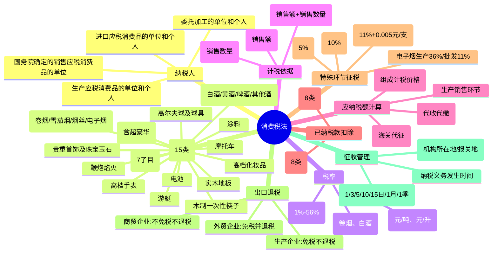

## 📍 章节定位

| 项目 | 信息 |
|------|------|
| **所属科目** | 💰 税法 |
| **难度等级** | ⭐⭐⭐ |
| **历年分值** | 4-5分 |
| **建议学时** | 5-6h |

## 📝 考情分析

消费税是 CPA 税法考试的重要章节。本章内容相对独立，但与增值税关系密切（同属流转税，计税依据相似）。常考点包括：15 个税目的征税范围与税率（尤其卷烟、白酒、成品油、小汽车、电子烟）、三种计税方法（从价定率、从量定额、复合计征）、自产自用与委托加工的组成计税价格计算、外购已税消费品已纳税款的扣除、特殊环节征税（卷烟批发、超豪华小汽车零售、金银首饰零售、电子烟生产批发）。主观题常考卷烟、白酒复合计税及委托加工环节代收代缴计算，客观题常考税目范围界定与特殊政策。

## 🧠 知识框架

## 📖 核心精讲

### 一、纳税义务人

在中华人民共和国境内**生产、委托加工和进口**应税消费品的单位和个人，以及国务院确定的销售应税消费品的其他单位和个人，为消费税的纳税人。

- **单位**：企业、行政单位、事业单位、军事单位、社会团体及其他单位；
- **个人**：个体工商户及其他个人；
- **境内**：指生产、委托加工和进口应税消费品的起运地或所在地在境内。

### 二、税目（15 类）

消费税征收范围具有选择性，目前税目包括 15 种商品：

#### （一）烟

凡是以烟叶为原料加工生产的产品均属于本税目，包括卷烟、雪茄烟、烟丝。卷烟分为甲类卷烟（每标准条调拨价≥70 元）和乙类卷烟（<70 元）。自 2022 年 11 月 1 日起，电子烟纳入消费税征收范围。

#### （二）酒

酒精度在 1 度以上的各种酒类饮料，包括白酒、黄酒、啤酒和其他酒。啤酒按出厂价（含包装物及押金，不含增值税）划分：≥3,000 元/吨为甲类啤酒，<3,000 元/吨为乙类啤酒。葡萄酒适用"其他酒"子目。

#### （三）高档化妆品

自 2016 年 10 月 1 日起，包括高档美容、修饰类化妆品、高档护肤类化妆品和成套化妆品。生产（进口）环节销售（完税）价格（不含增值税）在 10 元/毫升（克）或 15 元/片（张）及以上。

#### （四）贵重首饰及珠宝玉石

包括纯金银首饰及镶嵌首饰和经采掘、打磨、加工的各种珠宝玉石。

#### （五）鞭炮、焰火

体育上用的发令纸、鞭炮药引线不按本税目征收。

#### （六）成品油

包括汽油、柴油、石脑油、溶剂油、航空煤油、润滑油、燃料油 7 个子目。航空煤油暂缓征收。

#### （七）小汽车

包括乘用车（≤9 座）、中轻型商用客车（10-23 座）、超豪华小汽车（零售价≥90 万元）。

#### （八）摩托车

气缸容量 250 毫升（不含）以下的小排量摩托车不征收消费税。

#### （九）至（十五）

高尔夫球及球具、高档手表（≥10,000 元/只）、游艇（8-90 米）、木制一次性筷子、实木地板、电池、涂料。

### 三、税率

消费税采用**比例税率**和**定额税率**两种形式，卷烟、白酒采用复合税率。

#### 消费税税目、税率（额）表

| 税目 | 子目 | 税率/税额 |
|------|------|-----------|
| **一、烟** | 1. 甲类卷烟（生产/进口环节） | 56% + 0.003 元/支 |
| | 2. 乙类卷烟（生产/进口环节） | 36% + 0.003 元/支 |
| | 3. 卷烟（批发环节） | 11% + 0.005 元/支 |
| | 4. 雪茄烟 | 36% |
| | 5. 烟丝 | 30% |
| | 6. 电子烟（生产/进口环节） | 36% |
| | 7. 电子烟（批发环节） | 11% |
| **二、酒** | 1. 白酒 | 20% + 0.5 元/500克 |
| | 2. 黄酒 | 240 元/吨 |
| | 3. 甲类啤酒 | 250 元/吨 |
| | 4. 乙类啤酒 | 220 元/吨 |
| | 5. 其他酒 | 10% |
| **三、高档化妆品** | — | 15% |
| **四、贵重首饰及珠宝玉石** | 1. 金银首饰、铂金首饰、钻石（零售环节） | 5% |
| | 2. 其他贵重首饰和珠宝玉石 | 10% |
| **五、鞭炮、焰火** | — | 15% |
| **六、成品油** | 1. 汽油 | 1.52 元/升 |
| | 2. 柴油 | 1.2 元/升 |
| | 3. 航空煤油 | 1.2 元/升（暂缓征收） |
| | 4. 石脑油 | 1.52 元/升 |
| | 5. 溶剂油 | 1.52 元/升 |
| | 6. 润滑油 | 1.52 元/升 |
| | 7. 燃料油 | 1.2 元/升 |
| **七、小汽车** | 1. 乘用车（按排气量） | 1%-40% |
| | 2. 中轻型商用客车 | 5% |
| | 3. 超豪华小汽车（零售环节加征） | 10% |
| **八、摩托车** | 1. 气缸容量 250 毫升 | 3% |
| | 2. 气缸容量 250 毫升以上 | 10% |
| **九、高尔夫球及球具** | — | 10% |
| **十、高档手表** | — | 20% |
| **十一、游艇** | — | 10% |
| **十二、木制一次性筷子** | — | 5% |
| **十三、实木地板** | — | 5% |
| **十四、电池** | — | 4% |
| **十五、涂料** | — | 4% |

> **兼营规定**：纳税人兼营不同税率应税消费品，应当分别核算销售额、销售数量；未分别核算或将不同税率应税消费品组成成套消费品销售的，**从高适用税率**。

### 四、计税依据

#### （一）从价计征

**销售额**为纳税人销售应税消费品向购买方收取的全部价款和价外费用。

- 价外费用包括手续费、补贴、基金、集资费、返还利润、违约金、滞纳金、延期付款利息、包装费、包装物租金等；
- 不包括：符合规定的代垫运输费用、代收政府性基金或行政事业性收费；
- 包装物押金：逾期未退或超过 12 个月的押金应并入销售额；销售除啤酒、黄酒外的其他酒类产品收取的押金，无论是否返还均并入当期销售额。

**含税销售额换算**：

$$\text{应税消费品的销售额}=\frac{\text{含增值税的销售额}}{1+\text{增值税税率或征收率}}$$

#### （二）从量计征

**销售数量**的确定：
1. 销售应税消费品——销售数量；
2. 自产自用应税消费品——移送使用数量；
3. 委托加工应税消费品——收回数量；
4. 进口应税消费品——海关核定的进口征税数量。

**吨与升换算标准**：

| 序号 | 名称 | 换算标准 |
|------|------|----------|
| 1 | 黄酒 | 1 吨 = 962 升 |
| 2 | 啤酒 | 1 吨 = 988 升 |
| 3 | 汽油 | 1 吨 = 1,388 升 |
| 4 | 柴油 | 1 吨 = 1,176 升 |
| 5 | 航空煤油 | 1 吨 = 1,246 升 |
| 6 | 石脑油 | 1 吨 = 1,385 升 |
| 7 | 溶剂油 | 1 吨 = 1,282 升 |
| 8 | 润滑油 | 1 吨 = 1,126 升 |
| 9 | 燃料油 | 1 吨 = 1,015 升 |

#### （三）复合计征

现行消费税中，只有**卷烟、白酒**采用复合计征。应纳税额 = 应税销售数量×定额税率 + 应税销售额×比例税率。

#### （四）计税依据特殊规定

1. **非独立核算门市部**：按门市部对外销售额或销售数量征收；
2. **换取生产资料、投资入股、抵偿债务**：以同类应税消费品**最高销售价格**作为计税依据；
3. **卷烟计税价格核定**：由国家税务总局按批发环节销售价格扣除批发毛利率核定；
4. **白酒最低计税价格核定**：生产企业计税价格低于销售单位对外销售价格 70% 的，税务机关在 60%-70% 范围内核定（自 2017 年 5 月 1 日起统一为 60%）；
5. **金银首饰**：以旧换新按实际收取的不含增值税全部价款确定计税依据。

### 五、应纳税额的计算

#### （一）生产销售环节

**1. 从价定率**：

$$\text{应纳税额}=\text{应税消费品的销售额}\times\text{比例税率}$$

**2. 从量定额**：

$$\text{应纳税额}=\text{应税消费品的销售数量}\times\text{定额税率}$$

**3. 复合计征**：

$$\text{应纳税额}=\text{应税消费品的销售数量}\times\text{定额税率}+\text{应税消费品的销售额}\times\text{比例税率}$$

#### （二）自产自用应税消费品

**用于连续生产应税消费品**：不纳税（避免重复征税）。

**用于其他方面**（生产非应税消费品、在建工程、管理部门、馈赠、赞助、广告、样品、职工福利、奖励等）：于移送使用时纳税。

**组成计税价格**（无同类消费品销售价格时）：

从价定率：

$$\text{组成计税价格}=\frac{\text{成本}+\text{利润}}{1-\text{比例税率}}=\frac{\text{成本}\times(1+\text{成本利润率})}{1-\text{比例税率}}$$

复合计税：

$$\text{组成计税价格}=\frac{\text{成本}+\text{利润}+\text{自产自用数量}\times\text{定额税率}}{1-\text{比例税率}}$$

其中利润 = 成本 × 全国平均成本利润率（甲类卷烟 10%、白酒 10%、高档手表 20%、高档化妆品 5% 等）。

#### （三）委托加工环节

委托加工的应税消费品，由**受托方**（个人除外）在交货时代收代缴消费税。

**组成计税价格**（无同类消费品销售价格时）：

从价定率：

$$\text{组成计税价格}=\frac{\text{材料成本}+\text{加工费}}{1-\text{比例税率}}$$

复合计税：

$$\text{组成计税价格}=\frac{\text{材料成本}+\text{加工费}+\text{委托加工数量}\times\text{定额税率}}{1-\text{比例税率}}$$

> **直接出售规则**：委托方以不高于受托方计税价格出售的，不再缴纳消费税；高于计税价格出售的，需申报缴纳，准予扣除受托方已代收代缴税款。

#### （四）进口环节

进口应税消费品于报关进口时缴纳，由海关代征，自海关填发缴款书之日起 15 日内缴纳。

**从价定率组成计税价格**：

$$\text{组成计税价格}=\frac{\text{关税计税价格}+\text{关税}}{1-\text{消费税比例税率}}$$

**复合计税组成计税价格**：

$$\text{组成计税价格}=\frac{\text{关税计税价格}+\text{关税}+\text{数量}\times\text{定额税率}}{1-\text{比例税率}}$$

### 六、已纳消费税扣除的计算

#### （一）外购应税消费品已纳税款扣除

用外购已税消费品连续生产应税消费品的，按当期生产领用数量计算扣除已纳消费税。**扣除范围（8 类）**：

1. 外购已税烟丝生产的卷烟；
2. 外购已税高档化妆品为原料生产的高档化妆品；
3. 外购已税珠宝玉石为原料生产的贵重首饰及珠宝玉石；
4. 外购已税鞭炮、焰火为原料生产的鞭炮、焰火；
5. 外购已税杆头、杆身和握把为原料生产的高尔夫球杆；
6. 外购已税木制一次性筷子为原料生产的木制一次性筷子；
7. 外购已税实木地板为原料生产的实木地板；
8. 外购已税汽油、柴油、石脑油、燃料油、润滑油为原料连续生产的应税成品油。

**计算公式**：

$$\text{当期准予扣除的外购应税消费品已纳税款}=\text{当期准予扣除的外购应税消费品买价}\times\text{适用税率}$$

$$\text{当期准予扣除的外购应税消费品买价}=\text{期初库存}+\text{当期购进}-\text{期末库存}$$

> **例外**：用外购已税珠宝玉石生产改在零售环节征收消费税的金银首饰（镶嵌首饰），不得扣除外购珠宝玉石已纳税款。

#### （二）委托加工收回的应税消费品已纳税款扣除

委托加工收回后用于连续生产应税消费品的，已纳税款准予按当期生产领用数量扣除。扣除范围与外购相同（8 类）。

### 七、特殊商品及环节消费税征收

#### （一）电子烟

| 项目 | 内容 |
|------|------|
| 纳税人 | 生产（进口）、批发电子烟的单位和个人 |
| 生产（进口）环节税率 | 36% |
| 批发环节税率 | 11% |
| 计税方式 | 从价定率 |
| 代加工处理 | 持有商标的企业缴纳；代加工企业不属纳税人 |

#### （二）卷烟批发环节

| 项目 | 内容 |
|------|------|
| 纳税人 | 从事卷烟批发业务的单位和个人 |
| 征收范围 | 批发销售的所有牌号、规格卷烟 |
| 税率 | 11% + 0.005 元/支 |
| 计税依据 | 批发销售额（不含增值税）、销售数量 |
| 特殊规定 | 纳税人之间销售卷烟不缴税；不得扣除生产环节消费税 |

#### （三）超豪华小汽车零售环节

| 项目 | 内容 |
|------|------|
| 征税范围 | 零售价格≥90 万元（不含增值税）的乘用车和中轻型商用客车 |
| 纳税人 | 销售给消费者的单位和个人 |
| 税率 | 10% |
| 计算公式 | 应纳税额 = 零售环节销售额 × 10% |
| 国内生产企业直销 | 税率 = 生产环节税率 + 零售环节税率 |
| 二手超豪华小汽车 | 自 2025 年 7 月 20 日起不征收消费税 |

### 八、消费税出口退税

| 类型 | 适用企业 | 政策 |
|------|----------|------|
| 出口免税并退税 | 外贸企业购进直接出口 | 退还购进时已纳消费税 |
| 出口免税不退税 | 生产性企业自营出口 | 免征生产环节消费税，不退税 |
| 出口不免税不退税 | 一般商贸企业 | 不予退（免）税 |

### 九、征收管理

#### （一）纳税义务发生时间

| 结算方式 | 纳税义务发生时间 |
|----------|------------------|
| 赊销和分期收款 | 合同约定收款日期当天（无合同/未约定为发出当天） |
| 预收货款 | 发出应税消费品当天 |
| 托收承付/委托银行收款 | 发出并办妥托收手续当天 |
| 其他结算方式 | 收讫销售款或取得索取销售款凭据当天 |
| 自产自用 | 移送使用当天 |
| 委托加工 | 纳税人提货当天 |
| 进口 | 报关进口当天 |

#### （二）纳税期限

- 1 日、3 日、5 日、10 日、15 日、1 个月或 1 个季度；
- 以 1 个月或 1 季度为期的，自期满之日起 **15 日内**申报纳税；
- 以 1 日至 15 日为期的，自期满之日起 5 日内预缴，次月 1 日至 15 日内申报结清；
- 进口应税消费品，自海关填发缴款书之日起 **15 日内**缴纳。

#### （三）纳税地点

1. 销售及自产自用——机构所在地或居住地；
2. 委托加工——受托方机构所在地（受托方为个人的，由委托方所在地）；
3. 进口——报关地海关；
4. 总分支机构不在同一县（市）——各自所在地（经审批可汇总缴纳）。

## 💡 典型例题

### 例题 1：从价定率计算

某化妆品生产企业为增值税一般纳税人，2023 年 6 月向某商场销售高档化妆品，开具增值税专用发票取得不含税销售额 50 万元；向某单位销售高档化妆品，开具普通发票取得含税销售额 4.64 万元。计算应纳消费税税额。

**解答**：

（1）应税销售额 = 50 + 4.64 ÷ (1+13%) = 54.11（万元）

（2）应纳消费税 = 54.11 × 15% = 8.12（万元）

### 例题 2：从量定额计算（啤酒分类）

某啤酒厂 2023 年 5 月销售啤酒 1,000 吨，取得不含税销售额 295 万元，另收取包装物押金 23.4 万元。计算应纳消费税税额。

**解答**：

每吨出厂价 = (295 + 23.4 ÷ 1.13) × 10,000 ÷ 1,000 = 3,157.08（元）> 3,000 元，属甲类啤酒，适用 250 元/吨。

应纳消费税 = 1,000 × 250 = 250,000（元）

### 例题 3：复合计征（白酒）

某白酒生产企业 2023 年 4 月销售白酒 50 吨，取得不含税销售额 200 万元。计算应纳消费税税额。

**解答**：

应纳消费税 = 50 × 2,000 × 0.00005 + 200 × 20% = 5 + 40 = 45（万元）

### 例题 4：自产自用组成计税价格

某化妆品公司将一批自产高档化妆品用作职工福利，成本 80,000 元，无同类产品市场销售价格，成本利润率 5%，消费税税率 15%。计算应纳消费税税额。

**解答**：

（1）组成计税价格 = 80,000 × (1+5%) ÷ (1-15%) = 98,823.53（元）

（2）应纳消费税 = 98,823.53 × 15% = 14,823.53（元）

### 例题 5：委托加工代收代缴

某鞭炮企业受托加工一批鞭炮，委托单位提供原材料金额 60 万元，收取不含税加工费 8 万元，无同类产品市场价格，鞭炮税率 15%。计算代收代缴消费税。

**解答**：

（1）组成计税价格 = (60 + 8) ÷ (1-15%) = 80（万元）

（2）代收代缴消费税 = 80 × 15% = 12（万元）

### 例题 6：进口环节消费税

某商贸公司进口一批应税消费品，关税计税价格 90 万元，关税 18 万元，消费税税率 10%。计算进口环节应纳消费税。

**解答**：

（1）组成计税价格 = (90 + 18) ÷ (1-10%) = 120（万元）

（2）应纳消费税 = 120 × 10% = 12（万元）

### 例题 7：外购已税消费品扣除

某卷烟生产企业月初库存外购烟丝 50 万元，当月购进 500 万元，月末库存 30 万元，其余被生产领用。烟丝税率 30%。计算当月准予扣除的外购烟丝已纳消费税。

**解答**：

（1）当期准予扣除的烟丝买价 = 50 + 500 - 30 = 520（万元）

（2）准予扣除的已纳消费税 = 520 × 30% = 156（万元）

## 🎯 记忆口诀

**15 个税目**：
> 烟酒妆饰鞭，油车摩游艇，高具表筷木，电池加涂料。

**三种计税方法**：
> 从价定率看销售额，从量定额看数量，复合计征卷烟白酒两都要。

**自产自用组成计税价格**：
> 成本利润加定额，除以一减比例率；自产看成本利润，委托看材料加工费，进口看关税完税价。

**已纳税款扣除 8 类**：
> 烟丝化妆品，珠宝鞭炮高尔夫，筷子实木地板油（成品油 5 类），外购委托都可扣。

**特殊环节征税**：
> 金银首饰零售五，超豪华车零售十，卷烟批发十一加五厘，电子烟生产三十六批发十一。

**纳税义务发生时间**：
> 赊销分期看合同，预收货款看发出，托收承付办妥收，自产移送委提货，进口报关当天算。

## ✅ 同步练习

### 一、单选题

1. 下列各项中，不属于消费税税目的是（ ）。
   A. 高档化妆品
   B. 电动汽车
   C. 涂料
   D. 电池

2. 某白酒生产企业销售白酒适用的是（ ）计税方法。
   A. 从价定率
   B. 从量定额
   C. 复合计征
   D. 简易计征

3. 纳税人自产自用应税消费品用于连续生产应税消费品的，其税务处理为（ ）。
   A. 视同销售纳税
   B. 不纳税
   C. 减半征收
   D. 由主管税务机关核定

4. 委托加工应税消费品的消费税代收代缴义务人是（ ）。
   A. 委托方
   B. 受托方
   C. 消费者
   D. 税务机关

5. 超豪华小汽车零售环节消费税税率为（ ）。
   A. 5%
   B. 10%
   C. 15%
   D. 20%

### 二、多选题

1. 下列应税消费品中，采用复合计征方法的有（ ）。
   A. 卷烟
   B. 白酒
   C. 黄酒
   D. 啤酒
   E. 雪茄烟

2. 下列各项中，准予扣除外购应税消费品已纳消费税的有（ ）。
   A. 外购已税烟丝生产的卷烟
   B. 外购已税高档化妆品生产的高档化妆品
   C. 外购已税珠宝玉石生产的金银首饰（零售环节）
   D. 外购已税实木地板生产的实木地板
   E. 外购已税汽油生产的应税成品油

3. 下列关于消费税纳税义务发生时间的表述，正确的有（ ）。
   A. 采取预收货款方式的，为发出应税消费品当天
   B. 采取赊销分期收款方式的，为合同约定收款日期当天
   C. 自产自用的，为移送使用当天
   D. 委托加工的，为提货当天
   E. 进口的，为报关进口当天

### 三、计算题

1. 某卷烟生产企业为增值税一般纳税人，2025 年 3 月销售甲类卷烟 100 标准箱（每箱 25,000 支），取得不含税销售额 500 万元。计算当月应纳消费税税额（甲类卷烟生产环节税率 56%，定额税率 0.003 元/支）。

2. 某化妆品厂将一批自产高档化妆品用于广告样品，成本 50,000 元，成本利润率 5%，消费税税率 15%，无同类产品销售价格。计算应纳消费税税额。

### 参考答案

**一、单选题**：1.B  2.C  3.B  4.B  5.B

**二、多选题**：1.AB  2.ABDE  3.ABCDE

**三、计算题**：

1. （1）从价部分 = 500 × 56% = 280（万元）

   （2）从量部分 = 100 × 25,000 × 0.003 = 7,500（元）= 7.5（万元）

   （3）应纳消费税 = 280 + 7.5 = 287.5（万元）

2. （1）组成计税价格 = 50,000 × (1+5%) ÷ (1-15%) = 61,764.71（元）

   （2）应纳消费税 = 61,764.71 × 15% = 9,264.71（元）
