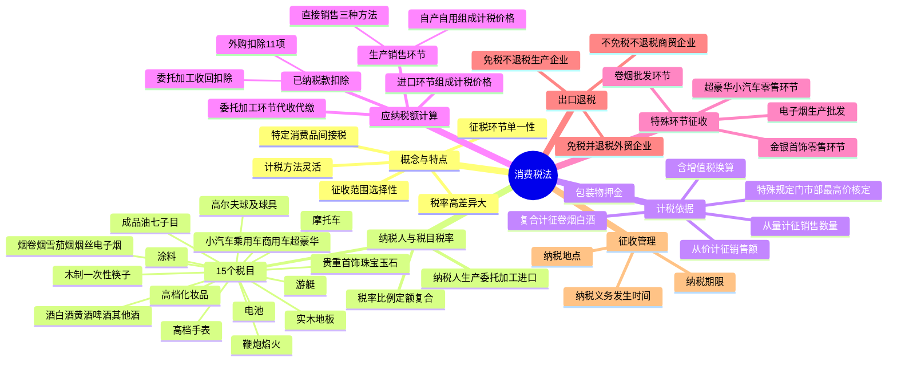

## 1. 章节定位

| 项目 | 信息 |
|------|------|
| 所属科目 | 税法 |
| 难度等级 | 3 |
| 历年分值 | 4-5 分 |
| 建议学时 | 5-6 小时 |
| 知识关联章节 | 第2章 增值税法、第4章 企业所得税法、第14章 税收征收管理法 |

## 2. 考情分析

本章是税法科目的重要税种章，与增值税共同构成流转税核心。历年分值约 4-5 分，题型覆盖客观题、计算问答题，并常在综合题中与增值税结合考查。消费税的征税范围、计税方法、已纳税款扣除、特殊环节征收是命题热点。

**命题规律**：本章考查兼具记忆与计算。高频考点包括：消费税 15 个税目的范围界定（特别是烟、酒、成品油、小汽车的子目划分）、从价定率/从量定额/复合计征三种方法的适用与计算、自产自用与委托加工的组成计税价格公式、外购及委托加工收回应税消费品已纳税款的扣除范围与计算、卷烟批发环节和超豪华小汽车零售环节的加征规定、金银首饰零售环节征税、包装物押金的税务处理、进出口退税的三种情形。

**复习建议**：本章学习应以"征税环节—税目税率—计税依据—应纳税额计算—已纳税款扣除"为主线串联各知识点。重点掌握三类组成计税价格公式（自产自用、委托加工、进口）的异同，注意复合计税公式中定额税部分需计入组成计税价格。已纳税款扣除的 11 项范围与"不得扣除"情形（金银首饰）是易错点，建议对照表格记忆。

## 3. 知识框架

## 4. 核心精讲

### 4.1 消费税的概念与特点

消费税是指对特定消费品和消费行为征收的一种间接税。消费税的征收范围具有较强的选择性，可以在保证国家财政收入的同时，调节消费行为，引导消费需求，间接调节收入分配和引导产业结构。

我国现行消费税的特点包括：

1. **征收范围具有选择性**：根据产业政策与消费政策仅选择部分消费品征税，而不是对所有消费品都征收消费税。
2. **征税环节具有单一性**：一般情况下主要在生产销售和进口环节征收（卷烟、电子烟、超豪华小汽车、金银首饰等有特殊环节规定）。
3. **平均税率水平比较高且税负差异大**：不同征税项目的税负差异较大，如乘用车按排气量大小划分，最低税率 1%，最高税率 40%。
4. **计税方法具有灵活性**：既采用从量定额计税方法，也采用从价定率计税方法，对卷烟、白酒还采用了复合计税方式。

### 4.2 纳税人

在中华人民共和国境内生产、委托加工和进口应税消费品的单位和个人，以及国务院确定的销售应税消费品的其他单位和个人，为消费税的纳税人。

- **单位**：企业、行政单位、事业单位、军事单位、社会团体及其他单位。
- **个人**：个体工商户及其他个人。
- **在中华人民共和国境内**：指生产、委托加工和进口属于应当缴纳消费税的消费品的起运地或者所在地在境内。

### 4.3 税目

目前消费税税目包括 15 种商品，部分税目还进一步划分了若干子目。

#### 4.3.1 烟

凡是以烟叶为原料加工生产的产品，不论使用何种辅料，均属于本税目征收范围。包括卷烟（进口卷烟、白包卷烟、手工卷烟和未经国务院批准纳入计划的企业及个人生产的卷烟）、雪茄烟和烟丝。

- **甲类卷烟**：每标准条（200 支）调拨价格在 70 元（不含增值税）以上（含 70 元）的卷烟。
- **乙类卷烟**：每标准条调拨价格在 70 元（不含增值税）以下的卷烟。
- **电子烟**：自 2022 年 11 月 1 日起纳入消费税征收范围，在"烟"税目下增设"电子烟"子目。电子烟是指用于产生气溶胶供人抽吸等的电子传输系统，包括烟弹、烟具以及烟弹与烟具组合销售的电子烟产品。

#### 4.3.2 酒

酒是酒精度在 1 度以上的各种酒类饮料，包括白酒、黄酒、啤酒和其他酒。

- **啤酒分类**：每吨出厂价（含包装物及包装物押金）在 3000 元（含 3000 元，不含增值税）以上的是甲类啤酒；在 3000 元（不含增值税）以下的是乙类啤酒。包装物押金不包括重复使用的塑料周转箱的押金。果啤属于啤酒，按啤酒征收消费税。
- **配制酒（露酒）**：以蒸馏酒或食用酒精为酒基，具有国食健字或卫食健字文号且酒精度低于 38 度（含）的，按"其他酒"10% 征收；以发酵酒为酒基，酒精度低于 20 度（含）的，按"其他酒"10% 征收；其他配制酒按"白酒"适用税率征收。
- **葡萄酒**：适用"酒"税目下设的"其他酒"子目。

#### 4.3.3 高档化妆品

自 2016 年 10 月 1 日起，本税目调整为包括高档美容、修饰类化妆品、高档护肤类化妆品和成套化妆品。

高档美容、修饰类化妆品和高档护肤类化妆品是指生产（进口）环节销售（完税）价格（不含增值税）在 10 元/毫升（克）或 15 元/片（张）及以上的美容、修饰类化妆品和护肤类化妆品。

舞台、戏剧、影视演员化妆用的上妆油、卸妆油、油彩，不属于本税目的征收范围。

#### 4.3.4 其他税目

| 税目 | 征收范围要点 |
|------|------|
| 贵重首饰及珠宝玉石 | 金、银、白金、宝石、珍珠、钻石等制作的各种纯金银首饰及镶嵌首饰和珠宝玉石；对出国人员免税商店销售的金银首饰征收消费税 |
| 鞭炮、焰火 | 各种鞭炮、焰火；体育上用的发令纸、鞭炮药引线不按本税目征收 |
| 成品油 | 汽油、柴油、石脑油、溶剂油、航空煤油、润滑油、燃料油 7 个子目；航空煤油暂缓征收 |
| 小汽车 | 乘用车（≤9 座）、中轻型商用客车（10-23 座）、超豪华小汽车（零售价 90 万元及以上）；沙滩车、雪地车、卡丁车、高尔夫车不征税 |
| 摩托车 | 气缸容量 250 毫升（不含）以下的小排量摩托车不征收消费税 |
| 高尔夫球及球具 | 高尔夫球、高尔夫球杆及高尔夫球包（袋）；球杆的杆头、杆身和握把属于征收范围 |
| 高档手表 | 销售价格（不含增值税）每只在 10000 元（含）以上的各类手表 |
| 游艇 | 艇身长度大于 8 米（含）小于 90 米（含），内置发动机，主要用于水上运动和休闲娱乐的机动艇 |
| 木制一次性筷子 | 各种规格的木制一次性筷子；未经打磨、倒角的也属于征税范围 |
| 实木地板 | 独板实木地板、实木指接地板、实木复合地板及实木装饰板；未经涂饰的素板也属于征税范围 |
| 电池 | 原电池、蓄电池、燃料电池、太阳能电池和其他电池；无汞原电池、锂原电池、太阳能电池等免征；铅蓄电池自 2016 年 1 月 1 日起按 4% 征收 |
| 涂料 | 施工状态下 VOC 含量低于 420 克/升（含）的涂料免征消费税 |

#### 4.3.5 成品油子目要点

- **汽油**：辛烷值不小于 66 的轻质油；甲醇汽油、乙醇汽油、烷基化油（异辛烷）属于本税目。
- **柴油**：倾点或凝点在 -50℃~30℃ 的轻质油；生物柴油属于本税目。符合条件（生产原料中废弃动植物油用量≥70%，符合 BD100 标准）的纯生物柴油免征。
- **石脑油**：除汽油、柴油、航空煤油、溶剂油以外的各种轻质油。
- **航空煤油**：暂缓征收；航天煤油参照航空煤油暂缓征收。
- **润滑油**：矿物性、植物性、动物性和化工原料合成润滑油；变压器油、导热类油等绝缘油类不属于润滑油。
- **燃料油**：重油、渣油，主要用作燃料燃烧的油品。

### 4.4 税率

消费税采用比例税率和定额税率两种形式。大部分应税消费品适用比例税率；黄酒、啤酒、成品油按单位重量或单位体积确定单位税额；卷烟、白酒采用比例税率和定额税率双重征收形式（复合计税）。

#### 4.4.1 消费税税目税率表

| 税目 | 子目 | 税率/税额 |
|------|------|------|
| 一、烟 | 1. 卷烟 |  |
|  | (1) 甲类卷烟（生产或进口环节） | 56% + 0.003 元/支 |
|  | (2) 乙类卷烟（生产或进口环节） | 36% + 0.003 元/支 |
|  | (3) 批发环节 | 11% + 0.005 元/支 |
|  | 2. 雪茄烟 | 36% |
|  | 3. 烟丝 | 30% |
|  | 4. 电子烟 | 生产（进口）环节 36%；批发环节 11% |
| 二、酒 | 1. 白酒 | 20% + 0.5 元/500 克（或 500 毫升） |
|  | 2. 黄酒 | 240 元/吨 |
|  | 3. 啤酒 | 甲类 250 元/吨；乙类 220 元/吨 |
|  | 4. 其他酒 | 10% |
| 三、高档化妆品 |  | 15% |
| 四、贵重首饰及珠宝玉石 | 金银首饰、铂金首饰、钻石及钻石饰品（零售环节） | 5% |
|  | 其他贵重首饰和珠宝玉石 | 10% |
| 五、鞭炮、焰火 |  | 15% |
| 六、成品油 | 汽油 | 1.52 元/升 |
|  | 柴油 | 1.2 元/升 |
|  | 航空煤油 | 1.2 元/升 |
|  | 石脑油 | 1.52 元/升 |
|  | 溶剂油 | 1.52 元/升 |
|  | 润滑油 | 1.52 元/升 |
|  | 燃料油 | 1.2 元/升 |
| 七、小汽车 | 乘用车（按排气量） | 1%、3%、5%、9%、12%、25%、40% |
|  | 中轻型商用客车 | 5% |
|  | 超豪华小汽车（零售环节加征） | 10% |
| 八、摩托车 | 250 毫升 | 3% |
|  | 250 毫升以上 | 10% |
| 九、高尔夫球及球具 |  | 10% |
| 十、高档手表 |  | 20% |
| 十一、游艇 |  | 10% |
| 十二、木制一次性筷子 |  | 5% |
| 十三、实木地板 |  | 5% |
| 十四、电池 |  | 4% |
| 十五、涂料 |  | 4% |

乘用车排气量与税率对应：1.0 升（含）以下 1%；1.0-1.5 升（含）3%；1.5-2.0 升（含）5%；2.0-2.5 升（含）9%；2.5-3.0 升（含）12%；3.0-4.0 升（含）25%；4.0 升以上 40%。

#### 4.4.2 兼营不同税率的处理

纳税人兼营不同税率的应税消费品，应当分别核算不同税率应税消费品的销售额、销售数量。未分别核算销售额、销售数量，或者将不同税率的应税消费品组成成套消费品销售的，**从高适用税率**。

### 4.5 计税依据

消费税应纳税额的计算分为从价计征、从量计征和从价从量复合计征三种方法。

#### 4.5.1 从价计征

应纳税额 = 应税消费品的销售额 × 适用税率。

**销售额的确定**：销售额为纳税人销售应税消费品向购买方收取的全部价款和价外费用。价外费用是指价外向购买方收取的手续费、补贴、基金、集资费、返还利润、奖励费、违约金、滞纳金、延期付款利息、赔偿金、代收款项、代垫款项、包装费、包装物租金、储备费、优质费、运输装卸费等。

**不包括的项目**：

1. 同时符合以下条件的代垫运输费用：①承运部门的运输费用发票开具给购买方的；②纳税人将该项发票转交给购买方的。
2. 同时符合以下条件代为收取的政府性基金或者行政事业性收费：①由国务院或财政部批准设立，或由国务院或省级人民政府及其财政、价格主管部门批准设立；②收取时开具省级以上财政部门印制的财政票据；③所收款项全额上缴财政。

**含增值税销售额的换算**：

> 应税消费品的销售额 = 含增值税的销售额 ÷ (1 + 增值税税率或征收率)

消费税纳税人同时是增值税一般纳税人的，适用增值税税率；是增值税小规模纳税人的，适用征收率。

#### 4.5.2 包装物押金的处理

| 情形 | 处理 |
|------|------|
| 包装物随同产品销售（不论是否单独计价） | 并入销售额征收消费税 |
| 包装物不作价随同产品销售，收取押金 | 押金不并入销售额征税 |
| 逾期未收回或收取时间超过 12 个月的押金 | 并入销售额按适用税率征税 |
| 既作价随同销售又另外收取押金，规定期限内未退还 | 并入销售额征税 |
| 销售啤酒、黄酒外的其他酒类产品收取的包装物押金 | 无论是否返还及会计如何核算，均并入当期销售额征税 |
| 白酒生产企业向商业销售单位收取的"品牌使用费" | 属于销售价款组成部分，并入白酒销售额征税 |

#### 4.5.3 从量计征

应纳税额 = 应税消费品的销售数量 × 定额税率。

销售数量的确定：

1. 销售应税消费品的，为应税消费品的销售数量。
2. 自产自用应税消费品的，为应税消费品的移送使用数量。
3. 委托加工应税消费品的，为纳税人收回的应税消费品数量。
4. 进口应税消费品的，为海关核定的应税消费品进口征税数量。

吨与升计量单位换算：黄酒 1 吨 = 962 升；啤酒 1 吨 = 988 升；汽油 1 吨 = 1388 升；柴油 1 吨 = 1176 升；航空煤油 1 吨 = 1246 升；石脑油 1 吨 = 1385 升；溶剂油 1 吨 = 1282 升；润滑油 1 吨 = 1126 升；燃料油 1 吨 = 1015 升。

#### 4.5.4 复合计征

现行消费税征税范围中，只有卷烟、白酒采用复合计征方法。

> 应纳税额 = 应税销售数量 × 定额税率 + 应税销售额 × 比例税率

生产销售卷烟、白酒从量定额计税依据为实际销售数量；进口、委托加工、自产自用卷烟、白酒从量定额计税依据分别为海关核定的进口征税数量、委托方收回数量、移送使用数量。

#### 4.5.5 计税依据的特殊规定

1. **自设非独立核算门市部**：纳税人通过自设非独立核算门市部销售的自产应税消费品，应当按照门市部对外销售额或者销售数量征收消费税。

2. **换取生产资料、投资入股、抵偿债务**：纳税人用于换取生产资料和消费资料、投资入股和抵偿债务等方面的应税消费品，应当以纳税人同类应税消费品的**最高销售价格**作为计税依据计算消费税。

3. **卷烟计税价格的核定**：卷烟消费税最低计税价格核定范围为卷烟生产企业在生产环节销售的所有牌号、规格的卷烟。核定公式：
   > 某牌号、规格卷烟计税价格 = 批发环节销售价格 × (1 − 适用批发毛利率)

4. **白酒最低计税价格的核定**：白酒生产企业销售给销售单位的白酒，生产企业消费税计税价格低于销售单位对外销售价格（不含增值税）70% 以下的，税务机关应核定消费税最低计税价格。自 2017 年 5 月 1 日起，核定比例由 50%-70% 统一调整为 60%。已核定最低计税价格的白酒，生产企业实际销售价格高于最低计税价格的，按实际销售价格申报纳税；低于最低计税价格的，按最低计税价格申报纳税。

5. **金银首饰销售额的确定**：既销售金银首饰又销售非金银首饰的单位，应分别核算销售额；划分不清或不能分别核算的，在生产环节销售的从高适用税率，在零售环节销售的按金银首饰征收消费税。采用以旧换新方式销售的金银首饰，按实际收取的不含增值税全部价款确定计税依据。

### 4.6 应纳税额的计算

#### 4.6.1 生产销售环节应纳消费税的计算

**（1）直接对外销售**

- 从价定率：应纳税额 = 应税消费品的销售额 × 比例税率
- 从量定额：应纳税额 = 应税消费品的销售数量 × 定额税率
- 复合计征：应纳税额 = 应税消费品的销售数量 × 定额税率 + 应税消费品的销售额 × 比例税率

**（2）自产自用应税消费品**

自产自用是指纳税人生产应税消费品后，不是用于直接对外销售，而是用于自己连续生产应税消费品或用于其他方面。

- **用于连续生产应税消费品**：不纳税。如卷烟厂生产出烟丝，再用烟丝连续生产卷烟，烟丝不用缴纳消费税。
- **用于其他方面**：于移送使用时纳税。用于其他方面是指用于生产非应税消费品、在建工程、管理部门、非生产机构、提供劳务，以及用于馈赠、赞助、集资、广告、样品、职工福利、奖励等。

**组成计税价格及税额的计算**：凡用于其他方面应当纳税的，按照纳税人生产的同类消费品的销售价格计算纳税；没有同类消费品销售价格的，按照组成计税价格计算纳税。

从价定率办法：

> 组成计税价格 = (成本 + 利润) ÷ (1 − 比例税率)
> 应纳税额 = 组成计税价格 × 比例税率

复合计税办法：

> 组成计税价格 = (成本 + 利润 + 自产自用数量 × 定额税率) ÷ (1 − 比例税率)
> 应纳税额 = 组成计税价格 × 比例税率 + 自产自用数量 × 定额税率

其中"利润"是指根据应税消费品的全国平均成本利润率计算的利润。主要应税消费品全国平均成本利润率：甲类卷烟 10%、乙类卷烟 5%、雪茄烟 5%、烟丝 5%、粮食白酒 10%、薯类白酒 5%、其他酒 5%、高档化妆品 5%、贵重首饰及珠宝玉石 6%、鞭炮焰火 5%、摩托车 6%、高尔夫球及球具 10%、高档手表 20%、游艇 10%、木制一次性筷子及实木地板 5%、电池 4%、乘用车 8%、中轻型商用客车 5%、电子烟 10%、涂料 7%。

#### 4.6.2 委托加工环节应纳消费税的计算

**委托加工的确定**：委托加工的应税消费品是指由委托方提供原料和主要材料，受托方只收取加工费和代垫部分辅助材料加工的应税消费品。对于由受托方提供原材料生产的，或受托方先将原材料卖给委托方然后再接受加工的，以及由受托方以委托方名义购进原材料生产的，不得作为委托加工应税消费品，应按销售自制应税消费品缴纳消费税。

**代收代缴税款的规定**：委托加工的应税消费品，由受托方（受托方是个人的除外）在向委托方交货时代收代缴消费税。委托个人（含个体工商户）加工的，由委托方收回后缴纳。委托方将收回的应税消费品以不高于受托方计税价格出售的，为直接出售，不再缴纳消费税；以高于受托方计税价格出售的，需按规定申报缴纳消费税，计税时准予扣除受托方已代收代缴的消费税。

**组成计税价格及应纳税额的计算**：按照受托方的同类消费品的销售价格计算纳税；没有同类消费品销售价格的，按照组成计税价格计算纳税。

从价定率办法：

> 组成计税价格 = (材料成本 + 加工费) ÷ (1 − 比例税率)

复合计税办法：

> 组成计税价格 = (材料成本 + 加工费 + 委托加工数量 × 定额税率) ÷ (1 − 比例税率)

- **材料成本**：委托方所提供加工材料的实际成本。委托方必须在委托加工合同上如实注明材料成本，未提供的，受托方所在地主管税务机关有权核定。
- **加工费**：受托方加工应税消费品向委托方所收取的全部费用（包括代垫辅助材料的实际成本，不包括增值税税金）。

#### 4.6.3 进口环节应纳消费税的计算

进口的应税消费品，于报关进口时缴纳消费税，由海关代征。纳税人应当自海关填发海关进口消费税专用缴款书之日起 15 日内缴纳税款。进口环节消费税除国务院另有规定外，一律不得给予减税、免税。

从价定率：

> 组成计税价格 = (关税计税价格 + 关税) ÷ (1 − 消费税比例税率)
> 应纳税额 = 组成计税价格 × 消费税比例税率

从量定额：

> 应纳税额 = 应税消费品数量 × 消费税定额税率

复合计税：

> 组成计税价格 = (关税计税价格 + 关税 + 数量 × 定额税率) ÷ (1 − 比例税率)
> 应纳税额 = 组成计税价格 × 消费税税率 + 应税消费品进口数量 × 消费税定额税率

#### 4.6.4 已纳消费税扣除的计算

为避免重复征税，外购应税消费品和委托加工收回的应税消费品连续生产应税消费品销售的，可将已缴纳的消费税给予扣除。

**（1）外购应税消费品已纳税款的扣除**

按当期生产领用数量计算准予扣除。扣除范围（11 项）：

1. 外购已税烟丝生产的卷烟。
2. 外购已税高档化妆品为原料生产的高档化妆品。
3. 外购已税珠宝玉石为原料生产的贵重首饰及珠宝玉石。
4. 外购已税鞭炮、焰火为原料生产的鞭炮、焰火。
5. 外购已税杆头、杆身和握把为原料生产的高尔夫球杆。
6. 外购已税木制一次性筷子为原料生产的木制一次性筷子。
7. 外购已税实木地板为原料生产的实木地板。
8. 外购已税汽油、柴油、石脑油、燃料油、润滑油为原料连续生产的应税成品油。
9. 外购已税葡萄酒连续生产应税葡萄酒（自 2015 年 5 月 1 日起）。

计算公式：

> 当期准予扣除的外购应税消费品已纳税款 = 当期准予扣除的外购应税消费品买价 × 外购应税消费品适用税率
> 当期准予扣除的外购应税消费品买价 = 期初库存外购应税消费品买价 + 当期购进的应税消费品买价 − 期末库存的外购应税消费品买价

**不得扣除情形**：纳税人用外购的已税珠宝玉石生产的改在零售环节征收消费税的金银首饰（镶嵌首饰），在计税时一律不得扣除外购珠宝玉石的已纳税款。

**（2）委托加工收回的应税消费品已纳税款的扣除**

委托方收回货物后用于连续生产应税消费品的，其已纳税款准予按规定从连续生产的应税消费品应纳消费税税额中抵扣，按当期生产领用数量计算扣除。扣除范围与外购扣除范围一致（11 项）。同样，用委托加工收回的已税珠宝玉石生产的改在零售环节征收消费税的金银首饰，不得扣除委托加工收回的珠宝玉石的已纳消费税税款。

计算公式：

> 当期准予扣除的委托加工应税消费品已纳税款 = 期初库存的委托加工应税消费品已纳税款 + 当期收回的委托加工应税消费品已纳税款 − 期末库存的委托加工应税消费品已纳税款

### 4.7 特殊商品及环节消费税的征收

#### 4.7.1 电子烟生产、批发环节

- **纳税人**：生产（进口）、批发电子烟的单位和个人。通过代加工方式生产电子烟的，由持有商标的企业缴纳消费税，只从事代加工电子烟产品业务的企业不属于纳税人。
- **税率**：生产（进口）环节 36%；批发环节 11%。
- **计税价格**：按生产、批发电子烟的销售额计算纳税；采用代销方式的，按经销商（代理商）销售给电子烟批发企业的销售额计算纳税；进口的按组成计税价格计算纳税。
- **代加工核算**：电子烟生产环节纳税人从事代加工业务的，应分开核算持有商标电子烟的销售额和代加工电子烟的销售额，未分开核算的一并缴纳消费税。

#### 4.7.2 卷烟批发环节

自 2009 年 5 月 1 日起在卷烟批发环节加征一道从价税，自 2015 年 5 月 10 日起调整税率。

- **纳税人**：在中华人民共和国境内从事卷烟批发业务的单位和个人。纳税人销售给纳税人以外的单位和个人的卷烟于销售时纳税；纳税人之间销售的卷烟不缴纳消费税。
- **征收范围**：纳税人批发销售的所有牌号、规格的卷烟。
- **税率**：从价税 11% + 从量税 0.005 元/支。
- **计税依据**：纳税人批发卷烟的销售额（不含增值税）、销售数量。未将卷烟销售额与其他商品销售额分开核算的，一并征收消费税；兼营批发和零售业务未分别核算的，按全部销售额、销售数量计征批发环节消费税。
- **重要规定**：卷烟消费税在生产和批发两个环节征收后，批发企业在计算纳税时**不得扣除**已含的生产环节的消费税税款。总机构与分支机构不在同一地区的，由总机构申报纳税。

#### 4.7.3 超豪华小汽车零售环节

自 2016 年 12 月 1 日起，对超豪华小汽车在零售环节再加征一道消费税。根据《财政部 税务总局关于调整超豪华小汽车消费税政策的公告》（2025 年第 3 号）：

- **征税范围**：自 2025 年 7 月 20 日起，调整为每辆零售价格 90 万元（不含增值税）及以上的各种动力类型（含纯电动、燃料电池等）的乘用车和中轻型商用客车。对纯电动、燃料电池等没有气缸容量的超豪华小汽车仅在零售环节征收消费税。
- **纳税人**：将超豪华小汽车销售给消费者的单位和个人。
- **税率**：10%。
- **应纳税额**：零售环节销售额（不含增值税）× 10%。零售环节销售额包括以精品、配饰和服务等名义收取的价款。
- **国内汽车生产企业直接销售给消费者**：消费税税率按照生产环节税率和零售环节税率加总计算。
  > 应纳税额 = 销售额（不含增值税）× (生产环节税率 + 零售环节税率)
- **二手超豪华小汽车**：自 2025 年 7 月 20 日起，销售二手超豪华小汽车不征收消费税。

#### 4.7.4 金银首饰零售环节

自 1995 年 1 月 1 日起，金银首饰消费税由生产销售环节改为零售环节征收。改在零售环节征收的仅限于金基、银基合金首饰以及金、银和金基、银基合金的镶嵌首饰，进口环节暂不征收，零售环节适用税率为 5%。在纳税人销售金银首饰、铂金饰品、钻石及钻石饰品时征收。

### 4.8 消费税出口退税

对纳税人出口应税消费品，免征消费税；国务院另有规定的除外。分三种情形：

| 情形 | 适用企业 | 政策 |
|------|------|------|
| 出口免税并退税 | 有出口经营权的外贸企业购进直接出口，及外贸企业受其他外贸企业委托代理出口 | 退还已征消费税 |
| 出口免税但不退税 | 有出口经营权的生产性企业自营出口或委托外贸企业代理出口自产应税消费品 | 免征生产环节消费税，不退税 |
| 出口不免税也不退税 | 一般商贸企业委托外贸企业代理出口 | 不予退（免）税 |

消费税应退税额计算：从价定率的，为退税计税依据 × 比例税率；从量定额的，为退税计税依据 × 定额税率；复合计征的，分别按从价定率和从量定额计算。

### 4.9 征收管理

#### 4.9.1 征税环节

| 环节 | 内容 |
|------|------|
| 生产销售环节 | 消费税征收的主要环节；换取生产资料、消费资料、投资入股、偿还债务及用于其他方面均应缴纳 |
| 委托加工环节 | 由受托方代收代缴；收回后连续生产应税消费品的，加工环节税款可扣除 |
| 进口环节 | 由海关代征 |
| 零售环节 | 金银首饰、铂金饰品、钻石及钻石饰品；超豪华小汽车 |
| 移送使用环节 | 自产自用（非连续生产应税消费品）于移送使用环节征收 |
| 批发环节 | 卷烟、电子烟在生产销售环节外，另在批发环节征收 |

工业企业以外的单位和个人的下列行为视为应税消费品的生产行为，按规定征收消费税：①将外购的消费税非应税产品以消费税应税产品对外销售的；②将外购的消费税低税率应税产品以高税率应税产品对外销售的。

#### 4.9.2 纳税义务发生时间

| 结算方式/行为 | 纳税义务发生时间 |
|------|------|
| 赊销和分期收款 | 书面合同约定的收款日期当天；无约定或无书面合同的，为发出应税消费品当天 |
| 预收货款 | 发出应税消费品当天 |
| 托收承付和委托银行收款 | 发出应税消费品并办妥托收手续当天 |
| 其他结算方式 | 收讫销售款或取得索取销售款凭据当天 |
| 自产自用 | 移送使用当天 |
| 委托加工 | 纳税人提货当天 |
| 进口 | 报关进口当天 |

#### 4.9.3 纳税期限

消费税纳税期限分别为 1 日、3 日、5 日、10 日、15 日、1 个月或者 1 个季度。

- 以 1 个月或 1 个季度为 1 个纳税期的，自期满之日起 15 日内申报纳税。
- 以 1 日、3 日、5 日、10 日或 15 日为 1 个纳税期的，自期满之日起 5 日内预缴税款，于次月 1 日起 15 日内申报纳税并结清上月应纳税款。
- 进口应税消费品，自海关填发海关进口消费税专用缴款书之日起 15 日内缴纳税款。

#### 4.9.4 纳税地点

1. 纳税人销售的应税消费品及自产自用的应税消费品，应当向纳税人机构所在地或者居住地的主管税务机关申报纳税。
2. 委托加工的应税消费品，除受托方为个人外，由受托方向机构所在地或者居住地的主管税务机关解缴消费税税款。
3. 进口的应税消费品，由进口人或者其代理人向报关地海关申报纳税。
4. 纳税人到外县（市）销售或委托外县（市）代销自产应税消费品的，于应税消费品销售后向机构所在地或者居住地主管税务机关申报纳税。
5. 总机构与分支机构不在同一县（市）但在同一省（自治区、直辖市）范围内的，经省级财政厅（局）、税务局审批同意，可由总机构汇总向总机构所在地主管税务机关申报缴纳。

## 5. 典型例题

### 例 1：从价定率计算（高档化妆品）

某化妆品生产企业为增值税一般纳税人。2023 年 6 月 15 日向某大型商场销售高档化妆品一批，开具增值税专用发票，取得不含增值税销售额 50 万元，增值税税额 6.5 万元；6 月 20 日向某单位销售高档化妆品一批，开具普通发票，取得含增值税销售额 4.64 万元。已知高档化妆品适用消费税税率 15%。计算该化妆品生产企业上述业务应纳消费税税额。

**解答**：

1. 化妆品的应税销售额 = 50 + 4.64 ÷ (1 + 13%) = 54.11（万元）
2. 应纳消费税税额 = 54.11 × 15% = 8.12（万元）

### 例 2：从量定额计算（啤酒）

某啤酒厂 2023 年 5 月销售啤酒 1000 吨，取得不含增值税销售额 295 万元，增值税税款 38.35 万元，另收取包装物押金 23.4 万元。计算该啤酒厂应纳消费税税额。

**解答**：

每吨啤酒出厂价 = (295 + 23.4 ÷ 1.13) × 10000 ÷ 1000 = 3157.08（元），大于 3000 元，属于销售甲类啤酒，适用定额税率每吨 250 元。

应纳消费税税额 = 销售数量 × 定额税率 = 1000 × 250 = 250000（元）

### 例 3：复合计税计算（白酒）

某白酒生产企业为增值税一般纳税人，2023 年 4 月销售白酒 50 吨，取得不含增值税的销售额 200 万元。白酒适用比例税率 20%，定额税率每 500 克 0.5 元。计算白酒生产企业 4 月应缴纳的消费税税额。

**解答**：

应纳消费税税额 = 50 × 2000 × 0.00005 + 200 × 20% = 5 + 40 = 45（万元）

（注：50 吨 = 50 × 2000 × 500 克；定额税 = 50 × 2000 × 0.5 ÷ 10000 = 5 万元）

### 例 4：自产自用组成计税价格（高档化妆品）

某化妆品公司将一批自产的高档化妆品用作职工福利，该批高档化妆品的成本为 80000 元，无同类产品市场销售价格，但已知其成本利润率为 5%，消费税税率为 15%。计算该批高档化妆品应纳消费税税额。

**解答**：

1. 组成计税价格 = 成本 × (1 + 成本利润率) ÷ (1 − 消费税税率) = 80000 × (1 + 5%) ÷ (1 − 15%) = 98823.53（元）
2. 应纳消费税税额 = 98823.53 × 15% = 14823.53（元）

### 例 5：委托加工组成计税价格（鞭炮）

某鞭炮企业 2023 年 4 月受托为某单位加工一批鞭炮，委托单位提供的原材料金额为 60 万元；收取委托单位不含增值税的加工费为 8 万元，鞭炮企业无同类产品市场价格。鞭炮的适用税率为 15%。计算鞭炮企业应代收代缴的消费税。

**解答**：

1. 组成计税价格 = (材料成本 + 加工费) ÷ (1 − 比例税率) = (60 + 8) ÷ (1 − 15%) = 80（万元）
2. 应代收代缴的消费税 = 80 × 15% = 12（万元）

### 例 6：进口环节组成计税价格（从价定率）

某商贸公司 2023 年 5 月从国外进口一批应税消费品，已知该批应税消费品的关税计税价格为 90 万元，按规定应缴纳关税 18 万元，假定进口的应税消费品的消费税税率为 10%。计算该批消费品进口环节应纳消费税税额。

**解答**：

1. 组成计税价格 = (关税计税价格 + 关税) ÷ (1 − 消费税比例税率) = (90 + 18) ÷ (1 − 10%) = 120（万元）
2. 应纳消费税税额 = 120 × 10% = 12（万元）

### 例 7：外购已纳税款扣除（烟丝）

某卷烟生产企业，某月初库存外购应税烟丝金额 50 万元，当月又外购应税烟丝金额 500 万元（不含增值税），月末库存烟丝金额 30 万元，其余被当月生产卷烟领用。烟丝适用的消费税税率为 30%。计算卷烟厂当月准许扣除的外购烟丝已缴纳的消费税税额。

**解答**：

1. 当期准许扣除的外购烟丝买价 = 50 + 500 − 30 = 520（万元）
2. 当月准许扣除的外购烟丝已缴纳的消费税税额 = 520 × 30% = 156（万元）

### 例 8：电子烟生产环节计税

某电子烟消费税纳税人 2022 年 12 月生产持有商标的电子烟产品并销售给电子烟批发企业，不含增值税销售额为 100 万元。计算该纳税人 2023 年 1 月应申报缴纳的电子烟消费税。

**解答**：

应纳消费税 = 100 × 36% = 36（万元）

若该纳税人委托经销商（代理商）销售同一电子烟产品，经销商销售给电子烟批发企业不含增值税销售额为 110 万元，则应纳消费税 = 110 × 36% = 39.6（万元）。

## 6. 记忆口诀

1. **消费税特点四字诀**：选择性、单一性、高差异、灵活性——征收范围有选择，征税环节较单一，税率水平高差异，计税方法多灵活。

2. **15 个税目顺口溜**：烟酒妆，首饰鞭，成品油，小汽车；摩托高尔夫，手表游艇筷；木地板，电池涂料全。十五税目要记全。

3. **复合计税两品类**：卷烟白酒复合征，比例加定额，组成计税价要算定额部分。

4. **组成计税价格三公式**：自产自用"成本加利润"，委托加工"材料加加工"，进口环节"关税价加关税"；复合计税再加"数量乘定额"，全部除以"一减比例税率"。

5. **包装物押金口诀**：一般押金逾期并（12 个月），酒类（除啤酒黄酒）押金当期并，啤酒黄酒押金从量不并价。

6. **最高价计税三情形**：换（换取生产/消费资料）、投（投资入股）、抵（抵偿债务）——三情形用最高价。

7. **已纳税款扣除范围**：烟丝、化妆品、珠宝玉石、鞭炮焰火、高尔夫杆头杆身握把、木筷、实木地板、成品油（汽油柴油石脑油燃料油润滑油）、葡萄酒——"九大类"可扣；珠宝玉石做金银首饰不得扣。

8. **委托加工三特征**：委托方提供原料主料，受托方只收加工费代垫辅料，受托方交货时代收代缴。

9. **卷烟批发环节四要点**：税率 11% 加 0.005 元/支；纳税人之间销售不征；不得扣除生产环节税款；总机构申报纳税。

10. **超豪华小汽车零售环节**：90 万（不含税）及以上，零售环节 10%，2025 年 7 月 20 日起含纯电动燃料电池；二手车不征。

11. **金银首饰零售环节**：5% 税率，金基银基合金及镶嵌，进口环节暂不征。

12. **纳税义务发生时间口诀**：赊销分期看合同，预收货款看发出，托收承付办妥托收，自产自用看移送，委托加工看提货，进口看报关。

13. **纳税期限口诀**：1、3、5、10、15 日、1 月、1 季；月季 15 日内申报，日份 5 日内预缴次月 15 日结清；进口 15 日内缴纳。

14. **出口退税三情形**：外贸企业免税又退税，生产企业免税不退税，商贸企业不免不退税。

15. **兼营税率从高规则**：兼营不同税率未分别核算，或组成成套消费品销售，一律从高适用税率。

## 7. 同步练习

**1.（单选题）** 下列产品中，属于消费税征税范围的是（　）。

A. 卡丁车
B. 烷基化油
C. 医用酒精
D. 电动汽车

**2.（单选题）** 下列消费品中，暂缓征收消费税的是（　）。

A. 润滑油
B. 石脑油
C. 燃料油
D. 航天煤油

**3.（单选题）** 下列关于消费税的计税依据，表述正确的是（　）。

A. 委托加工啤酒从量定额的计税依据为委托方收回数量
B. 通过非独立核算门市部销售自产应税消费品时，应按移送给非独立核算门市部时的销售额或数量计征消费税
C. 电子烟生产环节纳税人采用代销方式销售电子烟的，按照生产环节销售电子烟平均销售额征收消费税
D. 纳税人将不同税率的应税消费品组成成套消费品销售的，按照各自税率征收消费税

**4.（单选题）** 下列消费品中，应在零售环节征收消费税的是（　）。

A. 卷烟
B. 钻石
C. 白酒
D. 镀金首饰

**5.（单选题）** 下列各项业务中，应当征收消费税的是（　）。

A. 批发商批发销售的雪茄烟
B. 商店销售高档手表
C. 进口电子烟
D. 生产符合标准的纯生物柴油

**6.（单选题）** 下列纳税人自产自用的应税消费品，于移送使用时既要缴纳增值税又要缴纳消费税的是（　）。

A. 纳税人将自产高档香水用于连续生产高档化妆品
B. 纳税人将自产烟丝用于连续生产卷烟
C. 纳税人将自产摩托车（气缸容量250ml）赠送给摩托车拉力赛赛手
D. 纳税人外购轮胎用于连续生产小汽车

**7.（单选题）** 某酒厂2024年11月份生产销售散装黄酒400吨，每吨不含税售价3800元。同时该厂生产一种新的粮食白酒2吨，并赠送给客户，已知该种白酒无同类产品出厂价，生产成本每吨35000元，成本利润率为 $10\%$。该厂当月应缴纳的消费税为（　）元。（黄酒消费税单位税额每吨240元）

A. 88000
B. 117750
C. 111625
D. 102766.67

**8.（单选题）** 某金店为增值税一般纳税人，2025年2月零售金银首饰取得含税销售额51.48万元，其中包括以旧换新销售金银首饰实际收取的含税销售额3.51万元，该批以旧换新销售的新金银首饰零售价为8.19万元，金银首饰消费税税率为 $5\%$。2025年2月该金店此笔业务应纳消费税为（　）万元。

A. 2.20
B. 2.28
C. 2.55
D. 2.57

**9.（单选题）** 下列外购商品中已缴纳的消费税，可以从本企业应纳消费税税额中扣除的是（　）。

A. 购进已税葡萄酒连续生产的葡萄酒
B. 购进已税酒精为原料生产的勾兑白酒
C. 购进已税溶剂油为原料生产的溶剂油
D. 购进已税轮胎为原料生产的摩托车

**10.（单选题）** 某市高尔夫球具生产企业2024年9月1日以分期收款方式销售一批球杆，价税合计为140.4万元，合同约定于9月5日、11月5日各支付 $50\%$ 货款，9月5日按照约定收到 $50\%$ 价款，但并未给客户开具发票，已知高尔夫球具的消费税税率为 $10\%$。该企业9月就该项业务应缴纳的消费税为（　）万元。

A. 0
B. 6.05
C. 6.21
D. 14.04

**11.（单选题）** 下列关于超豪华小汽车的说法中，错误的是（　）。

A. 每辆零售价格130万元（不含增值税）及以上的乘用车和中轻型商用客车属于超豪华小汽车
B. 将超豪华小汽车销售给消费者的单位和个人为超豪华小汽车零售环节的纳税人
C. 国内汽车生产企业直接销售给消费者的超豪华小汽车，消费税税率按照生产环节税率和零售环节税率加总计算消费税
D. 超豪华小汽车零售环节加征的消费税税率为 $15\%$

**12.（单选题）** 甲白酒生产企业为增值税一般纳税人，下设一单独核算的销售公司，2024年12月将120吨白酒销售给该销售公司，每吨售价为5000元，该销售公司对外的销售价格为9000元/吨，税务机关核定的最低计税价格为每吨5400元，甲白酒生产企业当月应纳消费税为（　）元。（以上价格均为不含税价格）

A. 360000
B. 240000
C. 249600
D. 336000

**13.（单选题）** 某日化厂将新研制的高档化妆品与普通护肤护发品组成化妆品礼品盒，其中，高档化妆品的生产成本为100元/套，普通护肤护发品的生产成本为60元/套。2024年10月将120套化妆品礼品盒奖励给职工，当期无同类礼品盒销售价格，高档化妆品的成本利润率为 $5\%$，消费税税率为 $15\%$。该日化厂上述业务应缴纳消费税为（　）元。

A. 3557.65
B. 5400
C. 2223.52
D. 8460

**14.（单选题）** 某酒厂（增值税一般纳税人）主要生产粮食白酒、啤酒、黄酒等酒品。2024年8月发生下列经济业务：8月8日销售粮食白酒一批，取得不含税销售额200000元，同时收取包装物押金22600元；8月18日销售啤酒一批，取得不含税销售额150000元，同时收取包装物押金56500元；8月28日，没收已逾期一年的啤酒、黄酒包装物押金45200元。该酒厂当月包装物押金收入应缴纳消费税为（　）元。

A. 4000
B. 14000
C. 12000
D. 22000

**15.（单选题）** 甲企业为烟草批发企业，2025年3月批发销售一批电子烟600盒，每盒电子烟不含税销售额为1500元，同时批发给卷烟批发商80箱卷烟，取得含税销售额为256万元，则甲企业3月份应缴纳的消费税为（　）万元。（电子烟批发环节消费税税率为 $11\%$）

A. 9.90
B. 34.82
C. 10
D. 9.60

**16.（单选题）**（2024年）生产销售下列商品，应缴纳消费税的是（　）。

A. 挥发性有机物（VOC）含量360克/升的涂料
B. 汽缸容量125毫升的摩托车
C. 不含税售价8000元/块的手表
D. 不含税售价20元/毫升的香水

**17.（单选题）**（2024年）纳税人发生的下列行为中，应同时缴纳增值税和消费税的是（　）。

A. 卷烟厂将自产烟丝用于连续生产卷烟
B. 石化工厂将自产柴油用于本厂基建设备
C. 酒厂将自产白酒用于生产白酒风味糖果
D. 汽车厂将自产燃油小汽车无偿赠送客户

**18.（单选题）**（2024年）下列关于电子烟消费税征收管理的表述中，符合税法规定的是（　）。

A. 纳税人进口电子烟按关税计税价格计算征收
B. 纳税人出口电子烟适用出口退（免）税政策
C. 通过边民互市方式进口电子烟免征消费税
D. 电子烟消费税采用复合计税方式计算征收

**19.（单选题）**（2023年）下列选项中，征收消费税的是（　）。

A. 高尔夫车
B. 电动汽车
C. 燃料电池
D. 铅蓄电池

**20.（单选题）**（2023年）纳税人进口应税消费品，其消费税纳税义务发生时间是（　）。

A. 收到结算凭证的当天
B. 报关进口的当天
C. 境外起运的当天
D. 支付货款的当天

**21.（单选题）**（2022年）销售下列酒类产品而收取的包装物押金，无论是否单独作价，均应并入当期销售额缴纳消费税的是（　）。

A. 黄酒
B. 甲类啤酒
C. 乙类啤酒
D. 葡萄酒

**22.（单选题）**（2022年）2024年9月，某手表生产企业销售手表1000块，其中不含税销售单价为1.2万元、5000元各500块，另外每块手表收取0.03万元的包装费，已知高档手表的消费税税率为 $20\%$。该手表生产企业当月应缴纳消费税为（　）万元。

A. 120
B. 122.65
C. 170
D. 175.3

**23.（单选题）**（2021年）企业发生的下列经营行为中，应同时缴纳增值税和消费税的是（　）。

A. 连锁超市零售卷烟
B. 4S店销售大型商用客车
C. 食品加工厂将自产啤酒用于生产熟食制品
D. 百货公司零售金基首饰

**24.（单选题）**（2021年）某高尔夫球具生产企业发生的下列业务中，应缴纳消费税的是（　）。

A. 将自产高尔夫球杆赠送给客户用于市场推广
B. 将外购高尔夫球包用于少年高尔夫球比赛奖励
C. 将自产高尔夫球用于产品质量检测
D. 将外购的高尔夫球杆握把用于生产高尔夫球杆

**25.（单选题）** 下列应税消费品中，除了在生产销售环节征收消费税外，还应在零售环节征收消费税的是（　）。

A. 卷烟
B. 超豪华小汽车
C. 高档手表
D. 高档化妆品

**26.（单选题）** 下列产品中，在计算缴纳消费税时准许扣除外购应税消费品已纳消费税的是（　）。

A. 外购已税烟丝连续生产的卷烟
B. 外购已税高档手表生产的高档手表
C. 外购已税溶剂油生产的应税涂料
D. 外购已税游艇生产的应税游艇

**27.（单选题）** 下列出口应税消费品的行为中，适用消费税免税不退税政策的是（　）。

A. 有出口经营权的酒厂出口自产白酒
B. 商业批发企业委托外贸企业代理出口卷烟
C. 外贸企业受其他外贸企业委托代理出口实木地板
D. 有出口经营权的外贸企业购进高档化妆品直接出口

**28.（单选题）** 下列关于消费税征收管理的表述中，正确的是（　）。

A. 纳税人进口应税消费品的，应当自海关填发海关进口消费税专用缴款书之日起15日内缴纳税款
B. 消费税收入分别入中央库和地方库
C. 委托个体工商户加工应税消费品应纳的消费税由受托方代扣向其所在地主管税务机关申报缴纳
D. 消费税纳税人总分支机构在同一地级市但不同县的，由市级税务机关审批同意后可汇总缴纳消费税

**29.（多选题）** 下列属于消费税纳税人的有（　）。

A. 超豪华小汽车的生产销售商
B. 销售卷烟的零售商店
C. 加工应税消费品的受托方
D. 零售金银首饰的商城

**30.（多选题）** 下列各项属于消费税征税范围的有（　）。

A. 铅蓄电池
B. 石脑油
C. 变压器油
D. 翡翠首饰

**31.（多选题）** 纳税人发生的下列行为中，应征收消费税的有（　）。

A. 白酒厂将自产的白酒赠送给客户
B. 葡萄酒厂将自产的葡萄酒用于连续生产酒心巧克力
C. 化妆品厂将自产的高档化妆品作为福利发给职工
D. 汽车制造厂将自产的小汽车用于工厂内部的行政部门

**32.（多选题）** 下列应税消费品中，属于复合计征消费税的有（　）。

A. 卷烟
B. 白酒
C. 电子烟
D. 黄酒

**33.（多选题）** 下列情形的应税消费品，以纳税人同类应税消费品的最高销售价格作为计税依据计算消费税的有（　）。

A. 用于抵债的应税消费品
B. 用于馈赠的应税消费品
C. 用于换取消费资料的应税消费品
D. 对于分配给股东的应税消费品

**34.（多选题）** 关于以下外购商品中已缴纳的消费税，不可以从本企业应纳消费税中扣除的有（　）。

A. 购进已税白酒为原料生产的药酒
B. 从工业企业购进已税柴油为原料生产的生物柴油
C. 外购已税玉石用于镶嵌纯金戒指
D. 从工业企业购进已税溶剂油为原料生产的溶剂油

**35.（多选题）** 根据现行消费税的规定，下列说法正确的有（　）。

A. 纳税人销售金银首饰，计税依据为含增值税的销售额
B. 金银首饰连同包装物销售，计税依据为含包装物金额的销售额
C. 带料加工金银首饰，计税依据为受托方收取的加工费
D. 以旧换新销售金银首饰，计税依据为实际收取的不含增值税销售额

**36.（多选题）** 甲企业从境外进口一批高档化妆品，下列关于该业务征缴消费税的表述中，正确的有（　）。

A. 甲企业应向报关地海关申报缴纳消费税
B. 甲企业应当自海关填发进口消费税专用缴款书之日起15日内缴纳税款
C. 海关代征的消费税应分别入中央库和地方库
D. 甲企业使用该进口已税高档化妆品生产高档化妆品准许扣除进口环节缴纳的消费税

**37.（多选题）** 下列企业出口应税消费品不得办理消费税退税的有（　）。

A. 外贸单位从生产企业收购后出口的应税消费品
B. 外商投资生产企业自营出口自产应税消费品
C. 外贸企业受商贸企业的委托出口应税消费品
D. 生产单位委托外贸企业出口自产应税消费品

**38.（多选题）** 下列行为视为消费税中应税消费品的生产行为的有（　）。

A. 商场将外购的非应税消费品以消费税应税产品对外销售
B. 商场将外购的消费税低税率应税产品以高税率应税产品对外销售
C. 加工企业受托加工应税消费品
D. 商场翻新改制金银首饰

**39.（多选题）** 下列关于消费税征税环节的表述，正确的有（　）。

A. 生产企业将超豪华小汽车直接销售给消费者，仅缴纳生产环节的消费税
B. 镀金首饰在零售环节征收消费税
C. 经营单位进口金银首饰无需缴纳进口环节消费税
D. 卷烟批发商将卷烟销售给零售商，复合计征消费税

**40.（多选题）** 下列各项中，符合消费税纳税地点规定的有（　）。

A. 进口应税消费品的，由进口人或其代理人向报关地海关申报纳税
B. 卷烟批发企业的机构所在地，总机构与分支机构不在同一地区的，由总机构申报纳税
C. 委托加工应税消费品的，一律由委托方向受托方所在地主管税务机关申报纳税
D. 纳税人到外县销售自产应税消费品的，应向机构所在地或者居住地主管税务机关申报纳税

**41.（多选题）** 下列关于消费税纳税义务发生时间的说法，正确的有（　）。

A. 纳税人委托加工的应税消费品，其纳税义务的发生时间，为纳税人提货的当天
B. 纳税人进口的应税消费品，其纳税义务的发生时间，为报关进口的当天
C. 纳税人采取赊销和分期收款结算方式销售应税消费品的，其纳税义务的发生时间，为实际收款日期的当天
D. 纳税人采取预收货款结算方式销售应税消费品的，其纳税义务的发生时间，为发出应税消费品的当天

**42.（多选题）**（2024年）下列税目中，属于成品油消费税税目的有（　）。

A. 燃料油
B. 重芳烃
C. 变压器油
D. 润滑油

**43.（多选题）**（2023年）下列消费品中，在零售环节应征收消费税的有（　）。

A. 石脑油
B. 超豪华小汽车
C. 汽油
D. 金基合金首饰

**44.（多选题）**（2022年）纳税人将自产的消费税应税产品用于下列情形时，应当征收消费税的有（　）。

A. 用于广告
B. 用于赞助
C. 用于偿债
D. 用于职工福利

**45.（多选题）**（2022年）下列表述中，属于消费税征税范围的有（　）。

A. 果啤
B. 电池
C. 燃油机
D. 私人飞机

**46.（多选题）**（2021年）企业收取的下列费用中，应计入消费税计税依据的有（　）。

A. 随同高档手表销售收取的包装盒费用
B. 白酒品牌使用费
C. 葡萄酒包装物押金
D. 延期付款支付的利息

**47.（多选题）**（2021年）下列关于卷烟批发环节消费税征收管理的表述中，正确的有（　）。

A. 批发企业在计算纳税时可扣除已纳的生产环节消费税税款
B. 总分支机构不在同一地区的批发企业，由总分支机构分别申报消费税
C. 适用从价计征和从量计征的复合计征方式
D. 纳税人批发业务和零售业务未分开核算的，全部视同批发征收消费税

**48.（多选题）**（2020年）消费税纳税人销售货物一并收取的下列款项中，应计入消费税计税依据的有（　）。

A. 增值税税款
B. 运输发票开给购货方而收回的代垫运费
C. 销售白酒收取的包装物押金
D. 价外收取的返还利润

**49.（多选题）** 根据现行税法规定，下列消费品既征收增值税又征收消费税的有（　）。

A. 外贸公司进口的啤酒
B. 烟酒批发公司将外购的卷烟直接批发给零售商店
C. 汽车厂销售自产电动汽车
D. 珠宝批发公司向金银首饰经营单位批发外购的金银镶嵌首饰

**50.（多选题）** 下列消费品中，在批发环节应征税消费税的有（　）。

A. 卷烟
B. 银基合金的镶嵌首饰
C. 电子烟
D. 白酒

**51.（多选题）** 下列关于委托加工业务消费税处理的说法，不正确的有（　）。

A. 将委托加工收回的已税消费品直接加价销售的，不征收消费税
B. 纳税人委托个体经营者加工应税消费品，由委托方收回后在委托方所在地缴纳消费税
C. 委托加工应税消费品的，若委托方未提供原材料成本，由委托方所在地主管税务机关核定其材料成本
D. 委托方委托加工应税消费品，受托方没有代收代缴税款的，一律由受托方补税

**52.（多选题）** 某旅游公司2024年8月从游艇生产企业购进一艘游艇，取得的增值税专用发票注明价款120万元、税额15.6万元；从汽车贸易公司购进一辆燃油小汽车，取得增值税机动车统一销售发票注明价款40万元、税额5.2万元。游艇的消费税税率为 $10\%$，小汽车消费税税率为 $5\%$。下列关于上述业务相关纳税事项的表述中，正确的有（　）。

A. 汽车贸易公司应缴纳消费税2万元
B. 游艇生产企业应缴纳消费税12万元
C. 旅游公司应缴纳游艇车辆购置税12万元
D. 旅游公司应缴纳小汽车的车辆购置税4万元

**53.（多选题）** 某外贸公司为增值税一般纳税人，具有出口经营权，2024年9月从生产企业购进高档化妆品一批，取得增值税专用发票注明价款20万元，税额2.6万元，支付购买高档化妆品的运费2万元，当月将该批高档化妆品全部出口取得收入40万元。该批高档化妆品增值税退税率为 $10\%$，高档化妆品的消费税税率为 $15\%$。该外贸公司出口高档化妆品应退增值税和消费税分别为（　）万元。

A. 2
B. 2.2
C. 3
D. 3.2

**54.（多选题）** 下列各项中，符合消费税征收管理有关规定的有（　）。

A. 纳税人的总分机构不在同一县（市）的，一律在总机构所在地缴纳消费税
B. 纳税人销售的应税消费品，除另有规定外，应向纳税人机构所在地或居住地的主管税务机关申报纳税
C. 纳税人委托加工应税消费品，其纳税义务发生时间为纳税人提货的当天
D. 因质量原因由购买者退回的消费品，其已缴消费税不予退还

**55.（计算问答题）**（2022年）某酒厂为增值税一般纳税人，主要经营粮食白酒的生产和销售，2025年6月发生下列业务：

(1) 将自产的500斤A类低度白酒继续加工生产为B类高度白酒980斤，没有同类价，成本价为240元/斤。
(2) 外购白酒800斤，购入的不含税价格为200元/斤，继续加工C类高度白酒1800斤，出售1000斤，不含税价格是250元/斤。
(3) 销售给下属销售公司300斤白酒，不含增值税售价为100元/斤，销售公司对外销售同类白酒不含税价格为220元/斤，税务机关进行了价格核定。

（其他相关资料：税务机关按销售公司对外销售价格的 $60\%$ 核定最低计税价格，白酒消费税税率为 $20\%$ 加0.5元/斤，白酒成本利润率为 $10\%$。）

要求：根据上述资料，按照下列序号回答问题，如有计算需计算出合计数。

(1) 计算业务(1)应缴纳的消费税税额。
(2) 说明业务(2)中外购白酒已纳的消费税能否抵扣继续加工的白酒对外销售应缴纳的消费税，说明理由并计算业务(2)应缴纳的消费税。
(3) 说明业务(3)中税务机关能否进行价格核定，并说明理由。计算业务(3)酒厂应缴纳的消费税。

**56.（计算问答题）**（2022年）某市甲卷烟厂为增值税一般纳税人，主要生产销售卷烟，2025年5月发生下列业务：

(1) 从国外进口甲类卷烟200标准箱，每箱50000支，海关核定的卷烟关税计税价格为200万元。
(2) 甲厂提供烟丝委托乙卷烟厂加工乙类卷烟100箱，烟丝成本70万元，乙厂收取不含税加工费35万元，乙公司无同类卷烟销售价。

（其他相关资料：卷烟关税税率 $25\%$，甲类卷烟消费税税率 $56\%$ 加0.003元/支，乙类卷烟消费税税率 $36\%$ 加0.003元/支。）

要求：根据上述资料，按照下列序号回答问题，如有计算需计算出合计数。

(1) 计算业务(1)进口环节的增值税和消费税。
(2) 计算业务(2)乙厂应代收代缴的消费税及回答乙厂的纳税地点。
(3) 业务(2)中乙厂未履行代收代缴消费税义务应承担的法律责任。

**57.（计算问答题）**（2021年）小汽车生产企业甲为增值税一般纳税人，2025年4月相关业务如下：

(1) 销售100辆电动小汽车，不含税销售价格18万元/辆，款项已收讫。
(2) 将80辆A型燃油小汽车以"以物易物"方式与物资公司乙换取生产资料，A型车曾以不含税销售价格25万元/辆、28万元/辆进行销售。
(3) 上月以托收承付方式销售100辆B型燃油小汽车给贸易公司丙，不含税销售价格11万元/辆，本月发出100辆并办妥托收手续。当月丙贸易公司将上述100辆小汽车全部出口，海关审定的离岸价格为14万元/辆。

（其他相关资料：A型小汽车消费税税率 $5\%$，B型小汽车消费税税率 $3\%$，贸易公司丙具有出口经营权。）

要求：根据上述资料，按照下列序号回答问题，如有计算需计算出合计数。

(1) 说明业务(1)甲企业是否需要缴纳消费税及体现的税收政策导向。
(2) 计算业务(2)甲企业应缴纳的消费税。
(3) 说明业务(3)甲企业消费税的纳税义务发生时间所属月份，并计算应缴纳的消费税。
(4) 判断丙贸易公司能否享受出口免税并退还消费税政策，如能享受该政策请计算应退税额。

**58.（计算问答题）**（2021年）某高档化妆品生产公司为增值税一般纳税人，2024年6月开具增值税专用发票取得销售收入300万元，销项税额39万元，另开具普通发票取得高档化妆品价税合计收入22.6万元，当月生产领用外购的已税高档化妆品50万元（不含增值税）作为原料生产高档化妆品。因各种原因未按期申报缴纳6月份的消费税税款，到7月27日经主管税务机关发现并发出催缴通知书，限该公司在3日内申报缴纳。但该公司以资金周转困难为由，逾期仍未申报缴纳6月份的消费税税款。

（其他相关资料：该公司以一个月为消费税纳税期，高档化妆品的消费税税率为 $15\%$。）

要求：根据上述资料，按照下列序号回答问题，如有计算需计算出合计数。

(1) 计算6月份应缴纳的消费税税额。
(2) 回答该公司未按期缴纳6月份消费税税款，依据税收征管法应如何处理？
(3) 回答该公司逾期仍未申报缴纳税款，依据税收征管法税务机关可采取什么措施？

**59.（计算问答题）** 某首饰商城为增值税一般纳税人，2024年12月发生以下业务：

(1) 零售金银首饰与镀金首饰组成的套装礼盒，取得含税收入29.25万元，其中金银首饰收入20万元，镀金首饰收入9.25万元。
(2) 采取"以旧换新"方式向消费者销售金项链2000条，新项链每条零售价0.25万元，旧项链每条作价0.22万元，每条项链取得差价款0.03万元。
(3) 为个人定制加工金银首饰，个人提供原料含税金额30.42万元，取得个人支付的含税加工费收入4.68万元（商城无同类首饰价格）。
(4) 用300条银基项链抵偿债务，该批项链账面成本为39万元，零售价70.2万元。
(5) 外购金银首饰一批，取得的普通发票上注明的价款400万元；外购镀金首饰一批，取得增值税专用发票注明金额50万元、税额6.5万元。

（其他相关资料：金银首饰零售环节消费税税率 $5\%$。）

要求：根据上述资料，按照下列序号回答问题，如有计算需计算出合计数。

(1) 说明业务(1)分别核算金银首饰和镀金首饰销售额的情况下，如何计征消费税，并计算业务(1)应缴纳的消费税。
(2) 说明业务(2)"以旧换新"销售金项链如何计征消费税，并计算业务(2)应缴纳的消费税。
(3) 说明业务(3)定制加工金银首饰如何计征消费税，并计算业务(3)应缴纳的消费税。
(4) 计算用银基项链抵偿债务应缴纳的消费税。
(5) 计算商城12月份应缴纳的增值税。

**60.（计算问答题）** 甲厂为增值税一般纳税人，主要经营实木地板的生产，2024年11月发生下列业务：

(1) 委托乙厂加工一批白坯板，甲厂提供的原木成本为1000万元，取得的增值税专用发票上注明的加工费400万元，增值税52万元。甲厂收回白坯板后全部直接对外销售，取得不含增值税销售额2500万元。乙厂未代收代缴消费税。
(2) 采取分期收款方式销售一批实木地板，合同约定不含税销售额合计1500万元，本月按合同约定收取 $40\%$ 货款，其余货款下月20日收取。
(3) 外购一批实木素板，取得的增值税专用发票上注明的价款1000万元，增值税130万元。本月期初库存外购素板金额为500万元，期末库存外购素板金额为200万元，当期领用素板用于加工装饰地板。

（其他相关资料：实木地板消费税税率为 $5\%$。）

要求：根据上述资料，按照下列序号回答问题，如有计算需计算出合计数。

(1) 简要说明税法意义上委托加工应税消费品的含义。
(2) 简要说明业务(1)中乙厂未履行代收代缴消费税义务应承担的法律责任。
(3) 计算业务(1)中甲厂应补缴的消费税税额。
(4) 计算业务(2)中甲厂本月应缴的消费税税额。
(5) 计算业务(3)甲厂当月可抵扣的消费税税额。

**61.（计算问答题）** 某市甲电子烟生产企业为增值税一般纳税人，主要生产和批发销售M牌电子烟（持有商标并持有烟草专卖生产企业和批发企业许可证），同时从事电子烟代加工业务。2024年10月发生下列业务：

(1) 采用分期收款方式销售M牌电子烟给乙电子烟批发企业，不含税销售额为300万元，合同约定当月收取 $50\%$ 货款，实际收到 $30\%$。
(2) 为丙厂代加工生产A牌电子烟，当月销售A牌电子烟给乙厂（持有A牌电子烟商标），取得不含增值税的销售额100万元。甲企业分开核算M牌电子烟和A牌电子烟的销售额。
(3) 进口电子烟一批，关税计税价格为80万元。

（其他相关资料：进口电子烟的关税税率为 $15\%$，生产（进口环节）的税率为 $36\%$，批发环节的税率为 $11\%$，进口业务当月取得海关进口增值税专用缴款书。）

要求：根据上述资料，按照下列序号回答问题，如有计算需计算出合计数。

(1) 说明电子烟缴纳消费税的纳税环节，并计算业务(1)甲企业应缴纳的消费税。
(2) 说明业务(2)的消费税纳税义务人并说明理由。
(3) 计算业务(3)甲企业应缴纳的消费税税额。
(4) 计算业务(3)甲企业应缴纳的增值税税额。

**62.（计算问答题）** 某涂料生产公司甲为增值税一般纳税人，2024年7月发生如下业务：

(1) 5日以直接收款方式销售涂料取得不含税销售额350万元；以预收货款方式销售涂料取得不含税销售额200万元，本月已发出销售涂料的 $80\%$。
(2) 12日赠送给某医院20桶涂料用于装修，将100桶涂料用于换取其他厂家的原材料。当月不含税平均销售价500元/桶，最高不含税销售价540元/桶。
(3) 15日委托乙涂料厂加工涂料，双方约定由甲公司提供原材料，材料成本80万元，乙厂开具的增值税专用发票上注明加工费10万元（含代垫辅助材料费用1万元）、增值税1.3万元。乙厂无同类产品对外销售。
(4) 28日收回委托乙厂加工的涂料并于本月售出 $80\%$，取得不含税销售额85万元。

（其他相关资料：涂料消费税税率 $4\%$。）

要求：根据上述资料，按照下列序号回答问题，如有计算需计算出合计数。

(1) 说明涂料免征消费税的范围。
(2) 计算业务(1)甲公司应缴纳的消费税。
(3) 回答业务(2)甲公司赠送涂料其消费税的纳税义务发生时间并计算业务(2)甲公司应缴纳的消费税。
(4) 计算业务(3)由乙厂代收代缴的消费税。
(5) 说明业务(4)甲公司是否需要缴纳消费税。如需要缴纳，计算消费税应纳税额。

---

**练习答案**：

1.B（卡丁车、医用酒精、电动汽车不属于消费税征税范围，烷基化油按汽油征收消费税）　2.D（航空煤油、航天煤油暂缓征收消费税）　3.A（B 按门市部对外销售额计征；C 按经销商销售给批发企业的销售额计征；D 从高适用税率）　4.B（金银首饰、铂金首饰、钻石及钻石饰品在零售环节征收消费税）　5.C（批发环节只对卷烟、电子烟征收；高档手表在生产环节征收；纯生物柴油免征）　6.C（A、B 连续生产应税消费品不缴；D 轮胎不缴消费税）　7.B（$400\times240+[2\times35000\times(1+10\%)+2\times2000\times0.5]\div(1-20\%)\times20\%+2\times2000\times0.5=117750$ 元）　8.B（$51.48\div(1+13\%)\times5\%=2.28$ 万元）　9.A（酒精、轮胎不属于应税消费品；已税溶剂油不得扣除）　10.C（$140.4\div(1+13\%)\times50\%\times10\%=6.21$ 万元）　11.D（超豪华小汽车零售环节加征的消费税税率为 $10\%$）　12.C（$120\times5400\times20\%+120\times2000\times0.5=249600$ 元）　13.A（$120\times(100+60)\times(1+5\%)\div(1-15\%)\times15\%=3557.65$ 元）　14.A（白酒押金 $22600\div(1+13\%)\times20\%=4000$ 元，啤酒黄酒从量计征与押金无关）　15.A（$1500\times600\times11\%\div10000=9.90$ 万元，批发企业之间销售卷烟不缴税）　16.D（VOC 含量低于420克/升的涂料免税；250毫升以下摩托车不征；1万元以下手表不属高档手表）　17.D（A 不缴两税；B、C 缴消费税不缴增值税）　18.B（A 按组成计税价格；C 边民互市进口照章征税；D 从价定率计征）　19.D（高尔夫车、电动汽车不征，燃料电池免征，铅蓄电池按 $4\%$ 征收）　20.B（进口应税消费品纳税义务发生时间为报关进口当天）　21.D（啤酒、黄酒外其他酒类包装物押金一律并入当期销售额）　22.B（$500\times(1.2+0.03\div1.13)\times20\%=122.65$ 万元）　23.D（A、B 只缴增值税；C 移送环节缴消费税不缴增值税）　24.A（自产应税消费品用于馈赠、奖励等，移送使用时纳税）　25.B（超豪华小汽车在零售环节加征一道消费税）　26.A（已税高档手表、溶剂油、游艇均不得扣除已纳消费税）　27.A（生产企业出口自产应税消费品适用免税不退税）　28.A（B 消费税入中央库；C 委托个体工商户加工由委托方回机构所在地缴纳；D 须经财政部、国家税务总局或其授权的财政税务机关批准）　29.AD（B 卷烟不在零售环节征税；C 受托方是扣缴义务人，纳税人是委托方）　30.ABD（变压器油不属于消费税征税范围）　31.ABCD（自产应税消费品用于馈赠、连续生产非应税消费品、职工福利、管理部门等均于移送使用纳税）　32.AB（电子烟从价计征、黄酒从量计征，卷烟和白酒复合计征）　33.AC（换、投、抵三种情形按最高销售价格计税）　34.ACD（已税白酒、溶剂油不得扣除；外购玉石用于金银首饰不得扣除）　35.BD（A 计税依据为不含增值税销售额；C 按受托方同类产品价格或组成计税价格）　36.ABD（海关代征的消费税属中央政府固定收入，入中央库）　37.BCD（生产企业出口自产应税消费品免消费税不退消费税）　38.AB（C 属委托加工业务；D 属零售环节销售行为）　39.CD（A 应缴纳生产环节和零售环节两道消费税；B 镀金首饰在生产环节征收）　40.ABD（委托加工的应税消费品，除受托方为个人外，由受托方向其机构所在地解缴税款）　41.ABD（C 赊销和分期收款为书面合同约定收款日期的当天，未约定的为发出当天）　42.ABD（变压器油、导热类油不属于润滑油，不征收消费税）　43.BD（超豪华小汽车零售环节加征，金基合金首饰零售环节征收）　44.ABCD（用于广告、赞助、偿债、职工福利均于移送使用纳税）　45.AB（燃油机、私人飞机不属于消费税征税范围）　46.ABCD（包装费、品牌使用费、葡萄酒押金、延期付款利息均属价外费用）　47.CD（A 批发环节不得扣除生产环节已纳税款；B 总分支机构不在同一地区由总机构申报纳税）　48.CD（A 不含增值税；B 代垫运费符合条件不计入）　49.AB（C 电动汽车只缴增值税；D 金银镶嵌首饰在零售环节缴纳）　50.AC（卷烟、电子烟在批发环节征税）　51.ACD（A 高于受托方计税价格出售的需补税；C 由受托方所在地税务机关核定材料成本；D 由委托方补税）　52.BD（汽车贸易公司销售小汽车不缴消费税；游艇不属于车辆购置税征税范围）　53.AC（应退增值税 $20\times10\%=2$ 万元，应退消费税 $20\times15\%=3$ 万元）　54.BC（A 原则上分别申报纳税；D 因质量原因退货的已纳消费税可予退还）

55.（计算问答题）(1) 业务(1)应缴纳消费税为 0，自产应税消费品用于连续生产应税消费品不缴消费税；(2) 不得抵扣，外购白酒连续生产白酒不得扣除已纳消费税，应纳消费税 $1000\times250\times20\%+1000\times0.5=50500$ 元；(3) 可以核定，销售给销售公司价格为其对外售价的 $45.45\%$（低于 $70\%$），按核定最低计税价格计税：$300\times220\times60\%\times20\%+300\times0.5=8070$ 元。

56.（计算问答题）(1) 进口环节增值税 $=[2000000\times(1+25\%)+150\times200]\div(1-56\%)\times13\%=747500$ 元；进口环节消费税 $=[2000000\times(1+25\%)+150\times200]\div(1-56\%)\times56\%+150\times200=3250000$ 元；(2) 代收代缴消费税 $=[700000+350000+150\times100]\div(1-36\%)\times36\%+150\times100=614062.5$ 元，纳税地点为乙厂机构所在地或居住地主管税务机关；(3) 对乙厂处以应代收代缴税款 $50\%$ 以上3倍以下的罚款。

57.（计算问答题）(1) 电动汽车不属于"小汽车"征税范围，不征消费税，体现扶持新能源汽车、促进节能减排的政策导向；(2) 以物易物按最高销售价格计税，$80\times28\times5\%=112$ 万元；(3) 纳税义务发生时间为发出应税消费品并办妥托收手续的当天，属2025年4月，应纳消费税 $100\times11\times3\%=33$ 万元；(4) 可以享受出口免税并退税，应退税额 $11\times100\times3\%=33$ 万元。

58.（计算问答题）(1) 应纳消费税 $=[300+22.6\div(1+13\%)]\times15\%-50\times15\%=40.5$ 万元；(2) 责令限期缴纳并加收滞纳金，从滞纳税款之日起按日加收万分之五；(3) 经县以上税务局（分局）局长批准，采取强制执行措施，扣缴银行存款或拍卖财产抵缴税款和滞纳金。

59.（计算问答题）(1) 组成成套消费品销售从高适用税率，应纳消费税 $29.25\div(1+13\%)\times5\%=1.29$ 万元；(2) 以旧换新按实际收取的不含增值税价款计税，$2000\times0.03\div(1+13\%)\times5\%=2.65$ 万元；(3) 带料加工按受托方同类价格或组成计税价格计税，$(30.42+4.68)\div(1+13\%)\div(1-5\%)\times5\%=1.63$ 万元；(4) 抵偿债务 $70.2\div(1+13\%)\times5\%=3.11$ 万元；(5) 应纳增值税 $=(29.25+2000\times0.03+4.68+70.2)\div(1+13\%)\times13\%\approx12.38$ 万元。

60.（计算问答题）(1) 委托加工应税消费品是指委托方提供原料和主要材料，受托方只收取加工费和代垫部分辅助材料加工的应税消费品；(2) 对乙厂处以应代收代缴税款 $50\%$ 以上3倍以下的罚款；(3) 应补缴消费税 $2500\times5\%=125$ 万元；(4) 本月应缴消费税 $1500\times40\%\times5\%=30$ 万元；(5) 可抵扣消费税 $(500+1000-200)\times5\%=65$ 万元。

61.（计算问答题）(1) 电子烟在生产（进口）环节和批发环节缴纳消费税，业务(1)应纳消费税 $300\times50\%\times36\%=54$ 万元；(2) 纳税义务人是乙厂，代加工方式生产电子烟由持有商标的企业缴纳消费税；(3) 应纳消费税 $80\times(1+15\%)\div(1-36\%)\times36\%=51.75$ 万元；(4) 应纳增值税 $80\times(1+15\%)\div(1-36\%)\times13\%=18.69$ 万元。

62.（计算问答题）(1) 施工状态下挥发性有机物（VOC）含量低于420克/升（含）的涂料免征消费税；(2) 应纳消费税 $(350+200\times80\%)\times4\%=20.4$ 万元；(3) 纳税义务发生时间为移送使用的当天，应纳消费税 $20\times500\times4\%+100\times540\times4\%=0.4+2.16=2.56$ 万元（按平均价计算赠送、按最高价计算换取原材料）；(4) 乙厂代收代缴消费税 $(80+10)\div(1-4\%)\times4\%=3.75$ 万元；(5) 需要缴纳，收回后高于受托方计税价格出售应补税：受托方计税依据 $(80+10)\div(1-4\%)\times80\%=75$ 万元 < 85 万元，应纳消费税 $85\times4\%-75\times4\%=0.4$ 万元。
