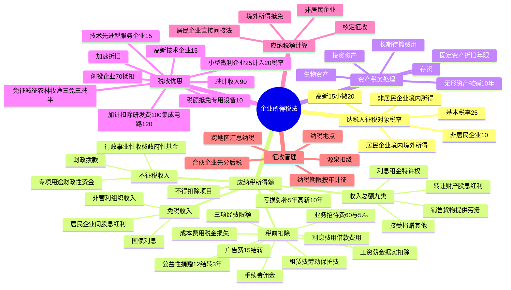

## 1. 章节定位

| 项目 | 信息 |
|------|------|
| 所属科目 | 税法 |
| 难度等级 | 5 |
| 历年分值 | 10-12 分 |
| 建议学时 | 12-15 小时 |
| 知识关联章节 | 第1章 税法总论、第5章 个人所得税法、第12章 国际税收、第14章 税收征收管理法 |

## 2. 考情分析

本章是税法科目的核心重点章，历年分值约 10-12 分，是分值最高的章节之一，必出计算问答题，并常在综合题中与增值税结合考查。本章内容庞杂、计算量大、政策性强，是决定税法科目能否通过的关键。

**命题规律**：本章考查综合运用能力，题型覆盖客观题、计算问答题和综合题。高频考点包括：居民企业与非居民企业的判定及纳税义务范围、应纳税所得额的计算（直接法与间接法）、税前扣除项目的范围与标准（业务招待费"60% 与 5‰"孰低、广告费 15% 结转扣除、职工福利费 14%、工会经费 2%、职工教育经费 8% 结转扣除、公益性捐赠 12% 结转 3 年、利息费用关联方债资比 2:1）、资产的税务处理（固定资产折旧年限、无形资产摊销不低于 10 年、长期待摊费用）、税收优惠（高新技术企业 15%、小型微利企业、研发费 100% 加计扣除、创投企业 70% 抵扣、专用设备 10% 税额抵免）、亏损弥补 5 年（高新/科技型中小企业 10 年）、应纳税额的计算与境外所得抵免、源泉扣缴、跨地区经营汇总纳税。

**复习建议**：本章学习应以"应纳税所得额计算"为核心，构建"收入总额—不征税/免税收入—扣除项目—亏损弥补"的计算链条。重点掌握间接计算法（会计利润±纳税调整），熟练运用各项扣除限额公式。税收优惠部分需分类记忆，注意优惠的适用条件与计算方法。建议通过大量练习题巩固扣除标准的计算，特别是业务招待费、广告费、公益性捐赠、研发费加计扣除的综合计算。

## 3. 知识框架

## 4. 核心精讲

### 4.1 纳税人、征税对象与税率

#### 4.1.1 纳税人

企业所得税的纳税人是在中华人民共和国境内的企业和其他取得收入的组织。**个人独资企业、合伙企业不适用《企业所得税法》**。纳税人分为居民企业和非居民企业：

| 类型 | 判定标准 | 纳税义务 |
|------|------|------|
| 居民企业 | 依法在中国境内成立，或依照外国（地区）法律成立但实际管理机构在中国境内 | 就来源于中国境内、境外的所得缴纳企业所得税 |
| 非居民企业 | 依照外国（地区）法律成立且实际管理机构不在中国境内，但在中国境内设立机构、场所的 | 就其所设机构、场所取得的来源于中国境内的所得，以及发生在中国境外但与其所设机构、场所有实际联系的所得缴纳企业所得税 |
| 非居民企业 | 在中国境内未设立机构、场所，或虽设立但取得的所得与所设机构、场所没有实际联系 | 就其来源于中国境内的所得缴纳企业所得税 |

实际管理机构是指对企业的生产经营、人员、账务、财产等实施实质性全面管理和控制的机构。

#### 4.1.2 所得来源的确定

1. 销售货物所得，按照交易活动发生地确定。
2. 提供劳务所得，按照劳务发生地确定。
3. 转让财产所得：不动产转让按不动产所在地；动产转让按转让动产的企业或机构、场所所在地；权益性投资资产转让按被投资企业所在地。
4. 股息、红利等权益性投资所得，按分配所得的企业所在地确定。
5. 利息所得、租金所得、特许权使用费所得，按负担、支付所得的企业或机构、场所所在地，或按负担、支付所得的个人住所地确定。

#### 4.1.3 税率

| 税率 | 适用对象 |
|------|------|
| 25%（基本税率） | 居民企业；在中国境内设有机构、场所且所得与机构、场所有关联的非居民企业 |
| 20%（实际征税 10%） | 在中国境内未设立机构、场所的，或虽设立但取得的所得与机构、场所没有实际联系的非居民企业 |
| 15%（优惠税率） | 国家需要重点扶持的高新技术企业；技术先进型服务企业；从事污染防治的第三方企业 |
| 20%（优惠税率） | 小型微利企业（减按 25% 计入应纳税所得额） |

### 4.2 应纳税所得额

应纳税所得额是企业每一个纳税年度的收入总额，减除不征税收入、免税收入、各项扣除以及允许弥补的以前年度亏损后的余额。

> 应纳税所得额 = 收入总额 − 不征税收入 − 免税收入 − 各项扣除金额 − 允许弥补的以前年度亏损

计算以权责发生制为原则。实际计算有两种方法：

- **直接计算法**：按上述公式直接计算。
- **间接计算法**：应纳税所得额 = 会计利润总额 ± 纳税调整项目金额。

#### 4.2.1 收入总额

企业收入总额包括 9 类：销售货物收入、提供劳务收入、转让财产收入、股息红利等权益性投资收益、利息收入、租金收入、特许权使用费收入、接受捐赠收入、其他收入。

**收入确认时间要点**：

| 收入类型 | 确认时间 |
|------|------|
| 股息、红利等权益性投资收益 | 按被投资方作出利润分配决定的日期确认 |
| 利息收入 | 按合同约定的债务人应付利息的日期确认 |
| 租金收入 | 按合同约定的承租人应付租金的日期确认（跨年度且提前一次性支付的，可分期均匀计入） |
| 特许权使用费收入 | 按合同约定的应付特许权使用费日期确认 |
| 接受捐赠收入 | 按实际收到捐赠资产的日期确认 |
| 分期收款销售货物 | 按合同约定的收款日期确认 |
| 持续时间超过 12 个月的劳务 | 按纳税年度内完工进度或完成的工作量确认 |
| 转让股权收入 | 于转让协议生效且完成股权变更手续时确认 |

**特殊收入确认**：

- 以分期收款方式销售货物的，按照合同约定的收款日期确认收入。
- 采取产品分成方式取得收入的，按照企业分得产品的日期确认收入，收入额按产品的公允价值确定。
- 企业发生非货币性资产交换，以及将货物、财产、劳务用于捐赠、偿债、赞助、集资、广告、样品、职工福利或利润分配等，应当视同销售货物、转让财产或提供劳务。
- 企业以买一赠一等方式组合销售本企业商品的，不属于捐赠，应将总销售金额按各项商品公允价值比例分摊确认各项销售收入。
- 非货币性资产投资对外投资确认的转让所得，可在不超过 5 年期限内分期均匀计入相应年度的应纳税所得额。

#### 4.2.2 不征税收入与免税收入

**不征税收入**（3 项）：

1. 财政拨款。
2. 依法收取并纳入财政管理的行政事业性收费、政府性基金。
3. 国务院规定的其他不征税收入（专项用途财政性资金）。

专项用途财政性资金需同时符合三个条件：①有专项用途的资金拨付文件；②有专门的资金管理办法；③单独进行核算。注意：不征税收入用于支出所形成的费用，不得扣除；用于支出所形成的资产，其折旧、摊销不得扣除。在 5 年（60 个月）内未发生支出且未缴回的部分，应计入取得该资金第 6 年的应税收入总额。

**免税收入**（4 项）：

1. 国债利息收入。
2. 符合条件的居民企业之间的股息、红利等权益性投资收益（指居民企业直接投资于其他居民企业取得的投资收益）。
3. 在中国境内设立机构、场所的非居民企业从居民企业取得与该机构、场所有实际联系的股息、红利等权益性投资收益（不包括连续持有居民企业公开发行并上市流通的股票不足 12 个月取得的投资收益）。
4. 符合条件的非营利组织的收入。

#### 4.2.3 税前扣除项目

扣除项目遵循权责发生制、配比、相关性、确定性、合理性五项原则。企业实际发生的与取得收入有关的、合理的支出，包括成本、费用、税金、损失和其他支出，准予扣除。税金是指除企业所得税和允许抵扣的增值税以外的各项税金及其附加（消费税、城建税、关税、资源税、土地增值税、房产税、车船税、城镇土地使用税、印花税、契税、教育费附加等）。

**扣除项目及标准**：

| 项目 | 扣除标准 | 超过部分处理 |
|------|------|------|
| 工资薪金 | 合理的据实扣除 | — |
| 职工福利费 | 不超过工资薪金总额 14% | 不得扣除 |
| 工会经费 | 不超过工资薪金总额 2% | 不得扣除 |
| 职工教育经费 | 不超过工资薪金总额 8% | 准予以后纳税年度结转扣除 |
| 社会保险费 | 五险一金据实扣除；补充养老、医疗在规定范围标准内扣除；财产保险费据实扣除；职工商业保险费不得扣除 | — |
| 利息费用 | 非金融企业向金融企业借款据实扣除；向非金融企业借款不超过金融企业同期同类贷款利率部分扣除 | 超过部分不得扣除 |
| 关联方利息 | 债资比：金融企业 5:1，其他企业 2:1 | 超过部分不得扣除（符合独立交易原则或实际税负不高于境内关联方的除外） |
| 借款费用 | 资本化部分计入资产成本；费用化部分据实扣除 | — |
| 业务招待费 | 按发生额 60% 扣除，最高不超过当年销售（营业）收入 5‰ | 超过部分不得扣除 |
| 广告费和业务宣传费 | 不超过当年销售（营业）收入 15% | 准予结转以后纳税年度扣除（化妆品制造/销售、医药制造、饮料制造 30%；烟草企业一律不得扣除） |
| 公益性捐赠 | 不超过年度利润总额 12% | 准予以后 3 年内结转扣除（先扣以前年度结转，再扣当年） |
| 环境保护专项资金 | 依法提取的据实扣除（改变用途不得扣除） | — |
| 租赁费 | 经营租赁按租赁期限均匀扣除；融资租赁按构成融资租入固定资产价值的部分提取折旧分期扣除 | — |
| 劳动保护费 | 合理的据实扣除 | — |
| 手续费及佣金 | 保险企业不超过当年全部保费收入扣除退保金后余额 18%（结转扣除）；其他企业不超过与中介服务机构或个人签订服务协议确认的收入金额 5% | 超过部分不得扣除（保险企业除外） |

**业务招待费计算示例**：某企业当年销售（营业）收入 6000 万元，发生业务招待费 32 万元。

- 按发生额 60%：32 × 60% = 19.2（万元）
- 按销售收入 5‰：6000 × 5‰ = 30（万元）
- 税前扣除限额 = min(19.2, 30) = 19.2（万元）
- 调增应纳税所得额 = 32 − 19.2 = 12.8（万元）

#### 4.2.4 不得扣除的项目

在计算应纳税所得额时，下列支出不得扣除：

1. 向投资者支付的股息、红利等权益性投资收益款项。
2. 企业所得税税款。
3. 税收滞纳金。
4. 罚金、罚款和被没收财物的损失。
5. 超过规定标准的捐赠支出。
6. 赞助支出（与生产经营活动无关的各种非广告性质支出）。
7. 未经核定的准备金支出。
8. 企业之间支付的管理费、企业内营业机构之间支付的租金和特许权使用费，以及非银行企业内营业机构之间支付的利息。
9. 与取得收入无关的其他支出。

#### 4.2.5 亏损弥补

- 企业某一纳税年度发生的亏损可以用下一年度的所得弥补，下一年度所得不足以弥补的，可以逐年延续弥补，但**最长不得超过 5 年**。
- 自 2018 年 1 月 1 日起，当年具备高新技术企业或科技型中小企业资格的企业，其具备资格年度之前 5 个年度发生的尚未弥补完的亏损，最长结转年限由 5 年延长至 **10 年**。
- 企业在汇总计算缴纳企业所得税时，其**境外营业机构的亏损不得抵减境内营业机构的盈利**。
- 企业筹办期间不计算为亏损年度，筹办费用可在开始经营之日当年一次性扣除，或按长期待摊费用处理。

### 4.3 资产的税务处理

资产均以历史成本为计税基础。企业持有各项资产期间资产增值或减值，除另有规定外，不得调整该资产的计税基础。

#### 4.3.1 固定资产

**计税基础**：外购的以购买价款和支付的相关税费等为计税基础；自行建造的以竣工结算前发生的支出为计税基础；融资租入的以租赁合同约定的付款总额和承租人发生的相关费用为计税基础。

**不得计算折旧扣除的固定资产**：①房屋、建筑物以外未投入使用的固定资产；②以经营租赁方式租入的固定资产；③以融资租赁方式租出的固定资产；④已足额提取折旧仍继续使用的固定资产；⑤与经营活动无关的固定资产；⑥单独估价作为固定资产入账的土地。

**折旧方法**：按照直线法计算的折旧准予扣除。自投入使用月份的次月起计算折旧；停止使用的自停止使用月份的次月起停止计算折旧。预计净残值一经确定不得变更。

**折旧最低年限**：

| 资产类别 | 最低折旧年限 |
|------|------|
| 房屋、建筑物 | 20 年 |
| 飞机、火车、轮船、机器、机械和其他生产设备 | 10 年 |
| 与生产经营活动有关的器具、工具、家具等 | 5 年 |
| 飞机、火车、轮船以外的运输工具 | 4 年 |
| 电子设备 | 3 年 |

#### 4.3.2 生物资产

生产性生物资产按照直线法计算的折旧准予扣除。最低折旧年限：林木类 10 年；畜类 3 年。

#### 4.3.3 无形资产

无形资产摊销采取直线法，摊销年限不得低于 10 年。不得计算摊销费用扣除的无形资产：①自行开发的支出已在计算应纳税所得额时扣除的无形资产；②自创商誉；③与经营活动无关的无形资产。外购商誉的支出，在企业整体转让或清算时准予扣除。

#### 4.3.4 长期待摊费用

下列支出作为长期待摊费用按规摊销扣除：①已足额提取折旧的固定资产的改建支出（按尚可使用年限摊销）；②租入固定资产的改建支出（按剩余租赁期限摊销）；③固定资产的大修理支出（修理支出达到取得固定资产时计税基础 50% 以上，且修理后使用年限延长 2 年以上，按尚可使用年限摊销）；④其他长期待摊费用（摊销年限不低于 3 年）。

#### 4.3.5 存货与投资资产

存货成本计算方法可在先进先出法、加权平均法、个别计价法中选用一种，一经选用不得随意变更。投资资产成本在对外投资期间不得扣除，在转让或处置投资资产时准予扣除。

### 4.4 税收优惠

税收优惠方式包括免税、减税、加计扣除、加速折旧、减计收入、税额抵免等。

#### 4.4.1 免征与减征优惠

| 优惠项目 | 政策 |
|------|------|
| 农、林、牧、渔业 | 蔬菜、谷物等种植、牲畜饲养等免征；花卉、茶等种植、海水养殖、内陆养殖减半征收 |
| 国家重点扶持的公共基础设施项目 | 自项目取得第一笔生产经营收入所属纳税年度起，第一年至第三年免征，第四年至第六年减半征收（三免三减半） |
| 环境保护、节能节水项目 | 三免三减半 |
| 符合条件的技术转让所得 | 一个纳税年度内，居民企业技术转让所得不超过 500 万元的部分免征；超过 500 万元的部分减半征收 |
| 生产和装配伤残人员专门用品企业 | 至 2027 年 12 月 31 日免征 |
| 经营性文化事业单位转制为企业 | 自转制注册之日起五年内免征 |

#### 4.4.2 高新技术企业优惠

国家需要重点扶持的高新技术企业减按 15% 税率征收企业所得税。认定条件（同时符合）：注册成立一年以上；拥有核心自主知识产权；科技人员占职工总数比例不低于 10%；近 3 个会计年度研发费用占销售收入比例符合要求（销售收入 5000 万元以下不低于 5%，5000 万至 2 亿元不低于 4%，2 亿元以上不低于 3%，且境内研发费用占比不低于 60%）；高新技术产品（服务）收入占同期总收入比例不低于 60%。

#### 4.4.3 小型微利企业优惠

自 2023 年 1 月 1 日至 2027 年 12 月 31 日，对小型微利企业减按 25% 计入应纳税所得额，按 20% 税率缴纳企业所得税（即实际税负 5%）。

小型微利企业条件（同时符合）：从事国家非限制和禁止行业；年度应纳税所得额不超过 300 万元；从业人数不超过 300 人；资产总额不超过 5000 万元。

#### 4.4.4 加计扣除优惠

| 加计扣除项目 | 政策 |
|------|------|
| 研发费用（一般企业） | 未形成无形资产的，按实际发生额 100% 加计扣除；形成无形资产的，按成本 200% 摊销（自 2023 年 1 月 1 日起） |
| 研发费用（集成电路和工业母机企业） | 未形成无形资产的，按 120% 加计扣除；形成无形资产的，按成本 220% 摊销（2023 年至 2027 年） |
| 委托外部研发 | 按费用实际发生额 80% 计入委托方研发费用并计算加计扣除 |
| 委托境外研发 | 不超过境内符合条件研发费用 2/3 部分，可按规定加计扣除 |
| 出资基础研究 | 按实际发生额 100% 税前加计扣除 |

不适用加计扣除的行业：烟草制造业、住宿和餐饮业、批发和零售业、房地产业、租赁和商务服务业、娱乐业。

#### 4.4.5 其他优惠

- **创投企业优惠**：采取股权投资方式直接投资于初创科技型企业满 2 年的，可按投资额 70% 抵扣股权持有满 2 年的当年的应纳税所得额；当年不足抵扣的可结转抵扣。
- **加速折旧**：技术进步、产品更新换代较快或常年处于强震动、高腐蚀状态的固定资产可缩短折旧年限（不低于规定年限 60%）或采取加速折旧（双倍余额递减法或年数总和法）。2024 年至 2027 年新购进的设备、器具（除房屋、建筑物外）单位价值不超过 500 万元的，允许一次性计入当期成本费用扣除。
- **减计收入**：综合利用资源生产符合规定产品取得的收入减按 90% 计入；金融机构农户小额贷款利息收入、保险公司种植业养殖业保费收入减按 90% 计入。
- **税额抵免**：购置并实际使用环境保护、节能节水、安全生产专用设备的，投资额 10% 可从当年应纳税额中抵免；当年不足抵免的可结转以后 5 个纳税年度抵免。

### 4.5 应纳税额的计算

#### 4.5.1 居民企业应纳税额的计算

> 应纳税额 = 应纳税所得额 × 适用税率 − 减免税额 − 抵免税额

实际中多采用间接计算法：应纳税所得额 = 会计利润总额 ± 纳税调整项目金额。

#### 4.5.2 境外所得抵扣税额

企业取得的境外所得已在境外缴纳的所得税税额，可以从其当期应纳税额中抵免，抵免限额为该项所得依照本法规定计算的应纳税额；超过抵免限额的部分，可以在以后 5 个年度内，用每年度抵免限额抵免当年应抵税额后的余额进行抵补。（详细内容见第 12 章国际税收）

#### 4.5.3 核定征收

纳税人具有下列情形之一的，税务机关可核定征收企业所得税：①依照法律、行政法规可以不设置账簿的；②应当设置但未设置账簿的；③擅自销毁账簿或拒不提供纳税资料的；④虽设置账簿但账目混乱难以查账的；⑤未按期申报经责令限期申报逾期仍不申报的；⑥申报计税依据明显偏低又无正当理由的。

核定征收方式：应纳所得税额 = 应纳税所得额 × 适用税率；应纳税所得额 = 应税收入额 × 应税所得率，或 = 成本（费用）支出额 ÷ (1 − 应税所得率) × 应税所得率。

应税所得率幅度标准：农、林、牧、渔业 3%-10%；制造业 5%-15%；批发和零售贸易业 4%-15%；交通运输业 7%-15%；建筑业 8%-20%；饮食业 8%-25%；娱乐业 15%-30%；其他行业 10%-30%。

#### 4.5.4 非居民企业应纳税额的计算

对于在中国境内未设立机构、场所的，或虽设立但取得的所得与机构、场所没有实际联系的非居民企业：

- 股息、红利等权益性投资收益和利息、租金、特许权使用费所得，以**收入全额**为应纳税所得额。
- 转让财产所得，以收入全额减除财产净值后的余额为应纳税所得额。
- 其他所得，参照上述方法计算。

扣缴企业所得税应纳税额 = 应纳税所得额 × 实际征收率（通常为 10%）。

### 4.6 征收管理

#### 4.6.1 纳税地点

- 居民企业以企业登记注册地为纳税地点；登记注册地在境外的，以实际管理机构所在地为纳税地点。
- 居民企业在中国境内设立不具有法人资格营业机构的，应当汇总计算并缴纳企业所得税。
- 非居民企业在中国境内设立机构、场所的，以机构、场所所在地为纳税地点。
- 非居民企业在中国境内未设立机构、场所的，或所得与机构、场所没有实际联系的，以扣缴义务人所在地为纳税地点。
- 除国务院另有规定外，企业之间不得合并缴纳企业所得税。

#### 4.6.2 纳税期限

企业所得税按年计征，分月或者分季预缴，年终汇算清缴，多退少补。纳税年度自公历 1 月 1 日起至 12 月 31 日止。企业可自年度终了之日起 **5 个月内**向税务机关报送年度企业所得税纳税申报表并汇算清缴。企业在年度中间终止经营活动的，应自实际经营终止之日起 **60 日内**办理当期汇算清缴。

#### 4.6.3 纳税申报

按月或按季预缴的，应自月份或季度终了之日起 **15 日内**向税务机关报送预缴申报表预缴税款。企业在纳税年度内无论盈利或亏损，都应依法报送申报表。

#### 4.6.4 源泉扣缴

对非居民企业在中国境内未设立机构、场所的，或虽设立但取得的所得与机构、场所没有实际联系的所得应缴纳的企业所得税，实行源泉扣缴，以支付人为扣缴义务人。扣缴义务人每次代扣的税款，应自代扣之日起 **7 日内**缴入国库。

#### 4.6.5 跨地区经营汇总纳税

属于中央与地方共享范围的跨省市总分机构企业，实行"统一计算、分级管理、就地预缴、汇总清算、财政调库"的处理办法。总分机构统一计算的当期应纳税额的地方分享部分中，25% 由总机构所在地分享，50% 由各分支机构所在地分享，25% 按一定比例在各地间分配。

- 总机构就地预缴 25%；各分支机构分摊预缴 50%（按营业收入 0.35、职工薪酬 0.35、资产总额 0.30 三因素分摊）；其余 25% 全额缴入中央国库。
- 分支机构分摊税款 = 所有分支机构分摊税款总额 × 该分支机构分摊比例。

#### 4.6.6 合伙企业所得税

合伙企业以每一个合伙人为纳税义务人。合伙人是自然人的缴纳个人所得税；是法人和其他组织的缴纳企业所得税。合伙企业生产经营所得和其他所得采取**先分后税**原则。合伙企业合伙人不得用合伙企业的亏损抵减其盈利。

## 5. 典型例题

### 例 1：综合计算（间接法）

某企业为居民企业，2025 年发生经营业务如下：(1) 取得产品销售收入 6000 万元；(2) 应结转产品销售成本 4000 万元；(3) 发生销售费用 1000 万元（其中广告费 950 万元），管理费用 400 万元（其中业务招待费 32 万元），财务费用 60 万元；(4) 税金及附加 80 万元；(5) 营业外收入 100 万元，营业外支出 70 万元（含通过公益性社会团体向贫困山区捐款 60 万元，支付税收滞纳金 10 万元）；(6) 计入成本费用中的实发工资总额 300 万元、拨缴工会经费 7 万元、发生职工福利费 45 万元、发生职工教育经费 30 万元。计算该企业 2025 年度实际应缴纳的企业所得税。

**解答**：

1. 会计利润总额 = 6000 − 4000 − 1000 − 400 − 60 − 80 + 100 − 70 = 490（万元）
2. 广告费扣除限额 = 6000 × 15% = 900（万元），实际 950 万元，调增 50 万元
3. 业务招待费：32 × 60% = 19.2（万元），6000 × 5‰ = 30（万元），扣除限额 19.2 万元，调增 32 − 19.2 = 12.8（万元）
4. 公益性捐赠扣除限额 = 490 × 12% = 58.8（万元），实际 60 万元，调增 1.2 万元
5. 税收滞纳金不得扣除，调增 10 万元
6. 工会经费扣除限额 = 300 × 2% = 6（万元），实际 7 万元，调增 1 万元
7. 职工福利费扣除限额 = 300 × 14% = 42（万元），实际 45 万元，调增 3 万元
8. 职工教育经费扣除限额 = 300 × 8% = 24（万元），实际 30 万元，调增 6 万元
9. 应纳税所得额 = 490 + 50 + 12.8 + 1.2 + 10 + 1 + 3 + 6 = 574（万元）
10. 应缴纳企业所得税 = 574 × 25% = 143.5（万元）

### 例 2：研发费加计扣除与免税收入

某制造业企业为居民企业，2025 年度发生经营业务如下：(1) 全年取得产品销售收入 5600 万元、其他业务收入 800 万元，取得购买国债的利息收入 40 万元；(2) 发生产品销售成本 3800 万元、其他业务成本 694 万元，缴纳税金及附加 300 万元；(3) 发生管理费用 760 万元（含新技术研发费用 120 万元、业务招待费 70 万元），财务费用 200 万元；(4) 取得直接投资其他居民企业的权益性收益 34 万元；(5) 取得营业外收入 100 万元，发生营业外支出 250 万元（含公益捐赠 80 万元）。计算该企业 2025 年应缴纳的企业所得税。

**解答**：

1. 利润总额 = 5600 + 800 + 40 + 34 + 100 − 3800 − 694 − 300 − 760 − 200 − 250 = 570（万元）
2. 国债利息收入免税，调减 40 万元
3. 技术研发费加计扣除，调减 120 × 100% = 120（万元）
4. 业务招待费：70 × 60% = 42（万元），(5600 + 800) × 5‰ = 32（万元），扣除限额 32 万元，调增 70 − 32 = 38（万元）
5. 直接投资其他居民企业权益性收益免税，调减 34 万元
6. 公益捐赠扣除限额 = 570 × 12% = 68.4（万元），实际 80 万元，调增 11.6 万元
7. 应纳税所得额 = 570 − 40 − 120 + 38 − 34 + 11.6 = 425.6（万元）
8. 应缴纳企业所得税 = 425.6 × 25% = 106.4（万元）

### 例 3：小型微利企业与专用设备抵免

某小型企业，职工 100 人，资产总额 4000 万元。2025 年度生产经营业务如下：(1) 取得产品销售收入 3000 万元、国债利息收入 20 万元；(2) 应扣除与产品销售收入配比的成本 1900 万元；(3) 发生销售费用 252 万元、管理费用 390 万元（其中业务招待费 28 万元、新产品研发费用 148 万元）；(4) 向非金融企业借款 200 万元，支付年利息费用 18 万元（金融企业同期同类借款年利息率为 6%）；(5) 企业所得税税前准许扣除的税金及附加 20 万元；(6) 10 月购进符合《环境保护专用设备企业所得税优惠目录》的专用设备，取得增值税专用发票注明金额 30 万元、增值税进项税额 3.9 万元，该设备当月投入使用；(7) 计入成本费用中的实发工资总额 200 万元、拨缴工会经费 4 万元、发生职工福利费 35 万元、发生职工教育经费 10 万元。计算该企业 2025 年度应缴纳的企业所得税。

**解答**：

1. 会计利润总额 = 3000 + 20 − 1900 − 252 − 390 − 18 − 20 = 440（万元）
2. 国债利息收入免税，调减 20 万元
3. 业务招待费：28 × 60% = 16.8（万元），3000 × 5‰ = 15（万元），扣除限额 15 万元，调增 28 − 15 = 13（万元）
4. 新产品研发费加计扣除，调减 148 × 100% = 148（万元）
5. 利息费用扣除限额 = 200 × 6% = 12（万元），实际 18 万元，调增 6 万元
6. 工会经费扣除限额 = 200 × 2% = 4（万元），实际 4 万元，无需调整
7. 职工福利费扣除限额 = 200 × 14% = 28（万元），实际 35 万元，调增 7 万元
8. 职工教育经费扣除限额 = 200 × 8% = 16（万元），实际 10 万元，无需调整
9. 应纳税所得额 = 440 − 20 + 13 − 148 + 6 + 7 = 298（万元）
10. 符合小型微利企业条件（应纳税所得额 298 万元 ≤ 300 万元），减按 25% 计入：298 × 25% × 20% = 14.9（万元）
11. 环保专用设备投资额 30 万元，税额抵免 = 30 × 10% = 3（万元）
12. 实际应缴纳企业所得税 = 14.9 − 3 = 11.9（万元）

### 例 4：技术转让所得

某居民企业 2025 年符合条件的技术转让收入 800 万元，技术转让成本 200 万元，相关税费 50 万元。计算该企业技术转让所得应缴纳的企业所得税。

**解答**：

1. 技术转让所得 = 技术转让收入 − 技术转让成本 − 相关税费 = 800 − 200 − 50 = 550（万元）
2. 不超过 500 万元的部分免征企业所得税；超过 500 万元的部分减半征收。
3. 应纳税所得额 = (550 − 500) × 50% = 25（万元）
4. 应缴纳企业所得税 = 25 × 25% = 6.25（万元）

### 例 5：非居民企业源泉扣缴

某非居民企业在中国境内未设立机构、场所，2025 年从中国境内企业取得特许权使用费收入 100 万元（不含增值税），取得股息红利收入 50 万元。计算该非居民企业应缴纳的企业所得税。

**解答**：

1. 特许权使用费以收入全额为应纳税所得额，应纳税额 = 100 × 10% = 10（万元）
2. 股息红利以收入全额为应纳税所得额，应纳税额 = 50 × 10% = 5（万元）
3. 合计应缴纳企业所得税 = 10 + 5 = 15（万元）

### 例 6：创业投资企业抵扣

某创业投资企业 2023 年采取股权投资方式投资于未上市的中小高新技术企业 500 万元，2025 年股权持有满 2 年。该企业 2025 年应纳税所得额为 1000 万元（未考虑创投抵扣）。计算该企业 2025 年应缴纳的企业所得税。

**解答**：

1. 投资额 70% 可抵扣应纳税所得额 = 500 × 70% = 350（万元）
2. 抵扣后应纳税所得额 = 1000 − 350 = 650（万元）
3. 应缴纳企业所得税 = 650 × 25% = 162.5（万元）

### 例 7：固定资产折旧年限

某企业 2025 年 1 月购入一台生产设备，计税基础 120 万元，税法规定最低折旧年限 10 年，预计净残值为 0。该企业会计按 5 年直线法计提折旧。计算 2025 年该设备折旧的纳税调整金额。

**解答**：

1. 会计折旧 = 120 ÷ 5 = 24（万元/年）
2. 税法折旧 = 120 ÷ 10 = 12（万元/年）
3. 会计折旧高于税法折旧部分应调增应纳税所得额 = 24 − 12 = 12（万元）

## 6. 记忆口诀

1. **纳税人两类分**：居民企业境内境外全征税，非居民企业只征境内得；个人独资合伙不适用。

2. **税率三档记**：基本 25%，非居民 10%，高新 15%、小微 20%（减按 25% 计入实际 5%）。

3. **应纳税所得额公式**：收入总额减不征税，再减免税和扣除，最后减亏损弥补。

4. **三项经费限额口诀**：福利 14、工会 2、教育 8（结转），工资薪金总额为基数。

5. **业务招待费双限**：发生额 60% 与销售 5‰，孰低扣除，超过不得扣。

6. **广告费 15% 结转**：一般 15% 可结转，化妆品医药饮料 30%，烟草一律不得扣。

7. **公益性捐赠 12%**：年度利润总额 12% 内扣除，超过向后结转 3 年，先扣旧再扣新。

8. **不得扣除九项**：股息红利、所得税款、税收滞纳金、罚金罚款没收、超标准捐赠、赞助、未核定准备金、企业内管理费租金利息、无关支出。

9. **固定资产折旧年限口诀**：房屋 20、生产 10、器具 5、运输 4、电子 3。

10. **亏损弥补年限**：一般 5 年，高新/科技型中小企业 10 年；境外亏损不得抵境内盈利。

11. **研发费加计扣除**：一般 100%、集成电路工业母机 120%；委托外部按 80% 计入；委托境外不超过境内 2/3。

12. **税收优惠口诀**：农林牧渔免减半，公共基建环保三免三减半，技术转让 500 万免超减半，高新 15%，小微 25% 计入 20% 税率，创投 70% 抵扣，专用设备 10% 抵免。

13. **纳税期限口诀**：按年计征分月季预缴，年度终了 5 个月汇算清缴，月季终了 15 日预缴，终止经营 60 日汇算。

14. **源泉扣缴 7 日**：扣缴义务人代扣税款 7 日内缴入国库，以支付人为扣缴义务人。

15. **跨地区汇总纳税分摊**：总机构 25%、分支机构 50%（三因素 0.35+0.35+0.30）、中央国库 25%。

16. **合伙企业先分后税**：合伙人为纳税义务人，自然人缴个税，法人缴企税，亏损不得互抵。

17. **小型微利企业条件**：所得额 300 万、从业 300 人、资产 5000 万，非限制禁止行业。

## 7. 同步练习

**1.（单选题）** 根据企业所得税相关规定，下列企业属于非居民企业的是（　）。

A. 依法在中国境内成立的外商投资企业
B. 依法在境外成立但实际管理机构在中国境内的外国企业
C. 在中国境内未设立机构、场所，但有来源于中国境内所得的外国企业
D. 在中国境内未设立机构、场所且没有来源于中国境内所得的外国企业

---

**2.（单选题）** 依据企业所得税法的规定，下列各项中按负担所得的所在地确定所得来源地的是（　）。

A. 特许权使用费所得
B. 提供劳务所得
C. 不动产转让所得
D. 其他所得

---

**3.（单选题）** 根据企业所得税法的规定，下列收入属于不征税收入的是（　）。

A. 企业转让限售股取得的收入
B. 非营利性组织从事营利活动的收入
C. 企业销售货物过程中取得的违约金收入
D. 依法收取并纳入财政管理的政府性基金

---

**4.（单选题）** 企业发生的下列支出中，在计算企业所得税应纳税所得额时准予扣除的是（　）。

A. 向投资者分配的红利
B. 缴纳的增值税税款
C. 按规定缴纳的财产保险费
D. 违反消防规定被处以的行政罚款

---

**5.（单选题）** 下列关于企业所得税中收入确认时间的说法中，正确的是（　）。

A. 接受非货币形式捐赠，在计算缴纳企业所得税时应分期确认收入
B. 企业转让股权收入，应于转让协议生效、且完成股权变更手续时，确认收入的实现
C. 股息等权益性投资收益以投资方收到所得的日期确认收入的实现
D. 特许权使用费收入以实际取得收入的日期确认收入的实现

---

**6.（单选题）** 下列关于固定资产计税基础的表述中，符合企业所得税相关规定的是（　）。

A. 自行建造的固定资产，为该资产的评估价值
B. 改建的固定资产，为改建该资产的新增价值
C. 盘盈的固定资产，为同类固定资产的重置完全价值
D. 通过债务重组方式取得的固定资产，为该资产的账面原值

---

**7.（单选题）** 企业在2024年1月1日至2027年12月31日期间发生的节能节水、环境保护和安全生产专用设备数字化、智能化改造投入支出，下列表述中，符合企业所得税法规定的是（　）。

A. 可以全额一次性扣除，并可以按支出额的 $100\%$ 加计扣除
B. 可按照改造投入金额的 $10\%$ 抵免企业当年应纳税额
C. 不超过该专用设备购置时原计税基础 $50\%$ 的部分，可按照 $10\%$ 比例抵免企业当年应纳税额
D. 不超过该专用设备购置时原计税基础 $50\%$ 的部分，可以在税前一次性扣除

---

**8.（单选题）** 下列各项中，在利润总额的基础上应调增企业所得税应纳税所得额的是（　）。

A. 国债利息收入
B. 可加计扣除的研发费用
C. 超标准列支的职工福利费
D. 环境保护专项资金

---

**9.（单选题）** 下列情形中，不能作为坏账损失在计算企业所得税应纳税所得额时扣除的是（　）。

A. 因自然灾害导致无法收回的应收账款
B. 债务人被依法注销，其清算财产不足以清偿的应收账款
C. 债务人2年未清偿且有确凿证据证明无力偿还的应收账款
D. 法院批准破产重整计划后无法追偿的应收账款

---

**10.（单选题）** 工业和信息化部会同国家发展改革委、财政部、税务总局复核，对确不符合条件的工业母机企业，取消其享受研发费用加计 $120\%$ 扣除政策资格，一定期限内不得申请列入清单。该期限为（　）年。

A. 1
B. 2
C. 3
D. 5

---

**11.（单选题）** 境外某公司在中国境内未设立机构、场所，2024年取得境内甲公司支付的股息500万元，取得境内乙公司支付的特许权使用费350万元。2024年度该境外公司在我国应缴纳企业所得税为（　）万元。（不考虑其他税费）

A. 32
B. 34
C. 58
D. 85

---

**12.（单选题）** 根据企业所得税法的规定，下列固定资产中，准予扣除折旧费的是（　）。

A. 未投入使用的机器设备
B. 以经营租赁方式租入的固定资产
C. 未投入使用的房屋
D. 以融资租赁方式租出的固定资产

---

**13.（单选题）** 自2024年1月1日起至2027年12月31日止，对符合条件的从事污染防治的第三方企业可以减按一定的税率征收企业所得税，该税率为（　）。

A. $15\%$
B. $25\%$
C. $10\%$
D. $20\%$

---

**14.（单选题）** 跨地区经营汇总缴纳企业所得税时，分支机构预缴分摊比例要考虑营业收入、职工薪酬和资产总额三个因素。该三个因素的分摊比例依次为（　）。

A. $30\%$、$35\%$、$35\%$
B. $35\%$、$30\%$、$35\%$
C. $35\%$、$35\%$、$30\%$
D. $30\%$、$40\%$、$30\%$

---

**15.（单选题）** 下列各项支出中，可以在计算企业所得税应纳税所得额时扣除的是（　）。

A. 企业所得税税款
B. 合理的劳动保护支出
C. 为投资者支付的商业保险费
D. 企业内设营业机构之间支付的租金

---

**16.（单选题）** 下列各项中，属于企业所得税最低折旧年限为4年的固定资产是（　）。

A. 房屋
B. 机器
C. 电子设备
D. 运输大卡车

---

**17.（单选题）** 依据企业所得税法的规定，企业接收县政府以股权投资方式投入的国有非货币性资产，应确定的计税基础是（　）。

A. 政府确定的接收价值
B. 该资产的公允价值
C. 该资产的账面净值
D. 该资产的账面原值

---

**18.（单选题）** 某保险企业，2024年全部保费收入为9000万元，退保金500万元，发生销售保险的佣金和手续费支出1800万元，该企业2024年计算企业所得税时，佣金及手续费支出纳税调整金额为（　）万元。

A. 0
B. 270
C. 180
D. 950

---

**19.（单选题）** 下列关于基础研究支出加计扣除规定的表述中，正确的是（　）。

A. 符合条件的基础研究包含在境外开展的研究
B. 对企业出资给高等学校和政府性自然科学基金用于基础研究的支出，在计算应纳税所得额时可按实际发生额在税前扣除，并可按 $100\%$ 税前加计扣除
C. 对于民办非营利性科研机构的业务范围存在争议的，由税务机关进行核实确认
D. 对非营利性科研机构、高等学校接收企业、个人和其他组织机构基础研究资金收入，按规定征收企业所得税

---

**20.（单选题）** 甲投资公司2022年10月将2400万元投资于非上市乙公司，取得乙公司 $40\%$ 的股权。2024年5月，甲公司撤回其在乙公司的全部投资，共计从乙公司收回4000万元。撤资时乙公司的累计未分配利润为600万元，累计盈余公积为400万元。则甲公司撤资应确认的投资资产转让所得为（　）万元。

A. 0
B. 400
C. 1200
D. 1600

---

**21.（单选题）**（2024年）2024年7月，甲公司投资于境内非上市乙公司，其股权的计税基础为1000万元，持有的股权比例为 $20\%$。2024年8月，乙公司将股权溢价发行形成的资本公积800万元转增股本，2024年11月甲公司转让该股权取得收入1500万元。甲公司股权转让所得为（　）万元。

A. 1340
B. 500
C. 1500
D. 340

---

**22.（单选题）**（2024年）我国境内企业甲公司接受外国关联企业乙公司一笔混合性投资并向其分配投资收益。乙公司按该国税法规定将其认定为权益性投资收益且享受免税待遇。对甲公司支付投资收益的企业所得税处理，符合税法规定的是（　）。

A. 免征预提所得税
B. 不征预提所得税
C. 应视为股息分配
D. 应视为利息支出

---

**23.（单选题）**（2024年）某企业为扩建厂房，于2024年1月1日向银行借入一笔年利率 $4.35\%$ 的一年期专门借款3000万元。该厂房于2023年6月1日开工，2024年6月30日竣工结算投入使用。2024年该企业应予以费用化的利息支出是（　）万元。

A. 10.88
B. 65.25
C. 130.5
D. 0

---

**24.（单选题）**（2024年）在我国境内未设立机构、场所的某非居民企业转让境内房屋，取得境外转让收入5000万元，该房屋净值3000万元，缴纳相关税费300万元，则该非居民企业应确认的应纳税所得额为（　）万元。

A. 1700
B. 2000
C. 4700
D. 5000

---

**25.（单选题）**（2023年）下列情形中，属于企业所得税减半征收的是（　）。

A. 海水养殖
B. 中药材的种植
C. 远洋捕捞
D. 林木的种植

---

**26.（单选题）**（2023年）甲公司2021年8月以500万元直接投资于乙公司，占有乙公司 $15\%$ 股权。2024年乙公司因故被清算，清算前账面累计未分配利润和累计盈余公积合计400万元，甲公司分得剩余资产金额600万元。甲公司申报企业所得税应确认的投资转让所得为（　）万元。

A. 40
B. 60
C. 100
D. 600

---

**27.（单选题）**（2022年）甲企业2024年5月接受 $100\%$ 控股母公司乙无偿划转的一条生产线，该生产线原值为3000万元，已按税法规定计提折旧800万元，其市场公允价值为2600万元。该业务符合特殊性税务重组条件，企业选择采用特殊性税务处理。该项生产线的计税基础是（　）万元。

A. 800
B. 2200
C. 2600
D. 3000

---

**28.（单选题）**（2022年）下列关于企业筹建期间涉及企业所得税处理的表述中，正确的是（　）。

A. 业务招待费按实际发生额计入筹办费
B. 筹办费用支出可以在开始经营之日的当年一次性扣除
C. 筹办期间所属年度计算为亏损年度
D. 广告费和业务宣传费不得向以后年度结转

---

**29.（单选题）**（2022年）居民企业享受减免企业所得税优惠的境内技术转让，应签订技术转让合同，并经省级以上（含省级）有关部门认定登记。该主管部门是（　）。

A. 工信部门
B. 商务部门
C. 科技部门
D. 税务部门

---

**30.（单选题）**（2021年）企业盘盈的固定资产，其计税基础是（　）。

A. 同类固定资产的评估价格
B. 同类固定资产的重置完全价值
C. 该固定资产的公允价值
D. 该固定资产的可变现净值

---

**31.（单选题）**（2021年）甲公司2020年8月以800万元直接投资于乙公司，占有乙公司 $30\%$ 股权。2024年12月将全部股权转让取得收入1200万元，并完成股权变更手续，转让时乙公司账面累计未分配利润200万元。甲公司应确认股权转让的应纳税所得额是（　）万元。

A. 400
B. 340
C. 900
D. 200

---

**32.（单选题）**（2020年）企业从事国家重点扶持的公共基础设施项目取得的投资经营所得，享受企业所得税"三免三减半"优惠政策的起始时间是（　）。

A. 项目投资的当年
B. 项目投资开始实现会计利润的当年
C. 项目投资开始缴纳企业所得税的当年
D. 项目投资获得第一笔经营收入的当年

---

**33.（单选题）** 纳税人在计算企业所得税应纳税所得额时，下列向银行支付的借款费用中，不允许直接全额扣除的是（　）。

A. 企业在建造固定资产期间发生的合理的借款费用
B. 已经交付使用后的固定资产发生的借款费用
C. 企业在生产经营活动中为订购原材料发生的借款费用
D. 经过8个月的建造才能达到预定可销售状态的存货在建造期间发生的借款费用

---

**34.（单选题）** 甲公司共有股权10000万股，为了将来有更好的发展，将 $80\%$ 股权让乙公司收购，然后成为乙公司的子公司。假定收购日甲公司每股资产的计税基础为8元，每股资产的公允价值为10元。在收购对价中乙公司以股权形式支付72000万元，以银行存款支付8000万元。甲公司取得非股权支付额对应的资产转让所得为（　）万元。

A. 1600
B. 2000
C. 1500
D. 1000

---

**35.（单选题）** 甲创业投资企业2022年11月采取股权投资方式向乙企业（初创科技型企业）投资300万元，股权持有至2024年12月31日尚未转让。甲企业2024年度实现利润600万元，假设该企业当年无其他纳税调整事项，则甲企业2024年应纳税所得额为（　）万元。

A. 210
B. 300
C. 390
D. 600

---

**36.（单选题）** 某生产企业2022年3月1日从银行购买5年期、到期还本付息国债20万元，年利率为 $3.52\%$。2024年3月1日在证券市场转让，取得转让收入22万元，支付交易费用0.16万元。转让国债应缴纳的企业所得税为（　）万元。

A. 0.11
B. 0.15
C. 1.12
D. 5

---

**37.（多选题）** 下列符合软件产业和集成电路产业税收优惠清单管理规定的有（　）。

A. 列入清单的企业在下一年度企业所得税预缴申报时，如自行判断符合条件，可以在预缴申报时先行享受优惠
B. 已经在预缴申报时享受优惠的企业，年度汇算清缴时，如未被列入下一年度清单，按规定补缴税款并加收滞纳金
C. 2023年已列入清单的企业如需享受新一年度税收优惠政策（进口环节增值税分期纳税政策除外），2024年需重新申报
D. 申请享受相关税收优惠的企业，可于汇算清缴结束前，从信息填报系统中查询是否列入清单

---

**38.（多选题）** 根据企业所得税法规定，判定居民企业的标准有（　）。

A. 登记注册地标准
B. 所得来源地标准
C. 经营行为实际发生地标准
D. 实际管理机构所在地标准

---

**39.（多选题）** 纳税人计算应纳税所得额时，下列已纳税金可以从收入总额中扣除的有（　）。

A. 契税
B. 消费税
C. 房产税
D. 车辆购置税

---

**40.（多选题）** 下列在企业所得税中可以税前扣除的项目有（　）。

A. 企业发生的诉讼费用
B. 企业与企业之间的管理费用
C. 支付给行政性事业单位的罚款
D. 逾期归还银行贷款的罚息

---

**41.（多选题）** 依据企业所得税法的相关规定，企业发生的广告费和业务宣传费可按当年销售（营业）收入的 $30\%$ 比例扣除的有（　）。

A. 白酒制造企业
B. 饮料销售企业
C. 医药制造企业
D. 化妆品制造企业

---

**42.（多选题）** 下列属于专用设备数字化、智能化改造情形的有（　）。

A. 数据采集
B. 数据分析
C. 智能控制
D. 数字安全与防护

---

**43.（多选题）** 根据企业所得税法规定，下列借款费用应资本化的有（　）。

A. 为购置固定资产发生借款的，在该资产购置期间发生的合理的借款费用
B. 为建造固定资产发生的借款，在该资产建造期间发生的合理的借款费用
C. 为经过6个月以上建造才能达到预定可销售状态的存货发生借款的，该存货建造期间发生的合理的借款费用
D. 为经过12个月以上建造才能达到预定可销售状态的存货发生借款的，该存货建造期间发生的合理的借款费用

---

**44.（多选题）** 下列关于企业所得税研究开发费用的表述中，正确的有（　）。

A. 企业委托境外进行研发活动所发生的研究开发费用按照费用实际发生额的 $80\%$ 计入委托方的委托境外研究开发费用，不超过境内符合条件的研究开发费用 $2/3$ 的部分，可以按规定在企业所得税前加计扣除
B. 直接从事研发活动人员的工资薪金属于可以加计扣除的研究开发费用
C. 其他相关费用的总额不得超过可加计扣除研发费用总额的 $10\%$
D. 委托境外进行研发活动应签订技术开发合同，并由委托方到省级商务部门进行登记

---

**45.（多选题）** 下列各项中，超过税法规定的扣除限额部分，可以结转到以后年度扣除的有（　）。

A. 职工教育经费支出超过工资薪金总额 $8\%$ 的部分
B. 公益性捐赠支出超过年度利润总额 $12\%$ 的部分
C. 一般企业支付的佣金，超过合同确认收入金额的 $5\%$ 的部分
D. 一般企业广告费和业务宣传费支出超过当年销售（营业）收入 $15\%$ 的部分

---

**46.（多选题）** 纳税人发生的下列行为应视同销售确认收入，缴纳企业所得税的有（　）。

A. 将货物用于股息分配
B. 将商品用于广告赞助
C. 将产品用于职工福利
D. 将产品用于管理部门

---

**47.（多选题）** 一般性税务处理下的企业分立，当事各方下列处理正确的有（　）。

A. 被分立企业对分立出去的资产按公允价值确认资产转让所得或损失
B. 分立企业应按公允价值确认接受资产的计税基础
C. 企业分立相关企业的亏损不得相互结转弥补
D. 被分立企业对分立出去的资产按账面价值确认资产转让所得或损失

---

**48.（多选题）** 按照企业所得税关于补亏的相关规定，下列各项表述中，正确的有（　）。

A. 境内投资方企业发生亏损，可用境外被投资企业分回的所得弥补
B. 被投资企业发生的经营亏损，可由投资企业盈利弥补
C. 被投资企业发生的经营亏损，投资企业不得调整减低其投资成本
D. 被投资企业发生的经营亏损，投资企业不得将其确认为投资损失

---

**49.（多选题）** 下列关于企业重组特殊性税务处理说法，正确的有（　）。

A. 企业债务重组确认的应纳税所得额一律并入当年应纳税所得额中
B. 企业债权转股权的业务，当期应确认有关债务清偿所得或损失
C. 企业重组中，对非股权支付仍应在交易当期确认相应的资产转让所得或损失
D. 企业在重组发生前后连续12个月内分步对其资产、股权进行交易，应根据实质重于形式原则将其作为一项企业重组交易处理

---

**50.（多选题）**（2024年）下列关于手续费及佣金支出的企业所得税税务处理的表述中，正确的有（　）。

A. 电信企业实际发生的相关手续费及佣金支出，按照企业当年收入总额的 $15\%$ 限额内在税前据实扣除
B. 从事代理服务、主营业务收入为手续费、佣金的证券企业，其为取得该类收入而实际发生的营业成本（包括手续费及佣金支出），准予在企业所得税前据实扣除
C. 保险企业发生与其经营活动有关的手续费及佣金支出，不超过当年全部净保费的 $18\%$ 的部分，在税前准予扣除
D. 个人和企业以现金方式支付的手续费及佣金可以按规定在税前扣除

---

**51.（多选题）**（2024年）某电脑生产企业采用买一赠一方式销售本企业电脑，活动规定销售电脑赠送蓝牙键盘，其中电脑的单独售价是4500元，蓝牙键盘的单独售价是500元，电脑和蓝牙键盘组合出售的价格是4800元。上述金额均为不含增值税金额。根据企业所得税的规定，下列说法正确的有（　）。

A. 确认电脑收入4320元
B. 确认蓝牙键盘收入480元
C. 确认电脑收入4500元，确认蓝牙键盘收入0
D. 赠送的蓝牙键盘不能扣除成本

---

**52.（多选题）**（2024年）下列所得，可享受企业所得税"三免三减半"政策的有（　）。

A. 企业从事国家重点扶持的公共基础设施项目的投资经营的所得
B. 企业承包建设国家重点扶持的公共基础设施项目取得的所得
C. 企业从事节能减排技术改造取得的所得
D. 企业从事公共垃圾处理取得的所得

---

**53.（多选题）**（2023年）企业在补开发票过程中，因对方被税务机关认定为非正常户而无法补开，可以凭资料证实支出真实性后，其支出允许税前扣除。下列属于证明资料的有（　）。

A. 相关业务活动的合同凭证
B. 原材料出库、入库凭证
C. 列入非正常经营户的证明资料
D. 非现金方式支付的付款凭证

---

**54.（多选题）**（2022年）下列生物资产计提的折旧，可以在企业所得税税前扣除的有（　）。

A. 防风固沙林
B. 经济林
C. 薪炭林
D. 用材林

---

**55.（多选题）**（2022年）企业取得的下列所得中，可享受减半征收企业所得税优惠的有（　）。

A. 海水养殖项目的所得
B. 种植薯类作物的所得
C. 牲畜饲养项目的所得
D. 种植香料作物的所得

---

**56.（多选题）**（2022年）下列说法中，属于长期待摊费用的有（　）。

A. 租入固定资产的改扩建支出
B. 未提足折旧的固定资产的改建支出
C. 固定资产大修理支出
D. 固定资产的日常维护保养支出

---

**57.（多选题）** 下列关于小型微利企业的企业所得税政策，表述正确的有（　）。

A. 小型微利企业从业人数，包括与企业建立劳动关系的职工人数，但不包含企业接受的劳务派遣用工人数
B. 小型微利企业采用核定征收方式的，不能享受小型微利企业所得税优惠政策
C. 年度中间开业或者终止经营活动的，以其实际经营期作为一个纳税年度确定相关指标
D. 自2023年1月1日至2027年12月31日，小型微利企业年应纳税所得额不超过300万元的部分，减按 $25\%$ 计入应纳税所得额

---

**58.（多选题）** 下列关于企业所得税源泉扣缴的表述中，正确的有（　）。

A. 对非居民企业在中国境内取得工程作业和劳务所得应缴纳的所得税，税务机关可以指定工程价款或者劳务费的支付人为扣缴义务人
B. 对在中国境内未设立机构、场所的，或者虽设立机构、场所但取得的所得与其所设机构、场所没有实际联系的所得应缴纳的所得税实行源泉扣缴
C. 扣缴义务人未依法履行扣缴义务的，非居民企业所得税应该由扣缴义务人承担
D. 扣缴义务人每次代扣的税款，应当自代扣之日起7日内缴入国库，并向所在地的税务机关报送扣缴企业所得税报告表

---

**59.（多选题）** 下列各项中，在计算企业所得税应纳税所得额时，可以享受加计扣除规定的有（　）。

A. 一般企业开展研发活动发生的研究开发费用
B. 创业投资企业采取股权投资方式直接投资于初创科技型企业
C. 企业出资给非营利性科研机构用于基础研究的支出
D. 企业安置残疾人员及国家鼓励安置的其他就业人员所支付的工资

---

**60.（综合题）**（2024年）某生产节能产品的科技公司为增值税一般纳税人。2024年取得营业收入10000万元（含高新技术产品收入5500万元）、其他收益500万元；发生营业成本2000万元、税金及附加200万元、管理费用3000万元、销售费用500万元、财务费用300万元、营业外支出500万元，自行计算的利润总额为4000万元。2025年2月该企业进行2024年企业所得税汇算清缴时聘请了某会计师事务所进行审核，发现如下事项：

（1）3月1日，将郊区占地1000平方米的仓库对外出租，该仓库为2016年1月购入，原值500万元。合同载明一次性收取2024年不含税租金10万元，采用简易计税方法计算增值税。未缴纳印花税。2024年末，就该仓库缴纳房产税、城镇土地使用税。

（2）6月对以经营租赁方式租入的商铺进行装修，改造花费500万元。已知该商铺7月1日投入使用，剩余租赁期为5年，装修费一次性计入成本费用。

（3）7月收到政府发放的科技补贴500万元，符合不征税收入确认条件，企业将其计入其他收益，并将补贴收入金额全部用于项目研发。汇算清缴时，财务人员拟作为不征税收入申报。

（4）9月向省政府设立的自然科学基金出资400万元，用于基础研发，向某财经大学出资100万元用于市场调研。

（5）9月生产、销售节能产品1万件（已按照不含税售价确认收入），按政策规定，节能产品的财政补贴为10元/件，该企业12月共收到补贴10万元。已按规定缴纳增值税及相关税费，财务人员拟将该收入作为不征税收入申报。

（6）向自然人股东王某借款1000万元，并支付全年利息50万元计入财务费用，已知王某对企业的权益性投资400万元，金融机构同期同类贷款利率为 $4\%$，企业无法提供符合独立交易的原则资料。

（7）企业投入1800万元研发费用，用于研发节能技术，尚未形成无形资产，其中500万元来自于7月收到的科技补贴。另外，投入200万元用于为顾客提供节能产品的技术支持活动。

（其他相关资料：该企业计算房产余值的减除比例为 $30\%$，城镇土地使用税年税额为6元/平方米，租赁合同印花税税率为 $1‰$。）

要求：根据上述资料，按照下列顺序计算回答问题，如有计算需计算出合计数。

（1）根据业务（1）计算企业2024年应缴纳的房产税、城镇土地使用税、增值税和印花税。

（2）根据业务（2）计算企业应调整的企业所得税应纳税所得额。

（3）在企业选择较低税负的前提下，判断业务（3）财务人员的处理是否正确并说明理由。

（4）根据业务（4）计算企业应调整的企业所得税应纳税所得额。

（5）判断业务（5）财务人员的处理是否合理并说明理由。

（6）根据业务（6）计算企业应调整的企业所得税应纳税所得额。

（7）在企业选择较低税负的前提下，根据业务（7）计算企业应加计扣除的研发费用。

（8）判断企业是否可以作为高新技术企业并说明理由。

（9）在企业选择较低税负的前提下，计算该企业2024年企业所得税应纳税所得额以及应纳税额。

---

**61.（综合题）**（2024年）甲电子设备生产企业为增值税一般纳税人，自2021年起被认定为高新技术企业。2023年企业自行核算的会计利润为11980万元，已经预缴企业所得税1300万元。2024年3月企业进行汇算清缴时，聘请了某会计师事务所进行审核，发现如下事项：

（1）3月20日与乙公司签订合同，采用预收款方式销售设备、零部件。甲企业当日按合同全额开具增值税专用发票，发票注明设备价款400万元，税额52万元；零部件价款80万元，税额10.4万元。款项于3月31日收讫，按合同约定，设备已于11月30日发出，零部件在2024年发货。甲企业认为零部件虽尚由本企业持有，但其满足在售后代管商品的安排下客户取得商品控制权的条件，控制权已转移给乙公司。因此，甲企业全额确认收入同时结转设备成本340万元、零部件成本50万元。

（2）管理费用中含4月购入不含税价款30万元的办公用品，至12月31日未取得发票。

（3）投资收益中含取得的国债利息收入16.64万元。

（4）7月向合作高校的校友联合会赞助联谊活动经费10万元。

（5）12月20日与附近商场签订租赁协议，2024年1月1日起向顾客开放其自有的地面露天停车场，租期3年，协议约定于起租日起一次性收取3年不含税租金30万元，甲企业自行计算缴纳印花税0.03万元，未计算缴纳房产税。

（6）年初决议全年投入2000万元进行2个项目研发，分别为R001和R002。其中R001由企业自主研发，当年研发项目尚未完成，发生的1400万元费用化支出，结转至研发费用。R002委托境外非关联方丙企业研发，签订技术委托开发合同，支付600万元，结转至研发费用，该委托开发合同未向科技行政主管部门登记。

（7）成本费用中含实际支付的合理工资薪金5500万元，发生职工福利费700万元（含职工探亲路费30万元），职工教育经费460万元。

（其他相关资料：租赁合同印花税税率 $1‰$，各扣除项目均在汇算清缴前取得有效凭证。）

要求：根据上述资料，按照下列顺序计算回答问题，如有计算需计算出合计数。

（1）判断业务（1）增值税纳税义务发生时间并说明理由。计算企业所得税应调整的应纳税所得额并说明理由。

（2）回答业务（2）计入管理费用的办公用品在企业所得税税前扣除应提供的有效凭证。

（3）计算业务（3）应调整的企业所得税应纳税所得额。

（4）计算业务（4）应调整的企业所得税应纳税所得额。

（5）判断业务（5）中印花税和房产税处理是否正确并说明理由。

（6）判断业务（6）中两项研发费用是否可以在企业所得税前加计扣除，并说明理由。计算业务（6）应调整的企业所得税应纳税所得额。

（7）判断业务（7）企业将职工探亲路费计入职工福利费是否正确。计算业务（7）应调整的企业所得税应纳税所得额。

（8）计算该企业2023年度应补缴的企业所得税。

---

**62.（综合题）**（2023年）某汽车制造企业为增值税一般纳税人，2023年被认定为高新技术企业，2024年度该企业自行计算的会计利润为20980万元，企业已预缴企业所得税1360万元。2025年3月该企业进行2024年度企业所得税汇算清缴时，聘请了某会计师事务所进行审核，发现如下事项：

（1）6月收到上一季度新能源汽车财政补贴，确认营业收入1000万元，已按规定缴纳增值税，未对其成本费用进行单独核算。企业拟将其确认为企业所得税不征税收入。

（2）6月转让公寓一栋，取得含增值税收入5200万元，企业选择按简易计税方法计算缴纳增值税。另按规定缴纳转让环节其他税费12万元。2016年4月取得时购房发票上注明金额3500万元，已缴纳契税。企业自行计算缴纳土地增值税6.43万元。

（3）10月购进一批汽车零部件尚未领用，取得增值税专用发票注明价款1000万元，增值税130万元，企业拟选择将其在当年一次性全额在计算应纳税所得额时扣除。

（4）12月购入一栋不含增值税售价4000万元的闲置厂房，因该厂房尚未办理权属登记，企业未计算缴纳房产税。

（5）12月发现有一笔发生于2018年的实际损失50万元未在当年扣除，拟向税务机关申报确认损失并于2024年企业所得税前扣除。

（6）12月赊销给甲公司一批汽车，合同约定不含增值税售价800万元，增值税104万元，企业将该应收账款分类为以摊余成本计量的金融资产，月末双方达成重组协议，甲公司以一批汽车零配件偿还该欠款，甲公司向企业开具增值税专用发票注明配件价款750万元，增值税97.5万元，该配件的实际成本为650万元。重组当日，该笔收入应收账款的公允价值为904万元。

（7）全年投入8900万元研发费用进行自主研发，相关明细如下：

| 项目 | 金额（万元） |
|------|------|
| 人员人工费用 | 2000 |
| 直接投入费用 | 1000 |
| 折旧费用 | 3800 |
| 新产品设计费用 | 1300 |
| 其他相关费用 | 800 |

（8）成本费用中含实际支付的合理工资薪金3550万元，其中含接受劳务派遣用工直接支付给劳务派遣公司的费用550万元，发生职工福利费650万元、职工教育经费420万元，为高级技术人员购买商业健康保险，支付保险费100万元。

（其他相关资料：当地契税税率为 $3\%$，各扣除项目均在汇算清缴期取得有效凭证。）

要求：根据上述资料，按照下列顺序计算回答问题，如有计算需计算出合计数。

（1）判断业务（1）企业将取得的新能源汽车财政补贴作为不征税收入是否正确，并说明理由。

（2）计算业务（2）应缴纳的土地增值税，并计算业务（2）企业在正确缴纳土地增值税后，应调整的企业所得税应纳税所得额。

（3）判断业务（3）企业购置的汽车零部件在计算应纳税所得额时一次性全额扣除是否正确并说明理由。

（4）判断业务（4）企业房产税的处理是否正确，并说明理由。

（5）判断业务（5）企业申报确认损失处理是否正确，并说明理由。

（6）计算业务（6）应调整的企业所得税应纳税所得额，并说明债务重组取得的汽车零配件应确认的计税基础。

（7）计算业务（7）应调整的企业所得税应纳税所得额。

（8）判断业务（8）中直接支付给劳务派遣公司的费用能否作为企业的工资薪金支出，并说明理由，同时计算业务（8）应调整的企业所得税应纳税所得额。

（9）计算该企业2024年度应补缴的企业所得税。

---

**63.（综合题）**（2022年）位于西部某市区的国家鼓励类软件企业为增值税一般纳税人，成立于2016年1月，自2022年开始被认定为国家鼓励的软件企业并于当年实现盈利。2024年实现营业收入10000万元、其他收益800万元；发生营业成本2900万元、税金及附加210万元、管理费用2400万元、销售费用1700万元、财务费用200万元、营业外支出1200万元。2024年度该企业自行计算的会计利润为2190万元。2025年3月该企业进行2024年企业所得税汇算清缴时，自查发现如下事项：

（1）6月份购入一台不含增值税价30万元的新能源商用车，销售人员告知该车型满足车辆购置税免税条件。另将一台企业使用过的已经抵扣进项税额的燃油汽车在二手市场上销售，取得不含增值税收入10万元，未进行相应会计及税务处理，不考虑燃油汽车购置原值及折旧的因素。相关业务均签订了正式合同但未计提缴纳印花税。企业发现问题后已经完成了印花税、增值税以及城市维护建设税、教育费附加的补税处理。

（2）其他收益核算了增值税即征即退税额800万元，虽未对其单独设立核算账套但主管会计将该笔收入作为不征税收入处理。

（3）成本费用中含实际发放的合理工资总额2000万元（其中残疾职工的工资50万元）、发生职工福利费300万元、职工教育经费200万元、拨缴工会经费30万元，工会经费取得合法票据。

（4）期间费用中含广告费和业务宣传费1000万元（其中包括非广告性赞助支出200万元），业务招待费200万元。上年度超标未扣除可结转到本年度扣除的广告费100万元。

（5）营业外支出中包含行政罚款及滞纳金1万元、替员工负担的个人所得税3万元。

（其他相关资料：购销（买卖）合同印花税税率为 $0.3‰$，若无特殊说明，各扣除项目均取得有效凭证。）

要求：根据上述资料，按照下列顺序计算回答问题，如有计算需计算出合计数。

（1）说明业务（1）减免车辆购置税的新能源汽车的范围；计算车辆购置和处置过程中应补缴的印花税、增值税以及城市维护建设税、教育费附加（不考虑地方教育附加）；根据税收征收管理法的相关规定，说明企业少缴税款的情形下将面临的法律责任；计算业务（1）应调整的企业所得税应纳税所得额。

（2）判断业务（2）企业将其作为不征税收入是否正确并说明理由。

（3）计算业务（3）各项应调整的应纳税所得额。

（4）计算业务（4）各项应调整的应纳税所得额。

（5）计算业务（5）各项应调整的应纳税所得额。

（6）回答国家鼓励的软件企业适用的企业所得税税率优惠政策，并与其适用的地区优惠税率进行比较，若企业只选择享受一种税收优惠，说明哪种优惠方式使企业税负更低。

（7）在企业选择较低税负（只选择一种）的前提下，计算该企业2024年度企业所得税应纳税所得额以及应纳税额。

---

**64.（综合题）**（2021年）甲软件企业（属于制造业企业）为增值税一般纳税人。2024年取得营业收入85000万元、投资收益600万元、其他收益2800万元；发生营业成本30000万元、税金及附加2300万元、管理费用12000万元、销售费用10000万元、财务费用1000万元、营业外支出800万元。2024年度甲企业自行计算的会计利润为32300万元。

2025年2月甲企业进行2024年企业所得税汇算清缴时，聘请了某会计师事务所进行审核，发现如下事项：

（1）1月将一栋原值4000万元的办公楼进行改建，支出500万元用于安装中央空调，该办公楼于5月31日改建完毕并投入使用，该办公楼改建当年未缴纳房产税。

（2）研发费用中含研发人员工资及"五险一金"5000万元、外聘研发人员劳务费用300万元、直接投入材料费用400万元。

（3）4月接受乙公司委托进行技术开发，合同注明研究开发经费和报酬共计1000万元，其中研究开发经费800万元、报酬200万元。甲企业未就该合同缴纳印花税。

（4）其他收益中含软件企业实际税负超 $3\%$ 部分即征即退增值税800万元，企业对其单独进行核算。企业将其作为不征税收入处理。

（5）5月25日支付100万元从A股市场购入股票10万股，另支付交易费用0.1万元，企业将其划入交易性金融资产。

（6）财务费用中含向关联企业丙公司支付的1月1日至12月31日的借款利息160万元，借款本金为3000万元，金融机构同期同类贷款利率为 $4\%$，该交易不符合独立交易原则。丙公司对甲企业的权益性投资额为1000万元，且实际税负低于甲企业。

（7）成本费用中含实际发生的工资总额21000万元、职工福利费4000万元、职工教育经费3000万元（含职工培训费用2000万元）、拨缴工会经费400万元，工会经费取得合法票据。

（8）管理费用中含业务招待费1000万元。

（9）营业外支出中含未决诉讼确认的预计负债600万元。

（其他相关资料：该企业享受的"两免三减半"优惠已过期，当地规定计算房产余值的扣除比例为 $30\%$，技术合同印花税税率为 $0.3‰$，各扣除项目均在汇算清缴期取得有效凭证。）

要求：根据上述资料，按照下列顺序计算回答问题，如有计算需计算出合计数。

（1）判断业务（1）中甲企业未缴纳房产税是否正确并说明理由；若应缴纳房产税，请计算应缴纳的房产税及应调整的企业所得税应纳税所得额。

（2）回答研发费用税前加计扣除范围，并计算业务（2）研发费用应调整的企业所得税应纳税所得额。

（3）计算业务（3）应缴纳的印花税及应调整的企业所得税应纳税所得额。

（4）判断业务（4）甲企业将其作为不征税收入是否正确，说明理由并计算业务（4）应调整的企业所得税应纳税所得额。

（5）计算业务（5）应调整的企业所得税应纳税所得额。

（6）计算业务（6）应调整的企业所得税应纳税所得额并说明理由。

（7）计算事项（7）职工福利费、职工教育经费、工会经费应调整的企业所得税应纳税所得额。

（8）计算事项（8）业务招待费应调整的企业所得税应纳税所得额。

（9）计算事项（9）营业外支出应调整的企业所得税应纳税所得额。

（10）计算甲企业2024年度应缴纳的企业所得税额。

---

**65.（综合题）**（2020年）某位于市区从事机械制造的居民企业为增值税一般纳税人，其2024年度实现主营业务收入10000万元，其他业务收入2000万元，投资收益1500万元；发生主营业务成本7000万元，其他业务成本1400万元，税金及附加510万元，管理费用650万元，销售费用2340万元，财务费用900万元，营业外支出180万元，企业自行计算的会计利润为520万元。2025年3月经聘请的会计师事务所审核，发现下列情况：

（1）将自产的产品用于对外投资，该产品同期同类市场价格为200万元（不含增值税），成本为140万元，该项业务未进行账务处理。企业汇算清缴时选择一次性确认非货币性资产转让所得计算缴纳企业所得税。（不选择采用5年递延纳税政策）

（2）其他业务收入中包含了出租旧厂房的不含税年租金收入200万元，该项收入未缴纳房产税。

（3）投资收益中包含境内子公司分回股息50万元和国债利息收入10万元。

（4）管理费用中含新产品研究开发费用60万元、业务招待费50万元，以及尚未取得发票的会议支出20万元。

（5）销售费用中含广告费和业务宣传费1900万元。

（6）财务费用中含用于厂房建造的金融机构贷款利息支出20万元，该厂房尚未交付使用。

（7）全年计入成本费用的实发合理工资总额2500万元，发生职工福利费支出300万元，拨缴工会经费56万元，发生职工教育经费160万元，为职工支付商业保险费50万元。

（8）6月购进安全生产专用设备一台，当月投入使用，增值税专用发票上注明金额200万元，税额26万元，当年已计提累计折旧10万元，企业选择将其一次性在企业所得税前扣除。

（其他相关资料：该企业产品适用的增值税税率为 $13\%$，拨缴的工会经费取得相关收据，购入的安全生产设备在企业所得税优惠目录内，2024年欠缴税款已于汇算清缴前期补缴。）

要求：根据上述资料，按照下列顺序计算回答问题，如有计算需计算出合计数。

（1）计算业务（1）应调整的增值税。

（2）计算业务（1）应调整的城市维护建设税、教育费附加及地方教育附加。

（3）计算业务（2）应缴纳的房产税。

（4）计算业务（3）应调整的应纳税所得额。

（5）计算业务（4）应调整的应纳税所得额。

（6）计算业务（5）应调整的应纳税所得额。

（7）判断业务（6）建造厂房的贷款利息支出计入财务费用是否正确，并说明理由。

（8）计算业务（7）应调整的应纳税所得额。

（9）判断业务（8）中购进设备在企业所得税前一次性扣除是否合理，并说明理由。如果合理，计算应调整的应纳税所得额。

（10）计算调整后的会计利润。

（11）计算应纳税所得额。

（12）计算应缴纳的企业所得税。

---

**66.（综合题）** 某国家鼓励的集成电路企业为增值税一般纳税人，注册资本1000万元，企业所得税"两免三减半"的优惠期满，适用企业所得税税率 $25\%$。2024年度实现营业收入65000万元，自行核算的2024年度会计利润为5400万元，2025年3月经聘请的会计师事务所审核后，发现如下事项：

（1）当地政府为支持集成电路行业发展，每户定额拨付财政激励资金300万元。企业2月份收到相关资金，将其全额计入其他收益并作为企业所得税不征税收入，经审核符合税法相关规定。

（2）3月份将A股股票转让，取得转让收入300万元，该股票为2022年1月份以260万元购买。

（3）5月份将一台设备按照账面净值无偿划转给 $100\%$ 直接控股的子公司，该设备原值800万元，已按税法规定计提折旧200万元，其市场公允价值500万元。该业务符合特殊性税务处理的相关规定。

（4）6月份购置一台生产设备支付的不含税价款为400万元，当月投入使用。会计核算按照使用期限10年，预计净残值率 $5\%$ 计提了折旧。企业纳税时选择一次性在企业所得税前扣除。

（5）从位于境内 $100\%$ 股的母公司借款2200万元，按照同期同类金融企业贷款利率支付全年的借款利息132万元。该集成电路企业实际税负不高于境内母公司，母公司2024年为盈利年，适用所得税税率 $25\%$。

（6）成本费用中含实际发放的合理职工工资4000万元，发生的职工福利费600万元，职工教育经费400万元，拨缴工会经费80万元，已取得符合规定的收据。

（7）发生业务招待费400万元，研究开发费用80万元。

（8）通过县级民政局进行公益性捐赠600万元。

（9）企业从2018年以来经税务机关审核后的应纳税所得额数据如下表：

| 年份 | 2018年 | 2019年 | 2020年 | 2021年 | 2022年 | 2023年 |
|------|------|------|------|------|------|------|
| 应纳税所得额（万元） | -5000 | -1500 | -400 | 1500 | 2000 | 1000 |

要求：根据上述资料，按照下列顺序计算回答问题，如有计算需计算出合计数。

（1）判断业务（1）是否需要缴纳增值税并说明理由。

（2）计算业务（1）应调整的企业所得税应纳税所得额。

（3）判断业务（2）取得的股票转让收入是否需要缴纳企业所得税并说明理由。

（4）判断业务（3）将资产无偿划转给子公司是否需要缴纳企业所得税并说明理由。

（5）计算业务（3）子公司接受无偿划转设备的计税基础。

（6）计算业务（4）应调整的企业所得税应纳税所得额。

（7）判断业务（5）是否需要调整企业所得税应纳税所得额并说明理由。

（8）计算业务（6）应调整的企业所得税应纳税所得额。

（9）计算业务（7）业务招待费应调整的企业所得税应纳税所得额。

（10）简述集成电路企业研发费用加计扣除规定，并计算业务（7）研究开发费用应调整的企业所得税应纳税所得额。

（11）计算业务（8）应调整的企业所得税应纳税所得额。

（12）计算该企业当年可弥补的以前年度亏损额。

（13）计算该企业2024年度应缴纳的企业所得税。

---

**67.（综合题）** 位于市区的医药制造上市公司甲为增值税一般纳税人。2024年甲企业实现营业收入100000万元、投资收益5100万元；发生营业成本55000万元、税金及附加4200万元、管理费用5600万元、销售费用26000万元、财务费用2200万元、营业外支出800万元。甲企业自行计算会计利润为11300万元。

2025年2月甲企业进行2024年所得税汇算清缴时聘请了某会计师事务所进行审核，发现如下事项：

（1）5月接受母公司捐赠的原材料用于生产应税药品，取得增值税专用发票，注明价款1000万元、税款130万元，进项税额已抵扣，企业将1130万元计入资本公积，赠与双方无协议约定。

（2）6月采用支付手续费方式委托乙公司销售药品，不含税价格为3000万元，成本为2500万元，药品已经发出；截至2024年12月31日未收到代销清单，甲企业未对该业务进行增值税和企业所得税相应处理。

（3）投资收益中包含直接投资居民企业分回的股息4000万元、转让成本法核算的非上市公司股权的收益1100万元。

（4）9月30日对甲企业50名高管授予限制性股票，约定服务期满1年后每人可按6元/股购买1000股股票，授予日股票公允价格为10元/股。12月31日甲企业按照企业会计准则进行会计处理：借：管理费用 50000，贷：资本公积 50000。

（5）成本费用中含实际发放员工工资25000万元；另根据合同约定支付给劳务派遣公司800万元，由其发放派遣人员工资。

（6）成本费用中含发生职工福利费1000万元、职工教育经费2200万元、拨缴工会经费400万元，工会经费取得相关收据。

（7）境内自行研发产生的研发费用为2400万元，委托境外企业进行研发支付研发费用1600万元，已经收到境外企业关于研发费用支出明细报告。

（8）发生广告费和业务宣传费22000万元，业务招待费600万元。

（其他相关资料：2024年各月月末"应交税费——应交增值税"科目均无借方余额。）

要求：根据上述资料，按照下列顺序计算回答问题，如有计算需计算出合计数。

（1）回答业务（1）中计入资本公积的处理是否正确并说明理由。

（2）回答业务（2）中企业增值税和所得税处理是否正确并说明理由。

（3）计算业务（2）应调整的增值税应纳税额、城市维护建设税额、教育费附加及地方教育附加。

（4）计算业务（3）应调整的企业所得税应纳税所得额。

（5）计算业务（4）应调整的企业所得税应纳税所得额。

（6）回答支付给劳务派遣公司的费用能否计入企业的工资薪金总额基数并说明理由。

（7）计算职工福利费、职工教育经费、工会经费应调整的企业所得税应纳税所得额。

（8）回答委托境外研发产生的研发费用能否加计扣除，并计算研发费用应调整的企业所得税应纳税所得额。

（9）计算广告和业务宣传费应调整的企业所得税应纳税所得额。

（10）计算业务招待费应调整的企业所得税应纳税所得额。

（11）计算调整后的会计利润（不考虑税收滞纳金）。

（12）计算应缴纳的企业所得税额。

---

**68.（综合题）** 某位于市区的冰箱生产企业为增值税一般纳税人，2024年实现主营业务收入4800万元、其他业务收入500万元、营业外收入800万元；发生主营业务成本2800万元、其他业务成本300万元、营业外支出250万元、税金及附加400万元、销售费用950万元、管理费用500万元、财务费用180万元、投资收益300万元。2025年3月该企业进行2024年企业所得税汇算清缴时，自查发现如下事项：

（1）5月将一批自产的冰箱对外投资，产品成本为320万元，同类型冰箱的不含税售价为500万元，该企业会计上未做账务处理，税法上选择均匀分5年计入应纳税所得额。

（2）6月份购进一台生产设备并于当月投入使用，购进时取得增值税专用发票，注明不含税价款为480万元。会计上作为固定资产核算并按照税法规定的最低折旧年限10年计提折旧，残值率为0。税法选择在当年企业所得税税前一次性扣除。

（3）实际发放职工工资1000万元（其中残疾人员工资50万元），发生职工福利费支出150万元，拨缴工会经费25万元并取得专用收据，发生职工教育经费支出20万元。

（4）发生广告费900万元、业务招待费80万元，支付给母公司管理费60万元。

（5）因向母公司借款2000万元按年利率 $9\%$（金融机构同期同类贷款利率为 $6\%$）支付全年借款利息180万元，该企业不能证明此笔交易符合独立交易原则。该生产企业实际税负高于母公司且母公司在该冰箱生产企业的权益性投资金额为800万元。

（6）从境内A公司分回股息20万元，A公司为小型微利企业；从持股 $30\%$ 的境外B公司分回股息30万元，已在所在国缴纳企业所得税，税率为 $40\%$（不考虑B国征收的预提所得税）。

（7）将 $80\%$ 的某子公司股权全部转让，取得股权对价300万元，取得现金对价20万元。该笔股权的历史成本为200万元，转让时公允价值为320万元。该子公司的留存收益为50万元。此项重组业务已办理了特殊性税务处理的备案手续。

（其他相关资料：2024年各月月末"应交税费——应交增值税"科目均无借方余额；除非特别说明，各扣除项目均已取得有效凭证，相关优惠已办理必要手续。）

要求：根据上述资料，按照下列顺序计算回答问题，如有计算需计算出合计数。

（1）计算业务（1）应补缴的增值税应纳税额及城市维护建设税、教育费附加和地方教育附加，并计算业务（1）应调整的应纳税所得额。

（2）判断业务（2）中购进设备在企业所得税前一次性扣除是否合理，并说明理由。如果合理，计算应调整的应纳税所得额。

（3）计算业务（3）应调整的应纳税所得额。

（4）计算业务（4）应调整的应纳税所得额。

（5）判断业务（5）实际支付给母公司的利息支出能否在税前据实扣除，并说明理由。

（6）计算业务（5）应调整的应纳税所得额。

（7）计算业务（6）应调整的应纳税所得额和应调整的应纳税额。

（8）说明企业重组适用特殊性税务处理需符合的条件，并计算业务（7）应调整的应纳税所得额。

（9）计算该企业2024年度应纳企业所得税税额。

---

**69.（综合题）** 某市服装生产企业为增值税一般纳税人。2024年度实现销售收入40000万元、投资收益400万元，转让不动产的净收益538.10万元；发生销售成本28900万元、税金及附加1800万元、管理费用3438.10万元、销售费用4200万元、财务费用1300万元、营业外支出200万元。企业自行计算实现会计利润1100万元。2025年初聘请某会计师事务所进行审核，发现以下问题：

（1）会计利润的计算中包含转让自建旧办公楼合同记载的含税收入1300万元、成本700万元（其中土地价款200万元），但未缴纳转让环节的增值税以外的相关税费。经评估机构评估该办公楼的重置成本为1600万元，成新度折扣率为5成。

（2）8月中旬购买安全生产专用设备（属于企业所得税优惠目录规定范围）一台，取得增值税专用发票注明金额36万元、税额4.68万元，当月投入使用，企业会计上将其一次性计入了成本扣除。（税法选择一次性扣除政策）

（3）接受非股东单位捐赠原材料一批，取得增值税专用发票注明金额30万元、税额3.9万元，直接计入了"资本公积"账户核算，赠与双方无协议约定。

（4）管理费用中含业务招待费130万元。

（5）成本、费用中含实发工资总额1200万元、发生职工福利费180万元、拨缴职工工会经费28万元、发生职工教育经费40万元，工会经费取得相关收据。

（6）投资收益中含转让国债收益85万元，该国债购入面值72万元，发行期限3年，年利率 $3\%$，转让时持有天数为700天。

（7）营业外支出中含通过当地县政府有关部门向公益事业捐款180万元并取得合法票据。

（8）12月底对8月中旬购入安全生产专用设备进行数字化、智能化改造，投入资金20万元，改造已完工，企业已将其资本化计入相关资产的成本中。

（其他相关资料：假设安全生产专用设备折旧年限为10年，不考虑净残值；城市维护建设税税率为 $7\%$；土地使用权、房屋等建筑物和构筑物所有权转让书据印花税税率为 $0.5‰$；销售旧办公楼增值税采用简易计税方法。）

要求：根据上述资料，按照下列顺序计算回答问题，如有计算需计算出合计数。

（1）说明业务（1）转让旧房在计算土地增值税时可以扣除的项目有哪些？

（2）计算业务（1）旧办公楼销售环节应缴纳的增值税、城市维护建设税、教育费附加、地方教育附加、印花税和土地增值税。

（3）计算业务（2）专用设备投入使用当年会计上应正确计提的折旧费用。

（4）回答业务（3）中计入资本公积的处理是否正确并说明理由。

（5）计算该企业2024年度调整后的会计利润总额。

（6）计算业务（4）业务招待费应调整的应纳税所得额。

（7）计算业务（5）职工福利费、职工工会经费、职工教育经费应调整的应纳税所得额。

（8）计算业务（6）转让国债应调整的应纳税所得额。

（9）计算业务（7）公益性捐赠应调整的应纳税所得额。

（10）说明业务（8）该企业专用设备数字化、智能化改造投入的所得税处理政策，并计算该项资金投入可以抵免的应纳税额。

（11）计算该企业2024年度的应纳税所得额。

（12）计算该企业2024年度应缴纳的企业所得税。

---

**70.（综合题）** 某家具生产企业为增值税一般纳税人，职工人数85人，资产总额2800万元。2024年度全年产品不含税销售收入2000万元、与产品销售收入配比的成本1400万元、投资收益30万元、营业外支出45万元、税金及附加100万元、管理费用180万元、销售费用230万元、财务费用5万元。2025年初聘请某会计师事务所进行审核，发现如下问题：

（1）企业的一栋闲置生产车间未申报缴纳房产税和城镇土地使用税，该生产车间占地面积1000平方米，原值650万元，已提取折旧420万元，车间余值230万元。

（2）全年计入成本、费用的工资总额为750万元，实际发放700万元，余下50万元计划在2025年7月进行发放。当年拨缴职工工会经费为15万元并取得专用收据、发生的职工福利费为105万元、职工教育经费为20万元。

（3）管理费用中含业务招待费60万元，研发费用30万元。

（4）销售费用中含广告费200万元，上年结转未抵扣的广告费120万元。

（5）投资收益中包含国债转让收益25万元，国债利息收入5万元。

（6）营业外支出中包含通过红十字组织向贫困地区捐赠自产家具一批，该批家具的生产成本为10万元，市场不含税售价为15万元。该企业的会计处理为：借：营业外支出 119500，贷：库存商品 100000、应交税费——应交增值税（销项税额）19500。

（其他相关资料：当地规定计算房产余值的减除比例为 $30\%$；城镇土地使用税年税额是30元/平方米。）

要求：根据上述资料，按照下列顺序计算回答问题，如有计算需计算出合计数。

（1）分别计算该企业2024年度应补缴的城镇土地使用税和房产税。

（2）计算该企业2024年度的会计利润。

（3）判断业务（2）中2025年7月支付的工资能否在2024年度汇算清缴时扣除，并说明理由；计算业务（2）应调整的应纳税所得额。

（4）计算业务（3）应调整的应纳税所得额。

（5）计算业务（4）应调整的应纳税所得额。

（6）计算业务（5）应调整的应纳税所得额。

（7）计算业务（6）应调整的应纳税所得额。

（8）计算该企业2024年的企业所得税应纳税所得额。

（9）说明享受小型微利企业所得税优惠应符合的条件，并判断该企业是否属于小型微利企业。

（10）计算该企业2024年度应缴纳的企业所得税。

---

**练习答案**：

1.C（依照外国法律成立且实际管理机构不在中国境内，但在中国境内设立机构、场所或有来源于中国境内所得的企业为非居民企业）　2.A（利息、租金、特许权使用费所得按负担、支付所得的企业或机构、场所所在地确定）　3.D（依法收取并纳入财政管理的政府性基金属不征税收入）　4.C（按规定缴纳的财产保险费准予扣除；向投资者分配的红利、缴纳的增值税、行政罚款不得扣除）　5.B（股权转让收入于转让协议生效且完成股权变更手续时确认）　6.C（盘盈的固定资产以同类固定资产的重置完全价值为计税基础）　7.C（不超过该专用设备购置时原计税基础 $50\%$ 的部分，按 $10\%$ 比例抵免当年应纳税额）　8.C（超标准列支的职工福利费应调增；国债利息、加计扣除研发费用应调减）　9.C（债务人逾期2年未清偿且有确凿证据不属于可扣除的坏账损失，应为3年以上）　10.C（3年之内不得申请列入清单）　11.D（非居民企业股息、特许权使用费以收入全额为应纳税所得额，$(500+350)\times10\%=85$ 万元）　12.C（未投入使用的房屋准予计提折旧；房屋、建筑物以外未投入使用的固定资产不得计提）　13.A（污染防治第三方企业减按 $15\%$ 税率）　14.C（营业收入 $35\%$、职工薪酬 $35\%$、资产总额 $30\%$）　15.B（合理的劳动保护支出准予扣除）　16.D（运输大卡车属飞机、火车、轮船以外的运输工具，最低折旧年限4年）　17.A（政府确定的接收价值）　18.B（扣除限额 $(9000-500)\times18\%=1530$ 万元，调增 $=1800-1530=270$ 万元）　19.B（企业出资用于基础研究的支出可按 $100\%$ 税前加计扣除）　20.C（撤资转让所得 $=4000-2400-(600+400)\times40\%=1200$ 万元）　21.B（资本公积转增股本不增加计税基础，转让所得 $=1500-1000=500$ 万元）　22.C（混合性投资应视为股息分配）　23.B（费用化利息 $=3000\times4.35\%\div12\times6=65.25$ 万元）　24.B（非居民企业转让财产所得 $=5000-3000=2000$ 万元）　25.A（海水养殖减半征收）　26.A（清算分得剩余资产600万元，其中股息 $=400\times15\%=60$ 万元，投资转让所得 $=600-60-500=40$ 万元）　27.B（特殊性税务处理下按原账面净值确定计税基础，$=3000-800=2200$ 万元）　28.B（筹办费用支出可在开始经营之日的当年一次性扣除）　29.C（境内技术转让须经省级以上科技部门认定登记）　30.B（盘盈固定资产以重置完全价值为计税基础）　31.A（股权转让所得 $=1200-800=400$ 万元）　32.D（"三免三减半"自项目取得第一笔生产经营收入所属纳税年度起）　33.A（建造固定资产期间发生的合理借款费用应资本化，不得直接全额扣除）　34.A（非股权支付对应资产转让所得 $=10000\times80\%\times(10-8)\times(8000\div80000)=1600$ 万元）　35.C（创投企业投资初创科技型企业满2年按投资额 $70\%$ 抵扣，应纳税所得额 $=600-300\times70\%=390$ 万元）　36.A（免税国债利息 $=20\times3.52\%\div365\times730\approx1.41$ 万元，转让所得 $=22-20-1.41-0.16=0.43$ 万元，应纳企业所得税 $=0.43\times25\%\approx0.11$ 万元）　37.ACD（B错误：汇算清缴时未被列入下一年度清单的，补缴税款但依法不加收滞纳金）　38.AD（判定居民企业采用登记注册地标准和实际管理机构所在地标准）　39.BC（消费税、房产税可从收入总额中扣除；契税、车辆购置税计入购入资产成本，不从收入中直接扣除）　40.AD（诉讼费用、逾期归还银行贷款的罚息可扣除；企业间管理费用、支付给行政事业单位的罚款不得扣除）　41.CD（化妆品制造或销售、医药制造和饮料制造企业广告费按 $30\%$ 扣除；白酒制造、饮料销售企业按 $15\%$）　42.ABCD（数据采集、数据传输和存储、数据分析、智能控制、数字安全与防护等均属数字化、智能化改造情形）　43.ABD（为建造固定资产或12个月以上建造的存货发生借款应资本化；经过6个月以上建造的存货不资本化）　44.ABC（D错误：委托境外研发应签订技术开发合同并由委托方到科技行政主管部门登记）　45.ABD（C错误：一般企业支付的佣金超过 $5\%$ 部分不得结转以后年度扣除）　46.ABC（D错误：货物在法人实体内部转移属内部处置资产，不视同销售）　47.ABC（D错误：被分立企业对分立出去的资产按公允价值确认资产转让所得或损失）　48.ACD（B错误：被投资企业发生的经营亏损不得由投资企业盈利弥补）　49.CD（A错误：债务重组所得占当年应纳税所得额 $50\%$ 以上可分5年均匀计入；B错误：债权转股权暂不确认债务清偿所得或损失）　50.BC（A错误：电信企业按当年收入总额 $5\%$ 扣除；D错误：除委托个人代理外，以现金等非转账方式支付的手续费及佣金不得扣除）　51.AB（买一赠一按公允价值比例分摊，电脑收入 $=4800\times4500\div5000=4320$ 元、键盘收入 $=480$ 元）　52.ACD（B错误：企业承包建设国家重点扶持的公共基础设施项目取得的所得不得享受"三免三减半"）　53.ABCD（因对方注销、撤销、吊销营业执照、认定为非正常户等无法补开发票的，可凭证明资料证实支出真实性后税前扣除）　54.BC（经济林、薪炭林属生产性生物资产准予计提折旧；防风固沙林属公益性、用材林属消耗性生物资产）　55.AD（海水养殖、种植香料作物减半征收；种植薯类作物、牲畜饲养免征）　56.AC（租入固定资产的改扩建支出、固定资产大修理支出属长期待摊费用；未提足折旧的固定资产改建支出增加计税基础、日常维护保养支出当期扣除）　57.CD（A错误：从业人数包括企业接受的劳务派遣用工人数；B错误：核定征收企业也可享受小型微利优惠）　58.ABD（C错误：扣缴义务人未依法扣缴的，由非居民企业在所得发生地缴纳）　59.ACD（B错误：创投企业按投资额 $70\%$ 抵扣应纳税所得额，属抵扣优惠而非加计扣除）

60.（综合题）(1) 房产税 $=500\times(1-30\%)\times1.2\%\times2\div12+10\times12\%=2.9$ 万元；城镇土地使用税 $=1000\times6\div10000=0.6$ 万元；增值税 $=10\times5\%=0.5$ 万元；印花税 $=10\times1‰=0.01$ 万元。(2) 应调增应纳税所得额 $=500-500\div5\times6\div12=450$ 万元。(3) 处理不正确：作为不征税收入申报则相应成本费用不得扣除、研发金额不得扣除且不得加计扣除；作为应税收入申报则研发支出可加计扣除，税负较低。(4) 应调减应纳税所得额 $=400\times100\%=400$ 万元。(5) 不合理：已按规定缴纳增值税及相关税费，说明是与销售数量、金额挂钩的财政补贴，应按权责发生制确认收入，不属于不征税收入。(6) 应调增应纳税所得额 $=50-400\times2\times4\%=18$ 万元。(7) 加计扣除的研发费用 $=1800\times100\%=1800$ 万元（商品化后为顾客提供的技术支持活动不适用加计扣除）。(8) 不可以：高新技术产品（服务）收入占比 $=5500\div10000=55\%<60\%$，不符合高新技术企业条件。(9) 应纳税所得额 $=4000-0.01+450-400+18-1800=2267.99$ 万元；应纳税额 $=2267.99\times25\%\approx567$ 万元。

61.（综合题）(1) 增值税纳税义务发生时间为2023年3月20日开具发票的当天（先开具发票的，为开具发票的当天）；企业所得税调减 $=80-50=30$ 万元（预收款方式销售货物在发出商品时确认收入，零部件未发货不确认收入、不结转成本）。(2) 应当取得而未取得发票的，应在当年度汇算清缴期结束前要求对方补开、换开；补开、换开后的发票符合规定的，可作为税前扣除凭证。(3) 国债利息收入应调减应纳税所得额16.64万元。(4) 业务（4）应调增应纳税所得额10万元。(5) 印花税处理正确（合同签订当日发生纳税义务，按合同总金额计税）；房产税处理正确（地面露天停车场不属于房屋，不征收房产税）。(6) 自主研发项目适用研发费用加计扣除政策，委托研发项目因技术委托开发合同未向科技行政主管部门登记不得加计扣除；调减 $=1400\times100\%=1400$ 万元。(7) 职工探亲路费计入职工福利费正确；职工福利费限额 $=5500\times14\%=770$ 万元、实际700万元可据实扣除；职工教育经费限额 $=5500\times8\%=440$ 万元、实际460万元，调增 $=460-440=20$ 万元。(8) 应补缴企业所得税 $=(11980-30-16.64+10-1400+20)\times15\%-1300=284.5$ 万元。

62.（综合题）(1) 不正确：企业未对财政补贴的成本费用进行单独核算，不符合不征税收入"单独核算"的条件。(2) 应纳增值税 $=(5200-3500)\div1.05\times5\%=80.95$ 万元；土地增值税应税收入 $=5200-80.95=5119.05$ 万元；扣除项目 $=3500\times(1+8\times5\%)+12+3500\times3\%=5017$ 万元；增值额 $=5119.05-5017=102.05$ 万元；增值率 $=102.05\div5017\approx2.03\%$，适用 $30\%$ 税率；应缴纳土地增值税 $=102.05\times30\%=30.62$ 万元；应补缴 $=30.62-6.43=24.19$ 万元，调减应纳税所得额24.19万元。(3) 不正确：零部件尚未领用仍属原材料，不属于固定资产，不得在当年一次性全额扣除。(4) 房产税处理正确：购置存量房自签发房屋权属证书之次月起缴纳房产税，尚未办理权属登记无需缴纳。(5) 不正确：实际资产损失追补至损失发生年度扣除，追补期不超过5年，2018年的损失至2024年已超过追补期。(6) 债务重组损失纳税调减 $=904-750-97.5=56.5$ 万元，取得汽车配件的计税基础为750万元。(7) 研发费用纳税调减 $=8900\times100\%=8900$ 万元。(8) 不可以：直接支付给劳务派遣公司的费用作为劳务费支出扣除，不作为工资、薪金。合理工资 $=3550-550=3000$ 万元；职工福利费限额 $=3000\times14\%=420$ 万元，调增 $=650-420=230$ 万元；职工教育经费限额 $=3000\times8\%=240$ 万元，调增 $=420-240=180$ 万元（可结转以后年度）；商业保险费调增100万元；合计调增 $=230+180+100=510$ 万元。(9) 应补缴企业所得税 $=(20980-24.19-56.5-8900+510)\times15\%-1360\approx516.40$ 万元。

63.（综合题）(1) 购置环节印花税 $=30\times0.3‰=0.009$ 万元、处置环节印花税 $=10\times0.3‰=0.003$ 万元、处置环节增值税 $=10\times13\%=1.3$ 万元、城建税 $=1.3\times7\%=0.091$ 万元、教育费附加 $=1.3\times3\%=0.039$ 万元，业务（1）应调增应纳税所得额 $=10-0.009-0.003-0.091-0.039=9.858$ 万元。(2) 处理不正确：增值税即征即退税款属财政性资金，但未单独核算，不符合不征税收入条件，应按规定缴纳企业所得税。(3) 残疾人员工资按 $100\%$ 加计扣除调减50万元；职工福利费限额 $=2000\times14\%=280$ 万元，调增 $=300-280=20$ 万元；职工教育经费限额 $=2000\times8\%=160$ 万元，调增 $=200-160=40$ 万元；工会经费限额 $=2000\times2\%=40$ 万元未超限额；合计调增 $=20+40-50=10$ 万元。(4) 业务招待费限额 $=10000\times5‰=50$ 万元、发生额 $60\%=200\times60\%=120$ 万元，调增 $=200-50=150$ 万元；广告费限额 $=10000\times15\%=1500$ 万元，当年发生1000万元中200万元属非广告性赞助支出不得扣除、调增200万元，同时调减上年度结转未扣除广告费100万元，广告费净调增 $=200-100=100$ 万元；合计调增250万元。(5) 调增 $=1+3=4$ 万元。(6) 国家鼓励的软件企业适用"两免三减半"，2024年度为获利年度第三年，税率 $=25\%\times50\%=12.5\%$，低于西部大开发 $15\%$，选择"两免三减半"税负更低。(7) 应纳税所得额 $=2190+9.858+10+250+4=2463.858$ 万元；应纳税额 $=2463.858\times12.5\%\approx307.98$ 万元。

64.（综合题）(1) 甲企业未缴纳房产税错误：房屋大修连续停用半年以上的在大修期间免征房产税，改建时间为5个月应照常缴纳。应纳房产税 $=4000\times(1-30\%)\times1.2\%\div12\times5+(4000+500)\times(1-30\%)\times1.2\%\div12\times7=36.05$ 万元，调减应纳税所得额36.05万元。(2) 研发费用加计扣除范围：人员人工费用、直接投入费用、折旧费用、无形资产摊销费用、新产品设计费、新工艺规程制定费、新药研制的临床试验费、勘探开发技术的现场试验费、其他相关费用；调减 $=(5000+300+400)\times100\%=5700$ 万元。(3) 印花税 $=200\times0.3‰=0.06$ 万元（技术开发合同只就合同所载报酬金额计税），调减0.06万元。(4) 处理正确：软件企业实际税负超 $3\%$ 部分即征即退增值税属国务院规定的其他不征税收入；调减800万元。(5) 调增 $=0.1$ 万元（购买股票支付的交易费用应计入股票计税基础，不得当期税前扣除）。(6) 调增 $=160-1000\times2\times4\%=80$ 万元（关联方利息受债资比 $2:1$ 限制）。(7) 职工福利费限额 $=21000\times14\%=2940$ 万元，调增 $=4000-2940=1060$ 万元；职工培训费用可全额扣除，职工教育经费限额 $=21000\times8\%=1680$ 万元未超限额；工会经费限额 $=21000\times2\%=420$ 万元未超限额。(8) 业务招待费限额 $=85000\times5‰=425$ 万元、发生额 $60\%=1000\times60\%=600$ 万元，调增 $=1000-425=575$ 万元。(9) 营业外支出调增600万元。(10) 应纳税所得额 $=32300-36.05-5700-0.06-800+0.1+80+1060+575+600=28078.99$ 万元；应纳企业所得税 $=28078.99\times25\%=7019.75$ 万元。

65.（综合题）(1) 应调整增值税 $=200\times13\%=26$ 万元（自产产品对外投资视同销售）。(2) 城建税及附加 $=26\times(7\%+3\%+2\%)=3.12$ 万元。(3) 房产税 $=200\times12\%=24$ 万元（出租旧厂房从租计征）。(4) 调减 $=50+10=60$ 万元（境内子公司分回股息、国债利息收入免税）。(5) 研发费用调减 $=60\times100\%=60$ 万元；业务招待费限额 $=(10000+2000+200)\times5‰=61$ 万元、发生额 $60\%=50\times60\%=30$ 万元，调增 $=50-30=20$ 万元；会议支出未取得发票调增20万元；业务（4）合计调减 $=60-20-20=-20$ 万元。(6) 广宣费限额 $=(10000+2000+200)\times15\%=1830$ 万元，实际发生1900万元，调增70万元。(7) 不正确：厂房尚未交付使用，购建期间的借款费用应资本化，不得计入财务费用直接扣除。(8) 职工福利费限额 $=2500\times14\%=350$ 万元未超限额；工会经费限额 $=2500\times2\%=50$ 万元，调增 $=56-50=6$ 万元；职工教育经费限额 $=2500\times8\%=200$ 万元未超限额；商业保险费调增50万元；合计调增56万元。(9) 合理：2018年1月1日至2027年12月31日新购进的单位价值不超过500万元的设备、器具可一次性扣除；设备200万元，调减 $=200-10=190$ 万元。(10) 调整后会计利润 $=520+200-140-3.12-24+20=572.88$ 万元。(11) 应纳税所得额 $=572.88-60-20+70+56-190=428.88$ 万元。(12) 应纳税额 $=428.88\times25\%-200\times10\%=87.22$ 万元。

66.（综合题）(1) 不缴纳增值税：财政补贴收入与销售货物的收入或数量没有直接挂钩，不属于增值税应税收入。(2) 作为不征税收入处理，调减应纳税所得额300万元。(3) 需要缴纳：股票转让所得属转让财产收入，应缴纳企业所得税。(4) 不需要：符合特殊性税务处理条件的 $100\%$ 直接控股居民企业之间资产划转，划出方和划入方均不确认所得。(5) 计税基础 $=800-200=600$ 万元。(6) 会计折旧 $=400\times(1-5\%)\div10\times6\div12=19$ 万元，调减 $=400-19=381$ 万元。(7) 不需要调整：该企业实际税负不高于境内母公司，且按同期同类金融企业贷款利率支付的利息支出准予扣除。(8) 职工福利费限额 $=4000\times14\%=560$ 万元，调增40万元；工会经费限额 $=4000\times2\%=80$ 万元无需调整；职工教育经费限额 $=4000\times8\%=320$ 万元，调增 $=400-320=80$ 万元；合计调增120万元。(9) 业务招待费限额 $=65000\times5‰=325$ 万元、发生额 $60\%=400\times60\%=240$ 万元，调增 $=400-240=160$ 万元。(10) 集成电路企业在2023年1月1日至2027年12月31日期间，研发费用按实际发生额的 $120\%$ 加计扣除；调减 $=80\times120\%=96$ 万元。(11) 捐赠扣除限额 $=5400\times12\%=648$ 万元，600万元未超限额，无需纳税调整。(12) 应纳税所得额 $=5400-300-381+120+160-96=4903$ 万元；当年可弥补的以前年度亏损额 $=1500+400=1900$ 万元（2018年亏损5000万元中经2019-2023年弥补后剩余部分超过5年，不得用2024年所得弥补）。(13) 应纳企业所得税 $=(4903-1900)\times25\%=750.75$ 万元。

67.（综合题）(1) 错误：接收股东划入资产未约定作为资本金的，应按公允价值计入收入总额，同时按公允价值确定该项资产的计税基础。(2) 增值税处理错误：委托代销货物未收到代销清单及货款的，发出代销货物满180天增值税纳税义务已发生，应缴纳增值税；所得税处理正确：支付手续费方式委托代销在收到代销清单时确认收入。(3) 应调整增值税 $=3000\times13\%=390$ 万元；城建税及附加 $=390\times(7\%+3\%+2\%)=46.8$ 万元；合计436.8万元。(4) 调减 $=4000$ 万元（直接投资居民企业分回股息属免税收入）。(5) 调增 $=5$ 万元（等待期内计入管理费用的股权激励不得扣除）。(6) 不能：直接支付给劳务派遣公司的费用应作为劳务费支出扣除，不计入工资薪金总额基数。(7) 职工福利费限额 $=25000\times14\%=3500$ 万元未超限额；职工教育经费限额 $=25000\times8\%=2000$ 万元，调增 $=2200-2000=200$ 万元；工会经费限额 $=25000\times2\%=500$ 万元未超限额；合计调增200万元。(8) 可以加计扣除：境外研发费用加计扣除基数 $=1600\times80\%=1280$ 万元（不超过境内研发支出的 $2/3$，即 $2400\times2\div3=1600$ 万元）；调减 $=(2400+1280)\times100\%=3680$ 万元。(9) 广宣费限额 $=100000\times30\%=30000$ 万元，实际22000万元未超限额，无需调整。(10) 业务招待费限额 $=100000\times5‰=500$ 万元、发生额 $60\%=600\times60\%=360$ 万元，调增 $=600-360=240$ 万元。(11) 调整后会计利润 $=11300+1130-46.8=12383.2$ 万元。(12) 应纳税所得额 $=12383.2-4000+5+200-3680+240=5148.2$ 万元；应纳税额 $=5148.2\times25\%=1287.05$ 万元。

68.（综合题）(1) 应补缴增值税 $=500\times13\%=65$ 万元；城建税及附加 $=65\times(7\%+3\%+2\%)=7.8$ 万元；业务（1）会计利润调增 $=500-320-7.8=172.2$ 万元，税会差异调减 $=180\div5\times4=144$ 万元。(2) 合理：2018年1月1日至2027年12月31日新购进的单位价值不超过500万元的设备、器具可一次性扣除；会计折旧 $=480\div10\div12\times6=24$ 万元，调减 $=480-24=456$ 万元。(3) 残疾人员工资按 $100\%$ 加计扣除调减50万元；职工福利费限额 $=1000\times14\%=140$ 万元，调增 $=150-140=10$ 万元；工会经费限额 $=1000\times2\%=20$ 万元，调增 $=25-20=5$ 万元；职工教育经费限额 $=1000\times8\%=80$ 万元未超限额；合计调减 $=50-10-5=35$ 万元。(4) 计算基数 $=4800+500+500=5800$ 万元；广告费限额 $=5800\times15\%=870$ 万元，调增 $=900-870=30$ 万元；业务招待费限额 $=5800\times5‰=29$ 万元、发生额 $60\%=80\times60\%=48$ 万元，调增 $=80-29=51$ 万元；支付给母公司的管理费调增60万元；合计调增141万元。(5) 不能据实扣除：不能证明符合独立交易原则且实际税负高于境内关联方，利息支出受债资比和利率双重限制。(6) 非金融企业关联债资比 $2:1$，可扣除利息 $=800\times2\times6\%=96$ 万元，调增 $=180-96=84$ 万元。(7) 从A公司分回股息免税，调减20万元；境外B公司股息还原税前所得 $=30\div(1-40\%)=50$ 万元，抵免限额 $=50\times25\%=12.5$ 万元，境外已纳税款 $=50\times40\%=20$ 万元，可抵免12.5万元，调减30万元。(8) 特殊性税务处理条件：具有合理商业目的、被收购资产或股权比例不低于 $50\%$、重组后连续12个月内不改变实质性经营活动、股权支付金额不低于 $85\%$、取得股权支付的原主要股东12个月内不转让股权；非股权支付对应所得 $=(320-200)\times(20\div320)=7.5$ 万元，调减 $=(320-200)-7.5=112.5$ 万元。(9) 调整后会计利润 $=4800+500+800-2800-300-250-400-950-500-180+300+172.2=1192.2$ 万元；应纳税所得额 $=1192.2-144-456-35+141+84-20-30-112.5=619.7$ 万元；应纳税额 $=619.7\times25\%+30\div(1-40\%)\times25\%-12.5\approx154.93$ 万元。

69.（综合题）(1) 可扣除项目：房屋及建筑物的评估价格；取得土地使用权所支付的地价款或出让金及相关费用；转让环节缴纳的有关税金。(2) 增值税 $=1300\div(1+5\%)\times5\%=61.90$ 万元；城建税及附加 $=61.90\times(7\%+3\%+2\%)=7.43$ 万元；印花税 $=1300\times0.5‰=0.65$ 万元；扣除项目金额 $=200+1600\times50\%+7.43+0.65=1008.08$ 万元；增值额 $=(1300-61.90)-1008.08=230.02$ 万元；增值率 $=230.02\div1008.08\approx22.82\%$，适用 $30\%$ 税率；应缴纳土地增值税 $=230.02\times30\%=69.01$ 万元。(3) 会计折旧 $=36\div10\div12\times4=1.2$ 万元。(4) 错误：双方无协议约定，不应计入资本公积，应计入营业外收入。(5) 调整后会计利润 $=1100-7.43-0.65-69.01+(36-1.2)+(30+3.9)=1091.61$ 万元。(6) 业务招待费限额 $=40000\times5‰=200$ 万元、发生额 $60\%=130\times60\%=78$ 万元，调增 $=130-78=52$ 万元。(7) 职工福利费限额 $=1200\times14\%=168$ 万元，调增 $=180-168=12$ 万元；工会经费限额 $=1200\times2\%=24$ 万元，调增 $=28-24=4$ 万元；职工教育经费限额 $=1200\times8\%=96$ 万元未超限额；合计调增16万元。(8) 转让国债调减 $=72\times3\%\div365\times700\approx4.14$ 万元。(9) 公益性捐赠调增 $=180-1091.61\times12\%\approx49.01$ 万元。(10) 2024年1月1日至2027年12月31日期间发生的专用设备数字化、智能化改造投入，不超过该专用设备购置时原计税基础 $50\%$ 的部分按 $10\%$ 比例抵免当年应纳税额；可抵免 $=36\times50\%\times10\%=1.8$ 万元。(11) 应纳税所得额 $=1091.61+52+16-4.14+49.01-(36-1.2)=1169.68$ 万元。(12) 应纳税额 $=1169.68\times25\%-1.8=287.02$ 万元。

70.（综合题）(1) 应补缴城镇土地使用税 $=1000\times30\div10000=3$ 万元；应补缴房产税 $=650\times(1-30\%)\times1.2\%=5.46$ 万元；合计 $=3+5.46=8.46$ 万元。(2) 会计利润 $=2000-1400+30-45-100-180-230-5-8.46=61.54$ 万元。(3) 50万元工资2025年7月才发放，已超过汇算清缴期，不得在2024年度扣除，调增50万元；职工福利费限额 $=700\times14\%=98$ 万元，调增 $=105-98=7$ 万元；工会经费限额 $=700\times2\%=14$ 万元，调增 $=15-14=1$ 万元；职工教育经费限额 $=700\times8\%=56$ 万元未超限额；合计调增58万元。(4) 业务招待费限额 $=(2000+15)\times5‰=10.08$ 万元、发生额 $60\%=60\times60\%=36$ 万元，调增 $=60-10.08=49.92$ 万元；研发费用按 $100\%$ 加计扣除调减30万元；合计调增 $=49.92-30=19.92$ 万元。(5) 广告费限额 $=(2000+15)\times15\%=302.25$ 万元，当年200万元可全额扣除，上年结转广告费可再扣除 $=302.25-200=102.25$ 万元，调减102.25万元。(6) 国债利息收入免税，调减5万元。(7) 视同销售合并调增 $=15-10=5$ 万元；税法认可公益性捐赠16.95万元、会计计入营业外支出11.95万元，调减 $=16.95-11.95=5$ 万元；捐赠扣除限额 $=61.54\times12\%=7.38$ 万元，调增 $=16.95-7.38=9.57$ 万元；三项合计调增 $=5-5+9.57=9.57$ 万元。(8) 应纳税所得额 $=61.54+58+19.92-102.25-5+9.57=41.78$ 万元。(9) 小型微利企业条件：从事国家非限制和禁止行业，且年应纳税所得额不超过300万元、从业人数不超过300人、资产总额不超过5000万元；该企业85人、2800万元、应纳税所得额41.78万元，属于小型微利企业。(10) 应纳税额 $=41.78\times25\%\times20\%=2.09$ 万元。
