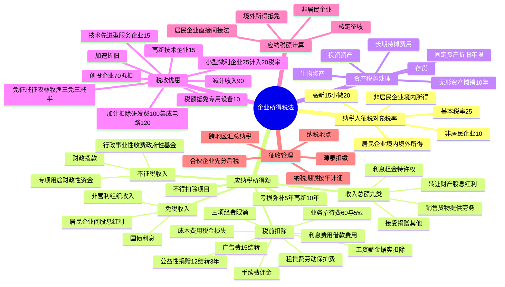

## 1. 章节定位

| 项目 | 信息 |
|------|------|
| 所属科目 | 税法 |
| 难度等级 | 5 |
| 历年分值 | 10-12 分 |
| 建议学时 | 12-15 小时 |
| 知识关联章节 | 第1章 税法总论、第5章 个人所得税法、第12章 国际税收、第14章 税收征收管理法 |

## 2. 考情分析

本章是税法科目的核心重点章，历年分值约 10-12 分，是分值最高的章节之一，必出计算问答题，并常在综合题中与增值税结合考查。本章内容庞杂、计算量大、政策性强，是决定税法科目能否通过的关键。

**命题规律**：本章考查综合运用能力，题型覆盖客观题、计算问答题和综合题。高频考点包括：居民企业与非居民企业的判定及纳税义务范围、应纳税所得额的计算（直接法与间接法）、税前扣除项目的范围与标准（业务招待费"60% 与 5‰"孰低、广告费 15% 结转扣除、职工福利费 14%、工会经费 2%、职工教育经费 8% 结转扣除、公益性捐赠 12% 结转 3 年、利息费用关联方债资比 2:1）、资产的税务处理（固定资产折旧年限、无形资产摊销不低于 10 年、长期待摊费用）、税收优惠（高新技术企业 15%、小型微利企业、研发费 100% 加计扣除、创投企业 70% 抵扣、专用设备 10% 税额抵免）、亏损弥补 5 年（高新/科技型中小企业 10 年）、应纳税额的计算与境外所得抵免、源泉扣缴、跨地区经营汇总纳税。

**复习建议**：本章学习应以"应纳税所得额计算"为核心，构建"收入总额—不征税/免税收入—扣除项目—亏损弥补"的计算链条。重点掌握间接计算法（会计利润±纳税调整），熟练运用各项扣除限额公式。税收优惠部分需分类记忆，注意优惠的适用条件与计算方法。建议通过大量练习题巩固扣除标准的计算，特别是业务招待费、广告费、公益性捐赠、研发费加计扣除的综合计算。

## 3. 知识框架

## 4. 核心精讲

### 4.1 纳税人、征税对象与税率

#### 4.1.1 纳税人

企业所得税的纳税人是在中华人民共和国境内的企业和其他取得收入的组织。**个人独资企业、合伙企业不适用《企业所得税法》**。纳税人分为居民企业和非居民企业：

| 类型 | 判定标准 | 纳税义务 |
|------|------|------|
| 居民企业 | 依法在中国境内成立，或依照外国（地区）法律成立但实际管理机构在中国境内 | 就来源于中国境内、境外的所得缴纳企业所得税 |
| 非居民企业 | 依照外国（地区）法律成立且实际管理机构不在中国境内，但在中国境内设立机构、场所的 | 就其所设机构、场所取得的来源于中国境内的所得，以及发生在中国境外但与其所设机构、场所有实际联系的所得缴纳企业所得税 |
| 非居民企业 | 在中国境内未设立机构、场所，或虽设立但取得的所得与所设机构、场所没有实际联系 | 就其来源于中国境内的所得缴纳企业所得税 |

实际管理机构是指对企业的生产经营、人员、账务、财产等实施实质性全面管理和控制的机构。

#### 4.1.2 所得来源的确定

1. 销售货物所得，按照交易活动发生地确定。
2. 提供劳务所得，按照劳务发生地确定。
3. 转让财产所得：不动产转让按不动产所在地；动产转让按转让动产的企业或机构、场所所在地；权益性投资资产转让按被投资企业所在地。
4. 股息、红利等权益性投资所得，按分配所得的企业所在地确定。
5. 利息所得、租金所得、特许权使用费所得，按负担、支付所得的企业或机构、场所所在地，或按负担、支付所得的个人住所地确定。

#### 4.1.3 税率

| 税率 | 适用对象 |
|------|------|
| 25%（基本税率） | 居民企业；在中国境内设有机构、场所且所得与机构、场所有关联的非居民企业 |
| 20%（实际征税 10%） | 在中国境内未设立机构、场所的，或虽设立但取得的所得与机构、场所没有实际联系的非居民企业 |
| 15%（优惠税率） | 国家需要重点扶持的高新技术企业；技术先进型服务企业；从事污染防治的第三方企业 |
| 20%（优惠税率） | 小型微利企业（减按 25% 计入应纳税所得额） |

### 4.2 应纳税所得额

应纳税所得额是企业每一个纳税年度的收入总额，减除不征税收入、免税收入、各项扣除以及允许弥补的以前年度亏损后的余额。

> 应纳税所得额 = 收入总额 − 不征税收入 − 免税收入 − 各项扣除金额 − 允许弥补的以前年度亏损

计算以权责发生制为原则。实际计算有两种方法：

- **直接计算法**：按上述公式直接计算。
- **间接计算法**：应纳税所得额 = 会计利润总额 ± 纳税调整项目金额。

#### 4.2.1 收入总额

企业收入总额包括 9 类：销售货物收入、提供劳务收入、转让财产收入、股息红利等权益性投资收益、利息收入、租金收入、特许权使用费收入、接受捐赠收入、其他收入。

**收入确认时间要点**：

| 收入类型 | 确认时间 |
|------|------|
| 股息、红利等权益性投资收益 | 按被投资方作出利润分配决定的日期确认 |
| 利息收入 | 按合同约定的债务人应付利息的日期确认 |
| 租金收入 | 按合同约定的承租人应付租金的日期确认（跨年度且提前一次性支付的，可分期均匀计入） |
| 特许权使用费收入 | 按合同约定的应付特许权使用费日期确认 |
| 接受捐赠收入 | 按实际收到捐赠资产的日期确认 |
| 分期收款销售货物 | 按合同约定的收款日期确认 |
| 持续时间超过 12 个月的劳务 | 按纳税年度内完工进度或完成的工作量确认 |
| 转让股权收入 | 于转让协议生效且完成股权变更手续时确认 |

**特殊收入确认**：

- 以分期收款方式销售货物的，按照合同约定的收款日期确认收入。
- 采取产品分成方式取得收入的，按照企业分得产品的日期确认收入，收入额按产品的公允价值确定。
- 企业发生非货币性资产交换，以及将货物、财产、劳务用于捐赠、偿债、赞助、集资、广告、样品、职工福利或利润分配等，应当视同销售货物、转让财产或提供劳务。
- 企业以买一赠一等方式组合销售本企业商品的，不属于捐赠，应将总销售金额按各项商品公允价值比例分摊确认各项销售收入。
- 非货币性资产投资对外投资确认的转让所得，可在不超过 5 年期限内分期均匀计入相应年度的应纳税所得额。

#### 4.2.2 不征税收入与免税收入

**不征税收入**（3 项）：

1. 财政拨款。
2. 依法收取并纳入财政管理的行政事业性收费、政府性基金。
3. 国务院规定的其他不征税收入（专项用途财政性资金）。

专项用途财政性资金需同时符合三个条件：①有专项用途的资金拨付文件；②有专门的资金管理办法；③单独进行核算。注意：不征税收入用于支出所形成的费用，不得扣除；用于支出所形成的资产，其折旧、摊销不得扣除。在 5 年（60 个月）内未发生支出且未缴回的部分，应计入取得该资金第 6 年的应税收入总额。

**免税收入**（4 项）：

1. 国债利息收入。
2. 符合条件的居民企业之间的股息、红利等权益性投资收益（指居民企业直接投资于其他居民企业取得的投资收益）。
3. 在中国境内设立机构、场所的非居民企业从居民企业取得与该机构、场所有实际联系的股息、红利等权益性投资收益（不包括连续持有居民企业公开发行并上市流通的股票不足 12 个月取得的投资收益）。
4. 符合条件的非营利组织的收入。

#### 4.2.3 税前扣除项目

扣除项目遵循权责发生制、配比、相关性、确定性、合理性五项原则。企业实际发生的与取得收入有关的、合理的支出，包括成本、费用、税金、损失和其他支出，准予扣除。税金是指除企业所得税和允许抵扣的增值税以外的各项税金及其附加（消费税、城建税、关税、资源税、土地增值税、房产税、车船税、城镇土地使用税、印花税、契税、教育费附加等）。

**扣除项目及标准**：

| 项目 | 扣除标准 | 超过部分处理 |
|------|------|------|
| 工资薪金 | 合理的据实扣除 | — |
| 职工福利费 | 不超过工资薪金总额 14% | 不得扣除 |
| 工会经费 | 不超过工资薪金总额 2% | 不得扣除 |
| 职工教育经费 | 不超过工资薪金总额 8% | 准予以后纳税年度结转扣除 |
| 社会保险费 | 五险一金据实扣除；补充养老、医疗在规定范围标准内扣除；财产保险费据实扣除；职工商业保险费不得扣除 | — |
| 利息费用 | 非金融企业向金融企业借款据实扣除；向非金融企业借款不超过金融企业同期同类贷款利率部分扣除 | 超过部分不得扣除 |
| 关联方利息 | 债资比：金融企业 5:1，其他企业 2:1 | 超过部分不得扣除（符合独立交易原则或实际税负不高于境内关联方的除外） |
| 借款费用 | 资本化部分计入资产成本；费用化部分据实扣除 | — |
| 业务招待费 | 按发生额 60% 扣除，最高不超过当年销售（营业）收入 5‰ | 超过部分不得扣除 |
| 广告费和业务宣传费 | 不超过当年销售（营业）收入 15% | 准予结转以后纳税年度扣除（化妆品制造/销售、医药制造、饮料制造 30%；烟草企业一律不得扣除） |
| 公益性捐赠 | 不超过年度利润总额 12% | 准予以后 3 年内结转扣除（先扣以前年度结转，再扣当年） |
| 环境保护专项资金 | 依法提取的据实扣除（改变用途不得扣除） | — |
| 租赁费 | 经营租赁按租赁期限均匀扣除；融资租赁按构成融资租入固定资产价值的部分提取折旧分期扣除 | — |
| 劳动保护费 | 合理的据实扣除 | — |
| 手续费及佣金 | 保险企业不超过当年全部保费收入扣除退保金后余额 18%（结转扣除）；其他企业不超过与中介服务机构或个人签订服务协议确认的收入金额 5% | 超过部分不得扣除（保险企业除外） |

**业务招待费计算示例**：某企业当年销售（营业）收入 6000 万元，发生业务招待费 32 万元。

- 按发生额 60%：32 × 60% = 19.2（万元）
- 按销售收入 5‰：6000 × 5‰ = 30（万元）
- 税前扣除限额 = min(19.2, 30) = 19.2（万元）
- 调增应纳税所得额 = 32 − 19.2 = 12.8（万元）

#### 4.2.4 不得扣除的项目

在计算应纳税所得额时，下列支出不得扣除：

1. 向投资者支付的股息、红利等权益性投资收益款项。
2. 企业所得税税款。
3. 税收滞纳金。
4. 罚金、罚款和被没收财物的损失。
5. 超过规定标准的捐赠支出。
6. 赞助支出（与生产经营活动无关的各种非广告性质支出）。
7. 未经核定的准备金支出。
8. 企业之间支付的管理费、企业内营业机构之间支付的租金和特许权使用费，以及非银行企业内营业机构之间支付的利息。
9. 与取得收入无关的其他支出。

#### 4.2.5 亏损弥补

- 企业某一纳税年度发生的亏损可以用下一年度的所得弥补，下一年度所得不足以弥补的，可以逐年延续弥补，但**最长不得超过 5 年**。
- 自 2018 年 1 月 1 日起，当年具备高新技术企业或科技型中小企业资格的企业，其具备资格年度之前 5 个年度发生的尚未弥补完的亏损，最长结转年限由 5 年延长至 **10 年**。
- 企业在汇总计算缴纳企业所得税时，其**境外营业机构的亏损不得抵减境内营业机构的盈利**。
- 企业筹办期间不计算为亏损年度，筹办费用可在开始经营之日当年一次性扣除，或按长期待摊费用处理。

### 4.3 资产的税务处理

资产均以历史成本为计税基础。企业持有各项资产期间资产增值或减值，除另有规定外，不得调整该资产的计税基础。

#### 4.3.1 固定资产

**计税基础**：外购的以购买价款和支付的相关税费等为计税基础；自行建造的以竣工结算前发生的支出为计税基础；融资租入的以租赁合同约定的付款总额和承租人发生的相关费用为计税基础。

**不得计算折旧扣除的固定资产**：①房屋、建筑物以外未投入使用的固定资产；②以经营租赁方式租入的固定资产；③以融资租赁方式租出的固定资产；④已足额提取折旧仍继续使用的固定资产；⑤与经营活动无关的固定资产；⑥单独估价作为固定资产入账的土地。

**折旧方法**：按照直线法计算的折旧准予扣除。自投入使用月份的次月起计算折旧；停止使用的自停止使用月份的次月起停止计算折旧。预计净残值一经确定不得变更。

**折旧最低年限**：

| 资产类别 | 最低折旧年限 |
|------|------|
| 房屋、建筑物 | 20 年 |
| 飞机、火车、轮船、机器、机械和其他生产设备 | 10 年 |
| 与生产经营活动有关的器具、工具、家具等 | 5 年 |
| 飞机、火车、轮船以外的运输工具 | 4 年 |
| 电子设备 | 3 年 |

#### 4.3.2 生物资产

生产性生物资产按照直线法计算的折旧准予扣除。最低折旧年限：林木类 10 年；畜类 3 年。

#### 4.3.3 无形资产

无形资产摊销采取直线法，摊销年限不得低于 10 年。不得计算摊销费用扣除的无形资产：①自行开发的支出已在计算应纳税所得额时扣除的无形资产；②自创商誉；③与经营活动无关的无形资产。外购商誉的支出，在企业整体转让或清算时准予扣除。

#### 4.3.4 长期待摊费用

下列支出作为长期待摊费用按规摊销扣除：①已足额提取折旧的固定资产的改建支出（按尚可使用年限摊销）；②租入固定资产的改建支出（按剩余租赁期限摊销）；③固定资产的大修理支出（修理支出达到取得固定资产时计税基础 50% 以上，且修理后使用年限延长 2 年以上，按尚可使用年限摊销）；④其他长期待摊费用（摊销年限不低于 3 年）。

#### 4.3.5 存货与投资资产

存货成本计算方法可在先进先出法、加权平均法、个别计价法中选用一种，一经选用不得随意变更。投资资产成本在对外投资期间不得扣除，在转让或处置投资资产时准予扣除。

### 4.4 税收优惠

税收优惠方式包括免税、减税、加计扣除、加速折旧、减计收入、税额抵免等。

#### 4.4.1 免征与减征优惠

| 优惠项目 | 政策 |
|------|------|
| 农、林、牧、渔业 | 蔬菜、谷物等种植、牲畜饲养等免征；花卉、茶等种植、海水养殖、内陆养殖减半征收 |
| 国家重点扶持的公共基础设施项目 | 自项目取得第一笔生产经营收入所属纳税年度起，第一年至第三年免征，第四年至第六年减半征收（三免三减半） |
| 环境保护、节能节水项目 | 三免三减半 |
| 符合条件的技术转让所得 | 一个纳税年度内，居民企业技术转让所得不超过 500 万元的部分免征；超过 500 万元的部分减半征收 |
| 生产和装配伤残人员专门用品企业 | 至 2027 年 12 月 31 日免征 |
| 经营性文化事业单位转制为企业 | 自转制注册之日起五年内免征 |

#### 4.4.2 高新技术企业优惠

国家需要重点扶持的高新技术企业减按 15% 税率征收企业所得税。认定条件（同时符合）：注册成立一年以上；拥有核心自主知识产权；科技人员占职工总数比例不低于 10%；近 3 个会计年度研发费用占销售收入比例符合要求（销售收入 5000 万元以下不低于 5%，5000 万至 2 亿元不低于 4%，2 亿元以上不低于 3%，且境内研发费用占比不低于 60%）；高新技术产品（服务）收入占同期总收入比例不低于 60%。

#### 4.4.3 小型微利企业优惠

自 2023 年 1 月 1 日至 2027 年 12 月 31 日，对小型微利企业减按 25% 计入应纳税所得额，按 20% 税率缴纳企业所得税（即实际税负 5%）。

小型微利企业条件（同时符合）：从事国家非限制和禁止行业；年度应纳税所得额不超过 300 万元；从业人数不超过 300 人；资产总额不超过 5000 万元。

#### 4.4.4 加计扣除优惠

| 加计扣除项目 | 政策 |
|------|------|
| 研发费用（一般企业） | 未形成无形资产的，按实际发生额 100% 加计扣除；形成无形资产的，按成本 200% 摊销（自 2023 年 1 月 1 日起） |
| 研发费用（集成电路和工业母机企业） | 未形成无形资产的，按 120% 加计扣除；形成无形资产的，按成本 220% 摊销（2023 年至 2027 年） |
| 委托外部研发 | 按费用实际发生额 80% 计入委托方研发费用并计算加计扣除 |
| 委托境外研发 | 不超过境内符合条件研发费用 2/3 部分，可按规定加计扣除 |
| 出资基础研究 | 按实际发生额 100% 税前加计扣除 |

不适用加计扣除的行业：烟草制造业、住宿和餐饮业、批发和零售业、房地产业、租赁和商务服务业、娱乐业。

#### 4.4.5 其他优惠

- **创投企业优惠**：采取股权投资方式直接投资于初创科技型企业满 2 年的，可按投资额 70% 抵扣股权持有满 2 年的当年的应纳税所得额；当年不足抵扣的可结转抵扣。
- **加速折旧**：技术进步、产品更新换代较快或常年处于强震动、高腐蚀状态的固定资产可缩短折旧年限（不低于规定年限 60%）或采取加速折旧（双倍余额递减法或年数总和法）。2024 年至 2027 年新购进的设备、器具（除房屋、建筑物外）单位价值不超过 500 万元的，允许一次性计入当期成本费用扣除。
- **减计收入**：综合利用资源生产符合规定产品取得的收入减按 90% 计入；金融机构农户小额贷款利息收入、保险公司种植业养殖业保费收入减按 90% 计入。
- **税额抵免**：购置并实际使用环境保护、节能节水、安全生产专用设备的，投资额 10% 可从当年应纳税额中抵免；当年不足抵免的可结转以后 5 个纳税年度抵免。

### 4.5 应纳税额的计算

#### 4.5.1 居民企业应纳税额的计算

> 应纳税额 = 应纳税所得额 × 适用税率 − 减免税额 − 抵免税额

实际中多采用间接计算法：应纳税所得额 = 会计利润总额 ± 纳税调整项目金额。

#### 4.5.2 境外所得抵扣税额

企业取得的境外所得已在境外缴纳的所得税税额，可以从其当期应纳税额中抵免，抵免限额为该项所得依照本法规定计算的应纳税额；超过抵免限额的部分，可以在以后 5 个年度内，用每年度抵免限额抵免当年应抵税额后的余额进行抵补。（详细内容见第 12 章国际税收）

#### 4.5.3 核定征收

纳税人具有下列情形之一的，税务机关可核定征收企业所得税：①依照法律、行政法规可以不设置账簿的；②应当设置但未设置账簿的；③擅自销毁账簿或拒不提供纳税资料的；④虽设置账簿但账目混乱难以查账的；⑤未按期申报经责令限期申报逾期仍不申报的；⑥申报计税依据明显偏低又无正当理由的。

核定征收方式：应纳所得税额 = 应纳税所得额 × 适用税率；应纳税所得额 = 应税收入额 × 应税所得率，或 = 成本（费用）支出额 ÷ (1 − 应税所得率) × 应税所得率。

应税所得率幅度标准：农、林、牧、渔业 3%-10%；制造业 5%-15%；批发和零售贸易业 4%-15%；交通运输业 7%-15%；建筑业 8%-20%；饮食业 8%-25%；娱乐业 15%-30%；其他行业 10%-30%。

#### 4.5.4 非居民企业应纳税额的计算

对于在中国境内未设立机构、场所的，或虽设立但取得的所得与机构、场所没有实际联系的非居民企业：

- 股息、红利等权益性投资收益和利息、租金、特许权使用费所得，以**收入全额**为应纳税所得额。
- 转让财产所得，以收入全额减除财产净值后的余额为应纳税所得额。
- 其他所得，参照上述方法计算。

扣缴企业所得税应纳税额 = 应纳税所得额 × 实际征收率（通常为 10%）。

### 4.6 征收管理

#### 4.6.1 纳税地点

- 居民企业以企业登记注册地为纳税地点；登记注册地在境外的，以实际管理机构所在地为纳税地点。
- 居民企业在中国境内设立不具有法人资格营业机构的，应当汇总计算并缴纳企业所得税。
- 非居民企业在中国境内设立机构、场所的，以机构、场所所在地为纳税地点。
- 非居民企业在中国境内未设立机构、场所的，或所得与机构、场所没有实际联系的，以扣缴义务人所在地为纳税地点。
- 除国务院另有规定外，企业之间不得合并缴纳企业所得税。

#### 4.6.2 纳税期限

企业所得税按年计征，分月或者分季预缴，年终汇算清缴，多退少补。纳税年度自公历 1 月 1 日起至 12 月 31 日止。企业可自年度终了之日起 **5 个月内**向税务机关报送年度企业所得税纳税申报表并汇算清缴。企业在年度中间终止经营活动的，应自实际经营终止之日起 **60 日内**办理当期汇算清缴。

#### 4.6.3 纳税申报

按月或按季预缴的，应自月份或季度终了之日起 **15 日内**向税务机关报送预缴申报表预缴税款。企业在纳税年度内无论盈利或亏损，都应依法报送申报表。

#### 4.6.4 源泉扣缴

对非居民企业在中国境内未设立机构、场所的，或虽设立但取得的所得与机构、场所没有实际联系的所得应缴纳的企业所得税，实行源泉扣缴，以支付人为扣缴义务人。扣缴义务人每次代扣的税款，应自代扣之日起 **7 日内**缴入国库。

#### 4.6.5 跨地区经营汇总纳税

属于中央与地方共享范围的跨省市总分机构企业，实行"统一计算、分级管理、就地预缴、汇总清算、财政调库"的处理办法。总分机构统一计算的当期应纳税额的地方分享部分中，25% 由总机构所在地分享，50% 由各分支机构所在地分享，25% 按一定比例在各地间分配。

- 总机构就地预缴 25%；各分支机构分摊预缴 50%（按营业收入 0.35、职工薪酬 0.35、资产总额 0.30 三因素分摊）；其余 25% 全额缴入中央国库。
- 分支机构分摊税款 = 所有分支机构分摊税款总额 × 该分支机构分摊比例。

#### 4.6.6 合伙企业所得税

合伙企业以每一个合伙人为纳税义务人。合伙人是自然人的缴纳个人所得税；是法人和其他组织的缴纳企业所得税。合伙企业生产经营所得和其他所得采取**先分后税**原则。合伙企业合伙人不得用合伙企业的亏损抵减其盈利。

## 5. 典型例题

### 例 1：综合计算（间接法）

某企业为居民企业，2025 年发生经营业务如下：(1) 取得产品销售收入 6000 万元；(2) 应结转产品销售成本 4000 万元；(3) 发生销售费用 1000 万元（其中广告费 950 万元），管理费用 400 万元（其中业务招待费 32 万元），财务费用 60 万元；(4) 税金及附加 80 万元；(5) 营业外收入 100 万元，营业外支出 70 万元（含通过公益性社会团体向贫困山区捐款 60 万元，支付税收滞纳金 10 万元）；(6) 计入成本费用中的实发工资总额 300 万元、拨缴工会经费 7 万元、发生职工福利费 45 万元、发生职工教育经费 30 万元。计算该企业 2025 年度实际应缴纳的企业所得税。

**解答**：

1. 会计利润总额 = 6000 − 4000 − 1000 − 400 − 60 − 80 + 100 − 70 = 490（万元）
2. 广告费扣除限额 = 6000 × 15% = 900（万元），实际 950 万元，调增 50 万元
3. 业务招待费：32 × 60% = 19.2（万元），6000 × 5‰ = 30（万元），扣除限额 19.2 万元，调增 32 − 19.2 = 12.8（万元）
4. 公益性捐赠扣除限额 = 490 × 12% = 58.8（万元），实际 60 万元，调增 1.2 万元
5. 税收滞纳金不得扣除，调增 10 万元
6. 工会经费扣除限额 = 300 × 2% = 6（万元），实际 7 万元，调增 1 万元
7. 职工福利费扣除限额 = 300 × 14% = 42（万元），实际 45 万元，调增 3 万元
8. 职工教育经费扣除限额 = 300 × 8% = 24（万元），实际 30 万元，调增 6 万元
9. 应纳税所得额 = 490 + 50 + 12.8 + 1.2 + 10 + 1 + 3 + 6 = 574（万元）
10. 应缴纳企业所得税 = 574 × 25% = 143.5（万元）

### 例 2：研发费加计扣除与免税收入

某制造业企业为居民企业，2025 年度发生经营业务如下：(1) 全年取得产品销售收入 5600 万元、其他业务收入 800 万元，取得购买国债的利息收入 40 万元；(2) 发生产品销售成本 3800 万元、其他业务成本 694 万元，缴纳税金及附加 300 万元；(3) 发生管理费用 760 万元（含新技术研发费用 120 万元、业务招待费 70 万元），财务费用 200 万元；(4) 取得直接投资其他居民企业的权益性收益 34 万元；(5) 取得营业外收入 100 万元，发生营业外支出 250 万元（含公益捐赠 80 万元）。计算该企业 2025 年应缴纳的企业所得税。

**解答**：

1. 利润总额 = 5600 + 800 + 40 + 34 + 100 − 3800 − 694 − 300 − 760 − 200 − 250 = 570（万元）
2. 国债利息收入免税，调减 40 万元
3. 技术研发费加计扣除，调减 120 × 100% = 120（万元）
4. 业务招待费：70 × 60% = 42（万元），(5600 + 800) × 5‰ = 32（万元），扣除限额 32 万元，调增 70 − 32 = 38（万元）
5. 直接投资其他居民企业权益性收益免税，调减 34 万元
6. 公益捐赠扣除限额 = 570 × 12% = 68.4（万元），实际 80 万元，调增 11.6 万元
7. 应纳税所得额 = 570 − 40 − 120 + 38 − 34 + 11.6 = 425.6（万元）
8. 应缴纳企业所得税 = 425.6 × 25% = 106.4（万元）

### 例 3：小型微利企业与专用设备抵免

某小型企业，职工 100 人，资产总额 4000 万元。2025 年度生产经营业务如下：(1) 取得产品销售收入 3000 万元、国债利息收入 20 万元；(2) 应扣除与产品销售收入配比的成本 1900 万元；(3) 发生销售费用 252 万元、管理费用 390 万元（其中业务招待费 28 万元、新产品研发费用 148 万元）；(4) 向非金融企业借款 200 万元，支付年利息费用 18 万元（金融企业同期同类借款年利息率为 6%）；(5) 企业所得税税前准许扣除的税金及附加 20 万元；(6) 10 月购进符合《环境保护专用设备企业所得税优惠目录》的专用设备，取得增值税专用发票注明金额 30 万元、增值税进项税额 3.9 万元，该设备当月投入使用；(7) 计入成本费用中的实发工资总额 200 万元、拨缴工会经费 4 万元、发生职工福利费 35 万元、发生职工教育经费 10 万元。计算该企业 2025 年度应缴纳的企业所得税。

**解答**：

1. 会计利润总额 = 3000 + 20 − 1900 − 252 − 390 − 18 − 20 = 440（万元）
2. 国债利息收入免税，调减 20 万元
3. 业务招待费：28 × 60% = 16.8（万元），3000 × 5‰ = 15（万元），扣除限额 15 万元，调增 28 − 15 = 13（万元）
4. 新产品研发费加计扣除，调减 148 × 100% = 148（万元）
5. 利息费用扣除限额 = 200 × 6% = 12（万元），实际 18 万元，调增 6 万元
6. 工会经费扣除限额 = 200 × 2% = 4（万元），实际 4 万元，无需调整
7. 职工福利费扣除限额 = 200 × 14% = 28（万元），实际 35 万元，调增 7 万元
8. 职工教育经费扣除限额 = 200 × 8% = 16（万元），实际 10 万元，无需调整
9. 应纳税所得额 = 440 − 20 + 13 − 148 + 6 + 7 = 298（万元）
10. 符合小型微利企业条件（应纳税所得额 298 万元 ≤ 300 万元），减按 25% 计入：298 × 25% × 20% = 14.9（万元）
11. 环保专用设备投资额 30 万元，税额抵免 = 30 × 10% = 3（万元）
12. 实际应缴纳企业所得税 = 14.9 − 3 = 11.9（万元）

### 例 4：技术转让所得

某居民企业 2025 年符合条件的技术转让收入 800 万元，技术转让成本 200 万元，相关税费 50 万元。计算该企业技术转让所得应缴纳的企业所得税。

**解答**：

1. 技术转让所得 = 技术转让收入 − 技术转让成本 − 相关税费 = 800 − 200 − 50 = 550（万元）
2. 不超过 500 万元的部分免征企业所得税；超过 500 万元的部分减半征收。
3. 应纳税所得额 = (550 − 500) × 50% = 25（万元）
4. 应缴纳企业所得税 = 25 × 25% = 6.25（万元）

### 例 5：非居民企业源泉扣缴

某非居民企业在中国境内未设立机构、场所，2025 年从中国境内企业取得特许权使用费收入 100 万元（不含增值税），取得股息红利收入 50 万元。计算该非居民企业应缴纳的企业所得税。

**解答**：

1. 特许权使用费以收入全额为应纳税所得额，应纳税额 = 100 × 10% = 10（万元）
2. 股息红利以收入全额为应纳税所得额，应纳税额 = 50 × 10% = 5（万元）
3. 合计应缴纳企业所得税 = 10 + 5 = 15（万元）

### 例 6：创业投资企业抵扣

某创业投资企业 2023 年采取股权投资方式投资于未上市的中小高新技术企业 500 万元，2025 年股权持有满 2 年。该企业 2025 年应纳税所得额为 1000 万元（未考虑创投抵扣）。计算该企业 2025 年应缴纳的企业所得税。

**解答**：

1. 投资额 70% 可抵扣应纳税所得额 = 500 × 70% = 350（万元）
2. 抵扣后应纳税所得额 = 1000 − 350 = 650（万元）
3. 应缴纳企业所得税 = 650 × 25% = 162.5（万元）

### 例 7：固定资产折旧年限

某企业 2025 年 1 月购入一台生产设备，计税基础 120 万元，税法规定最低折旧年限 10 年，预计净残值为 0。该企业会计按 5 年直线法计提折旧。计算 2025 年该设备折旧的纳税调整金额。

**解答**：

1. 会计折旧 = 120 ÷ 5 = 24（万元/年）
2. 税法折旧 = 120 ÷ 10 = 12（万元/年）
3. 会计折旧高于税法折旧部分应调增应纳税所得额 = 24 − 12 = 12（万元）

## 6. 记忆口诀

1. **纳税人两类分**：居民企业境内境外全征税，非居民企业只征境内得；个人独资合伙不适用。

2. **税率三档记**：基本 25%，非居民 10%，高新 15%、小微 20%（减按 25% 计入实际 5%）。

3. **应纳税所得额公式**：收入总额减不征税，再减免税和扣除，最后减亏损弥补。

4. **三项经费限额口诀**：福利 14、工会 2、教育 8（结转），工资薪金总额为基数。

5. **业务招待费双限**：发生额 60% 与销售 5‰，孰低扣除，超过不得扣。

6. **广告费 15% 结转**：一般 15% 可结转，化妆品医药饮料 30%，烟草一律不得扣。

7. **公益性捐赠 12%**：年度利润总额 12% 内扣除，超过向后结转 3 年，先扣旧再扣新。

8. **不得扣除九项**：股息红利、所得税款、税收滞纳金、罚金罚款没收、超标准捐赠、赞助、未核定准备金、企业内管理费租金利息、无关支出。

9. **固定资产折旧年限口诀**：房屋 20、生产 10、器具 5、运输 4、电子 3。

10. **亏损弥补年限**：一般 5 年，高新/科技型中小企业 10 年；境外亏损不得抵境内盈利。

11. **研发费加计扣除**：一般 100%、集成电路工业母机 120%；委托外部按 80% 计入；委托境外不超过境内 2/3。

12. **税收优惠口诀**：农林牧渔免减半，公共基建环保三免三减半，技术转让 500 万免超减半，高新 15%，小微 25% 计入 20% 税率，创投 70% 抵扣，专用设备 10% 抵免。

13. **纳税期限口诀**：按年计征分月季预缴，年度终了 5 个月汇算清缴，月季终了 15 日预缴，终止经营 60 日汇算。

14. **源泉扣缴 7 日**：扣缴义务人代扣税款 7 日内缴入国库，以支付人为扣缴义务人。

15. **跨地区汇总纳税分摊**：总机构 25%、分支机构 50%（三因素 0.35+0.35+0.30）、中央国库 25%。

16. **合伙企业先分后税**：合伙人为纳税义务人，自然人缴个税，法人缴企税，亏损不得互抵。

17. **小型微利企业条件**：所得额 300 万、从业 300 人、资产 5000 万，非限制禁止行业。
