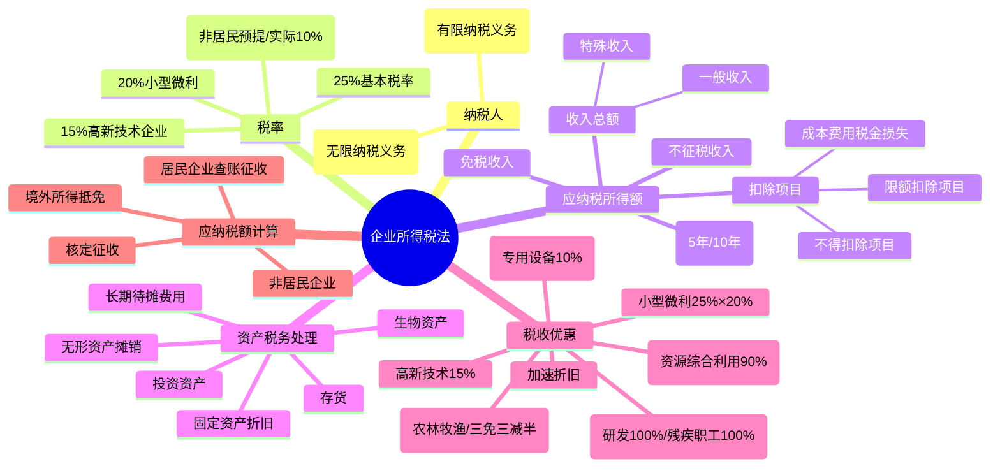

## 📍 章节定位

| 项目 | 信息 |
|------|------|
| **所属科目** | 💰 税法 |
| **难度等级** | ⭐⭐⭐⭐⭐ |
| **历年分值** | 10-12分 |
| **建议学时** | 12-15h |

## 📝 考情分析

企业所得税是税法考试的分值大户，历年稳定在 10-12 分。题型以综合题为主，常与增值税、城建税及教育费附加组合出题。命题主线为"会计利润→纳税调整→应纳税所得额→应纳税额"，要求考生熟练掌握收入确认、扣除限额、资产税务处理、税收优惠四大板块。

高频考点：① 不征税收入与免税收入的区分（财政拨款、行政事业性收费、专项用途财政性资金、国债利息、居民企业间股息红利等）；② 扣除限额计算（业务招待费 60% 与 5‰孰低、广告费 15%/30%、职工福利费 14%、工会经费 2%、职工教育经费 8%、公益性捐赠 12%、研发费加计扣除 100%/120%）；③ 不得扣除项目（股息红利、税款、滞纳金、罚金罚款、赞助、未经核定准备金等）；④ 资产税务处理（固定资产折旧最低年限、生物资产、无形资产摊销、长期待摊费用）；⑤ 税收优惠（高新技术 15%、小微 25%×20%、研发加计扣除、创投抵扣、专用设备投资额 10% 抵免）；⑥ 境外所得抵免。

易错点：业务招待费计算基数（含主营业务收入+其他业务收入，不含营业外收入和投资收益）；公益性捐赠的三年结转扣除顺序（先扣除以前年度结转、再扣除当年）；职工教育经费超过限额可结转以后年度；广告费超过限额可结转；研发费加计扣除行业排除范围；专用设备投资额抵免中增值税进项税额是否可抵扣的影响。

## 🧠 知识框架

## 📖 核心精讲

### 一、纳税人、征税对象与税率

**纳税人**：在境内成立或实际管理机构在境内的企业（居民企业）；依照外国法律成立且实际管理机构不在境内但在中国境内设立机构场所，或有来源于境内所得的企业（非居民企业）。个人独资企业、合伙企业不适用企业所得税法。

**征税对象**：居民企业就境内境外所得纳税；非居民企业仅就境内所得（设立机构场所的，加上与场所有实际联系的境外所得）纳税。

**所得来源判定**：
- 销售货物所得→交易活动发生地；
- 提供劳务所得→劳务发生地；
- 不动产转让→不动产所在地；动产转让→转让企业所在地；权益性投资资产转让→被投资企业所在地；
- 股息红利→分配所得企业所在地；
- 利息、租金、特许权使用费→负担支付所得的企业或机构场所所在地。

**税率**：

| 税率 | 适用对象 |
|------|----------|
| **25%** | 居民企业；境内有机构场所且所得与场所有关联的非居民企业 |
| **20%（实际 10%）** | 境内未设立机构场所的，或虽设立但所得与场所无实际联系的非居民企业 |
| **15%** | 国家重点扶持的高新技术企业；技术先进型服务企业；符合条件的第三方防治企业 |
| **20%（实际 25%×20%）** | 小型微利企业 |

### 二、应纳税所得额

**基本公式**：

$$\text{应纳税所得额} = \text{收入总额} - \text{不征税收入} - \text{免税收入} - \text{各项扣除} - \text{允许弥补的以前年度亏损}$$

#### （一）收入总额

9 项收入：销售货物、提供劳务、转让财产、股息红利等权益性投资收益、利息、租金、特许权使用费、接受捐赠、其他收入。

**收入的确认时间**：

| 收入类型 | 确认时间 |
|---------|---------|
| 股息红利 | 被投资方作出利润分配决定的日期 |
| 利息收入 | 合同约定的债务人应付利息日期 |
| 租金收入 | 合同约定的承租人应付租金日期（提前一次性支付可分期均匀计入） |
| 特许权使用费 | 合同约定的应付特许权使用费日期 |
| 接受捐赠 | 实际收到捐赠资产日期 |
| 分期收款销售货物 | 合同约定的收款日期 |
| 持续 12 个月以上的劳务 | 纳税年度内完工进度或工作量 |

**视同销售**：资产移送他人用于市场推广、交际应酬、职工奖励或福利、股息分配、对外捐赠等改变所有权属的，按被移送资产的公允价值确定销售收入。

#### （二）不征税收入与免税收入

**不征税收入**（永久不征税，对应支出不得扣除）：
1. 财政拨款；
2. 依法收取并纳入财政管理的行政事业性收费、政府性基金；
3. 国务院规定的其他不征税收入（专项用途财政性资金，需同时满足：有专项用途资金拨付文件、有专门资金管理办法、单独核算；5 年（60 个月）内未支出也未缴回的部分，应计入第 6 年应税收入总额）。

**免税收入**（永久免税，对应支出可扣除）：
1. 国债利息收入；
2. 符合条件的居民企业之间的股息、红利等权益性投资收益；
3. 境内设立机构场所的非居民企业从居民企业取得与该机构场所有实际联系的股息红利（不含连续持有居民企业公开发行并上市流通的股票不足 12 个月取得的投资收益）；
4. 符合条件的非营利组织的收入。

#### （三）税前扣除项目及标准

**扣除原则**：权责发生制、配比、相关性、确定性、合理性。

**扣除范围**：成本、费用、税金（除企业所得税和允许抵扣的增值税外的各项税金及附加）、损失、其他支出。

**重点扣除限额一览表**：

| 项目 | 扣除标准 | 超过部分处理 |
|------|----------|--------------|
| 工资薪金 | 合理的据实扣除 | — |
| 职工福利费 | 不超过工资薪金总额 14% | 不得扣除 |
| 工会经费 | 不超过工资薪金总额 2% | 不得扣除 |
| 职工教育经费 | 不超过工资薪金总额 8% | 结转以后年度扣除 |
| 社会保险费 | 按规定范围和标准 | — |
| 补充养老/医疗保险 | 国务院财税主管部门规定范围和标准内 | 不得扣除 |
| 利息费用（非金融向非金融） | 不超过金融企业同期同类贷款利率 | 不得扣除 |
| 关联方利息（非金融企业） | 债权性投资/权益性投资 ≤ 2:1（金融企业 5:1） | 不得扣除 |
| 业务招待费 | 实际发生额 60% 与销售（营业）收入 5‰孰低 | 不得扣除 |
| 广告费和业务宣传费 | 不超过销售（营业）收入 15%（化妆品、医药、饮料 30%；烟草不得扣除） | 结转以后年度扣除 |
| 公益性捐赠 | 不超过年度利润总额 12% | 结转以后 3 年内扣除 |
| 手续费及佣金（保险企业） | 当年全部保费收入扣除退保金后余额 18% | 结转以后年度扣除 |
| 手续费及佣金（其他企业） | 服务协议确认收入金额 5% | 不得扣除 |

**不得扣除项目**：
1. 向投资者支付的股息、红利等权益性投资收益款项；
2. 企业所得税税款；
3. 税收滞纳金；
4. 罚金、罚款和被没收财物的损失；
5. 超过规定标准的捐赠支出；
6. 赞助支出（非广告性质）；
7. 未经核定的准备金支出；
8. 企业之间支付的管理费、企业内营业机构之间支付的租金和特许权使用费、非银行企业内营业机构之间支付的利息；
9. 与取得收入无关的其他支出。

**亏损弥补**：一般亏损最长结转 5 年；高新技术企业、科技型中小企业可延长至 10 年；2020 年困难行业（交通、餐饮、住宿、旅游）亏损延长至 8 年。境外营业机构亏损不得抵减境内营业机构盈利。

### 三、资产的税务处理

#### （一）固定资产

**计税基础**：外购的以购买价款和支付的相关税费为计税基础；自行建造的以竣工结算前发生的支出为计税基础；融资租入的以租赁合同约定的付款总额和相关费用为计税基础；通过捐赠、投资、非货币性资产交换、债务重组取得的以公允价值和支付的相关税费为计税基础。

**折旧方法**：直线法。自投入使用月份的次月起计算折旧；停止使用的自停止使用月份的次月起停止计算折旧。

**最低折旧年限**：

| 资产类别 | 最低年限 |
|---------|---------|
| 房屋、建筑物 | 20 年 |
| 飞机、火车、轮船、机器、机械和其他生产设备 | 10 年 |
| 与生产经营有关的器具、工具、家具 | 5 年 |
| 飞机、火车、轮船以外的运输工具 | 4 年 |
| 电子设备 | 3 年 |

**不得计提折旧的固定资产**：房屋建筑物以外未投入使用的；经营租赁租入的；融资租赁租出的；已足额提取折旧仍继续使用的；与经营活动无关的；单独估价作为固定资产入账的土地。

**加速折旧**：技术进步、产品更新换代较快；常年处于强震动、高腐蚀状态。缩短年限不得低于规定年限的 60%；加速方法可采用双倍余额递减法或年数总和法。2024-2027 年新购进的设备、器具（除房屋建筑物以外的固定资产）单位价值不超过 500 万元的，允许一次性计入当期成本费用扣除。

#### （二）生产性生物资产

最低折旧年限：林木类 10 年；畜类 3 年。直线法折旧。

#### （三）无形资产

摊销年限不得低于 10 年；外购商誉的支出在企业整体转让或清算时准予扣除。不得摊销扣除：自行开发支出已在计算应纳税所得额时扣除的无形资产、自创商誉、与经营活动无关的无形资产。

#### （四）长期待摊费用

已足额提取折旧的固定资产改建支出、租入固定资产改建支出、固定资产大修理支出（修理支出达到计税基础 50% 以上且修理后使用年限延长 2 年以上）按尚可使用年限分期摊销；其他长期待摊费用摊销年限不低于 3 年。

### 四、税收优惠

**免征与减征**：
- 农林牧渔：蔬菜谷物等种植、牲畜家禽饲养、远洋捕捞等免征；花卉、茶、海水养殖、内陆养殖减半征收；
- 公共基础设施项目、环保节能节水项目：自取得第一笔生产经营收入年度起"三免三减半"；
- 技术转让所得：一个纳税年度内不超过 500 万元的部分免征，超过 500 万元的部分减半征收；
- 经营性文化事业单位转制为企业：自转制注册之日起 5 年内免征。

**低税率优惠**：
- 高新技术企业 15%：拥有核心自主知识产权，研发费占比符合 5%/4%/3% 档位，高新技术产品收入占比 ≥ 60%，科技人员占比 ≥ 10% 等；
- 小型微利企业：年应纳税所得额 ≤ 300 万元、从业人数 ≤ 300 人、资产总额 ≤ 5000 万元，减按 25% 计算应纳税所得额，按 20% 税率缴纳（即实际税负 5%）；
- 技术先进型服务企业 15%；符合条件的第三方防治企业 15%。

**加计扣除**：
- 研发费用：未形成无形资产的，按实际发生额 100% 加计扣除；形成无形资产的，按成本 200% 摊销。集成电路和工业母机企业按 120%/220% 扣除。排除行业：烟草制造业、住宿和餐饮业、批发和零售业、房地产业、租赁和商务服务业、娱乐业。
- 安置残疾人员所支付工资：按支付给残疾职工工资的 100% 加计扣除。

**创业投资抵扣**：采取股权投资方式投资于未上市的中小高新技术企业满 2 年（24 个月）的，按投资额 70% 抵扣持有满 2 年当年的应纳税所得额；不足抵扣的以后年度结转。

**加速折旧**：见上文资产税务处理。

**减计收入**：综合利用资源生产符合国家产业政策产品取得的收入减按 90% 计入；金融机构农户小额贷款利息收入、保险公司种植业养殖业保费收入减按 90% 计入。

**税额抵免**：购置并实际使用《环境保护专用设备》《节能节水专用设备》《安全生产专用设备》优惠目录规定的专用设备，投资额 10% 可从企业当年应纳税额中抵免；当年不足抵免的，以后 5 个纳税年度结转抵免。专用设备数字化智能化改造投入不超过原计税基础 50% 部分，按 10% 抵免当年应纳税额。注意：增值税进项税额允许抵扣的，专用设备投资额不包括进项税额；不允许抵扣的，为价税合计金额。

### 五、应纳税额的计算

**居民企业查账征收**：

$$\text{应纳税额} = \text{应纳税所得额} \times \text{适用税率} - \text{减免税额} - \text{抵免税额}$$

**境外所得抵免**：分国（地区）不分项计算。抵免限额 = 境内境外所得按我国税法计算的应纳税总额 × 来源于某国（地区）的应纳税所得额 ÷ 境内境外应纳税所得总额。实际已在境外缴纳的税额低于限额的据实抵免，超过限额的当年不得抵免，以后年度结转（不超过 5 年）。

**核定征收**：

$$\text{应纳所得税额} = \text{应纳税所得额} \times \text{适用税率}$$

$$\text{应纳税所得额} = \text{应税收入额} \times \text{应税所得率}$$

或：

$$\text{应纳税所得额} = \frac{\text{成本（费用）支出额}}{1 - \text{应税所得率}} \times \text{应税所得率}$$

应税所得率：农、林、牧、渔业 3%-10%；制造业 5%-15%；批发零售 4%-15%；交通运输 7%-15%；建筑业 8%-20%；饮食业 8%-25%；娱乐业 15%-30%；其他行业 10%-30%。

**非居民企业应纳税所得额**：
- 股息红利、利息、租金、特许权使用费：以收入全额为应纳税所得额；
- 转让财产所得：以收入全额减除财产净值后的余额为应纳税所得额。

### 六、征收管理

按月或按季预缴，年度汇算清缴。企业应自月份或季度终了之日起 15 日内预缴；年度终了之日起 5 个月内汇算清缴，结清应缴应退税款。

## 💡 典型例题

**【例题 1】（教材例 4-4 改编）**
某制造业居民企业 2025 年度：产品销售收入 5600 万元、其他业务收入 800 万元、国债利息 40 万元；产品销售成本 3800 万元、其他业务成本 694 万元、税金及附加 300 万元；管理费用 760 万元（含研发费 120 万元、业务招待费 70 万元）、财务费用 200 万元；取得直接投资其他居民企业的权益性收益 34 万元；营业外收入 100 万元、营业外支出 250 万元（含公益捐赠 80 万元）。计算 2025 年应纳企业所得税。

**答案**：
（1）利润总额 = 5600 + 800 + 40 + 34 + 100 − 3800 − 694 − 300 − 760 − 200 − 250 = 570（万元）
（2）国债利息免税，调减 40 万元
（3）研发费加计扣除调减 = 120 × 100% = 120（万元）
（4）业务招待费：70 × 60% = 42 万元；（5600 + 800）× 5‰ = 32 万元；孰低 32 万元；调增 = 70 − 32 = 38（万元）
（5）居民企业间股息红利免税，调减 34 万元
（6）捐赠限额 = 570 × 12% = 68.4 万元；实际 80 万元；调增 = 80 − 68.4 = 11.6（万元）
（7）应纳税所得额 = 570 − 40 − 120 + 38 − 34 + 11.6 = 425.6（万元）
（8）应纳企业所得税 = 425.6 × 25% = 106.4（万元）

**解析**：本题考查综合纳税调整。注意：① 业务招待费计算基数不含营业外收入和投资收益；② 研发费加计扣除比例为 100%（制造业非集成电路工业母机企业）；③ 公益性捐赠限额以"年度利润总额"为基数，未超过限额的部分准予扣除，超过部分结转以后 3 年。

**【例题 2】（小型微利企业）**
某小型企业，职工 100 人，资产总额 4000 万元。2025 年度产品销售收入 3000 万元、国债利息 20 万元；成本 1900 万元；销售费用 252 万元、管理费用 390 万元（含业务招待费 28 万元、研发费 148 万元）；向非金融企业借款 200 万元支付利息 18 万元（金融企业同期同类利率 6%）；税金及附加 20 万元；10 月购进符合《环境保护专用设备优惠目录》的设备，专用发票注明金额 30 万元、税额 3.9 万元；实发工资 200 万元、工会经费 4 万元、福利费 35 万元、教育经费 10 万元。计算 2025 年应纳企业所得税。

**答案**：
（1）会计利润 = 3000 + 20 − 1900 − 252 − 390 − 18 − 20 = 440（万元）
（2）国债利息调减 20 万元
（3）业务招待费：28 × 60% = 16.8 万元 > 3000 × 5‰ = 15 万元；扣除 15 万元；调增 28 − 15 = 13（万元）
（4）研发费加计扣除调减 148 × 100% = 148（万元）
（5）利息调增 = 18 − 200 × 6% = 6（万元）
（6）工会经费调增 = 4 − 200 × 2% = 0（万元）（注：4 - 4 = 0）
（7）福利费调增 = 35 − 200 × 14% = 7（万元）
（8）教育经费限额 200 × 8% = 16 万元 > 实际 10 万元，不调整
（9）应纳税所得额 = 440 − 20 + 13 − 148 + 6 + 7 = 298（万元）
（10）符合小微条件（应纳税所得额 298 万元 ≤ 300 万元、从业 100 人 ≤ 300、资产 4000 万元 ≤ 5000 万元）
应纳税额 = 298 × 25% × 20% = 14.9（万元）
（11）专用设备投资额 30 万元（增值税进项可抵扣，故不含税），抵免 = 30 × 10% = 3（万元）
（12）实际应纳税额 = 14.9 − 3 = 11.9（万元）

**解析**：本题综合考查小微优惠与专用设备税额抵免。注意：专用设备投资额是否含增值税取决于该设备进项税额能否抵扣。

## 🎯 记忆口诀

**扣除限额口诀**：
> 招待 60 与 5‰ 取低；广告 15（特殊 30）；福利 14、工会 2、教育 8 可结转；捐赠 12 三年转

**不得扣除九项目**：
> 股红税、滞纳罚没、超捐赞助、准备金、关联管理费、内部租特息、无关支出

**最低折旧年限**：
> 房屋 20、机器 10、器具 5、运输 4、电子 3

**税率档次**：
> 25% 基本、20% 预提实 10、15% 高新技术技术先进、小微 25%×20%=5%

## ✅ 同步练习

**1.** 下列各项中，属于企业所得税不征税收入的是（ ）。
A. 国债利息收入
B. 居民企业之间的股息红利
C. 符合条件的专项用途财政性资金
D. 非营利组织的接受捐赠收入

**2.** 某企业 2025 年销售收入 6000 万元，业务招待费实际发生 50 万元。计算业务招待费的纳税调整额。

**3.** 某居民企业 2025 年会计利润 400 万元，通过民政部门向受灾地区公益捐赠 60 万元，直接向某小学捐赠 10 万元。计算公益性捐赠的纳税调整额。

**4.** 简述企业所得税法规定的固定资产最低折旧年限，并说明加速折旧的适用情形和方法。

**5.** 某高新技术企业 2025 年应纳税所得额 800 万元，其中符合条件的技术转让所得 600 万元（技术转让收入 800 万元，技术转让成本 150 万元，相关税费 50 万元）。计算该企业 2025 年应纳企业所得税。
