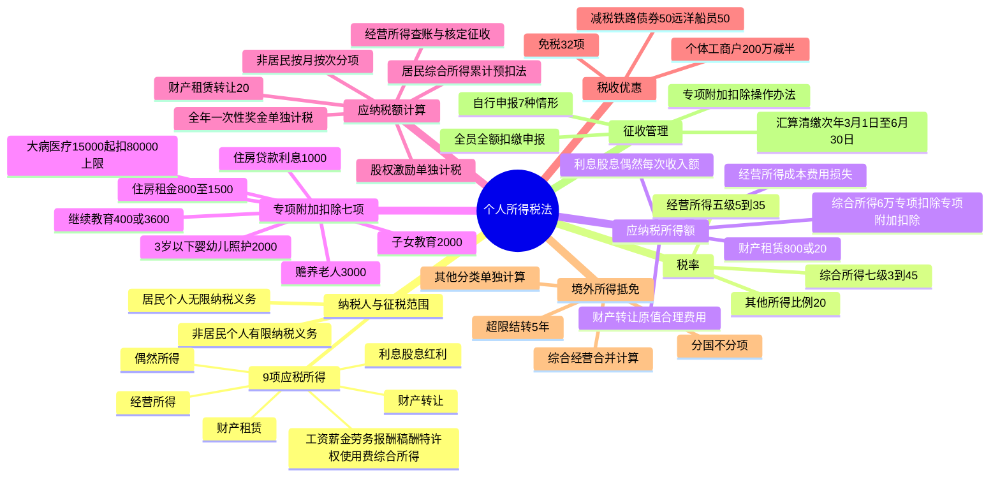

## 1. 章节定位

| 项目 | 信息 |
|------|------|
| 所属科目 | 税法 |
| 难度等级 | 5 |
| 历年分值 | 8-10 分 |
| 建议学时 | 10-12 小时 |
| 知识关联章节 | 第1章 税法总论、第4章 企业所得税法、第12章 国际税收、第14章 税收征收管理法 |

## 2. 考情分析

本章是税法科目的核心重点章，历年分值约 8-10 分，与第4章企业所得税法并称"所得税双雄"，必出计算问答题，常在综合题中与增值税、企业所得税结合考查。本章内容繁多、政策性强、计算量大，是决定税法科目能否通过的关键章节之一。

**命题规律**：本章考查综合运用能力，题型覆盖客观题、计算问答题和综合题。高频考点包括：居民个人与非居民个人的判定标准（住所+183天）、9 项应税所得的归类与界限（特别是工资薪金与劳务报酬、稿酬与特许权使用费的区分）、综合所得七级超额累进税率（3%-45%）与速算扣除数的运用、经营所得五级超额累进税率（5%-35%）、专项附加扣除七项标准（3岁以下婴幼儿照护2000元/月、子女教育2000元/月、继续教育400元/月或3600元/年、大病医疗15000元起扣80000元上限、住房贷款利息1000元/月、住房租金800/1100/1500元/月、赡养老人3000元/月）、应纳税所得额计算（居民综合所得=收入额-6万-专项扣除-专项附加扣除-其他扣除）、累计预扣法预扣预缴、全年一次性奖金单独计税、股权激励单独计税、稿酬收入额减按70%计算、劳务报酬与特许权使用费收入额按80%计算、财产租赁所得800元/20%费用扣除、财产转让所得20%税率、境外所得分国不分项抵免（综合所得+经营所得+其他分类所得）、汇算清缴次年3月1日至6月30日、个体工商户应纳税所得额不超过200万元减半征收。

**复习建议**：本章学习应以"应纳税额计算"为核心，构建"收入额-费用扣除-专项附加扣除-应纳税所得额-适用税率-应纳税额"的计算链条。重点掌握居民个人综合所得的预扣预缴（累计预扣法）与年度汇算清缴的差异，熟练运用各项扣除标准。专项附加扣除七项的标准与扣除规则需分类记忆，注意扣除条件与限额。全年一次性奖金、股权激励、解除劳动合同补偿金等特殊计算需单独掌握。境外所得抵免的"分国不分项"原则与5年结转规则是难点。建议通过大量练习题巩固各项所得的计算，特别是综合所得汇算清缴、经营所得查账征收、财产租赁与转让所得的综合计算。

## 3. 知识框架

## 4. 核心精讲

### 4.1 纳税义务人与征税范围

#### 4.1.1 纳税义务人

个人所得税的纳税义务人，包括中国居民、个体工商业户、个人独资企业和合伙企业个人投资者、在中国境内有所得的外籍人员和香港、澳门、台湾同胞。依据住所和居住时间两个标准，区分为居民个人和非居民个人。

**居民个人**：在中国境内有住所，或者无住所而一个纳税年度在中国境内居住累计满 183 天的个人。居民个人承担无限纳税义务，其取得的应纳税所得，无论来源于中国境内还是境外，都要在中国缴纳个人所得税。

- 在中国境内有住所：因户籍、家庭、经济利益关系而在中国境内习惯性居住的个人
- 一个纳税年度在境内居住累计满 183 天：公历 1 月 1 日起至 12 月 31 日止，在中国境内居住累计满 183 天（取消原临时离境规定，按实际居住时间确定）
- 在中国境内停留当天满 24 小时的，计入居住天数；不足 24 小时的，不计入

**非居民个人**：在中国境内无住所又不居住，或者无住所而一个纳税年度内在境内居住累计不满 183 天的个人。非居民个人承担有限纳税义务，仅就来源于中国境内的所得缴纳个人所得税。

#### 4.1.2 征税范围（9 项应税所得）

| 应税所得项目 | 适用税率 | 计税方式 | 收入额确定 |
|------|------|------|------|
| 工资、薪金所得 | 七级累进3-45% | 居民按年合并（综合所得）；非居民按月 | 全额计入 |
| 劳务报酬所得 | 七级累进3-45% | 居民按年合并；非居民按次 | 收入×(1-20%) |
| 稿酬所得 | 七级累进3-45% | 居民按年合并；非居民按次 | 收入×(1-20%)×70% |
| 特许权使用费所得 | 七级累进3-45% | 居民按年合并；非居民按次 | 收入×(1-20%) |
| 经营所得 | 五级累进5-35% | 按年计征 | 收入总额-成本费用损失 |
| 利息、股息、红利所得 | 比例20% | 按次计征 | 每次收入额 |
| 财产租赁所得 | 比例20%（居民住房10%） | 按月计征 | 收入-800或×(1-20%) |
| 财产转让所得 | 比例20% | 按次计征 | 收入-财产原值-合理费用 |
| 偶然所得 | 比例20% | 按次计征 | 每次收入额 |

**工资、薪金所得**：个人因任职或者受雇取得的工资、薪金、奖金、年终加薪、劳动分红、津贴、补贴以及与任职或者受雇有关的其他所得。不计入工资薪金的项目：独生子女补贴、公务员工资制度未纳入基本工资的补贴津贴差额、托儿补助费、差旅费津贴误餐补助、外国来华留学生生活津贴费奖学金。

**劳务报酬所得**：个人独立从事各种非雇用的劳务（设计、装潢、安装、化验、医疗、法律、会计、咨询、讲学、翻译、书画、雕刻、影视、录音、录像、演出、表演、广告、展览、技术服务、介绍服务、经纪服务、代办服务等26项）。个人担任董事且不在公司任职的董事费按劳务报酬计征；在公司任职同时兼任董事的，董事费与工资合并按工资薪金计征。

**稿酬所得**：个人因其作品以图书、报刊形式出版、发表而取得的所得。不以图书报刊形式出版发表的翻译、审稿、书画所得归为劳务报酬所得。

**特许权使用费所得**：个人提供专利权、商标权、著作权（不包括稿酬所得）、非专利技术以及其他特许权的使用权取得的所得。

**经营所得**：个体工商户从事生产、经营活动取得的所得；个人独资企业投资人、合伙企业的个人合伙人来源于境内注册的个人独资企业、合伙企业生产、经营的所得；个人依法从事办学、医疗、咨询以及其他有偿服务活动取得的所得；个人对企业、事业单位承包经营、承租经营以及转包、转租取得的所得；个人从事其他生产、经营活动取得的所得。

**利息、股息、红利所得**：个人拥有债权、股权而取得的所得。除国债和国家发行的金融债券利息外，应当依法缴纳个人所得税。

**财产租赁所得**：个人出租不动产、机器设备、车船以及其他财产取得的所得，包括转租收入。

**财产转让所得**：个人转让有价证券、股权、合伙企业中的财产份额、不动产、机器设备、车船以及其他财产取得的所得。个人转让上市公司股票所得暂免征收个人所得税。

**偶然所得**：个人得奖、中奖、中彩以及其他偶然性质的所得。

#### 4.1.3 所得来源地的确定

来源于中国境内的所得（不论支付地点）：
1. 因任职、受雇、履约等而在中国境内提供劳务取得的所得
2. 将财产出租给承租人在中国境内使用而取得的所得
3. 转让中国境内的不动产等财产或者在中国境内转让其他财产取得的所得
4. 许可各种特许权在中国境内使用而取得的所得
5. 从中国境内企业、事业单位、其他组织以及居民个人取得的利息、股息、红利所得

### 4.2 税率

#### 4.2.1 综合所得适用税率（七级超额累进税率 3%-45%）

| 级数 | 全年应纳税所得额 | 税率 | 速算扣除数（元） |
|------|------|------|------|
| 1 | 不超过 36000 元的 | 3% | 0 |
| 2 | 超过 36000 元至 144000 元的部分 | 10% | 2520 |
| 3 | 超过 144000 元至 300000 元的部分 | 20% | 16920 |
| 4 | 超过 300000 元至 420000 元的部分 | 25% | 31920 |
| 5 | 超过 420000 元至 660000 元的部分 | 30% | 52920 |
| 6 | 超过 660000 元至 960000 元的部分 | 35% | 85920 |
| 7 | 超过 960000 元的部分 | 45% | 181920 |

居民个人取得工资薪金、劳务报酬、稿酬、特许权使用费四项所得，按纳税年度合并计算个人所得税。

#### 4.2.2 经营所得适用税率（五级超额累进税率 5%-35%）

| 级数 | 全年应纳税所得额 | 税率 | 速算扣除数（元） |
|------|------|------|------|
| 1 | 不超过 30000 元的 | 5% | 0 |
| 2 | 超过 30000 元至 90000 元的部分 | 10% | 1500 |
| 3 | 超过 90000 元至 300000 元的部分 | 20% | 10500 |
| 4 | 超过 300000 元至 500000 元的部分 | 30% | 40500 |
| 5 | 超过 500000 元的部分 | 35% | 65500 |

#### 4.2.3 其他所得适用税率

利息、股息、红利所得，财产租赁所得，财产转让所得和偶然所得适用比例税率，税率为 20%。个人按市场价格出租的居民住房取得的所得，暂减按 10% 税率征收。

### 4.3 应纳税所得额的确定

#### 4.3.1 每次收入的确定

- 非居民劳务报酬/稿酬/特许权使用费：一次性收入以取得该项收入为一次；同一事项连续取得收入以 1 个月内取得的收入为一次
- 财产租赁所得：1 个月内取得的收入为一次
- 利息、股息、红利所得：支付时取得的收入为一次
- 偶然所得：每次取得该项收入为一次

#### 4.3.2 费用减除标准

1. **居民个人综合所得**：每一纳税年度收入额减除费用 60000 元（5000 元/月）以及专项扣除、专项附加扣除和依法确定的其他扣除后的余额
2. **非居民个人工资薪金**：每月收入额减除费用 5000 元后的余额
3. **非居民劳务报酬/稿酬/特许权使用费**：每次收入额为应纳税所得额
4. **经营所得**：每一纳税年度收入总额减除成本、费用以及损失后的余额（无综合所得的，还可减除 60000 元、专项扣除、专项附加扣除等）
5. **财产租赁所得**：每次收入不超过 4000 元，减除 800 元；4000 元以上，减除 20% 费用
6. **财产转让所得**：转让财产收入额减除财产原值和合理费用后的余额
7. **利息、股息、红利所得和偶然所得**：每次收入额为应纳税所得额

#### 4.3.3 专项附加扣除（7 项）

| 扣除项目 | 扣除标准 | 扣除方式 | 备注 |
|------|------|------|------|
| 3岁以下婴幼儿照护 | 每孩每月 2000 元（年 24000 元） | 一方 100% 或双方各 50% | 出生当月至年满 3 岁前 1 个月 |
| 子女教育 | 每子女每月 2000 元（年 24000 元） | 一方 100% 或双方各 50% | 年满 3 岁至学历教育结束 |
| 继续教育 | 学历每月 400 元（年 4800 元，最长 48 个月）；职业资格当年 3600 元 | 本人扣除（本科及以下可选父母扣除） | 取得证书当年 |
| 大病医疗 | 医保目录自付超 15000 元部分，限额 80000 元 | 汇算清缴时据实扣除 | 本人或配偶，未成年子女分别计算 |
| 住房贷款利息 | 每月 1000 元（年 12000 元），最长 240 个月 | 一方扣除，年度内不得变更 | 首套住房贷款，仅一套 |
| 住房租金 | 直辖市等 1500 元/月；户籍超 100 万城市 1100 元/月；其他 800 元/月 | 签订租赁合同的承租人扣除 | 主要工作城市无自有住房 |
| 赡养老人 | 独生子女每月 3000 元；非独生子女分摊每月 3000 元（每人最高 1500 元） | 独生子女全额；非独生均摊/约定/指定分摊 | 被赡养人年满 60 岁 |

专项扣除、专项附加扣除和依法确定的其他扣除，以居民个人一个纳税年度的应纳税所得额为限额；一个纳税年度扣除不完的，不结转以后年度扣除。

#### 4.3.4 收入额的特殊规定

- 劳务报酬所得、特许权使用费所得以收入减除 20% 费用后的余额为收入额
- 稿酬所得的收入额减按 70% 计算（即稿酬收入额=收入×(1-20%)×70%=收入×56%）
- 个人将其所得对教育、扶贫、济困等公益慈善事业进行捐赠，捐赠额未超过申报的应纳税所得额 30% 的部分，可以从其应纳税所得额中扣除；国务院规定全额税前扣除的，从其规定

### 4.4 应纳税额的计算

#### 4.4.1 居民个人综合所得应纳税额

**计算公式**：
应纳税额 = 全年应纳税所得额 × 适用税率 - 速算扣除数
=（全年收入额 - 60000 - 专项扣除 - 专项附加扣除 - 依法确定的其他扣除）× 适用税率 - 速算扣除数

其中：
- 工资薪金所得全额计入收入额
- 劳务报酬所得、特许权使用费所得收入额 = 收入 × (1-20%)
- 稿酬所得收入额 = 收入 × (1-20%) × 70%

#### 4.4.2 累计预扣法（工资薪金预扣预缴）

扣缴义务人向居民个人支付工资薪金所得时，按累计预扣法计算预扣税款：

本期应预扣预缴税额 =（累计预扣预缴应纳税所得额 × 预扣率 - 速算扣除数）- 累计减免税额 - 累计已预扣预缴税额

累计预扣预缴应纳税所得额 = 累计收入 - 累计免税收入 - 累计减除费用（5000 元/月×月份数）- 累计专项扣除 - 累计专项附加扣除 - 累计其他扣除

预扣率表与综合所得税率表一致（3%-45%）。

#### 4.4.3 劳务报酬、稿酬、特许权使用费预扣预缴

- 减除费用：每次收入不超过 4000 元减除 800 元；4000 元以上减除 20%
- 劳务报酬适用预扣预缴率表（20%-40%），稿酬、特许权使用费适用 20% 比例预扣率
- 稿酬所得收入额减按 70% 计算

劳务报酬预扣预缴率表：

| 级数 | 预扣预缴应纳税所得额 | 预扣率 | 速算扣除数（元） |
|------|------|------|------|
| 1 | 不超过 20000 元的 | 20% | 0 |
| 2 | 超过 20000 元至 50000 元的部分 | 30% | 2000 |
| 3 | 超过 50000 元的部分 | 40% | 7000 |

#### 4.4.4 非居民个人应纳税额计算

非居民个人工资薪金、劳务报酬、稿酬、特许权使用费所得，按月换算后综合所得税率表（月度税率表）计算：

| 级数 | 应纳税所得额 | 税率 | 速算扣除数（元） |
|------|------|------|------|
| 1 | 不超过 3000 元的 | 3% | 0 |
| 2 | 超过 3000 元至 12000 元的部分 | 10% | 210 |
| 3 | 超过 12000 元至 25000 元的部分 | 20% | 1410 |
| 4 | 超过 25000 元至 35000 元的部分 | 25% | 2660 |
| 5 | 超过 35000 元至 55000 元的部分 | 30% | 4410 |
| 6 | 超过 55000 元至 80000 元的部分 | 35% | 7160 |
| 7 | 超过 80000 元的部分 | 45% | 15160 |

非居民个人不办理汇算清缴，由扣缴义务人按月或按次代扣代缴。

#### 4.4.5 经营所得应纳税额

应纳税额 = 全年应纳税所得额 × 适用税率 - 速算扣除数
=（全年收入总额 - 成本、费用以及损失）× 适用税率 - 速算扣除数

个体工商户主要扣除项目规定：
- 业主费用扣除标准 60000 元/年（5000 元/月），业主工资不得税前扣除
- 从业人员合理工资薪金准予扣除
- 工会经费 2%、职工福利费 14%、职工教育经费 2.5%（超过结转）
- 业务招待费按 60% 扣除但最高不超过销售（营业）收入 5‰
- 广告费和业务宣传费不超过销售（营业）收入 15%（超过结转）
- 生产经营与个人家庭混用难以分清的费用，40% 视为与生产经营有关准予扣除
- 亏损结转最长 5 年

自 2023 年 1 月 1 日至 2027 年 12 月 31 日，对个体工商户年应纳税所得额不超过 200 万元的部分，减半征收个人所得税。

个人独资企业和合伙企业：
- 投资者费用扣除标准 60000 元/年
- 自 2022 年 1 月 1 日起，持有股权、股票、合伙企业财产份额等权益性投资的个人独资企业、合伙企业，一律适用查账征收方式
- 核定征收应税所得率：工业/交通运输/商业 5%-20%；建筑/房地产 7%-20%；饮食服务 7%-25%；娱乐业 20%-40%；其他 10%-30%

#### 4.4.6 财产租赁所得应纳税额

应纳税所得额：
- 每次（月）收入不超过 4000 元：应纳税所得额 = 每次收入额 - 准予扣除项目 - 修缮费用（800 元为限）- 800 元
- 每次（月）收入超过 4000 元：应纳税所得额 =（每次收入额 - 准予扣除项目 - 修缮费用（800 元为限））× (1-20%)

扣除次序：①财产租赁过程中缴纳的税费；②向出租方支付的租金（转租）；③修缮费用（800 元为限）；④法定费用扣除标准。

应纳税额 = 应纳税所得额 × 适用税率（20%，居民住房 10%）

#### 4.4.7 财产转让所得应纳税额

应纳税额 =（收入总额 - 财产原值 - 合理费用）× 20%

个人住房转让所得：房屋原值具体区分商品房、自建住房、经济适用房、已购公有住房、城镇拆迁安置住房等；转让住房缴纳的税金（城建税、教育费附加、土地增值税、印花税等）可扣除；合理费用包括住房装修费用（已购公房/经济适用房最高 15%，商品房最高 10%）、住房贷款利息、手续费、公证费等。

个人转让股权：以股权转让收入减除股权原值和合理费用后的余额为应纳税所得额。股权原值确认方法：现金出资按实际支付价款+相关税费；非货币性资产出资按税务机关认可价格+相关税费；无偿让渡按合理税费+原持有人股权原值；多次取得同一企业股权采用加权平均法。

#### 4.4.8 利息、股息、红利所得和偶然所得应纳税额

应纳税额 = 每次收入额 × 20%

### 4.5 全年一次性奖金等特殊计算

#### 4.5.1 全年一次性奖金

2027 年 12 月 31 日前，居民个人取得全年一次性奖金，可选择不并入当年综合所得，单独计税：
1. 将全年一次性奖金除以 12 个月，按其商数依照按月换算后的综合所得税率表确定适用税率和速算扣除数
2. 应纳税额 = 全年一次性奖金收入 × 适用税率 - 速算扣除数
3. 一个纳税年度内，该计税办法只允许采用一次

也可选择并入当年综合所得计算纳税。

#### 4.5.2 股权激励

居民个人取得股票期权、股票增值权、限制性股票、股权奖励等股权激励，2027 年 12 月 31 日前，不并入当年综合所得，全额单独适用综合所得税率表计算：

应纳税额 = 股权激励收入 × 适用税率 - 速算扣除数

一个纳税年度内取得两次以上股权激励的，应合并计算。

#### 4.5.3 解除劳动合同经济补偿金

个人因与用人单位解除劳动关系取得的一次性补偿收入，在当地上年职工平均工资 3 倍数额以内的部分免征个人所得税；超过 3 倍部分，不并入当年综合所得，单独适用综合所得税率表计算纳税。

#### 4.5.4 提前退休补贴收入

个人办理提前退休手续取得的一次性补贴收入，按办理提前退休至法定离退休年龄之间的实际年度数平均分摊，确定适用税率和速算扣除数，单独适用综合所得税率表计算。

#### 4.5.5 个人养老金

自 2024 年 1 月 1 日全国范围实施：
- 缴费环节：按 12000 元/年限额在综合所得或经营所得中据实扣除
- 投资环节：投资收益暂不征收个人所得税
- 领取环节：不并入综合所得，单独按 3% 税率计算缴纳

#### 4.5.6 商业健康保险

自 2017 年 7 月 1 日起，个人购买符合规定的商业健康保险产品支出，扣除限额 2400 元/年（200 元/月）。

### 4.6 境外所得的税额扣除

**抵免原则**：居民个人从中国境外取得的所得，可以从其应纳税额中抵免已在境外缴纳的个人所得税税额，但抵免额不得超过该纳税人境外所得依照税法规定计算的应纳税额。

**分项计算规则**：
1. 来源于中国境外的综合所得，应与境内综合所得合并计算应纳税额
2. 来源于中国境外的经营所得，应与境内经营所得合并计算应纳税额（境外经营亏损不得抵减境内或他国应纳税所得额，但可用来源于同一国家以后年度经营所得弥补）
3. 来源于中国境外的利息、股息、红利所得，财产租赁所得，财产转让所得和偶然所得（其他分类所得），不与境内所得合并，分别单独计算应纳税额

**分国不分项**：来源于一国（地区）的所得抵免限额 = 来源于该国综合所得抵免限额 + 经营所得抵免限额 + 其他分类所得抵免限额

**超限结转**：实际已缴税额超过抵免限额的，超过部分不得在本纳税年度抵免，但可在以后 5 个纳税年度内来源于该国所得的抵免限额余额中补扣。

**申报期限**：居民个人从境外取得所得，应当在取得所得的次年 3 月 1 日至 6 月 30 日内申报纳税。

### 4.7 税收优惠

#### 4.7.1 免征个人所得税（主要项目）

1. 省级人民政府、国务院部委、军以上单位及外国组织、国际组织颁发的科学、教育、技术、文化、卫生、体育、环境保护等方面的奖金
2. 国债和国家发行的金融债券利息
3. 按照国家统一规定发给的补贴、津贴（政府特殊津贴、院士津贴等）
4. 福利费、抚恤金、救济金
5. 保险赔款
6. 军人的转业费、复员费、退役金
7. 按国家统一规定发给的安家费、退职费、基本养老金或退休费、离休费、离休生活补助费
8. 住房公积金、医疗保险金、基本养老保险金、失业保险金（规定比例内部分）
9. 个人转让自用 5 年以上且是唯一家庭生活用房取得的所得
10. 个人转让上市公司股票取得的所得暂免征收
11. 持股期限超过 1 年的股息红利所得暂免征收；1 个月以内全额计税，1 个月以上至 1 年减按 50% 计税
12. 购买社会福利有奖募捐奖券、体育彩票一次中奖收入不超过 10000 元的暂免征收
13. 个人举报、协查各种违法、犯罪行为而获得的奖金
14. 外籍个人从外商投资企业取得的股息、红利所得

#### 4.7.2 减征个人所得税

1. 个人投资者持有 2024-2027 年发行的铁路债券取得的利息收入，减按 50% 计入应纳税所得额
2. 一个纳税年度内在船航行时间累计满 183 天的远洋船员，其工资薪金收入减按 50% 计入应纳税所得额
3. 残疾、孤老人员和烈属的所得，因自然灾害遭受重大损失的，由省级人民政府规定减征幅度和期限
4. 个体工商户年应纳税所得额不超过 200 万元的部分减半征收（2023-2027 年）

### 4.8 征收管理

#### 4.8.1 自行申报纳税

有下列情形之一的，纳税人应当依法办理纳税申报：
1. 取得综合所得需要办理汇算清缴
2. 取得应税所得没有扣缴义务人
3. 取得应税所得，扣缴义务人未扣缴税款
4. 取得境外所得
5. 因移居境外注销中国户籍
6. 非居民个人在中国境内从两处以上取得工资、薪金所得
7. 国务院规定的其他情形

#### 4.8.2 综合所得汇算清缴

纳税人取得综合所得，按纳税年度合并计算个人所得税，并依法办理汇算清缴。

**汇算清缴公式**：
应退或应补税额 =[（综合所得收入额 - 6 万元 - 专项扣除 - 专项附加扣除 - 其他扣除 - 公益捐赠）× 适用税率 - 速算扣除数] - 减免税额 - 已预缴税额

**办理期限**：次年 3 月 1 日至 6 月 30 日。

**免于办理汇算清缴**（2027 年 12 月 31 日前）：
- 年度综合所得收入不超过 12 万元且需要补税的
- 年度汇算清缴补税金额不超过 400 元的

**需要办理汇算清缴**：
- 已预缴税额大于实际应纳税额且申请退税的
- 已预缴税额小于实际应纳税额且不符合免办条件的
- 因适用所得项目错误、扣缴义务人未依法履行扣缴义务等造成少申报或未申报的

#### 4.8.3 全员全额扣缴申报

扣缴义务人向个人支付应税款项时，应当依法预扣或代扣税款，按时代缴国库，并专项记载备查。扣缴义务人每月或每次预扣、代扣的税款，应当在次月 15 日内缴入国库，并向税务机关报送《个人所得税扣缴申报表》。

扣缴义务人依法履行代扣代缴义务，按年付给 2% 手续费。

#### 4.8.4 经营所得纳税申报

纳税人取得经营所得，按年计算个人所得税，由纳税人在月度或季度终了后 15 日内办理预缴纳税申报（《个人所得税经营所得纳税申报表 A 表》）；在取得所得的次年 3 月 31 日前办理汇算清缴（《B 表》）；从两处以上取得经营所得的，选择向其中一处办理年度汇总申报（《C 表》）。

#### 4.8.5 专项附加扣除操作办法

享受时间：
- 3 岁以下婴幼儿照护：出生当月至年满 3 周岁前 1 个月
- 子女教育：年满 3 岁当月至小学入学前 1 个月；学历教育入学当月至结束当月
- 继续教育：学历教育入学当月至结束当月（最长 48 个月）；职业资格取得证书当年
- 大病医疗：医药费用实际支出当年
- 住房贷款利息：贷款合同约定开始还款当月至全部归还或合同终止当月（最长 240 个月）
- 住房租金：租赁合同约定租赁期开始当月至结束当月
- 赡养老人：被赡养人年满 60 周岁当月至赡养义务终止年末

报送方式：通过远程办税端（个税 APP、自然人电子税务局网站）、电子或纸质报表等方式报送扣缴义务人或主管税务机关。

后续管理：纳税人应将《扣除信息表》及相关留存备查资料自汇算清缴期结束后保存 5 年。

#### 4.8.6 反避税规定

有下列情形之一的，税务机关有权按合理方法进行纳税调整：
1. 个人与其关联方之间的业务往来不符合独立交易原则而减少应纳税额，且无正当理由
2. 居民个人控制的设立在实际税负明显偏低的国家（地区）的企业，无合理经营需要，对应当归属于居民个人的利润不作分配或减少分配
3. 个人实施其他不具有合理商业目的的安排而获取不当税收利益

税务机关作出纳税调整需补征税款的，应当补征税款，并依法加收利息（按税款所属纳税申报期最后一日人民币贷款基准利率计算）。

## 5. 典型例题

### 例题 1：居民个人综合所得应纳税额计算

某居民个人纳税人 2025 年扣除"三险一金"后共取得含税工资收入 120000 元，除住房贷款专项附加扣除外，不享受其他专项附加扣除和其他扣除。计算其当年应纳个人所得税税额。

**解答**：
1. 全年应纳税所得额 = 120000 - 60000 - 12000 = 48000（元）
2. 应纳税额 = 48000 × 10% - 2520 = 2280（元）

### 例题 2：居民个人综合所得（多项所得）应纳税额计算

某居民个人为独生子女，2025 年交完社保和住房公积金后共取得税前工资收入 20 万元，劳务报酬 20000 元，稿酬 10000 元。该纳税人有两个小孩且均由其扣除子女教育专项附加，父母健在且均已年满 60 岁。计算其当年应纳个人所得税税额。

**解答**：
1. 全年应纳税所得额 = 200000 + 20000 × (1-20%) + 10000 × 70% × (1-20%) - 60000 - 24000 × 2 - 36000
   = 200000 + 16000 + 5600 - 60000 - 48000 - 36000 = 77600（元）
2. 应纳税额 = 77600 × 10% - 2520 = 5240（元）

### 例题 3：累计预扣法计算

某居民个人 2025 年每月取得工资收入 10000 元，每月缴纳社保费用和住房公积金 1500 元，全年享受住房贷款利息专项附加扣除，计算工资扣缴义务人 2025 年 1 月、2 月、12 月代扣代缴的税款金额。

**解答**：
- 2025 年 1 月：
  - 累计预扣预缴应纳税所得额 = 10000 - 5000 - 1500 - 1000 = 2500（元）
  - 本期应预扣预缴税额 = 2500 × 3% = 75（元）
- 2025 年 2 月：
  - 累计预扣预缴应纳税所得额 = 20000 - 10000 - 3000 - 2000 = 5000（元）
  - 本期应预扣预缴税额 = 5000 × 3% - 75 = 75（元）
- 2025 年 12 月：
  - 累计预扣预缴应纳税所得额 = 120000 - 60000 - 18000 - 12000 = 30000（元）
  - 本期应预扣预缴税额 = 30000 × 3% - 75 × 11 = 75（元）

### 例题 4：劳务报酬预扣预缴

歌星刘某一次取得表演收入 40000 元，计算应预扣预缴个人所得税税额。

**解答**：
- 应预扣预缴税额 = 预扣预缴应纳税所得额 × (1-20%) × 预扣率 - 速算扣除数
- = 40000 × (1-20%) × 30% - 2000 = 7600（元）

### 例题 5：稿酬预扣预缴

某作家为居民个人，2024 年 3 月取得一次未扣除个人所得税的稿酬收入 20000 元，计算应预扣预缴个人所得税税额。

**解答**：
- 应预扣预缴税额 = 预扣预缴应纳税所得额 × 预扣率
- = 20000 × (1-20%) × 70% × 20% = 2240（元）

### 例题 6：非居民个人应纳税额

某外商投资企业工作的美国专家（非居民纳税人）2024 年 2 月取得含税工资收入 10400 元人民币，从别处取得劳务报酬 5000 元。计算当月应纳个人所得税。

**解答**：
1. 工资薪金应纳税额 = (10400 - 5000) × 10% - 210 = 330（元）
2. 劳务报酬应纳税额 = 5000 × (1-20%) × 10% - 210 = 190（元）

### 例题 7：财产租赁所得

刘某 2025 年 1 月将自有 150 平方米公寓按市场价出租给张某居住，每月租金 4500 元，全年租金 54000 元。计算全年租金收入应缴纳个人所得税（不考虑其他税费）。

**解答**：
- 按市场价出租给个人居住适用 10% 税率
- 每月应纳税额 = 4500 × (1-20%) × 10% = 360（元）
- 全年应纳税额 = 360 × 12 = 4320（元）

### 例题 8：财产转让所得

某居民个人建房一幢，造价 360000 元，支付其他费用 50000 元。建成后出售，售价 600000 元，支付交易费等税费 35000 元。计算应纳个人所得税。

**解答**：
1. 应纳税所得额 = 600000 - (360000 + 50000) - 35000 = 155000（元）
2. 应纳税额 = 155000 × 20% = 31000（元）

### 例题 9：全年一次性奖金

中国居民个人李某 2023 年 1-12 月每月税后工资 5200 元，12 月 31 日一次性领取年终含税奖金 60000 元。计算年终奖应缴纳个人所得税。

**解答**：
1. 按 12 个月分摊：每月奖金 = 60000 ÷ 12 = 5000（元），适用税率 10%，速算扣除数 210
2. 应纳税额 = 60000 × 10% - 210 = 5790（元）

### 例题 10：个体工商户经营所得

某个体工商户 2023 年 12 月取得经营收入 320000 元，准许扣除当月成本费用（不含业主工资）及相关税金 250600 元。1-11 月累计应纳税所得额 88400 元（未扣除业主费用扣除标准），1-11 月累计已预缴个人所得税 10200 元。除经营所得外业主无其他收入，全年享受赡养老人专项附加扣除和残疾人政策减免税额 2000 元。不考虑专项扣除和其他扣除，计算 2023 年度汇算清缴应申请的个人所得税退税额。

**解答**：
1. 全年应纳税所得额 = 320000 - 250600 + 88400 - 60000 - 36000 = 61800（元）
2. 全年应缴纳个人所得税 = [(61800 × 10% - 1500) - 2000] × 50% = 1340（元）
3. 应申请退税额 = 10200 - 1340 = 8860（元）

### 例题 11：境外所得抵免

居民个人王某 2023 年取得境内工资收入 135000 元，单位代扣"三险一金"15000 元。从境外甲国获得劳务报酬 50000 元、稿酬 20000 元和利息 10000 元，分别就三项收入在甲国缴纳税款 10000 元、1000 元和 2000 元。除 60000 元费用扣除、专项扣除 15000 元和专项附加扣除 12000 元外，不考虑其他费用扣除和境内预缴税额。计算甲国所得抵免限额。

**解答**：
1. 王某 2023 年境内外全部综合所得收入额 = 135000 + 50000 × (1-20%) + 20000 × (1-20%) × 70% = 186200（元）
2. 王某 2023 年境内外全部综合所得应纳税额 = (186200 - 60000 - 15000 - 12000) × 10% - 2520 = 7400（元）
3. 来源于甲国综合所得抵免限额 = 7400 × (40000 + 11200) ÷ (135000 + 40000 + 11200) = 2034.8（元）
4. 来源于甲国其他分类所得抵免限额 = 10000 × 20% = 2000（元）
5. 来源于甲国所得抵免限额 = 2034.8 + 2000 = 4034.8（元）

## 6. 记忆口诀

1. **居民非居民判定**：住所有无加一八三，居民全球非居民境内；住所有者即居民，无住所看 183 天
2. **九项所得分类**：工劳稿特综所得，经营利息股红得，财产租赁与转让，偶然所得共九项
3. **综合所得四项**：工资薪金劳务酬，稿酬特许使用费，居民按年合并算，七级累进三到四十五
4. **稿酬收入额**：稿酬减除二成费，再按七折算收入，实际收入五成六，税负最低享优惠
5. **经营所得五级**：经营五级五到三十五，应纳税所得三万起，速算扣除零到六五五〇
6. **专项附加七项**：婴幼子教续教育，大病房贷与房租，赡养老人共七项，标准金额要记清
7. **专项附加扣除标准**：婴幼子教各二千，继续教育四百起，大病一万五起扣八万，房贷一千租八百到一千五，赡养三千独非独
8. **费用扣除六万**：居民综合所得六万扣，非居民每月扣五千，经营所得无综合再扣六万
9. **预扣预缴方法**：工资累计预扣法，劳务报酬分次扣，稿酬特许按次预，汇算清缴多退少补
10. **全年一次性奖金**：奖金除以十二定税率，单独计税不并入，年度一次限一人，二〇二七前可选择
11. **股权激励单独计税**：股票期权增值权，限制性股股权奖，不并入综合单独算，二〇二七前优惠延
12. **境外所得抵免**：分国不分项抵免，综合经营合并算，分类所得单独计，超限五年可结转
13. **汇算清缴期限**：次年三月一到六月三十，综合所得汇算清，补税四百以下免，收入十二万以下免
14. **扣缴手续费**：扣缴义务人代扣代缴，按年付给二% 手续费，依法履行不得拒
15. **个体工商户优惠**：应纳税所得二百万，减半征收个所得税，二〇二三到二〇二七，可叠加其他优惠
16. **住房贷款利息**：首套房贷利息扣，每月一千最长二十年，夫妻一方扣，年度内不得变更
17. **住房租金标准**：直辖市一千五，百万城市一千一，其他城市八百扣，主要工作无自有住房
18. **赡养老人分摊**：独生子女三千扣，非独生分摊最高一千五，约定指定均摊三方式，指定优于约定分摊
19. **公益捐赠扣除**：公益捐赠三成扣，全额扣除国务院定，分类所得当月扣，综合经营年汇算
20. **股票转让所得**：上市公司股票转让，暂免征收个所得税，限售股转让按二〇，原始股按财产转让
21. **财产租赁扣除次序**：税费租金修缮费，法定标准最后扣，修缮八百为限扣，住房按一〇税率
22. **反避税三情形**：关联交易非独立，低税地不分配利润，无合理商业目的安排，补税加收利息款
