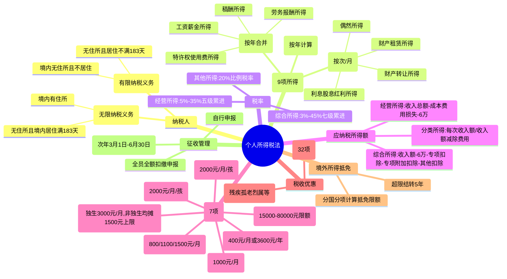

## 📍 章节定位

| 项目 | 信息 |
|------|------|
| **所属科目** | 💰 税法 |
| **难度等级** | ⭐⭐⭐⭐ |
| **历年分值** | 6-8分 |
| **建议学时** | 8-10h |

## 📝 考情分析

个人所得税是 CPA 税法考试的重点章节之一。本章内容多、政策细、计算繁，主观题与客观题均有涉及。常考点包括：居民与非居民纳税人的判定、9 项所得的区分、综合所得与经营所得的税率表及速算扣除数、专项附加扣除 7 项标准、各项所得应纳税额的计算（尤其综合所得汇算清缴、全年一次性奖金、股权激励、财产租赁与转让所得）、境外所得抵免计算及征收管理规定。综合所得汇算清缴的计算几乎是每年主观题必考内容，复习时应重点掌握。

## 🧠 知识框架

## 📖 核心精讲

### 一、纳税义务人

个人所得税的纳税义务人依据**住所**和**居住时间**两个标准，区分为居民个人和非居民个人。

#### （一）居民个人

居民个人承担**无限纳税义务**，就境内境外全部所得纳税。判定标准（满足其一）：
1. 在中国境内有住所（因户籍、家庭、经济利益关系而在中国境内习惯性居住）；
2. 无住所而一个纳税年度内在中国境内居住累计满 183 天。

> 习惯性居住是判定纳税义务人属于居民还是非居民的重要依据，指个人因学习、工作、探亲等原因消除之后，没有理由在其他地方继续居留时所要回到的地方。

#### （二）非居民个人

非居民个人承担**有限纳税义务**，仅就来源于中国境内的所得纳税。判定标准：
- 在中国境内无住所又不居住；或
- 无住所且一个纳税年度内在境内居住累计不满 183 天。

**居住天数计算**：自 2019 年 1 月 1 日起，无住所个人一个纳税年度内在中国境内累计居住天数，按个人在中国境内累计停留的天数计算。当天满 24 小时计入，不足 24 小时不计入。

### 二、征税范围（9 项所得）

| 所得项目 | 计征方式 | 收入额确定 |
|----------|----------|------------|
| 工资、薪金所得 | 居民按年合并；非居民按月 | 全额计入 |
| 劳务报酬所得 | 居民按年合并；非居民按次 | 收入×(1-20%) |
| 稿酬所得 | 居民按年合并；非居民按次 | 收入×(1-20%)×70% |
| 特许权使用费所得 | 居民按年合并；非居民按次 | 收入×(1-20%) |
| 经营所得 | 按年计算 | 收入总额-成本费用损失 |
| 利息、股息、红利所得 | 按次 | 每次收入额 |
| 财产租赁所得 | 按月 | 收入-费用（800 或 20%） |
| 财产转让所得 | 按次 | 收入-财产原值-合理费用 |
| 偶然所得 | 按次 | 每次收入额 |

**工资薪金 vs 劳务报酬**：工资薪金属于非独立个人劳动（任职受雇）；劳务报酬是个人独立从事各种劳务。个人担任公司董事且不在公司任职受雇的，董事费按劳务报酬征税；任职受雇同时兼任董事的，董事费与工资合并按工资薪金征税。

**稿酬所得特殊优惠**：稿酬所得收入额在扣除 20% 费用基础上，再减按 70% 计算，即实际按收入的 56% 计入综合所得收入额。

### 三、税率

#### （一）综合所得适用税率（七级超额累进）

| 级数 | 全年应纳税所得额 | 税率 | 速算扣除数（元） |
|------|------------------|------|------------------|
| 1 | 不超过 36,000 元 | 3% | 0 |
| 2 | 超过 36,000 元至 144,000 元 | 10% | 2,520 |
| 3 | 超过 144,000 元至 300,000 元 | 20% | 16,920 |
| 4 | 超过 300,000 元至 420,000 元 | 25% | 31,920 |
| 5 | 超过 420,000 元至 660,000 元 | 30% | 52,920 |
| 6 | 超过 660,000 元至 960,000 元 | 35% | 85,920 |
| 7 | 超过 960,000 元 | 45% | 181,920 |

#### （二）经营所得适用税率（五级超额累进）

| 级数 | 全年应纳税所得额 | 税率 | 速算扣除数（元） |
|------|------------------|------|------------------|
| 1 | 不超过 30,000 元 | 5% | 0 |
| 2 | 超过 30,000 元至 90,000 元 | 10% | 1,500 |
| 3 | 超过 90,000 元至 300,000 元 | 20% | 10,500 |
| 4 | 超过 300,000 元至 500,000 元 | 30% | 40,500 |
| 5 | 超过 500,000 元 | 35% | 65,500 |

#### （三）其他所得适用税率

利息、股息、红利所得，财产租赁所得，财产转让所得和偶然所得，适用 **20% 比例税率**。

### 四、应纳税所得额的确定

#### （一）费用减除标准

| 所得类型 | 费用减除标准 |
|----------|--------------|
| 居民个人综合所得 | 每年 60,000 元（5,000 元/月） |
| 非居民个人工资薪金 | 每月 5,000 元 |
| 经营所得（无综合所得时） | 每年 60,000 元 |
| 财产租赁所得 | 每次(月)收入≤4,000 元扣 800 元；>4,000 元扣 20% |
| 财产转让所得 | 财产原值+合理费用 |
| 利息股息红利、偶然所得 | 无费用扣除 |

#### （二）专项扣除

包括居民个人按照国家规定的范围和标准缴纳的基本养老保险、基本医疗保险、失业保险等社会保险费和住房公积金（"三险一金"）。

#### （三）专项附加扣除（7 项）

| 项目 | 扣除标准 | 备注 |
|------|----------|------|
| 3 岁以下婴幼儿照护 | 2,000 元/月/孩（24,000 元/年） | 父母一方 100% 或双方各 50% |
| 子女教育 | 2,000 元/月/孩（24,000 元/年） | 年满 3 岁至学历教育结束 |
| 继续教育 | 学历教育 400 元/月（最长 48 个月）；职业资格 3,600 元/年 | 取得证书当年定额扣除 |
| 大病医疗 | 医保目录自付超 15,000 元部分，限额 80,000 元据实扣除 | 汇算清缴时扣除 |
| 住房贷款利息 | 1,000 元/月（12,000 元/年） | 首套住房贷款，最长 240 个月 |
| 住房租金 | 直辖市等 1,500 元/月；户籍超 100 万城市 1,100 元/月；其他 800 元/月 | 主要工作城市无自有住房 |
| 赡养老人 | 独生子女 3,000 元/月；非独生子女每人最高 1,500 元/月 | 被赡养人年满 60 周岁 |

> 注意：住房贷款利息与住房租金不能同时享受。专项附加扣除以居民个人一个纳税年度的应纳税所得额为限额，扣除不完的不结转以后年度。

#### （四）其他扣除

包括个人缴付符合规定的企业年金、职业年金，个人购买的商业健康保险（限额 2,400 元/年）、税收递延型商业养老保险、个人养老金（限额 12,000 元/年）等。

### 五、应纳税额的计算

#### （一）居民个人综合所得应纳税额

$$\text{应纳税额}=\text{全年应纳税所得额}\times\text{适用税率}-\text{速算扣除数}$$

其中：
$$\text{全年应纳税所得额}=\text{全年收入额}-60{,}000-\text{专项扣除}-\text{专项附加扣除}-\text{其他扣除}$$

**收入额计算**：
- 工资薪金：全额计入收入额
- 劳务报酬、特许权使用费：收入×(1-20%)
- 稿酬：收入×(1-20%)×70%

#### （二）累计预扣法（工资薪金预扣预缴）

扣缴义务人按累计预扣法计算预扣税款：

$$\text{本期应预扣预缴税额}=(\text{累计预扣预缴应纳税所得额}\times\text{预扣率}-\text{速算扣除数})-\text{累计已预扣预缴税额}$$

$$\text{累计预扣预缴应纳税所得额}=\text{累计收入}-\text{累计减除费用}(5{,}000\times\text{月数})-\text{累计专项扣除}-\text{累计专项附加扣除}-\text{累计其他扣除}$$

预扣率表与综合所得年度税率表相同。

#### （三）劳务报酬预扣预缴

| 级数 | 预扣预缴应纳税所得额 | 预扣率 | 速算扣除数（元） |
|------|----------------------|--------|------------------|
| 1 | 不超过 20,000 元 | 20% | 0 |
| 2 | 超过 20,000 元至 50,000 元 | 30% | 2,000 |
| 3 | 超过 50,000 元 | 40% | 7,000 |

稿酬所得、特许权使用费所得适用 20% 比例预扣率。

#### （四）经营所得应纳税额

$$\text{应纳税额}=\text{全年应纳税所得额}\times\text{适用税率}-\text{速算扣除数}$$

$$\text{全年应纳税所得额}=\text{收入总额}-\text{成本}-\text{费用}-\text{损失}-60{,}000(\text{无综合所得时})$$

> 优惠：自 2023 年 1 月 1 日至 2027 年 12 月 31 日，个体工商户年应纳税所得额不超过 200 万元的部分，减半征收个人所得税。

#### （五）财产租赁所得应纳税额

$$\text{应纳税额}=\text{应纳税所得额}\times 20\%$$

个人按市场价格出租居民住房，暂减按 10% 税率征收。

**扣除顺序**：①租赁过程缴纳税费 → ②向出租方支付的租金（转租）→ ③修缮费用（每次 800 元为限）→ ④法定费用扣除（800 元或 20%）。

#### （六）财产转让所得应纳税额

$$\text{应纳税额}=(\text{收入总额}-\text{财产原值}-\text{合理费用})\times 20\%$$

#### （七）利息、股息、红利所得和偶然所得

$$\text{应纳税额}=\text{每次收入额}\times 20\%$$

### 六、应纳税额计算中的特殊问题

#### （一）全年一次性奖金（2027 年 12 月 31 日前可选择）

居民个人取得全年一次性奖金，**可不并入当年综合所得**，单独计税：
1. 将奖金除以 12 个月，按其商数确定适用税率和速算扣除数（按月换算后综合所得税率表）；
2. 应纳税额＝奖金×适用税率－速算扣除数。

> 在一个纳税年度内，该计税办法只允许采用一次。

#### （二）股权激励

居民个人取得股票期权、股票增值权、限制性股票、股权奖励等股权激励，符合规定条件的，**不并入当年综合所得**，全额单独适用综合所得税率表：

$$\text{应纳税额}=\text{股权激励收入}\times\text{适用税率}-\text{速算扣除数}$$

#### （三）解除劳动合同经济补偿金

- 当地上年职工平均工资 3 倍以内的部分免税；
- 超过 3 倍部分，不并入当年综合所得，单独适用综合所得税率表计算纳税。

#### （四）个人养老金（2024 年 1 月 1 日起全国实施）

- **缴费环节**：按 12,000 元/年限额在综合所得或经营所得中据实扣除；
- **投资环节**：投资收益暂不征收个人所得税；
- **领取环节**：不并入综合所得，单独按 3% 税率计算缴纳。

### 七、税收优惠

#### （一）免税项目（重点）

1. 省级以上单位颁发的科学、教育、技术、文化、卫生、体育、环保等方面奖金；
2. 国债和国家发行的金融债券利息；
3. 按国家统一规定发给的政府特殊津贴、院士津贴；
4. 福利费、抚恤金、救济金；
5. 保险赔款；
6. 军人的转业费、复员费、退役金；
7. 按国家统一规定发给的安家费、退职费、基本养老金、退休费、离休费；
8. 住房公积金、医疗保险金、基本养老保险金、失业保险金（按规定比例缴付的部分）；
9. 个人转让自用 5 年以上且唯一家庭生活用房所得；
10. 个人转让上市公司股票所得暂免；
11. 持股超 1 年的上市公司股息红利暂免；
12. 单张有奖发票奖金≤800 元暂免；彩票一次中奖≤10,000 元暂免；
13. 外籍个人从外商投资企业取得的股息红利；
14. 工伤保险待遇；
15. 育儿补贴；
16. 法律援助补贴。

#### （二）减税项目

1. 残疾、孤老人员和烈属的所得；
2. 因自然灾害遭受重大损失的；
3. 远洋船员（在船满 183 天）工资薪金减按 50% 计入；
4. 个人投资者持有 2024-2027 年发行的铁路债券利息减按 50% 计入。

具体幅度和期限由省、自治区、直辖市人民政府规定。

### 八、境外所得的税额扣除

居民个人从中国境外取得所得，已在境外缴纳的个人所得税税额，可以从其应纳税额中抵免，但抵免额不得超过该纳税人境外所得依照我国税法规定计算的应纳税额（抵免限额）。

**计算方法（分国分项）**：

$$\text{来源于一国(地区)综合所得抵免限额}=\frac{\text{合并境内外综合所得应纳税额}\times\text{来源于该国综合所得收入额}}{\text{境内外综合所得收入额合计}}$$

- **综合所得**：与境内综合所得合并计算应纳税额；
- **经营所得**：与境内经营所得合并计算（境外亏损不得抵减境内）；
- **分类所得**：不与境内合并，单独计算应纳税额。

> 超过抵免限额的部分，可以在以后 5 个纳税年度内来源于该国所得的抵免限额余额中补扣。

### 九、征收管理

#### （一）自行申报情形

1. 取得综合所得需要办理汇算清缴；
2. 取得应税所得没有扣缴义务人；
3. 取得应税所得，扣缴义务人未扣缴税款；
4. 取得境外所得；
5. 因移居境外注销中国户籍；
6. 非居民个人在中国境内从两处以上取得工资、薪金所得。

#### （二）综合所得汇算清缴

- **时间**：次年 3 月 1 日至 6 月 30 日；
- **公式**：

$$\text{应退或应补税额}=[(\text{综合所得收入额}-6\text{万}-\text{专项扣除}-\text{专项附加扣除}-\text{其他扣除}-\text{公益捐赠})\times\text{税率}-\text{速算扣除数}]-\text{减免税额}-\text{已预缴税额}$$

**免于办理汇算清缴情形**（2027 年 12 月 31 日前）：
- 年度综合所得收入不超过 12 万元且需要补税的；
- 年度汇算清缴补税金额不超过 400 元的。

#### （三）经营所得申报

- **预缴**：月度或季度终了后 15 日内；
- **汇算清缴**：次年 3 月 31 日前；
- **多处经营所得**：选择一处办理年度汇总申报。

## 💡 典型例题

### 例题 1：居民个人综合所得计算

某居民个人 2025 年扣除"三险一金"后共取得含税工资收入 120,000 元，除住房贷款专项附加扣除外，不享受其他专项附加扣除。计算其当年应纳个人所得税税额。

**解答**：

（1）全年应纳税所得额 = 120,000 - 60,000 - 12,000 = 48,000（元）

（2）应纳税额 = 48,000 × 10% - 2,520 = 2,280（元）

### 例题 2：多项综合所得计算

某居民个人为独生子女，2025 年交完社保和住房公积金后共取得税前工资收入 20 万元，劳务报酬 20,000 元，稿酬 10,000 元。该纳税人有两个小孩且均由其扣除子女教育专项附加，父母健在且均已年满 60 岁。计算其当年应纳个人所得税税额。

**解答**：

（1）全年应纳税所得额 = 200,000 + 20,000 × (1-20%) + 10,000 × 70% × (1-20%) - 60,000 - 24,000 × 2 - 36,000 = 200,000 + 16,000 + 5,600 - 60,000 - 48,000 - 36,000 = 77,600（元）

（2）应纳税额 = 77,600 × 10% - 2,520 = 5,240（元）

### 例题 3：劳务报酬预扣预缴

歌星刘某一次取得表演收入 40,000 元，计算其应预扣预缴个人所得税税额。

**解答**：

应预扣预缴税额 = 预扣预缴应纳税所得额 × (1-20%) 预扣率 - 速算扣除数 = 40,000 × (1-20%) × 30% - 2,000 = 7,600（元）

### 例题 4：稿酬预扣预缴

某作家为居民个人，2024 年 3 月取得一次未扣除个人所得税的稿酬收入 20,000 元，计算其应预扣预缴的个人所得税税额。

**解答**：

应预扣预缴税额 = 预扣预缴应纳税所得额 × 预扣率 = 20,000 × (1-20%) × 70% × 20% = 2,240（元）

### 例题 5：财产租赁所得计算

刘某 2025 年 1 月将其自有公寓按市场价出租给张某居住，每月租金收入 4,500 元，全年租金收入 54,000 元。计算刘某全年租金收入应缴纳的个人所得税（不考虑其他税费）。

**解答**：

按市场价出租给个人居住适用 10% 税率：

每月应纳税额 = 4,500 × (1-20%) × 10% = 360（元）

全年应纳税额 = 360 × 12 = 4,320（元）

### 例题 6：全年一次性奖金计算

中国居民个人李某 2023 年 12 月 31 日一次性领取年终含税奖金 60,000 元。计算其应缴纳的个人所得税。

**解答**：

（1）按 12 个月分摊：60,000 ÷ 12 = 5,000（元），适用税率 10%，速算扣除数 210 元。

（2）应纳税额 = 60,000 × 10% - 210 = 5,790（元）

## 🎯 记忆口诀

**纳税人判定**：
> 有住所或住满 183，居民全球都纳税；无住不住或不满 183，非居民只缴境内税。

**9 项所得分类**：
> 综合四项（工劳稿特）按年算，经营单独按年算，分项四类（利股租转偶）按次月。

**稿酬特殊优惠**：
> 稿酬优惠两步走：先扣两成费用，再按七折计算，实际五六计收入。

**专项附加七项**：
> 婴幼两千子两千，继续四百或三千六，大病超万至八万，房贷一千最长二十载，租金八百至千五，赡养三千独或摊。

**综合所得汇算时间**：
> 次年三一到六三，汇算清缴莫迟延；经营所得三三一，预缴月季十五天。

**境外抵免**：
> 分国分项算限额，超限结转五年期；综合经营合计算，分类单独不合并。

## ✅ 同步练习

### 一、单选题

1. 下列各项中，属于居民个人判定标准的是（ ）。
   A. 在中国境内有住所
   B. 在中国境内居住满 90 天
   C. 在中国境内居住满 1 年
   D. 在中国境内有工作

2. 某居民个人 2025 年取得稿酬收入 10,000 元，该笔收入计入综合所得的收入额为（ ）元。
   A. 10,000
   B. 8,000
   C. 7,000
   D. 5,600

3. 纳税人享受子女教育专项附加扣除，每个子女每月扣除标准为（ ）元。
   A. 1,000
   B. 1,500
   C. 2,000
   D. 3,000

4. 居民个人取得全年一次性奖金，在 2027 年 12 月 31 日前可选择（ ）。
   A. 并入当年综合所得
   B. 单独计税
   C. 免税
   D. A 或 B 均可

5. 个人养老金在领取环节适用的个人所得税税率为（ ）。
   A. 3%
   B. 5%
   C. 10%
   D. 20%

### 二、多选题

1. 下列所得中，属于综合所得的有（ ）。
   A. 工资薪金所得
   B. 劳务报酬所得
   C. 稿酬所得
   D. 特许权使用费所得
   E. 经营所得

2. 下列属于专项附加扣除项目的有（ ）。
   A. 子女教育
   B. 继续教育
   C. 大病医疗
   D. 住房贷款利息
   E. 住房公积金

3. 纳税人应当依法办理纳税申报的情形包括（ ）。
   A. 取得综合所得需要办理汇算清缴
   B. 取得应税所得没有扣缴义务人
   C. 取得境外所得
   D. 因移居境外注销中国户籍
   E. 非居民个人从两处以上取得工资薪金

### 三、计算题

1. 某居民个人 2025 年取得以下收入：
   - 工薪收入（扣除"三险一金"后）150,000 元；
   - 劳务报酬 30,000 元；
   - 稿酬 15,000 元；
   - 符合条件的专项附加扣除合计 36,000 元。

   计算其 2025 年应纳个人所得税税额。

2. 某非居民个人 2024 年 2 月取得境内工资收入 10,400 元，另从别处取得劳务报酬 5,000 元。计算当月其应纳个人所得税税额。

### 参考答案

**一、单选题**：1.A  2.D  3.C  4.D  5.A

**二、多选题**：1.ABCD  2.ABCD  3.ABCDE

**三、计算题**：

1. 全年收入额 = 150,000 + 30,000 × (1-20%) + 15,000 × (1-20%) × 70% = 150,000 + 24,000 + 8,400 = 182,400（元）

   全年应纳税所得额 = 182,400 - 60,000 - 36,000 = 86,400（元）

   应纳税额 = 86,400 × 10% - 2,520 = 6,120（元）

2. 工资薪金应纳税额 = (10,400 - 5,000) × 10% - 210 = 330（元）

   劳务报酬应纳税额 = 5,000 × (1-20%) × 10% - 210 = 190（元）

   当月应纳个人所得税合计 = 330 + 190 = 520（元）
