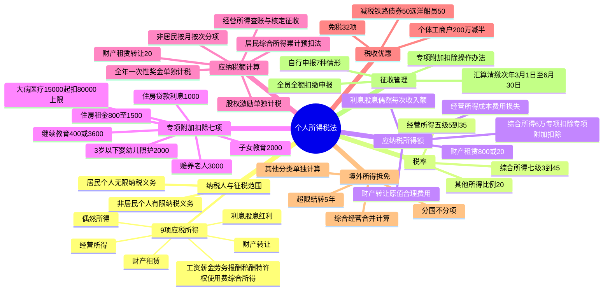

## 1. 章节定位

| 项目 | 信息 |
|------|------|
| 所属科目 | 税法 |
| 难度等级 | 5 |
| 历年分值 | 8-10 分 |
| 建议学时 | 10-12 小时 |
| 知识关联章节 | 第1章 税法总论、第4章 企业所得税法、第12章 国际税收、第14章 税收征收管理法 |

## 2. 考情分析

本章是税法科目的核心重点章，历年分值约 8-10 分，与第4章企业所得税法并称"所得税双雄"，必出计算问答题，常在综合题中与增值税、企业所得税结合考查。本章内容繁多、政策性强、计算量大，是决定税法科目能否通过的关键章节之一。

**命题规律**：本章考查综合运用能力，题型覆盖客观题、计算问答题和综合题。高频考点包括：居民个人与非居民个人的判定标准（住所+183天）、9 项应税所得的归类与界限（特别是工资薪金与劳务报酬、稿酬与特许权使用费的区分）、综合所得七级超额累进税率（3%-45%）与速算扣除数的运用、经营所得五级超额累进税率（5%-35%）、专项附加扣除七项标准（3岁以下婴幼儿照护2000元/月、子女教育2000元/月、继续教育400元/月或3600元/年、大病医疗15000元起扣80000元上限、住房贷款利息1000元/月、住房租金800/1100/1500元/月、赡养老人3000元/月）、应纳税所得额计算（居民综合所得=收入额-6万-专项扣除-专项附加扣除-其他扣除）、累计预扣法预扣预缴、全年一次性奖金单独计税、股权激励单独计税、稿酬收入额减按70%计算、劳务报酬与特许权使用费收入额按80%计算、财产租赁所得800元/20%费用扣除、财产转让所得20%税率、境外所得分国不分项抵免（综合所得+经营所得+其他分类所得）、汇算清缴次年3月1日至6月30日、个体工商户应纳税所得额不超过200万元减半征收。

**复习建议**：本章学习应以"应纳税额计算"为核心，构建"收入额-费用扣除-专项附加扣除-应纳税所得额-适用税率-应纳税额"的计算链条。重点掌握居民个人综合所得的预扣预缴（累计预扣法）与年度汇算清缴的差异，熟练运用各项扣除标准。专项附加扣除七项的标准与扣除规则需分类记忆，注意扣除条件与限额。全年一次性奖金、股权激励、解除劳动合同补偿金等特殊计算需单独掌握。境外所得抵免的"分国不分项"原则与5年结转规则是难点。建议通过大量练习题巩固各项所得的计算，特别是综合所得汇算清缴、经营所得查账征收、财产租赁与转让所得的综合计算。

## 3. 知识框架

## 4. 核心精讲

### 4.1 纳税义务人与征税范围

#### 4.1.1 纳税义务人

个人所得税的纳税义务人，包括中国居民、个体工商业户、个人独资企业和合伙企业个人投资者、在中国境内有所得的外籍人员和香港、澳门、台湾同胞。依据住所和居住时间两个标准，区分为居民个人和非居民个人。

**居民个人**：在中国境内有住所，或者无住所而一个纳税年度在中国境内居住累计满 183 天的个人。居民个人承担无限纳税义务，其取得的应纳税所得，无论来源于中国境内还是境外，都要在中国缴纳个人所得税。

- 在中国境内有住所：因户籍、家庭、经济利益关系而在中国境内习惯性居住的个人
- 一个纳税年度在境内居住累计满 183 天：公历 1 月 1 日起至 12 月 31 日止，在中国境内居住累计满 183 天（取消原临时离境规定，按实际居住时间确定）
- 在中国境内停留当天满 24 小时的，计入居住天数；不足 24 小时的，不计入

**非居民个人**：在中国境内无住所又不居住，或者无住所而一个纳税年度内在境内居住累计不满 183 天的个人。非居民个人承担有限纳税义务，仅就来源于中国境内的所得缴纳个人所得税。

#### 4.1.2 征税范围（9 项应税所得）

| 应税所得项目 | 适用税率 | 计税方式 | 收入额确定 |
|------|------|------|------|
| 工资、薪金所得 | 七级累进3-45% | 居民按年合并（综合所得）；非居民按月 | 全额计入 |
| 劳务报酬所得 | 七级累进3-45% | 居民按年合并；非居民按次 | 收入×(1-20%) |
| 稿酬所得 | 七级累进3-45% | 居民按年合并；非居民按次 | 收入×(1-20%)×70% |
| 特许权使用费所得 | 七级累进3-45% | 居民按年合并；非居民按次 | 收入×(1-20%) |
| 经营所得 | 五级累进5-35% | 按年计征 | 收入总额-成本费用损失 |
| 利息、股息、红利所得 | 比例20% | 按次计征 | 每次收入额 |
| 财产租赁所得 | 比例20%（居民住房10%） | 按月计征 | 收入-800或×(1-20%) |
| 财产转让所得 | 比例20% | 按次计征 | 收入-财产原值-合理费用 |
| 偶然所得 | 比例20% | 按次计征 | 每次收入额 |

**工资、薪金所得**：个人因任职或者受雇取得的工资、薪金、奖金、年终加薪、劳动分红、津贴、补贴以及与任职或者受雇有关的其他所得。不计入工资薪金的项目：独生子女补贴、公务员工资制度未纳入基本工资的补贴津贴差额、托儿补助费、差旅费津贴误餐补助、外国来华留学生生活津贴费奖学金。

**劳务报酬所得**：个人独立从事各种非雇用的劳务（设计、装潢、安装、化验、医疗、法律、会计、咨询、讲学、翻译、书画、雕刻、影视、录音、录像、演出、表演、广告、展览、技术服务、介绍服务、经纪服务、代办服务等26项）。个人担任董事且不在公司任职的董事费按劳务报酬计征；在公司任职同时兼任董事的，董事费与工资合并按工资薪金计征。

**稿酬所得**：个人因其作品以图书、报刊形式出版、发表而取得的所得。不以图书报刊形式出版发表的翻译、审稿、书画所得归为劳务报酬所得。

**特许权使用费所得**：个人提供专利权、商标权、著作权（不包括稿酬所得）、非专利技术以及其他特许权的使用权取得的所得。

**经营所得**：个体工商户从事生产、经营活动取得的所得；个人独资企业投资人、合伙企业的个人合伙人来源于境内注册的个人独资企业、合伙企业生产、经营的所得；个人依法从事办学、医疗、咨询以及其他有偿服务活动取得的所得；个人对企业、事业单位承包经营、承租经营以及转包、转租取得的所得；个人从事其他生产、经营活动取得的所得。

**利息、股息、红利所得**：个人拥有债权、股权而取得的所得。除国债和国家发行的金融债券利息外，应当依法缴纳个人所得税。

**财产租赁所得**：个人出租不动产、机器设备、车船以及其他财产取得的所得，包括转租收入。

**财产转让所得**：个人转让有价证券、股权、合伙企业中的财产份额、不动产、机器设备、车船以及其他财产取得的所得。个人转让上市公司股票所得暂免征收个人所得税。

**偶然所得**：个人得奖、中奖、中彩以及其他偶然性质的所得。

#### 4.1.3 所得来源地的确定

来源于中国境内的所得（不论支付地点）：
1. 因任职、受雇、履约等而在中国境内提供劳务取得的所得
2. 将财产出租给承租人在中国境内使用而取得的所得
3. 转让中国境内的不动产等财产或者在中国境内转让其他财产取得的所得
4. 许可各种特许权在中国境内使用而取得的所得
5. 从中国境内企业、事业单位、其他组织以及居民个人取得的利息、股息、红利所得

### 4.2 税率

#### 4.2.1 综合所得适用税率（七级超额累进税率 3%-45%）

| 级数 | 全年应纳税所得额 | 税率 | 速算扣除数（元） |
|------|------|------|------|
| 1 | 不超过 36000 元的 | 3% | 0 |
| 2 | 超过 36000 元至 144000 元的部分 | 10% | 2520 |
| 3 | 超过 144000 元至 300000 元的部分 | 20% | 16920 |
| 4 | 超过 300000 元至 420000 元的部分 | 25% | 31920 |
| 5 | 超过 420000 元至 660000 元的部分 | 30% | 52920 |
| 6 | 超过 660000 元至 960000 元的部分 | 35% | 85920 |
| 7 | 超过 960000 元的部分 | 45% | 181920 |

居民个人取得工资薪金、劳务报酬、稿酬、特许权使用费四项所得，按纳税年度合并计算个人所得税。

#### 4.2.2 经营所得适用税率（五级超额累进税率 5%-35%）

| 级数 | 全年应纳税所得额 | 税率 | 速算扣除数（元） |
|------|------|------|------|
| 1 | 不超过 30000 元的 | 5% | 0 |
| 2 | 超过 30000 元至 90000 元的部分 | 10% | 1500 |
| 3 | 超过 90000 元至 300000 元的部分 | 20% | 10500 |
| 4 | 超过 300000 元至 500000 元的部分 | 30% | 40500 |
| 5 | 超过 500000 元的部分 | 35% | 65500 |

#### 4.2.3 其他所得适用税率

利息、股息、红利所得，财产租赁所得，财产转让所得和偶然所得适用比例税率，税率为 20%。个人按市场价格出租的居民住房取得的所得，暂减按 10% 税率征收。

### 4.3 应纳税所得额的确定

#### 4.3.1 每次收入的确定

- 非居民劳务报酬/稿酬/特许权使用费：一次性收入以取得该项收入为一次；同一事项连续取得收入以 1 个月内取得的收入为一次
- 财产租赁所得：1 个月内取得的收入为一次
- 利息、股息、红利所得：支付时取得的收入为一次
- 偶然所得：每次取得该项收入为一次

#### 4.3.2 费用减除标准

1. **居民个人综合所得**：每一纳税年度收入额减除费用 60000 元（5000 元/月）以及专项扣除、专项附加扣除和依法确定的其他扣除后的余额
2. **非居民个人工资薪金**：每月收入额减除费用 5000 元后的余额
3. **非居民劳务报酬/稿酬/特许权使用费**：每次收入额为应纳税所得额
4. **经营所得**：每一纳税年度收入总额减除成本、费用以及损失后的余额（无综合所得的，还可减除 60000 元、专项扣除、专项附加扣除等）
5. **财产租赁所得**：每次收入不超过 4000 元，减除 800 元；4000 元以上，减除 20% 费用
6. **财产转让所得**：转让财产收入额减除财产原值和合理费用后的余额
7. **利息、股息、红利所得和偶然所得**：每次收入额为应纳税所得额

#### 4.3.3 专项附加扣除（7 项）

| 扣除项目 | 扣除标准 | 扣除方式 | 备注 |
|------|------|------|------|
| 3岁以下婴幼儿照护 | 每孩每月 2000 元（年 24000 元） | 一方 100% 或双方各 50% | 出生当月至年满 3 岁前 1 个月 |
| 子女教育 | 每子女每月 2000 元（年 24000 元） | 一方 100% 或双方各 50% | 年满 3 岁至学历教育结束 |
| 继续教育 | 学历每月 400 元（年 4800 元，最长 48 个月）；职业资格当年 3600 元 | 本人扣除（本科及以下可选父母扣除） | 取得证书当年 |
| 大病医疗 | 医保目录自付超 15000 元部分，限额 80000 元 | 汇算清缴时据实扣除 | 本人或配偶，未成年子女分别计算 |
| 住房贷款利息 | 每月 1000 元（年 12000 元），最长 240 个月 | 一方扣除，年度内不得变更 | 首套住房贷款，仅一套 |
| 住房租金 | 直辖市等 1500 元/月；户籍超 100 万城市 1100 元/月；其他 800 元/月 | 签订租赁合同的承租人扣除 | 主要工作城市无自有住房 |
| 赡养老人 | 独生子女每月 3000 元；非独生子女分摊每月 3000 元（每人最高 1500 元） | 独生子女全额；非独生均摊/约定/指定分摊 | 被赡养人年满 60 岁 |

专项扣除、专项附加扣除和依法确定的其他扣除，以居民个人一个纳税年度的应纳税所得额为限额；一个纳税年度扣除不完的，不结转以后年度扣除。

#### 4.3.4 收入额的特殊规定

- 劳务报酬所得、特许权使用费所得以收入减除 20% 费用后的余额为收入额
- 稿酬所得的收入额减按 70% 计算（即稿酬收入额=收入×(1-20%)×70%=收入×56%）
- 个人将其所得对教育、扶贫、济困等公益慈善事业进行捐赠，捐赠额未超过申报的应纳税所得额 30% 的部分，可以从其应纳税所得额中扣除；国务院规定全额税前扣除的，从其规定

### 4.4 应纳税额的计算

#### 4.4.1 居民个人综合所得应纳税额

**计算公式**：
应纳税额 = 全年应纳税所得额 × 适用税率 - 速算扣除数
=（全年收入额 - 60000 - 专项扣除 - 专项附加扣除 - 依法确定的其他扣除）× 适用税率 - 速算扣除数

其中：
- 工资薪金所得全额计入收入额
- 劳务报酬所得、特许权使用费所得收入额 = 收入 × (1-20%)
- 稿酬所得收入额 = 收入 × (1-20%) × 70%

#### 4.4.2 累计预扣法（工资薪金预扣预缴）

扣缴义务人向居民个人支付工资薪金所得时，按累计预扣法计算预扣税款：

本期应预扣预缴税额 =（累计预扣预缴应纳税所得额 × 预扣率 - 速算扣除数）- 累计减免税额 - 累计已预扣预缴税额

累计预扣预缴应纳税所得额 = 累计收入 - 累计免税收入 - 累计减除费用（5000 元/月×月份数）- 累计专项扣除 - 累计专项附加扣除 - 累计其他扣除

预扣率表与综合所得税率表一致（3%-45%）。

#### 4.4.3 劳务报酬、稿酬、特许权使用费预扣预缴

- 减除费用：每次收入不超过 4000 元减除 800 元；4000 元以上减除 20%
- 劳务报酬适用预扣预缴率表（20%-40%），稿酬、特许权使用费适用 20% 比例预扣率
- 稿酬所得收入额减按 70% 计算

劳务报酬预扣预缴率表：

| 级数 | 预扣预缴应纳税所得额 | 预扣率 | 速算扣除数（元） |
|------|------|------|------|
| 1 | 不超过 20000 元的 | 20% | 0 |
| 2 | 超过 20000 元至 50000 元的部分 | 30% | 2000 |
| 3 | 超过 50000 元的部分 | 40% | 7000 |

#### 4.4.4 非居民个人应纳税额计算

非居民个人工资薪金、劳务报酬、稿酬、特许权使用费所得，按月换算后综合所得税率表（月度税率表）计算：

| 级数 | 应纳税所得额 | 税率 | 速算扣除数（元） |
|------|------|------|------|
| 1 | 不超过 3000 元的 | 3% | 0 |
| 2 | 超过 3000 元至 12000 元的部分 | 10% | 210 |
| 3 | 超过 12000 元至 25000 元的部分 | 20% | 1410 |
| 4 | 超过 25000 元至 35000 元的部分 | 25% | 2660 |
| 5 | 超过 35000 元至 55000 元的部分 | 30% | 4410 |
| 6 | 超过 55000 元至 80000 元的部分 | 35% | 7160 |
| 7 | 超过 80000 元的部分 | 45% | 15160 |

非居民个人不办理汇算清缴，由扣缴义务人按月或按次代扣代缴。

#### 4.4.5 经营所得应纳税额

应纳税额 = 全年应纳税所得额 × 适用税率 - 速算扣除数
=（全年收入总额 - 成本、费用以及损失）× 适用税率 - 速算扣除数

个体工商户主要扣除项目规定：
- 业主费用扣除标准 60000 元/年（5000 元/月），业主工资不得税前扣除
- 从业人员合理工资薪金准予扣除
- 工会经费 2%、职工福利费 14%、职工教育经费 2.5%（超过结转）
- 业务招待费按 60% 扣除但最高不超过销售（营业）收入 5‰
- 广告费和业务宣传费不超过销售（营业）收入 15%（超过结转）
- 生产经营与个人家庭混用难以分清的费用，40% 视为与生产经营有关准予扣除
- 亏损结转最长 5 年

自 2023 年 1 月 1 日至 2027 年 12 月 31 日，对个体工商户年应纳税所得额不超过 200 万元的部分，减半征收个人所得税。

个人独资企业和合伙企业：
- 投资者费用扣除标准 60000 元/年
- 自 2022 年 1 月 1 日起，持有股权、股票、合伙企业财产份额等权益性投资的个人独资企业、合伙企业，一律适用查账征收方式
- 核定征收应税所得率：工业/交通运输/商业 5%-20%；建筑/房地产 7%-20%；饮食服务 7%-25%；娱乐业 20%-40%；其他 10%-30%

#### 4.4.6 财产租赁所得应纳税额

应纳税所得额：
- 每次（月）收入不超过 4000 元：应纳税所得额 = 每次收入额 - 准予扣除项目 - 修缮费用（800 元为限）- 800 元
- 每次（月）收入超过 4000 元：应纳税所得额 =（每次收入额 - 准予扣除项目 - 修缮费用（800 元为限））× (1-20%)

扣除次序：①财产租赁过程中缴纳的税费；②向出租方支付的租金（转租）；③修缮费用（800 元为限）；④法定费用扣除标准。

应纳税额 = 应纳税所得额 × 适用税率（20%，居民住房 10%）

#### 4.4.7 财产转让所得应纳税额

应纳税额 =（收入总额 - 财产原值 - 合理费用）× 20%

个人住房转让所得：房屋原值具体区分商品房、自建住房、经济适用房、已购公有住房、城镇拆迁安置住房等；转让住房缴纳的税金（城建税、教育费附加、土地增值税、印花税等）可扣除；合理费用包括住房装修费用（已购公房/经济适用房最高 15%，商品房最高 10%）、住房贷款利息、手续费、公证费等。

个人转让股权：以股权转让收入减除股权原值和合理费用后的余额为应纳税所得额。股权原值确认方法：现金出资按实际支付价款+相关税费；非货币性资产出资按税务机关认可价格+相关税费；无偿让渡按合理税费+原持有人股权原值；多次取得同一企业股权采用加权平均法。

#### 4.4.8 利息、股息、红利所得和偶然所得应纳税额

应纳税额 = 每次收入额 × 20%

### 4.5 全年一次性奖金等特殊计算

#### 4.5.1 全年一次性奖金

2027 年 12 月 31 日前，居民个人取得全年一次性奖金，可选择不并入当年综合所得，单独计税：
1. 将全年一次性奖金除以 12 个月，按其商数依照按月换算后的综合所得税率表确定适用税率和速算扣除数
2. 应纳税额 = 全年一次性奖金收入 × 适用税率 - 速算扣除数
3. 一个纳税年度内，该计税办法只允许采用一次

也可选择并入当年综合所得计算纳税。

#### 4.5.2 股权激励

居民个人取得股票期权、股票增值权、限制性股票、股权奖励等股权激励，2027 年 12 月 31 日前，不并入当年综合所得，全额单独适用综合所得税率表计算：

应纳税额 = 股权激励收入 × 适用税率 - 速算扣除数

一个纳税年度内取得两次以上股权激励的，应合并计算。

#### 4.5.3 解除劳动合同经济补偿金

个人因与用人单位解除劳动关系取得的一次性补偿收入，在当地上年职工平均工资 3 倍数额以内的部分免征个人所得税；超过 3 倍部分，不并入当年综合所得，单独适用综合所得税率表计算纳税。

#### 4.5.4 提前退休补贴收入

个人办理提前退休手续取得的一次性补贴收入，按办理提前退休至法定离退休年龄之间的实际年度数平均分摊，确定适用税率和速算扣除数，单独适用综合所得税率表计算。

#### 4.5.5 个人养老金

自 2024 年 1 月 1 日全国范围实施：
- 缴费环节：按 12000 元/年限额在综合所得或经营所得中据实扣除
- 投资环节：投资收益暂不征收个人所得税
- 领取环节：不并入综合所得，单独按 3% 税率计算缴纳

#### 4.5.6 商业健康保险

自 2017 年 7 月 1 日起，个人购买符合规定的商业健康保险产品支出，扣除限额 2400 元/年（200 元/月）。

### 4.6 境外所得的税额扣除

**抵免原则**：居民个人从中国境外取得的所得，可以从其应纳税额中抵免已在境外缴纳的个人所得税税额，但抵免额不得超过该纳税人境外所得依照税法规定计算的应纳税额。

**分项计算规则**：
1. 来源于中国境外的综合所得，应与境内综合所得合并计算应纳税额
2. 来源于中国境外的经营所得，应与境内经营所得合并计算应纳税额（境外经营亏损不得抵减境内或他国应纳税所得额，但可用来源于同一国家以后年度经营所得弥补）
3. 来源于中国境外的利息、股息、红利所得，财产租赁所得，财产转让所得和偶然所得（其他分类所得），不与境内所得合并，分别单独计算应纳税额

**分国不分项**：来源于一国（地区）的所得抵免限额 = 来源于该国综合所得抵免限额 + 经营所得抵免限额 + 其他分类所得抵免限额

**超限结转**：实际已缴税额超过抵免限额的，超过部分不得在本纳税年度抵免，但可在以后 5 个纳税年度内来源于该国所得的抵免限额余额中补扣。

**申报期限**：居民个人从境外取得所得，应当在取得所得的次年 3 月 1 日至 6 月 30 日内申报纳税。

### 4.7 税收优惠

#### 4.7.1 免征个人所得税（主要项目）

1. 省级人民政府、国务院部委、军以上单位及外国组织、国际组织颁发的科学、教育、技术、文化、卫生、体育、环境保护等方面的奖金
2. 国债和国家发行的金融债券利息
3. 按照国家统一规定发给的补贴、津贴（政府特殊津贴、院士津贴等）
4. 福利费、抚恤金、救济金
5. 保险赔款
6. 军人的转业费、复员费、退役金
7. 按国家统一规定发给的安家费、退职费、基本养老金或退休费、离休费、离休生活补助费
8. 住房公积金、医疗保险金、基本养老保险金、失业保险金（规定比例内部分）
9. 个人转让自用 5 年以上且是唯一家庭生活用房取得的所得
10. 个人转让上市公司股票取得的所得暂免征收
11. 持股期限超过 1 年的股息红利所得暂免征收；1 个月以内全额计税，1 个月以上至 1 年减按 50% 计税
12. 购买社会福利有奖募捐奖券、体育彩票一次中奖收入不超过 10000 元的暂免征收
13. 个人举报、协查各种违法、犯罪行为而获得的奖金
14. 外籍个人从外商投资企业取得的股息、红利所得

#### 4.7.2 减征个人所得税

1. 个人投资者持有 2024-2027 年发行的铁路债券取得的利息收入，减按 50% 计入应纳税所得额
2. 一个纳税年度内在船航行时间累计满 183 天的远洋船员，其工资薪金收入减按 50% 计入应纳税所得额
3. 残疾、孤老人员和烈属的所得，因自然灾害遭受重大损失的，由省级人民政府规定减征幅度和期限
4. 个体工商户年应纳税所得额不超过 200 万元的部分减半征收（2023-2027 年）

### 4.8 征收管理

#### 4.8.1 自行申报纳税

有下列情形之一的，纳税人应当依法办理纳税申报：
1. 取得综合所得需要办理汇算清缴
2. 取得应税所得没有扣缴义务人
3. 取得应税所得，扣缴义务人未扣缴税款
4. 取得境外所得
5. 因移居境外注销中国户籍
6. 非居民个人在中国境内从两处以上取得工资、薪金所得
7. 国务院规定的其他情形

#### 4.8.2 综合所得汇算清缴

纳税人取得综合所得，按纳税年度合并计算个人所得税，并依法办理汇算清缴。

**汇算清缴公式**：
应退或应补税额 =[（综合所得收入额 - 6 万元 - 专项扣除 - 专项附加扣除 - 其他扣除 - 公益捐赠）× 适用税率 - 速算扣除数] - 减免税额 - 已预缴税额

**办理期限**：次年 3 月 1 日至 6 月 30 日。

**免于办理汇算清缴**（2027 年 12 月 31 日前）：
- 年度综合所得收入不超过 12 万元且需要补税的
- 年度汇算清缴补税金额不超过 400 元的

**需要办理汇算清缴**：
- 已预缴税额大于实际应纳税额且申请退税的
- 已预缴税额小于实际应纳税额且不符合免办条件的
- 因适用所得项目错误、扣缴义务人未依法履行扣缴义务等造成少申报或未申报的

#### 4.8.3 全员全额扣缴申报

扣缴义务人向个人支付应税款项时，应当依法预扣或代扣税款，按时代缴国库，并专项记载备查。扣缴义务人每月或每次预扣、代扣的税款，应当在次月 15 日内缴入国库，并向税务机关报送《个人所得税扣缴申报表》。

扣缴义务人依法履行代扣代缴义务，按年付给 2% 手续费。

#### 4.8.4 经营所得纳税申报

纳税人取得经营所得，按年计算个人所得税，由纳税人在月度或季度终了后 15 日内办理预缴纳税申报（《个人所得税经营所得纳税申报表 A 表》）；在取得所得的次年 3 月 31 日前办理汇算清缴（《B 表》）；从两处以上取得经营所得的，选择向其中一处办理年度汇总申报（《C 表》）。

#### 4.8.5 专项附加扣除操作办法

享受时间：
- 3 岁以下婴幼儿照护：出生当月至年满 3 周岁前 1 个月
- 子女教育：年满 3 岁当月至小学入学前 1 个月；学历教育入学当月至结束当月
- 继续教育：学历教育入学当月至结束当月（最长 48 个月）；职业资格取得证书当年
- 大病医疗：医药费用实际支出当年
- 住房贷款利息：贷款合同约定开始还款当月至全部归还或合同终止当月（最长 240 个月）
- 住房租金：租赁合同约定租赁期开始当月至结束当月
- 赡养老人：被赡养人年满 60 周岁当月至赡养义务终止年末

报送方式：通过远程办税端（个税 APP、自然人电子税务局网站）、电子或纸质报表等方式报送扣缴义务人或主管税务机关。

后续管理：纳税人应将《扣除信息表》及相关留存备查资料自汇算清缴期结束后保存 5 年。

#### 4.8.6 反避税规定

有下列情形之一的，税务机关有权按合理方法进行纳税调整：
1. 个人与其关联方之间的业务往来不符合独立交易原则而减少应纳税额，且无正当理由
2. 居民个人控制的设立在实际税负明显偏低的国家（地区）的企业，无合理经营需要，对应当归属于居民个人的利润不作分配或减少分配
3. 个人实施其他不具有合理商业目的的安排而获取不当税收利益

税务机关作出纳税调整需补征税款的，应当补征税款，并依法加收利息（按税款所属纳税申报期最后一日人民币贷款基准利率计算）。

## 5. 典型例题

### 例题 1：居民个人综合所得应纳税额计算

某居民个人纳税人 2025 年扣除"三险一金"后共取得含税工资收入 120000 元，除住房贷款专项附加扣除外，不享受其他专项附加扣除和其他扣除。计算其当年应纳个人所得税税额。

**解答**：
1. 全年应纳税所得额 = 120000 - 60000 - 12000 = 48000（元）
2. 应纳税额 = 48000 × 10% - 2520 = 2280（元）

### 例题 2：居民个人综合所得（多项所得）应纳税额计算

某居民个人为独生子女，2025 年交完社保和住房公积金后共取得税前工资收入 20 万元，劳务报酬 20000 元，稿酬 10000 元。该纳税人有两个小孩且均由其扣除子女教育专项附加，父母健在且均已年满 60 岁。计算其当年应纳个人所得税税额。

**解答**：
1. 全年应纳税所得额 = 200000 + 20000 × (1-20%) + 10000 × 70% × (1-20%) - 60000 - 24000 × 2 - 36000
   = 200000 + 16000 + 5600 - 60000 - 48000 - 36000 = 77600（元）
2. 应纳税额 = 77600 × 10% - 2520 = 5240（元）

### 例题 3：累计预扣法计算

某居民个人 2025 年每月取得工资收入 10000 元，每月缴纳社保费用和住房公积金 1500 元，全年享受住房贷款利息专项附加扣除，计算工资扣缴义务人 2025 年 1 月、2 月、12 月代扣代缴的税款金额。

**解答**：
- 2025 年 1 月：
  - 累计预扣预缴应纳税所得额 = 10000 - 5000 - 1500 - 1000 = 2500（元）
  - 本期应预扣预缴税额 = 2500 × 3% = 75（元）
- 2025 年 2 月：
  - 累计预扣预缴应纳税所得额 = 20000 - 10000 - 3000 - 2000 = 5000（元）
  - 本期应预扣预缴税额 = 5000 × 3% - 75 = 75（元）
- 2025 年 12 月：
  - 累计预扣预缴应纳税所得额 = 120000 - 60000 - 18000 - 12000 = 30000（元）
  - 本期应预扣预缴税额 = 30000 × 3% - 75 × 11 = 75（元）

### 例题 4：劳务报酬预扣预缴

歌星刘某一次取得表演收入 40000 元，计算应预扣预缴个人所得税税额。

**解答**：
- 应预扣预缴税额 = 预扣预缴应纳税所得额 × (1-20%) × 预扣率 - 速算扣除数
- = 40000 × (1-20%) × 30% - 2000 = 7600（元）

### 例题 5：稿酬预扣预缴

某作家为居民个人，2024 年 3 月取得一次未扣除个人所得税的稿酬收入 20000 元，计算应预扣预缴个人所得税税额。

**解答**：
- 应预扣预缴税额 = 预扣预缴应纳税所得额 × 预扣率
- = 20000 × (1-20%) × 70% × 20% = 2240（元）

### 例题 6：非居民个人应纳税额

某外商投资企业工作的美国专家（非居民纳税人）2024 年 2 月取得含税工资收入 10400 元人民币，从别处取得劳务报酬 5000 元。计算当月应纳个人所得税。

**解答**：
1. 工资薪金应纳税额 = (10400 - 5000) × 10% - 210 = 330（元）
2. 劳务报酬应纳税额 = 5000 × (1-20%) × 10% - 210 = 190（元）

### 例题 7：财产租赁所得

刘某 2025 年 1 月将自有 150 平方米公寓按市场价出租给张某居住，每月租金 4500 元，全年租金 54000 元。计算全年租金收入应缴纳个人所得税（不考虑其他税费）。

**解答**：
- 按市场价出租给个人居住适用 10% 税率
- 每月应纳税额 = 4500 × (1-20%) × 10% = 360（元）
- 全年应纳税额 = 360 × 12 = 4320（元）

### 例题 8：财产转让所得

某居民个人建房一幢，造价 360000 元，支付其他费用 50000 元。建成后出售，售价 600000 元，支付交易费等税费 35000 元。计算应纳个人所得税。

**解答**：
1. 应纳税所得额 = 600000 - (360000 + 50000) - 35000 = 155000（元）
2. 应纳税额 = 155000 × 20% = 31000（元）

### 例题 9：全年一次性奖金

中国居民个人李某 2023 年 1-12 月每月税后工资 5200 元，12 月 31 日一次性领取年终含税奖金 60000 元。计算年终奖应缴纳个人所得税。

**解答**：
1. 按 12 个月分摊：每月奖金 = 60000 ÷ 12 = 5000（元），适用税率 10%，速算扣除数 210
2. 应纳税额 = 60000 × 10% - 210 = 5790（元）

### 例题 10：个体工商户经营所得

某个体工商户 2023 年 12 月取得经营收入 320000 元，准许扣除当月成本费用（不含业主工资）及相关税金 250600 元。1-11 月累计应纳税所得额 88400 元（未扣除业主费用扣除标准），1-11 月累计已预缴个人所得税 10200 元。除经营所得外业主无其他收入，全年享受赡养老人专项附加扣除和残疾人政策减免税额 2000 元。不考虑专项扣除和其他扣除，计算 2023 年度汇算清缴应申请的个人所得税退税额。

**解答**：
1. 全年应纳税所得额 = 320000 - 250600 + 88400 - 60000 - 36000 = 61800（元）
2. 全年应缴纳个人所得税 = [(61800 × 10% - 1500) - 2000] × 50% = 1340（元）
3. 应申请退税额 = 10200 - 1340 = 8860（元）

### 例题 11：境外所得抵免

居民个人王某 2023 年取得境内工资收入 135000 元，单位代扣"三险一金"15000 元。从境外甲国获得劳务报酬 50000 元、稿酬 20000 元和利息 10000 元，分别就三项收入在甲国缴纳税款 10000 元、1000 元和 2000 元。除 60000 元费用扣除、专项扣除 15000 元和专项附加扣除 12000 元外，不考虑其他费用扣除和境内预缴税额。计算甲国所得抵免限额。

**解答**：
1. 王某 2023 年境内外全部综合所得收入额 = 135000 + 50000 × (1-20%) + 20000 × (1-20%) × 70% = 186200（元）
2. 王某 2023 年境内外全部综合所得应纳税额 = (186200 - 60000 - 15000 - 12000) × 10% - 2520 = 7400（元）
3. 来源于甲国综合所得抵免限额 = 7400 × (40000 + 11200) ÷ (135000 + 40000 + 11200) = 2034.8（元）
4. 来源于甲国其他分类所得抵免限额 = 10000 × 20% = 2000（元）
5. 来源于甲国所得抵免限额 = 2034.8 + 2000 = 4034.8（元）

## 6. 记忆口诀

1. **居民非居民判定**：住所有无加一八三，居民全球非居民境内；住所有者即居民，无住所看 183 天
2. **九项所得分类**：工劳稿特综所得，经营利息股红得，财产租赁与转让，偶然所得共九项
3. **综合所得四项**：工资薪金劳务酬，稿酬特许使用费，居民按年合并算，七级累进三到四十五
4. **稿酬收入额**：稿酬减除二成费，再按七折算收入，实际收入五成六，税负最低享优惠
5. **经营所得五级**：经营五级五到三十五，应纳税所得三万起，速算扣除零到六五五〇
6. **专项附加七项**：婴幼子教续教育，大病房贷与房租，赡养老人共七项，标准金额要记清
7. **专项附加扣除标准**：婴幼子教各二千，继续教育四百起，大病一万五起扣八万，房贷一千租八百到一千五，赡养三千独非独
8. **费用扣除六万**：居民综合所得六万扣，非居民每月扣五千，经营所得无综合再扣六万
9. **预扣预缴方法**：工资累计预扣法，劳务报酬分次扣，稿酬特许按次预，汇算清缴多退少补
10. **全年一次性奖金**：奖金除以十二定税率，单独计税不并入，年度一次限一人，二〇二七前可选择
11. **股权激励单独计税**：股票期权增值权，限制性股股权奖，不并入综合单独算，二〇二七前优惠延
12. **境外所得抵免**：分国不分项抵免，综合经营合并算，分类所得单独计，超限五年可结转
13. **汇算清缴期限**：次年三月一到六月三十，综合所得汇算清，补税四百以下免，收入十二万以下免
14. **扣缴手续费**：扣缴义务人代扣代缴，按年付给二% 手续费，依法履行不得拒
15. **个体工商户优惠**：应纳税所得二百万，减半征收个所得税，二〇二三到二〇二七，可叠加其他优惠
16. **住房贷款利息**：首套房贷利息扣，每月一千最长二十年，夫妻一方扣，年度内不得变更
17. **住房租金标准**：直辖市一千五，百万城市一千一，其他城市八百扣，主要工作无自有住房
18. **赡养老人分摊**：独生子女三千扣，非独生分摊最高一千五，约定指定均摊三方式，指定优于约定分摊
19. **公益捐赠扣除**：公益捐赠三成扣，全额扣除国务院定，分类所得当月扣，综合经营年汇算
20. **股票转让所得**：上市公司股票转让，暂免征收个所得税，限售股转让按二〇，原始股按财产转让
21. **财产租赁扣除次序**：税费租金修缮费，法定标准最后扣，修缮八百为限扣，住房按一〇税率
22. **反避税三情形**：关联交易非独立，低税地不分配利润，无合理商业目的安排，补税加收利息款

## 7. 同步练习

**1.（单选题）** 在中国境内无住所而一个纳税年度内在中国境内居住累计满一定期限的个人，为税收居民个人，该期限为（　）天。

A. 90
B. 180
C. 183
D. 365

**2.（单选题）** 下列所得中，应按"劳务报酬所得"征收个人所得税的是（　）。

A. 个人处置打包债权取得的收入
B. 个人取得不竞争款项
C. 个人取得的不在公司任职的董事费收入
D. 个人提供担保取得的收入

**3.（单选题）** 下列属于个人所得税征税范围中"特许权使用费所得"的是（　）。

A. 个人将自己的文字作品手稿原件拍卖取得的所得
B. 个人对其任职公司投资取得的股息
C. 个人为单位或他人提供担保获得收入
D. 个人因从事彩票代销业务而取得的所得

**4.（单选题）** 下列关于个人所得税"次"的规定，表述正确的是（　）。

A. 劳务报酬所得属于一次性收入的，以取得该项收入为一次
B. 劳务报酬所得属于同一事项连续取得收入的，将每笔收入相加为一次收入
C. 财产租赁所得，以合同约定的应付租金的日期取得的收入为一次
D. 特许权使用费所得，以一个月内取得的收入为一次

**5.（单选题）** 个人向个人养老金资金账户缴费时，在综合所得或经营所得中可以据实扣除的限额标准为（　）元/年。

A. 5000
B. 6000
C. 12000
D. 24000

**6.（单选题）** 对个人转让"新三板"挂牌公司原始股取得的所得，征收个人所得税的项目为（　）。

A. 财产转让所得
B. 财产租赁所得
C. 利息、股息、红利所得
D. 工资、薪金所得

**7.（单选题）** 下列收入免征个人所得税的是（　）。

A. 退休人员再任职取得的收入
B. 提前退休人员取得的一次性补贴收入
C. 员工从破产企业取得的一次性安置费
D. 残疾人员的个人所得

**8.（单选题）** 个人取得的下列所得中，应确定为来源于中国境内所得的是（　）。

A. 在境外开办教育培训取得的所得
B. 特许权许可在境外使用而取得的所得
C. 从境外上市公司取得的股息所得
D. 将境内房产转让给外国人取得的所得

**9.（单选题）** 个人转让上市公司限售股，如果纳税人未能提供完整、真实的限售股原值凭证的，不能准确计算限售股原值的，主管税务机关一律按限售股转让收入的一定比例核定限售股原值及合理税费，该比例为（　）。

A. 10%
B. 15%
C. 20%
D. 30%

**10.（单选题）** 2024年12月，李某出售了一套住房，转让金额为240万元，缴纳个人所得税4万元。2025年5月，其在同一城市重新购买了一套住房，新购住房金额为150万元。假定李某同时满足享受换购住房个人所得税政策的其他条件，以上金额均为不含增值税价格，则李某申请个人所得税退税的金额为（　）万元。

A. 2
B. 2.5
C. 3.2
D. 4

**11.（单选题）** 中国居民张某将自己收藏的古币通过拍卖行依法拍卖，该藏品的最终成交价格为250万元，支付拍卖公司上拍手续费、评估费等合计20万元，张某入手该枚古币时支出金额100万元，但无法提供财产原值凭证，张某应缴纳的个人所得税为（　）万元。

A. 1.5
B. 7.5
C. 20
D. 26

**12.（单选题）** 下列关于2024年个人所得税专项附加扣除，表述不符合规定的是（　）。

A. 纳税人的子女接受全日制学历教育的相关支出，按照每个子女每月2000元的标准定额扣除
B. 纳税人首套住房贷款利息支出在实际发生贷款利息的年度，按照每月1000元的标准定额扣除
C. 父母年满60岁的纳税人如果为独生子女，赡养老人支出按照每月3000元的标准定额扣除
D. 纳税人照护3岁以下婴幼儿子女的相关支出，按照每个婴幼儿每月1500元的标准定额扣除

**13.（单选题）** 下列各项中，应当在取得所得的次年3月1日至6月30日内办理汇算清缴的是（　）。

A. 非居民个人取得工资、薪金所得
B. 居民个人取得综合所得需要办理汇算清缴的
C. 居民个人取得财产转让所得
D. 居民个人取得的股权投资所得

**14.（单选题）** 个人独资企业的投资者及其家属发生的生活费用与企业生产经营费用混合在一起且难以划分的，其正确的账务处理是（　）。

A. 实际发生额不得在税前扣除
B. 实际发生额的 $60\%$ 可以在税前扣除
C. 实际发生额的 $40\%$ 可以在税前扣除
D. 实际发生额的 $10\%$ 可以在税前扣除

**15.（单选题）** 张某转让2024年无偿受赠的房屋，取得收入780000元，已知该房屋的实际购置成本500000元，受赠和转让过程中受赠人支付的除增值税以外的税费120000元。转让受赠房产应缴纳的个人所得税为（　）元。

A. 56000
B. 132000
C. 156000
D. 32000

**16.（单选题）** 个人取得的下列所得中，免予征收个人所得税的是（　）。

A. 企业职工李某领取原提存的住房公积金
B. 王某在单位任职表现突出获得5万元总裁特别奖金
C. 徐某因持有某非上市公司股票取得的年度分红
D. 一个纳税年度内，在船航行时间累计满183天的远洋船员，其取得的工资薪金收入

**17.（单选题）** 非居民个人取得工资薪金所得的征收管理，下列说法正确的是（　）。

A. 依据综合所得税率表，按月代扣代缴税款
B. 向扣缴义务人提供专项附加扣除信息的，可按扣除专项附加后的余额代扣税款
C. 扣缴义务人可将同期的工资薪金和股息红利所得合并代扣代缴税款
D. 由扣缴义务人按月代扣代缴税款，不办理汇算清缴

**18.（单选题）** 在甲市居住的丁某于2024年7月1日将自己的居住用房对外出租，每月收取的租金为8000元，租期为半年，当期未发生修缮费用，则丁某应就住房出租2024年应缴纳的个人所得税为（　）元。

A. 3621.89
B. 3679.5
C. 3686.4
D. 3763.2

**19.（单选题）**（2024年）承包人对经营成果不拥有所有权，仅是按合同（协议）规定取得一定所得，承包人取得的所得适用的个人所得税征税项目是（　）。

A. 财产转让所得
B. 工资、薪金所得
C. 偶然所得
D. 经营所得

**20.（单选题）**（2024年）取得综合所得的居民个人，其发生符合条件的下列支出中，只能在个人所得税汇算清缴时办理扣除的是（　）。

A. 继续教育支出
B. 个人养老金支出
C. 子女教育支出
D. 大病医疗支出

**21.（单选题）**（2024年）个人取得出租财产所得，税前扣除税费的扣除次序是（　）。

A. 财产租赁过程中缴纳的税费、向出租方支付的租金、由纳税人负担的租赁财产实际开支的修缮费用、税法规定的费用扣除标准
B. 向出租方支付的租金、由纳税人负担的租赁财产实际开支的修缮费用、财产租赁过程中缴纳的税费、税法规定的费用扣除标准
C. 财产租赁过程中缴纳的税费、由纳税人负担的租赁财产实际开支的修缮费用、向出租方支付的租金、税法规定的费用扣除标准
D. 税法规定的费用扣除标准、财产租赁过程中缴纳的税费、向出租方支付的租金、由纳税人负担的租赁财产实际开支的修缮费用

**22.（单选题）**（2023年）企业为职业经理人购买房产并将房产权属登记到其个人名下，缴纳个人所得税时适用的项目是（　）。

A. 利息、股息、红利所得
B. 劳务报酬所得
C. 工资、薪金所得
D. 偶然所得

**23.（单选题）**（2022年）下列各项中，属于"工资、薪金所得"项目的是（　）。

A. 彩票代销收入
B. 股票增值权所得
C. 独立董事的董事费收入
D. 提供担保收入

**24.（单选题）**（2022年）下列关于稿酬所得按次征收个人所得税的表述中，正确的是（　）。

A. 同一作品先出版、再连载的，应合为一次计税
B. 同一作品在两处以上出版的，应合为一次计税
C. 同一作品再版的，应视为另一次稿酬计税
D. 同一作品出版后加印的，应视为另一次稿酬计税

**25.（单选题）**（2021年）某个体工商户2024年实际发放员工工资30万元，在计算应缴个人所得税时，可以扣除的员工的职工福利费为（　）元。

A. 6000
B. 7500
C. 24000
D. 42000

**26.（单选题）**（2020年）下列关于企业员工取得与不可公开交易的股票期权相关所得计征个人所得税的表述中，符合税法规定的是（　）。

A. 员工行权时的施权价与该股票当日收盘价之间的差额，暂不征税
B. 员工行权后的股票再转让取得的收益，应按"工资、薪金所得"纳税
C. 员工接受企业授予的股票期权时，以当日收盘价按"劳务报酬所得"纳税
D. 员工因拥有股权而参与企业税后利润分配取得的所得，应按"利息、股息、红利所得"纳税

**27.（单选题）**（2020年）居民个人取得的下列所得中，在计缴个人所得税时可享受专项附加扣除的是（　）。

A. 偶然所得
B. 财产转让所得
C. 经营所得
D. 财产租赁所得

**28.（单选题）** 居民个人取得的下列所得，应纳入综合所得计征个人所得税的是（　）。

A. 偶然所得
B. 特许权使用费所得
C. 利息、股息、红利所得
D. 财产转让所得

**29.（单选题）** 下列关于个人所得税专项附加扣除时限的表述中，符合税法规定的是（　）。

A. 住房贷款利息，扣除时限最长不得超过120个月
B. 同一学历继续教育，扣除时限最长不得超过24个月
C. 技能人员职业资格继续教育，扣除时间为取得相关证书的当年
D. 大病医疗，扣除时间为医疗保障信息系统记录的医药费用实际支出的次年

**30.（单选题）** 某企业职员张某2024年12月与所任职的企业解除劳动合同关系，领取经济补偿金165500元。假定当地上年度职工年平均工资为28000元，张某取得的经济补偿金应缴纳的个人所得税为（　）元。

A. 0
B. 1600
C. 5630
D. 16180

**31.（单选题）** 非居民个人约翰2024年9月在我国某出版社出版一部长篇小说，应取得稿酬收入100000元（不含税），适用税率 $35\%$，速算扣除数7160元，该出版社应代扣代缴个人所得税（　）元。

A. 10040
B. 12440
C. 20840
D. 15400

**32.（单选题）** 某个体工商户发生的下列支出中，允许在个人所得税税前扣除的是（　）。

A. 家庭生活用电支出
B. 直接向某灾区小学的捐赠
C. 已缴纳的城市维护建设税及教育费附加
D. 代公司员工负担的个人所得税税款

**33.（单选题）** 2024年纳税人张某经营一家个体工商户，年应纳税所得额为60000元（适用税率 $10\%$，速算扣除数1500），那么张某2024年应缴纳的个人所得税为（　）元。

A. 0
B. 1125
C. 2250
D. 4500

**34.（单选题）** 根据规定，保险营销员、证券经纪人可以扣除的展业成本为（　）。

A. 不含增值税的收入减除 $20\%$ 费用后的余额的 $25\%$
B. 不含增值税的收入减除 $20\%$ 费用后的余额的 $30\%$
C. 不含增值税的收入减除 $20\%$ 费用后的余额的 $35\%$
D. 不含增值税的收入的 $25\%$

**35.（多选题）** 根据个人所得税法的规定，区分居民纳税人和非居民纳税人的判断标准包括（　）。

A. 住所
B. 居住时间
C. 国籍
D. 个人身份

**36.（多选题）** 居民个人综合所得预扣预缴个人所得税时，一律适用 $20\%$ 预扣率的有（　）。

A. 工资、薪金所得
B. 劳务报酬所得
C. 稿酬所得
D. 特许权使用费所得

**37.（多选题）** 下列各项应按照"财产转让所得"项目征收个人所得税的有（　）。

A. 个人转让住房取得的所得
B. 个人转让自有小汽车取得的所得
C. 个人将自己的文字作品手稿复印件拍卖取得的所得
D. 个人将其收藏的知名作家的作品手稿拍卖取得的所得

**38.（多选题）** 居民个人取得的下列收入中，按照"劳务报酬所得"项目预扣预缴个人所得税的有（　）。

A. 保险营销员取得的佣金收入
B. 公司职工取得的用于购买企业国有股权的劳动分红
C. 企业对非雇员以免费旅游形式给予的营销业绩奖励
D. 仅担任董事而不在该公司任职的个人取得的董事费

**39.（多选题）** 下列所得中，个人向个人养老金资金账户缴费时，可以在限额标准内据实扣除的有（　）。

A. 综合所得
B. 偶然所得
C. 经营所得
D. 财产租赁所得

**40.（多选题）** 下列关于个人所得税专项附加扣除，表述正确的有（　）。

A. 子女教育支出从符合条件的当月起开始起算，每个子女每月2000元定额扣除
B. 3岁以下婴幼儿照护支出从婴幼儿出生的当月至年满3周岁的前一个月，按照每个婴幼儿每月2000元的标准定额扣除
C. 学历继续教育在取得相关证书的年度，定额扣除3600元/年
D. 非独生子女赡养老人支出，每人分摊额度最高不超过每月1500元

**41.（多选题）** 下列关于居民个人换购住房退税的表述中，正确的有（　）。

A. 新购住房金额大于现住房转让金额的，全部退还已缴纳的个人所得税
B. 新购住房金额等于现住房转让金额的，全部退还已缴纳的个人所得税
C. 新购住房金额小于现住房转让金额的，按新购住房金额占现住房转让金额的比例退还出售现住房已缴纳的个人所得税
D. 新购住房金额小于现住房转让金额的，不退还转让现住房缴纳的个人所得税

**42.（多选题）** 下列关于综合所得专项附加扣除中的大病医疗支出的说法，正确的有（　）。

A. 纳税人发生的医保目录范围内的自付部分，才可以作为大病医疗支出扣除，医保目录范围外的自付部分，不得作为大病医疗支出扣除
B. 在一个纳税年度内，纳税人发生的与基本医保相关的医药费用支出，扣除医保报销后个人负担的部分，在80000元限额内据实扣除
C. 大病医疗支出可以在预扣预缴时扣除，也可以在汇算清缴时扣除
D. 纳税人应当留存医药服务收费及医保报销相关票据原件（或者复印件）等资料备查

**43.（多选题）** 下列专项附加扣除的项目中，可以商定选择夫妻一方税前扣除的有（　）。

A. 子女教育
B. 赡养老人
C. 3岁以下婴幼儿照护支出
D. 同在一地居住的租房租金

**44.（多选题）**（2024年）下列关于公益捐赠支出在计算居民个人所得税时税前扣除的表述中，符合税法规定的有（　）。

A. 当期在一个所得项目扣除不完的公益捐赠支出可以在其他所得项目中扣除
B. 在分类所得中扣除公益捐赠支出的扣除限额为当年分类所得应纳税所得额的 $50\%$
C. 在综合所得中扣除公益捐赠支出的，以当年综合所得应纳税所得额为依据计算扣除限额
D. 居民个人发生的公益捐赠支出可以在综合所得、经营所得或分类所得中扣除

**45.（多选题）**（2023年）下列居民个人取得的所得中，属于来源于我国境内所得的有（　）。

A. 境外获得的专利权在境内使用取得的所得
B. 被境内公司外派至境外任职取得的所得
C. 将境内财产出租至境外使用取得的所得
D. 将境内不动产转让至境外取得的所得

**46.（多选题）**（2022年）下列各项中，免征个人所得税的有（　）。

A. 提存养老保险
B. 生育医疗金
C. 丧葬补助金
D. 超标计提的住房公积金

**47.（多选题）**（2021年）下列关于个体工商户公益捐赠支出税前扣除的表述中，符合个人所得税法规定的有（　）。

A. 可自行选择按 $30\%$ 标准扣除和全额扣除的公益捐赠支出的扣除次序
B. 发生的公益捐赠支出在其经营所得中扣除
C. 应妥善留存捐赠相关票据至少5年
D. 只能选择其对年度经营所得汇算清缴时扣除

**48.（多选题）** 从事生产、经营的个人取得的下列所得中，应按照"经营所得"项目计征个人所得税的有（　）。

A. 提供有偿咨询服务的所得
B. 从事彩票代销业务的所得
C. 资金存入银行的利息所得
D. 从事个体出租车运营的所得

**49.（多选题）** 下列关于不可公开交易的股票期权个人所得税的表述中，正确的有（　）。

A. 员工接受实施股票期权计划企业授予的股票期权时，一般不征收个人所得税
B. 员工在行权日之前将股票期权转让的，以股票期权的转让净收入，按"工资、薪金所得"缴纳个人所得税
C. 员工行权时，从企业取得股票的实际购买价低于购买日公平市场价的差额，单独计算个人所得税
D. 员工因拥有股权而参与税后利润分配取得的所得，按"利息、股息、红利所得"缴纳个人所得税

**50.（多选题）** 下列关于企业年金的个人所得税政策，表述正确的有（　）。

A. 企业年金单位按规定缴费部分，在计入个人账户时，个人暂不缴纳个人所得税
B. 企业年金个人缴费部分，在不超过本人缴费工资计税基数的 $5\%$ 标准内的部分，暂从个人当期的应纳税所得额中扣除
C. 个人达到国家规定退休年龄，领取符合规定的企业年金时，不并入综合所得，全额单独计算应纳税款
D. 企业年金按年领取的，适用综合所得税率表计算纳税

**51.（多选题）** 香港黄先生通过沪港通机制购买上交所A股股票，持有和转让时个人所得税处理正确的有（　）。

A. 股票转让差价暂免征收个人所得税
B. 股票转让差价按"财产转让所得"缴纳 $20\%$ 个人所得税
C. 取得的股息红利所得，按照 $10\%$ 税率缴纳个人所得税
D. 取得的股息红利所得，实行差别化待遇缴纳个人所得税

**52.（多选题）** 下列汇算年度发生的未申报扣除或未足额扣除的税前扣除项目，纳税人可在年度汇算期间办理扣除或补充扣除的有（　）。

A. 减除费用6万元，以及符合条件的基本养老保险、基本医疗保险、失业保险等社会保险费和住房公积金等专项扣除
B. 符合条件的3岁以下婴幼儿照护、子女教育、继续教育、大病医疗、住房贷款利息或住房租金、赡养老人专项附加扣除
C. 符合条件的企业年金和职业年金、商业健康保险、个人养老金等其他扣除
D. 符合条件的公益慈善事业捐赠

**53.（多选题）** 纳税人在纳税年度已预缴个人所得税，下列情形中，需要办理年度汇算清缴的有（　）。

A. 年度汇算需补税但综合所得收入全年不超过12万元的
B. 因适用所得项目错误，造成少申报综合所得的
C. 已预缴税额大于年度应纳税额且申请退税的
D. 纳税人年度内取得的综合所得收入超过12万元且需要补税金额超过400元的

**54.（计算问答题）**（2024年）居民个人王某，父母均已年满70周岁，有两个子女分别在上小学和高中，2024年收入和支出情况如下：

（1）出版一部小说，6月从出版社取得预付稿酬收入80000元，年底小说正式出版又从该出版社取得稿酬收入20000元。

（2）通过红十字会向红十字事业捐赠20000元。

（3）每月工资收入20000元，其中包括三险一金5000元，每月享受首套住房贷款利息的房贷支出6000元。

（4）取得年终奖30000元，选择单独计税。

（其他相关资料：王某为独生子女，且享受的专项附加扣除比例为 $100\%$。）

要求：根据上述资料，按照下列序号回答问题，如有计算需计算出合计数。

（1）计算取得的稿酬预扣预缴个人所得税的合计金额。

（2）回答当年的捐赠能否在当年的工资薪金汇算清缴中全额扣除，并说明理由。

（3）计算综合所得应缴纳的个人所得税。（不考虑年终奖）

（4）计算年终奖应缴纳的个人所得税。

**55.（计算问答题）**（2024年）居民个人吴某为甲公司（境内A股上市公司）员工，因经营需要，2024年甲公司向吴某实施了股权激励计划，吴某接受该股票期权授权及行权情况如下：

（1）1月4日，吴某接受授权10000股的股票期权，约定半年内可以按照8元/股实施认购。

（2）3月2日，吴某按照约定行权10000股甲公司股票，当日股票收盘价为15元/股。

（3）5月8日，吴某按持股数量取得股息2000元。

（4）7月6日，吴某将持有的股票以20元/股转让，当日股票收盘价为20.5元/股。

（其他相关资料：不考虑吴某的专项附加扣除因素；上述期权授予时约定不得转让。）

要求：根据上述资料，按照下列序号回答问题，如有计算需计算出合计数。

（1）判断吴某接受该股票期权授权时是否需要缴纳个人所得税，并说明理由。

（2）计算吴某行权时应缴纳的个人所得税。

（3）说明股息收入个人所得税税收优惠并计算该项所得应缴纳的个人所得税。

（4）判断吴某取得转让股票收入是否需要缴纳个人所得税，并说明理由；如需要，计算应缴纳的个人所得税。

**56.（计算问答题）**（2024年）居民个人李某无自有住房，在工作的直辖市租房居住，每月支付租金0.6万元。李某与他人共同出资设立某合伙制创业投资企业，并按规定完成备案，李某拥有该合伙企业 $50\%$ 份额，按合伙协议约定份额对合伙企业取得的所得进行分配，2024年合伙制创业投资企业经营状况如下：

（1）转让持有投资满3年的初创科技型企业股权，取得收入500万元，其初始投资额100万元。

（2）发生其他成本、费用共计300万元（含支付两位合伙人工资50万元）。

（3）从投资的其他企业分回股息收入20万元，合伙企业所得全部按份额向合伙人分配。

（其他相关资料：合伙创投企业按年度所得整体核算，相关专项附加扣除均由李某 $100\%$ 扣除。）

要求：根据上述资料，按照下列序号回答问题，如有计算需计算出合计数。

（1）说明李某从合伙企业取得的投资分配收益所得适用的个人所得税项目及对应税率。

（2）说明合伙人在合伙企业取得的工资能否可以在缴纳个人所得税时税前扣除并说明理由。

（3）说明李某的股息所得适用的个人所得税项目，并计算应缴纳的个人所得税。

（4）计算李某从合伙企业分配的所得应缴纳的个人所得税。（假设无综合所得）

**57.（计算问答题）**（2023年）居民个人董某在某市拥有A、B两套住房。2024年将A住房出售并换购C住房一套，房屋买卖以及出租的相关具体情况如下：

（1）4月，将其拥有的住房A以市场价出售，取得不含增值税转让价款200万元，并支付转让过程中的相关税费共计2万元，该房为2013年8月购置的经济适用房，不含增值税房价款80万元，并缴纳契税0.8万元。另向装修公司支付装修费用10万元。

（2）6月，在该市购置了一套二手住房C，不含增值税成交价为160万元，已缴纳契税4.8万元。

（3）7月，以市场价格出租一套居住用房B，每月租金0.5万元，因该房屋漏水，当月支付修缮费用0.2万元。

（其他相关资料：当地转让经济适用房补交土地出让金税率为转让价的 $5\%$；上述相关税费不含增值税；税务机关已对住房A的装修费用进行审核；不考虑房屋出租过程中的相关税费。）

要求：根据上述资料，按照下列序号回答问题，如有计算需计算出合计数。

（1）计算董某转让住房A应缴纳的个人所得税。

（2）回答董某享受换购住房个人所得税优惠政策的退税计算依据，并计算董某应享受的退税款。

（3）回答董某申请享受换购住房个人所得税优惠政策时应提供的资料。

（4）计算董某7月取得的租金收入应缴纳的个人所得税。

**58.（计算问答题）**（2022年）居民个人徐先生任职于境内的甲企业，至今单身，父母55岁，个人所得税收入如下：

（1）4月份取得国债利息收入20000元，取得乙公司的公司债券利息50000元。

（2）7月份按照首套住房贷款利息购入一套改善性住房，从当月开始还房贷，每月8000元。

（3）8月份转让自己写的一本小说的著作权，取得收入30000元。

（4）每月取得扣除三险一金的工资收入17000元，每季度末获得季度奖金10000元。甲公司预扣预缴个人所得税19888元。

要求：根据上述资料，按照下列序号回答问题，如有计算需计算出合计数。

（1）计算徐先生取得利息应缴纳的个人所得税。

（2）说明住房贷款利息每月可以扣除的金额，从几月开始扣除。

（3）说明转让小说著作权适用的个人所得税应税项目并计算徐先生8月份转让著作权应预扣预缴的个人所得税。

（4）计算当年徐先生综合所得应补（退）个人所得税。

**59.（计算问答题）**（2022年）周某2024年期间收入情况如下：

（1）每月工资薪金收入12000元，其中允许扣除的三险一金为3000元。

（2）公司依照国家标准为周某办理了企业年金，周某自己每月缴纳400元。

（3）每月支付首套房贷款利息金额为5000元。

（4）6月委托某拍卖公司出售一个古董，取得不含增值税金额为10万元，该古董无法取得发票证明，且经相关机构鉴定是海外流失返回的古董。

（5）12月取得全年一次性奖金5万元，选择单独计算个人所得税。

（其他相关资料：周某税前扣除的资料均已提交，住房贷款利息支出由周某一个人扣除，周某上一年的月平均工资薪金收入是10000元，当地的上年平均工资薪金月收入为8000元。）

要求：根据上述资料，按照下列序号回答问题，如有计算需计算出合计数。

（1）回答周某自己缴纳的年金400元是否可以税前扣除。

（2）回答拍卖古董取得的10万元价款如何缴纳个人所得税并计算应缴纳的个人所得税。

（3）计算年度综合所得应缴纳的个人所得税。

（4）计算年终奖应缴纳的个人所得税。

**60.（计算问答题）**（2021年）张某之子小学在读，2024年3月生育一女，张某2024年收入和部分支出如下：

（1）每月工资9000元，含符合国家标准"三险一金"2000元。

（2）3月购买符合个人所得税税前扣除规定的商业健康保险，保费每年4000元，并于当月向公司提交保险凭证。

（3）4月通过出版社出版一部图书，税前稿费15000元。

（其他相关资料：相关专项附加扣除均由张某百分之百扣除，张某已向公司提交专项附加扣除资料。）

要求：根据上述资料，按照下列序号回答问题，如有计算需计算出合计数。

（1）判断张某能否因2024年3月女儿出生，享受当年度子女教育专项附加扣除，并说明理由及处理方法。

（2）判断张某每年缴纳的4000元商业健康保险保费能否全额扣除，并说明理由。

（3）计算出版社在支付稿酬时应代扣代缴的个人所得税。

**61.（计算问答题）**（2020年）居民个人张某与其妻子在某城市工作并居住。2024年与个人所得税汇算清缴相关的收入及支出如下：

（1）全年从单位领取扣除按规定比例缴纳的社保费用和住房公积金后的工资共计120000元，单位已为其预扣预缴个人所得税款1404元。

（2）利用业余时间为某公司提供技术指导取得劳务报酬20000元。

（3）每月按首套住房贷款利率为其购于某县城的自有房产偿还房贷2000元。

（4）在居住城市无自有住房，与其妻子一起租房居住，每月支付房租3000元。

（其他相关资料：张某工作地城市为除直辖市、省会城市、计划单列市及国务院确定其他城市之外的市辖区人口超过100万的城市；以上专项附加扣除均由张某 $100\%$ 扣除。）

要求：根据上述资料，按照下列序号回答问题，如有计算需计算出合计数。

（1）从税后所得最大化出发，回答张某应选择享受的专项附加扣除并说明理由。

（2）计算张某取得的劳务报酬应预扣预缴的个人所得税额。

（3）计算张某可申请的个人所得税退税款。

（4）张某如需办理2024年度个人所得税汇算清缴，回答其可选择哪些办理的渠道及受理的税务机关。

**62.（计算问答题）** 国内某高校张教授2024年取得部分收入项目如下：

（1）5月份出版了一本书稿，获得稿酬20000元。

（2）9月份，教师节期间获得全国教学名师奖，获得教育部颁发的奖金50000元。

（3）10月份取得5年期国债利息收入8700元，一年期储蓄存款利息收入500元，某上市公司发行的企业债券利息收入1500元。

（4）11月份因持有两年前购买的某上市公司股票10000股，取得该公司年中股票分红所得2000元，随后将该股票卖出，获得股票转让所得50000元。

（5）12月份应A公司邀请给公司财务人员培训，取得收入30000元，A公司未履行代扣代缴个人所得税义务。

要求：根据上述资料，按照下列序号回答问题，如有计算需计算出合计数。

（1）计算张教授5月份稿酬所得应预扣预缴个人所得税税额。

（2）说明9月份张教授获得全国教学名师奖金是否需要缴纳个人所得税，并说明理由。如需要，计算其应纳税额。

（3）说明10月份张教授取得的利息收入是否需要缴纳个人所得税，如需要，计算其应纳税额。

（4）说明11月份张教授股息所得和股票转让所得是否需要缴纳个人所得税，并说明理由。如需要，计算其应纳税额。

（5）回答A公司未履行代扣代缴个人所得税义务应承担的法律责任，税务机关应对该项纳税事项如何进行处理？

**63.（计算问答题）** 张某为我国居民纳税人，2024年发生以下经济行为：

（1）12月取得境外某企业支付的专利权使用费15万元，该项收入境外纳税1万元并取得境外税务机关开具的完税凭证，已知该国与我国之间已经签订税收协定。

（2）以市场价200万元转让2008年购入的家庭唯一普通商品住房，原值60万元，转让过程中缴纳税费0.6万元。

（3）12月拍卖自己的文学作品手稿原件，取得收入8000元。

（其他相关资料：假设除上述收入外，张某2024年无其他收入；张某综合所得的年度扣除金额合计为84000元。）

要求：根据上述资料，按照下列序号回答问题，如有计算需计算出合计数。

（1）判断张某取得的专利权使用费境外所纳税款是否能在本纳税年度足额抵扣并说明理由。

（2）计算张某综合所得自行申报时，在我国应缴纳的个人所得税。（不考虑手稿原件拍卖预缴的个人所得税）

（3）判断张某转让住房是否需要缴纳个人所得税并说明理由。

（4）说明张某取得的拍卖收入预扣预缴个人所得税时适用的所得项目和预扣率。

（5）计算张某取得的拍卖收入应预扣预缴的个人所得税。

**64.（计算问答题）** 居民个人王某在某省会城市工作，其两个子女分别就读于中学和小学。2024年王某与个人所得税汇算清缴相关的收入及支出如下：

（1）全年领取扣除按规定比例缴付的社保费用和住房公积金后的工资共计180000元，单位已为其预扣预缴个人所得税款9480元。

（2）在工作地所在城市无自有住房，租房居住每月支付房租5000元。将其位于另一城市的自有住房出租，每月取得租金收入4500元。

（其他相关资料：以上专项附加扣除均由王某 $100\%$ 扣除，王某当年并未向单位报送其专项附加扣除信息，不考虑出租房产涉及的其他税费。）

要求：根据上述资料，按照下列序号回答问题，如有计算需计算出合计数。

（1）计算王某2024年度出租房产应缴纳的个人所得税。

（2）回答王某是否可以享受2024年度专项附加扣除，如果可以，回答办理的时间期限和受理税务机关。

（3）计算王某2024年度可申请的综合所得退税额。

（4）王某如需办理2024年度个人所得税汇算清缴，回答其可选择哪些办理的渠道。

**65.（计算问答题）** 中国居民张某任国内某上市公司高级工程师，2024年取得的全部收入如下：

（1）每月取得任职公司支付的工资7500元（已扣除个人负担的三险一金），另每季度取得地区津贴3600元和差旅费津贴2500元，同时每月支付父母赡养费2800元，已知张某为独生子，父母均已年满60周岁，无其他扣除项目。

（2）公司于2022年实行股票期权计划。2022年1月11日张先生获得公司授予的股票期权100000份（该期权不可公开交易），授予价格为每份6元。当日公司股票的收盘价为7.68元。公司规定的股票期权行权期限是2024年2月10日至9月10日。张某于2024年2月13日对40000份股票期权实施行权，当日公司股票的收盘价为9.6元。

（3）5月份取得财政部发行国债的利息1200元，取得2023年某省发行的地方政府债券的利息560元，取得某国内上市公司发行的公司债券利息750元。

（4）7月9日张某对剩余的股票期权全部实施行权，当日股票收盘价10.8元。

要求：根据上述资料，按照下列序号回答问题，如有计算需计算出合计数。

（1）列举居民个人取得的不计入工资薪金所得的津贴、补贴有哪些？并计算业务（1）2024年张某取得工资、津贴收入应缴纳的个人所得税。

（2）计算业务（2）2月份张某实施股票期权行权应缴纳的个人所得税。

（3）判断业务（3）是否需要缴纳个人所得税，如需缴纳，计算业务（3）应缴纳的个人所得税。

（4）说明业务（4）的个人所得税处理，并计算7月份张某实施股票期权行权应缴纳的个人所得税。

（5）若张某由于流动资金不足，无力缴纳股票期权应缴纳的个人所得税，应如何处理？

**66.（计算问答题）** 个体工商户业主李某无兄弟姐妹，有个独生女儿在上初中，父母均已年满65周岁，2024年发生以下所得：

（1）1~11月累计应纳税所得额为20万元（未扣除个人减除费用标准），累计已预缴个人所得税11026元。12月取得经营收入220880元，准予扣除的成本、费用及相关税金共计111660元（不含业主工资）。

（2）12月收到联营企业分享的利润40000元。

（3）李某出租自有住房一套，收取全年租金20000元。

（其他相关资料：李某未取得上述所得之外的其他所得，不考虑其他相关税费。）

要求：根据上述资料，按照下列序号回答问题，如有计算需计算出合计数。

（1）计算2024年度12月份预缴申报时，经营所得应补缴的个人所得税税额。

（2）计算汇算2024年度个人所得税时应补（退）税金额。

（3）说明从联营企业中分享的利润属于哪项分类所得，并计算应缴纳的个人所得税。

（4）说明收到的租金属于哪类所得，并计算应缴纳的个人所得税。

---

**练习答案**：

1.C（自2019年1月1日起，在中国境内无住所而一个纳税年度内在中国境内居住累计满183天的个人，确定为税收居民纳税人）　2.C（个人处置打包债权收入按"财产转让所得"；不竞争款项、提供担保收入按"偶然所得"）　3.A（文字作品手稿原件拍卖按"特许权使用费所得"；B按"利息、股息、红利所得"；C按"偶然所得"；D按"经营所得"）　4.A（B同一事项连续取得收入的，以1个月内取得的收入为一次；C财产租赁所得以1个月内取得的收入为一次；D以某项使用权的一次转让所得为一次，分笔支付的应相加为一次）　5.C（个人向个人养老金资金账户缴费，按12000元/年的限额标准，在综合所得或经营所得中据实扣除）　6.A（个人转让"新三板"挂牌公司原始股取得的所得，按"财产转让所得"适用 $20\%$ 比例税率）　7.C（员工从破产企业取得的一次性安置费免征；A按"工资、薪金所得"；B提前退休补贴单独适用综合所得税率表；D属减征项目）　8.D（转让中国境内的建筑物、土地使用权等财产取得的所得属来源于境内所得；A、B、C均属来源于境外所得）　9.B（未能提供完整、真实限售股原值凭证的，一律按限售股转让收入的 $15\%$ 核定原值及合理税费）　10.B（退税金额=新购住房金额÷现住房转让金额×已缴个税 $=150\div240\times4=2.5$ 万元）　11.B（不能提供财产原值凭证的，按转让收入额的 $3\%$ 征收率计税，$250\times3\%=7.5$ 万元）　12.D（3岁以下婴幼儿照护为每个婴幼儿每月2000元，不是1500元）　13.B（居民个人取得综合所得需要办理汇算清缴的，在次年3月1日至6月30日办理；非居民工资薪金及分类所得不办理汇算清缴）　14.A（个人独资企业投资者及其家庭发生的生活费用与生产经营费用混合且难以划分的，全部视为个人及家庭生活费用，不允许税前扣除）　15.D（$(780000-500000-120000)\times20\%=32000$ 元）　16.A（原提存的住房公积金免征；D远洋船员工资薪金减按 $50\%$ 计入应纳税所得额，并非免征）　17.D（非居民个人工资薪金由扣缴义务人按月代扣代缴，不办理汇算清缴；按月度税率表，不扣专项附加）　18.D（月租金8000元，房产税 $=8000\times4\%\times50\%=160$ 元（个人出租住房按 $4\%$、小规模纳税人六税两费减半）；每月个税 $=(8000-160)\times(1-20\%)\times10\%=627.2$ 元；共6个月，$627.2\times6=3763.2$ 元）　19.B（承包、承租人对经营成果不拥有所有权的，按"工资、薪金所得"计征）　20.D（大病医疗只能在汇算清缴时扣除；继续教育、个人养老金、子女教育可在预扣预缴时扣除）　21.A（扣除次序：①财产租赁过程中缴纳的税费；②向出租方支付的租金；③由纳税人负担的租赁财产实际开支的修缮费用；④税法规定的费用扣除标准）　22.C（职业经理人因任职或受雇取得的非货币性职工福利，按"工资、薪金所得"计征）　23.B（股票增值权所得按"工资、薪金所得"；A按"经营所得"；C按"劳务报酬所得"；D按"偶然所得"）　24.C（同一作品再版视为另一次稿酬；先出版再连载视为两次；两处以上出版分别按次；出版后加印合并为一次）　25.D（职工福利费扣除限额 $=30\times10000\times14\%=42000$ 元）　26.D（员工行权差价按"工资、薪金所得"纳税；行权后境内上市公司股票再转让暂免；授予时一般不征税；D按"利息、股息、红利所得"正确）　27.C（专项附加扣除在综合所得（及无综合所得的经营所得）中扣除，偶然所得、财产转让、财产租赁均不适用）　28.B（特许权使用费所得属于综合所得四项目之一）　29.C（技能人员职业资格继续教育在取得证书当年扣除；住房贷款利息最长240个月；学历继续教育最长48个月；大病医疗为实际支出当年）　30.C（超过3倍部分 $=165500-28000\times3=81500$ 元，适用 $10\%$ 税率、速算扣除数2520；$81500\times10\%-2520=5630$ 元）　31.B（$100000\times(1-20\%)\times70\%\times35\%-7160=12440$ 元）　32.C（已缴纳的城建税及教育费附加准予扣除；家庭生活用电、直接捐赠、代员工负担的税款不得扣除）　33.C（$(60000\times10\%-1500)\times50\%=2250$ 元，个体工商户年应纳税所得额不超过200万元的部分减半征收）　34.A（展业成本=不含增值税的收入减除 $20\%$ 费用后的余额的 $25\%$）

35.AB（区分居民和非居民个人依据住所和居住时间两个标准）　36.CD（稿酬、特许权使用费一律适用 $20\%$ 预扣率；工资薪金适用7级超额累进预扣率；劳务报酬适用 $20\%$-$40\%$ 预扣率）　37.ABD（个人将文字作品手稿复印件拍卖按"特许权使用费所得"，不属于"财产转让所得"）　38.ACD（公司职工取得劳动分红按"工资、薪金所得"）　39.AC（个人养老金缴费可在综合所得或经营所得中据实扣除）　40.ABD（C错误：学历继续教育按每月400元（4800元/年）扣除，3600元/年是技能人员职业资格继续教育）　41.ABC（新购住房金额小于现住房转让金额的，按比例退还，并非不退还）　42.AD（B错误：需扣除医保报销后个人负担累计超过15000元的部分才可扣；C错误：大病医疗只能在汇算清缴时扣除）　43.AC（子女教育、3岁以下婴幼儿照护可选一方 $100\%$ 或双方各 $50\%$ 扣除；赡养老人只能由本人扣除；住房租金由承租人扣除）　44.ACD（B错误：在分类所得中扣除公益捐赠的限额为当月分类所得应纳税所得额的 $30\%$）　45.AD（B、C属于来源于中国境外的所得）　46.ABC（D超标计提的住房公积金应并入当期工资、薪金收入计征个税）　47.ABC（D错误：公益捐赠可选择在预缴税款时或汇算清缴时在经营所得中扣除）　48.ABD（资金存入银行的利息按"利息、股息、红利所得"）　49.ABCD　50.ACD（B错误：企业年金个人缴费不超过本人缴费工资计税基数 $4\%$ 标准内的部分可扣除）　51.AC（沪港通转让差价暂免个税；股息红利按 $10\%$ 税率代扣，不实行差别化待遇）　52.ABCD　53.BCD（A为免于办理汇算清缴的情形：年度汇算需补税但综合所得收入全年不超过12万元）

54.（计算问答题）(1) 稿酬预扣预缴合计 $=(80000+20000)\times(1-20\%)\times70\%\times20\%=11200$ 元。(2) 可以全额扣除：个人通过中国红十字会向红十字事业的捐赠准予全额扣除，且居民个人工资薪金所得的公益捐赠可选择在预扣预缴时或年度汇算清缴时扣除。(3) 综合所得应纳税所得额 $=20000\times12+100000\times(1-20\%)\times70\%-60000-5000\times12-3000\times12-2000\times12\times2-1000\times12-20000=60000$ 元（赡养老人3000元/月、子女教育2000元/月×2、住房贷款利息1000元/月），适用 $10\%$ 税率、速算扣除数2520；应纳税额 $=60000\times10\%-2520=3480$ 元。(4) 年终奖 $30000\div12=2500$ 元，适用 $3\%$ 税率、速算扣除数0；应纳税额 $=30000\times3\%=900$ 元。

55.（计算问答题）(1) 不需要缴纳：员工接受授予的不可公开交易股票期权时，一般不作为应税所得征税。(2) 行权应纳税所得额 $=10000\times(15-8)=70000$ 元；应纳税额 $=70000\times10\%-2520=4480$ 元。(3) 持股期限大于1个月小于1年，股息红利暂减按 $50\%$ 计入应纳税所得额：应纳个税 $=2000\times50\%\times20\%=200$ 元。(4) 不需要缴纳：个人将行权后的境内上市公司股票再转让取得的所得，暂免征收个人所得税。

56.（计算问答题）(1) 按"经营所得"项目，适用 $5\%$-$35\%$ 超额累进税率（合伙创投企业选择按年度所得整体核算的，个人合伙人所得按"经营所得"计税）。(2) 不可以：投资者的工资不得在税前扣除。(3) 利息、股息、红利所得；应纳个税 $=20\times50\%\times20\%=2$ 万元。(4) 经营所得 $=(5000000-1000000-3000000+500000)\times50\%-60000-1500\times12-1000000\times50\%\times70\%=322000$ 元（转让持有满3年的初创科技型企业股权可抵扣投资额的 $70\%$），适用 $30\%$ 税率、速算扣除数40500；应纳税额 $=322000\times30\%-40500=56100$ 元。

57.（计算问答题）(1) 转让住房A应纳个税 $=(200-80-0.8-200\times5\%-10)\times20\%=19.44$ 万元（经济适用房原值 $=80+0.8+200\times5\%=90.8$ 万元，含房价款、契税和土地出让金；装修费最高扣除限额 $=90.8\times15\%=13.62$ 万元，实际10万元可全额扣除）。(2) 新购住房金额小于现住房转让金额的，按新购住房金额占现住房转让金额的比例退还已缴纳的个税：退税 $=(160\div200)\times19.44=15.55$ 万元。(3) 提供资料：纳税人身份证件、现住房房屋交易合同、新购住房为二手房的提供房屋交易合同和不动产权证书复印件（新房提供网签合同）。(4) 出租住房应纳个税 $=(5000-800)\times(1-20\%)\times10\%=336$ 元（修缮费用2000元当月最多扣800元）。

58.（计算问答题）(1) 国债利息免征个税；公司债券利息应纳个税 $=50000\times20\%=10000$ 元。(2) 住房贷款利息每月扣除1000元，自7月份开始扣除（当月开始还房贷）。(3) 转让小说著作权按"特许权使用费所得"预扣预缴：$30000\times(1-20\%)\times20\%=4800$ 元。(4) 综合所得应纳税额 $=[17000\times12+10000\times4+30000\times(1-20\%)-60000-1000\times6]\times20\%-16920=23480$ 元；应退个税 $=19888+4800-23480=1208$ 元。

59.（计算问答题）(1) 可以扣除：个人缴费不超过本人缴费工资计税基数 $4\%$ 标准内的部分可扣除，扣除限额 $=10000\times4\%=400$ 元，400元未超限额。(2) 不能提供财产原值凭证的按转让收入额的 $3\%$ 征收率计税；拍卖品为海外回流文物的按转让收入额的 $2\%$ 征收率计税：应纳个税 $=100000\times2\%=2000$ 元。(3) 综合所得应纳税额 $=(12000\times12-60000-3000\times12-1000\times12-400\times12)\times3\%=936$ 元。(4) 年终奖 $50000\div12=4166.67$ 元，适用 $10\%$ 税率、速算扣除数210；应纳税额 $=50000\times10\%-210=4790$ 元。

60.（计算问答题）(1) 不能：年满3岁的子女接受学前教育和学历教育的支出才能享受子女教育扣除，新生女儿不足3岁，应改按"3岁以下婴幼儿照护"专项附加扣除享受。(2) 不能全额扣除：商业健康保险扣除限额为2400元/年（200元/月），4000元超过限额。(3) 出版社代扣代缴 $=15000\times(1-20\%)\times70\%\times20\%=1680$ 元。

61.（计算问答题）(1) 应选择享受住房租金扣除：张某工作地城市住房租金扣除标准1100元/月，高于住房贷款利息1000元/月，税后所得更大。(2) 劳务报酬预扣预缴 $=20000\times(1-20\%)\times20\%=3200$ 元。(3) 汇算应纳税额 $=[120000+20000\times(1-20\%)-60000-1100\times12]\times10\%-2520=3760$ 元；可申请退税 $=3200+1404-3760=844$ 元。(4) 渠道：手机个税APP、自然人电子税务局网站等网络办税渠道，或邮寄、办税服务厅办理；向任职受雇单位所在地主管税务机关申报（无任职受雇单位的向户籍所在地、经常居住地或主要收入来源地主管税务机关申报）。

62.（计算问答题）(1) 稿酬预扣预缴 $=20000\times(1-20\%)\times70\%\times20\%=2240$ 元。(2) 不需要缴纳：教育部（国务院部委）颁发的全国教学名师奖奖金免征个人所得税。(3) 国债利息、储蓄存款利息免征；企业债券利息应纳个税 $=1500\times20\%=300$ 元。(4) 不需要缴纳：持股期限超过1年的上市公司股息红利暂免个税；转让境内上市公司股票所得暂免个税。(5) 应扣未扣税款的应纳税款仍由纳税人缴纳，扣缴义务人承担应扣未扣税款 $50\%$ 以上至3倍的罚款；税务机关应要求纳税人缴纳税款 $=30000\times(1-20\%)\times30\%-2000=5200$ 元，对A公司的罚款在2600元至15600元之间。

63.（计算问答题）(1) 不能足额抵扣：境内外综合所得应纳税额 $=[150000\times(1-20\%)+8000\times(1-20\%)-84000]\times10\%-2520=1720$ 元；境外所得抵免限额 $=1720\times[150000\times(1-20\%)\div(150000+8000)\times(1-20\%)]\approx1632.91$ 元，境外已纳税10000元高于抵免限额，只能按1632.91元抵免。(2) 在我国应纳个税 $=1720-1632.91=87.09$ 元。(3) 不需要缴纳：转让自用达5年以上且是唯一家庭生活用房免征个税。(4) 拍卖文字作品手稿原件按"特许权使用费所得"项目，预扣率 $20\%$。(5) 预扣预缴 $=8000\times(1-20\%)\times20\%=1280$ 元。

64.（计算问答题）(1) 出租住房应纳个税 $=4500\times(1-20\%)\times10\%\times12=4320$ 元。(2) 可以享受：办理2024年度汇算清缴的时间为2025年3月1日至6月30日，向纳税人任职受雇单位所在地的主管税务机关申报扣除。(3) 综合所得应纳税额 $=(180000-60000-2000\times2\times12-1500\times12)\times10\%-2520=2880$ 元；应退税额 $=9480-2880=6600$ 元。(4) 渠道：手机个税APP、自然人电子税务局网站网络办税，或邮寄、办税服务厅办理。

65.（计算问答题）(1) 不计入工资薪金的津贴补贴：独生子女补贴；公务员工资制度未纳入基本工资总额的补贴、津贴差额；托儿补助费；差旅费津贴、误餐补助；外国来华留学生生活津贴费、奖学金。综合所得应纳税所得额 $=7500\times12+3600\times4-60000-3000\times12=8400$ 元（地区津贴计入工资薪金，差旅费津贴不计入）；应纳税额 $=8400\times3\%=252$ 元。(2) 2月行权应纳税所得额 $=40000\times(9.6-6)=144000$ 元；应纳税额 $=144000\times10\%-2520=11880$ 元。(3) 国债利息、地方政府债券利息免征；企业债券利息应纳个税 $=750\times20\%=150$ 元。(4) 一个纳税年度内取得两次以上股权激励应合并计算：2月行权所得 $=40000\times(9.6-6)=144000$ 元，7月行权所得 $=60000\times(10.8-6)=288000$ 元，合计432000元；7月行权应纳个税 $=432000\times30\%-52920-11880=64800$ 元。(5) 经向主管税务机关备案，可自股票期权行权之日起在不超过12个月的期限内缴纳个人所得税。

66.（计算问答题）(1) 1~12月经营所得应纳税所得额 $=200000+220880-111660-60000=249220$ 元；12月预缴应补个税 $=(249220\times20\%-10500)\times50\%-11026=8646$ 元。(2) 汇算应纳税所得额 $=249220-3000\times12-2000\times12=189220$ 元（赡养老人3000元/月、子女教育2000元/月，专项附加扣除在汇算清缴时减除）；汇算应纳个税 $=(189220\times20\%-10500)\times50\%=13672$ 元；应退税 $=(11026+8646)-13672=6000$ 元。(3) 利息、股息、红利所得；应纳个税 $=40000\times20\%=8000$ 元。(4) 财产租赁所得；应纳个税 $=(20000\div12-800)\times10\%\times12=1040$ 元。
