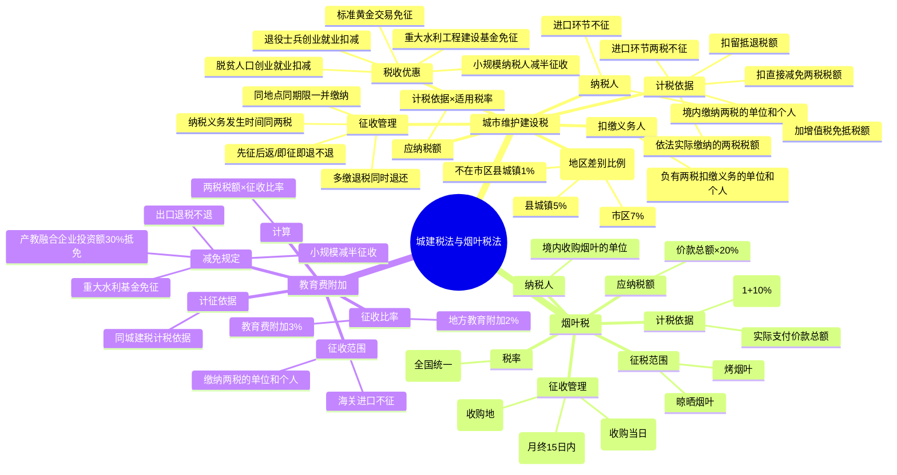

## 📍 章节定位

| 项目 | 信息 |
|------|------|
| **所属科目** | 💰 税法 |
| **难度等级** | ⭐ |
| **历年分值** | 1-2分 |
| **建议学时** | 2-3h |

## 📝 考情分析

本章包括城市维护建设税法、烟叶税法及教育费附加三部分内容，在考试中所占分值较低（1-2分），以客观题为主，主观题偶与增值税、消费税结合考查。考查重点集中于：城建税纳税人及扣缴义务人的认定、三档地区差别比例税率的适用、计税依据（特别注意免抵税额计入、留抵退税扣除、进口环节不征）、城建税与两税的征收管理同步性、烟叶税的计税依据（含价外补贴10%）、教育费附加和地方教育附加的征收比率。复习时务必抓住"附加"特性——城建税和教育费附加均依附于增值税、消费税，计税依据与征收管理均同步。

## 🧠 知识框架

## 📖 核心精讲

### 一、城市维护建设税法

城市维护建设税是对缴纳增值税、消费税（以下简称"两税"）的单位和个人征收的一种**附加税**。现行基本法律规范是 2020 年 8 月 11 日通过、2021 年 9 月 1 日施行的《中华人民共和国城市维护建设税法》。

#### （一）城市维护建设税的特点

1. **属于附加税**——本身没有特定的课税对象，以纳税人依法实际缴纳的增值税、消费税税额为计税依据；
2. **根据城镇规模设计地区差别比例税率**；
3. **征收范围较广**——缴纳增值税、消费税中任一税种的纳税人都要缴纳城市维护建设税。

#### （二）纳税人和扣缴义务人

| 类别 | 规定 |
|------|------|
| **纳税人** | 在中华人民共和国境内缴纳增值税、消费税的单位和个人 |
| **扣缴义务人** | 负有两税扣缴义务的单位和个人，在扣缴两税的同时扣缴城市维护建设税 |

> **重点排除**：对进口货物或者境外单位和个人向境内销售服务、无形资产缴纳的两税税额，**不征收**城市维护建设税。采用委托代征、代扣代缴、代收代缴、预缴、补缴等方式缴纳两税的，应当同时缴纳城市维护建设税。

#### （三）税率（地区差别比例税率）

| 纳税人所在地 | 税率 |
|--------------|------|
| 市区 | **7%** |
| 县城、镇 | **5%** |
| 不在市区、县城或者镇 | **1%** |

> "纳税人所在地"指纳税人住所地或者与纳税人生产经营活动相关的其他地点，具体地点由省、自治区、直辖市确定。行政区划变更的，自变更完成当月起适用新税率。

#### （四）计税依据

城市维护建设税的计税依据，是纳税人**依法实际缴纳**的两税税额。

**计税依据计算公式**：

$$\text{城建税计税依据}=\text{依法实际缴纳的增值税税额}+\text{依法实际缴纳的消费税税额}$$

其中：

$$\text{依法实际缴纳的增值税税额}=\text{应纳增值税税额}+\text{增值税免抵税额}-\text{直接减免的增值税税额}-\text{留抵退税额}$$

$$\text{依法实际缴纳的消费税税额}=\text{应纳消费税税额}-\text{直接减免的消费税税额}$$

**计税依据关键规则**：

| 项目 | 是否计入计税依据 |
|------|------------------|
| 应纳两税税额 | ✅ 计入 |
| 增值税免抵税额 | ✅ 计入 |
| 直接减免的两税税额 | ❌ 扣除（直接减征或免征，不含先征后返/先征后退/即征即退） |
| 留抵退税退还的增值税税额 | ❌ 扣除（仅允许在一般计税方法确定的计税依据中扣除，未扣完的以后期间继续扣除） |
| 进口货物或境外单位向境内销售服务无形资产缴纳的两税 | ❌ 不征 |
| 纳税人违反两税规定加收的滞纳金和罚款 | ❌ 不作为计税依据 |

**免抵税额城建税申报时间**：纳税人应在税务机关核准免抵税额的下一个纳税申报期内申报缴纳。

#### （五）应纳税额的计算

$$\text{应纳税额}=\text{依法实际缴纳的增值税、消费税税额}\times\text{适用税率}$$

#### （六）税收优惠

| 优惠政策 | 内容 |
|----------|------|
| 重大水利工程建设基金 | 免征城建税 |
| 自主就业退役士兵从事个体经营 | 2023.1.1-2027.12.31，3 年内按每户每年 20,000 元为限额依次扣减增值税、城建税、教育费附加、地方教育附加、个人所得税，最高可上浮 20% |
| 企业招用自主就业退役士兵 | 3 年内按实际招用人数定额扣减，定额标准每人每年 6,000 元，最高可上浮 50% |
| 脱贫人口等重点群体从事个体经营 | 3 年内按每户每年 20,000 元为限额依次扣减，最高可上浮 20% |
| 企业招用脱贫人口等重点群体 | 3 年内按实际招用人数定额扣减，定额标准每人每年 6,000 元，最高可上浮 30% |
| 增值税小规模纳税人、小型微利企业和个体工商户 | 2023.1.1-2027.12.31，**减半征收**城建税 |
| 上海黄金交易所、上海期货交易所交易标准黄金 | 卖出方免征；发生实物交割出库的，交易所免征 |

#### （七）征收管理

| 事项 | 规定 |
|------|------|
| **纳税义务发生时间** | 与两税的纳税义务发生时间一致 |
| **纳税地点** | 与缴纳两税的同一缴纳地点 |
| **纳税期限** | 与缴纳两税的同一缴纳期限内，一并缴纳 |
| **退税** | 因纳税人多缴发生的两税退税，同时退还已缴纳的城建税；两税实行先征后返、先征后退、即征即退的，除另有规定外，不予退还随两税附征的城建税 |
| **出口退税** | 对出口产品退还两税的，**不退还**已缴纳的城建税 |

### 二、烟叶税法

烟叶税是以纳税人收购烟叶实际支付的价款总额为计税依据征收的一种税。2017 年 12 月 27 日通过《中华人民共和国烟叶税法》，自 2018 年 7 月 1 日起施行。

#### （一）纳税人和征税范围

| 项目 | 内容 |
|------|------|
| **纳税人** | 在中华人民共和国境内，依照《烟草专卖法》规定收购烟叶的**单位** |
| **征税范围** | 烤烟叶、晾晒烟叶 |
| **计税依据** | 纳税人收购烟叶实际支付的价款总额 |

#### （二）税率和应纳税额的计算

**税率**：比例税率 **20%**（全国统一）。

**应纳税额计算**：

$$\text{应纳税额}=\text{实际支付价款总额}\times\text{税率}(20\%)$$

其中实际支付价款总额包括烟叶收购价款和价外补贴（统一按收购价款的 10% 计算）：

$$\text{实际支付价款总额}=\text{收购价款}\times(1+10\%)$$

#### （三）征收管理

| 事项 | 规定 |
|------|------|
| **纳税义务发生时间** | 纳税人收购烟叶的当日（付讫收购烟叶款项或开具收购烟叶凭据的当日） |
| **纳税地点** | 烟叶收购地的主管税务机关 |
| **纳税期限** | 按月计征，纳税人应当于纳税义务发生月终了之日起 **15 日内**申报并缴纳税款 |

### 三、教育费附加和地方教育附加

教育费附加和地方教育附加是对缴纳增值税、消费税的单位和个人，就其实际缴纳的税额为计算依据征收的一种附加费。

#### （一）征收范围及计征依据

- **征收范围**：缴纳增值税、消费税的单位和个人；海关进口的产品征收的增值税、消费税，不征收教育费附加；
- **计征依据**：与城市维护建设税计税依据一致，以依法实际缴纳的增值税、消费税税额为计征依据。

#### （二）计征比率

| 附加费 | 征收比率 |
|--------|----------|
| 教育费附加 | **3%** |
| 地方教育附加 | **2%**（2010 年起统一） |

#### （三）计算

$$\text{应纳教育费附加或地方教育附加}=\text{依法实际缴纳的增值税、消费税税额}\times\text{征收比率}$$

#### （四）减免规定

1. 因减免增值税、消费税发生退税的，可同时退还已征收的教育费附加；但出口产品退还两税的，不退还已征的教育费附加；
2. 国家重大水利工程建设基金免征教育费附加；
3. 2023.1.1-2027.12.31，对增值税小规模纳税人、小型微利企业和个体工商户减半征收教育费附加、地方教育附加；
4. 自 2019.1.1 起，纳入产教融合型企业建设培育范围的试点企业，兴办职业教育的投资符合规定的，可按投资额的 **30%** 比例抵免当年应缴教育费附加和地方教育附加，不足抵免的可在以后年度继续抵免。

## 💡 典型例题

### 例题 1：城建税基本计算

位于某市区的甲企业，2025 年 8 月实际缴纳增值税 50 万元、消费税 40 万元。计算该企业当月应申报缴纳的城市维护建设税。

**解答**：

应缴纳城建税 =（依法实际缴纳的增值税税额 + 依法实际缴纳的消费税税额）× 适用税率
=（50 + 40）× 7% = **6.3（万元）**

### 例题 2：计税依据含免抵税额、扣留抵退税额

位于某市区的乙企业，2025 年 9 月申报期，享受直接减免增值税优惠后申报缴纳增值税 60 万元，8 月已核准增值税免抵税额 10 万元（其中涉及出口货物 6 万元，涉及增值税零税率应税服务 4 万元），8 月收到增值税留抵退税额 6 万元。计算该企业 9 月应申报缴纳的城市维护建设税。

**解答**：

应缴纳城建税 =（60 + 6 + 4 - 6）× 7% = 64 × 7% = **4.48（万元）**

> 解析：免抵税额 10 万元（含出口和服务）均计入计税依据；留抵退税额 6 万元从计税依据中扣除。

### 例题 3：留抵退税跨月扣除

位于某县城的丙企业，2025 年 9 月收到增值税留抵退税 200 万元；10 月申报缴纳增值税 120 万元（其中按一般计税方法计算的税额 100 万元，按简易计税方法计算的税额 20 万元）；11 月申报期申报缴纳增值税 200 万元，均为按一般计税方法产生的税额。分别计算该企业 10 月、11 月应申报缴纳的城建税。

**解答**：

- **10 月**：留抵退税额仅允许在一般计税方法确定的计税依据中扣除。应缴纳城建税 =（100 - 100）× 5% + 20 × 5% = 0 + 1 = **1（万元）**
- **11 月**：剩余留抵退税额 = 200 - 100 = 100 万元；应缴纳城建税 =（200 - 100）× 5% = **5（万元）**

### 例题 4：进口环节不征城建税

位于某市区的丁企业，2025 年 10 月申报期，申报缴纳增值税 100 万元，其中 50 万元增值税是进口货物产生的。计算该企业 10 月应申报缴纳的城市维护建设税。

**解答**：

进口环节缴纳的增值税不征城建税。

应缴纳城建税 =（100 - 50）× 7% = **3.5（万元）**

### 例题 5：烟叶税计算

某烟草公司系增值税一般纳税人，2025 年 8 月收购烟叶 100,000 千克，烟叶收购价格 10 元/千克，总计 1,000,000 元，货款已全部支付。计算该烟草公司 8 月收购烟叶应缴纳的烟叶税。

**解答**：

实际支付价款总额 = 1,000,000 ×（1 + 10%）= 1,100,000（元）

应缴纳烟叶税 = 1,100,000 × 20% = **220,000（元）**

### 例题 6：教育费附加和地方教育附加计算

某企业 2025 年 3 月实际缴纳增值税 30 万元，缴纳消费税 20 万元。计算该企业应缴纳的教育费附加和地方教育附加。

**解答**：

- 应纳教育费附加 =（30 + 20）× 3% = **1.5（万元）**
- 应纳地方教育附加 =（30 + 20）× 2% = **1（万元）**

### 例题 7：多缴退税同时退还城建税

位于某市区的戊企业，由于申报错误未享受优惠政策，2025 年 12 月申报期，申请退还了多缴的增值税和消费税共 200 万元，同时当月享受增值税即征即退税款 100 万元。计算该企业 12 月应退税的城市维护建设税。

**解答**：

因多缴发生的两税退税，同时退还已缴纳的城建税；即征即退不退还城建税。

应退城建税 = 200 × 7% = **14（万元）**

## 🎯 记忆口诀

**城建税三档税率**：
> 市区七，县镇五，其他地区百分之一。

**城建税计税依据口诀**：
> 应纳两税加免抵，扣直接减免扣留抵，进口环节两税不征，滞纳罚款不计依据。

**城建税征收管理同步性**：
> 同时同地同期限，多缴退税同时退，先征后返不退还，出口退税不退税。

**烟叶税要点**：
> 烟叶税率为二十，价外补贴一成加，收购当日发生时，月终十五日内缴。

**教育费附加要点**：
> 教育附加百分三，地方教育百分二，计税依据同城建，进口环节同样不征。

**三税附加对比**：
> 城建税、教育附加、地方教育附加，同为两税之附加，计税依据均一致，进口环节均不征，先征后返均不退。

## ✅ 同步练习

### 一、单选题

1. 位于某县城的某企业，2025 年 6 月实际缴纳增值税 30 万元、消费税 20 万元，该企业应缴纳的城市维护建设税为（ ）。
   A. 2.5 万元
   B. 3.5 万元
   C. 1.5 万元
   D. 5 万元

2. 下列各项中，不征收城市维护建设税的是（ ）。
   A. 增值税免抵税额
   B. 进口货物缴纳的增值税
   C. 国内销售货物缴纳的增值税
   D. 国内销售应税消费品缴纳的消费税

3. 烟叶税的税率为（ ）。
   A. 10%
   B. 15%
   C. 20%
   D. 25%

4. 教育费附加的征收比率为（ ）。
   A. 1%
   B. 2%
   C. 3%
   D. 5%

5. 烟叶税的纳税期限为（ ）。
   A. 按次计征
   B. 按月计征，月终了之日起 10 日内
   C. 按月计征，月终了之日起 15 日内
   D. 按季计征，季终了之日起 15 日内

### 二、多选题

1. 下列各项中，属于城市维护建设税计税依据的有（ ）。
   A. 依法实际缴纳的增值税税额
   B. 依法实际缴纳的消费税税额
   C. 增值税免抵税额
   D. 直接减免的增值税税额
   E. 留抵退税退还的增值税税额

2. 下列关于城市维护建设税的说法，正确的有（ ）。
   A. 城市维护建设税属于附加税
   B. 纳税人所在地在市区的，税率为 7%
   C. 进口货物缴纳的增值税不征城建税
   D. 因纳税人多缴发生的两税退税，同时退还已缴纳的城建税
   E. 两税实行即征即退的，一律退还城建税

3. 下列关于烟叶税的说法，正确的有（ ）。
   A. 纳税人为收购烟叶的单位
   B. 征税范围包括烤烟叶和晾晒烟叶
   C. 计税依据为实际支付价款总额
   D. 价外补贴统一按收购价款的 10% 计算
   E. 实行全国统一比例税率 20%

4. 下列关于教育费附加和地方教育附加的说法，正确的有（ ）。
   A. 教育费附加征收比率为 3%
   B. 地方教育附加征收比率为 2%
   C. 计征依据与城建税计税依据一致
   D. 海关进口产品征收的增值税、消费税，不征收教育费附加
   E. 出口产品退还两税的，同时退还已征的教育费附加

5. 自 2023 年 1 月 1 日至 2027 年 12 月 31 日，减半征收城市维护建设税的纳税人包括（ ）。
   A. 增值税一般纳税人
   B. 增值税小规模纳税人
   C. 小型微利企业
   D. 个体工商户
   E. 所有企业

### 三、计算题

1. 位于某市区的某企业 2025 年 7 月发生以下业务：
   - 申报缴纳增值税 80 万元（其中进口货物缴纳增值税 20 万元）；
   - 申报缴纳消费税 30 万元；
   - 6 月已核准增值税免抵税额 10 万元；
   - 6 月收到增值税留抵退税额 5 万元。

   计算：①该企业 7 月应缴纳的城市维护建设税；②该企业 7 月应缴纳的教育费附加和地方教育附加。

2. 某烟草公司 2025 年 9 月收购烟叶 50,000 千克，收购价格 15 元/千克，总计 750,000 元。计算该烟草公司 9 月应缴纳的烟叶税。

### 参考答案

**一、单选题**：1.A（(30+20)×5%=2.5） 2.B  3.C  4.C  5.C

**二、多选题**：1.ABC  2.ABCD  3.ABCDE  4.ABCD  5.BCD

**三、计算题**：

1. ①进口环节增值税不征城建税；留抵退税额从计税依据中扣除。

   应缴纳城建税 =（80 - 20 + 10 - 5 + 30）× 7% = 95 × 7% = **6.65（万元）**

   ②应纳教育费附加 = 95 × 3% = **2.85（万元）**
   
   应纳地方教育附加 = 95 × 2% = **1.90（万元）**

2. 实际支付价款总额 = 750,000 ×（1 + 10%）= 825,000（元）

   应缴纳烟叶税 = 825,000 × 20% = **165,000（元）**

  
🏙️

  
本章节为附加税（费）专题，掌握"两税附加"特性是解题关键——计税依据与征收管理均与两税同步。

