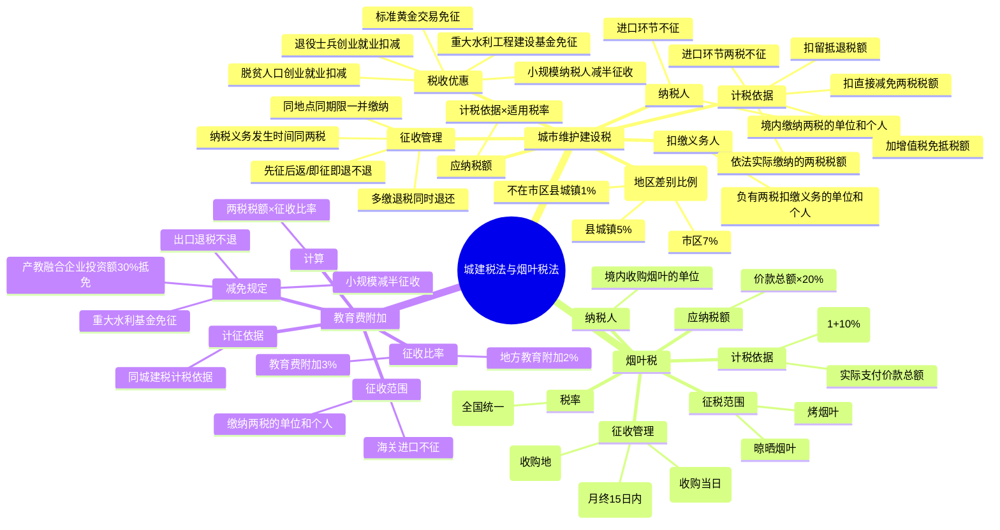

## 1. 章节定位

| 项目 | 信息 |
|------|------|
| 所属科目 | 税法 |
| 难度等级 | 1 |
| 历年分值 | 2-3分 |
| 建议学时 | 2-3h |
| 章节性质 | 附加税（费）专题 |
| 法律依据 | 《城市维护建设税法》（2021.9.1施行）、《烟叶税法》（2018.7.1施行） |

## 2. 考情分析

本章包括城市维护建设税法、烟叶税法及教育费附加三部分内容，在考试中所占分值约 2-3 分，以客观题为主，主观题偶与增值税、消费税结合考查。考查重点集中于：城建税纳税人及扣缴义务人的认定、三档地区差别比例税率的适用、计税依据（特别注意免抵税额计入、留抵退税扣除、进口环节不征）、城建税与两税的征收管理同步性、烟叶税的计税依据（含价外补贴 10%）、教育费附加和地方教育附加的征收比率。

复习时务必抓住"附加"特性——城建税和教育费附加均依附于增值税、消费税，计税依据与征收管理均同步。本章属于税法考试中的"低难度高分性价比"章节，理解"两税附加"的本质即可应对绝大多数考题。

## 3. 知识框架

## 4. 核心精讲

### 一、城市维护建设税法

城市维护建设税是对缴纳增值税、消费税（以下简称"两税"）的单位和个人征收的一种**附加税**。现行基本法律规范是 2020 年 8 月 11 日通过、2021 年 9 月 1 日施行的《中华人民共和国城市维护建设税法》。

#### （一）城市维护建设税的特点

1. **属于附加税**——本身没有特定的课税对象，以纳税人依法实际缴纳的增值税、消费税税额为计税依据；
2. **根据城镇规模设计地区差别比例税率**——城市维护建设税根据城镇规模不同，设计不同比例税率；
3. **征收范围较广**——缴纳增值税、消费税中任一税种的纳税人都要缴纳城市维护建设税。

#### （二）纳税人和扣缴义务人

| 类别 | 规定 |
|------|------|
| 纳税人 | 在中华人民共和国境内缴纳增值税、消费税的单位和个人 |
| 扣缴义务人 | 负有两税扣缴义务的单位和个人，在扣缴两税的同时扣缴城市维护建设税 |

> **重点排除**：对进口货物或者境外单位和个人向境内销售服务、无形资产缴纳的两税税额，**不征收**城市维护建设税。采用委托代征、代扣代缴、代收代缴、预缴、补缴等方式缴纳两税的，应当同时缴纳城市维护建设税。

#### （三）税率（地区差别比例税率）

| 纳税人所在地 | 税率 |
|--------------|------|
| 市区 | 7% |
| 县城、镇 | 5% |
| 不在市区、县城或者镇 | 1% |

> "纳税人所在地"指纳税人住所地或者与纳税人生产经营活动相关的其他地点，具体地点由省、自治区、直辖市确定。行政区划变更的，自变更完成当月起适用新行政区划对应的适用税率，纳税人在变更完成当月的下一个纳税申报期按新税率申报缴纳。

#### （四）计税依据

城市维护建设税的计税依据，是纳税人**依法实际缴纳**的两税税额。

**计税依据基本公式**：

$$\text{城建税计税依据}=\text{依法实际缴纳的增值税税额}+\text{依法实际缴纳的消费税税额}$$

其中：

$$\text{依法实际缴纳的增值税税额}=\text{应纳增值税税额}+\text{增值税免抵税额}-\text{直接减免的增值税税额}-\text{留抵退税额}$$

$$\text{依法实际缴纳的消费税税额}=\text{应纳消费税税额}-\text{直接减免的消费税税额}$$

**计税依据关键规则**：

| 项目 | 是否计入计税依据 |
|------|------------------|
| 应纳两税税额 | 计入 |
| 增值税免抵税额 | 计入 |
| 直接减免的两税税额 | 扣除（直接减征或免征，不含先征后返/先征后退/即征即退） |
| 留抵退税退还的增值税税额 | 扣除（仅允许在一般计税方法确定的计税依据中扣除，未扣完的以后期间继续扣除） |
| 进口货物或境外单位向境内销售服务无形资产缴纳的两税 | 不征 |
| 纳税人违反两税规定加收的滞纳金和罚款 | 不作为计税依据 |

**直接减免的两税税额**：指依照增值税、消费税相关法律法规和税收政策规定，直接减征或免征的两税税额，**不包括**实行先征后返、先征后退、即征即退办法退还的两税税额。

**留抵退税额扣除规则**：
- 纳税人自收到留抵退税额之日起，应当在以后纳税申报期从城建税计税依据中扣除；
- 留抵退税额**仅允许在按照增值税一般计税方法**确定的城建税计税依据中扣除；
- 当期未扣除完的余额，在以后纳税申报期按规定继续扣除；
- 对于增值税小规模纳税人更正、查补此前按照一般计税方法确定的城建税计税依据，允许扣除尚未扣除完的留抵退税额。

**免抵税额城建税申报时间**：纳税人应在税务机关核准免抵税额的下一个纳税申报期内申报缴纳。

#### （五）应纳税额的计算

$$\text{应纳税额}=\text{依法实际缴纳的增值税、消费税税额}\times\text{适用税率}$$

#### （六）税收优惠

| 优惠政策 | 内容 |
|----------|------|
| 重大水利工程建设基金 | 免征城建税 |
| 自主就业退役士兵从事个体经营 | 2023.1.1-2027.12.31，3 年内按每户每年 20,000 元为限额依次扣减增值税、城建税、教育费附加、地方教育附加、个人所得税，最高可上浮 20% |
| 企业招用自主就业退役士兵 | 3 年内按实际招用人数定额扣减，定额标准每人每年 6,000 元，最高可上浮 50% |
| 脱贫人口等重点群体从事个体经营 | 3 年内按每户每年 20,000 元为限额依次扣减，最高可上浮 20% |
| 企业招用脱贫人口等重点群体 | 3 年内按实际招用人数定额扣减，定额标准每人每年 6,000 元，最高可上浮 30% |
| 增值税小规模纳税人、小型微利企业和个体工商户 | 2023.1.1-2027.12.31，减半征收城建税 |
| 上海黄金交易所、上海期货交易所交易标准黄金 | 卖出方免征；发生实物交割出库的，交易所免征 |

**退役士兵创业就业扣减限额换算公式**（实际经营期不足 1 年时）：

$$\text{减免税限额}=\text{年度减免税限额}\div 12\times\text{实际经营月数}$$

**企业招用退役士兵核算减免税总额公式**：

$$\text{企业核算减免税总额}=\sum\text{每名退役士兵本年度在本单位工作月份}\div 12\times\text{具体定额标准}$$

#### （七）征收管理

| 事项 | 规定 |
|------|------|
| 纳税义务发生时间 | 与两税的纳税义务发生时间一致 |
| 纳税地点 | 与缴纳两税的同一缴纳地点 |
| 纳税期限 | 与缴纳两税的同一缴纳期限内，一并缴纳 |
| 退税 | 因纳税人多缴发生的两税退税，同时退还已缴纳的城建税；两税实行先征后返、先征后退、即征即退的，除另有规定外，不予退还随两税附征的城建税 |
| 出口退税 | 对出口产品退还两税的，不退还已缴纳的城建税 |

> 注意：代扣代缴不含因境外单位和个人向境内销售劳务、服务、无形资产代扣代缴增值税情形。"另有规定"主要指在增值税实行即征即退情形下，城建税可以给予免税的特殊规定，例如标准黄金交易实物交割出库用于投资性用途的，交易所实行增值税即征即退，同时免征城建税、教育费附加。

### 二、烟叶税法

烟叶税是以纳税人收购烟叶实际支付的价款总额为计税依据征收的一种税。2017 年 12 月 27 日通过《中华人民共和国烟叶税法》，自 2018 年 7 月 1 日起施行。

#### （一）纳税人和征税范围

| 项目 | 内容 |
|------|------|
| 纳税人 | 在中华人民共和国境内，依照《烟草专卖法》规定收购烟叶的单位 |
| 征税范围 | 烤烟叶、晾晒烟叶 |
| 计税依据 | 纳税人收购烟叶实际支付的价款总额 |

#### （二）税率和应纳税额的计算

**税率**：比例税率 **20%**（全国统一）。烟叶税实行全国统一的税率，主要是考虑烟叶属于特殊的专卖品，其税率不宜存在地区间的差异，否则会形成各地之间的不公平竞争。

**应纳税额计算**：

$$\text{应纳税额}=\text{实际支付价款总额}\times\text{税率}(20\%)$$

其中实际支付价款总额包括烟叶收购价款和价外补贴（统一按收购价款的 10% 计算）：

$$\text{实际支付价款总额}=\text{收购价款}\times(1+10\%)$$

#### （三）征收管理

| 事项 | 规定 |
|------|------|
| 纳税义务发生时间 | 纳税人收购烟叶的当日（付讫收购烟叶款项或开具收购烟叶凭据的当日） |
| 纳税地点 | 烟叶收购地的主管税务机关 |
| 纳税期限 | 按月计征，纳税人应当于纳税义务发生月终了之日起 15 日内申报并缴纳税款 |
| 纳税申报 | 自 2021.6.1 起，使用《财产和行为税纳税申报表》申报 |

### 三、教育费附加和地方教育附加

教育费附加和地方教育附加是对缴纳增值税、消费税的单位和个人，就其实际缴纳的税额为计算依据征收的一种附加费。

#### （一）征收范围及计征依据

- **征收范围**：缴纳增值税、消费税的单位和个人；海关进口的产品征收的增值税、消费税，不征收教育费附加；
- **计征依据**：与城市维护建设税计税依据一致，以依法实际缴纳的增值税、消费税税额为计征依据，分别与增值税、消费税同时缴纳。

#### （二）计征比率

| 附加费 | 征收比率 | 历史变化 |
|--------|----------|----------|
| 教育费附加 | 3% | 1986 年开征时为 1%；1990 年调整为 2%；1994 年调整为 3% |
| 地方教育附加 | 2% | 2010 年起全国统一为 2% |

#### （三）计算

$$\text{应纳教育费附加或地方教育附加}=\text{依法实际缴纳的增值税、消费税税额}\times\text{征收比率}$$

#### （四）减免规定

1. 因减免增值税、消费税发生退税的，可同时退还已征收的教育费附加；但出口产品退还两税的，不退还已征的教育费附加；
2. 国家重大水利工程建设基金免征教育费附加；
3. 2023.1.1-2027.12.31，对增值税小规模纳税人、小型微利企业和个体工商户减半征收教育费附加、地方教育附加；
4. 自 2019.1.1 起，纳入产教融合型企业建设培育范围的试点企业，兴办职业教育的投资符合规定的，可按投资额的 **30%** 比例抵免当年应缴教育费附加和地方教育附加，不足抵免的可在以后年度继续抵免。

**产教融合抵免要点**：
- 允许抵免的投资：试点企业当年实际发生的，独立举办或参与举办职业教育的办学投资和办学经费支出，以及按照有关规定与职业院校稳定开展校企合作，对产教融合实训基地等国家规划布局的产教融合重大项目建设投资和基本运行费用的支出；
- 试点企业属于集团企业的，其下属成员单位（包括全资子公司、控股子公司）对职业教育有实际投入的，可按规定抵免；
- 当年应缴教育费附加和地方教育附加不足抵免的，未抵免部分可在以后年度继续抵免；
- 试点企业有撤回投资和转让股权等行为的，应当补缴已经抵免的教育费附加和地方教育附加。

## 5. 典型例题

### 例题 1：城建税基本计算

位于某市区的甲企业，2025 年 8 月实际缴纳增值税 50 万元、消费税 40 万元。计算该企业当月应申报缴纳的城市维护建设税。

**解答**：

应缴纳城建税 =（依法实际缴纳的增值税税额 + 依法实际缴纳的消费税税额）× 适用税率
=（50 + 40）× 7% = **6.3（万元）**

### 例题 2：计税依据含免抵税额、扣留抵退税额

位于某市区的乙企业，2025 年 9 月申报期，享受直接减免增值税优惠后申报缴纳增值税 60 万元，8 月已核准增值税免抵税额 10 万元（其中涉及出口货物 6 万元，涉及增值税零税率应税服务 4 万元），8 月收到增值税留抵退税额 6 万元。计算该企业 9 月应申报缴纳的城市维护建设税。

**解答**：

应缴纳城建税 =（60 + 6 + 4 - 6）× 7% = 64 × 7% = **4.48（万元）**

> 解析：免抵税额 10 万元（含出口和服务）均计入计税依据；留抵退税额 6 万元从计税依据中扣除。

### 例题 3：留抵退税跨月扣除

位于某县城的丙企业，2025 年 9 月收到增值税留抵退税 200 万元；10 月申报缴纳增值税 120 万元（其中按一般计税方法计算的税额 100 万元，按简易计税方法计算的税额 20 万元）；11 月申报期申报缴纳增值税 200 万元，均为按一般计税方法产生的税额。分别计算该企业 10 月、11 月应申报缴纳的城建税。

**解答**：

- **10 月**：留抵退税额仅允许在一般计税方法确定的计税依据中扣除。
  - 一般计税部分：（100 - 100）× 5% = 0（万元）
  - 简易计税部分：20 × 5% = 1（万元）
  - 合计应缴纳城建税 = 0 + 1 = **1（万元）**

- **11 月**：剩余留抵退税额 = 200 - 100 = 100 万元
  - 应缴纳城建税 =（200 - 100）× 5% = **5（万元）**

### 例题 4：进口环节不征城建税

位于某市区的丁企业，2025 年 10 月申报期，申报缴纳增值税 100 万元，其中 50 万元增值税是进口货物产生的。计算该企业 10 月应申报缴纳的城市维护建设税。

**解答**：

进口环节缴纳的增值税不征城建税。

应缴纳城建税 =（100 - 50）× 7% = **3.5（万元）**

### 例题 5：烟叶税计算

某烟草公司系增值税一般纳税人，2025 年 8 月收购烟叶 100,000 千克，烟叶收购价格 10 元/千克，总计 1,000,000 元，货款已全部支付。计算该烟草公司 8 月收购烟叶应缴纳的烟叶税。

**解答**：

实际支付价款总额 = 1,000,000 ×（1 + 10%）= 1,100,000（元）

应缴纳烟叶税 = 1,100,000 × 20% = **220,000（元）**

### 例题 6：教育费附加和地方教育附加计算

某企业 2025 年 3 月实际缴纳增值税 30 万元，缴纳消费税 20 万元。计算该企业应缴纳的教育费附加和地方教育附加。

**解答**：

- 应纳教育费附加 =（30 + 20）× 3% = **1.5（万元）**
- 应纳地方教育附加 =（30 + 20）× 2% = **1（万元）**

### 例题 7：多缴退税同时退还城建税

位于某市区的戊企业，由于申报错误未享受优惠政策，2025 年 12 月申报期，申请退还了多缴的增值税和消费税共 200 万元，同时当月享受增值税即征即退税款 100 万元。计算该企业 12 月应退税的城市维护建设税。

**解答**：

因多缴发生的两税退税，同时退还已缴纳的城建税；即征即退不退还城建税。

应退城建税 = 200 × 7% = **14（万元）**

### 例题 8：综合计算（城建税+教育费附加+地方教育附加）

位于某市区的某企业 2025 年 7 月发生以下业务：
- 申报缴纳增值税 80 万元（其中进口货物缴纳增值税 20 万元）；
- 申报缴纳消费税 30 万元；
- 6 月已核准增值税免抵税额 10 万元；
- 6 月收到增值税留抵退税额 5 万元。

计算：①该企业 7 月应缴纳的城市维护建设税；②该企业 7 月应缴纳的教育费附加和地方教育附加。

**解答**：

城建税计税依据 =（80 - 20 + 10 - 5 + 30）= 95（万元）
（注：进口环节增值税不征城建税；留抵退税额从计税依据中扣除）

①应缴纳城建税 = 95 × 7% = **6.65（万元）**

②应纳教育费附加 = 95 × 3% = **2.85（万元）**
  应纳地方教育附加 = 95 × 2% = **1.90（万元）**

### 例题 9：小规模纳税人减半征收

某增值税小规模纳税人（位于县城），2025 年 8 月实际缴纳增值税 20 万元、消费税 10 万元。计算该企业 8 月应缴纳的城市维护建设税、教育费附加和地方教育附加。

**解答**：

小规模纳税人减半征收城建税、教育费附加、地方教育附加。

- 应缴纳城建税 =（20 + 10）× 5% × 50% = **0.75（万元）**
- 应纳教育费附加 =（20 + 10）× 3% × 50% = **0.45（万元）**
- 应纳地方教育附加 =（20 + 10）× 2% × 50% = **0.30（万元）**

## 6. 记忆口诀

### 口诀 1：城建税三档税率
> 市区七，县镇五，其他地区百分之一。

### 口诀 2：城建税计税依据
> 应纳两税加免抵，扣直接减免扣留抵，进口环节两税不征，滞纳罚款不计依据。

### 口诀 3：城建税征收管理同步性
> 同时同地同期限，多缴退税同时退，先征后返不退还，出口退税不退税。

### 口诀 4：城建税本质特征
> 城建税，附加税，依附两税而存在，无独立课税对象，计税依据随两税。

### 口诀 5：留抵退税扣除规则
> 留抵退税要扣除，仅限一般计税法，当期未扣继续扣，简易计税不扣除。

### 口诀 6：直接减免与先征后返区别
> 直接减免扣依据，先征后返不退还，即征即退同样不退，唯有"另规"方可免。

### 口诀 7：烟叶税要点
> 烟叶税率为二十，价外补贴一成加，收购当日发生时，月终十五日内缴。

### 口诀 8：烟叶税计税依据
> 收购价款加补贴，补贴统一按一成，实际支付价款总额，乘以税率二十个百分比。

### 口诀 9：教育费附加要点
> 教育附加百分三，地方教育百分二，计税依据同城建，进口环节同样不征。

### 口诀 10：三税附加对比
> 城建税、教育附加、地方教育附加，同为两税之附加，计税依据均一致，进口环节均不征，先征后返均不退。

### 口诀 11：小规模纳税人优惠
> 小规模、小微企、个体户，三大主体享优惠，城建教育地方教育，二〇二三至二七，减半征收税减半。

### 口诀 12：产教融合抵免
> 产教融合试点企，职业教育有投资，投资额的三成比，抵免教育两附加，当年不足后年续，撤资转让需补缴。

  
附加

  
本章节为附加税（费）专题，掌握"两税附加"特性是解题关键——计税依据与征收管理均与两税同步。

## 7. 同步练习

**1.（单选题）** 下列不属于城市维护建设税纳税义务人的是（　）。

A. 缴纳增值税的事业单位
B. 缴纳消费税的合伙企业
C. 缴纳进口环节增值税的外商投资企业
D. 缴纳增值税的个体工商户

**2.（单选题）** 企业缴纳的下列税额中，应作为城市维护建设税计税依据的是（　）。

A. 关税税额
B. 消费税税额
C. 房产税税额
D. 城镇土地使用税税额

**3.（单选题）** 下列关于烟叶税的说法中，错误的是（　）。

A. 烟叶税应纳税额＝收购价款×税率
B. 纳税人应当于纳税义务发生月终了之日起15日内申报并缴纳税款
C. 烟叶税的纳税义务发生时间为收购烟叶的当天
D. 烟叶税的征税范围是指晾晒烟叶和烤烟叶

**4.（单选题）** 下列各项中，属于城市维护建设税及教育费附加计税依据的是（　）。

A. 代扣代缴境外单位的增值税
B. 偷逃消费税而加收的滞纳金
C. 进口货物征收的增值税税额
D. 实际缴纳的消费税税额

**5.（单选题）** 关于城市维护建设税和教育费附加的减免规定，下列表述正确的是（　）。

A. 对海关进口的产品征收的增值税、消费税，征收教育费附加
B. 期末留抵退税退还的增值税税额，应当按规定从城市维护建设税的计税依据中扣除
C. 对出口产品退还增值税、消费税的，可以同时退还已征的教育费附加
D. 国家税务总局对重大公共基础设施建设、特殊产业和群体以及重大突发事件应对等情形可以规定减征或者免征城市维护建设税，报全国人民代表大会常务委员会备案

**6.（单选题）** 某烟厂为增值税一般纳税人，2024年8月收购烟叶2000公斤，实际支付的价款总额为20万元，已开具烟叶收购发票。下列关于烟叶税的表述中，正确的是（　）。

A. 烟厂应该代扣代缴烟叶税4万元
B. 烟厂应该代扣代缴烟叶税4.4万元
C. 烟厂应该自行缴纳烟叶税4万元
D. 烟厂应该自行缴纳烟叶税4.4万元

**7.（单选题）** 城市维护建设税采用的税率形式是（　）。

A. 产品比例税率
B. 行业比例税率
C. 地区差别比例税率
D. 有幅度的比率税率

**8.（单选题）** 某市一生产企业为增值税一般纳税人。本期进口原材料一批，向海关缴纳进口环节增值税10万元；本期在国内销售甲产品实际缴纳增值税30万元、消费税50万元，消费税滞纳金1万元；本期出口乙产品一批，按规定退回增值税5万元。该企业本期应缴纳城市维护建设税为（　）万元。

A. 5.95
B. 4
C. 4.25
D. 5.6

**9.（单选题）** （2022年）2024年9月份某烟叶收购企业向烟农收购一批烟叶时，向烟农支付了烟叶收购价款金额为300万元，另外再支付给烟农价外补贴金额为45万元，则该企业本月应缴纳的烟叶税为（　）万元。

A. 60
B. 66
C. 69
D. 75.9

**10.（单选题）** （2020年）下列关于城市维护建设税税务处理的表述中，符合税法规定的是（　）。

A. 收取的污水处理劳务收入免征城市维护建设税
B. 海关进口产品代征的消费税应同时代征城市维护建设税
C. 退还出口产品增值税时应同时退还已缴纳的城市维护建设税
D. 实行增值税期末留抵退税的纳税人，准予从城市维护建设税的计税依据中扣除退还的增值税税额

**11.（单选题）** （2020年）位于县城的某工业企业，2024年9月缴纳增值税560000元。税务机关在当月检查中发现企业以前月份以隐瞒收入的方式少缴纳增值税65000元，补缴增值税同时税务机关对其征收滞纳金4800元，罚款35000元。该企业当月应缴纳的城市维护建设税为（　）元。

A. 31000
B. 31250
C. 32990
D. 33240

**12.（单选题）** 位于市区的甲企业为增值税小规模纳税人，按月缴纳增值税。2024年10月销售产品缴纳增值税和消费税共计50万元，被税务机关查补增值税15万元并处罚款5万元。甲企业10月应缴纳的城市维护建设税为（　）万元。

A. 2.28
B. 3.5
C. 4.55
D. 4.9

**13.（单选题）** 位于市区的甲汽车厂，2024年10月实际缴纳增值税和消费税362万元，其中包括由位于县城的乙企业代收代缴的消费税30万元、进口环节增值税和消费税50万元、被税务机关查补的增值税12万元。补缴增值税同时缴纳的滞纳金和罚款共计8万元。当期收到留抵退税退还的增值税税额10万元。则甲厂本月应向所在市区税务机关缴纳的城市维护建设税为（　）万元。

A. 19.04
B. 19.74
C. 20.3
D. 25.34

**14.（多选题）** 下列关于教育费附加的表述中，正确的有（　）。

A. 教育费附加征收比率按照地区差别设定
B. 对海关进口的产品征收增值税、消费税，但不征收教育费附加
C. 出口产品退还增值税、消费税，同时退还已征收的教育费附加
D. 按月纳税的月销售额不超过10万元的缴纳义务人，免征教育费附加

**15.（多选题）** 烟叶税的征税范围包括（　）。

A. 采摘烟叶
B. 晾晒烟叶
C. 烤烟叶
D. 烟丝

**16.（多选题）** 下列关于城市维护建设税计税依据的表述中，正确的有（　）。

A. 增值税一般纳税人按照简易计税方法确定的城市维护建设税计税依据，允许扣除尚未扣除完的留抵退税额
B. 增值税、消费税实行先征后返、先征后退、即征即退的，除另有规定外，同时退还随两税附征的城市维护建设税
C. 纳税人被查补消费税时应同时对查补的消费税补缴城市维护建设税
D. 免抵税额应计入城市维护建设税的计税依据

**17.（多选题）** 下列关于烟叶税的说法中，正确的有（　）。

A. 纳税人收购烟叶实际支付的价款总额包括烟叶收购价款和价外补贴
B. 价外补贴统一按烟叶收购价款的10%计算
C. 烟叶税的纳税人是种植烟叶的单位和个人
D. 烟叶税实行比例税率，税率为20%

**18.（多选题）** 根据现行规定，下列关于城市维护建设税税收优惠的表述中，正确的有（　）。

A. 企业按招用人数和签订的劳动合同时间核算企业减免税总额，在核算减免税总额内每月依次扣减增值税、城市维护建设税、教育费附加和地方教育附加
B. 脱贫人口、持《就业创业证》或《就业失业登记证》的人员，从事个体经营的，自办理个体工商户登记当月起，在3年内按每户每年20000元为限额依次扣减其当年实际应缴纳的增值税、城市维护建设税、教育费附加、地方教育附加和个人所得税
C. 企业招用自主就业退役士兵，与其签订1年以上期限劳动合同并依法缴纳社会保险费的，自签订劳动合同并缴纳社会保险当月起，在3年内按实际招用人数予以每人每年6000元的定额依次扣减增值税、城市维护建设税、教育费附加、地方教育附加和企业所得税优惠
D. 对上海期货交易所会员和客户通过上海期货交易所销售的标准黄金，免征城市维护建设税

**19.（多选题）** （2024年）以下情形缴纳的增值税、消费税，不征收城市维护建设税的有（　）。

A. 进口高档化妆品，海关代征的增值税、消费税
B. 境内批发进口化妆品，税务机关征收的增值税
C. 境外单位向境内销售劳务、服务，税务机关征收的增值税
D. 境外单位向境内销售无形资产，税务机关征收的增值税

**20.（多选题）** 2024年7月，甲市某烟草公司向乙县某烟叶种植户收购了一批烟叶，收购价款90万元、价外补贴9万元。下列关于该笔烟叶交易涉及烟叶税征收管理的表述中，符合税法规定的有（　）。

A. 纳税人为烟叶种植户
B. 烟叶税应纳税额为19.8万元
C. 应在次月15日内申报纳税
D. 应向乙县主管税务机关申报纳税

---

**练习答案**：

1.C（对进口货物或境外单位和个人向境内销售劳务、服务、无形资产缴纳的增值税、消费税税额，不征收城市维护建设税）　2.B（城市维护建设税的计税依据是依法实际缴纳的增值税、消费税税额）　3.A（烟叶税应纳税额＝实际支付价款总额×税率（20%），实际支付价款总额＝收购价款×（1＋10%），而非收购价款×税率）　4.D（以依法实际缴纳的增值税、消费税税额为计税依据；滞纳金不作为计税依据，进口环节不征）　5.B（选项A，对海关进口的产品征收的增值税、消费税，不征收教育费附加；选项C，出口产品退还两税的，不退还已征的教育费附加；选项D，应为国务院而非国家税务总局可以规定减征或免征）　6.C（烟叶税的纳税人是收购烟叶的单位，烟厂应自行缴纳烟叶税 $=20\times20\%=4$ 万元）　7.C（城市维护建设税实行地区差别比例税率）　8.D（进口不征、出口不退，滞纳金不计入计税依据；$(30+50)\times7\%=5.6$ 万元）　9.B（价外补贴统一按收购价款的 $10\%$ 计算，$300\times(1+10\%)\times20\%=66$ 万元）　10.D（选项A，无免征规定；选项B，进口环节不征城建税；选项C，出口退税不退还城建税）　11.B（滞纳金和罚款不作为计税依据，但补缴的增值税应计征城建税；$(560000+65000)\times5\%=31250$ 元，县城适用税率 $5\%$）　12.A（罚款不作为计税依据；小规模纳税人减半征收，$(50+15)\times7\%\times50\%=2.28$ 万元）　13.A（代收代缴的消费税在代收代缴地缴纳城建税、进口环节不征、滞纳金罚款不计、留抵退税额从计税依据中扣除；$(362-30-50-10)\times7\%=19.04$ 万元）　14.BD（选项A，教育费附加征收比率全国统一为 $3\%$，非地区差别；选项C，出口退税不退还已征的教育费附加）　15.BC（烟叶税的征税范围是晾晒烟叶和烤烟叶）　16.CD（选项A，留抵退税额仅允许在按照一般计税方法确定的计税依据中扣除；选项B，先征后返、先征后退、即征即退的，除另有规定外，不退还随两税附征的城建税）　17.ABD（选项C，烟叶税的纳税人是收购烟叶的单位，而非种植烟叶的单位和个人）　18.ABC　19.ACD（对进口货物或者境外单位和个人向境内销售劳务、服务、无形资产缴纳的增值税、消费税税额，不征收城市维护建设税）　20.BCD（选项A，烟叶税纳税人为收购烟叶的单位；烟叶税应纳税额 $=90\times(1+10\%)\times20\%=19.8$ 万元；按月计征，应于月终之日起15日内申报；应向烟叶收购地（乙县）主管税务机关申报纳税）
