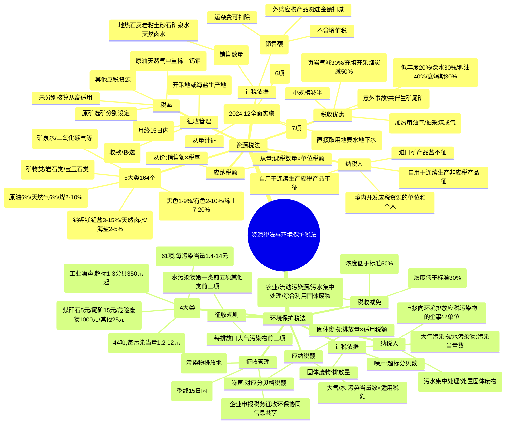

## 1. 章节定位

| 项目 | 信息 |
|------|------|
| 所属科目 | 税法 |
| 难度等级 | 2 |
| 历年分值 | 3-4分 |
| 建议学时 | 3-4h |
| 章节性质 | 资源与环保税专题 |
| 法律依据 | 《资源税法》（2020.9.1施行）、《环境保护税法》（2018.1.1施行） |

## 2. 考情分析

本章包括资源税法和环境保护税法两部分，是 CPA 税法考试次重点章节，分值约 2-3 分。考查形式以客观题为主，主观题偶有考查资源税计算。考查重点集中于：资源税纳税人（境内开采）、税目五大类（能源矿产、金属矿产、非金属矿产、水气矿产、盐）、原矿与选矿分别计征、从价计征为主从量计征为辅、销售额的确定（含运杂费扣除、外购应税产品扣减）、资源税税收优惠（低丰度油气田 20%、深水油气田 30%、衰竭期矿山 30% 等）、水资源税改革试点；环境保护税的纳税人（直接排放）、四大类税目（大气污染物、水污染物、固体废物、噪声）、污染当量数计算、每一排放口前三项（水污染物第一类前五项/其他前三项）征收规则、税收减免（30%减按75%/50%减按50%）。复习时需掌握资源税"原矿/选矿分别计征"和环境保护税"污染当量数"两大核心计算。

## 3. 知识框架

## 4. 核心精讲

### 一、资源税法

资源税是对在我国领域和管辖的其他海域开发应税资源的单位和个人征收的一种税。2019 年 8 月 26 日通过《中华人民共和国资源税法》，自 2020 年 9 月 1 日起施行。

#### （一）纳税人

资源税的纳税人是指在中华人民共和国领域及管辖的其他海域开发应税资源的单位和个人。

**关键规则**：

| 情形 | 是否征税 |
|------|----------|
| 进口矿产品和盐 | 不征收资源税 |
| 出口应税产品 | 不免征或退还已纳资源税 |
| 纳税人自用应税产品用于连续生产应税产品 | 不缴纳（如铁原矿用于生产铁精粉） |
| 纳税人自用应税产品用于连续生产非应税产品 | 移送环节缴纳（如铁精粉用于冶炼） |
| 自用于非货币性资产交换、捐赠、偿债、赞助、集资、投资、广告、样品、职工福利、利润分配 | 缴纳 |
| 工程建设项目在批准占地范围内开采并直接用于本工程回填的砂石、粘土 | 不缴纳 |
| 行政机关罚没、收缴的应税产品 | 不缴纳 |

#### （二）税目与税率

资源税税目包括 **5 大类 164 个税目**：

| 类别 | 主要内容 | 计征方式 |
|------|----------|----------|
| 能源矿产 | 原油、天然气、页岩气、煤、煤成气、铀钍、油页岩等、地热 | 原油/天然气 6%固定税率；煤 2%-10%幅度 |
| 金属矿产 | 黑色金属（铁锰铬钒钛）、有色金属（铜铅锌锡镍锑镁钴等）、铝土矿、钨、钼、金银、铂族、轻稀土、中重稀土等 | 中重稀土 20%固定；钨 6.5%；钼 8%；其他幅度 |
| 非金属矿产 | 矿物类（高岭土、石灰岩、磷、石墨等）、岩石类（大理岩、砂石等）、宝玉石类 | 1%-20%幅度 |
| 水气矿产 | 二氧化碳气、硫化氢气、氦气、氡气、矿泉水 | 1%-5%或每立方米 1-30 元 |
| 盐 | 钠盐、钾盐、镁盐、锂盐、天然卤水、海盐 | 2%-15%幅度 |

**原矿与选矿的征税对象**：

| 情形 | 计征方式 |
|------|----------|
| 自采原矿直接销售或自用 | 按原矿计征 |
| 自采原矿洗选加工为选矿产品销售或自用 | 按选矿产品计征，原矿移送环节不缴纳 |

**税率适用规则**：
- 开采或生产不同税目应税产品未分别核算的，**从高适用税率**；
- 同一税目下不同税率应税产品未分别核算的，**从高适用税率**。

#### （三）计税依据

资源税适用**从价计征为主、从量计征为辅**的征税方式。地热、石灰岩、其他粘土、砂石、矿泉水、天然卤水可采用从价计征或从量计征，其他应税产品统一适用从价定率。

**1. 从价定率征收的计税依据——销售额**

销售额 = 纳税人销售应税产品向购买方收取的全部价款（**不含增值税税款**）

**运杂费用扣除**：计入销售额中的相关运杂费用，凡取得增值税发票或其他合法有效凭据的，准予从销售额中扣除（运输费用、建设基金、装卸、仓储、港杂费用，不含增值税）。

**销售额明显偏低或无销售额时的核定顺序**：
1. 按纳税人最近时期同类产品的平均销售价格确定；
2. 按其他纳税人最近时期同类产品的平均销售价格确定；
3. 按后续加工非应税产品销售价格减去后续加工环节的成本利润后确定；
4. 按组成计税价格确定：

$$\text{组成计税价格}=\frac{\text{成本}\times(1+\text{成本利润率})}{1-\text{资源税税率}}$$

5. 按其他合理方法确定。

**外购应税产品扣减**：

| 情形 | 扣减方法 |
|------|----------|
| 外购原矿与自采原矿混合为原矿销售 | 直接扣减外购原矿购进金额 |
| 外购选矿产品与自产选矿产品混合为选矿产品销售 | 直接扣减外购选矿产品购进金额 |
| 外购原矿与自采原矿混合洗选加工为选矿产品销售 | 准予扣减的外购金额 = 外购原矿购进金额 ×（原煤适用税率 ÷ 选煤适用税率） |

**2. 从量定额征收的计税依据——销售数量**

包括纳税人开采或生产应税产品的实际销售数量和自用于应当缴纳资源税情形的应税产品数量。

#### （四）应纳税额的计算

$$\text{从价定率：应纳税额}=\text{销售额}\times\text{适用税率}$$

$$\text{从量定额：应纳税额}=\text{课税数量}\times\text{单位税额}$$

#### （五）税收优惠

| 类型 | 内容 |
|------|------|
| 免征 | ①开采原油及油田范围内运输原油过程中用于加热的原油、天然气；②煤炭开采企业因安全生产需要抽采的煤成（层）气 |
| 减征 20% | 从低丰度油气田开采的原油、天然气 |
| 减征 30% | 高含硫天然气、三次采油、深水油气田（水深超过 300 米）开采的原油、天然气；衰竭期矿山开采的矿产品 |
| 减征 40% | 稠油、高凝油 |
| 省级决定减免 | ①意外事故或自然灾害遭受重大损失；②开采共伴生矿、低品位矿、尾矿 |
| 阶段性政策 | 页岩气资源税减征 30%（至 2027.12.31）；充填开采置换煤炭减征 50%（至 2027.12.31）；小规模纳税人、小型微利企业、个体工商户减半征收（2023.1.1-2027.12.31） |

> 同一应税产品同时符合两项以上减征优惠政策的，除另有规定外，只能选择其中一项执行。

#### （六）征收管理

| 事项 | 规定 |
|------|------|
| 纳税义务发生时间 | 销售应税产品：收讫销售款或取得索取销售款凭据的当日；自用应税产品：移送应税产品的当日 |
| 纳税期限 | 按月或按季申报缴纳，自月度或季度终了之日起 15 日内；按次申报缴纳的，自纳税义务发生之日起 15 日内 |
| 纳税地点 | 矿产品的开采地或海盐的生产地 |
| 征收机关 | 税务机关；海上开采的原油和天然气由海洋石油税务管理机构征收管理 |

#### （七）水资源税改革试点

自 2024 年 12 月 1 日起全面实施水资源税改革试点。

**纳税人**：在中华人民共和国领域直接取用地表水或者地下水的单位和个人。

**不缴纳水资源税的 6 种情形**：农村集体经济组织取水；家庭生活少量取水；水工程管理单位配置调度水资源取水；矿井施工安全临时应急取水；消除公共安全危害临时应急取水；农业抗旱维护生态环境临时应急取水。

**应纳税额**：

$$\text{应纳税额}=\text{实际取用水量}\times\text{适用税额}$$

特殊情形：
- 城市公共供水企业：实际取用水量 ×（1 - 公共供水管网合理漏损率）× 适用税额
- 水力发电取用水：实际发电量 × 适用税额（最高不超过每千瓦时 0.008 元）
- 冷却取用水：实际取用（耗）水量 × 适用税额

### 二、环境保护税法

环境保护税是对在我国领域以及管辖的其他海域直接向环境排放应税污染物的企业事业单位和其他生产经营者征收的一种税。2016 年 12 月 25 日通过《中华人民共和国环境保护税法》，自 2018 年 1 月 1 日起施行。

#### （一）纳税人

环境保护税的纳税人是在中华人民共和国领域和中华人民共和国管辖的其他海域**直接向环境排放**应税污染物的企业事业单位和其他生产经营者。

**不属于直接排放，不缴纳相应污染物环境保护税的情形**：
1. 向依法设立的污水集中处理、生活垃圾集中处理场所排放应税污染物的；
2. 在符合国家和地方环境保护标准的设施、场所贮存或者处置固体废物的；
3. 达到规模标准且有污染物排放口的畜禽养殖场，依法对畜禽养殖废弃物进行综合利用和无害化处理的。

#### （二）税目与税率

| 税目 | 内容 | 税率 |
|------|------|------|
| 大气污染物 | 二氧化硫、氮氧化物、一氧化碳等 44 项（不含二氧化碳） | 每污染当量 1.2-12 元 |
| 水污染物 | 第一类水污染物（总汞、总镉、总铬等 10 项）；第二类水污染物（SS、BOD₅、CODcr 等 51 项） | 每污染当量 1.4-14 元 |
| 固体废物 | 煤矸石（5 元/吨）、尾矿（15 元/吨）、危险废物（1,000 元/吨）、冶炼渣/粉煤灰/炉渣/其他（25 元/吨） | 定额税率 |
| 噪声 | 工业噪声（超标 1-3 分贝 350 元/月起，超标 16 分贝以上 11,200 元/月） | 超标分贝对应月税额 |

#### （三）计税依据

| 税目 | 计税依据 |
|------|----------|
| 大气污染物 | 污染物排放量折合的污染当量数 |
| 水污染物 | 污染物排放量折合的污染当量数 |
| 固体废物 | 固体废物的排放量（产生量 - 综合利用量 - 贮存量 - 处置量） |
| 噪声 | 超过国家规定标准的分贝数 |

**污染当量数计算公式**：

$$\text{污染当量数}=\frac{\text{该污染物的排放量}}{\text{该污染物的污染当量值}}$$

**征收规则**：

| 污染物类型 | 每一排放口征收项目数 |
|------------|----------------------|
| 大气污染物 | 按污染当量数从大到小排序，前三项征收 |
| 水污染物（第一类） | 按污染当量数从大到小排序，前五项征收 |
| 水污染物（其他类） | 按污染当量数从大到小排序，前三项征收 |

#### （四）应纳税额的计算

**1. 大气污染物**：

$$\text{应纳税额}=\text{污染当量数}\times\text{适用税额}$$

**2. 水污染物**：

$$\text{应纳税额}=\text{污染当量数}\times\text{适用税额}$$

**3. 固体废物**：

$$\text{应纳税额}=(\text{产生量}-\text{综合利用量}-\text{贮存量}-\text{处置量})\times\text{适用税额}$$

**4. 噪声**：按超过国家规定标准的分贝数对应的具体适用税额（按月计征）。

#### （五）税收减免

**暂予免征环境保护税**：
1. 农业生产（不包括规模化养殖）排放应税污染物的；
2. 机动车、铁路机车、非道路移动机械、船舶和航空器等流动污染源排放应税污染物的；
3. 依法设立的城乡污水集中处理、生活垃圾集中处理场所排放相应应税污染物，不超过国家和地方规定的排放标准的；
4. 纳税人综合利用的固体废物，符合国家和地方环境保护标准的；
5. 国务院批准免税的其他情形。

**减征税额**：

| 浓度值低于排放标准 | 减征比例 |
|--------------------|----------|
| 30% | 减按 75% 征收 |
| 50% | 减按 50% 征收 |

> 任何一个排放口排放应税大气污染物、水污染物的浓度值超过国家和地方规定的污染物排放标准的，依法不予减征环境保护税。

#### （六）征收管理

| 事项 | 规定 |
|------|------|
| 征管方式 | 企业申报、税务征收、环保协同、信息共享 |
| 纳税义务发生时间 | 纳税人排放应税污染物的当日 |
| 纳税期限 | 按月计算，按季申报缴纳；自季度终了之日起 15 日内；按次申报的自纳税义务发生之日起 15 日内 |
| 纳税地点 | 应税污染物排放地的税务机关 |

## 5. 典型例题

### 例题 1：资源税从价计征

某油田 2026 年 2 月销售原油 20,000 吨，开具增值税专用发票取得销售额 10,000 万元、增值税税额 1,300 万元，原油适用税率为 6%。计算该油田当月应缴纳的资源税。

**解答**：

应纳税额 = 10,000 × 6% = **600（万元）**

### 例题 2：资源税进口不征+自用计算

某石化企业 2026 年 3 月业务：
- 进口原油 50,000 吨，支付不含税价款 9,000 万元；
- 开采原油 10,000 吨，对外销售 6,000 吨，取得不含税销售额 2,340 万元；
- 用开采的原油 2,000 吨加工生产汽油 1,300 吨。

计算该石化公司当月应纳资源税。

**解答**：

1. 进口原油不征资源税；
2. 销售原油应纳资源税 = 2,340 × 6% = 140.4（万元）；
3. 每吨不含税售价 = 2,340 ÷ 6,000 = 0.39（万元）；
   自用原油加工汽油（非应税产品）应纳资源税 = 0.39 × 2,000 × 6% = 46.8（万元）；
4. 当月应纳资源税 = 140.4 + 46.8 = **187.2（万元）**

### 例题 3：资源税从量计征

某砂石开采企业 2026 年 3 月销售砂石 3,000 立方米，资源税税率为 2 元/立方米。计算当月应纳资源税。

**解答**：

应纳税额 = 3,000 × 2 = **6,000（元）**

### 例题 4：环境保护税大气污染物计算

某企业 2026 年 3 月向大气直接排放二氧化硫、氟化物各 100 千克，一氧化碳 200 千克、氯化氢 80 千克，当地大气污染物每污染当量税额 1.2 元，该企业只有一个排放口。计算应纳税额。

**解答**：

第一步：计算各污染物污染当量数（污染当量数 = 排放量 ÷ 污染当量值）
- 二氧化硫：100 ÷ 0.95 = 105.26
- 氟化物：100 ÷ 0.87 = 114.94
- 一氧化碳：200 ÷ 16.7 = 11.98
- 氯化氢：80 ÷ 10.75 = 7.44

第二步：按污染当量数从大到小排序，选取前三项：
氟化物（114.94）> 二氧化硫（105.26）> 一氧化碳（11.98）> 氯化氢（7.44）

前三项：氟化物、二氧化硫、一氧化碳。

第三步：计算应纳税额 =（114.94 + 105.26 + 11.98）× 1.2 = **278.62（元）**

### 例题 5：环境保护税水污染物计算

甲化工厂仅有 1 个污水排放口且直接向河流排放污水。监测数据显示 2026 年 2 月共排放污水 6 万吨，应税污染物为六价铬，浓度为 0.5 毫克/升。该厂所在省水污染物税率为 2.8 元/污染当量，六价铬污染当量值为 0.02 千克。计算应缴纳的环境保护税。

**解答**：

1. 六价铬排放量 = 60,000,000 升 × 0.5 毫克/升 ÷ 1,000,000 = 30 千克

2. 污染当量数 = 30 ÷ 0.02 = 1,500

3. 应纳税额 = 1,500 × 2.8 = **4,200（元）**

### 例题 6：环境保护税固体废物计算

某企业 2026 年 3 月产生尾矿 1,000 吨，其中综合利用 300 吨（符合国家规定），在符合环保标准的设施贮存 300 吨。计算当月尾矿应缴纳的环境保护税。

**解答**：

尾税排放量 = 1,000 - 300 - 300 = 400（吨）

应纳税额 = 400 × 15 = **6,000（元）**

### 例题 7：环境保护税噪声计算

某工业企业只有一个生产场所，只在昼间生产，1 类功能区昼间噪声排放限值 55 分贝，生产产生噪声 60 分贝，当月超标天数为 18 天。计算当月噪声污染应缴纳的环境保护税。

**解答**：

超标分贝数 = 60 - 55 = 5 分贝

根据税目税额表，超标 4-6 分贝对应每月 700 元。

声源一个月内超标不足 15 天的，减半计算应纳税额。本月超标 18 天（超过 15 天），不减半。

应纳税额 = **700（元）**

## 6. 记忆口诀

### 口诀 1：资源税 5 大税目
> 能源金属非金属，水气矿产加上海盐。

### 口诀 2：资源税计征方式
> 从价为主从量辅，原矿选矿分别征；外购混合直接扣，洗选加工按率折。

### 口诀 3：资源税税收优惠
> 加热油气免，低丰度二成，深水三成稠油四，衰竭矿山三成减。

### 口诀 4：资源税征收管理
> 进口不征出口不退，连续生产应税不征，开采地是纳税地。

### 口诀 5：资源税纳税人判定
> 境内开发才纳税，进口矿盐不征收；连续生产应税产品不征，非应税产品移送征。

### 口诀 6：资源税销售额核定
> 不含增值税款，运杂费可凭票扣；外购混合直接扣，洗选加工按率折。

### 口诀 7：环境保护税四大类
> 大气水污染按当量，固体废物按排放量，工业噪声按超标分贝。

### 口诀 8：环境保护税前三项规则
> 大气前三水前五（第一类），其他水污染物也前三，按当量从大到小排。

### 口诀 9：环境保护税减免
> 农业流动污水处理免，浓度低于三成按七五，浓度低于五成按五折。

### 口诀 10：环境保护税征管
> 企业申报税务征收，环保协同信息共享，按月计算按季申报。

### 口诀 11：环境保护税固体废物税额
> 煤矸石五元尾矿十五，危险废物一千元，其他固体二十五元每吨。

### 口诀 12：环境保护税噪声计算
> 超标一至三分贝三百五起步，不足十五天减半算，超过十五天全额征。

  
资源税

  
本章节为资源税与环境保护税专题，"原矿/选矿分别计征"与"污染当量数排序前三项"是两大核心考点。

