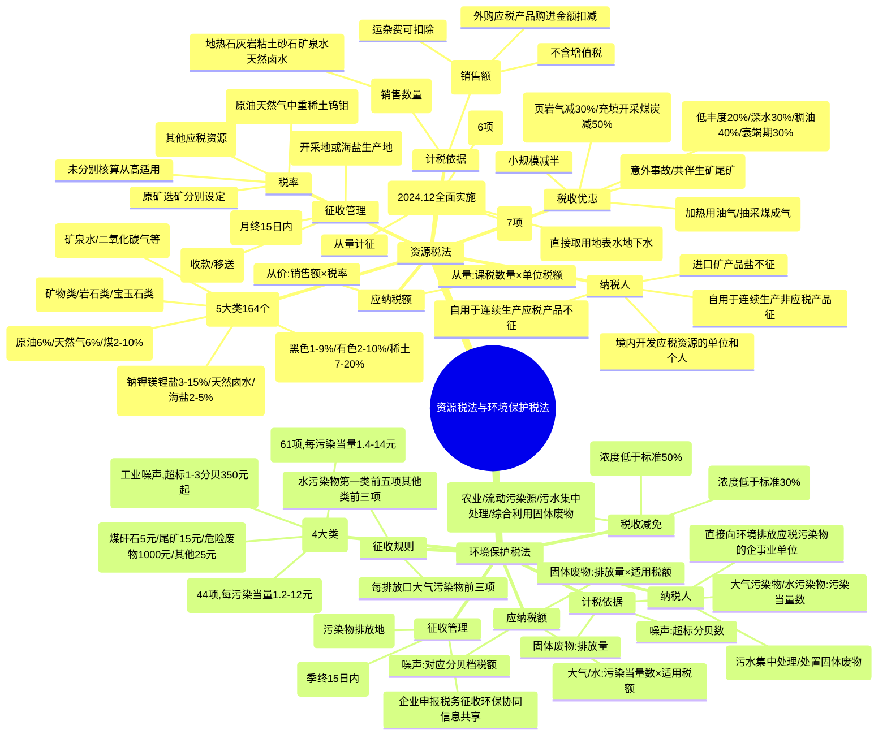

## 1. 章节定位

| 项目 | 信息 |
|------|------|
| 所属科目 | 税法 |
| 难度等级 | 2 |
| 历年分值 | 3-4分 |
| 建议学时 | 3-4h |
| 章节性质 | 资源与环保税专题 |
| 法律依据 | 《资源税法》（2020.9.1施行）、《环境保护税法》（2018.1.1施行） |

## 2. 考情分析

本章包括资源税法和环境保护税法两部分，是 CPA 税法考试次重点章节，分值约 2-3 分。考查形式以客观题为主，主观题偶有考查资源税计算。考查重点集中于：资源税纳税人（境内开采）、税目五大类（能源矿产、金属矿产、非金属矿产、水气矿产、盐）、原矿与选矿分别计征、从价计征为主从量计征为辅、销售额的确定（含运杂费扣除、外购应税产品扣减）、资源税税收优惠（低丰度油气田 20%、深水油气田 30%、衰竭期矿山 30% 等）、水资源税改革试点；环境保护税的纳税人（直接排放）、四大类税目（大气污染物、水污染物、固体废物、噪声）、污染当量数计算、每一排放口前三项（水污染物第一类前五项/其他前三项）征收规则、税收减免（30%减按75%/50%减按50%）。复习时需掌握资源税"原矿/选矿分别计征"和环境保护税"污染当量数"两大核心计算。

## 3. 知识框架

## 4. 核心精讲

### 一、资源税法

资源税是对在我国领域和管辖的其他海域开发应税资源的单位和个人征收的一种税。2019 年 8 月 26 日通过《中华人民共和国资源税法》，自 2020 年 9 月 1 日起施行。

#### （一）纳税人

资源税的纳税人是指在中华人民共和国领域及管辖的其他海域开发应税资源的单位和个人。

**关键规则**：

| 情形 | 是否征税 |
|------|----------|
| 进口矿产品和盐 | 不征收资源税 |
| 出口应税产品 | 不免征或退还已纳资源税 |
| 纳税人自用应税产品用于连续生产应税产品 | 不缴纳（如铁原矿用于生产铁精粉） |
| 纳税人自用应税产品用于连续生产非应税产品 | 移送环节缴纳（如铁精粉用于冶炼） |
| 自用于非货币性资产交换、捐赠、偿债、赞助、集资、投资、广告、样品、职工福利、利润分配 | 缴纳 |
| 工程建设项目在批准占地范围内开采并直接用于本工程回填的砂石、粘土 | 不缴纳 |
| 行政机关罚没、收缴的应税产品 | 不缴纳 |

#### （二）税目与税率

资源税税目包括 **5 大类 164 个税目**：

| 类别 | 主要内容 | 计征方式 |
|------|----------|----------|
| 能源矿产 | 原油、天然气、页岩气、煤、煤成气、铀钍、油页岩等、地热 | 原油/天然气 6%固定税率；煤 2%-10%幅度 |
| 金属矿产 | 黑色金属（铁锰铬钒钛）、有色金属（铜铅锌锡镍锑镁钴等）、铝土矿、钨、钼、金银、铂族、轻稀土、中重稀土等 | 中重稀土 20%固定；钨 6.5%；钼 8%；其他幅度 |
| 非金属矿产 | 矿物类（高岭土、石灰岩、磷、石墨等）、岩石类（大理岩、砂石等）、宝玉石类 | 1%-20%幅度 |
| 水气矿产 | 二氧化碳气、硫化氢气、氦气、氡气、矿泉水 | 1%-5%或每立方米 1-30 元 |
| 盐 | 钠盐、钾盐、镁盐、锂盐、天然卤水、海盐 | 2%-15%幅度 |

**原矿与选矿的征税对象**：

| 情形 | 计征方式 |
|------|----------|
| 自采原矿直接销售或自用 | 按原矿计征 |
| 自采原矿洗选加工为选矿产品销售或自用 | 按选矿产品计征，原矿移送环节不缴纳 |

**税率适用规则**：
- 开采或生产不同税目应税产品未分别核算的，**从高适用税率**；
- 同一税目下不同税率应税产品未分别核算的，**从高适用税率**。

#### （三）计税依据

资源税适用**从价计征为主、从量计征为辅**的征税方式。地热、石灰岩、其他粘土、砂石、矿泉水、天然卤水可采用从价计征或从量计征，其他应税产品统一适用从价定率。

**1. 从价定率征收的计税依据——销售额**

销售额 = 纳税人销售应税产品向购买方收取的全部价款（**不含增值税税款**）

**运杂费用扣除**：计入销售额中的相关运杂费用，凡取得增值税发票或其他合法有效凭据的，准予从销售额中扣除（运输费用、建设基金、装卸、仓储、港杂费用，不含增值税）。

**销售额明显偏低或无销售额时的核定顺序**：
1. 按纳税人最近时期同类产品的平均销售价格确定；
2. 按其他纳税人最近时期同类产品的平均销售价格确定；
3. 按后续加工非应税产品销售价格减去后续加工环节的成本利润后确定；
4. 按组成计税价格确定：

$$\text{组成计税价格}=\frac{\text{成本}\times(1+\text{成本利润率})}{1-\text{资源税税率}}$$

5. 按其他合理方法确定。

**外购应税产品扣减**：

| 情形 | 扣减方法 |
|------|----------|
| 外购原矿与自采原矿混合为原矿销售 | 直接扣减外购原矿购进金额 |
| 外购选矿产品与自产选矿产品混合为选矿产品销售 | 直接扣减外购选矿产品购进金额 |
| 外购原矿与自采原矿混合洗选加工为选矿产品销售 | 准予扣减的外购金额 = 外购原矿购进金额 ×（原煤适用税率 ÷ 选煤适用税率） |

**2. 从量定额征收的计税依据——销售数量**

包括纳税人开采或生产应税产品的实际销售数量和自用于应当缴纳资源税情形的应税产品数量。

#### （四）应纳税额的计算

$$\text{从价定率：应纳税额}=\text{销售额}\times\text{适用税率}$$

$$\text{从量定额：应纳税额}=\text{课税数量}\times\text{单位税额}$$

#### （五）税收优惠

| 类型 | 内容 |
|------|------|
| 免征 | ①开采原油及油田范围内运输原油过程中用于加热的原油、天然气；②煤炭开采企业因安全生产需要抽采的煤成（层）气 |
| 减征 20% | 从低丰度油气田开采的原油、天然气 |
| 减征 30% | 高含硫天然气、三次采油、深水油气田（水深超过 300 米）开采的原油、天然气；衰竭期矿山开采的矿产品 |
| 减征 40% | 稠油、高凝油 |
| 省级决定减免 | ①意外事故或自然灾害遭受重大损失；②开采共伴生矿、低品位矿、尾矿 |
| 阶段性政策 | 页岩气资源税减征 30%（至 2027.12.31）；充填开采置换煤炭减征 50%（至 2027.12.31）；小规模纳税人、小型微利企业、个体工商户减半征收（2023.1.1-2027.12.31） |

> 同一应税产品同时符合两项以上减征优惠政策的，除另有规定外，只能选择其中一项执行。

#### （六）征收管理

| 事项 | 规定 |
|------|------|
| 纳税义务发生时间 | 销售应税产品：收讫销售款或取得索取销售款凭据的当日；自用应税产品：移送应税产品的当日 |
| 纳税期限 | 按月或按季申报缴纳，自月度或季度终了之日起 15 日内；按次申报缴纳的，自纳税义务发生之日起 15 日内 |
| 纳税地点 | 矿产品的开采地或海盐的生产地 |
| 征收机关 | 税务机关；海上开采的原油和天然气由海洋石油税务管理机构征收管理 |

#### （七）水资源税改革试点

自 2024 年 12 月 1 日起全面实施水资源税改革试点。

**纳税人**：在中华人民共和国领域直接取用地表水或者地下水的单位和个人。

**不缴纳水资源税的 6 种情形**：农村集体经济组织取水；家庭生活少量取水；水工程管理单位配置调度水资源取水；矿井施工安全临时应急取水；消除公共安全危害临时应急取水；农业抗旱维护生态环境临时应急取水。

**应纳税额**：

$$\text{应纳税额}=\text{实际取用水量}\times\text{适用税额}$$

特殊情形：
- 城市公共供水企业：实际取用水量 ×（1 - 公共供水管网合理漏损率）× 适用税额
- 水力发电取用水：实际发电量 × 适用税额（最高不超过每千瓦时 0.008 元）
- 冷却取用水：实际取用（耗）水量 × 适用税额

### 二、环境保护税法

环境保护税是对在我国领域以及管辖的其他海域直接向环境排放应税污染物的企业事业单位和其他生产经营者征收的一种税。2016 年 12 月 25 日通过《中华人民共和国环境保护税法》，自 2018 年 1 月 1 日起施行。

#### （一）纳税人

环境保护税的纳税人是在中华人民共和国领域和中华人民共和国管辖的其他海域**直接向环境排放**应税污染物的企业事业单位和其他生产经营者。

**不属于直接排放，不缴纳相应污染物环境保护税的情形**：
1. 向依法设立的污水集中处理、生活垃圾集中处理场所排放应税污染物的；
2. 在符合国家和地方环境保护标准的设施、场所贮存或者处置固体废物的；
3. 达到规模标准且有污染物排放口的畜禽养殖场，依法对畜禽养殖废弃物进行综合利用和无害化处理的。

#### （二）税目与税率

| 税目 | 内容 | 税率 |
|------|------|------|
| 大气污染物 | 二氧化硫、氮氧化物、一氧化碳等 44 项（不含二氧化碳） | 每污染当量 1.2-12 元 |
| 水污染物 | 第一类水污染物（总汞、总镉、总铬等 10 项）；第二类水污染物（SS、BOD₅、CODcr 等 51 项） | 每污染当量 1.4-14 元 |
| 固体废物 | 煤矸石（5 元/吨）、尾矿（15 元/吨）、危险废物（1,000 元/吨）、冶炼渣/粉煤灰/炉渣/其他（25 元/吨） | 定额税率 |
| 噪声 | 工业噪声（超标 1-3 分贝 350 元/月起，超标 16 分贝以上 11,200 元/月） | 超标分贝对应月税额 |

#### （三）计税依据

| 税目 | 计税依据 |
|------|----------|
| 大气污染物 | 污染物排放量折合的污染当量数 |
| 水污染物 | 污染物排放量折合的污染当量数 |
| 固体废物 | 固体废物的排放量（产生量 - 综合利用量 - 贮存量 - 处置量） |
| 噪声 | 超过国家规定标准的分贝数 |

**污染当量数计算公式**：

$$\text{污染当量数}=\frac{\text{该污染物的排放量}}{\text{该污染物的污染当量值}}$$

**征收规则**：

| 污染物类型 | 每一排放口征收项目数 |
|------------|----------------------|
| 大气污染物 | 按污染当量数从大到小排序，前三项征收 |
| 水污染物（第一类） | 按污染当量数从大到小排序，前五项征收 |
| 水污染物（其他类） | 按污染当量数从大到小排序，前三项征收 |

#### （四）应纳税额的计算

**1. 大气污染物**：

$$\text{应纳税额}=\text{污染当量数}\times\text{适用税额}$$

**2. 水污染物**：

$$\text{应纳税额}=\text{污染当量数}\times\text{适用税额}$$

**3. 固体废物**：

$$\text{应纳税额}=(\text{产生量}-\text{综合利用量}-\text{贮存量}-\text{处置量})\times\text{适用税额}$$

**4. 噪声**：按超过国家规定标准的分贝数对应的具体适用税额（按月计征）。

#### （五）税收减免

**暂予免征环境保护税**：
1. 农业生产（不包括规模化养殖）排放应税污染物的；
2. 机动车、铁路机车、非道路移动机械、船舶和航空器等流动污染源排放应税污染物的；
3. 依法设立的城乡污水集中处理、生活垃圾集中处理场所排放相应应税污染物，不超过国家和地方规定的排放标准的；
4. 纳税人综合利用的固体废物，符合国家和地方环境保护标准的；
5. 国务院批准免税的其他情形。

**减征税额**：

| 浓度值低于排放标准 | 减征比例 |
|--------------------|----------|
| 30% | 减按 75% 征收 |
| 50% | 减按 50% 征收 |

> 任何一个排放口排放应税大气污染物、水污染物的浓度值超过国家和地方规定的污染物排放标准的，依法不予减征环境保护税。

#### （六）征收管理

| 事项 | 规定 |
|------|------|
| 征管方式 | 企业申报、税务征收、环保协同、信息共享 |
| 纳税义务发生时间 | 纳税人排放应税污染物的当日 |
| 纳税期限 | 按月计算，按季申报缴纳；自季度终了之日起 15 日内；按次申报的自纳税义务发生之日起 15 日内 |
| 纳税地点 | 应税污染物排放地的税务机关 |

## 5. 典型例题

### 例题 1：资源税从价计征

某油田 2026 年 2 月销售原油 20,000 吨，开具增值税专用发票取得销售额 10,000 万元、增值税税额 1,300 万元，原油适用税率为 6%。计算该油田当月应缴纳的资源税。

**解答**：

应纳税额 = 10,000 × 6% = **600（万元）**

### 例题 2：资源税进口不征+自用计算

某石化企业 2026 年 3 月业务：
- 进口原油 50,000 吨，支付不含税价款 9,000 万元；
- 开采原油 10,000 吨，对外销售 6,000 吨，取得不含税销售额 2,340 万元；
- 用开采的原油 2,000 吨加工生产汽油 1,300 吨。

计算该石化公司当月应纳资源税。

**解答**：

1. 进口原油不征资源税；
2. 销售原油应纳资源税 = 2,340 × 6% = 140.4（万元）；
3. 每吨不含税售价 = 2,340 ÷ 6,000 = 0.39（万元）；
   自用原油加工汽油（非应税产品）应纳资源税 = 0.39 × 2,000 × 6% = 46.8（万元）；
4. 当月应纳资源税 = 140.4 + 46.8 = **187.2（万元）**

### 例题 3：资源税从量计征

某砂石开采企业 2026 年 3 月销售砂石 3,000 立方米，资源税税率为 2 元/立方米。计算当月应纳资源税。

**解答**：

应纳税额 = 3,000 × 2 = **6,000（元）**

### 例题 4：环境保护税大气污染物计算

某企业 2026 年 3 月向大气直接排放二氧化硫、氟化物各 100 千克，一氧化碳 200 千克、氯化氢 80 千克，当地大气污染物每污染当量税额 1.2 元，该企业只有一个排放口。计算应纳税额。

**解答**：

第一步：计算各污染物污染当量数（污染当量数 = 排放量 ÷ 污染当量值）
- 二氧化硫：100 ÷ 0.95 = 105.26
- 氟化物：100 ÷ 0.87 = 114.94
- 一氧化碳：200 ÷ 16.7 = 11.98
- 氯化氢：80 ÷ 10.75 = 7.44

第二步：按污染当量数从大到小排序，选取前三项：
氟化物（114.94）> 二氧化硫（105.26）> 一氧化碳（11.98）> 氯化氢（7.44）

前三项：氟化物、二氧化硫、一氧化碳。

第三步：计算应纳税额 =（114.94 + 105.26 + 11.98）× 1.2 = **278.62（元）**

### 例题 5：环境保护税水污染物计算

甲化工厂仅有 1 个污水排放口且直接向河流排放污水。监测数据显示 2026 年 2 月共排放污水 6 万吨，应税污染物为六价铬，浓度为 0.5 毫克/升。该厂所在省水污染物税率为 2.8 元/污染当量，六价铬污染当量值为 0.02 千克。计算应缴纳的环境保护税。

**解答**：

1. 六价铬排放量 = 60,000,000 升 × 0.5 毫克/升 ÷ 1,000,000 = 30 千克

2. 污染当量数 = 30 ÷ 0.02 = 1,500

3. 应纳税额 = 1,500 × 2.8 = **4,200（元）**

### 例题 6：环境保护税固体废物计算

某企业 2026 年 3 月产生尾矿 1,000 吨，其中综合利用 300 吨（符合国家规定），在符合环保标准的设施贮存 300 吨。计算当月尾矿应缴纳的环境保护税。

**解答**：

尾税排放量 = 1,000 - 300 - 300 = 400（吨）

应纳税额 = 400 × 15 = **6,000（元）**

### 例题 7：环境保护税噪声计算

某工业企业只有一个生产场所，只在昼间生产，1 类功能区昼间噪声排放限值 55 分贝，生产产生噪声 60 分贝，当月超标天数为 18 天。计算当月噪声污染应缴纳的环境保护税。

**解答**：

超标分贝数 = 60 - 55 = 5 分贝

根据税目税额表，超标 4-6 分贝对应每月 700 元。

声源一个月内超标不足 15 天的，减半计算应纳税额。本月超标 18 天（超过 15 天），不减半。

应纳税额 = **700（元）**

## 6. 记忆口诀

### 口诀 1：资源税 5 大税目
> 能源金属非金属，水气矿产加上海盐。

### 口诀 2：资源税计征方式
> 从价为主从量辅，原矿选矿分别征；外购混合直接扣，洗选加工按率折。

### 口诀 3：资源税税收优惠
> 加热油气免，低丰度二成，深水三成稠油四，衰竭矿山三成减。

### 口诀 4：资源税征收管理
> 进口不征出口不退，连续生产应税不征，开采地是纳税地。

### 口诀 5：资源税纳税人判定
> 境内开发才纳税，进口矿盐不征收；连续生产应税产品不征，非应税产品移送征。

### 口诀 6：资源税销售额核定
> 不含增值税款，运杂费可凭票扣；外购混合直接扣，洗选加工按率折。

### 口诀 7：环境保护税四大类
> 大气水污染按当量，固体废物按排放量，工业噪声按超标分贝。

### 口诀 8：环境保护税前三项规则
> 大气前三水前五（第一类），其他水污染物也前三，按当量从大到小排。

### 口诀 9：环境保护税减免
> 农业流动污水处理免，浓度低于三成按七五，浓度低于五成按五折。

### 口诀 10：环境保护税征管
> 企业申报税务征收，环保协同信息共享，按月计算按季申报。

### 口诀 11：环境保护税固体废物税额
> 煤矸石五元尾矿十五，危险废物一千元，其他固体二十五元每吨。

### 口诀 12：环境保护税噪声计算
> 超标一至三分贝三百五起步，不足十五天减半算，超过十五天全额征。

  
资源税

  
本章节为资源税与环境保护税专题，"原矿/选矿分别计征"与"污染当量数排序前三项"是两大核心考点。

## 7. 同步练习

**1.（单选题）** 下列各项中，属于资源税纳税人的是（　）。

A. 生产人造石油的股份制企业
B. 生产海盐的国有企业
C. 生产煤炭制品的集体企业
D. 进口有色金属矿的私营企业

**2.（单选题）** 下列情形中，属于直接向环境排放污染物，从而应缴纳环境保护税的是（　）。

A. 餐饮企业直接向环境排放厨余垃圾
B. 建筑企业直接向环境排放建筑噪音
C. 造纸企业将处理达标的污水直接排放到河流中
D. 工业企业生产的粉煤灰直接排放到规定的灰尘处理场所

**3.（单选题）** 下列关于资源税税收优惠的说法中，不正确的是（　）。

A. 开采原油以及油田范围内运输原油过程中用于加热的原油、天然气免征资源税
B. 煤炭开采企业因安全生产需要抽采的煤成气免征资源税
C. 从深水油气田开采的原油、天然气，减征 $30\%$ 资源税
D. 稠油、高凝油减征 $30\%$ 资源税

**4.（单选题）** 下列关于环境保护税的说法正确的是（　）。

A. 家庭产生的生活垃圾应该缴纳环境保护税
B. 机动车和铁路机车排放的应税污染物暂时免征环境保护税
C. 应税水污染物中，色度的污染当量数，以污水排放量除以适用的污染当量值计算
D. 建筑工地直接排放的建筑噪声应该缴纳环境保护税

**5.（单选题）** 某石化公司为增值税小规模纳税人，2024年1月开采原油5010吨，对外销售2000吨，取得不含税价款600万元。将开采的原油3000吨用于加工生产汽油1950吨，另将10吨原油用于开采过程中加热使用。原油资源税税率 $6\%$，该企业当月应缴纳资源税为（　）万元。

A. 40.68
B. 45
C. 90.18
D. 36

**6.（单选题）** 某养猪场2024年3月初养猪存栏量为2000头，3月末养猪存栏量为4000头，污染当量值为1头，当地水污染物适用税额为每污染当量2元，当月应缴纳环境保护税为（　）元。

A. 0
B. 3000
C. 6000
D. 9000

**7.（单选题）** 下列关于环境保护税税收优惠的表述，不正确的是（　）。

A. 农业生产（不包括规模化养殖）排放应税污染物的，暂予免征环境保护税
B. 依法设立的生活垃圾焚烧发电厂排放相应应税污染物，不超过国家和地方规定的排放标准的，暂予免征环境保护税
C. 机动车、铁路机车等流动污染源排放应税污染物的，暂予免征环境保护税
D. 排放的扬尘、工业粉尘等颗粒物，除可以确定为烟尘、石棉尘、玻璃棉尘、炭黑尘的外，暂予免征环境保护税

**8.（单选题）** （2024年）下列矿产中，适用固定税率征收资源税的是（　）。

A. 钼选矿
B. 银原矿
C. 铁选矿
D. 铜原矿

**9.（单选题）** （2024年）下列关于矿产资源享受资源税减征优惠的说法中，正确的是（　）。

A. 从衰竭期矿山开采矿产品减征 $20\%$
B. 开采稠油减征 $20\%$
C. 从低丰度油田开采的原油减征 $30\%$
D. 从深海油气田开采的原油减征 $30\%$

**10.（单选题）** （2024年）纳税人有违法行为虚假申报大气污染物应缴纳的环境保护税的，作为污染物的排放量的计税依据是（　）。

A. 当期产生量
B. 上期产生量
C. 当期排放量
D. 上期排放量

**11.（单选题）** （2023年）下列各项中，可减征 $20\%$ 资源税的是（　）。

A. 陆上油田开采的高凝油
B. 从深水油气田开采的原油
C. 三次采油开采的原油
D. 从低丰度油田开采的原油

**12.（单选题）** （2022年）根据水资源税相关规定，下列用水中，应征收水资源税的是（　）。

A. 消除对公共利益的危害临时应急取水
B. 工业生产直接从水库取用水
C. 特种行业直接从海洋取用水
D. 矿井为生产安全临时应急取水

**13.（单选题）** （2022年）下列关于环境保护税征收管理的表述中，正确的是（　）。

A. 环境保护税按月计算，按年申报缴纳
B. 税务机关按规定对污染物监测管理
C. 纳税义务发生时间为排放应税污染物的次日
D. 纳税人应向应税固体废物产生地的税务机关申报缴纳

**14.（单选题）** （2021年）下列排放的应税污染物，免征环境保护税的是（　）。

A. 机动车排放的应税污染物
B. 医疗机构排放的应税污染物
C. 高新技术企业达标排放的应税污染物
D. 垃圾处理厂超标排放的应税污染物

**15.（单选题）** 下列不属于水资源税征税对象的是（　）。

A. 江水
B. 河水
C. 海水
D. 地下水

**16.（单选题）** 下列情形中，属于直接向环境排放污染物从而应缴纳环境保护税的是（　）。

A. 企业在符合国家和地方环境保护标准的场所处置应税污染物的
B. 事业单位向依法设立的生活垃圾集中处理场所排放应税污染物的
C. 企业向依法设立的污水集中处理场所排放应税污染物的
D. 依法设立的城乡污水集中处理场所超过国家和地方规定的排放标准排放应税污染物的

**17.（单选题）** 某油田为增值税一般纳税人，2024年11月份销售原油86000吨，收取不含增值税价款34400万元；销售与原油同时开采的天然气47500千立方米，收取不含税价款2375万元；自用原油25吨，其中18吨用于本企业在建工程，7吨用于开采原油过程中加热使用。该油田原油、天然气的资源税税率均为 $6\%$，该油田本月应纳资源税为（　）万元。

A. 2000
B. 1838.75
C. 2206.93
D. 1926.25

**18.（单选题）** 下列关于资源税的纳税期限，说法不正确的是（　）。

A. 纳税人按月申报缴纳的，应当自月度终了之日起15日内，向税务机关办理纳税申报并缴纳税款
B. 纳税人按季申报缴纳的，应当自季度终了之日起15日内，向税务机关办理纳税申报并缴纳税款
C. 纳税人按次申报缴纳的，应当自纳税义务发生之日起5日内，向税务机关办理纳税申报并缴纳税款
D. 资源税按月或按季申报缴纳；不能按固定期限计算缴纳的，可以按次申报缴纳

**19.（多选题）** 下列项目中，属于资源税征税范围的有（　）。

A. 天然卤水
B. 人造石油
C. 海盐
D. 地热

**20.（多选题）** 下列各项中，属于环境保护税征税范围的有（　）。

A. 煤矸石
B. 氮氧化物
C. 二氧化硫
D. 建筑噪声

**21.（多选题）** 目前，资源税税目中单一采用比率税率计征资源税的有（　）。

A. 煤炭
B. 原油
C. 海盐
D. 石灰岩

**22.（多选题）** 下列关于资源税税收优惠的说法中，正确的有（　）。

A. 从低丰度油气田开采的天然气，减征 $20\%$ 资源税
B. 对充填开采置换出来的煤炭，资源税减征 $50\%$
C. 从深水油气田开采的原油、天然气，减征 $20\%$ 资源税
D. 从衰竭期矿山开采的矿产品，减征 $30\%$ 资源税

**23.（多选题）** 下列应税污染物中，按照污染物排放量折合的污染当量数作为环境保护税计税依据的有（　）。

A. 工业噪声
B. 水污染物
C. 大气污染物
D. 煤矸石

**24.（多选题）** （2024年）根据资源税法规定，下列由省级人民政府决定减免税的情形有（　）。

A. 天然气企业开采自用天然气
B. 铜矿业开采低品位矿
C. 铁矿业开采共伴生矿
D. 盐业企业生产无碘海盐

**25.（多选题）** （2024年）下列属于环境保护税征税范围的有（　）。

A. 粉煤灰
B. 总汞
C. 总铬
D. 总镉

**26.（多选题）** （2024年）下列属于应税污染物排放量的计算方法有（　）。

A. 排污系数方法
B. 物料衡算方法
C. 抽样测算方法
D. 投入产出法

**27.（多选题）** （2024年）海洋工程环境保护税纳税人向海洋水体排放水基泥浆和钻屑，应计征环境保护税的应税污染物有（　）。

A. 总铬
B. 石油类
C. 总镉
D. 总汞

**28.（多选题）** （2023年）下列关于资源税税率的表述中，符合税法规定的有（　）。

A. 矿泉水适用比例税率或定额税率
B. 纳税人以自采原矿洗选加工为选矿产品销售，按照选矿产品适用税率
C. 对原油应由省级人民政府提出具体适用税率，报同级人大常委会决定
D. 纳税人开采同一税目下适用不同税率应税产品，未分别核算的，从高适用税率

**29.（多选题）** 下列关于水资源税的说法中，正确的有（　）。

A. 水源热泵取用水，从低确定税额
B. 疏干排水进行处理后自用的部分，从低确定税额
C. 疏干排水进行净化后供其他单位和个人使用的部分，从高确定税额
D. 水力发电取用水适用税额最高不得超过每千瓦时0.008元

**30.（多选题）** 下列情形中，予以免征水资源税的有（　）。

A. 规定限额内的农业生产取用水
B. 受市人民政府委托进行国土绿化取用水
C. 抽水蓄能发电取用水
D. 采油排水经分离净化后在封闭管道回注的

**31.（多选题）** 下列关于水资源税应纳税额计算的表述，正确的有（　）。

A. 水资源税实行从量计征，除规定情形外，应纳税额按实际取用水量征税
B. 对水力发电取用水按照实际发电量征税
C. 除火力发电冷却取用水外，冷却取用水按照实际取用（耗）水量征税
D. 城镇公共供水企业实际取用水量不考虑合理漏损率

**32.（计算问答题）** （2024年）某采洗选为一体的铁矿企业为增值税一般纳税人，拥有甲、乙两座矿山。甲矿山的设计开采年限超过15年，且剩余开采年限为3年，乙矿山发现页岩层，2025年7月部分经营情况如下：

（1）甲矿山开采铁原矿500吨，企业支付从坑口到洗选地的运输费用0.3万元，取得增值税发票。将其与外购不含增值税额为8万元的铁原矿一起加工成铁精粉480吨，当月销售400吨，取得不含增值税销售额40万元（含从洗选地到车站的运输费用0.4万元，取得增值税发票）。

（2）从乙矿山的页岩层中开采天然气20万立方米，销售19.5万立方米，双方约定不含增值税销售额19.5万元，其他0.5万立方米用于职工食堂，开采过程中疏干排水1万立方米。

（其他相关资料：该企业所在省铁原矿资源税税率为 $8\%$，铁精粉资源税税率为 $4\%$，天然气资源税税率为 $6\%$，该企业所在地水资源税地表水为每立方米1元，地下水为每立方米3元，该企业不属于小型微利企业。）

要求：根据上述资料，按照下列序号回答问题，如有计算需计算出合计数。

（1）判断该企业计算铁矿石资源税时是否可以扣除外购应税铁原矿的购进金额并说明理由。

（2）计算该企业7月应缴纳的铁矿石资源税。

（3）计算该企业7月应缴纳的天然气资源税。

（4）计算该企业7月疏干排水应缴纳的水资源税。

**33.（计算问答题）** （2024年）某化工企业位于化工园区内，有一个大气污染排放口，直接向环境排放应税污染物。

（1）大气污染物排放口排放氮氧化物50千克、一般性粉尘240千克、氯气18千克、硫酸雾60千克，各项大气污染物的日均小时浓度值均在当地规定的污染物排放标准内，其中氮氧化物和氯气浓度值分别为当地标准的 $45\%$ 和 $55\%$。

（2）沿边界长度超过100米，有两处以上工业噪声超标，昼间噪声超标分贝数为5分贝，超标天数12天；夜间噪声超标分贝数为3分贝，偶然突发噪声峰值分贝数为7分贝，超标天数16天。

（其他相关资料：各污染物的污染当量值分别为氮氧化物0.95千克、一般性粉尘4千克、氯气0.34千克、硫酸雾0.6千克，当地大气污染物税额为每污染当量1.2元，不考虑其他污染排放物。工业噪声月税额为：超标1~3分贝，350元；超标4~6分贝，700元；超标7~9分贝，1400元。）

要求：根据上述资料，按照下列序号回答问题，如有计算需计算出合计数。

（1）计算该企业6月大气污染物的污染当量数。

（2）计算该企业6月应缴纳的大气污染物环境保护税。

（3）计算该企业6月应缴纳的噪声环境保护税。

（4）判断纳税人申报7月环境保护税时可否沿用6月委托监测数据并说明理由。

**34.（计算问答题）** （2023年改）某煤场位于两省交界处。2024年5月发生相关业务如下：

（1）本月销售原煤20000吨，其中5000吨从衰竭期矿山开采，其余15000吨正常开采，不含增值税销售价格为600元/吨。

（2）外购原煤增值税专用发票注明金额200万元。将外购原煤与自采原煤混产后销售洗选煤，取得不含增值税销售额500万元。

（3）产生2800吨固体废物，其中综合利用800吨（符合国家和地方环境保护标准）。

（其他相关资料：原煤资源税税率 $3\%$，洗选煤资源税税率 $2\%$，环境保护税税率5元/吨。）

要求：根据上述资料，按照下列序号回答问题，如有计算需计算出合计数。

（1）计算业务（1）应缴纳的资源税。

（2）计算业务（2）应缴纳的资源税。

（3）回答纳税人应当以其当期应税固体废物的产生量作为固体废物的排放量的情形并计算业务（3）应缴纳的环境保护税。

（4）回答该企业资源税和环境保护税的纳税地点。

**35.（计算问答题）** 某煤炭企业为增值税一般纳税人，2024年6月发生以下业务：

（1）销售为安全生产需要而抽采的煤层气，取得不含增值税销售额4万元。

（2）对外销售自采原煤3000吨，不含增值税价格700元/吨；将500吨自采原煤用于偿债。

（3）将外购50万元的原煤（取得增值税专用发票）与自采原煤混合加工为洗选煤销售，开具增值税专用发票取得不含增值税销售额200万元，销售合同约定销售额包含从洗选地到码头的运输费用3万元、装卸费用1万元、港杂费用1万元，上述费用均取得增值税专用发票。

（其他相关资料：企业所在地原煤、洗选煤、煤层气资源税税率分别为 $6\%$、$3\%$、$1\%$。）

要求：根据上述资料，按照下列序号回答问题，如有计算需计算出合计数。

（1）计算业务（1）应缴纳的煤层气资源税。

（2）计算业务（2）应缴纳的原煤资源税。

（3）判断业务（3）中相关运杂费用在计算资源税时能否扣除并说明理由。

（4）计算业务（3）应缴纳的洗选煤资源税。

**36.（计算问答题）** 某铁矿开采企业2024年5月采选原矿20000吨，5月19日将其中的10000吨原矿直接销售，取得不含增值税销售收入700万元，另支付运杂费10万元。5月22日将500吨铁原矿赞助给其他企业。5000吨原矿经洗选加工成铁选矿后销售，取得不含增值税销售收入500万元，销售收入中包括运杂费5万元，取得增值税发票。企业在开采过程中产生大气污染物，但暂未取得排污许可证且无污染物监测数据。

（其他相关资料：企业所在省规定铁原矿资源税税率为 $3\%$，铁选矿资源税税率为 $2\%$；一般性粉尘污染当量值为4千克，大气污染物每污染当量税额3.6元；根据生态环境部发布的排放源统计调查制度规定的方法计算的铁矿采选一般性粉尘的排污系数为60千克/万吨-铁原矿，不考虑其他污染排放物。）

要求：根据上述资料，按照下列序号回答问题，如有计算需计算出合计数。

（1）计算该企业5月份应缴纳的铁原矿资源税。

（2）计算该企业5月份应缴纳的铁选矿资源税。

（3）回答该企业自用应税产品资源税纳税义务发生时间。

（4）计算该企业5月份采选铁原矿应缴纳的环境保护税。

（5）回答环境保护税的征管方式。

---

**练习答案**：

1.B（人造石油、煤炭制品不属于资源税征税范围；对进口应税资源产品的单位或个人不征收资源税）　2.C（厨余垃圾、建筑噪音不属于环保税征税范围；粉煤灰排放到规定的灰尘处理场所不属于直接向环境排放固体废物；造纸企业将处理达标的污水直接排放到河流中，属于直接向环境排放应税水污染物）　3.D（稠油、高凝油减征 $40\%$ 资源税，不是 $30\%$）　4.B（选项A，家庭生活垃圾不缴纳环保税；选项C，色度污染当量数＝污水排放量×色度超标倍数÷污染当量值；选项D，建筑噪声无需缴纳环保税，仅工业噪声征税）　5.B（应纳资源税 $=[600\times6\%+3000\times(600\div2000)\times6\%]\times50\%=(36+54)\times50\%=45$ 万元；加热用10吨免征，小规模纳税人减半征收）　6.C（水污染物当量数 $=(2000+4000)\div2\div1=3000$；应纳环保税 $=3000\times2=6000$ 元）　7.D（排放的扬尘、工业粉尘等颗粒物，除可以确定为烟尘、石棉尘、玻璃棉尘、炭黑尘的外，按照一般性粉尘征收环保税，并非免征）　8.A（对原油、天然气、天然气水合物、页岩气、铀、钍、中重稀土、钨、钼等战略资源实行固定税率）　9.D（选项A，衰竭期矿山减征 $30\%$；选项B，稠油减征 $40\%$；选项C，低丰度油田减征 $20\%$；选项D，深水油气田开采的原油、天然气减征 $30\%$）　10.A（纳税人进行虚假纳税申报的，以其当期应税大气污染物、水污染物、应税固体废物的产生量作为污染物的排放量）　11.D（选项A，高凝油减征 $40\%$；选项B、C，深水油气田、三次采油减征 $30\%$；选项D，低丰度油田减征 $20\%$）　12.B（水资源税征税对象为地表水和地下水；A、D为临时应急取水不征收，C海水不属于征税范围；B工业生产直接从水库（地表水）取用水应征收）　13.D（选项A，按月计算、按季申报缴纳；选项B，生态环境主管部门负责监测管理；选项C，纳税义务发生时间为排放应税污染物的当日）　14.A（机动车、铁路机车、非道路移动机械、船舶和航空器等流动污染源排放应税污染物的，暂予免征环保税）　15.C（水资源税征税对象为地表水和地下水，不包括海水等非常规水）　16.D（依法设立的城乡污水集中处理、生活垃圾集中处理场所排放相应应税污染物，不超过国家和地方规定排放标准的，暂免征收；超过排放标准的，应征收）　17.C（加热用7吨免征，用于在建工程18吨按同类售价计征，单价 $=34400\div86000=0.4$ 万元/吨；应纳资源税 $=(34400+0.4\times18+2375)\times6\%=2206.93$ 万元）　18.C（按次申报缴纳的，应当自纳税义务发生之日起15日内办理纳税申报并缴纳税款，不是5日）　19.ACD（人造石油不属于资源税征税范围）　20.ABC（环保税征税范围包括大气污染物、水污染物、固体废物和噪声，其中噪声仅对工业噪声征税，建筑噪声未纳入）　21.ABC（地热、石灰岩、其他粘土、砂石、矿泉水和天然卤水采用比例税率或定额税率，其余应税资源均采用比例税率；石灰岩采用比例税率或定额税率，故D不选）　22.ABD（选项C，从深水油气田开采的原油、天然气减征 $30\%$ 资源税）　23.BC（工业噪声按超过国家规定标准的分贝数确定；固体废物按排放量确定；大气污染物、水污染物按污染当量数确定）　24.BC（因意外事故或自然灾害遭受重大损失，以及开采共伴生矿、低品位矿、尾矿的，由省级人民政府决定减免税）　25.ABCD（粉煤灰属固体废物；总汞、总铬、总镉属水污染物）　26.ABC（排放量计算方法：自动监测数据、监测机构监测数据、排污系数方法、物料衡算方法、抽样测算方法；投入产出法不属于）　27.BCD（钻井泥浆和钻屑按照泥浆和钻屑中石油类、总镉、总汞的污染物排放量折合的污染当量数计征）　28.ABD（选项C，对原油、天然气、中重稀土、钨、钼等战略资源实行固定税率，由税法直接确定，不由省级人民政府提出）　29.ABD（选项C，疏干排水中回收利用的部分——处理净化后自用及供其他单位和个人使用的部分，从低确定税额）　30.ABCD（规定限额内农业生产取用水、受县级以上政府委托进行国土绿化等生态取用水、抽水蓄能发电取用水、采油（气）排水经分离净化后在封闭管道回注的，均免征水资源税）　31.ABC（选项D，城镇公共供水企业实际取用水量应当考虑合理漏损率）　32.（1）可以扣除。理由：纳税人以外购原矿与自采原矿混合洗选加工为选矿产品销售的，准予从销售额中扣减外购原矿的购进金额。（2）甲矿山设计开采年限超过15年且剩余开采年限不超过5年，属于衰竭期矿山，减征 $30\%$。准予扣减外购原矿购进金额 $=8\times8\%\div4\%=16$ 万元；铁矿石资源税 $=(40-0.4-16)\times4\%\times(1-30\%)=0.66$ 万元。（3）从页岩层开采的天然气属于页岩气，减征 $30\%$；用于职工食堂的0.5万立方米视同销售（单价 $=19.5\div19.5=1$ 元/立方米）；天然气资源税 $=20\times6\%\times(1-30\%)=0.84$ 万元。（4）疏干排水按地下水适用税额计征，水资源税 $=1\times3=3$ 万元。
33.（1）氮氧化物污染当量数 $=50\div0.95\approx52.63$；一般性粉尘 $=240\div4=60$；氯气 $=18\div0.34\approx52.94$；硫酸雾 $=60\div0.6=100$。（2）只有一个排放口，按污染当量数排序选取前三项：硫酸雾（100）、一般性粉尘（60）、氯气（52.94）；氯气浓度值为当地标准的 $55\%$，即低于排放标准 $30\%$，减按 $75\%$ 征收；应纳环保税 $=(100+60)\times1.2+52.94\times1.2\times75\%\approx239.65$ 元。（3）昼间超标5分贝（700元档），12天不足15天减半；夜间取3分贝（350元）与偶然突发峰值7分贝（1400元）中较高者，16天≥15天全额；沿边界长度超过100米有两处以上噪声超标，按两个单位计算；应纳环保税 $=(700\times50\%+1400)\times2=3500$ 元。（4）不可以。理由：采用委托监测方式，当月无监测数据可沿用最近一次监测数据，但不得跨季度沿用；6月属第二季度、7月属第三季度，跨季度，不得沿用。
34.（1）应纳资源税 $=5000\times600\times3\%\times(1-30\%)+15000\times600\times3\%=63000+270000=333000$ 元 $=33.3$ 万元（从衰竭期矿山开采的矿产品减征 $30\%$）。（2）准予扣减外购原煤购进金额 $=200\times3\%\div2\%=300$ 万元；应纳资源税 $=(500-300)\times2\%=4$ 万元。（3）纳税人因排放污染物种类多等原因不具备监测条件、无法准确计量应税固体废物排放量的，以其当期应税固体废物的产生量作为排放量；综合利用的800吨符合国家和地方环保标准，暂免征收，业务（3）应纳环保税 $=(2800-800)\times5=10000$ 元。（4）资源税向应税产品的开采地或生产地的主管税务机关申报缴纳；环境保护税向应税固体废物产生地的主管税务机关申报缴纳。
35.（1）为安全生产需要抽采的煤成（层）气免征资源税，业务（1）应纳资源税为0。（2）用于偿债的500吨原煤视同销售；应纳原煤资源税 $=(3000+500)\times700\times6\%=14.7$ 万元。（3）可以扣除。理由：纳税人销售洗选煤收取的从洗选地到码头等运输地点的运输费用、装卸费用、港杂费用，取得增值税发票或其他合法有效凭据的，准予从销售额中扣减。（4）准予扣减外购原煤购进金额 $=50\times6\%\div3\%=100$ 万元；应纳洗选煤资源税 $=(200-3-1-1-100)\times3\%=2.85$ 万元。
36.（1）赞助给其他企业的500吨铁原矿视同销售，单价 $=700\div10000=0.07$ 万元/吨；应纳铁原矿资源税 $=(700+500\times0.07)\times3\%=735\times3\%=22.05$ 万元。（2）销售收入中含运杂费5万元且取得增值税发票，准予扣除；应纳铁选矿资源税 $=(500-5)\times2\%=9.9$ 万元。（3）自产自用应税产品的资源税纳税义务发生时间，为移送使用的当日。（4）采选铁原矿2万吨，一般性粉尘排放量 $=2\times60=120$ 千克；污染当量数 $=120\div4=30$；应纳环保税 $=30\times3.6=108$ 元。（5）环境保护税实行"企业申报、税务征收、环保协同、信息共享"的征管方式，由税务机关负责征收管理，生态环境主管部门负责对污染物的监测管理。
