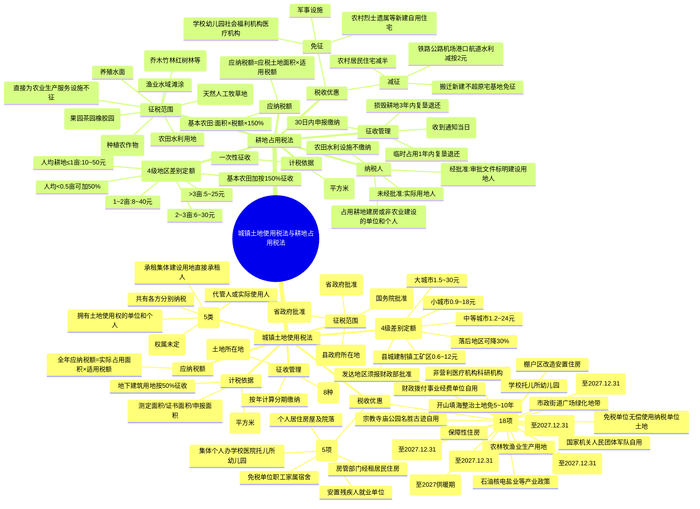

## 1. 章节定位

| 项目 | 信息 |
|------|------|
| 所属科目 | 税法 |
| 难度等级 | 1 |
| 历年分值 | 2-3分 |
| 建议学时 | 2-3h |
| 章节性质 | 土地税专题 |
| 法律依据 | 《城镇土地使用税暂行条例》、《耕地占用税法》（2019.9.1施行） |

## 2. 考情分析

本章包括城镇土地使用税法和耕地占用税法两部分，是 CPA 税法考试次重点章节，分值约 1-2 分。考查形式以客观题为主，主观题偶有涉及。考查重点集中于：城镇土地使用税纳税人（5 类情形）、征税范围（城市、县城、建制镇、工矿区）、4 级差别定额税率（大城市 1.5-30 元/平方米）、计税依据（实际占用土地面积）、税收优惠（法定 18 项免征 + 省级 5 项减免）、纳税义务发生时间（8 种情形）；耕地占用税纳税人（占用耕地建房或非农业建设）、征税范围（耕地及园地、林地等 6 类）、4 级地区差别定额税率（按人均耕地分档）、基本农田加按 150% 征收、一次性征收特点、税收优惠（军事/学校/医疗机构免征、铁路公路机场减按 2 元/平方米）、临时占用复垦退税。复习时需抓住"差别定额税率"和"一次性征收"两大特点。

## 3. 知识框架

## 4. 核心精讲

### 一、城镇土地使用税法

城镇土地使用税是以城市、县城、建制镇、工矿区内的国家所有和集体所有的土地为征税对象，对拥有土地使用权的单位和个人征收的一种税。现行基本规范是 2006 年 12 月 31 日国务院修改颁布的《城镇土地使用税暂行条例》，2019 年 3 月 2 日第四次修订。

#### （一）纳税人与征税范围

**1. 纳税人**

在城市、县城、建制镇、工矿区范围内使用土地的单位和个人，为城镇土地使用税的纳税人。具体包括以下 5 类：

| 情形 | 纳税人 |
|------|--------|
| 拥有土地使用权的单位和个人 | 拥有人本身 |
| 拥有人不在土地所在地 | 代管人或实际使用人 |
| 土地使用权未确定或权属纠纷未解决 | 实际使用人 |
| 土地使用权共有 | 共有各方分别纳税（按实际使用面积比例） |
| 承租集体所有建设用地 | 直接从集体经济组织承租的单位和个人 |

> 共有土地按实际使用面积比例分别纳税。例如 1,500 平方米土地，甲用 1/3、乙用 2/3，则甲按 500 平方米、乙按 1,000 平方米分别纳税。

**2. 征税范围**

征税范围包括城市、县城、建制镇和工矿区内的国家所有和集体所有的土地。

| 区域 | 确认标准 |
|------|----------|
| 城市 | 经国务院批准设立的市（含市区和郊区） |
| 县城 | 县人民政府所在地的城镇 |
| 建制镇 | 经省、自治区、直辖市人民政府批准设立的建制镇（镇人民政府所在地） |
| 工矿区 | 工商业发达、人口集中、符合建制镇标准但尚未设镇的大中型工矿企业所在地（须经省级政府批准） |

> 建立在城市、县城、建制镇和工矿区以外的企业不需要缴纳城镇土地使用税。

#### （二）税率、计税依据和应纳税额

**1. 税率**

城镇土地使用税采用**有幅度的差别定额税率**，按大、中、小城市和县城、建制镇、工矿区分别规定每平方米年应纳税额：

| 级别 | 每平方米年税额（元） |
|------|---------------------|
| 大城市 | 1.5 ~ 30 |
| 中等城市 | 1.2 ~ 24 |
| 小城市 | 0.9 ~ 18 |
| 县城、建制镇、工矿区 | 0.6 ~ 12 |

**调整规则**：
- 经济落后地区：可适当降低，但降低额不得超过规定最低税额的 **30%**；
- 经济发达地区：可适当提高，但须报**财政部批准**。

**2. 计税依据**

以纳税人**实际占用的土地面积**（平方米）为计税依据。

| 情形 | 面积确定方法 |
|------|--------------|
| 已组织测定 | 以测定面积为准 |
| 未测定但持有土地使用证书 | 以证书确认面积为准 |
| 未核发证书 | 据实申报，待核发证书后调整 |
| 地下建筑用地（已取得使用权证） | 按证载面积计算 |
| 地下建筑用地（未取得证或未标明面积） | 按地下建筑垂直投影面积计算 |

> 地下建筑用地暂按应征税款的 **50%** 征收城镇土地使用税。

**3. 应纳税额计算**

$$\text{全年应纳税额}=\text{实际占用应税土地面积（平方米）}\times\text{适用税额}$$

#### （三）税收优惠

**1. 法定免征优惠（主要项目）**

| 序号 | 免征项目 | 说明 |
|------|----------|------|
| 1 | 国家机关、人民团体、军队自用的土地 | 办公用地和公务用地 |
| 2 | 国家财政部门拨付事业经费的单位自用的土地 | 业务用地（如学校教学楼、操场等） |
| 3 | 宗教寺庙、公园、名胜古迹自用的土地 | 仪式用地/公共参观用地；附设营业单位用地照章征税 |
| 4 | 市政街道、广场、绿化地带等公共用地 | — |
| 5 | 直接用于农、林、牧、渔业的生产用地 | 不包括农副产品加工场地和生活办公用地 |
| 6 | 经批准开山填海整治的土地和改造的废弃土地 | 从使用月份起免征 5~10 年 |
| 7 | 非营利性医疗机构、疾病控制机构、妇幼保健机构自用土地 | — |
| 8 | 国家拨付事业经费和企业办的学校、托儿所、幼儿园自用土地 | — |
| 9 | 免税单位无偿使用纳税单位的土地 | 纳税单位无偿使用免税单位土地则照章缴纳 |
| 10 | 棚户区改造安置住房建设用地 | 配建按建筑面积比例免征 |
| 11 | 保障性住房项目建设用地 | 配建按建筑面积比例免征 |
| 12 | 公租房建设期间及建成后占地 | 至 2027.12.31 |
| 13 | 石油、核电、盐业等产业政策性减免 | 详见下表 |
| 14 | 物流企业大宗商品仓储设施用地（≥6,000 平方米） | 减按 50% 征收，至 2027.12.31 |
| 15 | 国家级、省级科技企业孵化器、大学科技园、众创空间 | 至 2027.12.31 |
| 16 | 农产品批发市场、农贸市场专门用于经营农产品的土地 | 至 2027.12.31 |
| 17 | "三北"地区供热企业为居民供热所使用土地 | 至 2027 供暖期结束 |
| 18 | 城市公交站场、道路客运站场、城市轨道交通系统运营用地 | 至 2027.12.31 |

**产业政策性减免明细**：

| 行业 | 减免规定 |
|------|----------|
| 石油天然气 | 施工临时用地、厂外铁路专用线/公路/管道、油气长输管线暂免；工矿区内消防防洪防风防沙设施暂免 |
| 核电站 | 核岛、常规岛、辅助厂房、通讯设施用地免征；生活办公用地征税；基建期内减半征收 |
| 盐场盐矿 | 盐滩、矿井用地暂免 |
| 企业铁路公路 | 厂区外与社会公用地段未隔离的暂免 |
| 企业绿化用地 | 厂外公共绿化和开放公园暂免；厂区内绿化用地照章征收 |

**2. 省级确定减免优惠**

| 序号 | 减免项目 |
|------|----------|
| 1 | 个人所有的居住房屋及院落用地 |
| 2 | 房产管理部门在房租调整改革前经租的居民住房用地 |
| 3 | 免税单位职工家属的宿舍用地 |
| 4 | 集体和个人办的各类学校、医院、托儿所、幼儿园用地 |
| 5 | 安置残疾人就业单位的用地 |

#### （四）征收管理

**1. 纳税期限**

实行**按年计算、分期缴纳**的征收方法，具体纳税期限由省、自治区、直辖市人民政府确定。

**2. 纳税义务发生时间**

| 情形 | 纳税义务发生时间 |
|------|------------------|
| 购置新建商品房 | 房屋交付使用之次月起 |
| 购置存量房 | 房屋权属证书签发之次月起 |
| 出租、出借房产 | 交付出租、出借房产之次月起 |
| 新征收的耕地 | 批准征收之日起满 1 年时 |
| 新征收的非耕地 | 批准征收之次月起 |
| 招标、拍卖、挂牌取得建设用地 | 合同约定交付土地时间之次月起（未约定的为合同签订之次月起） |
| 出让或转让方式有偿取得土地使用权 | 受让方自合同约定交付土地时间之次月起（未约定的为合同签订之次月起） |
| 因土地权利变化终止纳税义务 | 应纳税款计算截止到土地权利发生变化的当月末 |

**3. 纳税地点和征收机构**

- **纳税地点**：土地所在地缴纳；
- 跨省、自治区、直辖市使用的土地：分别向土地所在地税务机关缴纳；
- 同省、自治区、直辖市内跨地区使用的土地：由省级税务局确定纳税地点；
- **征收机构**：土地所在地的税务机关，收入纳入地方财政预算管理。

### 二、耕地占用税法

耕地占用税是对占用耕地建设建筑物、构筑物或者从事非农业建设的单位和个人，就其实际占用的耕地面积征收的一种税。现行基本规范是 2018 年 12 月 29 日通过的《中华人民共和国耕地占用税法》。

#### （一）纳税人与征税范围

**1. 纳税人**

在中华人民共和国境内占用耕地建设建筑物、构筑物或者从事非农业建设的单位和个人。

| 情形 | 纳税人 |
|------|--------|
| 经批准占用耕地 | 农用地转用审批文件中标明的建设用地人（未标明的为用地申请人；用地申请人为各级政府的，由同级土地储备中心等部门履行纳税义务） |
| 未经批准占用耕地 | 实际用地人 |
| 占用耕地建设农田水利设施 | 不缴纳耕地占用税 |

**2. 征税范围**

包括纳税人建设建筑物、构筑物或者从事非农业建设占用的耕地。所称耕地，是指用于种植农作物的土地，还包括以下农用地：

| 类别 | 范围 |
|------|------|
| 园地 | 果园、茶园、橡胶园、其他园地（桑树、可可、咖啡、油棕、胡椒、药材等） |
| 林地 | 乔木林地、竹林地、红树林地、森林沼泽、灌木林地、灌丛沼泽、其他林地（不含城镇村庄绿化林木、铁路公路征地林木、河流沟渠护堤林） |
| 草地 | 天然牧草地、沼泽草地、人工牧草地、已发放使用权证的农业生产用草地 |
| 农田水利用地 | 农田排灌沟渠及附属设施用地 |
| 养殖水面 | 人工开挖或天然形成的水产养殖河流、湖泊、水库、坑塘水面及附属设施 |
| 渔业水域滩涂 | 海水潮浸地带和滩地、苇田 |

**不征收情形**：
- 建设直接为农业生产服务的生产设施占用上述农用地的，不征收；
- 因挖损、采矿塌陷、压占、污染等损毁耕地属于非农业建设，应征收。

#### （二）税率、计税依据和应纳税额

**1. 税率**

采用**地区差别定额税率**，按人均耕地面积分档（以县、自治县、不设区的市、市辖区为单位）：

| 人均耕地面积 | 每平方米税额（元） |
|--------------|-------------------|
| 不超过 1 亩 | 10 ~ 50 |
| 超过 1 亩但不超过 2 亩 | 8 ~ 40 |
| 超过 2 亩但不超过 3 亩 | 6 ~ 30 |
| 超过 3 亩 | 5 ~ 25 |

**特殊调整**：
- 人均耕地低于 0.5 亩的地区：可适当提高，但提高部分不得超过确定适用税额的 **50%**；
- 占用基本农田：按当地适用税额**加按 150%** 征收。

**各省平均税额表**（单位：元/平方米）：

| 地区 | 平均税额 | 地区 | 平均税额 |
|------|----------|------|----------|
| 上海 | 45 | 河北、安徽、江西、山东、河南、重庆、四川 | 22.5 |
| 北京 | 40 | 广西、海南、贵州、云南、陕西 | 20 |
| 天津 | 35 | 山西、吉林、黑龙江 | 17.5 |
| 江苏、浙江、福建、广东 | 30 | 内蒙古、西藏、甘肃、青海、宁夏、新疆 | 12.5 |
| 辽宁、湖北、湖南 | 25 | — | — |

**2. 计税依据**

以纳税人**实际占用的应税土地面积**（平方米）为计税依据，实行**一次性征收**。

- 实际占用面积包括经批准占用面积和未经批准占用面积；
- 临时占用耕地（不超过 2 年、无永久性建筑物）应当缴纳，复垦后退还。

**3. 应纳税额计算**

$$\text{应纳税额}=\text{应税土地面积}\times\text{适用税额}$$

占用基本农田的：

$$\text{应纳税额}=\text{应税土地面积}\times\text{适用税额}\times 150\%$$

#### （三）税收优惠

耕地占用税对占用耕地实行一次性征收，对生产经营单位和个人**不设立减免税**，仅对部分公益性单位、公共设施、需照顾群体等设立减免税。

**1. 免征耕地占用税**

| 序号 | 免征项目 | 说明 |
|------|----------|------|
| 1 | 军事设施占用耕地 | 指挥工程、作战工程、军用机场港口码头、营区训练场试验场、军用洞库仓库、军用信息基础设施、军用公路铁路专用线、输油输水输气管道、边防海防管控设施等 |
| 2 | 学校、幼儿园、社会福利机构、医疗机构占用耕地 | 学校内经营性场所和教职工住房照章缴纳；医疗机构职工住房照章缴纳 |
| 3 | 农村烈士遗属、因公牺牲军人遗属、残疾军人及符合农村低保条件的农村居民在规定用地标准内新建自用住宅 | — |

**2. 减征耕地占用税**

| 序号 | 减征项目 | 税额 |
|------|----------|------|
| 1 | 铁路线路、公路线路、飞机场跑道、停机坪、港口、航道、水利工程占用耕地 | 减按每平方米 2 元征收 |
| 2 | 农村居民在规定用地标准内占用耕地新建自用住宅 | 按当地适用税额减半征收 |
| 3 | 农村居民经批准搬迁，新建自用住宅占用耕地不超过原宅基地面积的部分 | 免征 |

> 专用铁路、铁路专用线、专用公路、城区内机动车道占用耕地的，按当地适用税额缴纳，不享受减按 2 元优惠。

> 纳税人改变原占地用途，不再属于免征或减征情形的，应自改变用途之日起 **30 日内**申报补缴税款。

#### （四）征收管理

**1. 纳税义务发生时间**

| 情形 | 纳税义务发生时间 |
|------|------------------|
| 经批准占用耕地 | 收到自然资源主管部门办理占用耕地手续的书面通知的当日 |
| 改变原占地用途需补缴（经批准） | 收到批准文件的当日 |
| 改变原占地用途需补缴（未经批准） | 自然资源主管部门认定改变用途的当日 |
| 未经批准占用耕地 | 自然资源主管部门认定实际占用耕地的当日 |
| 挖损、采矿塌陷、压占、污染等损毁耕地 | 自然资源、农业农村等部门认定损毁耕地的当日 |

**2. 纳税期限**

- 纳税人应自纳税义务发生之日起 **30 日内**申报缴纳耕地占用税；
- 在耕地所在地申报纳税。

**3. 退税规定**

| 情形 | 退税条件 |
|------|----------|
| 临时占用耕地 | 批准临时占用期满之日起 1 年内依法复垦，恢复种植条件的，全额退还 |
| 损毁耕地 | 自认定损毁之日起 3 年内依法复垦或修复，恢复种植条件的，可按规定办理退税 |

> 依法复垦应由自然资源主管部门会同有关行业管理部门认定并出具验收合格确认书。

## 5. 典型例题

### 例题 1：城镇土地使用税基本计算

设在某城市的一家企业使用土地面积为 10,000 平方米，经税务机关核定，该土地为应税土地，每平方米年税额为 4 元。请计算其全年应纳的城镇土地使用税税额。

**解答**：

$$\text{全年应纳税额}=10{,}000\times 4=40{,}000\text{（元）}$$

### 例题 2：共有土地分别纳税

某城市的甲与乙共同拥有一块土地的使用权，这块土地面积为 1,500 平方米，甲实际使用 1/3，乙实际使用 2/3，每平方米年税额为 5 元。计算甲、乙各自应纳的城镇土地使用税。

**解答**：

- 甲应纳税额 = 1,500 ×（1/3）× 5 = 500 × 5 = **2,500（元）**
- 乙应纳税额 = 1,500 ×（2/3）× 5 = 1,000 × 5 = **5,000（元）**

### 例题 3：地下建筑用地计算

某城市企业拥有一处地下建筑用地，未取得地下土地使用权证，按垂直投影面积计算为 2,000 平方米，当地每平方米年税额为 6 元。计算该地下建筑用地全年应纳城镇土地使用税。

**解答**：

$$\text{应纳税额}=2{,}000\times 6\times 50\%=6{,}000\text{（元）}$$

### 例题 4：耕地占用税基本计算

某市一家企业新占用 20,000 平方米耕地用于工业建设，所占耕地适用的定额税率为 20 元/平方米。计算该企业应纳的耕地占用税。

**解答**：

$$\text{应纳税额}=20{,}000\times 20=400{,}000\text{（元）}$$

### 例题 5：基本农田加征计算

某企业占用基本农田 5,000 平方米建设厂房，当地耕地占用税适用税额为 25 元/平方米。计算应纳耕地占用税。

**解答**：

$$\text{应纳税额}=5{,}000\times 25\times 150\%=187{,}500\text{（元）}$$

### 例题 6：农村居民住宅减征

某农村居民经批准占用 200 平方米耕地新建自用住宅（在规定用地标准内），当地耕地占用税适用税额为 30 元/平方米。计算应纳耕地占用税。

**解答**：

$$\text{应纳税额}=200\times 30\times 50\%=3{,}000\text{（元）}$$

### 例题 7：铁路线路减征

某铁路建设项目占用耕地 100,000 平方米用于路基建设，当地耕地占用税适用税额为 15 元/平方米。计算应纳耕地占用税。

**解答**：

铁路线路占用耕地减按每平方米 2 元征收：

$$\text{应纳税额}=100{,}000\times 2=200{,}000\text{（元）}$$

## 6. 记忆口诀

### 口诀 1：城镇土地使用税征税范围
> 城市县城建制镇，工矿区也要征收；建在四区以外者，不缴土地使用税。

### 口诀 2：城镇土地使用税税率
> 大城三十中二四，小城十八县十二；幅度差别定额率，落后降三发达批。

### 口诀 3：城镇土地使用税计税依据
> 实际占用平方面，测定证书或申报；地下建筑按投影，暂按五折来征收。

### 口诀 4：城镇土地使用税纳税义务发生时间
> 新房次月起，存量次月缴；新征耕地满一年，非耕次月就开始。

### 口诀 5：城镇土地使用税纳税人五类
> 拥有人纳税为原则，不在当地代管人；权属未定实际用，共有各方分别缴，承租集体直接缴。

### 口诀 6：耕地占用税税率
> 一亩十到五十元，二亩八到四十来；三亩六到三十元，超过三亩五到廿。

### 口诀 7：耕地占用税特点
> 一次性征收是特点，基本农田加五成；人均不足半亩地，可加五成调税额。

### 口诀 8：耕地占用税优惠
> 军事学校医疗免，农村住宅减半征；铁路公路机场港，减按两元来征收。

### 口诀 9：两税对比
> 土地使用按年征，耕地占用一次性；都是差别定额率，一个按年一次清。

### 口诀 10：耕地占用税纳税人
> 占用耕地建房者，非农建设占用者；建设农田水利不缴，临时占用复垦退还。

### 口诀 11：城镇土地使用税优惠
> 国家机关公共用地免，农林牧渔生产免；宗教寺庙公园名胜免，直接用于农林业生产用地免。

### 口诀 12：耕地占用税退税规则
> 临时占用一年内复垦退还，损毁耕地三年内复垦退还；依法复垦验收合格，方可办理退税手续。

  
土地税

  
本章节为城镇土地使用税与耕地占用税专题，"差别定额税率"和"一次性征收"是两大核心特点。

