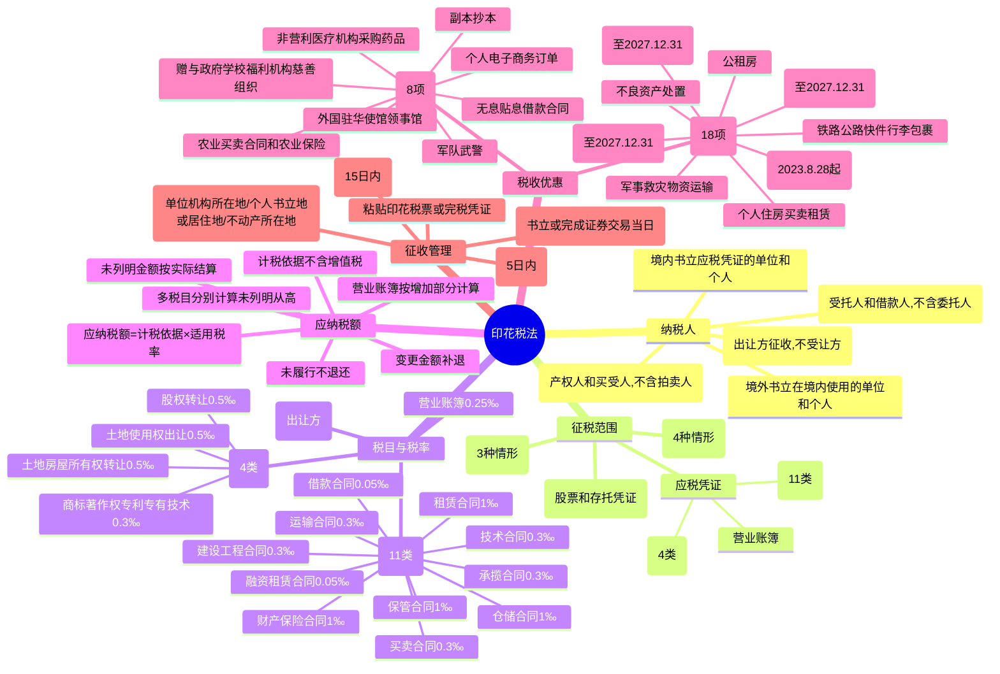

## 📍 章节定位

| 项目 | 信息 |
|------|------|
| **所属科目** | 💰 税法 |
| **难度等级** | ⭐⭐ |
| **历年分值** | 2-3分 |
| **建议学时** | 3-4h |

## 📝 考情分析

印花税法是 CPA 税法考试次重点章节，分值约 2-3 分，以客观题为主。现行《印花税法》自 2022 年 7 月 1 日起施行。考查重点集中于：印花税纳税人（书立应税凭证、进行证券交易的单位和个人，含委托贷款、拍卖成交确认书的特殊纳税人）、征税范围（应税凭证+证券交易，境外书立在境内使用的 4 种情形，不属于征收范围的 3 种情形）、税目税率（应税合同 11 类分 4 档：0.05‰/0.3‰/1‰、产权转移书据 4 类分 0.3‰/0.5‰、营业账簿 0.25‰、证券交易 1‰）、计税依据（不含列明的增值税税款，特殊规定 10 项）、应纳税额计算（多税目分别计算、未列明金额处理、变更金额补退）、税收优惠（法定免征 8 项、其他减免税 18 项、证券交易减半征收、小规模纳税人减半）、征收管理（按季/年/次计征 15 日内申报、证券交易按周解缴 5 日内）。复习时需重点掌握税目税率表和计税依据的特殊规定。

## 🧠 知识框架

## 📖 核心精讲

### 一、纳税人

在中华人民共和国境内书立应税凭证、进行证券交易的单位和个人，为印花税的纳税人。在中华人民共和国境外书立在境内使用的应税凭证的单位和个人，也应当缴纳印花税。

**特殊纳税人规定**：

| 情形 | 纳税人 |
|------|--------|
| 委托贷款方式书立的借款合同 | 受托人和借款人（**不包括委托人**） |
| 按买卖合同或产权转移书据税目缴纳的拍卖成交确认书 | 拍卖标的的产权人和买受人（**不包括拍卖人**） |
| 证券交易 | 对**出让方**征收，不对受让方征收 |

> 书立应税凭证的纳税人，为对应税凭证有直接权利义务关系的单位和个人。

### 二、征税范围

#### （一）基本范围

印花税征税范围包括**应税凭证**和**证券交易**。

| 类别 | 内容 |
|------|------|
| 应税凭证 | 《印花税法》所附税目税率表列明的合同、产权转移书据和营业账簿 |
| 证券交易 | 转让在依法设立的证券交易所、国务院批准的其他全国性证券交易场所交易的股票和以股票为基础的存托凭证 |

#### （二）境外书立在境内使用的应税凭证

| 标的类型 | 境内使用认定标准 |
|----------|------------------|
| 不动产 | 该不动产在境内 |
| 股权 | 该股权为中国居民企业的股权 |
| 动产或商标/著作权/专利权/专有技术使用权 | 销售方或购买方在境内（不含境外向境内销售完全在境外使用的动产或权利） |
| 服务 | 提供方或接受方在境内（不含境外向境内提供完全在境外发生的服务） |

#### （三）不属于印花税征收范围

1. 人民法院的生效法律文书、仲裁机构的仲裁文书、监察机关的监察文书；
2. 县级以上人民政府及其所属部门按照行政管理权限征收、收回或者补偿安置房地产书立的合同、协议或行政类文书；
3. 总公司与分公司、分公司与分公司之间书立的作为执行计划使用的凭证。

### 三、税目与税率

#### （一）印花税税目税率表

| 类别 | 税目 | 税率 | 说明 |
|------|------|------|------|
| **应税合同** | 借款合同 | **0.05‰** | 金融机构与借款人（不含同业拆借） |
| | 融资租赁合同 | **0.05‰** | 指书面合同 |
| | 买卖合同 | **0.3‰** | 动产买卖合同（不含个人书立的动产买卖合同） |
| | 承揽合同 | **0.3‰** | — |
| | 建设工程合同 | **0.3‰** | — |
| | 运输合同 | **0.3‰** | 货运合同和多式联运合同（不含管道运输） |
| | 技术合同 | **0.3‰** | 不含专利权、专有技术使用权转让书据 |
| | 租赁合同 | **1‰** | — |
| | 保管合同 | **1‰** | — |
| | 仓储合同 | **1‰** | — |
| | 财产保险合同 | **1‰** | 不含再保险合同 |
| **产权转移书据** | 土地使用权出让合同 | **0.5‰** | — |
| | 土地使用权、房屋等建筑物和构筑物所有权转让书据 | **0.5‰** | 不含土地承包经营权和土地经营权转移 |
| | 股权转让书据 | **0.5‰** | 不含应缴纳证券交易印花税的 |
| | 商标专用权、著作权、专利权、专有技术使用权转让书据 | **0.3‰** | — |
| **营业账簿** | 实收资本（股本）、资本公积合计金额 | **0.25‰** | — |
| **证券交易** | 成交金额 | **1‰** | 对出让方征收，不对受让方征收 |

> 自 2023 年 8 月 28 日起，证券交易印花税实施**减半征收**。

#### （二）税目适用的特殊规定

| 情形 | 适用税目 |
|------|----------|
| 企业间书立的订单、要货单等（未另立买卖合同） | 按"买卖合同"税目 |
| 发电厂与电网之间、电网与电网之间的购售电合同 | 按"买卖合同"税目 |
| 电网与用户之间的供用电合同 | **不征收**印花税 |
| 受托方提供原材料的加工定作合同（分别记载加工费和原材料金额） | 加工费按"承揽合同"、原材料按"买卖合同"分别计税 |
| 受托方提供原材料的加工定作合同（未分别记载） | 按全部金额依"承揽合同"计税 |
| 融资租赁合同（含融资性售后回租） | 统一按"借款合同"缴纳 |
| 出版单位与发行单位的图书报刊征订凭证 | 按"买卖合同"缴纳 |

### 四、应纳税额的计算

#### （一）基本计算公式

$$\text{应纳税额}=\text{计税依据}\times\text{适用税率}$$

#### （二）计税依据的基本规定

| 应税凭证类型 | 计税依据 |
|--------------|----------|
| 应税合同 | 合同所列金额（**不包括列明的增值税税款**） |
| 应税产权转移书据 | 产权转移书据所列金额（**不包括列明的增值税税款**） |
| 应税营业账簿 | 账簿记载的实收资本（股本）、资本公积合计金额 |
| 证券交易 | 成交金额 |

#### （三）计税依据的特殊规定

| 序号 | 特殊情形 | 处理 |
|------|----------|------|
| 1 | 应税合同、产权转移书据未列明金额 | 按实际结算金额确定；仍不能确定的按市场价格；应执行政府定价的按国家规定 |
| 2 | 证券交易无转让价格 | 按前一个交易日收盘价；无收盘价的按证券面值 |
| 3 | 同一凭证两方以上当事人未列明各自金额 | 按平均分摊金额确定 |
| 4 | 所列金额与实际结算金额不一致 | 变更凭证所列金额的以变更后金额为准；增加部分补缴，减少部分可申请退还或抵缴 |
| 5 | 增值税税款计算错误导致计税依据变化 | 调整增值税后重新确定计税依据，增加补缴减少退还 |
| 6 | 转让股权 | 按产权转移书据所列金额（不含认缴后尚未实际出资权益部分） |
| 7 | 外币计价 | 按书立当日人民币汇率中间价折合 |
| 8 | 多式联运 | 起运地统一结算的以全程运费为计税依据；分程结算的以分程运费为计税依据 |
| 9 | 未履行的应税合同、产权转移书据 | 已缴纳的印花税**不予退还及抵缴** |
| 10 | 多贴的印花税票 | **不予退税及抵缴** |

#### （四）多税目和多方当事人的处理

- 同一应税凭证载有两个以上税目事项并**分别列明金额**的，按照各自适用税目税率分别计算；**未分别列明金额**的，**从高适用税率**；
- 同一应税凭证由两方以上当事人书立的，按照各自涉及的金额分别计算应纳税额；
- 已缴纳印花税的营业账簿，以后年度实收资本（股本）、资本公积合计金额**增加的**，按照**增加部分**计算应纳税额。

### 五、税收优惠

#### （一）法定免征（8 项）

| 序号 | 免征凭证 |
|------|----------|
| 1 | 应税凭证的副本或者抄本 |
| 2 | 外国驻华使馆、领事馆和国际组织驻华代表机构为获得馆舍书立的应税凭证 |
| 3 | 中国人民解放军、中国人民武装警察部队书立的应税凭证 |
| 4 | 农民、家庭农场、农民专业合作社、农村集体经济组织、村民委员会购买农业生产资料或销售农产品书立的买卖合同和农业保险合同 |
| 5 | 无息或贴息借款合同、国际金融组织向中国提供优惠贷款书立的借款合同 |
| 6 | 财产所有权人将财产赠与政府、学校、社会福利机构、慈善组织书立的产权转移书据 |
| 7 | 非营利性医疗卫生机构采购药品或卫生材料书立的买卖合同 |
| 8 | 个人与电子商务经营者订立的电子订单 |

#### （二）其他减免税、不征税情形（主要项目）

| 序号 | 减免项目 |
|------|----------|
| 1 | 铁路、公路、航运、水路承运快件行李、包裹的托运单据（暂免） |
| 2 | 各类发行单位之间、发行单位与订阅单位或个人之间的征订凭证（暂免） |
| 3 | 军事物资运输的运费结算凭证（免税） |
| 4 | 抢险救灾物资运输的运费结算凭证（免税） |
| 5 | 资产公司收购、承接、处置不良资产的购销合同和产权转移书据（免征） |
| 6 | 股权分置改革中非流通股股东向流通股股东支付对价的股权转让（暂免） |
| 7 | 经济适用住房相关的印花税（免征） |
| 8 | 个人出租、承租住房签订的租赁合同（免征）；个人销售或购买住房（暂免） |
| 9 | 改造安置住房相关的印花税（免征） |
| 10 | 高校学生公寓租赁合同（免征） |
| 11 | 公租房建设管理涉及的印花税（免征） |
| 12 | 企业改制重组及事业单位改制过程中有关印花税优惠（至 2027.12.31） |
| 13 | 上市公司国有股权无偿转让（经国务院/省级政府批准的暂不征收） |
| 14 | 电网与用户之间的供用电合同（不征收） |
| 15 | 融资性售后回租业务中出售及购回租赁资产签订的合同（不征收） |
| 16 | 证券交易印花税减半征收（自 2023.8.28 起） |
| 17 | 增值税小规模纳税人、小型微利企业和个体工商户减半征收印花税（不含证券交易印花税，2023.1.1-2027.12.31） |
| 18 | 自贸区企业离岸转手买卖业务书立的买卖合同（免征，2025.4.1-2027.12.31） |

### 六、征收管理

#### （一）申报地点

| 纳税人类型 | 申报地点 |
|------------|----------|
| 单位 | 机构所在地的主管税务机关 |
| 个人 | 应税凭证书立地或者纳税人居住地的主管税务机关 |
| 不动产产权转移 | 不动产所在地的主管税务机关 |
| 境外单位或个人（有境内代理人） | 以境内代理人为扣缴义务人，向代理人机构所在地申报 |
| 境外单位或个人（无境内代理人） | 向资产交付地、境内服务提供方/接受方所在地、书立应税凭证境内书立人所在地申报；涉不动产的向不动产所在地 |
| 证券交易 | 证券登记结算机构为扣缴义务人，向其机构所在地申报 |

#### （二）纳税义务发生时间

- 印花税纳税义务发生时间为纳税人**书立应税凭证或者完成证券交易的当日**；
- 证券交易印花税扣缴义务发生时间为证券交易完成的当日。

#### （三）纳税期限

| 计征方式 | 申报期限 |
|----------|----------|
| 按季、按年计征 | 自季度、年度终了之日起 **15 日内** |
| 按次计征 | 自纳税义务发生之日起 **15 日内** |
| 证券交易印花税 | 按周解缴，自每周终了之日起 **5 日内** |

> 应税合同、产权转移书据印花税可以按季或按次申报缴纳；应税营业账簿印花税可以按年或按次申报缴纳。

#### （四）缴纳方式

印花税可以采用**粘贴印花税票**或者由税务机关依法开具**其他完税凭证**的方式缴纳。粘贴印花税票的，由纳税人在每枚税票的骑缝处盖戳注销或者画销。

## 💡 典型例题

### 例题 1：印花税综合计算

某企业某年 12 月开业，当年发生以下业务：与其他企业订立专有技术使用权转让书据 1 份，所载不含增值税金额 100 万元；订立产品购销合同 1 份，所载不含增值税金额 200 万元；与银行订立借款合同 1 份，所载不含增值税金额 400 万元。计算该企业应缴纳的印花税。

**解答**：

1. 产权转移书据（专有技术使用权转让，0.3‰）：
   
   应纳税额 = 1,000,000 × 0.3‰ = **300（元）**

2. 买卖合同（0.3‰）：
   
   应纳税额 = 2,000,000 × 0.3‰ = **600（元）**

3. 借款合同（0.05‰）：
   
   应纳税额 = 4,000,000 × 0.05‰ = **200（元）**

应纳印花税合计 = 300 + 600 + 200 = **1,100（元）**

### 例题 2：受托方提供原材料的加工合同

某企业与加工厂签订加工合同，合同记载加工费 50 万元，原材料 200 万元（分别记载）。计算该合同应缴纳的印花税。

**解答**：

受托方提供原材料的加工合同，凡分别记载加工费与原材料金额的，分别按"承揽合同"和"买卖合同"计税：

1. 加工费按承揽合同（0.3‰）：500,000 × 0.3‰ = **150（元）**
2. 原材料按买卖合同（0.3‰）：2,000,000 × 0.3‰ = **600（元）**

应纳印花税合计 = 150 + 600 = **750（元）**

> 若合同未分别记载，则按全部金额 250 万元依承揽合同 0.3‰ 计税：2,500,000 × 0.3‰ = 750（元）。

### 例题 3：营业账簿印花税

某企业 2026 年开业，当年实收资本 1,000 万元，资本公积 200 万元。2027 年实收资本增至 1,500 万元，资本公积增至 300 万元。计算该企业 2026 年和 2027 年应纳营业账簿印花税。

**解答**：

1. 2026 年（首次缴纳）：
   
   应纳税额 =（1,000 + 200）× 0.25‰ = 1,200 × 0.25‰ = **3,000（元）**

2. 2027 年（按增加部分缴纳）：
   
   增加金额 =（1,500 + 300）-（1,000 + 200）= 1,800 - 1,200 = 600（万元）
   
   应纳税额 = 600 × 0.25‰ = **1,500（元）**

### 例题 4：多税目凭证从高适用

某合同同时记载租赁事项（租金 100 万元）和保管事项（保管费 50 万元），但未分别列明金额，总金额 150 万元。计算该合同应纳印花税。

**解答**：

同一凭证载有两个以上税目事项未分别列明金额的，从高适用税率。租赁合同和保管合同税率均为 1‰，故从高适用 1‰：

$$\text{应纳税额}=1{,}500{,}000\times 1‰=1{,}500\text{（元）}$$

### 例题 5：股权转让印花税

某企业将其持有的居民企业股权转让，转让价款 5,000 万元（不含增值税），其中含认缴后尚未实际出资权益部分 500 万元。计算应纳印花税。

**解答**：

转让股权的计税依据按产权转移书据所列金额（不含认缴后尚未实际出资权益部分）确定：

计税依据 = 5,000 - 500 = 4,500（万元）

$$\text{应纳税额}=45{,}000{,}000\times 0.5‰=22{,}500\text{（元）}$$

### 例题 6：证券交易印花税

某投资者 2026 年 3 月卖出股票，成交金额 200 万元。计算应纳证券交易印花税。

**解答**：

自 2023 年 8 月 28 日起证券交易印花税减半征收，税率为 1‰ 减半即 0.5‰，对出让方征收：

$$\text{应纳税额}=2{,}000{,}000\times 1‰\times 50\%=1{,}000\text{（元）}$$

## 🎯 记忆口诀

**印花税纳税人**：
> 书立凭证证券交易，直接权利义务人；委托贷款受托借款人，拍卖标的产权买受人；证券交易出让方征，受让方不征。

**应税合同税率（4 档）**：
> 万分之零点五：借款融资租赁两合同；
> 万分之三：买卖承揽建设运输技术六合同；
> 千分之一：租赁保管仓储财保四合同；
> 合同十一归四档，零五三六和一四。

**产权转移书据税率**：
> 土地出让土地房屋股权五，商标著作权专利专有技术三。

**营业账簿与证券交易**：
> 账簿实收加资本公积，万分之二点五来征；证券交易千分之一，出让方征减半收。

**计税依据核心**：
> 计税依据不含增值税，未列金额按实结；多税目分列分别算，未分列从高适用；未履行不退不抵缴，多贴税票也不退。

**税收优惠**：
> 副本抄本使馆军队，农业买卖和保险；无息贴息借款合同，赠与政府学校慈善；个人住房买卖租赁，公租房高校公寓；证券交易减半征，小规模纳税人减半。

**征收管理**：
> 书立当日生义务，按季按年按次缴；十五日内要申报，证券交易按周解；五日内申报解缴，粘贴税票骑缝销。

## ✅ 同步练习

### 一、单选题

1. 下列合同中，适用 0.05‰ 税率征收印花税的是（ ）。
   A. 买卖合同
   B. 借款合同
   C. 租赁合同
   D. 技术合同

2. 下列各项中，不属于印花税征税范围的是（ ）。
   A. 买卖合同
   B. 产权转移书据
   C. 电网与用户之间的供用电合同
   D. 营业账簿

3. 下列关于印花税计税依据的说法，正确的是（ ）。
   A. 应税合同的计税依据包括列明的增值税税款
   B. 应税营业账簿的计税依据为账簿记载的实收资本和资本公积合计金额
   C. 未履行的应税合同已缴纳的印花税可以退还
   D. 多贴的印花税票可以申请退税

4. 证券交易印花税的纳税人是（ ）。
   A. 出让方和受让方
   B. 仅出让方
   C. 仅受让方
   D. 证券公司

5. 某企业订立买卖合同，所载不含增值税金额 500 万元，印花税税率为 0.3‰，应纳印花税（ ）。
   A. 1,500 元
   B. 1,000 元
   C. 2,000 元
   D. 500 元

6. 营业账簿印花税的税率为（ ）。
   A. 0.05‰
   B. 0.25‰
   C. 0.3‰
   D. 1‰

7. 印花税的纳税义务发生时间为（ ）。
   A. 合同签订之次日
   B. 书立应税凭证或者完成证券交易的当日
   C. 合同履行完毕之日
   D. 实际付款之日

### 二、多选题

1. 下列合同中，适用 0.3‰ 税率征收印花税的有（ ）。
   A. 买卖合同
   B. 承揽合同
   C. 建设工程合同
   D. 运输合同
   E. 技术合同

2. 下列关于印花税纳税人的说法，正确的有（ ）。
   A. 在境内书立应税凭证的单位和个人为纳税人
   B. 委托贷款方式书立的借款合同纳税人为受托人和借款人
   C. 拍卖成交确认书的纳税人为拍卖标的的产权人和买受人
   D. 证券交易印花税对出让方征收
   E. 证券交易印花税对受让方征收

3. 下列凭证中，免征印花税的有（ ）。
   A. 应税凭证的副本或者抄本
   B. 无息或贴息借款合同
   C. 农民购买农业生产资料书立的买卖合同
   D. 个人与电子商务经营者订立的电子订单
   E. 非营利性医疗卫生机构采购药品书立的买卖合同

4. 下列关于印花税计税依据的说法，正确的有（ ）。
   A. 应税合同的计税依据为合同所列金额，不包括列明的增值税税款
   B. 同一凭证载有两个以上税目事项未分别列明金额的，从高适用税率
   C. 已缴纳印花税的营业账簿，以后年度增加部分应当缴纳印花税
   D. 未履行的应税合同已缴纳的印花税不予退还
   E. 多贴的印花税票可以申请退税

5. 下列关于印花税征收管理的说法，正确的有（ ）。
   A. 纳税人为单位的，应当向其机构所在地的主管税务机关申报缴纳
   B. 不动产产权发生转移的，应当向不动产所在地的主管税务机关申报缴纳
   C. 印花税可以按季、按年或者按次计征
   D. 实行按季计征的，纳税人应当自季度终了之日起 15 日内申报缴纳税款
   E. 证券交易印花税按周解缴，扣缴义务人应当自每周终了之日起 5 日内申报解缴

### 三、计算题

1. 某企业 2026 年发生以下业务：
   - 与银行签订借款合同，所载不含增值税金额 1,000 万元；
   - 订立产品买卖合同，所载不含增值税金额 500 万元；
   - 订立租赁合同，所载租金 200 万元；
   - 订立财产保险合同，所载保险费 80 万元；
   - 实收资本 2,000 万元，资本公积 500 万元（首次启用营业账簿）。
   
   计算该企业 2026 年应纳印花税合计。

2. 某企业将其持有的居民企业股权转让，转让价款 3,000 万元（不含增值税），其中含认缴后尚未实际出资权益部分 300 万元。同时该企业还订立了一份土地使用权出让合同，所载不含增值税金额 800 万元。计算该企业应纳印花税合计。

### 参考答案

**一、单选题**：1.B  2.C  3.B  4.B  5.A  6.B  7.B

**二、多选题**：1.ABCDE  2.ABCD（E 错误，证券交易印花税不对受让方征收）  3.ABCDE  4.ABCD（E 错误，多贴的印花税票不予退税及抵缴）  5.ABCDE

**三、计算题**：

1. ① 借款合同（0.05‰）：10,000,000 × 0.05‰ = **500（元）**
   
   ② 买卖合同（0.3‰）：5,000,000 × 0.3‰ = **1,500（元）**
   
   ③ 租赁合同（1‰）：2,000,000 × 1‰ = **2,000（元）**
   
   ④ 财产保险合同（1‰）：800,000 × 1‰ = **800（元）**
   
   ⑤ 营业账簿（0.25‰）：（20,000,000 + 5,000,000）× 0.25‰ = 25,000,000 × 0.25‰ = **6,250（元）**
   
   应纳印花税合计 = 500 + 1,500 + 2,000 + 800 + 6,250 = **11,050（元）**

2. ① 股权转让书据（0.5‰）：
   
   计税依据 = 3,000 - 300 = 2,700（万元）
   
   应纳税额 = 27,000,000 × 0.5‰ = **13,500（元）**
   
   ② 土地使用权出让合同（0.5‰）：
   
   应纳税额 = 8,000,000 × 0.5‰ = **4,000（元）**
   
   应纳印花税合计 = 13,500 + 4,000 = **17,500（元）**

  
🌱

  
本章节为印花税专题，"税目税率表（11 类合同+4 类产权转移书据+营业账簿+证券交易）"和"计税依据不含增值税"是两大核心考点。

