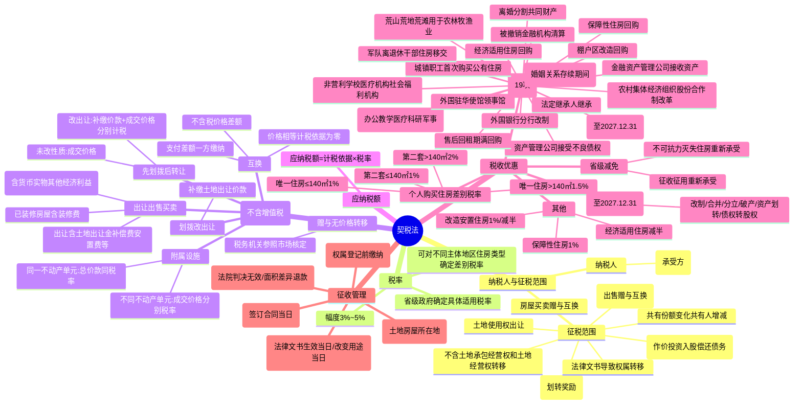

## 1. 章节定位

| 项目 | 信息 |
|------|------|
| 所属科目 | 税法 |
| 难度等级 | 2 |
| 历年分值 | 3-4分 |
| 建议学时 | 3-4h |
| 章节性质 | 财产交易税专题 |
| 法律依据 | 《契税法》（2021.9.1施行）、《土地增值税暂行条例》（1994.1.1施行） |

## 2. 考情分析

本章包括契税法和土地增值税法两部分。契税法是 CPA 税法考试次重点章节，分值约 1-2 分，以客观题形式考查。现行《契税法》自 2021 年 9 月 1 日起施行。考查重点集中于：契税纳税人（承受土地、房屋权属的单位和个人，注意是"承受方"）、征税范围（土地使用权出让、土地使用权转让、房屋买卖/赠与/互换，视同买卖和视同赠与情形）、税率（3%-5% 幅度，由省级政府确定）、计税依据（不含增值税，出让/出售/买卖按成交价格，赠与按核定价格，互换按差额）、应纳税额计算、税收优惠（法定免征 19 项、个人购买住房差别税率 1%/1.5%/2%、企业改制重组免征）、征收管理（纳税义务发生时间为签订合同当日、权属登记前缴纳、土地房屋所在地缴纳）。

土地增值税是 CPA 税法考试重点章节，分值约 2-3 分，主观题常考。考查重点集中于：土地增值税纳税人（转让房地产并取得收入的单位和个人）、征税范围（转让国有土地使用权及地上建筑物、存量房地产买卖、继承不征）、计税依据（增值额 = 转让收入 - 扣除项目）、四级超率累进税率（30%/40%/50%/60%，速算扣除系数 0/5%/15%/35%）、扣除项目（取得土地使用权所支付的金额、房地产开发成本、房地产开发费用、与转让房地产有关的税金、其他扣除项目）、房地产开发企业加计扣除 20%、清算条件与清算时点。复习时需重点掌握土地增值税的计算流程和扣除项目。

## 3. 知识框架

## 4. 核心精讲

### 一、纳税人和征税范围

#### （一）纳税人

契税的纳税人是中华人民共和国境内转移土地、房屋权属，**承受**的单位和个人。土地、房屋权属是指土地使用权和房屋所有权。

> 核心特征：契税由**承受方**缴纳，而非转让方。

#### （二）征税范围

征收契税的土地、房屋权属具体为土地使用权和房屋所有权。转移土地、房屋权属的行为包括：

| 类别 | 具体行为 |
|------|----------|
| 土地使用权出让 | 国家以土地所有者身份将土地使用权在一定年限内让与土地使用者，由土地使用者向国家支付土地使用权出让金 |
| 土地使用权转让 | 土地使用者将土地使用权再转移，包括出售、交换和赠与（不包括土地承包经营权和土地经营权的转移） |
| 房屋买卖 | 房屋所有者将房屋出售，由承受者交付货币、实物、无形资产或其他经济利益 |
| 房屋赠与 | 房屋所有者将房屋无偿转让给他人；以获奖方式取得房屋产权也视同接受赠与 |
| 房屋互换 | 房屋所有者之间互相交换房屋 |

**视同买卖房屋的情形**：

| 情形 | 参照 |
|------|------|
| 以作价投资（入股）、偿还债务等应交付经济利益的方式转移土地、房屋权属 | 参照土地使用权出让、出售或房屋买卖确定 |
| 以划转、奖励等没有价格的方式转移土地、房屋权属 | 参照土地使用权或房屋赠与确定 |

**其他应税情形**：

1. 因共有不动产份额变化的；
2. 因共有人增加或者减少的；
3. 因人民法院、仲裁委员会的生效法律文书或者监察机关出具的监察文书等发生土地、房屋权属转移的。

### 二、税率、计税依据和应纳税额

#### （一）税率

契税税率幅度为 **3%~5%**。具体适用税率由各省、自治区、直辖市人民政府在 3%~5% 幅度内提出，报同级人民代表大会常务委员会决定，并报全国人民代表大会常务委员会和国务院备案。

省级政府可对不同主体、不同地区、不同类型的住房权属转移确定**差别税率**。

#### （二）计税依据

契税计税依据**不包括增值税**。

| 转移方式 | 计税依据 |
|----------|----------|
| 土地使用权出让、出售，房屋买卖 | 成交价格（含应交付的货币、实物、其他经济利益对应的价款） |
| 土地使用权赠与、房屋赠与及其他无价格转移 | 税务机关参照市场价格依法核定的价格 |
| 土地使用权互换、房屋互换 | 不含增值税价格的差额（价格相等的计税依据为零，由支付差额的一方缴纳） |
| 划拨方式取得后改为出让 | 补缴的土地出让价款 |
| 先划拨后转让（改出让） | 补缴土地出让价款 + 房地产权属转移合同成交价格（分别计税） |
| 先划拨后转让（未改性质） | 房地产权属转移合同成交价格 |
| 土地使用权及所附建筑物转让 | 承受方应交付的总价款 |

**土地使用权出让计税依据的组成**：

包括土地出让金、土地补偿费、安置补助费、地上附着物和青苗补偿费、征收补偿费、城市基础设施配套费、实物配建房屋等应交付的货币以及实物、其他经济利益对应的价款。

**房屋附属设施的计税依据**：

| 情形 | 计税依据 | 税率 |
|------|----------|------|
| 附属设施与房屋为同一不动产单元 | 承受方应交付的总价款 | 与房屋相同税率 |
| 附属设施与房屋为不同不动产单元 | 转移合同确定的成交价格 | 当地适用税率 |

> 承受已装修房屋的，应将包括装修费用在内的费用计入承受方应交付的总价款。

> 纳税人申报的成交价格、互换价格差额明显偏低且无正当理由的，由税务机关依照《税收征收管理法》核定。

#### （三）应纳税额计算

$$\text{应纳税额}=\text{计税依据}\times\text{税率}$$

### 三、税收优惠

#### （一）法定免征（19 项）

| 序号 | 免征项目 |
|------|----------|
| 1 | 国家机关、事业单位、社会团体、军事单位承受土地、房屋权属用于办公、教学、医疗、科研和军事设施 |
| 2 | 非营利性的学校、医疗机构、社会福利机构承受土地、房屋权属用于办公、教学、医疗、科研、养老、救助 |
| 3 | 承受荒山、荒地、荒滩土地使用权用于农、林、牧、渔业生产 |
| 4 | 婚姻关系存续期间夫妻之间变更土地、房屋权属 |
| 5 | 夫妻因离婚分割共同财产发生土地、房屋权属变更 |
| 6 | 法定继承人通过继承承受土地、房屋权属 |
| 7 | 外国驻华使馆、领事馆和国际组织驻华代表机构承受土地、房屋权属 |
| 8 | 城镇职工按规定第一次购买公有住房 |
| 9 | 外国银行分行改制为外商独资银行承受原外国银行分行的房屋权属 |
| 10 | 军队离退休干部住房及附属用房移交地方政府管理 |
| 11 | 资产管理公司接受相关国有银行的不良债权，借款方以土地使用权、房屋所有权抵充贷款本息 |
| 12 | 金融资产管理公司接收国有商业银行资产作为资本金 |
| 13 | 被撤销金融机构清算过程中催收债权时接收债务方土地使用权、房屋所有权 |
| 14 | 经济适用住房经营管理单位回购经济适用住房继续作为房源 |
| 15 | 保障性住房经营管理单位回购保障性住房继续作为房源 |
| 16 | 售后回租合同期满，承租人回购原房屋、土地权属 |
| 17 | 棚户区改造中经营管理单位回购改造安置住房继续作为房源 |
| 18 | 农村集体经济组织股份合作制改革后承受原集体经济组织土地、房屋权属 |
| 19 | 农村饮水安全工程建设运营单位为建设饮水工程承受土地使用权（至 2027.12.31） |

#### （二）个人购买住房差别税率

| 情形 | 面积 | 适用税率 |
|------|------|----------|
| 家庭唯一住房 | ≤140 平方米 | 1% |
| 家庭唯一住房 | >140 平方米 | 1.5% |
| 家庭第二套住房 | ≤140 平方米 | 1% |
| 家庭第二套住房 | >140 平方米 | 2% |

> 家庭成员范围包括购房人、配偶以及未成年子女。家庭第二套住房是指已拥有一套住房的家庭购买的第二套住房。

#### （三）企业改制重组优惠（至 2027.12.31）

| 情形 | 优惠 |
|------|------|
| 企业改制（投资主体存续且持股超 75%） | 免征 |
| 事业单位改制（投资主体存续且出资比例超 50%） | 免征 |
| 公司合并（原投资主体存续） | 免征 |
| 公司分立（投资主体相同） | 免征 |
| 企业破产（债权人承受） | 免征 |
| 企业破产（非债权人承受，与全部职工签 3 年以上劳动合同） | 免征 |
| 企业破产（非债权人承受，与超 30% 职工签 3 年以上劳动合同） | 减半 |
| 资产划转（行政性调整/同一投资主体内部） | 免征 |
| 债权转股权（经国务院批准） | 免征 |
| 公司股权转让（土地房屋权属不发生转移） | 不征收 |

#### （四）省级减免

省级政府可以决定对下列情形免征或减征契税：

1. 因土地、房屋被县级以上人民政府征收、征用，重新承受土地、房屋权属；
2. 因不可抗力灭失住房，重新承受住房权属。

#### （五）其他优惠

| 情形 | 优惠 |
|------|------|
| 个人购买经济适用住房 | 减半征收 |
| 个人购买保障性住房 | 减按 1% |
| 个人首次购买 90 ㎡以下改造安置住房 | 按 1% |
| 个人购买超 90 ㎡但符合普通住房标准的改造安置住房 | 减半征收 |

### 四、征收管理

#### （一）纳税义务发生时间

契税申报以**不动产单元**为基本单位。

| 情形 | 纳税义务发生时间 |
|------|------------------|
| 一般情形 | 签订土地、房屋权属转移合同的当日，或取得其他具有土地、房屋权属转移合同性质凭证的当日 |
| 因法律文书或监察文书发生权属转移 | 法律文书等生效当日 |
| 因改变土地、房屋用途应当补缴已减征、免征契税 | 改变有关土地、房屋用途等情形的当日 |
| 因改变土地性质、容积率等需补缴土地出让价款 | 改变土地使用条件当日 |

> 不再需要办理土地、房屋权属登记的，纳税人应自纳税义务发生之日起 **90 日内**申报缴纳。

#### （二）纳税期限

纳税人应当在依法办理土地、房屋权属登记手续**前**申报缴纳契税。

#### （三）纳税地点

契税由土地、房屋所在地的税务机关征收管理。

#### （四）退税规定

纳税人缴纳契税后发生下列情形，可申请退税：

| 情形 | 条件 |
|------|------|
| 法院判决或仲裁裁决导致权属转移无效、被撤销或被解除 | 且土地、房屋权属变更至原权利人 |
| 出让土地使用权交付时 | 因容积率调整或实际交付面积小于合同约定面积需退还土地出让价款 |
| 新建商品房交付时 | 因实际交付面积小于合同约定面积需返还房价款 |

> 不动产登记机构在办理土地、房屋权属登记时，应当依法查验契税完税、减免税、不征税等涉税凭证或者有关信息。

## 5. 典型例题

### 例题 1：房屋买卖契税计算

某一般纳税人 A 公司销售其自建的房屋，含税价为 328 万元，适用一般计税方法。2024 年 1 月，A 公司向纳税人 B 开具第 1 张增值税发票，注明增值税额 9 万元、不含税价格 100 万元；2025 年 9 月，A 公司向 B 开具第 2 张发票，注明增值税额 18 万元、不含税价格 200 万元。计算 B 应缴纳的契税（假定税率为 4%）。

**解答**：

契税计税依据为不含增值税的成交价格：

$$\text{应纳税额}=(100+200)\times 4\%=12\text{（万元）}$$

### 例题 2：房屋互换契税计算

甲与乙互换房屋，甲房屋价值 300 万元，乙房屋价值 500 万元，由甲向乙支付差额 200 万元。当地契税税率 3%。计算甲、乙应纳契税。

**解答**：

房屋互换以差额为计税依据，由支付差额的一方缴纳：

- 甲（支付差额方）：应纳税额 =（500 - 300）× 3% = 200 × 3% = **6（万元）**
- 乙（收取差额方）：**不缴纳**契税

### 例题 3：个人购买唯一住房

某个人购买家庭唯一住房，成交价格 400 万元（不含增值税），面积 120 平方米。计算应纳契税。

**解答**：

家庭唯一住房，面积 120 ㎡（≤140 ㎡），适用 1% 税率：

$$\text{应纳税额}=400\times 1\%=4\text{（万元）}$$

### 例题 4：个人购买第二套住房

某个人购买家庭第二套住房，成交价格 600 万元（不含增值税），面积 160 平方米。计算应纳契税。

**解答**：

家庭第二套住房，面积 160 ㎡（>140 ㎡），适用 2% 税率：

$$\text{应纳税额}=600\times 2\%=12\text{（万元）}$$

### 例题 5：土地使用权出让契税

某企业通过出让方式取得一块土地使用权，支付土地出让金 2,000 万元，土地补偿费 300 万元，安置补助费 200 万元，城市基础设施配套费 100 万元（均不含增值税）。当地契税税率 4%。计算该企业应纳契税。

**解答**：

土地使用权出让的计税依据包括土地出让金、土地补偿费、安置补助费、城市基础设施配套费等：

$$\text{计税依据}=2{,}000+300+200+100=2{,}600\text{（万元）}$$

$$\text{应纳税额}=2{,}600\times 4\%=104\text{（万元）}$$

### 例题 6：赠与房屋契税计算

张某将房屋无偿赠与李某，该房屋市场价格为 500 万元（不含增值税），当地契税税率 3%。计算李某应纳契税。

**解答**：

房屋赠与由承受方（李某）缴纳，计税依据为税务机关参照市场价格核定的价格：

$$\text{应纳税额}=500\times 3\%=15\text{（万元）}$$

### 例题 7：法定继承免征

张某去世后，其子张小某通过法定继承承受张某的房屋，房屋市场价值 800 万元。计算张小某应纳契税。

**解答**：

法定继承人通过继承承受土地、房屋权属，**免征**契税。

$$\text{应纳税额}=0\text{（元）}$$

## 6. 记忆口诀

### 口诀 1：契税纳税人
> 转移权属承受方，谁承受来谁纳税；出让转让和买卖，赠与互换都要征。

### 口诀 2：契税征税范围
> 土地出让和转让，房屋买卖赠互换；作价投资还债务，视同买卖来征收；划转奖励无价格，视同赠与来处理。

### 口诀 3：契税税率
> 三到五的幅度率，省级政府来确定；个人住房有优惠，唯一二套看面积。

### 口诀 4：契税计税依据
> 计税依据不含税，出让出售按成交；赠与无价按核定，互换按差来计算；价格相等零计税，差额支付方来缴。

### 口诀 5：个人住房差别税率
> 唯一住房一或一点五，一百四十是分界；二套住房一或二，面积大小定税率。

### 口诀 6：契税税收优惠
> 机关学校医疗军，荒山荒地农林牧；夫妻变更离婚分，法定继承都免征；首次公房外国行，改制重组至二七。

### 口诀 7：契税征收管理
> 签订合同当日起，权属登记前要缴；土地房屋所在地，九十日内要申报。

### 口诀 8：土地增值税纳税人
> 转让房地产取收入，单位和个人都纳税；不论经济性质如何，只要有偿转让就征。

### 口诀 9：土地增值税四级超率累进
> 增值额未超五十按三十，超五十到一百按四十；超一百到二百按五十，超二百以上按六十；速算扣除零五十五三十五。

### 口诀 10：土地增值税扣除项目
> 取得土地所付金额，房地产开发成本；开发费用相关税金，其他扣除加计二成；房开企业可加扣，百分之二十要记清。

### 口诀 11：土地增值税计算流程
> 收入减去扣除项，得到增值额；增值额除以扣除项，得到增值率；增值率定税率速扣，增值额乘税率减速扣；应纳税额就出来。

### 口诀 12：土地增值税清算
> 竣工验收转让完毕，销售完成八十五；直接转让土地使用权，都可申请清算；未清算税务机关要求，九十日内要清算。

  
契税土地增值税

  
本章节为契税与土地增值税专题，"承受方纳税"和"四级超率累进税率"是两大核心考点。

## 7. 同步练习

**1.（单选题）** 下列行为中，不需要缴纳契税的是（　）。

A. 等价互换的房屋
B. 接受投资入股的房产
C. 以获奖方式取得的房屋
D. 受赠的房屋

**2.（单选题）** 关于契税的计税依据，下列说法正确的是（　）。

A. 以划拨方式取得的土地使用权，经批准改为出让方式重新取得该土地使用权的，土地使用权人应以补缴的土地出让价款为计税依据
B. 土地使用权互换的，以互换的土地使用权的价格作为计税依据
C. 承受已装修房屋的，装修费用不包括在承受方契税的计税依据之中
D. 先以划拨方式取得土地使用权，后经批准转让房地产，划拨土地性质改为出让的，承受方应以房地产权属转移合同确定的成交价格为计税依据

**3.（单选题）** 居民甲将一套不含税价值100万元的一室居住房与居民乙互换为一套两室居住房，并补给居民乙50万元的换房补偿款，当地契税税率是 $4\%$，甲应缴纳的契税为（　）万元。

A. 0
B. 4
C. 2
D. 6

**4.（单选题）** （2024年）甲企业为增值税一般纳税人，2018年购入一座含增值税市场价格为327万元的仓库，2024年将该仓库与乙公司的一栋办公楼进行互换，并支付含增值税109万元的差价。当地契税税率为 $4\%$，则甲应缴纳的契税为（　）万元。

A. 17.44
B. 36
C. 4.36
D. 4

**5.（单选题）** （2024年）某居民个人2024年购买保障性住房一套，购房发票上注明不含增值税价款50万元，则个人应缴纳契税为（　）万元。

A. 0.5
B. 1
C. 0.25
D. 0.75

**6.（单选题）** （2023年）下列土地和房屋变更产权，不需要缴纳契税的是（　）。

A. 购买140平方米以下家庭唯一住房
B. 子女接受父母赠与的房产
C. 荒滩用于建设风力发电厂
D. 夫妻离婚共同财产分割变更房屋产权

**7.（单选题）** 下列房产转让的情形中，产权承受方免于缴纳契税的是（　）。

A. 以获奖方式承受土地、房屋权属
B. 将房产赠与非法定继承人
C. 保障性住房经营管理单位回购保障性住房继续作为保障性住房房源
D. 因共有不动产份额变化的

**8.（多选题）** （2021年）下列获得房屋产权的行为中，需要缴纳契税的有（　）。

A. 等价交换房屋
B. 中奖取得房产
C. 购买商铺
D. 取得抵债房屋

---

**练习答案**：

1.A（等价互换的房屋，免征契税）　2.A（选项B，土地使用权互换、房屋互换，契税计税依据为不含增值税价格的差额；选项C，承受已装修房屋的，应将包括装修费用在内的费用计入承受方应付的总价款中；选项D，承受方应分别以补缴的土地出让价款和房地产权属转移合同确定的成交价格为计税依据缴纳契税）　3.C（土地使用权互换、房屋互换，互换价格不相等的，以差额为计税依据，由支付差额的一方缴纳契税：应缴契税 $=50\times4\%=2$ 万元）　4.D（房屋互换以含税差价109万元换算为不含税价计税：应缴契税 $=109\div(1+9\%)\times4\%=4$ 万元）　5.A（个人购买保障性住房减按 $1\%$ 的税率征收契税：应缴契税 $=50\times1\%=0.5$ 万元）　6.D（选项A，购买140平方米以下家庭唯一住房减按 $1\%$ 缴纳契税；选项B，房产赠与需要缴纳契税；选项C，承受荒山、荒地、荒滩土地使用权用于农、林、牧、渔业生产免征契税，但建设风力发电厂需按规定缴纳；夫妻离婚共同财产分割变更房屋产权，不需要缴纳契税）　7.C（保障性住房经营管理单位回购保障性住房继续作为保障性住房房源的，免征契税）　8.BCD（土地使用权互换、房屋互换，互换价格相等的，不需要缴纳契税；以获奖方式取得房屋产权，实质上是接受赠与房产的行为，应缴纳契税；购买商铺、取得抵债房屋，承受方需按规定缴纳契税）
