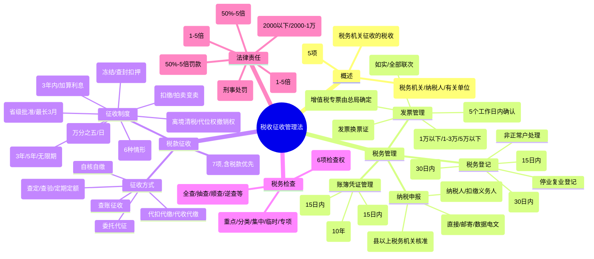

## 📍 章节定位

| 项目 | 信息 |
|------|------|
| **所属科目** | 💰 税法 |
| **难度等级** | ⭐⭐⭐ |
| **历年分值** | 3-4分 |
| **建议学时** | 4-5h |

## 📝 考情分析

税收征收管理法是 CPA 税法考试的重要章节，主要考查程序性规定。本章内容多、条文细，客观题常考税务登记期限、账簿凭证保管期限、纳税申报方式、税款征收方式、税收保全与强制执行措施的适用条件及程序、滞纳金计算、税款追征期限等；主观题常结合具体案例考查税收保全措施与强制执行措施的适用、滞纳金及罚款的计算、税款优先原则的运用。复习时应重点掌握各项措施适用的前提条件、批准权限、期限规定及法律责任中的罚款倍数。

## 🧠 知识框架

## 📖 核心精讲

### 一、概述

#### （一）立法目的

1. 加强税收征收管理；
2. 规范税收征收和缴纳行为；
3. 保障国家税收收入；
4. 保护纳税人的合法权益；
5. 促进经济和社会发展。

#### （二）适用范围

凡依法由**税务机关**征收的各种税收的征收管理，均适用《税收征收管理法》。海关征收的关税、船舶吨税及代征的增值税、消费税，适用其他法律法规。税务机关征收的政府收费（如教育费附加）不适用本法。

#### （三）遵守主体

- **税务行政主体**：各级税务局、税务分局、税务所和省以下税务局的稽查局；
- **税务行政管理相对人**：纳税人、扣缴义务人和其他有关单位；
- **有关单位和部门**：地方各级人民政府及有关部门。

### 二、税务管理

#### （一）税务登记管理

**1. 设立税务登记**

从事生产、经营的纳税人领取工商营业执照的，应当自领取营业执照之日起 **30 日内**申报办理税务登记。

| 情形 | 办理期限 | 证件类型 |
|------|----------|----------|
| 领取工商营业执照 | 营业执照之日起 30 日内 | 税务登记证及副本 |
| 未领营业执照但经批准设立 | 批准设立之日起 30 日内 | 税务登记证及副本 |
| 未领营业执照也未经批准 | 纳税义务发生之日起 30 日内 | 临时税务登记证及副本 |
| 承包承租经营 | 合同签订之日起 30 日内 | 临时税务登记证及副本 |

> 自 2015 年 10 月 1 日起，新设立企业领取加载统一社会信用代码的营业执照后，无须再次进行税务登记（"三证合一、一照一码"）。

**2. 变更税务登记**

纳税人税务登记内容发生变化的，应当自工商行政管理机关变更登记之日起 **30 日内**，向原税务登记机关申报办理变更税务登记。

**3. 注销税务登记**

| 情形 | 办理期限 |
|------|----------|
| 解散、破产、撤销（需工商注销前） | 办理注销登记前 |
| 不需工商注销登记 | 批准/宣告终止之日起 15 日内 |
| 被吊销营业执照 | 吊销之日起 15 日内 |
| 经营地点变动涉及变更税务机关 | 注销之日起 30 日内向迁达地申报 |

办理注销税务登记前，应结清应纳税款、滞纳金和罚款，缴销发票、税务登记证件。

**4. 停业、复业登记**

实行定期定额征收方式的个体工商户停业，应在停业前申报办理。停业期限不得超过 **1 年**。

**5. 非正常户处理**

已办理税务登记的纳税人连续 **3 个月**所有税种均未进行纳税申报的，税收征管系统自动将其认定为非正常户。

#### （二）账簿、凭证管理

| 事项 | 期限/要求 |
|------|-----------|
| 设置账簿 | 领取营业执照或发生纳税义务之日起 **15 日内** |
| 扣缴义务人设账 | 扣缴义务发生之日起 **10 日内** |
| 财务制度备案 | 领取税务登记证件之日起 **15 日内** |
| 账簿凭证保管 | **10 年**（除另有规定外） |
| 发票存根联保管 | **5 年** |

#### （三）发票管理

**发票印制**：增值税专用发票由国务院税务主管部门确定的企业印制；其他发票由省级税务机关确定的企业印制。禁止私自印制、伪造、变造发票。

**发票领用**：主管税务机关在 **5 个工作日内**确认领用发票的种类、数量及领用方式。

**发票开具**：
- 收款方应向付款方开具发票；
- 应按规定的时限、顺序、栏目，全部联次一次性如实开具；
- 不得虚开发票（为他人/自己/让他人为自己/介绍他人开具与实际经营业务不符的发票）。

**发票罚则**：

| 违法行为 | 罚款标准 |
|----------|----------|
| 未按规定开具/使用发票 | 1 万元以下 |
| 跨区域携带/运输空白发票 | 1 万元以下；情节严重 1-3 万元 |
| 虚开发票（1 万元以下） | 5 万元以下 |
| 虚开发票（1 万元以上） | 5-50 万元 |
| 私自印制/伪造发票 | 1-5 万元；情节严重 5-50 万元 |

#### （四）纳税申报管理

**申报对象**：纳税人和扣缴义务人。纳税期内没有应纳税款的，也应办理纳税申报；享受减免税待遇的，在减免税期间也应办理纳税申报。

**申报方式**：

| 方式 | 说明 |
|------|------|
| 直接申报 | 纳税人自行到税务机关办理 |
| 邮寄申报 | 以寄出邮戳日期为实际申报日期 |
| 数据电文 | 以税务机关计算机网络系统收到数据电文的时间为准 |

**延期申报**：纳税人因特殊情况不能按期申报的，经**县以上税务机关核准**，可以延期申报。经核准延期办理的，应在纳税期内按上期实际缴纳的税额或核定税额预缴税款。

### 三、税款征收

#### （一）税款征收的原则

1. 税务机关是征税的行政主体；
2. 税务机关只能依照法律、行政法规的规定征收税款；
3. 不得违反规定开征、停征、多征、少征、提前征收、延缓征收或摊派税款；
4. 必须遵守法定权限和法定程序；
5. 必须开具完税凭证或收据、清单；
6. 税款、滞纳金、罚款统一上缴国库；
7. **税款优先**：
   - 税收优先于无担保债权（法律另有规定的除外）；
   - 纳税人欠税在前的，税收优先于抵押权、质权、留置权；
   - 税收优先于罚款、没收违法所得。

#### （二）税款征收的方式

| 方式 | 适用对象 |
|------|----------|
| 查账征收 | 财务会计制度健全的纳税单位 |
| 查定征收 | 账册不够健全但能控制原材料或进销货的单位 |
| 查验征收 | 经营品种单一、地点时间不固定的单位 |
| 定期定额征收 | 无完整考核依据的小型纳税单位 |
| 代扣代缴/代收代缴 | 法定扣缴义务人 |
| 自核自缴 | 财务制度健全的大中型企业 |
| 委托代征 | 小额、零散税源 |

#### （三）税款征收制度

**1. 延期缴纳税款制度**

纳税人因特殊困难不能按期缴纳税款的，经**省、自治区、直辖市税务局**批准，可以延期缴纳，但最长不得超过 **3 个月**。批准延期内免予加收滞纳金。

特殊困难包括：
- 因不可抗力导致较大损失，正常生产经营受较大影响；
- 当期货币资金在扣除应付职工工资、社会保险费后，不足以缴纳税款。

**2. 税收滞纳金制度**

$$\text{滞纳金}=\text{滞纳税款}\times\text{万分之五}\times\text{滞纳天数}$$

- 起算日：税款缴纳期限届满次日；
- 终止日：实际缴纳或解缴税款之日。

**3. 税额核定制度**

纳税人有下列情形之一的，税务机关有权核定其应纳税额：
1. 依照规定可以不设置账簿的；
2. 依照规定应当设置但未设置账簿的；
3. 擅自销毁账簿或拒不提供纳税资料的；
4. 账目混乱或成本资料、收入凭证、费用凭证残缺不全，难以查账的；
5. 发生纳税义务未按规定期限申报，经责令限期申报逾期仍不申报的；
6. 申报的计税依据明显偏低又无正当理由的。

**4. 税收保全措施**

**适用条件**：税务机关有根据认为从事生产、经营的纳税人有逃避纳税义务行为，且在规定的纳税期之前和责令限期缴纳的限期内。

**适用对象**：仅限从事生产、经营的纳税人（不包括非从事生产、经营的纳税人、扣缴义务人和纳税担保人）。

**批准权限**：县以上税务局（分局）局长批准。

**具体措施**：
1. 书面通知开户银行或其他金融机构冻结纳税人的金额相当于应纳税款的存款；
2. 扣押、查封纳税人的价值相当于应纳税款的商品、货物或其他财产。

**终止情形**：
- 纳税人在限期内缴纳税款 → 立即解除保全；
- 限期期满仍未缴纳 → 转入强制执行。

**排除范围**：个人及其所扶养家属维持生活必需的住房和用品；单价 5,000 元以下的其他生活用品。

**5. 税收强制执行措施**

**适用对象**：从事生产、经营的纳税人、扣缴义务人、纳税担保人（注意：强制执行适用扣缴义务人和纳税担保人，税收保全不适用）。

**适用条件**：未按规定期限缴纳或解缴税款，经责令限期缴纳，逾期仍未缴纳。

**批准权限**：县以上税务局（分局）局长批准。

**具体措施**：
1. 书面通知开户银行或其他金融机构从其存款中扣缴税款；
2. 扣押、查封、依法拍卖或变卖其价值相当于应纳税款的商品、货物或其他财产，以拍卖或变卖所得抵缴税款。

> 拍卖或变卖所得抵缴税款、滞纳金、罚款及费用后，剩余部分应在 **3 日内**退还被执行人。

**6. 欠税清缴制度**

- **离境清税**：欠缴税款的纳税人或其法定代表人需要出境的，应在出境前结清税款、滞纳金或提供担保；
- **大额欠税报告**：欠缴税款数额在 **5 万元以上**的纳税人，处分不动产或大额资产前应向税务机关报告；
- **代位权、撤销权**：欠税纳税人怠于行使到期债权的，税务机关可向人民法院请求以自己名义代为行使；
- **欠税公告**：税务机关按月在行政执法信息公示平台公告。

**7. 税款的退还和追征**

| 情形 | 处理方式 | 期限 |
|------|----------|------|
| 税务机关发现多征 | 立即退还 | 发现之日起 10 日内 |
| 纳税人发现多征 | 申请退还并加算银行同期存款利息 | 自结算缴纳税款之日起 **3 年内** |
| 税务机关责任致未缴/少缴 | 补缴税款，不得加收滞纳金 | **3 年内** |
| 纳税人计算错误等失误 | 追征税款及滞纳金 | **3 年内**；特殊情况 **5 年** |
| 偷税、抗税、骗税 | 无限期追征 | 不受期限限制 |

> 特殊情况指纳税人或扣缴义务人因计算错误等失误，未缴或少缴税款累计数额在 **10 万元以上**。

### 四、税务检查

#### （一）税务检查的形式

重点检查、分类计划检查、集中性检查、临时性检查、专项检查。

#### （二）税务检查的职责

税务机关有权进行下列税务检查：
1. 检查账簿、记账凭证、报表和有关资料；
2. 到生产、经营场所和货物存放地检查应纳税的商品、货物或其他财产；
3. 责成提供与纳税有关的文件、证明材料和有关资料；
4. 询问与纳税有关的问题和情况；
5. 到车站、码头、机场、邮政企业检查托运、邮寄应纳税商品的单据、凭证和资料；
6. 经县以上税务局（分局）局长批准，查询纳税人在银行或其他金融机构的存款账户。

> 调回以前年度账簿检查的，应在 **3 个月内**退还；调回当年账簿检查的，应在 **30 日内**退还。

### 五、法律责任

#### （一）违反税务管理基本规定的处罚

| 违法行为 | 罚款标准 |
|----------|----------|
| 未按规定期限办理税务登记、变更或注销 | 2,000 元以下；情节严重 2,000-10,000 元 |
| 未按规定设置、保管账簿或保管记账凭证 | 2,000 元以下；情节严重 2,000-10,000 元 |
| 未按规定安装、使用税控装置 | 2,000 元以下；情节严重 2,000-10,000 元 |
| 未按规定办理纳税申报 | 2,000 元以下；情节严重 2,000-10,000 元 |
| 骗取税务登记证 | 2,000 元以下；情节严重 2,000-10,000 元 |
| 转借/涂改/损毁/买卖/伪造税务登记证件 | 2,000-10,000 元；情节严重 10,000-50,000 元 |

#### （二）偷税（逃避缴纳税款）的法律责任

**偷税认定**：纳税人伪造、变造、隐匿、擅自销毁账簿、记账凭证，或者在账簿上多列支出或不列、少列收入，或者经税务机关通知申报而拒不申报或进行虚假纳税申报，不缴或少缴应纳税款的，是偷税。

**行政处罚**：追缴不缴或少缴的税款、滞纳金，并处不缴或少缴税款 **50% 以上 5 倍以下**罚款。

**刑事处罚**（《刑法》第 201 条）：
- 数额较大（10 万元以上）且占应纳税额 10% 以上：3 年以下有期徒刑或拘役，并处罚金；
- 数额巨大（50 万元以上）且占应纳税额 30% 以上：3-7 年有期徒刑，并处罚金。

> **不予追究刑事责任情形**：经税务机关下达追缴通知后，补缴税款、缴纳滞纳金，已受行政处罚的，不予追究刑事责任（5 年内因逃税受过刑事处罚或被给予 2 次以上行政处罚的除外）。

#### （三）其他违法行为的法律责任

| 违法行为 | 行政处罚 | 刑事处罚 |
|----------|----------|----------|
| 逃避追缴欠税 | 欠缴税款 50%-5 倍罚款 | 1-10 万元：3 年以下；10 万元以上：3-7 年 |
| 骗取出口退税 | 骗取税款 1-5 倍罚款 | 数额较大：5 年以下；数额巨大：5-10 年；特别巨大：10 年以上或无期 |
| 抗税 | 拒缴税款 1-5 倍罚款 | 3 年以下；情节严重 3-7 年 |
| 阻挠税务检查 | 1 万元以下；情节严重 1-5 万元 | — |
| 扣缴义务人应扣未扣 | 向纳税人追缴税款，对扣缴义务人处应扣未扣税款 50%-3 倍罚款 | — |

#### （四）虚开发票的法律责任

**虚开增值税专用发票**（《刑法》第 205 条）：
- 虚开税款数额较大（10 万元以上）或有其他严重情节：3-10 年有期徒刑；
- 虚开税款数额巨大（50 万元以上）或有其他特别严重情节：10 年以上有期徒刑或无期徒刑。

**虚开普通发票**（《刑法》第 205 条之一）：
- 情节严重：2 年以下有期徒刑、拘役或管制；
- 情节特别严重：2-7 年有期徒刑。

## 💡 典型例题

### 例题 1：滞纳金计算

某企业 2025 年 3 月应纳增值税 100,000 元，规定的纳税期限为 4 月 15 日。该企业实际于 5 月 10 日缴纳。计算应缴纳的滞纳金。

**解答**：

滞纳天数：4 月 16 日至 5 月 10 日 = 25 天

滞纳金 = 100,000 × 0.05% × 25 = 1,250（元）

### 例题 2：税收保全措施适用

下列关于税收保全措施的说法，正确的有（ ）。

A. 仅适用于从事生产、经营的纳税人
B. 需经县以上税务局（分局）局长批准
C. 个人所扶养家属维持生活必需的住房不在保全范围
D. 纳税人在限期内缴纳税款的，税务机关应立即解除保全
E. 适用于扣缴义务人和纳税担保人

**答案**：ABCD

> 解析：税收保全措施仅适用于从事生产、经营的纳税人，不适用于扣缴义务人和纳税担保人（强制执行措施才适用）。

### 例题 3：税款追征期限

下列情形中，税务机关追征税款的期限为 5 年的是（ ）。

A. 因税务机关责任致使纳税人少缴税款 5 万元
B. 因纳税人计算错误失误少缴税款 8 万元
C. 因纳税人计算错误失误少缴税款 15 万元
D. 纳税人偷税致使少缴税款 20 万元

**答案**：C

> 解析：A 选项税务机关责任 3 年内追征不加收滞纳金；B 选项 3 年内追征；C 选项累计 10 万元以上为特殊情况，5 年内追征；D 选项偷税无限期追征。

### 例题 4：偷税罚款计算

某企业通过在账簿上多列支出、不列收入的方式少缴税款 200,000 元，经税务机关查实。计算对该企业的罚款金额范围。

**解答**：

根据《税收征收管理法》第 63 条，偷税罚款为不缴或少缴税款的 50% 以上 5 倍以下。

罚款金额范围：200,000 × 50% = 100,000（元）至 200,000 × 5 = 1,000,000（元）

即 10 万元至 100 万元。

### 例题 5：税款优先原则

某企业欠缴税款 50 万元（欠税发生在前），同时欠银行贷款 80 万元（有抵押担保，抵押发生在欠税之后），另被环保部门处以罚款 20 万元。该企业资产变现后仅有 100 万元。说明税款、贷款、罚款的清偿顺序及金额。

**解答**：

根据税款优先原则：
1. 税收优先于抵押权（因欠税发生在抵押之前）：先清缴税款 50 万元；
2. 税收优先于罚款：但税款已清缴完毕；
3. 剩余 50 万元用于清偿银行贷款（有抵押担保）；
4. 环保罚款 20 万元无法清偿（剩余资产不足以支付）。

## 🎯 记忆口诀

**税务登记期限**：
> 设立变更三十日，注销吊销十五日，停业不超一年期，非正常户三月失。

**账簿凭证管理**：
> 设账十五备案十五，保管十年存根五年，税控装置要安装，财务制度须备案。

**税款征收方式**：
> 查账健全查定控，查验单一定额小，代扣代缴源泉控，自核自缴大中型。

**税收保全 vs 强制执行**：
> 保全只限经营纳税人，强制执行扩到扣缴担保人；保全冻结查封不卖钱，强制扣缴拍卖抵税款；两者都要县局长批准，个人必需住房不保全。

**滞纳金**：
> 万分之五按日算，期限届满次日起，实际缴纳终止日，批准延期免加收。

**税款追征期限**：
> 税务机关责任三年不加金，计算错误三年五万十万元，偷抗骗税无限期追征。

**偷税罚款**：
> 偷税罚款五到五倍（50%以上5倍以下），抗税骗税一到五倍，扣缴未扣五到三倍。

## ✅ 同步练习

### 一、单选题

1. 从事生产、经营的纳税人应当自领取营业执照之日起（ ）内设置账簿。
   A. 10 日
   B. 15 日
   C. 30 日
   D. 60 日

2. 纳税人因特殊困难不能按期缴纳税款的，经批准可以延期缴纳，但最长不得超过（ ）。
   A. 1 个月
   B. 2 个月
   C. 3 个月
   D. 6 个月

3. 税收滞纳金的加收率为（ ）。
   A. 万分之三
   B. 万分之五
   C. 万分之十
   D. 千分之五

4. 因纳税人计算错误等失误，未缴或少缴税款累计数额在（ ）以上的，追征期可以延长到 5 年。
   A. 5 万元
   B. 10 万元
   C. 20 万元
   D. 50 万元

5. 纳税人偷税的，由税务机关追缴不缴或少缴的税款、滞纳金，并处不缴或少缴税款（ ）的罚款。
   A. 50% 以上 3 倍以下
   B. 50% 以上 5 倍以下
   C. 1 倍以上 3 倍以下
   D. 1 倍以上 5 倍以下

### 二、多选题

1. 下列关于税收保全措施的说法，正确的有（ ）。
   A. 仅适用于从事生产、经营的纳税人
   B. 需经县以上税务局（分局）局长批准
   C. 纳税人在限期内缴纳税款的，应立即解除保全
   D. 适用于扣缴义务人
   E. 适用于纳税担保人

2. 税务机关有权核定纳税人应纳税额的情形包括（ ）。
   A. 依照规定可以不设置账簿的
   B. 擅自销毁账簿或拒不提供纳税资料的
   C. 账目混乱难以查账的
   D. 申报计税依据明显偏低又无正当理由的
   E. 未按规定期限申报经责令仍不申报的

3. 下列关于税款追征的说法，正确的有（ ）。
   A. 因税务机关责任，3 年内可要求补缴，不得加收滞纳金
   B. 因纳税人计算错误，3 年内追征税款及滞纳金
   C. 特殊情况追征期延长到 5 年
   D. 偷税、抗税、骗税无限期追征
   E. 所有情形追征期均为 3 年

### 三、计算题

1. 某企业 2025 年 5 月应纳税款 200,000 元，纳税期限为 6 月 15 日。该企业因资金周转困难，经省税务局批准延期 3 个月缴纳。该企业在延期期满后仍未缴纳，于 10 月 20 日才缴纳。计算应缴纳的滞纳金。

2. 某纳税人通过虚假纳税申报少缴税款 500,000 元，经税务机关查实认定为偷税。计算对该纳税人的罚款金额范围。

### 参考答案

**一、单选题**：1.B  2.C  3.B  4.B  5.B

**二、多选题**：1.ABC  2.ABCDE  3.ABCD

**三、计算题**：

1. 经省税务局批准延期 3 个月，批准延期内（至 9 月 15 日）免予加收滞纳金。

   滞纳天数：9 月 16 日至 10 月 20 日 = 35 天

   滞纳金 = 200,000 × 0.05% × 35 = 3,500（元）

2. 偷税罚款为不缴或少缴税款的 50% 以上 5 倍以下。

   罚款下限 = 500,000 × 50% = 250,000（元）

   罚款上限 = 500,000 × 5 = 2,500,000（元）

   罚款金额范围：25 万元至 250 万元。
