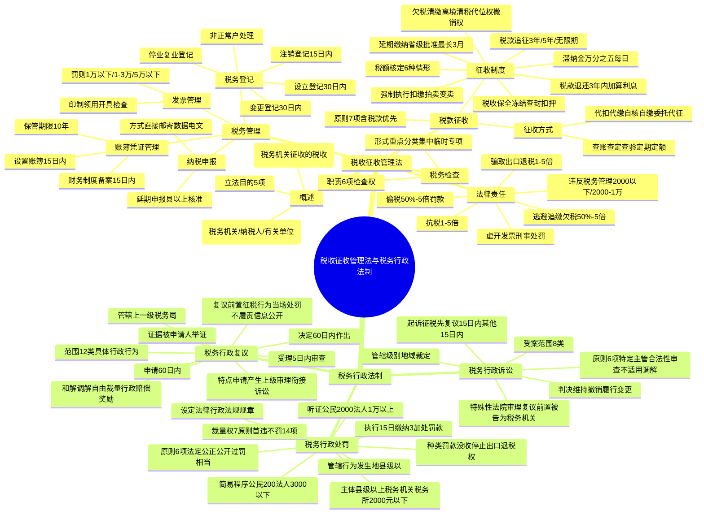

## 1. 章节定位

| 项目 | 信息 |
|------|------|
| 所属科目 | 税法 |
| 难度等级 | 3 |
| 历年分值 | 4-6分 |
| 建议学时 | 6-8h |
| 章节性质 | 税收程序法与税务行政法制综合 |
| 法律依据 | 《税收征收管理法》（2015年修订）、《行政处罚法》（2021年修订）、《行政复议法》（2024年修订）、《行政诉讼法》、《税务行政复议规则》、《税务行政处罚听证程序实施办法》 |
| 源章节 | 第十三章 税收征收管理法 + 第十四章 税务行政法制 |

## 2. 考情分析

本章合并了税收征收管理法和税务行政法制两部分内容，是 CPA 税法考试的重要章节，合计分值约 4-6 分。

**税收征收管理法**部分主要考查程序性规定，内容多、条文细。客观题常考税务登记期限、账簿凭证保管期限、纳税申报方式、税款征收方式、税收保全与强制执行措施的适用条件及程序、滞纳金计算、税款追征期限等；主观题常结合具体案例考查税收保全措施与强制执行措施的适用、滞纳金及罚款的计算、税款优先原则的运用。复习时应重点掌握各项措施适用的前提条件、批准权限、期限规定及法律责任中的罚款倍数。

**税务行政法制**部分包括税务行政处罚、税务行政复议和税务行政诉讼三项制度。考查重点集中于：税务行政处罚的原则（法定、公正公开、过罚相当等）、处罚种类（罚款、没收财物违法所得、停止出口退税权）、简易程序适用标准（公民200元以下、法人3000元以下）、听证程序（公民2000元以上、法人1万元以上罚款）、处罚裁量权与"首违不罚"清单；税务行政复议的范围、管辖、申请期限（60日）、复议前置情形（征税行为、当场处罚、不履行法定职责、政府信息公开）、复议决定期限（60日）及和解调解范围；税务行政诉讼的特有原则（特定主管、合法性审查、不适用调解、起诉不停止执行、税务机关负举证责任）、管辖（级别/地域/裁定）、受案范围、起诉期限及判决类型（维持/撤销/履行/变更）。

**命题规律**：两部分常结合考查，如先考税款追征或滞纳金计算，再考对处罚不服的救济途径；或考查复议前置与诉讼衔接。复习时需把握"征税行为必经复议前置，处罚/保全/强制执行可复议或诉讼"这一核心规则。

## 3. 知识框架

## 4. 核心精讲

### 一、税收征收管理法

#### （一）概述

**1. 立法目的**

1. 加强税收征收管理；
2. 规范税收征收和缴纳行为；
3. 保障国家税收收入；
4. 保护纳税人的合法权益；
5. 促进经济和社会发展。

**2. 适用范围**

凡依法由税务机关征收的各种税收的征收管理，均适用《税收征收管理法》。海关征收的关税、船舶吨税及代征的增值税、消费税，适用其他法律法规。税务机关征收的政府收费（如教育费附加）不适用本法。

**3. 遵守主体**

- 税务行政主体：各级税务局、税务分局、税务所和省以下税务局的稽查局；
- 税务行政管理相对人：纳税人、扣缴义务人和其他有关单位；
- 有关单位和部门：地方各级人民政府及有关部门。

#### （二）税务管理

**1. 税务登记管理**

| 情形 | 办理期限 | 证件类型 |
|------|----------|----------|
| 领取工商营业执照 | 营业执照之日起 30 日内 | 税务登记证及副本 |
| 未领营业执照但经批准设立 | 批准设立之日起 30 日内 | 税务登记证及副本 |
| 未领营业执照也未经批准 | 纳税义务发生之日起 30 日内 | 临时税务登记证及副本 |
| 承包承租经营 | 合同签订之日起 30 日内 | 临时税务登记证及副本 |

> 自 2015 年 10 月 1 日起，新设立企业领取加载统一社会信用代码的营业执照后，无须再次进行税务登记（"三证合一、一照一码"）。

变更税务登记：纳税人税务登记内容发生变化的，应当自工商行政管理机关变更登记之日起 30 日内，向原税务登记机关申报办理变更税务登记。

注销税务登记：

| 情形 | 办理期限 |
|------|----------|
| 解散、破产、撤销（需工商注销前） | 办理注销登记前 |
| 不需工商注销登记 | 批准/宣告终止之日起 15 日内 |
| 被吊销营业执照 | 吊销之日起 15 日内 |
| 经营地点变动涉及变更税务机关 | 注销之日起 30 日内向迁达地申报 |

办理注销税务登记前，应结清应纳税款、滞纳金和罚款，缴销发票、税务登记证件。

停业、复业登记：实行定期定额征收方式的个体工商户停业，应在停业前申报办理。停业期限不得超过 1 年。

非正常户处理：已办理税务登记的纳税人连续 3 个月所有税种均未进行纳税申报的，税收征管系统自动将其认定为非正常户。

**2. 账簿、凭证管理**

| 事项 | 期限/要求 |
|------|-----------|
| 设置账簿 | 领取营业执照或发生纳税义务之日起 15 日内 |
| 扣缴义务人设账 | 扣缴义务发生之日起 10 日内 |
| 财务制度备案 | 领取税务登记证件之日起 15 日内 |
| 账簿凭证保管 | 10 年（除另有规定外） |
| 发票存根联保管 | 5 年 |

**3. 发票管理**

发票印制：增值税专用发票由国务院税务主管部门确定的企业印制；其他发票由省级税务机关确定的企业印制。禁止私自印制、伪造、变造发票。

发票领用：主管税务机关在 5 个工作日内确认领用发票的种类、数量及领用方式。

发票开具：
- 收款方应向付款方开具发票；
- 应按规定的时限、顺序、栏目，全部联次一次性如实开具；
- 不得虚开发票（为他人/自己/让他人为自己/介绍他人开具与实际经营业务不符的发票）。

发票罚则：

| 违法行为 | 罚款标准 |
|----------|----------|
| 未按规定开具/使用发票 | 1 万元以下 |
| 跨区域携带/运输空白发票 | 1 万元以下；情节严重 1-3 万元 |
| 虚开发票（1 万元以下） | 5 万元以下 |
| 虚开发票（1 万元以上） | 5-50 万元 |
| 私自印制/伪造发票 | 1-5 万元；情节严重 5-50 万元 |

**4. 纳税申报管理**

申报对象：纳税人和扣缴义务人。纳税期内没有应纳税款的，也应办理纳税申报；享受减免税待遇的，在减免税期间也应办理纳税申报。

申报方式：

| 方式 | 说明 |
|------|------|
| 直接申报 | 纳税人自行到税务机关办理 |
| 邮寄申报 | 以寄出邮戳日期为实际申报日期 |
| 数据电文 | 以税务机关计算机网络系统收到数据电文的时间为准 |

延期申报：纳税人因特殊情况不能按期申报的，经县以上税务机关核准，可以延期申报。经核准延期办理的，应在纳税期内按上期实际缴纳的税额或核定税额预缴税款。

#### （三）税款征收

**1. 税款征收的原则**

1. 税务机关是征税的行政主体；
2. 税务机关只能依照法律、行政法规的规定征收税款；
3. 不得违反规定开征、停征、多征、少征、提前征收、延缓征收或摊派税款；
4. 必须遵守法定权限和法定程序；
5. 必须开具完税凭证或收据、清单；
6. 税款、滞纳金、罚款统一上缴国库；
7. 税款优先：
   - 税收优先于无担保债权（法律另有规定的除外）；
   - 纳税人欠税在前的，税收优先于抵押权、质权、留置权；
   - 税收优先于罚款、没收违法所得。

**2. 税款征收的方式**

| 方式 | 适用对象 |
|------|----------|
| 查账征收 | 财务会计制度健全的纳税单位 |
| 查定征收 | 账册不够健全但能控制原材料或进销货的单位 |
| 查验征收 | 经营品种单一、地点时间不固定的单位 |
| 定期定额征收 | 无完整考核依据的小型纳税单位 |
| 代扣代缴/代收代缴 | 法定扣缴义务人 |
| 自核自缴 | 财务制度健全的大中型企业 |
| 委托代征 | 小额、零散税源 |

**3. 税款征收制度**

**延期缴纳税款制度**：纳税人因特殊困难不能按期缴纳税款的，经省、自治区、直辖市税务局批准，可以延期缴纳，但最长不得超过 3 个月。批准延期内免予加收滞纳金。

特殊困难包括：
- 因不可抗力导致较大损失，正常生产经营受较大影响；
- 当期货币资金在扣除应付职工工资、社会保险费后，不足以缴纳税款。

**税收滞纳金制度**：

$$\text{滞纳金}=\text{滞纳税款}\times\text{万分之五}\times\text{滞纳天数}$$

- 起算日：税款缴纳期限届满次日；
- 终止日：实际缴纳或解缴税款之日。

**税额核定制度**：纳税人有下列情形之一的，税务机关有权核定其应纳税额：
1. 依照规定可以不设置账簿的；
2. 依照规定应当设置但未设置账簿的；
3. 擅自销毁账簿或拒不提供纳税资料的；
4. 账目混乱或成本资料、收入凭证、费用凭证残缺不全，难以查账的；
5. 发生纳税义务未按规定期限申报，经责令限期申报逾期仍不申报的；
6. 申报的计税依据明显偏低又无正当理由的。

**税收保全措施**：

- 适用条件：税务机关有根据认为从事生产、经营的纳税人有逃避纳税义务行为，且在规定的纳税期之前和责令限期缴纳的限期内。
- 适用对象：仅限从事生产、经营的纳税人（不包括非从事生产、经营的纳税人、扣缴义务人和纳税担保人）。
- 批准权限：县以上税务局（分局）局长批准。
- 具体措施：
  1. 书面通知开户银行或其他金融机构冻结纳税人的金额相当于应纳税款的存款；
  2. 扣押、查封纳税人的价值相当于应纳税款的商品、货物或其他财产。
- 终止情形：纳税人在限期内缴纳税款 → 立即解除保全；限期期满仍未缴纳 → 转入强制执行。
- 排除范围：个人及其所扶养家属维持生活必需的住房和用品；单价 5,000 元以下的其他生活用品。

**税收强制执行措施**：

- 适用对象：从事生产、经营的纳税人、扣缴义务人、纳税担保人（强制执行适用扣缴义务人和纳税担保人，税收保全不适用）。
- 适用条件：未按规定期限缴纳或解缴税款，经责令限期缴纳，逾期仍未缴纳。
- 批准权限：县以上税务局（分局）局长批准。
- 具体措施：
  1. 书面通知开户银行或其他金融机构从其存款中扣缴税款；
  2. 扣押、查封、依法拍卖或变卖其价值相当于应纳税款的商品、货物或其他财产，以拍卖或变卖所得抵缴税款。
- 拍卖或变卖所得抵缴税款、滞纳金、罚款及费用后，剩余部分应在 3 日内退还被执行人。

**欠税清缴制度**：

- 离境清税：欠缴税款的纳税人或其法定代表人需要出境的，应在出境前结清税款、滞纳金或提供担保；
- 大额欠税报告：欠缴税款数额在 5 万元以上的纳税人，处分不动产或大额资产前应向税务机关报告；
- 代位权、撤销权：欠税纳税人怠于行使到期债权的，税务机关可向人民法院请求以自己名义代为行使；
- 欠税公告：税务机关按月在行政执法信息公示平台公告。

**税款的退还和追征**：

| 情形 | 处理方式 | 期限 |
|------|----------|------|
| 税务机关发现多征 | 立即退还 | 发现之日起 10 日内 |
| 纳税人发现多征 | 申请退还并加算银行同期存款利息 | 自结算缴纳税款之日起 3 年内 |
| 税务机关责任致未缴/少缴 | 补缴税款，不得加收滞纳金 | 3 年内 |
| 纳税人计算错误等失误 | 追征税款及滞纳金 | 3 年内；特殊情况 5 年 |
| 偷税、抗税、骗税 | 无限期追征 | 不受期限限制 |

> 特殊情况指纳税人或扣缴义务人因计算错误等失误，未缴或少缴税款累计数额在 10 万元以上。

#### （四）税务检查

税务检查的形式：重点检查、分类计划检查、集中性检查、临时性检查、专项检查。

税务机关有权进行下列税务检查：
1. 检查账簿、记账凭证、报表和有关资料；
2. 到生产、经营场所和货物存放地检查应纳税的商品、货物或其他财产；
3. 责成提供与纳税有关的文件、证明材料和有关资料；
4. 询问与纳税有关的问题和情况；
5. 到车站、码头、机场、邮政企业检查托运、邮寄应纳税商品的单据、凭证和资料；
6. 经县以上税务局（分局）局长批准，查询纳税人在银行或其他金融机构的存款账户。

> 调回以前年度账簿检查的，应在 3 个月内退还；调回当年账簿检查的，应在 30 日内退还。

#### （五）法律责任

**1. 违反税务管理基本规定的处罚**

| 违法行为 | 罚款标准 |
|----------|----------|
| 未按规定期限办理税务登记、变更或注销 | 2,000 元以下；情节严重 2,000-10,000 元 |
| 未按规定设置、保管账簿或保管记账凭证 | 2,000 元以下；情节严重 2,000-10,000 元 |
| 未按规定安装、使用税控装置 | 2,000 元以下；情节严重 2,000-10,000 元 |
| 未按规定办理纳税申报 | 2,000 元以下；情节严重 2,000-10,000 元 |
| 骗取税务登记证 | 2,000 元以下；情节严重 2,000-10,000 元 |
| 转借/涂改/损毁/买卖/伪造税务登记证件 | 2,000-10,000 元；情节严重 10,000-50,000 元 |

**2. 偷税（逃避缴纳税款）的法律责任**

偷税认定：纳税人伪造、变造、隐匿、擅自销毁账簿、记账凭证，或者在账簿上多列支出或不列、少列收入，或者经税务机关通知申报而拒不申报或进行虚假纳税申报，不缴或少缴应纳税款的，是偷税。

行政处罚：追缴不缴或少缴的税款、滞纳金，并处不缴或少缴税款 50% 以上 5 倍以下罚款。

刑事处罚（《刑法》第 201 条）：
- 数额较大（10 万元以上）且占应纳税额 10% 以上：3 年以下有期徒刑或拘役，并处罚金；
- 数额巨大（50 万元以上）且占应纳税额 30% 以上：3-7 年有期徒刑，并处罚金。

> 不予追究刑事责任情形：经税务机关下达追缴通知后，补缴税款、缴纳滞纳金，已受行政处罚的，不予追究刑事责任（5 年内因逃税受过刑事处罚或被给予 2 次以上行政处罚的除外）。

**3. 其他违法行为的法律责任**

| 违法行为 | 行政处罚 | 刑事处罚 |
|----------|----------|----------|
| 逃避追缴欠税 | 欠缴税款 50%-5 倍罚款 | 1-10 万元：3 年以下；10 万元以上：3-7 年 |
| 骗取出口退税 | 骗取税款 1-5 倍罚款 | 数额较大：5 年以下；数额巨大：5-10 年；特别巨大：10 年以上或无期 |
| 抗税 | 拒缴税款 1-5 倍罚款 | 3 年以下；情节严重 3-7 年 |
| 阻挠税务检查 | 1 万元以下；情节严重 1-5 万元 | — |
| 扣缴义务人应扣未扣 | 向纳税人追缴税款，对扣缴义务人处应扣未扣税款 50%-3 倍罚款 | — |

**4. 虚开发票的法律责任**

虚开增值税专用发票（《刑法》第 205 条）：
- 虚开税款数额较大（10 万元以上）或有其他严重情节：3-10 年有期徒刑；
- 虚开税款数额巨大（50 万元以上）或有其他特别严重情节：10 年以上有期徒刑或无期徒刑。

虚开普通发票（《刑法》第 205 条之一）：
- 情节严重：2 年以下有期徒刑、拘役或管制；
- 情节特别严重：2-7 年有期徒刑。

### 二、税务行政法制

税务行政法制是规范税务执法机关和工作人员执法行为的基本规范，是保护纳税人合法权益的司法保障，包括税务行政处罚、税务行政复议和税务行政诉讼三部分。

#### （一）税务行政处罚

**1. 税务行政处罚的原则**

| 序号 | 原则 | 内容 |
|------|------|------|
| 1 | 法定原则 | 依据、设定权、主体和程序法定 |
| 2 | 公正、公开原则 | 处罚规定公开、程序公开（如听证会） |
| 3 | 以事实为依据原则 | 必须以事实为依据，以法律为准绳 |
| 4 | 过罚相当原则 | 根据违法行为性质、情节、社会危害性大小而定 |
| 5 | 处罚与教育相结合原则 | 处罚只是手段，教育公民自觉守法是目的 |
| 6 | 监督、制约原则 | 内部监督（调查与处罚分开）和外部监督（复议、诉讼） |

**2. 税务行政处罚的设定和种类**

处罚设定：

| 设定主体 | 形式 | 设定权限 |
|----------|------|----------|
| 全国人大及其常委会 | 法律 | 设定各种税务行政处罚 |
| 国务院 | 行政法规 | 设定除限制人身自由以外的税务行政处罚 |
| 国家税务总局 | 规章 | 设定警告、通报批评或一定数额罚款（一般不超 10 万元；涉生命健康、金融安全不超 20 万元） |

处罚种类：
1. 罚款；
2. 没收财物和违法所得；
3. 停止出口退税权；
4. 法律、法规和规章规定的其他行政处罚。

**3. 税务行政处罚的主体与管辖**

主体：税务行政处罚的实施主体主要是县以上的税务机关（国家税务总局；省、自治区、直辖市税务局；地市州盟税务局；县市旗税务局）。各级税务机关的内设机构、派出机构不具有处罚主体资格。但税务所可以实施罚款额在 2,000 元以下（含 2,000 元）的税务行政处罚（《税收征收管理法》的特别授权）。

管辖：税务行政处罚由当事人税收违法行为发生地的县（市、旗）以上税务机关管辖（行为发生地原则 + 级别管辖）。

**4. 税务行政处罚的简易程序**

简易程序（当场处罚程序）适用条件：
- 案情简单、违法事实确凿、违法后果比较轻微且有法定依据；
- 给予较低数额罚款或警告：对公民处以 200 元以下（含 200 元）、对法人或其他组织处以 3,000 元以下（含 3,000 元）罚款。

当场处罚程序：
1. 向当事人出示税务行政执法身份证件；
2. 告知当事人受到税务行政处罚的违法事实、依据和陈述申辩权；
3. 听取当事人陈述申辩意见；
4. 填写具有预定格式、编有号码的税务行政处罚决定书，并当场交付当事人；
5. 当事人拒绝签收的，应当在税务行政处罚决定书上注明；
6. 税务行政执法人员当场制作的税务行政处罚决定书，应当报所属税务机关备案。

**5. 税务行政处罚的听证**

听证适用标准：税务机关对公民作出 2,000 元以上（含本数）罚款或者对法人或者其他组织作出 1 万元以上（含本数）罚款的行政处罚之前，应当向当事人送达《税务行政处罚事项告知书》，告知当事人有要求举行听证的权利。

听证程序要点：

| 事项 | 规定 |
|------|------|
| 提出听证期限 | 《税务行政处罚事项告知书》送达后 5 日内书面提出 |
| 举行听证期限 | 收到当事人听证要求后 15 日内举行 |
| 通知送达 | 举行听证的 7 日前送达《税务行政处罚听证通知书》 |
| 听证主持人 | 税务机关负责人指定的非本案调查机构人员 |
| 代理人 | 可委托 1-2 人代理 |
| 回避申请 | 举行听证的 3 日前提出 |
| 公开原则 | 公开进行；涉及国家秘密、商业秘密或个人隐私的不公开 |
| 听证费用 | 由组织听证的税务机关支付 |

> 对应当进行听证的案件，税务机关不组织听证，行政处罚决定不能成立（当事人放弃听证权利或被正当取消听证权利的除外）。

**6. 税务行政处罚的执行**

- 当事人应当在收到行政处罚决定书之日起 15 日内缴纳罚款；
- 到期不缴纳的，税务机关可以对当事人每日按罚款数额的 3% 加处罚款；
- 当场收缴罚款情形：依法给予 100 元以下罚款的；不当场收缴事后难以执行的；边远、水上、交通不便地区经当事人提出当场收缴要求的；
- 税务行政执法人员应当自收缴罚款之日起 2 日内将罚款交至税务机关，税务机关应当在 2 日内将罚款交付指定的银行；
- 税务行政罚款决定与罚款收缴分离：除当场收缴情形外，当事人应当自收到税务行政处罚决定书之日起 15 日内到指定的银行或通过电子支付系统缴纳罚款。

**7. 税务行政处罚裁量权行使规则**

行使裁量权应遵循的原则（7 项）：合法原则、合理原则、公平公正原则、公开原则、程序正当原则、信赖保护原则、处罚与教育相结合原则。

不予行政处罚的情形：
- 违法行为轻微并及时纠正，没有造成危害后果的；
- 不满 14 周岁的人有违法行为的；
- 精神病人在不能辨认或者不能控制自己行为时有违法行为的；
- 首次违反且情节轻微，在税务机关发现前主动改正或在责令限期改正期限内改正的。

从轻或减轻处罚的情形：
- 主动消除或者减轻违法行为危害后果的；
- 受他人胁迫有违法行为的；
- 配合行政机关查处违法行为有立功表现的。

> 追罚时效：违反税收法律、行政法规应当给予行政处罚的行为在 5 年内未被发现的，不再给予行政处罚。对同一税收违法行为不得给予两次以上罚款的行政处罚。

**8. 税务行政处罚"首违不罚"事项清单**

"首违不罚"必须同时满足三个条件：一是首次发生清单中所列事项；二是危害后果轻微；三是在税务机关发现前主动改正或在责令限期改正的期限内改正。

目前两批《清单》所列事项共计 14 项，主要包括：未按规定报送银行账号；未按规定设置保管账簿或记账凭证；未按规定期限办理纳税申报；未按规定报送税控发票数据；未按规定取得发票以其他凭证代替；未按规定缴销发票；扣缴义务人未按规定设置保管账簿；扣缴义务人未按规定报送资料；未按规定开具税收票证；未按规定报告非居民承包工程事项；未按规定备案非税控电子器具软件；未按规定办理税务登记验证换证；未按规定加盖发票专用章；未按规定报送财务会计制度或软件备查。

#### （二）税务行政复议

**1. 税务行政复议的特点**

1. 以当事人不服税务机关及其工作人员作出的税务具体行政行为为前提；
2. 因当事人的申请而产生；
3. 案件的审理一般由原处理税务机关的上一级税务机关进行；
4. 与行政诉讼相衔接（部分情形复议前置）。

**2. 税务行政复议的范围**

行政复议机关受理申请人对税务机关下列具体行政行为不服提出的行政复议申请：

| 序号 | 具体行政行为 |
|------|----------|
| 1 | 征税行为（确认纳税主体、征税对象、征税范围、减税、免税、退税、抵扣税款、适用税率、计税依据、纳税环节、纳税期限、纳税地点、税款征收方式，征收税款、加收滞纳金，代扣代缴、代收代缴、代征行为等） |
| 2 | 行政许可、行政审批行为 |
| 3 | 发票管理行为（发售、收缴、代开发票等） |
| 4 | 税收保全措施、强制执行措施 |
| 5 | 行政处罚行为（罚款；没收财物和违法所得；停止出口退税权） |
| 6 | 不依法履行职责行为（颁发税务登记证；开具完税凭证；行政赔偿；行政奖励等） |
| 7 | 资格认定行为 |
| 8 | 不依法确认纳税担保行为 |
| 9 | 政府信息公开工作中的具体行政行为 |
| 10 | 纳税信用等级评定行为 |
| 11 | 通知出入境管理机关阻止出境行为 |
| 12 | 其他具体行政行为 |

> 申请人认为税务机关的具体行政行为所依据的规定（不含规章）不合法，可以一并提出审查申请。

**3. 税务行政复议的管辖**

| 被申请人 | 复议机关 |
|----------|----------|
| 各级税务局 | 上一级税务局 |
| 计划单列市税务局 | 国家税务总局 |
| 税务所（分局）、各级税务局的稽查局 | 所属税务局 |
| 国家税务总局 | 国家税务总局（向国务院申请裁决为最终裁决） |
| 两个以上税务机关共同作出 | 共同上一级税务机关 |
| 被撤销的税务机关（撤销前作出） | 继续行使其职权的税务机关的上一级 |

**4. 税务行政复议申请**

申请期限：申请人可以在知道税务机关作出具体行政行为之日起 60 日内提出行政复议申请。

复议前置情形（应当先申请行政复议，对复议决定不服才可以提起行政诉讼）：
1. 对复议范围中的征税行为不服的；
2. 对当场作出的税务行政处罚决定不服的；
3. 认为税务机关未履行法定职责的；
4. 申请政府信息公开、税务机关不予公开的。

> 对于征税行为的复议前置，申请人必须依照税务机关根据法律、法规确定的税额、期限，先行缴纳或者解缴税款和滞纳金，或者提供相应的担保，才可以在缴清税款和滞纳金以后，或者所提供的担保得到作出具体行政行为的税务机关确认之日起 60 日内提出行政复议申请。

**5. 税务行政复议受理与审查**

- 行政复议机关收到行政复议申请以后，应当在 5 日内审查，决定是否受理；
- 行政复议机构应当自受理行政复议申请之日起 7 日内，将行政复议申请书副本发送被申请人；被申请人应当自收到之日起 10 日内提出书面答复，并提交证据、依据和其他有关材料；
- 行政复议原则上采用书面审查的办法，但申请人提出要求或行政复议机构认为有必要时，应当听取意见；对重大、复杂的案件，可以采取听证方式审理；
- 行政复议期间具体行政行为不停止执行（被申请人认为需要、复议机关认为需要、申请人申请且复议机关决定、法律规定停止的情形除外）。

**6. 税务行政复议决定**

行政复议机关应当自受理申请之日起 60 日内作出行政复议决定。情况复杂不能在规定期限内作出的，经批准可以适当延长，但延期不得超过 30 日。

行政复议决定类型：

| 情形 | 决定类型 |
|------|----------|
| 事实清楚，证据确凿，适用依据正确，程序合法，内容适当 | 决定维持 |
| 被申请人不履行法定职责 | 决定在一定期限内履行 |
| 主要事实不清、证据不足/适用依据错误/违反法定程序/超越职权或滥用职权/明显不当 | 决定撤销、变更或确认违法（可责令重新作出） |
| 被申请人不能提供证据依据 | 视为没有证据依据，决定撤销 |
| 申请人认为不履责但税务机关无相应职责或已履行 | 决定驳回 |

> 行政复议决定书一经送达，即发生法律效力。

**7. 税务行政复议和解与调解**

可和解、调解的事项：
1. 行使自由裁量权作出的具体行政行为（如行政处罚、核定税额、确定应税所得率等）；
2. 行政赔偿；
3. 行政奖励；
4. 存在其他合理性问题的具体行政行为。

和解协议：申请人和被申请人达成和解的，应当向行政复议机构提交书面和解协议。和解内容不损害社会公共利益和他人合法权益的，行政复议机构应当准许。经准许和解终止行政复议的，申请人不得以同一事实和理由再次申请行政复议。

调解书：行政复议调解书经双方当事人签字，即具有法律效力。

#### （三）税务行政诉讼

**1. 税务行政诉讼的特殊性**

1. 由人民法院进行审理并作出裁决（与税务行政复议的根本区别）；
2. 以解决税务行政争议为前提：被告必须是税务机关或经法律、法规授权的行使税务行政管理权的组织；争议发生在税务行政管理过程中；因税款征纳问题发生的争议，必须先经过税务行政复议程序（复议前置）。

**2. 税务行政诉讼的原则**

| 序号 | 原则 | 内容 |
|------|------|------|
| 1 | 人民法院特定主管原则 | 人民法院对税务行政案件只有部分管辖权 |
| 2 | 合法性审查原则 | 原则上只审查具体税务行为是否合法，不直接判决变更 |
| 3 | 不适用调解原则 | 税收行政管理权是国家权力，税务机关无权依自己意愿处置 |
| 4 | 起诉不停止执行原则 | 起诉不停止执行税收保全措施和强制执行措施 |
| 5 | 税务机关负举证责任原则 | 税务机关最了解作出行为的证据 |
| 6 | 由税务机关负责赔偿原则 | 税务机关执行职务不当造成损害应承担赔偿责任 |

**3. 税务行政诉讼的管辖**

| 管辖类型 | 内容 |
|----------|------|
| 级别管辖 | 基层法院管辖一般税务行政案件；中级法院管辖对国务院部门或县级以上地方政府所作行政行为起诉的案件、海关处理案件、本辖区内重大复杂案件 |
| 一般地域管辖 | 由最初作出具体行政行为的税务机关所在地人民法院管辖 |
| 特殊地域管辖 | 复议机关改变原行为的，原告可选择最初作出机关所在地或复议机关所在地法院；因不动产提起的，由不动产所在地法院管辖 |
| 裁定管辖 | 移送管辖、指定管辖、管辖权的转移 |

**4. 税务行政诉讼的受案范围**

税务行政诉讼的受案范围与税务行政复议的受案范围基本一致，包括：
1. 税务机关作出的征税行为；
2. 责令纳税人提交纳税保证金或纳税担保行为；
3. 行政处罚行为（罚款；没收财物和违法所得；停止出口退税权等）；
4. 通知出境管理机关阻止出境行为；
5. 税收保全措施（冻结存款；扣押、查封财产）；
6. 税收强制执行措施（扣缴税款；拍卖变卖财产抵缴税款）；
7. 认为符合法定条件申请颁发税务登记证和发售发票，税务机关拒绝颁发、发售或不予答复的行为；
8. 税务机关的复议行为（复议机关改变原具体行政行为；期限届满税务机关不予答复）。

**5. 税务行政诉讼的起诉和受理**

起诉条件：
1. 原告是认为具体行政行为侵犯其合法权益的公民、法人或其他组织；
2. 有明确的被告；
3. 有具体的诉讼请求和事实、法律根据；
4. 属于人民法院受案范围和受诉人民法院管辖。

起诉期限与程序衔接：

| 情形 | 起诉期限 |
|------|----------|
| 对征税行为不服（复议前置） | 接到复议决定书之日起 15 日内向人民法院起诉 |
| 对其他具体行政行为不服（选择复议） | 接到通知或知道之日起 15 日内直接向人民法院起诉 |
| 税务机关未告知起诉期限 | 从知道或应当知道起诉期限之日起计算，但从知道行政行为内容之日起最长不超过 1 年 |

> 起诉权是单向性的权利，税务机关不享有起诉权，只有应诉权（只能作为被告），不能反诉。

受理：人民法院在接到起诉状时对符合规定起诉条件的，应当登记立案。对当场不能判定是否符合起诉条件的，应当接收起诉状，出具注明收到日期的书面凭证，并在 7 日内决定是否立案。

**6. 税务行政诉讼的审理和判决**

审理制度：合议、回避、公开审判和两审终审制度。审查核心是被诉具体行政行为是否合法。

判决类型：

| 判决类型 | 适用情形 |
|----------|----------|
| 维持判决 | 具体行政行为证据确凿，适用法律、法规正确，符合法定程序 |
| 撤销判决 | 主要证据不足/适用法律法规错误/违反法定程序/超越职权/滥用职权/明显不当（可判决重新作出行政行为） |
| 履行判决 | 查明被告不履行法定职责的，判决被告在一定期限内履行 |
| 变更判决 | 税务行政处罚明显不当或显失公正的，可以判决变更 |

> 对一审人民法院的判决不服，当事人可以上诉。对发生法律效力的判决，当事人必须执行，否则人民法院有权依对方当事人的申请予以强制执行。

**7. 重大税务案件审理**

重大税务案件的审理范围：
1. 重大税务行政处罚案件；
2. 根据《重大税收违法案件督办管理暂行办法》督办的案件；
3. 应监察、司法机关要求出具认定意见的案件；
4. 拟移送公安机关处理的案件；
5. 审理委员会成员单位认为案情重大、复杂、需要审理的案件；
6. 其他需要审理委员会审理的案件。

不属于重大税务案件审理范围的情形：
1. 公安机关已就税收违法行为立案的；
2. 公安机关尚未就税收违法行为立案，但被查对象为走逃（失联）企业并且涉嫌犯罪的；
3. 国家税务总局规定的其他情形。

## 5. 典型例题

### 例题 1：滞纳金计算

某企业 2025 年 3 月应纳增值税 100,000 元，规定的纳税期限为 4 月 15 日。该企业实际于 5 月 10 日缴纳。计算应缴纳的滞纳金。

**解答**：

滞纳天数：4 月 16 日至 5 月 10 日 = 25 天

滞纳金 = 100,000 × 0.05% × 25 = 1,250（元）

### 例题 2：税收保全措施适用

下列关于税收保全措施的说法，正确的有（ ）。

A. 仅适用于从事生产、经营的纳税人
B. 需经县以上税务局（分局）局长批准
C. 个人所扶养家属维持生活必需的住房不在保全范围
D. 纳税人在限期内缴纳税款的，税务机关应立即解除保全
E. 适用于扣缴义务人和纳税担保人

**答案**：ABCD

> 解析：税收保全措施仅适用于从事生产、经营的纳税人，不适用于扣缴义务人和纳税担保人（强制执行措施才适用）。

### 例题 3：税款追征期限

下列情形中，税务机关追征税款的期限为 5 年的是（ ）。

A. 因税务机关责任致使纳税人少缴税款 5 万元
B. 因纳税人计算错误失误少缴税款 8 万元
C. 因纳税人计算错误失误少缴税款 15 万元
D. 纳税人偷税致使少缴税款 20 万元

**答案**：C

> 解析：A 选项税务机关责任 3 年内追征不加收滞纳金；B 选项 3 年内追征；C 选项累计 10 万元以上为特殊情况，5 年内追征；D 选项偷税无限期追征。

### 例题 4：偷税罚款计算

某企业通过在账簿上多列支出、不列收入的方式少缴税款 200,000 元，经税务机关查实。计算对该企业的罚款金额范围。

**解答**：

根据《税收征收管理法》第 63 条，偷税罚款为不缴或少缴税款的 50% 以上 5 倍以下。

罚款金额范围：200,000 × 50% = 100,000（元）至 200,000 × 5 = 1,000,000（元）

即 10 万元至 100 万元。

### 例题 5：税款优先原则

某企业欠缴税款 50 万元（欠税发生在前），同时欠银行贷款 80 万元（有抵押担保，抵押发生在欠税之后），另被环保部门处以罚款 20 万元。该企业资产变现后仅有 100 万元。说明税款、贷款、罚款的清偿顺序及金额。

**解答**：

根据税款优先原则：
1. 税收优先于抵押权（因欠税发生在抵押之前）：先清缴税款 50 万元；
2. 税收优先于罚款：但税款已清缴完毕；
3. 剩余 50 万元用于清偿银行贷款（有抵押担保）；
4. 环保罚款 20 万元无法清偿（剩余资产不足以支付）。

### 例题 6：税务行政处罚简易程序适用

某个体工商户（公民）因未按规定期限办理纳税申报，税务机关拟对其处以 150 元罚款；同时某企业因虚开发票被税务机关拟处以 5 万元罚款。分别说明两案适用的处罚程序及当事人是否可要求听证。

**解答**：

1. 个体工商户案：对公民处以 200 元以下罚款，适用简易程序（当场处罚程序），由税务行政执法人员当场作出处罚决定。因罚款 150 元未达 2,000 元听证标准，当事人不可要求听证。

2. 企业案：对法人处以 3,000 元以上罚款，不适用简易程序，应适用一般程序。因罚款 5 万元达到 1 万元以上听证标准，税务机关应当在作出处罚决定前告知当事人有要求举行听证的权利；当事人应在《税务行政处罚事项告知书》送达后 5 日内提出听证申请。

### 例题 7：税务行政复议前置

位于甲市的 A 公司为增值税一般纳税人，2025 年 6 月 3 日甲市税务局第一稽查局将《税务处理决定书》和《税务行政处罚决定书》送达 A 公司。A 公司对被认定为偷税有异议，拟进行税收法律救济。说明：(1) A 公司针对补缴税款和滞纳金的处理决定能否直接提起行政诉讼？(2) 应向谁申请行政复议？(3) 应在何时提出行政复议申请？

**解答**：

1. A 公司不能直接提起行政诉讼。对征税行为不服的，应当先向行政复议机关申请行政复议（复议前置），对行政复议决定不服的，才可以依法向人民法院提起行政诉讼。

2. A 公司应向甲市税务局提出行政复议申请（对税务所、各级税务局的稽查局的具体行政行为不服的，向其所属税务局申请行政复议）。

3. A 公司必须依照税务机关根据法律、法规确定的税额、期限，先行缴纳或者解缴税款和滞纳金，或者提供相应的担保，才可以在缴清税款和滞纳金以后，或者所提供的担保得到作出具体行政行为的税务机关确认之日起 60 日内提出行政复议申请。

### 例题 8：加处罚款计算

某企业 2025 年 3 月 1 日收到税务行政处罚决定书，被处以罚款 100,000 元。该企业直至 6 月 9 日才缴纳罚款。计算应加处的罚款金额。

**解答**：

缴纳罚款期限为收到行政处罚决定书之日起 15 日内，即 3 月 16 日为最后缴纳日。自 3 月 17 日起至 6 月 9 日止加处罚款。

加处罚款天数：3 月 17 日至 6 月 9 日 = 85 天

加处罚款 = 100,000 × 3% × 85 = 255,000（元）

> 注意：加处罚款数额按日按罚款数额的 3% 计算，不设上限（实务中总额不超过罚款本金为宜，但考题按公式计算）。

## 6. 记忆口诀

### 口诀 1：税务登记期限
> 设立变更三十日，注销吊销十五日，停业不超一年期，非正常户三月失。

### 口诀 2：账簿凭证管理
> 设账十五备案十五，保管十年存根五年，税控装置要安装，财务制度须备案。

### 口诀 3：税款征收方式
> 查账健全查定控，查验单一定额小，代扣代缴源泉控，自核自缴大中型。

### 口诀 4：税收保全 vs 强制执行
> 保全只限经营纳税人，强制执行扩到扣缴担保人；保全冻结查封不卖钱，强制扣缴拍卖抵税款；两者都要县局长批准，个人必需住房不保全。

### 口诀 5：滞纳金
> 万分之五按日算，期限届满次日起，实际缴纳终止日，批准延期免加收。

### 口诀 6：税款追征期限
> 税务机关责任三年不加金，计算错误三年五万十万元，偷抗骗税无限期追征。

### 口诀 7：偷税罚款
> 偷税罚款五到五倍（50% 以上 5 倍以下），抗税骗税一到五倍，扣缴未扣五到三倍。

### 口诀 8：税务行政处罚原则
> 法定公正加公开，事实为据过罚当，处罚教育相结合，监督制约保权益。

### 口诀 9：税务行政处罚简易程序
> 公民二百法三千，当场处罚简易程；税务所可罚两千，特别授权要记清。

### 口诀 10：税务行政处罚听证
> 公民两千法一万，告知五日提听证；十五日内要举行，七日前通知送达；主持人非调查人，公开进行涉密除外。

### 口诀 11：税务行政复议范围
> 征税许可和发票，保全强制加处罚；不履责和资格认，信息公开信用评；阻止出境其他项，十二类行为可复议。

### 口诀 12：税务行政复议期限
> 六十日内提申请，五日审查决受理；七日发送被申请人，十日答辩交证据；六十日内出决定，延不超三十日。

### 口诀 13：复议前置情形
> 征税行为必前置，当场处罚也前置；不履职责信息公开，先复议后诉讼；其他行为可选择，复议诉讼任其一。

### 口诀 14：税务行政诉讼原则
> 法院特定主管权，合法性审查为原则；不适用调解不停止，税务机关负举证；造成损害要赔偿，六项原则要记牢。

### 口诀 15：税务行政诉讼判决
> 证据确凿判维持，主要证据不足撤；不履职责判履行，处罚显失公正判变更。

### 口诀 16：复议与诉讼衔接
> 征税争议先复议，复议不服再起诉；处罚保全和强制，复议诉讼可自选；起诉期限十五日，复议六十日要记住。

  
税收征收管理法与税务行政法制

  
本章节为税收程序法与税务行政法制综合专题，"税收保全 vs 强制执行措施"和"复议前置与诉讼衔接"是两大核心考点。

