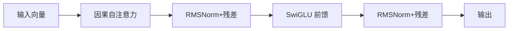

## 先建立直觉

现代 LLM（GPT 系列、Llama、Qwen…）几乎都是 **Decoder-only Transformer**：只保留「解码器」那一半，靠**自回归**一个字一个字往外蹦。

为什么不用完整的 Encoder-Decoder（如 T5）？
- 文本生成是「给前文、续后文」，本质就是解码器的活；
- Decoder-only 结构统一、易扩展、易做 KV Cache，scale 到千亿参数最顺手；
- 预训练目标（下一 token 预测）和生成方式完全一致，简单即美。

一个 Decoder 层像「流水线工位」：



## 它解决什么问题

- **注意力**解决「长距离依赖」：第 100 个 token 能直接 attend 到第 1 个，不用逐层传。
- **因果掩码**解决「不能偷看答案」：第 i 个位置只能看 ≤ i 的位置，保证自回归成立。
- **RoPE** 解决「位置信息」：用旋转把位置编码进 q/k，外推性好。
- **RMSNorm / SwiGLU** 解决「训练稳定 + 表达力」，比 LayerNorm/ReLU 更适配大模型。

## 核心概念

### 1. 因果自注意力（Causal Self-Attention）

```python
import torch, torch.nn as nn
import torch.nn.functional as F

class CausalAttention(nn.Module):
    def __init__(self, d_model, n_heads):
        super().__init__()
        self.n_heads = n_heads
        self.head_dim = d_model // n_heads
        self.qkv = nn.Linear(d_model, 3 * d_model, bias=False)
        self.out = nn.Linear(d_model, d_model, bias=False)

    def forward(self, x):
        B, T, C = x.shape
        q, k, v = self.qkv(x).split(C, dim=-1)        # 各 [B,T,C]
        q = q.view(B, T, self.n_heads, self.head_dim).transpose(1, 2)
        k = k.view(B, T, self.n_heads, self.head_dim).transpose(1, 2)
        v = v.view(B, T, self.n_heads, self.head_dim).transpose(1, 2)

        scores = q @ k.transpose(-2, -1) / (self.head_dim ** 0.5)
        # 因果掩码：位置 i 只能看 j<=i
        mask = torch.triu(torch.ones(T, T, dtype=torch.bool), diagonal=1)
        scores = scores.masked_fill_(mask, float("-inf"))
        attn = F.softmax(scores, dim=-1)
        out = attn @ v                                     # [B,H,T,head_dim]
        out = out.transpose(1, 2).contiguous().view(B, T, C)
        return self.out(out)
```

### 2. RoPE 旋转位置编码

不往 token 里加位置向量，而是**把位置信息旋转进 q、k**：

```python
def rope(q, k, base=10000):
    """q,k: [B, H, T, head_dim]，要求 head_dim 为偶数"""
    B, H, T, D = q.shape
    inv_freq = 1.0 / (base ** (torch.arange(0, D, 2).float() / D))
    pos = torch.arange(T).float()
    theta = torch.outer(pos, inv_freq)              # [T, D/2]
    cos = torch.cos(theta).repeat_interleave(2, -1) # [T, D]
    sin = torch.sin(theta).repeat_interleave(2, -1)
    def rotate(x):
        x1, x2 = x[..., 0::2], x[..., 1::2]
        rot = torch.cat([-x2, x1], -1)
        return x * cos + rot * sin
    return rotate(q), rotate(k)
```

> RoPE 让「相对位置」直接体现在点积里，长上下文外推（NTK、YaRN）也基于它扩展。

### 3. RMSNorm + SwiGLU

```python
class RMSNorm(nn.Module):
    def __init__(self, d): super().__init__(); self.g = nn.Parameter(torch.ones(d))
    def forward(self, x):
        r = x.pow(2).mean(-1, keepdim=True).rsqrt()
        return x * r * self.g

class SwiGLU(nn.Module):
    def __init__(self, d, d_ff):
        super().__init__()
        self.w1 = nn.Linear(d, d_ff, bias=False)
        self.w2 = nn.Linear(d, d_ff, bias=False)
        self.w3 = nn.Linear(d_ff, d, bias=False)
    def forward(self, x):
        return self.w3(F.silu(self.w1(x)) * self.w2(x))
```

### 4. 拼成一层 + 整个模型

```python
class Block(nn.Module):
    def __init__(self, d, n_heads, d_ff):
        super().__init__()
        self.ln1, self.ln2 = RMSNorm(d), RMSNorm(d)
        self.attn = CausalAttention(d, n_heads)
        self.ff = SwiGLU(d, d_ff)
    def forward(self, x):
        x = x + self.attn(self.ln1(x))     # 残差
        x = x + self.ff(self.ln2(x))
        return x

class MiniGPT(nn.Module):
    def __init__(self, vocab=32000, d=256, n_layers=6, n_heads=8, d_ff=1024, max_len=2048):
        super().__init__()
        self.tok_emb = nn.Embedding(vocab, d)
        self.blocks = nn.ModuleList([Block(d, n_heads, d_ff) for _ in range(n_layers)])
        self.ln_f = RMSNorm(d)
        self.head = nn.Linear(d, vocab, bias=False)
    def forward(self, idx):
        x = self.tok_emb(idx)
        for blk in self.blocks: x = blk(x)
        return self.head(self.ln_f(x))     # [B,T,vocab] 的 logits
```

### 5. 参数量估算（一眼判断显存）

| 组件 | 参数量 |
|------|--------|
| Token Embedding | `vocab × d_model` |
| 每层 Attention | `4 × d_model²`（qkv+out，不含 bias） |
| 每层 FFN (SwiGLU) | `3 × d_model × d_ff`（d_ff≈4d → `12 d²`） |
| 每层小计 | ≈ `12 × d_model²`（d_ff=4d 时） |
| 总计（L 层） | ≈ `L × 12 d² + vocab×d` |

> 例：Llama-7B 用 `d=4096, L=32, d_ff=11008` → 约 6.7B。用公式 `32 × 12 × 4096² ≈ 6.4B`，加上 embedding 与 layernorm，对得上。

### 6. KV Cache（推理加速，非训练）

生成第 t+1 个 token 时，前面 t 个 token 的 k/v 已算过，**缓存复用**避免重算：

```python
# 推理时：只算新 token 的 q，k/v 拼到 cache
past_kv = []   # 每层一份
def step(last_idx, past_kv):
    x = tok_emb(last_idx)                    # [B,1,d]
    for i, blk in enumerate(blocks):
        # 注意力用 cached k/v 与当前 q 计算，再 append 新 k/v
        ...
```

## 常见坑

1. **忘记因果掩码**：注意力能看到未来 token，模型在训练时「偷看答案」，推理却看不到，train/serve 不一致，loss 虽低但生成乱码。
2. **RoPE 维度非偶数 / 未对 q,k 同时应用**：位置信息错位。务必 q、k 都过 RoPE，且 head_dim 为偶数。
3. **Attention 没除 √d**：score 过大 → softmax 饱和 → 梯度消失。
4. **参数量算错导致显存爆**：先套公式估算，再决定 L/d，别拍脑袋。
5. **embedding 与 lm_head 是否共享权重**：大模型常共享（省显存），小模型可独立；但要前后一致。

## 小结

- 现代 LLM = Decoder-only Transformer，靠自回归生成；
- 核心零件：因果注意力 + RoPE + RMSNorm + SwiGLU + 残差；
- 参数量 ≈ `L × 12 d² + vocab×d`，用它预判显存；
- 下一章：用「下一 token 预测」把这套随机权重训成基座模型。
