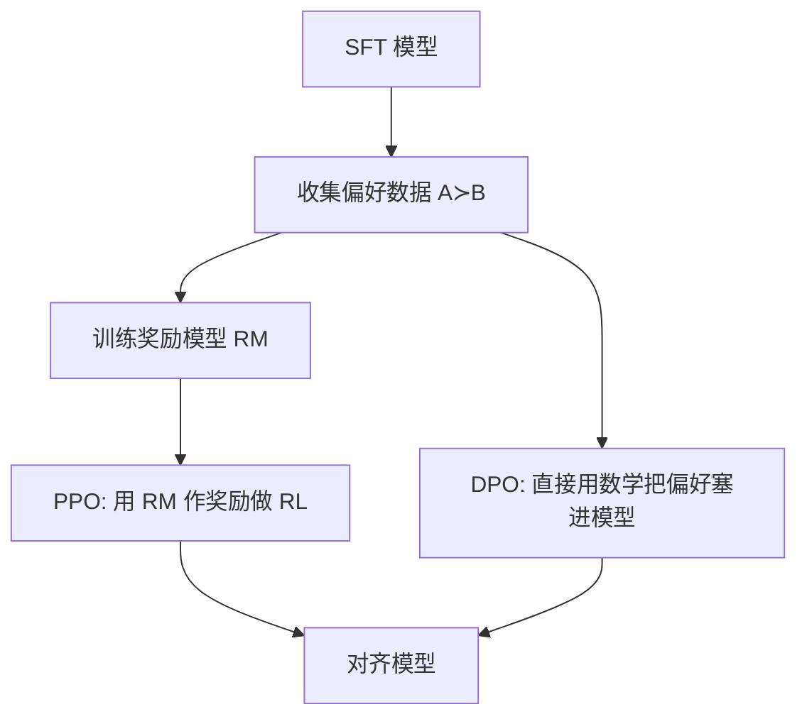

## 先建立直觉

SFT 之后模型「会按指令答」，但还不一定「答得好、答得安全、答得符合人类喜好」。比如同一个问题，它可能给出「啰嗦版」「简练版」「有毒版」。

对齐（Alignment）就是**用人类偏好把模型往「我们想要的方向」推一把**。两条主流路线：



- **RLHF**（InstructGPT 经典路线）：先训奖励模型，再用 PPO 强化学习；
- **DPO**（近年主流）：跳过显式奖励模型，**直接用一个分类式损失**把偏好学进去，简单稳定得多。

## 它解决什么问题

1. **SFT 只学「格式对」，不学「哪个更好」**：偏好数据才能区分优劣。
2. **安全与有用性**：抑制有毒、幻觉、不礼貌的回答。
3. **风格可控**：让回答更简洁 / 更详细 / 更符合品牌语气。

## 核心概念

### 1. 偏好数据

每条样本是一问二答，标注「哪个更好」：

```json
{
  "prompt": "用一句话解释什么是区块链",
  "chosen": "区块链是一种去中心化的分布式账本，数据一旦记录难以篡改。",
  "rejected": "区块链就是比特币，懂吧，就是那个币，反正很牛。"
}
```

### 2. RLHF：奖励模型（RM）

RM 本质是「给回答打分的回归模型」，在 SFT 模型上加一个标量输出头：

```python
# RM 训练目标：让 chosen 得分高于 rejected
# loss = -log σ(R(chosen) - R(rejected))   （Bradley-Terry）
from trl import RewardTrainer, RewardConfig
cfg = RewardConfig(output_dir="rm", num_train_epochs=1, bf16=True, learning_rate=1e-5)
trainer = RewardTrainer(model=sft_model, args=cfg, train_dataset=prefs)
trainer.train()
```

### 3. RLHF：PPO 强化学习

把语言生成当成「决策过程」：每生成一个 token 是一个动作，RM 给整段回答打分作奖励，PPO 优化策略（模型）使其生成更高分回答，同时用 KL 项**约束别偏离 SFT 太远**。

```python
from trl import PPOTrainer, PPOConfig
ppo = PPOConfig(model_name="sft-llm-final", learning_rate=1e-6, ppo_epochs=1, 
                kl_coef=0.05, batch_size=8)
trainer = PPOTrainer(config=ppo, model=sft_model, ref_model=sft_model, reward_model=rm)
for batch in dataloader:
    queries = tokenizer(batch["prompt"], return_tensors="pt").input_ids
    responses = trainer.generate(queries, max_new_tokens=128)
    rewards = rm_score(responses)              # 奖励模型打分
    trainer.step(queries, responses, rewards)  # PPO 更新
```

> PPO 工程复杂（要同时加载策略/参考/奖励/价值四个模型），显存与稳定性都是坑，所以才有了更简单的 DPO。

### 4. DPO：直接偏好优化（强烈推荐起点）

DPO 把「RM + PPO」压缩成一个监督式损失，**不需要显式奖励模型，也不需要 RL 循环**：

```math
L_DPO = -E[ log σ( β · ( log πθ(y_w|x) - log π_ref(y_w|x) - (log πθ(y_l|x) - log π_ref(y_l|x)) ) ) ]
```

直觉：让「好回答」相对参考模型的提升，大于「差回答」的提升，且 β 控制别偏离太远。

```python
from trl import DPOTrainer, DPOConfig
cfg = DPOConfig(
    output_dir="dpo-llm",
    per_device_train_batch_size=4,
    gradient_accumulation_steps=8,
    num_train_epochs=1,
    learning_rate=5e-6,
    beta=0.1,                      # 偏离约束强度
    bf16=True, max_prompt_length=1024, max_length=2048,
)
trainer = DPOTrainer(
    model=sft_model,              # 待优化
    ref_model=sft_model,          # 参考（自动冻结）
    args=cfg,
    train_dataset=prefs,          # 含 prompt/chosen/rejected
)
trainer.train()
trainer.save_model("dpo-llm-final")
```

> 实际项目里 **DPO 几乎总是比 PPO 更省事、更稳**。除非你追求极致效果且工程能力强，否则从 DPO 起步。

## 常见坑

1. **DPO 的 chosen/rejected 写反**：那等于在教模型「学坏的」。务必校验标注方向。
2. **偏好数据质量差/噪声大**：RM 和 DPO 都高度依赖偏好质量，垃圾标注出垃圾对齐。
3. **β 设得太大/太小**：太大模型不动（和 SFT 没区别），太小偏离失控、输出崩坏。0.1 是常见起点。
4. **PPO 忘了 KL 约束**：模型为了刷高 RM 分数会「 reward hack」（说出 RM 喜欢的套话但内容空洞）。KL 项是安全阀。
5. **对齐后忘了回归评测**：光看偏好 win-rate，还要测通用能力是否退化（灾难性遗忘）。

## 小结

- 对齐 = 用人类偏好把 SFT 模型推向「更好、更安全」；
- RLHF = 奖励模型 + PPO，强但工程重；
- **DPO 直接用一个分类损失做偏好优化，推荐作为起点**；
- 关键超参：β（偏离约束）、学习率（比 SFT 更小 ~5e-6）；
- 下一章：把训好的模型量化、部署、评测，真正用起来。
