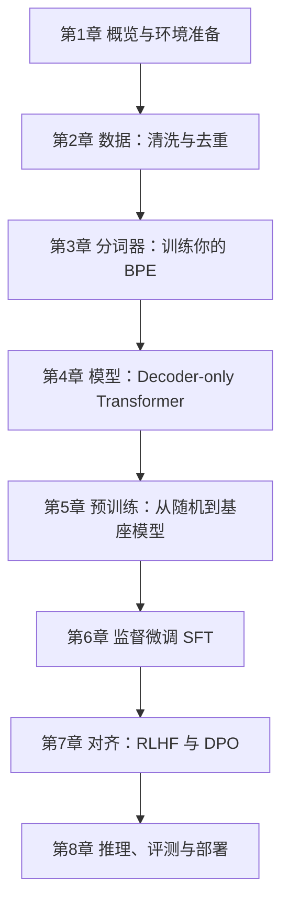

## 1. 这个板块在讲什么

本板块是一份 **从零到能落地** 的「训练大语言模型（LLM）」教程，模仿 `CPA / ACCA / 网络协议 / Three.js` 那种「总目录 → 分章节教程」的学习路径：

- **教程总目录**（本页）：8 章按依赖顺序排好，给学习路线、给每章一句话定位；
- **每章一份教程**：`NN-xxx.md`，用「先建立直觉 → 它解决什么问题 → 核心概念 → 动手写 → 常见坑 → 小结」的结构讲清一个主题。

> 训练 LLM 不是魔法，它是「在数据上做海量矩阵乘法 + 反向传播」的工程问题。本教程不堆公式，而是带你把一条**完整链路**跑通：拿到原始文本 → 清洗 → 分词 → 搭模型 → 预训练 → 微调 → 对齐 → 部署。哪怕你只有一张消费级显卡，也能跟着训出一个「能聊天的迷你 GPT」。

## 2. 推荐学习顺序（自底向上）



**阶段一 · 准备地基（第 1–3 章）**
1. 先搞懂「训练 LLM 到底训什么」、需要什么硬件，把环境跑起来。
2. 再理解「数据决定上限」——怎么清洗、去重、组织成训练样本。
3. 配套训练一个自己的分词器（BPE），理解词表与子词切分。

**阶段二 · 模型与预训练（第 4–5 章）**
4. 搞懂 Decoder-only Transformer 的每个零件：注意力、RoPE、RMSNorm、SwiGLU、KV Cache。
5. 用预训练目标（下一 token 预测）把随机权重训成「基座模型」，学会混合精度与分布式训练。

**阶段三 · 让它好用（第 6–8 章）**
6. 用 SFT 把基座变成「会按指令回答的助手」。
7. 用 RLHF / DPO 做对齐，让回答更安全、有用、符合人类偏好。
8. 量化 + vLLM 部署，做评测，把模型真正用起来。

## 3. 环境准备

本教程默认 **Python 3.10+** 与 **PyTorch 2.x**（CUDA 11.8+）。最小可跑环境：

```bash
# 创建虚拟环境
python -m venv .venv && source .venv/bin/activate   # Windows: .venv\Scripts\activate

# 安装 PyTorch（按你的 CUDA 版本调整，这里是 CUDA 12.1 示例）
pip install torch==2.3.1 torchvision --index-url https://download.pytorch.org/whl/cu121

# 核心工具链
pip install transformers==4.44.0 tokenizers==0.19.1 datasets==2.21.0 \
            accelerate==0.33.0 deepspeed==0.14.4 peft==0.12.0 trl==0.9.6 \
            sentencepiece==0.2.0 wandb==0.17.0
```

| 工具 | 在本教程的角色 |
|------|----------------|
| `torch` | 张量计算与自动求导（训练核心） |
| `transformers` | 现成模型/分词器封装，也用于推理 |
| `tokenizers` | 用 Rust 实现，训练高性能 BPE 分词器 |
| `datasets` | 大规模语料加载、流式处理、map 清洗 |
| `accelerate` / `deepspeed` | 单卡到多卡（DDP / FSDP / ZeRO）分布式训练 |
| `peft` | LoRA 等参数高效微调 |
| `trl` | SFT / RM / PPO / DPO 一站式对齐训练 |
| `wandb` | 训练指标可视化（loss、lr 曲线） |

> **硬件现实**：完整复现 7B+ 模型需要多卡 A100/H100 与数万人民币电费。但本教程所有代码都**先给「小模型 + 单卡可跑」版本**（如 `d_model=256` 的 nanoGPT 风格模型），再说明如何放大到多卡、大模型。请先在小规模上验证，再谈规模。

## 4. 章节速查

| # | 章节 | 一句话定位 |
|---|------|-----------|
| 01 | 概览与环境准备 | LLM 是什么、训练链路全貌、硬件预算与工具栈 |
| 02 | 数据：清洗、去重与组织 | 语料来源、质量过滤、MinHash 去重、样本格式 |
| 03 | 分词器：训练你的 BPE | 子词切分原理、用 tokenizers 训词表、特殊 token |
| 04 | 模型：Decoder-only Transformer | 注意力 / 因果掩码 / RoPE / RMSNorm / SwiGLU / 参数量估算 |
| 05 | 预训练：从随机到基座模型 | 下一 token 预测、训练循环、bf16、DDP/FSDP/DeepSpeed |
| 06 | 监督微调 SFT | 指令数据、对话格式、LoRA vs 全参、防过拟合 |
| 07 | 对齐：RLHF 与 DPO | 奖励模型、PPO、DPO 原理与实现 |
| 08 | 推理、评测与部署 | 自回归生成、采样、量化（GPTQ/AWQ/GGUF）、vLLM |

> 本板块持续整理中。每章会逐步补充可运行示例、踩坑记录与推荐资料；如有错误欢迎通过博客评论或邮件反馈。
