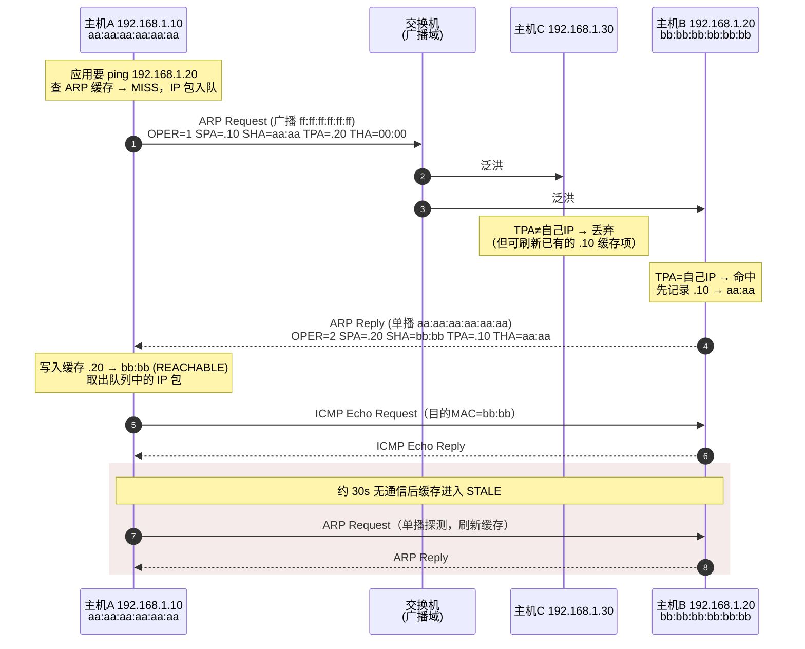
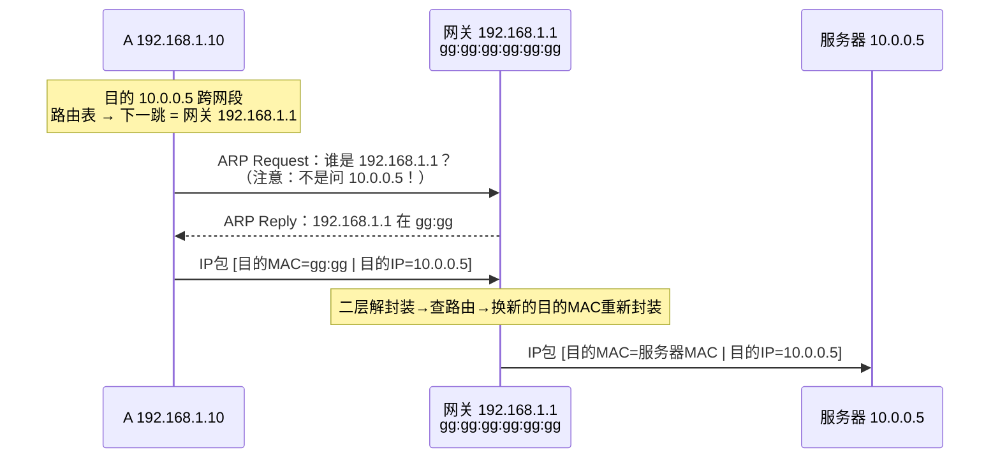
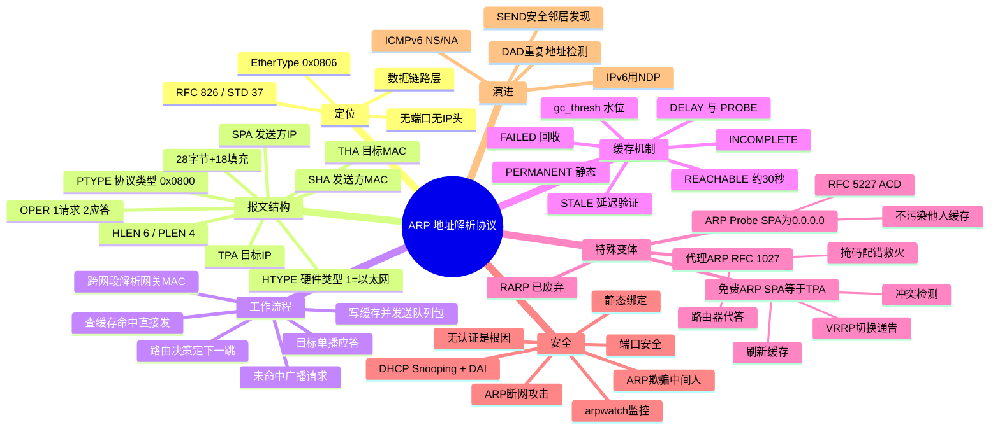

## 先建立直觉

ARP 干的事只有一件：**把"名字"翻译成"门牌号"**。

你想给同一栋楼里的某个人送快递，手里只有他的名字，可快递必须写门牌号才能送。于是你在楼道里喊一声"某某在哪间？"，本人应一声报出房号，你记在本子上，以后就直接送。

ARP 就是这声吆喝加这个小本子。它不负责送东西，也不管东西送到之后发生什么——**它只解决"我该把这一帧交给谁"这一个问题**。

## 它解决什么问题

设想没有 ARP 会怎样：你的电脑知道要访问 `192.168.1.20`，但网卡把数据发出去时，必须在帧的开头填上"接收方是哪块网卡"。这个位置不能空着，也不能瞎填——填错了，交换机就送错人，或者干脆没人接收。

而这两套"地址"完全是两个世界的东西：IP 是网络管理员分配的、随时可能变的逻辑编号；网卡地址是出厂就烧死的物理编号。没有任何天然规律能从一个推出另一个，也不可能让每台机器都预先背下全网的对照表。

所以必须有一个"现场问一嘴"的机制。ARP 就是那个机制——**广播询问 + 单播应答 + 本地缓存**，三步搞定，简单到几乎没有多余设计（也正因如此，它一点安全性都没有）。

## 工作流程（简化版）

先记住这条主线，细节都挂在它上面：

1. **先问路由，不问 ARP**：IP 层先算出"这个包的下一跳是谁"——同网段就是对方本人，跨网段就是网关。
2. **翻本子**：拿下一跳的 IP 去查 ARP 缓存。查到了，直接封装发送，流程结束。
3. **没查到就喊话**：把待发的数据包先攥在手里，向全广播域发一个 ARP 请求："谁是这个 IP？"
4. **本人应答**：只有 IP 对得上的那台主机会单播回一个 ARP 应答，告诉你它的 MAC。
5. **记本子并补发**：把映射写进缓存，取出刚才攥着的数据包发出去。之后一段时间内都不用再喊。

下面两小节是这条主线的完整细节。

### 1.1 触发时机

当主机 A 要发送一个 IP 数据包时，IP 层先做**路由决策**，确定**下一跳（next hop）IP**：

- 目的 IP 与自己**同网段** → 下一跳 = 目的 IP 本身；
- 目的 IP **跨网段** → 下一跳 = 路由表中匹配路由的**网关 IP**。

得到下一跳 IP 后，链路层查 **ARP 缓存**：

- **命中** → 直接封装以太网帧发送；
- **未命中** → 暂存待发数据包（Linux 每个邻居项默认最多排队 3 个包，`unres_qlen`），发起 ARP 请求解析。

### 1.2 解析四步

1. **广播请求**：A 构造 ARP Request，以太网目的 MAC = `FF:FF:FF:FF:FF:FF`，`TPA`（目标 IP）= 下一跳 IP，`THA`（目标 MAC）填 `00:00:00:00:00:00`。
2. **全网段接收**：同一广播域所有主机（含交换机泛洪范围内的设备）都收到该帧并解封装。
3. **匹配与学习**：每台主机比对 `TPA` 是否是自己的 IP。**无论是否匹配**，多数实现都会先根据 `SPA + SHA` 更新/刷新自己的 ARP 缓存（RFC 826 规定：若表中已有该 IP 条目则更新；若没有，仅当自己是目标时才新建）。
4. **单播应答**：目标主机 B 构造 ARP Reply（`Operation = 2`），交换发送方/目标方地址字段，**单播**回 A。A 收到后写入缓存，取出排队的 IP 包完成发送。

> 整个过程通常在 **1 个 RTT 内**完成（局域网 < 1 ms）。若无应答，Linux 默认按 `mcast_solicit`（默认 3 次）重试后，将邻居项标记为 `FAILED`，上层报 `Destination Host Unreachable`。

## 报文 / 头部长什么样

ARP 报文**不含 IP 头**，直接跟在 14 字节以太网头之后。以太网上运行 IPv4 时，ARP 报文体固定 **28 字节**。由于以太网最小帧长 60 字节（不含 FCS），实际会被**填充（Padding）18 字节 0x00**。

```
以太网帧: | 目的MAC 6 | 源MAC 6 | 类型 0x0806 2 | ARP报文 28 | 填充 18 | FCS 4 |
```

### 2.1 字段表

> **看这张表前先记住**：这 28 字节可以分成两半——前 8 字节是"元信息"（说明我在解析哪两种地址、这是问还是答），后 20 字节是四个地址，两两成对："我是谁"（SHA/SPA）和"我找谁"（THA/TPA）。抓住这个分组，字段表就不用死记了。

| 偏移 | 字段 | 长度 | 含义与典型值 |
|------|------|------|-------------|
| 0 | **Hardware Type (HTYPE)** — 硬件类型 | 2 B | 硬件类型。`1` = Ethernet（最常见）；`6` = IEEE 802；`15` = Frame Relay |
| 2 | **Protocol Type (PTYPE)** — 协议类型 | 2 B | 上层协议类型，取值同 EtherType。`0x0800` = IPv4 |
| 4 | **Hardware Addr Length (HLEN)** — 硬件地址长度 | 1 B | 硬件地址长度。以太网 = `6` |
| 5 | **Protocol Addr Length (PLEN)** — 协议地址长度 | 1 B | 协议地址长度。IPv4 = `4` |
| 6 | **Operation (OPER / opcode)** — 操作码 | 2 B | 操作码：`1` = ARP Request，`2` = ARP Reply，`3` = RARP Request，`4` = RARP Reply，`8`/`9` = InARP |
| 8 | **Sender Hardware Address (SHA)** — 发送方硬件地址 | 6 B | **发送方 MAC**。接收方据此学习映射 |
| 14 | **Sender Protocol Address (SPA)** — 发送方协议地址 | 4 B | **发送方 IP**。与 SHA 构成一条映射记录 |
| 18 | **Target Hardware Address (THA)** — 目标硬件地址 | 6 B | 目标 MAC。请求时填 `00:00:00:00:00:00`（未知）；应答时填请求方 MAC |
| 24 | **Target Protocol Address (TPA)** — 目标协议地址 | 4 B | **目标 IP**。请求时 = 待解析的 IP；应答时 = 请求方 IP |

### 2.2 请求与应答字段对照（A=192.168.1.10/aa:aa，B=192.168.1.20/bb:bb）

> **看这张表前先记住**：请求和应答其实是同一张表格填了两遍，只是"我是谁 / 我找谁"这两组地址互换了位置，操作码从 1 变成 2。横着看差异，比竖着背字段有效得多。

| 字段 | A 发出的 Request | B 回复的 Reply |
|------|-----------------|----------------|
| 以太网目的 MAC | `ff:ff:ff:ff:ff:ff`（广播） | `aa:aa:aa:aa:aa:aa`（单播给 A） |
| OPER | `1` | `2` |
| SHA / SPA | `aa:aa:aa:aa:aa:aa` / `192.168.1.10` | `bb:bb:bb:bb:bb:bb` / `192.168.1.20` |
| THA / TPA | `00:00:00:00:00:00` / `192.168.1.20` | `aa:aa:aa:aa:aa:aa` / `192.168.1.10` |

> **判读口诀**：`SHA/SPA` 永远是"我是谁"，`THA/TPA` 永远是"我找谁"。三种特殊报文全靠这四个字段的组合区分（见"关键机制 / 变体"一节）。

## 交互时序

> **一句话看懂这张图**：A 喊一嗓子（广播），全网段都听见但只有 B 答话（单播），A 记下答案后才真正开始 ping；大约 30 秒没说话，这条记录就"过期待验证"，下次用之前单播确认一下。



### 3.1 跨网段场景的关键差异

> **一句话看懂这张图**：目的地在外网，A 却只 ARP 问网关——因为它只需要知道"把包交给谁"，而不是"包最终去哪"。快递员只要送到中转站，剩下的中转站负责。



> **核心结论**：一次跨网段传输中，**IP 地址端到端不变，MAC 地址逐跳改写**。每一跳路由器都要为下一跳做一次 ARP 解析。

## 关键机制 / 变体

### 4.1 ARP 缓存与状态机

**这是干什么的**：给"记在小本子上的映射"加一套有效期管理——既不能每次发包都广播打扰全网，也不能把早就搬走的邻居一直记着。

Linux 使用统一的**邻居子系统（neighbour subsystem）**管理 ARP/NDP 表，状态（NUD, Neighbour Unreachability Detection）如下：

| 状态 | 含义 |
|------|------|
| `INCOMPLETE` | 已发出请求，尚未收到应答，数据包排队中 |
| `REACHABLE` | 最近确认可达（默认 `base_reachable_time` 30 秒，实际取 [0.5,1.5]×该值随机） |
| `STALE` | 条目仍在但已过期未验证，**下次发包时**才触发探测（延迟验证，避免无谓广播） |
| `DELAY` | STALE 后发包，等待上层（如 TCP ACK）给出可达性证据的宽限期 |
| `PROBE` | 宽限期无证据，正在主动单播探测 |
| `FAILED` | 探测失败，条目将被回收，上层收到 `EHOSTUNREACH` |
| `PERMANENT` | 手工静态绑定，永不老化 |

关键内核参数（`/proc/sys/net/ipv4/neigh/<dev>/`）：`base_reachable_time_ms`、`gc_stale_time`（默认 60s）、`gc_thresh1/2/3`（垃圾回收水位，默认 128/512/1024，大二层环境需调大，否则出现 `neighbour table overflow`）。

### 4.2 免费 ARP（Gratuitous ARP，GARP）

**这是干什么的**：不是为了问别人，而是为了**主动通知全网"这个 IP 现在归我"**——顺便看看有没有人跳出来说"这 IP 是我的"。

**特征：`SPA == TPA`（发送方 IP = 目标 IP，都是自己）**，通常以广播发出。可以是 Request 形态（`OPER=1`，更常见，兼容性最好）也可以是 Reply 形态（`OPER=2`）。

三大用途：

1. **IP 冲突检测**：接口 UP 或配置 IP 时发出，若收到应答说明该 IP 已被占用（Linux 报 `IPv4 address conflict detected`）。
2. **强制刷新他人缓存**：所有收到的主机都会更新自己表中该 IP 的映射。
3. **高可用切换通告**：VRRP / keepalived / 云厂商弹性 IP 漂移时，新主节点连发数个 GARP，让交换机 MAC 表与主机 ARP 表在秒级内指向新设备。这是 VIP 切换能"无感"的关键。

### 4.3 ARP Probe 与 ACD（RFC 5227）

**这是干什么的**：在正式启用一个 IP 之前先"匿名试探"一下有没有人已经在用——而且要试探得不留痕迹，别把还没确定归属的映射灌进别人的缓存里。

**ARP Probe 特征：`SPA = 0.0.0.0`，`TPA = 待用 IP`。**

刻意把发送方 IP 置零，是为了**避免污染其他主机的缓存**——如果这个 IP 最终发现冲突而不能用，网络中不该留下任何错误映射。RFC 5227 定义的地址冲突检测（ACD）流程：

1. 发 3 个 ARP Probe（间隔 1–2 秒随机）；
2. 若收到任何 `SPA = 目标IP` 的应答（或看到别人也在 Probe 同一 IP）→ **冲突**，放弃该地址；
3. 无冲突 → 发 2 个 **ARP Announcement**（即 GARP，`SPA = TPA = 本机IP`）宣告占用；
4. 使用期间仍持续监听，发现冲突可选择"防守"（回 GARP）或"退让"（弃用地址）。

DHCP 客户端（如 `dhclient`、Windows DHCP Client）在接受 offer 前普遍执行此流程。

### 4.4 代理 ARP（Proxy ARP，RFC 1027）

**这是干什么的**：让路由器"越俎代庖"，替不在本网段的主机举手答话，把流量先骗到自己手里再转发——本质是一种给配置错误擦屁股的兜底手段。

路由器**代替**不在本网段的主机应答 ARP 请求，把自己的 MAC 填入 Reply，从而"骗"发起方把包发给自己再转发。

- **典型场景**：主机子网掩码配错（如把 /24 配成 /16）导致误判同网段；VPN/拨号用户接入；不支持 VLAN 划分的过渡网络。
- **开启方式**：`echo 1 > /proc/sys/net/ipv4/conf/eth0/proxy_arp`。
- **代价**：掩盖配置错误、增大 ARP 表、破坏广播域隔离语义，生产环境应谨慎，通常视为"救火手段"而非设计方案。

### 4.5 ARP 欺骗（ARP Spoofing / Poisoning）

**这是干什么的**：这一条不是协议功能，而是**协议缺陷被利用的结果**——因为 ARP 从不验证身份，冒名顶替就成了必然。

攻击者持续发送伪造的 ARP 应答/GARP，把 `网关IP → 攻击者MAC` 写进受害者缓存，把 `受害者IP → 攻击者MAC` 写进网关缓存，形成**中间人（MITM）**；若填入不存在的 MAC 则造成**断网（DoS）**。

根因：ARP **无认证、且主机无条件信任收到的映射**，甚至接受"未请求的应答（unsolicited reply）"。

防护手段（由弱到强）：

| 手段 | 层面 | 说明 |
|------|------|------|
| 静态 ARP 绑定 | 主机 | `ip neigh add ... nud permanent`，仅适合网关等少量关键条目 |
| `arp_ignore` / `arp_announce` | 主机内核 | 收紧应答与通告策略，缓解跨网卡串扰（LVS DR 模式必调） |
| arpwatch / 网管告警 | 监控 | 记录 IP-MAC 变更并告警，事后可溯源 |
| **端口安全 Port-Security** | 交换机 | 限制端口下 MAC 数量、绑定 MAC |
| **DHCP Snooping + DAI** | 交换机 | **最有效**：DHCP Snooping 建立"端口-MAC-IP-VLAN"绑定表，DAI（动态 ARP 检测）逐包校验 ARP 报文的 SHA/SPA 是否与绑定表一致，不符即丢弃并告警 |
| 私有 VLAN / 端口隔离 | 交换机 | 缩小广播域，使主机之间二层不可直达 |

## 常见误区

- **误区一："ping 谁就 ARP 问谁。"**
  错。跨网段时 A 问的是**网关的 MAC**，不是目的主机的。IP 地址端到端不变，MAC 逐跳改写——所以远端主机永远不会出现在你的 ARP 表里，这不是故障。

- **误区二："收到 ARP 应答，一定是我先问了才有的。"**
  错。主机会接受**未请求的应答（unsolicited reply）**，也会从任意经过的 ARP 报文里学习 `SPA + SHA` 映射。这正是 ARP 欺骗的攻击面所在——协议里根本没有"我问过吗"这一层校验。

- **误区三："缓存显示 STALE 就是坏了、连不上。"**
  错。`STALE` 只表示"近期没验证过"，条目仍然可用。Linux 采用延迟验证：只有真正发包时才进入 `DELAY`，若上层（如 TCP ACK）能提供可达性证据，直接回到 `REACHABLE`，一个 ARP 报文都不用发。

- **误区四："免费 ARP 和 ARP Probe 是一回事。"**
  错。看发送方 IP 就能分开：**`SPA == TPA` 是免费 ARP**（我宣告这 IP 是我的）；**`SPA == 0.0.0.0` 是 ARP Probe**（我还没敢用这 IP，先匿名问问）。置零正是为了在冲突未确认前不污染别人的缓存。

- **误区五："ARP 报文抓下来 60 字节，所以报文体是 60 字节。"**
  错。以太网上运行 IPv4 时 ARP 报文体固定 **28 字节**，多出来的是为满足最小帧长 60 字节而补的 **18 字节 0x00 填充（Padding）**，不属于 ARP 内容。

## 速记口诀

> **四地址口诀**：`SHA/SPA` 是"我是谁"，`THA/TPA` 是"我找谁"——问答两遍，左右一换。

> **流程口诀**：**广播问、单播答、写缓存、跨段找网关。**

> **变体口诀**：**SPA 等于 TPA 是免费（宣告我在），SPA 全零是探测（试试能不能用），路由器代答叫代理，谁都能答就是欺骗。**

## 知识框架


