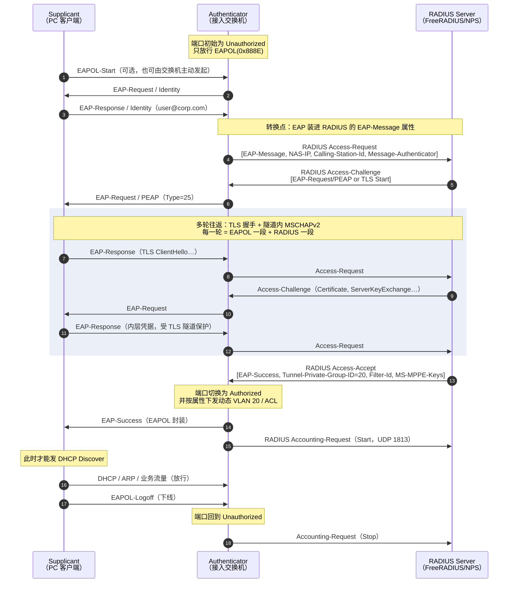
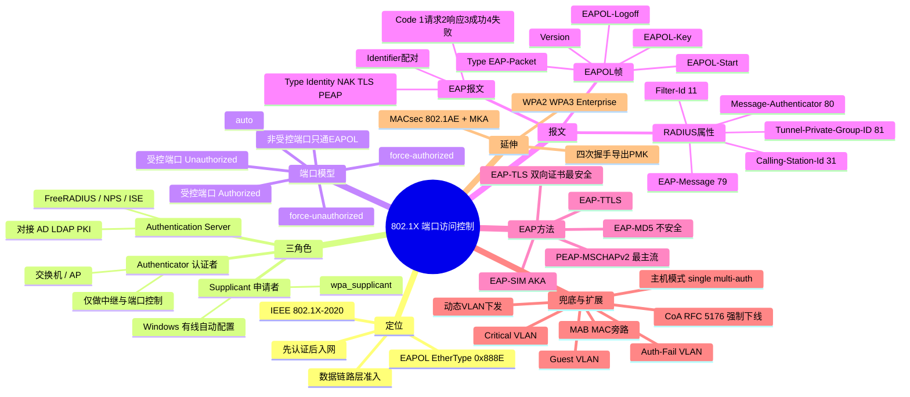

## 1. 工作原理

### 1.1 三个角色

| 角色 | 中文 | 承担者 | 职责 |
|------|------|--------|------|
| **Supplicant** | 申请者 / 客户端 | PC、手机、打印机上的 802.1X 客户端（Windows 有线自动配置服务、`wpa_supplicant`、macOS 内置） | 提供身份与凭据，与认证服务器进行 EAP 会话 |
| **Authenticator** | 认证者 / 接入设备 | 接入交换机、无线 AP / AC、NAS | **控制端口开关**；在 EAPOL 与 RADIUS 之间做报文转换与中继；**不判断凭据对错** |
| **Authentication Server** | 认证服务器 | FreeRADIUS、Microsoft NPS、Cisco ISE、华为 Agile Controller | 真正校验身份（查 AD/LDAP/证书/数据库），返回接受或拒绝，并下发授权策略 |

> **关键理解**：Supplicant 与 Authentication Server 之间是**端到端的 EAP 会话**，Authenticator 只是中间的"翻译工"。EAP 内容（比如 TLS 握手）对交换机而言是不透明的字节流。这就是为什么升级到新的 EAP 方法**不需要更换交换机**。

### 1.2 受控端口与非受控端口

802.1X 把一个物理端口在逻辑上拆成两个：

| 逻辑端口 | 状态 | 通过的流量 |
|---------|------|-----------|
| **非受控端口 Uncontrolled Port** | 永远开放 | **只有 EAPOL 帧**（EtherType 0x888E） |
| **受控端口 Controlled Port** | 认证前 **Unauthorized（未授权）**；认证后 **Authorized（已授权）** | 未授权时：**丢弃全部业务流量**（ARP、DHCP、IP 一律不通）；已授权时：正常转发 |

端口授权模式（`authentication port-control`）：

- `force-unauthorized`：强制关闭，任何设备都不能通过（用于封禁端口）；
- `auto`：**标准模式**，依认证结果决定（生产环境默认）；
- `force-authorized`：强制开放，等同于不做认证（用于上联口、服务器口）。

### 1.3 认证的两段协议

```
[Supplicant] ←── EAP over LAN (EAPOL, 0x888E) ──→ [Authenticator] ←── EAP over RADIUS (UDP 1812) ──→ [RADIUS Server]
                        二层，无 IP                                        三层，需路由可达
```

Authenticator 的转换工作非常机械：把收到的 EAP 报文原样塞进 RADIUS 的 `EAP-Message` 属性（超过 253 字节则拆成多个属性），加上 `NAS-IP-Address`、`NAS-Port`、`Calling-Station-Id`（客户端 MAC）等上下文，附上 `Message-Authenticator` 校验后发出；反向亦然。

## 2. 报文 / 头部结构

### 2.1 EAPOL 帧格式（IEEE 802.1X）

```
| 以太网头 14B | EAPOL 头 4B | EAPOL Body（可变） | [Padding] | FCS |
                └ Version 1B | Type 1B | Body Length 2B ┘
```

| 字段 | 长度 | 含义 |
|------|------|------|
| **目的 MAC** | 6 B | 通常为 **PAE 组播地址 `01:80:C2:00:00:03`**（Nearest Non-TPMR Bridge），保证不被网桥转发出本链路 |
| **EtherType** | 2 B | **`0x888E`** |
| **Protocol Version** | 1 B | `1`=802.1X-2001，`2`=802.1X-2004，`3`=802.1X-2010（含 MACsec/MKA） |
| **Packet Type** | 1 B | EAPOL 帧类型，见下表 |
| **Packet Body Length** | 2 B | Body 字节数；对无 Body 的类型（如 Start、Logoff）为 `0` |
| **Packet Body** | 可变 | 按类型承载 EAP 报文或密钥数据 |

**EAPOL Packet Type 取值**：

| 值 | 名称 | 用途 |
|----|------|------|
| `0x00` | **EAP-Packet** | 承载一个完整的 EAP 报文（认证过程中绝大多数帧） |
| `0x01` | **EAPOL-Start** | 客户端主动发起认证（发给 `01:80:C2:00:00:03`） |
| `0x02` | **EAPOL-Logoff** | 客户端主动下线，端口回到未授权状态 |
| `0x03` | **EAPOL-Key** | 承载密钥信息（WPA/WPA2 四次握手、MACsec MKA 均用它） |
| `0x04` | EAPOL-Encapsulated-ASF-Alert | 传递告警（罕用） |

### 2.2 EAP 报文格式（RFC 3748）

```
| Code 1B | Identifier 1B | Length 2B | Data（Type 1B + Type-Data） |
```

| 字段 | 长度 | 含义 |
|------|------|------|
| **Code** | 1 B | `1`=**Request**（服务器问），`2`=**Response**（客户端答），`3`=**Success**，`4`=**Failure** |
| **Identifier** | 1 B | 请求与响应的配对序号，防止串包与重放混淆 |
| **Length** | 2 B | 整个 EAP 报文长度（含头部） |
| **Type** | 1 B | 仅 Request/Response 有。认证方法类型，见下表 |
| **Type-Data** | 可变 | 该方法的具体数据（如身份字符串、TLS 记录分片） |

**常见 EAP Type**：

| Type | 名称 | 说明 |
|------|------|------|
| `1` | **Identity** | 询问/回答用户名，认证第一步 |
| `2` | Notification | 向用户显示提示信息 |
| `3` | **NAK** | 客户端拒绝服务器建议的方法，并提出自己支持的方法（协商关键） |
| `4` | MD5-Challenge | 挑战/响应，**不安全**（明文可被字典攻击、不支持双向认证、无密钥导出），无线禁用 |
| `13` | **EAP-TLS** | 双向证书认证，**安全性最高**（RFC 5216） |
| `21` | EAP-TTLS | 服务器证书 + 隧道内任意内层认证 |
| `25` | **PEAP** | 服务器证书建 TLS 隧道，隧道内跑 MSCHAPv2，**企业部署最广** |
| `26` | MSCHAPv2 | 常作为 PEAP 的内层方法 |
| `18` / `23` / `50` | EAP-SIM / AKA / AKA' | 运营商 SIM 卡认证 |

### 2.3 关键 RADIUS 属性

| 属性 | 编号 | 作用 |
|------|------|------|
| `User-Name` | 1 | 身份标识（外层 Identity） |
| `NAS-IP-Address` | 4 | 认证者 IP，服务器据此识别接入设备 |
| `NAS-Port` / `NAS-Port-Id` | 5 / 87 | 具体端口，用于定位物理位置 |
| `Calling-Station-Id` | 31 | **客户端 MAC 地址**（排错必看） |
| `EAP-Message` | 79 | **承载 EAP 报文**，超 253 字节则多属性串联 |
| `Message-Authenticator` | 80 | HMAC-MD5 完整性校验，携带 EAP 时**必须**存在 |
| `Tunnel-Type` / `Tunnel-Medium-Type` / `Tunnel-Private-Group-ID` | 64 / 65 / 81 | 三者组合下发**动态 VLAN**（分别取 `VLAN(13)` / `IEEE-802(6)` / VLAN 号或名） |
| `Filter-Id` | 11 | 下发 ACL 名称 |
| `Session-Timeout` / `Termination-Action` | 27 / 29 | 会话超时与超时后动作（重认证或断开） |

## 3. 交互流程



**失败路径**：服务器返回 `Access-Reject` → 认证者转成 `EAP-Failure` 发给客户端，端口保持未授权；此时可按配置进入 **Guest VLAN**（无客户端响应时）或 **Auth-Fail VLAN / Restricted VLAN**（认证失败时）。

## 4. 关键机制

### 4.1 EAP 方法选型对比

| 方法 | 服务器证书 | 客户端证书 | 安全性 | 部署复杂度 | 适用场景 |
|------|-----------|-----------|--------|-----------|---------|
| **EAP-MD5** | 否 | 否 | **低**（明文挑战、单向认证、不导出密钥） | 极低 | 仅限有线且低安全要求；**无线禁用** |
| **PEAP-MSCHAPv2** | **需要** | 否 | 中高 | 中（只需服务器证书 + 域账号） | **企业最主流**：与 AD 集成，员工用域账号登录 |
| **EAP-TTLS** | 需要 | 否 | 中高 | 中 | 内层可用 PAP/CHAP，便于对接旧有认证库 |
| **EAP-TLS** | 需要 | **需要** | **最高**（双向证书、抗钓鱼） | 高（需 PKI 与证书分发） | 高安全场景、物联网设备、零信任架构 |
| **EAP-SIM/AKA** | — | SIM 卡 | 高 | 依赖运营商 | 运营商 Wi-Fi 无感知接入 |

> **安全要点**：PEAP/TTLS 场景下，客户端**必须校验服务器证书**（勾选"验证服务器证书"并指定受信任 CA 与服务器名）。否则攻击者可架设同名 SSID 的假 RADIUS，诱骗客户端泄露 MSCHAPv2 挑战响应并离线破解。

### 4.2 动态 VLAN 下发

认证成功后由 RADIUS 三个属性组合指定 VLAN，实现"策略跟着人走"：

```
Tunnel-Type = VLAN (13)
Tunnel-Medium-Type = IEEE-802 (6)
Tunnel-Private-Group-Id = "20"      # VLAN ID 或 VLAN 名
```

研发接入即落到研发 VLAN，财务接入落到财务 VLAN，同一个网口对不同人给出不同网络——这是 802.1X 相比静态 VLAN 的最大价值。

### 4.3 无客户端设备的兜底：MAB 与 Guest VLAN

打印机、IP 电话、摄像头、老旧设备往往**没有 802.1X 客户端**，需要兜底策略：

| 机制 | 触发条件 | 说明 |
|------|---------|------|
| **MAB（MAC Authentication Bypass）** | 端口在 `tx-period × max-reauth-req` 后仍无 EAPOL 响应 | 交换机把设备 MAC 当作用户名/密码发给 RADIUS 查白名单。**安全性弱**（MAC 可伪造），应配合限制 VLAN |
| **Guest VLAN** | 客户端**完全不响应** EAPOL | 放进受限访客网络，通常只能上外网 |
| **Auth-Fail / Restricted VLAN** | 客户端响应了但**认证失败** | 放进修复网络（如只能访问补丁服务器、自助改密页） |
| **Critical VLAN / Inaccessible Bypass** | **RADIUS 服务器不可达** | 避免服务器宕机造成全网断网，临时放行到指定 VLAN。**生产环境强烈建议配置** |

优先级配置示例（Cisco IBNS）：`dot1x` 优先，超时降级 `mab`，再失败进 Guest VLAN。

### 4.4 端口主机模式（Host Mode）

| 模式 | 允许接入 | 场景 |
|------|---------|------|
| `single-host` | 端口下仅 1 个 MAC | 最严格，一人一口 |
| `multi-host` | 首个通过认证后，**该端口所有设备都放行** | 便捷但有搭便车风险 |
| `multi-domain` | 1 个数据域 + 1 个语音域（各 1 台） | **IP 电话串接 PC** 的标准方案 |
| `multi-auth` | 每个 MAC **独立认证**、独立授权 | 端口下接哑集线器/虚拟机，安全性最好 |

### 4.5 重认证与会话维护

- **周期性重认证**：`Session-Timeout` + `Termination-Action=RADIUS(1)` 或交换机本地 `dot1x timeout reauth-period`，定期确认用户仍合法。
- **链路 down 即下线**：网线拔出时端口立刻回到未授权（防止"认证后换设备"）。
- **CoA（RFC 5176）**：RADIUS 服务器可主动下发 **Change of Authorization** 或 **Disconnect-Message**（UDP 3799），实现管理员强制下线、动态改 VLAN、隔离失陷终端——这是 NAC 联动的关键能力。

### 4.6 与 WPA2/WPA3-Enterprise 的衔接

无线场景 EAP 成功后，服务器与客户端各自导出 **MSK（Master Session Key）**，服务器通过 `MS-MPPE-Recv-Key/Send-Key` 属性把 PMK 送给 AP，随后 AP 与客户端执行 **四次握手（用 EAPOL-Key 帧承载）** 派生 PTK/GTK，开始加密通信。也就是说：**WPA2-Enterprise ≈ 802.1X 认证 + 四次握手密钥协商**。

## 5. 知识框架


