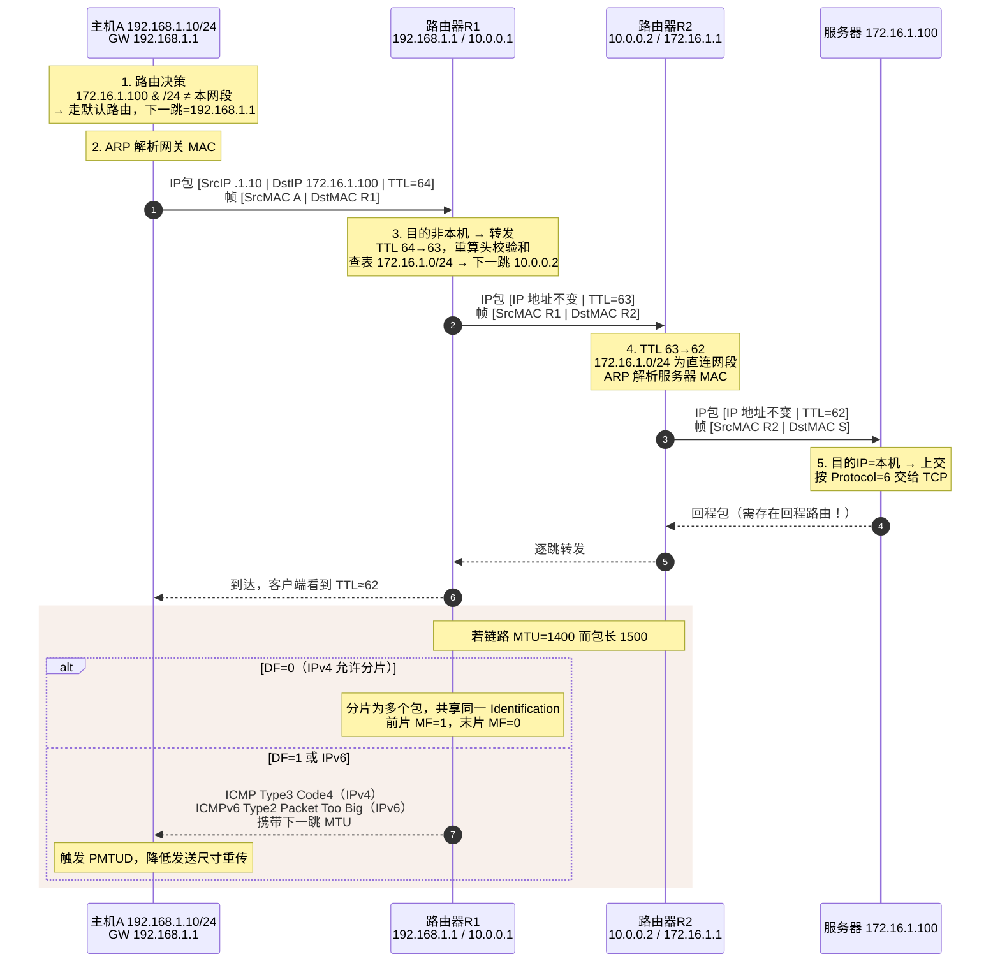
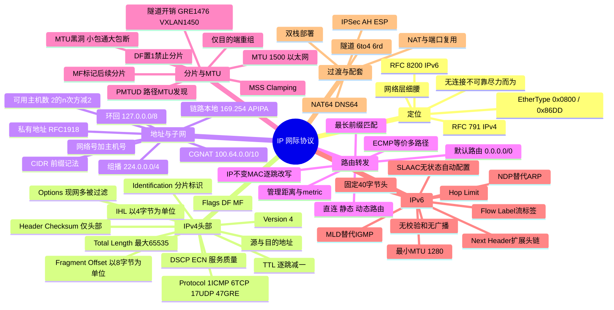

## 🚀 先建立直觉

IP 干的事，就是**让一个包在陌生的网络里一站一站往目的地挪**。

想象你把包裹交给快递点。快递员不知道收件人住哪，也不关心；他只知道"这个方向的件先送到市里的分拣中心"。分拣中心拆开外袋看一眼地址，说"这该发去省外"，换个袋子继续送。就这样一站接一站，直到最后一个网点认出"这是我片区的"，才真正送到门口。

三个要点先记牢：**没有人掌握全程路线**，每一站只做一个决定——下一站给谁；**面单上的地址全程不变**，换的只是外面那层袋子；**这是平邮不是挂号**，尽力送，但不签收、不承诺、丢了也不告诉你。

## 🤔 它解决什么问题

同一间办公室里传东西很简单，喊一嗓子就行。可一旦要跨楼、跨城、跨国，问题就来了：

- **各家的"地址格式"不一样**。以太网、Wi-Fi、光纤、蜂窝，各有各的一套编号方式，互相看不懂。总得有一套大家公认的、跟具体线路无关的地址。
- **没人记得住全世界**。如果每台路由器都要背下全球每一台设备在哪，路由表早就爆了。必须能"按片区归纳"——只记住"这一整个网段往那边走"。
- **各家的"最大包裹尺寸"不一样**。有的线路一次只能过 1500 字节，有的更小。得有办法屏蔽这种差异。
- **可能会绕圈**。网络拓扑一变就可能形成环，包在里面无限打转。必须有个"最多走多少站"的硬性限制。

IP 就是为这四件事而生的：**给出一套统一的、可归纳的地址；让每一跳只做局部决策就能把包推向目的地；用统一的数据报抽象屏蔽底层差异；用一个跳数计数器兜住环路**。

## 🔄 工作流程（简化版）

先记住这条主线，后面所有细节都挂在它上面：

1. **看看是不是给我的**：收到一个包，先判断目的地址是不是自己。是，就交给上层处理，流程结束。
2. **不是我的就减一次寿命**：跳数计数器减 1。减到 0 说明这包走太久了，八成在绕圈——直接丢掉，并回一条超时告知。
3. **查表定下一站**：拿目的地址去路由表里找"最贴合的那一条"，得出下一跳给谁、从哪个口出去。一条都找不到，丢弃并回不可达。
4. **看看包会不会超尺寸**：出口线路装不下这么大的包时，要么切开（IPv4 允许时），要么丢弃并告诉发送方"你的包太大了"。
5. **换袋子发出去**：把下一跳的地址翻译成对应链路的物理地址，重新封装成帧发走。

下面三小节是这条主线的完整细节。

### 1.1 转发的核心循环

IP 转发在每一跳上重复执行同一套动作：

1. **收包与校验**：校验 IPv4 头部校验和（IPv6 无此步）、检查版本与头长度合法性；
2. **判断是否本机**：目的 IP 属于本机地址 → 上交给上层协议（按 Protocol 字段分发给 TCP/UDP/ICMP）；否则进入转发流程；
3. **TTL 递减**：TTL−1，若结果为 0 → 丢弃并回 **ICMP Time Exceeded（Type 11）**；
4. **查路由表**：按**最长前缀匹配（Longest Prefix Match）**选出下一跳与出接口；无匹配则丢弃并回 **ICMP Destination Unreachable（Type 3, Code 0/1）**；
5. **MTU 检查**：包长 > 出接口 MTU 时，IPv4 若 DF=0 则分片，DF=1 则丢弃并回 **ICMP Type 3 Code 4**（Fragmentation Needed）；IPv6 一律丢弃并回 **ICMPv6 Type 2**（Packet Too Big）；
6. **重算校验和**（IPv4，因 TTL 变了）；
7. **二层封装**：用 ARP/NDP 解析下一跳 MAC，封装成帧发出。

> **不变量**：整条路径上**源/目的 IP 保持不变**（NAT 除外），而**源/目的 MAC 每一跳都被改写**。这是理解网络转发的第一原则。

### 1.2 路由决策与最长前缀匹配

**一句话**：多条路都通向罗马时，选"描述得最具体"的那一条——越具体的路由，说明越了解目的地。

主机/路由器收到待发包时，用目的 IP 与路由表每条路由的掩码做按位与，比较是否等于该路由的网络号；命中多条时，**选前缀最长（掩码最长）的那条**。

```
路由表示例：
10.0.0.0/8      via 192.168.1.1   dev eth0
10.1.0.0/16     via 192.168.1.2   dev eth0
10.1.2.0/24     via 192.168.1.3   dev eth0
0.0.0.0/0       via 192.168.1.254 dev eth0    ← 默认路由（前缀最短，兜底）

目的 10.1.2.9 → 三条都匹配，选 /24 → 下一跳 192.168.1.3
目的 10.1.9.9 → 匹配 /8 与 /16，选 /16 → 下一跳 192.168.1.2
目的 8.8.8.8  → 只匹配 /0 → 走默认路由
```

优先级依次为：**最长前缀匹配 → 路由协议管理距离（AD）→ 度量值 metric → 等价多路径（ECMP）哈希**。

### 1.3 地址结构与 CIDR

**一句话**：一个 IP 地址其实是"小区名 + 门牌号"两段拼起来的，掩码就是划这条分界线的那把尺子。

IP 地址 = **网络号 + 主机号**，由子网掩码划界。CIDR（RFC 4632）废弃了传统 A/B/C 类划分，改用 `前缀长度` 记法。

> **看这张表前先记住**：前缀数字越大，切出来的网段越小、能装的主机越少。日常记住三个锚点就够——`/24` 是最常见的局域网（254 台）、`/30` 用于两台设备对接（2 台）、`/32` 表示"就这一个地址"。

| 记法 | 掩码 | 总地址数 | 可用主机数 | 典型用途 |
|------|------|---------|-----------|---------|
| /8 | 255.0.0.0 | 16,777,216 | 16,777,214 | 大型私网 `10.0.0.0/8` |
| /16 | 255.255.0.0 | 65,536 | 65,534 | 园区网 `172.16.0.0/16` |
| /24 | 255.255.255.0 | 256 | **254** | 最常见的局域网 |
| /25 | 255.255.255.128 | 128 | 126 | 子网划分 |
| /30 | 255.255.255.252 | 4 | **2** | 点对点链路 |
| /31 | 255.255.255.254 | 2 | 2（RFC 3021） | 点对点链路省地址 |
| /32 | 255.255.255.255 | 1 | 1 | 主机路由、Loopback、VIP |

**可用主机数 = 2^(32−前缀) − 2**（减去网络地址与广播地址；/31、/32 为特例）。

> **看这张表前先记住**：这些地址段都是"有特殊身份、不能当普通地址用"的。排错时价值最高的是 `169.254.0.0/16`——**看到它基本等于没拿到地址**。

**特殊地址速查**：

| 地址块 | 含义 | RFC |
|--------|------|-----|
| `10.0.0.0/8`、`172.16.0.0/12`、`192.168.0.0/16` | **私有地址**，不在公网路由 | RFC 1918 |
| `127.0.0.0/8` | 环回，`127.0.0.1` 为 localhost | RFC 1122 |
| `169.254.0.0/16` | **链路本地（APIPA）**，DHCP 失败时自动配置——见到它基本等于"没拿到地址" | RFC 3927 |
| `224.0.0.0/4` | 组播（`224.0.0.1` 全主机、`224.0.0.2` 全路由器） | RFC 5771 |
| `255.255.255.255` | 受限广播，不被路由器转发 | RFC 919 |
| `100.64.0.0/10` | 运营商级 NAT（CGNAT）共享地址 | RFC 6598 |
| `0.0.0.0/8` | 本网络/未指定（DHCP Discover 的源地址） | RFC 1122 |

## 📦 报文 / 头部长什么样

### 2.1 IPv4 头部（RFC 791，基本 20 字节，最长 60 字节）

> **看这张表前先记住**：20 个字节可以按行分成五组——**第一行管"我多长、我什么优先级"，第二行整行都在管分片，第三行管"还能活多久、我里面装的是什么协议"，第四五行是源和目的地址**。真正天天要看的只有四个：TTL、Protocol、DF/MF、Total Length。

```
 0                   1                   2                   3
 0 1 2 3 4 5 6 7 8 9 0 1 2 3 4 5 6 7 8 9 0 1 2 3 4 5 6 7 8 9 0 1
+-+-+-+-+-+-+-+-+-+-+-+-+-+-+-+-+-+-+-+-+-+-+-+-+-+-+-+-+-+-+-+-+
|Version|  IHL  |     DSCP  |ECN|          Total Length         |
+-+-+-+-+-+-+-+-+-+-+-+-+-+-+-+-+-+-+-+-+-+-+-+-+-+-+-+-+-+-+-+-+
|         Identification        |Flags|      Fragment Offset    |
+-+-+-+-+-+-+-+-+-+-+-+-+-+-+-+-+-+-+-+-+-+-+-+-+-+-+-+-+-+-+-+-+
|  Time to Live |    Protocol   |         Header Checksum       |
+-+-+-+-+-+-+-+-+-+-+-+-+-+-+-+-+-+-+-+-+-+-+-+-+-+-+-+-+-+-+-+-+
|                       Source Address                          |
+-+-+-+-+-+-+-+-+-+-+-+-+-+-+-+-+-+-+-+-+-+-+-+-+-+-+-+-+-+-+-+-+
|                    Destination Address                        |
+-+-+-+-+-+-+-+-+-+-+-+-+-+-+-+-+-+-+-+-+-+-+-+-+-+-+-+-+-+-+-+-+
|                    Options (可选)             |    Padding    |
+-+-+-+-+-+-+-+-+-+-+-+-+-+-+-+-+-+-+-+-+-+-+-+-+-+-+-+-+-+-+-+-+
```

| 字段 | 位数 | 含义与要点 |
|------|------|-----------|
| **Version** — 版本号 | 4 | 版本号，IPv4 = `4` |
| **IHL**（头部长度） | 4 | 以 **4 字节为单位**。最小 `5`（=20 字节，无选项），最大 `15`（=60 字节）。**排错要点**：IHL>5 说明带 Options |
| **DSCP** — 差分服务码点 | 6 | 差分服务码点（RFC 2474），QoS 分级。如 `EF(46)` 语音、`AF41(34)` 视频、`CS0(0)` 尽力而为 |
| **ECN** — 显式拥塞通知 | 2 | 显式拥塞通知（RFC 3168）。`00` 不支持，`01/10` 支持，`11` = **CE 已遭遇拥塞** |
| **Total Length** — 总长度 | 16 | **整个 IP 包**（头 + 数据）字节数，最大 65535。以太网上通常 ≤ 1500 |
| **Identification** — 标识符 | 16 | 标识符，**同一原始数据报的所有分片共享同一 ID**，用于重组。RFC 6864 规定不分片包该字段无语义 |
| **Flags** — 标志位 | 3 | bit0 保留(0)；bit1 = **DF（Don't Fragment）**，置 1 禁止分片；bit2 = **MF（More Fragments）**，置 1 表示后面还有分片 |
| **Fragment Offset** — 分片偏移 | 13 | 本分片数据在原始数据报中的偏移，**以 8 字节为单位**（所以除最后一片外，各片数据长度必须是 8 的倍数） |
| **TTL** — 生存时间 | 8 | 生存时间，每跳减 1，减到 0 丢弃。初值可用于**推断操作系统**：Linux/macOS 64，Windows 128，部分网络设备 255 |
| **Protocol** — 上层协议号 | 8 | 上层协议号：`1` ICMP、`2` IGMP、`6` TCP、`17` UDP、`41` IPv6-in-IPv4、`47` GRE、`50` ESP、`51` AH、`89` OSPF、`112` VRRP |
| **Header Checksum** — 头部校验和 | 16 | **仅校验头部**，不含数据。每跳因 TTL 变化必须重算 |
| **Source Address** — 源地址 | 32 | 源 IP |
| **Destination Address** — 目的地址 | 32 | 目的 IP |
| **Options** — 选项 | 可变 | 选项：记录路由(7)、时间戳(68)、宽松/严格源路由(131/137)。**现网普遍被丢弃或过滤**，源路由更因安全原因被禁 |

### 2.2 IPv6 头部（RFC 8200，固定 40 字节）

> **看这张表前先记住**：IPv6 头部是"**做减法 + 做加法**"的结果——减掉了校验和、减掉了分片相关字段、把长度固定成 40 字节让转发更快；加上了 Flow Label（流标签）和 Next Header（扩展头链）这套可插拔机制。对照上一张 IPv4 表横着看，差异一目了然。

| 字段 | 位数 | 含义 |
|------|------|------|
| **Version** — 版本号 | 4 | = `6` |
| **Traffic Class** — 流量类别 | 8 | 等同 IPv4 的 DSCP+ECN |
| **Flow Label** — 流标签 | 20 | **IPv6 新增**，标识同一数据流，便于 ECMP 哈希与 QoS，无需解析上层端口 |
| **Payload Length** — 载荷长度 | 16 | **仅载荷**长度（不含 40 字节固定头，但**含扩展头**）。注意与 IPv4 的 Total Length 语义不同 |
| **Next Header** — 下一个头部类型 | 8 | 下一个头的类型：可以是上层协议号（6/17/58）或**扩展头**编号 |
| **Hop Limit** — 跳数限制 | 8 | 等同 TTL，名字更准确 |
| **Source Address** — 源地址 | 128 | 源地址 |
| **Destination Address** — 目的地址 | 128 | 目的地址 |

**IPv6 扩展头**以链表形式串接，按推荐顺序：逐跳选项(0) → 目的选项(60) → 路由(43) → **分片(44)** → AH(51) → ESP(50) → 上层。**除逐跳选项外，中间路由器不处理扩展头**，大幅提升转发效率。

**IPv6 地址速查**：`::1/128` 环回、`fe80::/10` 链路本地（每接口必备）、`fc00::/7` 唯一本地（ULA）、`2000::/3` 全球单播、`ff00::/8` 组播（`ff02::1` 全节点、`ff02::2` 全路由器、`ff02::1:ff00:0/104` 被请求节点组播）。**IPv6 没有广播**，全部用组播替代。

## 🔀 交互时序

> **一句话看懂这张图**：从上往下看，**两个 IP 地址一路没变过，两个 MAC 地址每一跳全换了，TTL 一跳掉一格**；最下面那个色块讲的是"包太大时会怎样"——能切就切，不能切就退回来告诉你"太大了"。



## 🔧 关键机制 / 变体

### 4.1 分片与重组

**这是干什么的**：解决"包裹太大，塞不进这条线路"的问题——把一个大包裹拆成几个小包裹分别寄，到了目的地再拼回来。听起来很合理，实际上麻烦一堆，所以现网能不用就不用。

当 IP 包大于出接口 MTU（以太网典型 1500 字节）时需要分片。

**分片规则**：

- 除最后一片外，每片数据长度必须是 **8 的倍数**（因为 Fragment Offset 以 8 字节计量）；
- 所有分片**复制原 IP 头**，但 `Fragment Offset`、`MF`、`Total Length`、`Header Checksum` 各自不同；
- 同一原始数据报的所有分片共享同一 **Identification**；
- **只有目的主机重组**，中间路由器不做重组（避免状态与性能开销）。

**示例**：3000 字节的 IP 包（20 头 + 2980 数据）经 MTU=1500 链路：

| 分片 | 数据长度 | Total Length | Offset（8字节单位） | MF |
|------|---------|-------------|-------------------|-----|
| #1 | 1480 | 1500 | 0 | 1 |
| #2 | 1480 | 1500 | 185（=1480/8） | 1 |
| #3 | 20 | 40 | 370（=2960/8） | 0 |

**分片的危害**：任一分片丢失则整个数据报作废（上层需重传全部）；重组消耗内存且有超时（Linux 默认 30 秒）；防火墙/负载均衡难以读取被切在后续分片中的传输层端口；历史上存在 Teardrop、Ping of Death 等攻击。**结论：现网应尽量避免分片**，这也是 IPv6 取消中间分片的原因。

### 4.2 PMTUD（路径 MTU 发现）

**这是干什么的**：与其让中间设备偷偷把包切碎，不如让发送方**提前问清楚"这一路最多能过多大的包"**，然后自己按这个尺寸发。前提是——中途那句"你的包太大了"必须能传回来。

发送方设置 **DF=1**，若路径中某链路 MTU 不足，该路由器丢包并回 **ICMP Type 3 Code 4**（携带下一跳 MTU），发送方据此调小发送尺寸。IPv6 用 **ICMPv6 Type 2 Packet Too Big**（RFC 8201）。

**MTU 黑洞（PMTU Black Hole）**：如果中间防火墙**粗暴地把所有 ICMP 全部丢弃**，发送方永远收不到"包太大"的通知，表现为：**小包（ping、SSH 登录）正常，大包（网页加载、文件传输、TLS 握手证书交换）卡死超时**。这是生产环境最经典的疑难故障之一。

**常见 MTU 值**：以太网 1500；PPPoE 1492；GRE 隧道 1476；IPSec 隧道约 1400–1438；VXLAN 1450；巨帧 9000。TCP 会用 **MSS = MTU − IP头 − TCP头**（以太网上典型 1460）在握手时协商，并可由中间设备做 **MSS Clamping** 强制钳制。

### 4.3 TTL 的作用与妙用

**这是干什么的**：本职工作只有一个——**防止包在环路里永远转下去**。但因为"每过一跳减一"这个特性太好用，被人挖出了一堆副业：量跳数、猜操作系统、限制传播范围，连 traceroute 都是拿它做出来的。

- **防环**：拓扑震荡产生环路时，TTL 保证包最多走有限跳数。
- **traceroute 原理**：依次发送 TTL=1、2、3… 的探测包，每台路由器在 TTL 归零时回 ICMP Time Exceeded，从而逐跳"点亮"路径。
- **OS 指纹推断**：收到包的 TTL 反推初值（64/128/255 中最接近的更大值），差值即跳数。如收到 TTL=57，初值大概率 64，说明经过 7 跳，源端很可能是 Linux。
- **限定传播范围**：TTL=1 的组播/协议报文（如 OSPF Hello、VRRP）只在本链路有效，不会被转发出去。

### 4.4 校验和：IPv4 有、IPv6 无

**这是干什么的**：讨论"要不要在每一跳都花力气检查一遍头部有没有出错"。IPv4 说要，IPv6 说这是重复劳动、砍掉。

IPv4 头部校验和采用**反码求和**，只覆盖头部。IPv6 **彻底取消**了它，理由：

1. 链路层（以太网 FCS）已提供错检；
2. 传输层（TCP/UDP）校验和覆盖了包括伪首部在内的端到端数据；
3. 每跳重算是昂贵的性能负担。

**副作用**：IPv6 下 **UDP 校验和不再可选**，必须计算（RFC 8200），否则数据无任何保护。

### 4.5 IPv4 与 IPv6 全面对比

**这是干什么的**：把两代协议放在一张表里横着看——IPv6 不只是"地址变长了"，它顺手重新设计了分片、校验、广播、地址解析、自动配置等一整套机制。

| 维度 | **IPv4（RFC 791）** | **IPv6（RFC 8200）** |
|------|--------------------|---------------------|
| 地址长度 | 32 位（约 43 亿） | 128 位（约 3.4×10³⁸） |
| 地址表示 | 点分十进制 `192.168.1.1` | 冒号十六进制 `2001:db8::1`（`::` 压缩连续 0，仅可用一次） |
| 头部长度 | **20–60 字节**（可变，含 Options） | **固定 40 字节** + 扩展头链 |
| 头部校验和 | 有，每跳重算 | **无** |
| 分片 | 源端与**中间路由器**均可 | **仅源端**，用分片扩展头；中间遇大包丢弃并回 ICMPv6 Type 2 |
| PMTUD | 可选（常被 ICMP 过滤破坏） | **必需**，最小 MTU 1280 |
| 广播 | 有（`255.255.255.255`、定向广播） | **无广播**，全部用组播/任播替代 |
| 地址解析 | ARP（二层广播） | **NDP**（ICMPv6 NS/NA，组播） |
| 地址自动配置 | DHCP（有状态） | **SLAAC**（无状态，RA + 前缀）/ DHCPv6 |
| 组播管理 | IGMP（独立协议，Protocol=2） | **MLD**（集成在 ICMPv6 内） |
| IPSec | 可选附加 | 架构上原生集成（作为扩展头） |
| QoS 标记 | DSCP + ECN | Traffic Class + **Flow Label** |
| NAT | 广泛依赖（地址枯竭） | 原则上不需要，恢复端到端可达 |
| 上层协议字段 | Protocol | Next Header |
| TTL 字段名 | Time to Live | Hop Limit |

**过渡技术**：双栈（Dual Stack，最主流）、隧道（6to4、6rd、Teredo、GRE）、翻译（NAT64 + DNS64、464XLAT）。

## ⚠️ 常见误区

- **误区一："数据包沿途 IP 和 MAC 都在变。"**
  只对了一半。**源/目的 IP 全程不变**（NAT 除外），**源/目的 MAC 每一跳都被改写**。这是理解转发的第一原则，也是面试最爱问的一句。

- **误区二："IP 头部有校验和，所以数据出错能查出来。"**
  错。IPv4 头部校验和**只保护头部，不保护数据**；数据的完整性靠 TCP/UDP 校验和。而 IPv6 干脆把头部校验和取消了——顺带导致 **IPv6 下 UDP 校验和从可选变成强制**。

- **误区三："traceroute 中间出现 `* * *` 就是那一跳坏了。"**
  不一定。很多路由器会限速或禁用 ICMP Time Exceeded 回复，它转发照常，只是不"报到"。判断标准是**最终目的是否可达**，而不是中间有没有星号。

- **误区四："包太大就自动分片了，没什么大不了。"**
  代价很大：任一分片丢失整个数据报作废，丢包影响被放大；重组消耗内存还有超时；防火墙读不到被切到后续分片里的端口信息；历史上还有 Teardrop、Ping of Death 这类攻击。所以现网应尽量避免分片，IPv6 更是直接取消了中间设备分片。

- **误区五："ICMP 是诊断用的，全禁掉最安全。"**
  这是 MTU 黑洞的头号成因。DF=1 的包遇到小 MTU 链路时，靠 **ICMP Type 3 Code 4** 把"包太大"的消息带回来；全禁之后发送方永远收不到通知，表现为**小包正常、大包卡死**。IPv6 下更严重——ICMPv6 还承载着 NDP、MLD、PMTUD。

- **误区六："`/24` 有 256 个地址，所以能接 256 台机器。"**
  是 **254** 台。要减去主机位全 0 的**网络地址**和主机位全 1 的**广播地址**。特例是 `/31`（RFC 3021，点对点链路可用 2 个）和 `/32`（主机路由）。

## 🧠 速记口诀

> **转发口诀**：**IP 不变，MAC 逐跳换；TTL 走一跳减一格，减到零就退回来。**

> **选路口诀**：**先比谁更具体（最长前缀），再比谁更可信（管理距离），最后比谁更划算（metric），还打平就分着走（ECMP）。**

> **分片口诀**：**偏移按 8 算，中间片长度必是 8 的倍数；DF 置 1 不许切，MF 置 1 后面还有；只在终点拼，中途绝不管。**

> **MTU 黑洞口诀**：**小包能通大包断，八成 ICMP 被拦断。**

## 🗺️ 知识框架


