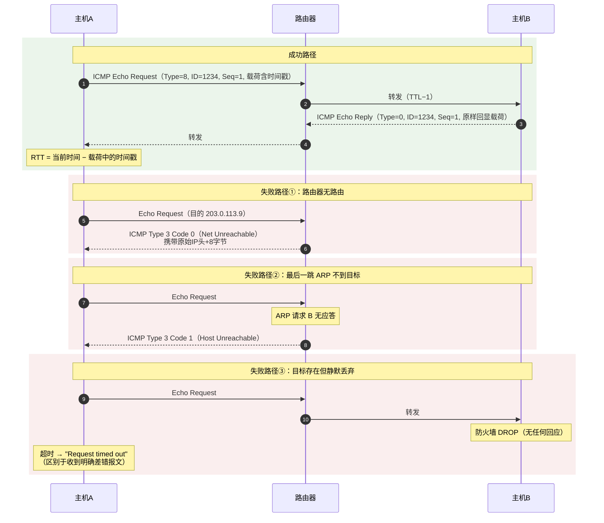
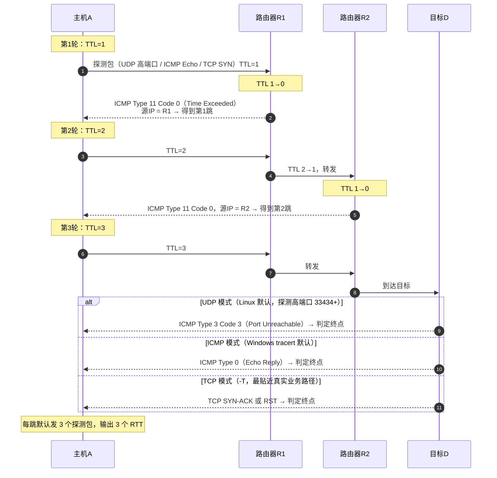
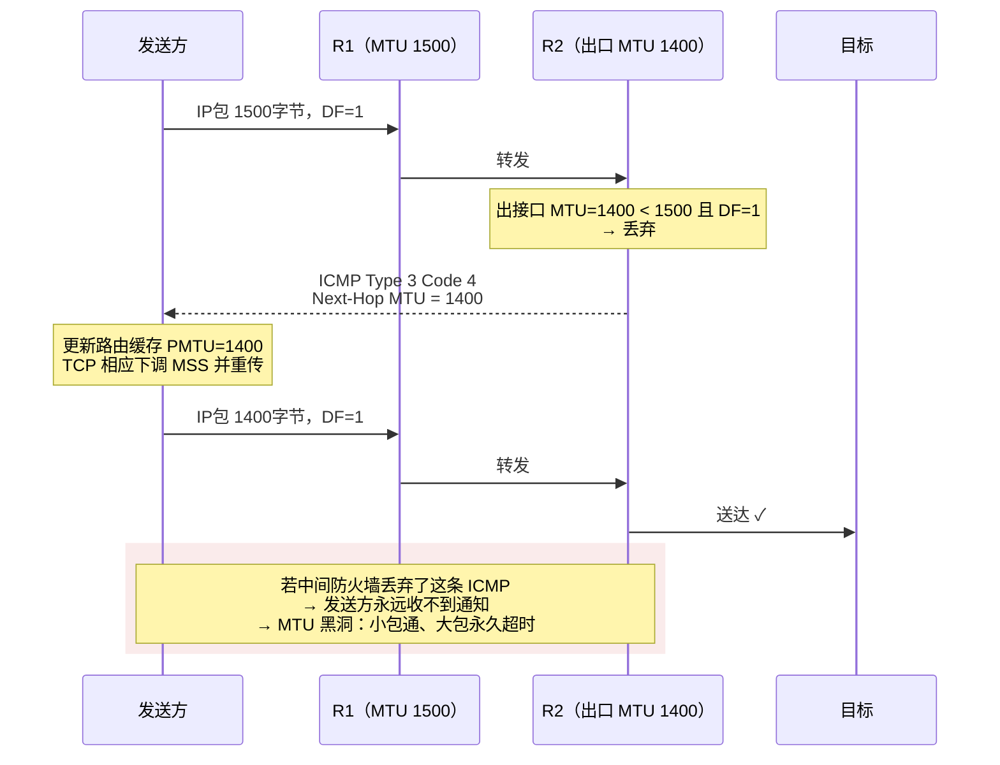
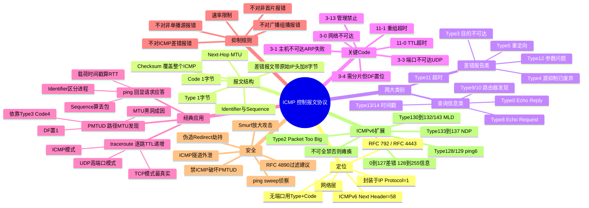

## 🚀 先建立直觉

先别管字段和协议号，用一个画面记住 ICMP 是干嘛的。

想象 IP 是一个**闷头送货、从不说话的快递员**：包裹送到了他不报喜，送不到他也不吭声，收件人永远不知道"为什么没收到"。ICMP 就是贴在包裹上的那张**退件通知单**——通知单上会写清楚"查无此人 / 电话空号 / 地址不存在"，让你一眼看出问题出在哪一类。

再补一刀：ICMP 还顺手提供了 ping（"在吗？在。"）和 traceroute（"你到我家要经过哪几站？"）这两把全网工程师最常用的"体检刀"。所以一句话：**没有 ICMP，IP 网络就是一个黑灯瞎火、坏了也不报修的机器**。

## 🤔 它解决什么问题

IP 是**尽力而为**的：包被丢弃时不通知任何人。这在实际网络中不可接受，会带来三类问题：

1. **故障不可见**：主机不知道包为什么没到——是目标关机？路由缺失？防火墙拦截？还是端口没人监听？ICMP 用 **Type 3 Destination Unreachable** 的不同 Code 精确区分这些原因。
2. **无法探测与诊断**：需要一种轻量方式验证"某个 IP 是否可达""路径经过哪些跳"。ICMP 提供 **Echo Request/Reply（Type 8/0）** 与 **Time Exceeded（Type 11）**，直接催生了 `ping` 与 `traceroute`。
3. **参数无法协商**：路径中最小 MTU 是多少？下一跳应该走谁更优？ICMP 用 **Type 3 Code 4（分片需求）** 支撑 PMTUD，用 **Type 5（重定向）** 提示更优下一跳。

> **注意 ICMP 的边界**：它只做**报告**，不做**纠正**。ICMP 告诉你"包丢了"，但不会替你重传——那是 TCP 的职责。ICMP 本身也是不可靠的，其报文同样可能丢失。

## 🔄 工作流程（简化版）

### 两类报文，两种触发方式

| 类别 | 触发方式 | 代表 Type | 特点 |
|------|---------|----------|------|
| **差错报告类** | **被动**产生——路由器/主机在处理 IP 包时遇到问题，向**源地址**回送 | 3（不可达）、4（源抑制，已废弃）、5（重定向）、11（超时）、12（参数问题） | 携带**原始 IP 头 + 前 8 字节数据**作为"案发现场" |
| **查询/信息类** | **主动**发起——诊断工具或主机主动询问 | 0/8（Echo Reply/Request）、13/14（时间戳）、9/10（路由器通告/请求） | 成对出现，用 Identifier + Sequence 配对 |

### 差错报文是怎么产生并送回去的

1. 路由器 R 收到一个 IP 包，处理时发现问题（无路由、TTL 归零、包过大且 DF=1…）；
2. R **丢弃**该包；
3. R 构造一个 ICMP 差错报文，**源 IP = R 的接口地址，目的 IP = 原包的源地址**；
4. 报文体中复制**原始 IP 头 + 原始数据的前 8 字节**；
5. 沿反向路径送回源主机；
6. 源主机内核解析后，**根据那 8 字节中的端口号**定位到具体的套接字，向应用层报错（如 `connect()` 返回 `EHOSTUNREACH`）。

> **为什么恰好是 8 字节？** 因为 TCP/UDP 头部的**前 8 字节**包含源端口(2)+目的端口(2)+（UDP 的长度/校验和，或 TCP 的序号），足以唯一定位一条连接。RFC 1812 建议路由器**尽可能多带**（至少 576 字节的 IP 包），RFC 4884 进一步定义了多部分扩展。

### 抑制规则（RFC 1122 §3.2.2）——防止"报错风暴"

为避免 ICMP 风暴与放大攻击，以下情况**绝不产生** ICMP 差错报文：

1. 对 **ICMP 差错报文本身**（否则两台设备会无限互相报错）；
2. 对目的地址为**广播/组播**的数据报；
3. 对**链路层广播**帧承载的数据报；
4. 对**非第一个分片**（Fragment Offset ≠ 0）；
5. 对**源地址非单播**（如 0.0.0.0、环回、广播、组播）的数据报。

此外，多数实现对 ICMP 差错报文做**速率限制**（Linux 通过 `net.ipv4.icmp_ratelimit`、`icmp_ratemask` 控制）——这正是 `traceroute` 中间跳常出现 `* * *` 的原因之一。

## 📦 报文/头部长什么样

### 通用格式

**看这张表前先记住**：ICMP 报文紧跟在 IP 头之后，最前面 4 字节是固定结构；三个核心字段的中文全称是——Type（类型）、Code（代码）、Checksum（校验和）。"类型"定大类，"代码"定细因，校验和覆盖整个 ICMP 报文。

```
 0                   1                   2                   3
 0 1 2 3 4 5 6 7 8 9 0 1 2 3 4 5 6 7 8 9 0 1 2 3 4 5 6 7 8 9 0 1
+-+-+-+-+-+-+-+-+-+-+-+-+-+-+-+-+-+-+-+-+-+-+-+-+-+-+-+-+-+-+-+-+
|     Type      |     Code      |           Checksum            |
+-+-+-+-+-+-+-+-+-+-+-+-+-+-+-+-+-+-+-+-+-+-+-+-+-+-+-+-+-+-+-+-+
|              其余 4 字节（随 Type 变化）                        |
+-+-+-+-+-+-+-+-+-+-+-+-+-+-+-+-+-+-+-+-+-+-+-+-+-+-+-+-+-+-+-+-+
|                          数据部分                              |
+-+-+-+-+-+-+-+-+-+-+-+-+-+-+-+-+-+-+-+-+-+-+-+-+-+-+-+-+-+-+-+-+
```

| 字段 | 长度 | 含义 |
|------|------|------|
| **Type** | 1 B | 报文大类 |
| **Code** | 1 B | 同一 Type 下的细分原因 |
| **Checksum** | 2 B | 覆盖**整个 ICMP 报文**（头 + 数据）的反码和。注意：与 TCP/UDP 不同，**ICMPv4 校验和不含 IP 伪首部**；**ICMPv6 则包含伪首部** |
| **其余 4 字节** | 4 B | Echo 类：Identifier(2) + Sequence(2)；Type 3 Code 4：未用(2) + **Next-Hop MTU(2)**；Type 5：Gateway Address(4)；Type 11：全 0 |
| **数据部分** | 可变 | 查询类：任意载荷（ping 常填时间戳与填充模式）；差错类：**原始 IP 头 + 前 8 字节数据** |

### Echo Request / Reply（Type 8 / 0）——ping 的核心

**看这张表前先记住**：这是 ping 用的报文。Identifier（标识符）用来区分"是哪个 ping 进程发的"，Sequence Number（序列号）每发一个包就 +1、用来算丢包和乱序，Data（数据）里常塞一个时间戳用来算往返时延。

| 字段 | 说明 |
|------|------|
| Type | Request = **8**，Reply = **0** |
| Code | 恒为 0 |
| **Identifier** | 区分不同的 ping 进程（Linux 通常用 PID），使多个 ping 并行不串扰 |
| **Sequence Number** | 每发一个包递增，用于**计算丢包与乱序** |
| Data | 载荷。Linux `ping` 默认 56 字节（+8 字节 ICMP 头 = 64 字节 ICMP 报文，+20 IP 头 = 84 字节 IP 包），前 8 字节常放**发送时间戳**用于算 RTT |

> **RTT 是怎么算出来的**：发送方把时间戳写进载荷，对端**原样回显**，收到 Reply 后用当前时间减去载荷里的时间戳即得往返时延。因此不依赖两端时钟同步。

### ICMPv4 Type / Code 完整对照表

**看这张表前先记住**：读懂这张表只要抓两列——Type（类型）是"大类别"，Code（代码）是"这个类别下的具体原因"。排错时遇到一个 ICMP 差错，先找 Type 再找 Code，就能锁定故障大类。加粗的行是排错最高频的几种。

| Type | 名称 | Code | 含义 | 常见场景 |
|------|------|------|------|---------|
| **0** | Echo Reply | 0 | 回显应答 | `ping` 成功 |
| **3** | **Destination Unreachable** | **0** | Net Unreachable | 路由器无到达该**网段**的路由 |
| | | **1** | **Host Unreachable** | 最后一跳路由器**ARP 解析不到**目标主机 |
| | | 2 | Protocol Unreachable | 目标主机不支持该上层协议 |
| | | **3** | **Port Unreachable** | 目标主机该 **UDP 端口无监听**（traceroute 判定终点、UDP 探活的关键） |
| | | **4** | **Fragmentation Needed and DF Set** | **包过大且禁止分片**，携带 Next-Hop MTU → PMTUD 核心 |
| | | 5 | Source Route Failed | 源路由不可用 |
| | | 6/7 | Dest Network/Host Unknown | 目的网络/主机未知 |
| | | 9/10 | Comm. with Dest Net/Host Administratively Prohibited | 管理策略禁止 |
| | | **13** | **Communication Administratively Prohibited** | **被防火墙/ACL 明确拒绝**（相比静默丢弃，这是"礼貌拒绝"） |
| **4** | Source Quench | 0 | 源抑制（拥塞） | **已废弃**（RFC 6633），由 ECN 与 TCP 拥塞控制取代 |
| **5** | **Redirect** | 0/1/2/3 | 网络/主机/TOS网络/TOS主机重定向 | 同网段内提示更优下一跳；**安全风险高，常关闭** |
| **8** | **Echo Request** | 0 | 回显请求 | `ping` 发出的包 |
| **9 / 10** | Router Advertisement / Solicitation | 0 | 路由器发现（RFC 1256） | 少用，已被 DHCP/IPv6 RA 取代 |
| **11** | **Time Exceeded** | **0** | **TTL Exceeded in Transit** | **traceroute 原理**；也指示路由环路 |
| | | 1 | Fragment Reassembly Time Exceeded | 分片重组超时（默认 30 秒未收齐） |
| **12** | Parameter Problem | 0/1/2 | IP 头字段错误 / 缺少必需选项 / 长度错误 | 头部格式非法 |
| **13 / 14** | Timestamp Request / Reply | 0 | 时间戳查询 | 已少用，且可泄露系统时间，常被禁 |
| **17 / 18** | Address Mask Request / Reply | 0 | 掩码查询 | 已废弃，可被用于网络侦察 |

### ICMPv6 关键 Type（RFC 4443 及相关）

**看这张表前先记住**：ICMPv6 用**最高位**区分类别——**Type 0–127 是差错报文，128–255 是信息报文**。另外它一人身兼三职：把 IPv4 里 ARP、IGMP、ICMP 的活儿全揽了。

| Type | 名称 | 说明 |
|------|------|------|
| 1 | Destination Unreachable | Code：0 无路由，1 管理禁止，3 地址不可达，**4 端口不可达** |
| **2** | **Packet Too Big** | **IPv6 PMTUD 的唯一依靠**（IPv6 中间不分片） |
| 3 | Time Exceeded | Code 0 跳数超限，1 分片重组超时 |
| 4 | Parameter Problem | 头部/扩展头字段问题 |
| **128 / 129** | Echo Request / Reply | `ping6` |
| **130 / 131 / 132** | MLD Query / Report / Done | **取代 IGMP** |
| **133 / 134** | **Router Solicitation / Advertisement** | 路由器发现、SLAAC 前缀通告 |
| **135 / 136** | **Neighbor Solicitation / Advertisement** | **取代 ARP**，兼做 DAD |
| 137 | Redirect | 重定向 |
| 143 | MLDv2 Report | MLDv2 组播成员报告 |

> **关键结论**：ICMPv6 承担了 IPv4 中由 ARP、IGMP、ICMP 三个协议分担的职责。**在 IPv6 网络中绝不能全量丢弃 ICMPv6**，否则地址解析、地址自动配置、组播、PMTUD 全部失效（RFC 4890 给出了推荐的过滤策略）。

## 🔀 交互时序

### ping 与三种失败路径

**一句话看懂这张图**：上面绿色是"正常 ping 通"——请求方发 Echo Request、目标原样回显、请求方用载荷里的时间戳算 RTT；下面三块红色分别是"路由器无路由""最后一跳 ARP 不到""目标静默丢弃"三种失败，注意前两种会收到明确 ICMP 差错、第三种则什么都没有。



### traceroute 逐跳探测原理

**一句话看懂这张图**：traceroute 的核心招数是"每轮把 TTL 加 1"——TTL 归零的那台路由器就会回 ICMP Type 11（Time Exceeded），从而暴露自己是第几跳；到了最后一跳时，UDP 高端口无人监听→Type 3 Code 3、ICMP 模式→Echo Reply、TCP 模式→SYN-ACK/RST，三种方式都用来"判定终点"。



### PMTUD 路径 MTU 发现

**一句话看懂这张图**：发送方发一个"禁止分片(DF=1)"的大包，中间某路由器出口 MTU 更小、装不下又不敢分片，只能丢包并回一条 ICMP Type 3 Code 4（带上 Next-Hop MTU）；发送方据此把包改小重传。最右边红框提醒：如果这条 ICMP 被防火墙丢了，就变成"小包通、大包永久超时"的 MTU 黑洞。



## 🔧 关键机制/变体

### 这是干什么的——ICMP 重定向（Type 5）

当路由器发现"某主机发来的包，其最优下一跳与该主机在同一网段"，会回送 Redirect 提示主机直接发给更优网关，同时**仍然转发该包**（不丢弃）。

**四种 Code**：0 网络重定向、1 主机重定向、2 基于 TOS 的网络重定向、3 基于 TOS 的主机重定向。

**安全风险**：攻击者伪造 Redirect 可劫持主机流量（把网关改成自己），实现中间人。因此现代系统普遍关闭：

```bash
# 主机侧：不接受重定向
sysctl -w net.ipv4.conf.all.accept_redirects=0
sysctl -w net.ipv4.conf.all.secure_redirects=0   # 只接受来自已知网关的重定向
# 路由器侧：不发送重定向
sysctl -w net.ipv4.conf.all.send_redirects=0
```

### 这是干什么的——区分三种"不通"

排错时必须严格区分，它们指向完全不同的方向：

| 现象 | 收到什么 | 含义 | 定位方向 |
|------|---------|------|----------|
| `Destination Host Unreachable` | **本机内核**产生（未收到任何 ICMP） | **本机 ARP 解析不到下一跳** | 同网段目标不在线 / VLAN 不通 / 网关 MAC 学不到 |
| `From x.x.x.x icmp_seq=1 Destination Host Unreachable` | 收到**路由器**发的 Type 3 Code 1 | 路径中某路由器无法把包交给目标 | 目标关机 / 目标网段二层故障 |
| `From x.x.x.x Destination Net Unreachable` | Type 3 Code 0 | 路由器**无路由** | 补路由 / 检查路由协议邻居 |
| `From x.x.x.x Communication prohibited` | Type 3 Code 13 | **被 ACL/防火墙明确拒绝** | 调整安全策略 |
| `Request timed out` / 100% packet loss | **什么都没收到** | 静默丢弃或回程不通 | 防火墙 DROP / 回程路由缺失 / 目标禁 ICMP |

> **关键区分技巧**：注意 `ping` 输出里有没有 `From <IP>` 前缀。**有**说明收到了明确的 ICMP 差错报文，且该 IP 就是报错者，可直接定位到具体设备；**没有**则是纯超时，说明包石沉大海。

### 这是干什么的——ICMP 与安全

| 风险 | 说明 | 缓解 |
|------|------|------|
| **ping sweep / 网络侦察** | 批量 Echo Request 探测存活主机 | 边界限速、内网可放行以保留可诊断性 |
| **Smurf 攻击** | 伪造源 IP 向广播地址发 Echo，全网回包淹没受害者 | 禁用定向广播（`no ip directed-broadcast`）、`icmp_echo_ignore_broadcasts=1` |
| **ICMP 隧道 / 数据外泄** | 把数据藏在 Echo 载荷中穿越防火墙 | 检测异常大载荷、异常高频的 ICMP 流量 |
| **伪造 Redirect** | 劫持主机路由 | `accept_redirects=0` |
| **伪造 Type 3 Code 4** | 声称极小 MTU，迫使对端发小包降低吞吐 | Linux `min_pmtu`（默认 552）设下限 |
| **信息泄露** | Timestamp / Address Mask 请求泄露系统信息 | 禁用 Type 13/17 |

**最佳实践**：**不要一刀切禁 ICMP**。推荐放行：Type 0/8（可限速）、**Type 3 Code 4（必须放行，否则 MTU 黑洞）**、Type 11（保留 traceroute 能力）；禁止：Type 5、13、17。IPv6 环境务必参考 **RFC 4890** 的过滤建议。

### 这是干什么的——Linux 相关内核参数

```bash
net.ipv4.icmp_echo_ignore_all = 0            # 1 = 完全不响应 ping
net.ipv4.icmp_echo_ignore_broadcasts = 1     # 防 Smurf，默认已开
net.ipv4.icmp_ratelimit = 1000               # 差错报文速率限制（毫秒/个）
net.ipv4.icmp_ratemask = 6168                # 哪些 Type 参与限速
net.ipv4.icmp_errors_use_inbound_ifaddr = 0  # 差错报文源地址选择策略
net.ipv4.ip_no_pmtu_disc = 0                 # 0 = 启用 PMTUD
net.ipv4.route.min_pmtu = 552                # PMTU 下限，防伪造攻击
```

## ⚠️ 常见误区

- **误区一：ping 不通 = 网络断了。** 其实 ping 被禁（`icmp_echo_ignore_all=1`）、被限速、被防火墙 DROP，或回程路由缺失，都会表现为"不通"，但三层/四层业务可能好好的。验证要用 `nc -zv`、`curl` 或 `traceroute -T`。
- **误区二：ICMP 会重传。** 不会。ICMP 本身不可靠，报文丢了就丢了，没有重传机制——这正是 traceroute 中间跳偶发 `* * *` 不代表故障的原因之一。
- **误区三：所有 "Host Unreachable" 是一回事。** 区别很大：`Destination Host Unreachable`（无 `From`）是本机 ARP 不到下一跳；`From x.x.x.x ... Host Unreachable` 是路由器回的 Type 3 Code 1（最后一跳 ARP 不到目标）。一个指向本机/同网段，一个指向路径中的下游设备。
- **误区四：ICMP 重定向是路由协议。** 不是。Redirect 只在同网段内提示"更优下一跳"，不传播、不维护路由表，也不参与路由协议的计算。
- **误区五：ICMPv6 能像 ICMPv4 一样全禁。** 绝对不行。ICMPv6 同时承担 NDP（地址解析）、RA（地址自动配置）、MLD（组播）、PMTUD，全禁等于把 IPv6 网络的"网线拔了"。

## 🧠 速记口诀

- **差错查询两大家**：Type 3/5/11/12 是差错类，Type 0/8/13/14 是查询类——先分大类再看 Code。
- **八字节带案发现场**：差错报文必带"原始 IP 头 + 前 8 字节"，五元组据此定位到具体套接字。
- **三零四黑洞、幺幺环路查**：Type 3 Code 4 是 MTU 黑洞铁证，Type 11 Code 0 是 TTL 超时（环路或 traceroute）。
- **v6 不能一刀切**：ICMPv6 揽了 ARP+IGMP+PMTUD 的活，全禁直接瘫——放行策略参考 RFC 4890。

## 🗺️ 知识框架


