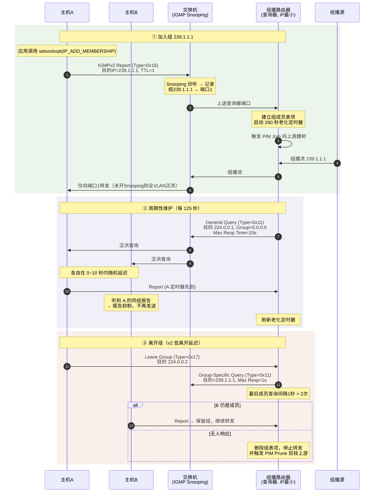
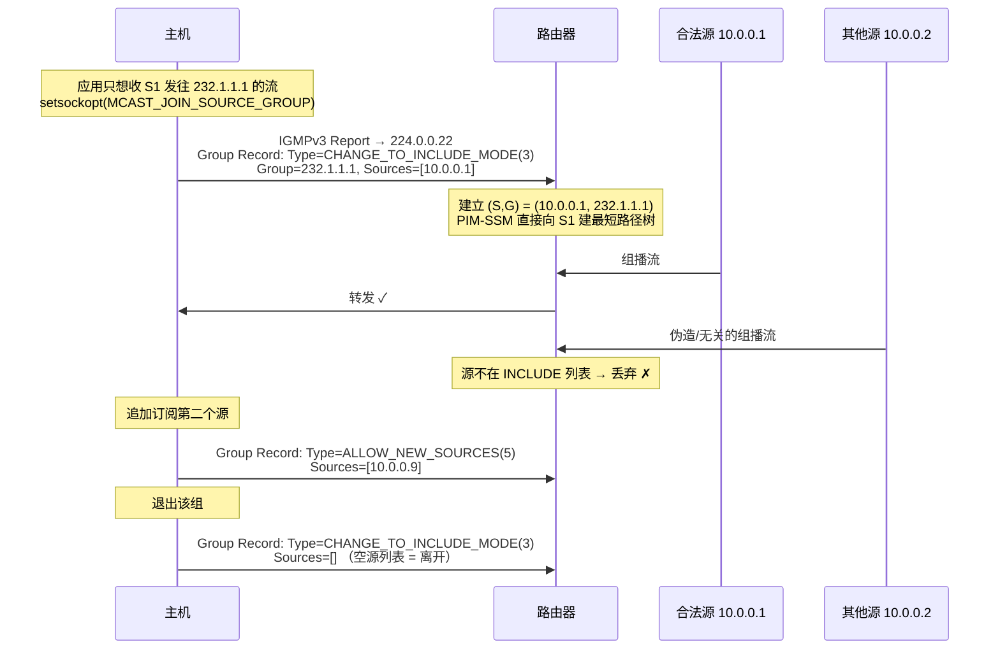
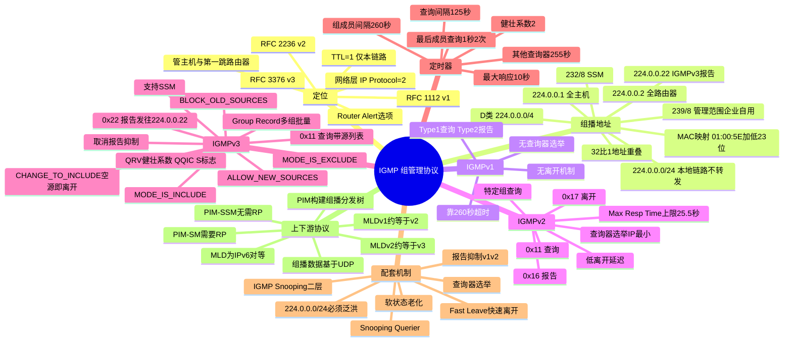

## 先建立直觉

先别管报文格式和协议号，先用一个画面记住 IGMP 是干嘛的。

想象一场**小区共享电视**：电视台只往主干线发一份信号，到小区后由物业决定"哪栋楼有人订了哪个台，就把那路信号送进哪栋楼"。IGMP 就是每户填的**"频道订阅登记表"——你想看 239.1.1.1 就登记，不想看了就划掉；物业按表定期核对（你还想看吗？），没人看了就停送。

关键三点先记住：**第一**，它只管"本栋楼（本网段）谁订了"，信号从电视台怎么一路传过来是 PIM 的事；**第二**，登记会过期，所以要定期"续订"；**第三**，一张表上可以有 32 户被错投到同一面（组播 MAC 32:1 重叠），网络得靠 IP 层再筛一遍。

## 它解决什么问题

单播场景下，服务器向 1000 个客户端发同一份视频，需要发 1000 份数据，带宽线性膨胀。组播（Multicast）让服务器**只发一份**，由网络设备在分叉点复制，极大节省带宽。但这引出三个必须解决的问题：

1. **谁想收？**——路由器不可能把所有组播流都往每个网段泼，否则等同广播。需要一种机制让主机**声明订阅意愿**。
2. **还有人在收吗？**——最后一个成员离开后，若路由器仍持续转发，就是纯粹的带宽浪费与安全隐患。需要**成员存活探测**与**离开通知**。
3. **收谁发的？**——同一个组地址可能有多个源，主机可能只想收其中特定源（或排除某些源）。IGMPv3 的**源过滤**解决了这个问题，也是 SSM（指定源组播）的基础。

IGMP 正是运行在**主机 ↔ 本网段第一跳组播路由器**之间的这套"订阅/续订/退订"协议。

> **明确边界**：IGMP **只管一跳**（TTL=1，不跨网段）。组播流量如何在路由器之间构建分发树，由 **PIM-SM / PIM-DM / PIM-SSM** 等组播路由协议负责。二者是"接入侧"与"骨干侧"的分工。

## 工作流程（简化版）

IGMP 在网段里实际跑的就是"选举主持人 → 周期性点名 → 续订 → 入组/退组"这一套循环，核心在以下六步：

1. **查询器选举**（IGMPv2/v3）：网段内所有组播路由器互发通用查询，**IP 地址最小者当选查询器**，其余进入非查询器状态并启动"其他查询器存在定时器"（默认 255 秒），超时则重新选举。
2. **周期性通用查询（General Query）**：查询器每 **125 秒**（Query Interval）向 `224.0.0.1` 发一次，询问"本网段有人在收哪些组？"
3. **成员报告（Membership Report）**：主机在 `[0, 最大响应时间]` 内随机延迟后回报告。**v1/v2 有报告抑制**（听到他人同组报告就取消自己的）；**v3 无抑制**，所有成员都报告。
4. **软状态维护**：路由器为每个组维护定时器，**组成员间隔 = 健壮系数 × 查询间隔 + 最大响应时间 = 2×125 + 10 = 260 秒**，超时未收到任何报告则删除该组，停止向本网段转发。
5. **主动加入**：主机 join 时**立即**发送非请求报告（Unsolicited Report），无需等待查询，缩短入组延迟；默认还会重发一次以防丢失。
6. **主动离开**（v2/v3）：主机发 Leave Group（v2 发往 `224.0.0.2`），查询器随即发 **特定组查询（Group-Specific Query）**，若在**最后成员查询间隔**（默认 1 秒 × 2 次）内无人响应，则立即删除该组——这就是 v2 的"**低离开延迟**"改进。

## 报文/头部长什么样

### 组播地址规划

**看这张表前先记住**：IPv4 组播用的是 D 类地址 `224.0.0.0/4`。表里的关键不在"段有多大"，而在三段特殊用途——`224.0.0.0/24` 是本地链路、永不跨网段；`232/8` 是 SSM 指定源组播；`239/8` 是企业内部自建首选（类比组播界的私有地址）。

| 地址段 | 用途 | 说明 |
|--------|------|------|
| **`224.0.0.0/24`** | **本地链路预留** | **TTL 必须为 1，不被路由器转发**。`224.0.0.1` 全主机、`224.0.0.2` 全路由器、`224.0.0.5/6` OSPF、`224.0.0.9` RIPv2、`224.0.0.13` PIM、`224.0.0.18` VRRP、**`224.0.0.22` IGMPv3 报告** |
| `224.0.1.0 – 238.255.255.255` | 全球范围可路由组播 | 含 `224.0.1.1` NTP 等 IANA 分配地址 |
| **`232.0.0.0/8`** | **SSM 指定源组播** | 必须配合 IGMPv3 使用（RFC 4607） |
| `233.0.0.0/8` | GLOP，按 AS 号静态分配 | RFC 3180 |
| **`239.0.0.0/8`** | **管理范围（Administratively Scoped）** | 类比组播界的"私有地址"，**企业内部自建组播首选**（RFC 2365） |

### 组播 IP → MAC 的映射（重要且易考）

**看这张图前先记住**：以太网组播 MAC 由固定前缀 `01:00:5E` 加 IP 地址的**低 23 位**拼成。关键是"28 位可变地址只取了 23 位"，丢掉的那 5 位就是后面 32:1 重叠的根源。

以太网组播 MAC 由 **`01:00:5E`** 前缀 + **IP 地址的低 23 位**构成：

```
组播 IP: 239. 1. 1. 1
二进制: 11101111 00000001 00000001 00000001
                 └─────── 取低 23 位 ───────┘
                   0000001 00000001 00000001
MAC: 01:00:5E:01:01:01
```

**关键结论：IP 组播地址有 28 位可变（32−4），而 MAC 只映射 23 位，剩余 5 位被丢弃 → 存在 2⁵ = 32 : 1 的地址重叠。**

例如 `239.1.1.1`、`239.129.1.1`、`224.1.1.1` 会映射到**同一个 MAC**。后果是：网卡会收到本不该收的组播帧，需由主机 IP 层过滤丢弃，造成额外 CPU 开销。**组播地址规划时应避开低 23 位相同的组，尽量让规划落在同一段内递增**。

### IGMPv1（RFC 1112）——8 字节

**看这张表前先记住**：v1 是最简版，只有"查询/报告"两种类型，字段极简；它没有离开、没有查询器选举、没有特定组查询，所以下面那条"局限"是 v1 的硬伤。

| 字段 | 长度 | 说明 |
|------|------|------|
| Version | 4 bit | = 1 |
| Type | 4 bit | `1` = Host Membership Query，`2` = Host Membership Report |
| Unused | 8 bit | 全 0 |
| Checksum | 16 bit | 覆盖整个 IGMP 报文 |
| Group Address | 32 bit | 查询时为 0；报告时为所报告的组地址 |

**局限**：无离开机制（只能等 260 秒超时老化）、无查询器选举（依赖组播路由协议指定）、无特定组查询。

### IGMPv2（RFC 2236）——8 字节

**看这张表前先记住**：v2 报文固定 8 字节，三个核心字段的中文名是 Type（类型）、Max Resp Time（最大响应时间）、Group Address（组地址）。Type 码最该记牢：`0x11` 查询、`0x16` 报告、`0x17` 离开。

| 字段 | 长度 | 说明 |
|------|------|------|
| **Type** | 8 bit | `0x11` **Membership Query**（通用查询：组地址=0，目的 `224.0.0.1`；特定组查询：组地址=该组，目的=该组地址）<br/>`0x12` IGMPv1 Membership Report（兼容）<br/>`0x16` **IGMPv2 Membership Report**（目的=所报告的组地址）<br/>`0x17` **Leave Group**（目的 `224.0.0.2` 全路由器） |
| **Max Response Time** | 8 bit | **仅查询报文有效**，单位 **0.1 秒**，默认 `100`（= 10 秒）。主机在此区间内随机延迟响应，避免报告风暴 |
| **Checksum** | 16 bit | 反码和，覆盖整个 IGMP 报文 |
| **Group Address** | 32 bit | 通用查询为 `0.0.0.0`；其余为具体组地址 |

**v2 相对 v1 的三大改进**：① **Leave Group 机制** + 特定组查询 → 低离开延迟；② **查询器选举**（IP 最小者）；③ **Max Response Time 可配**。

### IGMPv3（RFC 3376）——变长，支持源过滤

**看这张表前先记住**：v3 是变长报文、支持源过滤，字段明显变多。中文名串一下：Type（类型）、Max Resp Code（最大响应码）、Group Address（组地址）、S 标志（抑制路由器侧处理）、QRV（查询器健壮系数）、QQIC（查询器查询间隔码）、Number of Sources（源数量）。S/QRV/QQIC 都在那个 8-bit 标志字节里。

#### 查询报文（Type = 0x11，≥12 字节）

| 字段 | 长度 | 说明 |
|------|------|------|
| Type | 8 bit | `0x11` |
| **Max Resp Code** | 8 bit | <128 时直接为值（0.1 秒单位）；**≥128 时按浮点格式解码**，最大可达约 **53 分钟**（v2 上限仅 25.5 秒），适应超大规模网络 |
| Checksum | 16 bit | 校验和 |
| Group Address | 32 bit | 通用查询=0；特定组查询=组地址；**特定源组查询**=组地址+源列表 |
| Resv (4) / **S** (1) / **QRV** (3) | 8 bit | **S = Suppress Router-Side Processing**（抑制路由器侧定时器更新）；**QRV = Querier's Robustness Variable**（健壮系数，默认 2） |
| **QQIC** | 8 bit | Querier's Query Interval Code，查询器把自己的查询间隔告知其他路由器，实现参数同步 |
| **Number of Sources (N)** | 16 bit | 源地址数量，0 表示通用/特定组查询 |
| Source Address [1..N] | 32×N bit | 源地址列表 |

#### 报告报文（Type = 0x22，目的地址固定 `224.0.0.22`）

```
| Type=0x22 | Reserved | Checksum | Reserved | Number of Group Records (M) |
| Group Record [1] |
| Group Record [2] | ...
```

**每条 Group Record 结构**：

| 字段 | 长度 | 说明 |
|------|------|------|
| **Record Type** | 8 bit | 见下表 |
| Aux Data Len | 8 bit | 辅助数据长度，通常 0 |
| Number of Sources (N) | 16 bit | 源数量 |
| Multicast Address | 32 bit | 组地址 |
| Source Address [1..N] | 32×N bit | 源列表 |

**Record Type 全表**：

| 值 | 名称 | 含义 |
|----|------|------|
| **1** | `MODE_IS_INCLUDE` | 当前状态：只接收列表中源发来的流量 |
| **2** | `MODE_IS_EXCLUDE` | 当前状态：接收除列表外所有源的流量（源列表为空 = 接收全部，等价于 v2 行为） |
| **3** | `CHANGE_TO_INCLUDE_MODE` | 状态变更为 INCLUDE。**源列表为空 = 离开该组**（v3 没有独立的 Leave 报文，用它表达） |
| **4** | `CHANGE_TO_EXCLUDE_MODE` | 状态变更为 EXCLUDE |
| **5** | `ALLOW_NEW_SOURCES` | 增量：新增希望接收的源 |
| **6** | `BLOCK_OLD_SOURCES` | 增量：屏蔽某些源 |

> **v3 的两个杀手锏**：① **源过滤**——可以只收指定源（`INCLUDE`）或排除某些源（`EXCLUDE`），这是 **SSM** 的基础，也能抵御恶意源伪造组播流；② **一个报告携带多条 Group Record**——批量上报，报文数大幅减少。

### 三版本对比

**看这张表前先记住**：这张表是三个版本的"一字长蛇阵"对照，记差异点即可——v1 无离开/无选举/靠超时；v2 加离开+选举+可配响应时间；v3 变长、报告发往 `224.0.0.22`、支持源过滤、取消报告抑制、一个报告带多组。

| 维度 | **IGMPv1（RFC 1112）** | **IGMPv2（RFC 2236）** | **IGMPv3（RFC 3376）** |
|------|----------------------|----------------------|----------------------|
| 发布年份 | 1989 | 1997 | 2002 |
| 报文长度 | 固定 8 字节 | 固定 8 字节 | **变长** |
| Report Type | `0x12` | `0x16` | **`0x22`** |
| 报告目的地址 | 组地址 | 组地址 | **`224.0.0.22`**（固定，利于 Snooping） |
| 离开机制 | **无**，靠超时（最长 260 秒） | **Leave Group（0x17）** + 特定组查询 → **低离开延迟** | 用 `CHANGE_TO_INCLUDE_MODE` 空源列表表达 |
| 查询器选举 | 无（由组播路由协议指定） | **有，IP 最小者当选** | 有，同 v2 |
| 最大响应时间 | 固定 10 秒 | 可配，**上限 25.5 秒** | **浮点编码，上限约 53 分钟** |
| 源过滤 | 不支持 | 不支持 | **支持 INCLUDE / EXCLUDE** |
| 报告抑制 | 有 | 有 | **取消**（便于路由器精确跟踪每个成员） |
| 一报文多组 | 否 | 否 | **是**（多条 Group Record） |
| 组播模型 | ASM | ASM | **ASM + SSM** |

## 交互时序

### 加入、维护与离开（IGMPv2）

**一句话看懂这张图**：绿色①是"入组"——主机发 Report，交换机的 Snooping 学到端口、路由器建组成员表并触发 PIM Join 把流拉下来；蓝色②是"续订"——查询器每 125 秒点名，A 抢先回报告、B 听到同组报告就抑制自己；橙色③是"离开"——主机发 Leave，查询器发特定组查询确认无人要了才删组、并 PIM Prune 剪掉上游。



### IGMPv3 源过滤（SSM 场景）

**一句话看懂这张图**：主机只想收 S1 发往 232.1.1.1 的流，就用 `CHANGE_TO_INCLUDE_MODE` 带源列表 `10.0.0.1` 上报，路由器据此建 (S,G) 最短路径树、只转发 S1 的流；S2 发的无关流因不在 INCLUDE 列表被丢弃。追加源用 `ALLOW_NEW_SOURCES`，退组则用"空源列表的 INCLUDE"表达。



## 关键机制/变体

### 这是干什么的——查询器选举（Querier Election）

同一网段可能有多台组播路由器，若都发查询会造成冗余。IGMPv2/v3 规定：

1. 每台路由器初始都认为自己是查询器，发送通用查询；
2. 收到**源 IP 比自己小**的查询报文 → 放弃查询器身份，转为非查询器，启动 **Other Querier Present Interval**（= 健壮系数 × 查询间隔 + 0.5 × 最大响应时间 ≈ **255 秒**）；
3. 该定时器超时（说明当前查询器失效）→ 重新参选。

**排错要点**：网段内**必须有且仅有一个查询器**。若纯二层网段（无三层组播路由器）需要 Snooping 正常工作，得在交换机上启用 **IGMP Snooping Querier** 来充当查询者，否则成员表项会因无人查询而老化，导致组播中断——这是"**组播播放几分钟后卡死**"的典型根因。

### 这是干什么的——关键定时器（默认值）

**看这张表前先记住**：IGMP 的"软状态"全靠这些定时器驱动。最核心的两个是 Query Interval（查询间隔，125 秒）和 Group Membership Interval（组成员间隔，260 秒 = 2×125+10）——后者就是"多久没续订就删组"的硬 deadline。

| 定时器 | 默认值 | 计算方式 | 作用 |
|--------|--------|---------|------|
| **Query Interval**（查询间隔） | **125 秒** | 可配 | 通用查询周期 |
| **Max Response Time**（最大响应时间） | **10 秒** | 查询报文中携带 | 主机随机延迟上限，防报告风暴 |
| **Robustness Variable**（健壮系数 QRV） | **2** | 可配 | 容忍的丢包次数，影响多个定时器 |
| **Group Membership Interval**（组成员间隔） | **260 秒** | QRV × 查询间隔 + 最大响应时间 = 2×125+10 | 无报告则删除组 |
| **Other Querier Present Interval** | **255 秒** | QRV × 查询间隔 + 0.5 × 最大响应时间 | 判定当前查询器失效 |
| **Last Member Query Interval** | **1 秒** | 可配 | 收到 Leave 后特定组查询的间隔 |
| **Last Member Query Count** | **2**（= QRV） | — | 特定组查询次数，全部无响应才删组 |

> **调优思路**：IPTV 频道切换要求快（换台延迟），可调小 Last Member Query Interval，或直接启用 **Fast Leave / Immediate Leave**（收到 Leave 立即删端口，**仅适用于一个端口下只接一个用户**的场景，否则会误伤同端口其他用户）。

### 这是干什么的——IGMP Snooping（二层的关键配套）

**问题**：交换机看到目的 MAC 为 `01:00:5E:xx:xx:xx` 的组播帧，因不在 MAC 地址表中，默认**在整个 VLAN 内泛洪**。这会让三层组播省下的带宽在二层被浪费殆尽，甚至造成组播风暴。

**解法**：交换机侦听（Snoop）经过的 IGMP 报文：

- 看到某端口发来 **Report** → 把该端口加入该组的转发端口列表；
- 看到某端口发来 **Leave** → 发特定组查询确认后移除该端口；
- 识别**路由器端口**（收到 IGMP Query 或 PIM Hello 的端口）→ 所有 Report 需向其转发；
- 结果：组播流**只发给真正的成员端口**。

**关键注意点**（RFC 4541）：

- `224.0.0.0/24` **本地链路组播必须始终泛洪**（如 OSPF、VRRP、PIM 报文），不能被 Snooping 拦截；
- 纯二层环境需配置 **Snooping Querier**；
- IGMPv3 的报告统一发往 `224.0.0.22`，交换机需正确识别。

### 这是干什么的——ASM 与 SSM 两种组播模型

**看这张表前先记住**：组播有两套"玩法"。ASM 是"谁来发我都收"（任意源），需要 RP 汇聚点，架构重；SSM 是"只收指定源发往此组的流"（指定源），地址段 232/8，**必须 IGMPv3 源过滤**，无需 RP、架构轻、还能防伪造源——IPTV 和金融行情推送最爱。

| 维度 | **ASM（任意源组播）** | **SSM（指定源组播，RFC 4607）** |
|------|---------------------|------------------------------|
| 表示法 | **(*, G)** —— 任意源发往 G 的流量 | **(S, G)** —— 只接收源 S 发往 G 的流量 |
| 地址段 | 224.0.1.0 – 238.255.255.255（企业常用 239/8） | **232.0.0.0/8** |
| 依赖 IGMP 版本 | v1/v2/v3 均可 | **必须 IGMPv3**（v1/v2 需 SSM Mapping 转换） |
| 路由协议 | PIM-SM，需 **RP（汇聚点）** | **PIM-SSM，无需 RP**，直接建最短路径树 |
| 部署复杂度 | 高（RP 选举、Anycast RP、MSDP） | **低**，架构简洁 |
| 安全性 | 弱（任何源都能向该组发流量） | **强**（源被显式指定，可防伪造源注入） |
| 典型场景 | 传统企业组播、多源会议 | **IPTV、金融行情推送**等一对多单源场景 |

## 常见误区

- **误区一：IGMP 负责整个组播转发。** 错。它只管"主机 ↔ 第一跳路由器"这一跳（TTL=1，出不了本链路）；组播流在路由器之间怎么构建分发树，是 PIM 的活。二者"接入侧 + 骨干侧"分工。
- **误区二：开了组播就一定快、一定省带宽。** 若交换机没开 IGMP Snooping，组播帧会当未知 MAC 在整个 VLAN 泛洪，三层省下的带宽二层全浪费，甚至可能组播风暴。Snooping 才是"最后一公里精确投递"的关键。
- **误区三：v3 也有独立 Leave 报文。** 没有。v3 用 `CHANGE_TO_INCLUDE_MODE` 且**源列表为空**来表达离开，不再有单独的 Leave 类型。
- **误区四：组播收不到就是网络断了。** 最常见其实是**发送端 socket 默认 TTL=1**，跨不了网段；或主机把组 join 到了错误的网卡；或 RPF 检查把包丢了。先按"join → Report → Snooping → IGMP 组表 → PIM"五段排查。
- **误区五：组播 MAC 一一对应组地址。** 错。MAC 只取 IP 低 23 位，28 位地址空间被压成 23 位，存在 **32:1 重叠**——规划组地址要避开低 23 位相同的组，否则网卡会收到一堆无关帧。

## 速记口诀

- **订阅只管一跳远**：TTL=1 + Router Alert，IGMP 只理本链路、路由器上送 CPU。
- **最小 IP 当主席**：查询器选举比 IP 大小，最小者当选；缺了它 260 秒后就"播放卡死"。
- **v1 没离开靠超时，v2 加离开降延迟，v3 空源即退组**：三版本演进一句话记。
- **232 要 v3、239 企业用、MAC 32 挑 1**：SSM 必须 IGMPv3，私用选 239/8，地址重叠是常坑。

## 知识框架


