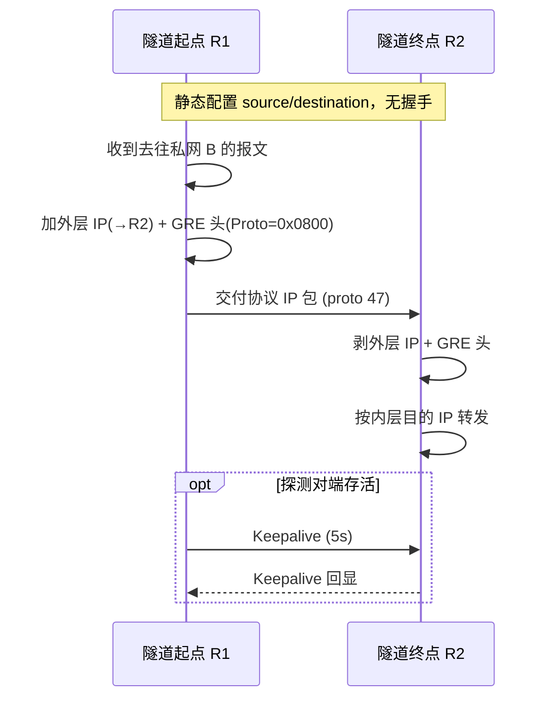
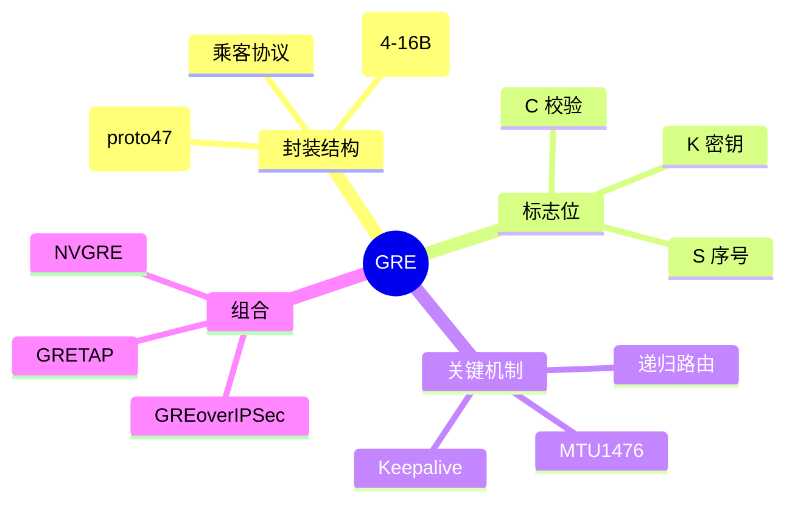

## 1. 工作原理

GRE 是"封装即服务"：隧道起点把乘客报文整体搬进新 IP 包的 payload，仅改写外层 IP 头与 GRE 头，内层 IP 头与内容**原样保留**。对端解封装后按内层目的 IP 继续转发。因无状态，两端无需握手，配置 `tunnel source/destination` 即生效。

## 2. 报文 / 头部结构

最小 GRE 头 4 字节；当 C/K/S 置位时按序追加对应字段，最大 16 字节。

| 比特范围 | 字段 | 说明 |
|---------|------|------|
| bit 0 | C (Checksum Present) | 置位则含 4 字节 Checksum + 4 字节 Reserved1 |
| bit 1 | K (Key Present) | 置位则含 4 字节 Key，作流标识/轻量隔离 |
| bit 2 | S (Sequence Number Present) | 置位则含 4 字节 Sequence Number（保序、乱序丢） |
| bit 3-4 | Recursion (2 bit) | 封装层数计数器，防递归封装，≥4 应丢弃 |
| bit 5-7 | Flags (3 bit) | 保留，RFC 2784 全 0 |
| bit 8-12 | Version (3 bit) | GRE 版本，标准 GRE = 0（PPTP 用 1） |
| bit 13-15 | Protocol Type (高 3 bit) | 与后 13 bit 共 16 bit 的 EtherType，**指示乘客协议** |
| 16 bit | Protocol Type (低 13 bit) | 0x0800=IPv4，0x86DD=IPv6，0x6558=以太帧(GRETAP)，0x8847=MPLS |
| 变长 | Checksum / Key / Sequence | 仅对应标志置位时存在 |

## 3. 交互流程

## 4. 关键机制

- **MTU / MSS**：外层 20 + GRE 4 = 24 字节开销，隧道 MTU 常设 **1476**，TCP MSS 建议 1436，避免分片。
- **递归路由（Recursive Routing）**：若隧道目的地址经隧道自身到达，路由振荡致隧道 down。解法：用静态明细路由 / `vrf` / FVRF 让外层流量走物理口。
- **GRE over IPSec**：先 GRE 封装再加 ESP，ESP 传输模式保护 GRE 流，兼顾"路由可达 + 加密"。
- **Keepalive**：Cisco `keepalive 5 3`，连续 3 次无回应则置隧道 down。

## 5. 知识框架

