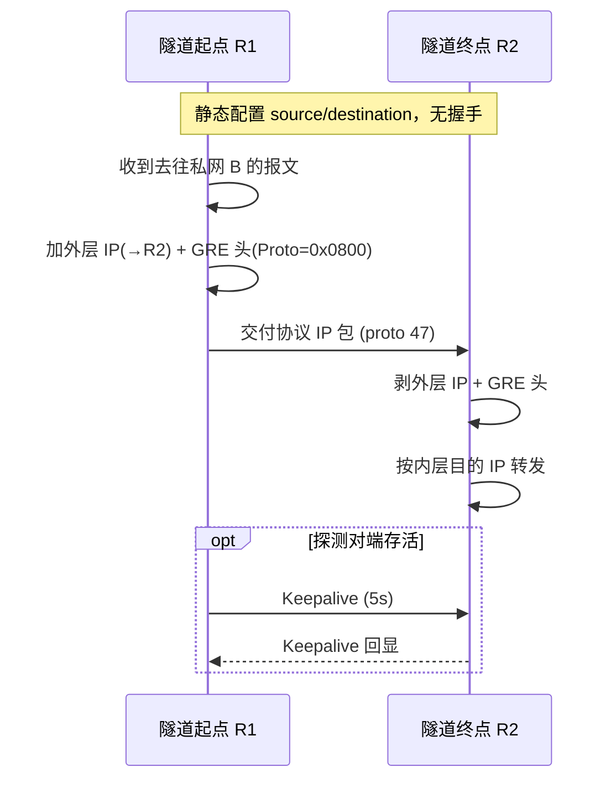
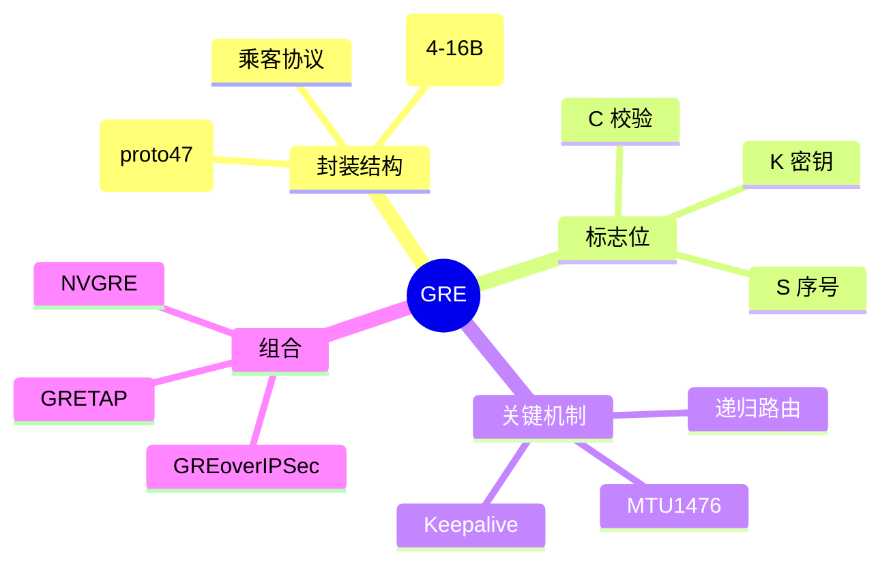

## 先建立直觉

GRE 做的事只有一件：**给一个"走不出去"的包套上一层能走出去的外壳**。

就像你要寄一个不符合快递规格的东西，于是把它整个放进一个标准纸箱，纸箱上贴的是快递公司认识的地址。快递员全程只看纸箱外面的标签，根本不拆、也不关心里面是什么；等纸箱到了目的地，收件人拆箱，里面的东西一点没变，继续按原来的方式处理。

关键点：**里面的东西一个字都不改，只是多了一层壳；而且两边不用打招呼、不用商量，各自把纸箱地址写死就能开工。**

## 它解决什么问题

设想两个分公司各有一套自己的内部网络，中间隔着公网。内部地址在公网上是"查无此地"，直接寄必然被退回；就算你想让两边的路由器互相学习路线、或者做一次全员广播通知，公网也完全不配合。

没有 GRE，你只能挨个协议单独造一套穿越方案；有了 GRE，**只要能封进纸箱，什么货都能过**——私网包能过、非 IP 的协议能过、连需要"喊话给一群人"的组播和路由协议也能过。这就是它存在的意义：把"过不去"变成"过得去"，而且用同一套办法。

## 工作流程（简化版）

用普通人的语言，整个过程只有四步：

1. 隧道起点收到一个"寄不出去"的包（去往对端私网）。
2. 起点给它套上纸箱：加一个 GRE 头，再加一个写着两端公网地址的外层 IP 头。
3. 中间的公网只看外层地址转发，一路照送，完全不拆箱。
4. 隧道终点拆掉外层 IP 头和 GRE 头，把里面原封不动的包按它自己的目的地址继续转发。

补一句：两端**不需要任何握手或协商**，各自把源和目的地址配死，隧道立刻就成立了。

## 1. 工作原理

GRE 是"封装即服务"：隧道起点把乘客报文整体搬进新 IP 包的 payload，仅改写外层 IP 头与 GRE 头，内层 IP 头与内容**原样保留**。对端解封装后按内层目的 IP 继续转发。因无状态，两端无需握手，配置 `tunnel source/destination` 即生效。

## 报文 / 头部长什么样

> 看这张表前先记住：GRE 头是"可伸缩"的——**光杆只有 4 字节**，C/K/S 三个开关每打开一个就在后面追加 4 字节，最多撑到 16 字节。表里前半部分全是"开关和版本号"，真正决定"里面装的是什么货"的是最后那个 `Protocol Type`。

最小 GRE 头 4 字节；当 C/K/S 置位时按序追加对应字段，最大 16 字节。

字段中文全称对照：C = Checksum Present（校验和存在位）、K = Key Present（键值存在位）、S = Sequence Number Present（序列号存在位）、Recursion = Recursion Control（递归控制/封装层数计数）、Version = 版本号、Protocol Type = 乘客协议类型。

| 比特范围 | 字段 | 说明 |
|---------|------|------|
| bit 0 | C (Checksum Present) | 置位则含 4 字节 Checksum + 4 字节 Reserved1 |
| bit 1 | K (Key Present) | 置位则含 4 字节 Key，作流标识/轻量隔离 |
| bit 2 | S (Sequence Number Present) | 置位则含 4 字节 Sequence Number（保序、乱序丢） |
| bit 3-4 | Recursion (2 bit) | 封装层数计数器，防递归封装，≥4 应丢弃 |
| bit 5-7 | Flags (3 bit) | 保留，RFC 2784 全 0 |
| bit 8-12 | Version (3 bit) | GRE 版本，标准 GRE = 0（PPTP 用 1） |
| bit 13-15 | Protocol Type (高 3 bit) | 与后 13 bit 共 16 bit 的 EtherType，**指示乘客协议** |
| 16 bit | Protocol Type (低 13 bit) | 0x0800=IPv4，0x86DD=IPv6，0x6558=以太帧(GRETAP)，0x8847=MPLS |
| 变长 | Checksum / Key / Sequence | 仅对应标志置位时存在 |

## 交互时序

> 一句话看懂这张图：左边把包装箱、贴外层地址寄出去，右边拆箱、按里面的地址接着送；虚线那段 Keepalive 是"额外加的问候"，不是建隧道必须的步骤。

## 关键机制 / 变体

- **MTU / MSS** —— 这是解决"套壳之后包变胖、路上被卡住"的问题：外层 20 + GRE 4 = 24 字节开销，隧道 MTU 常设 **1476**，TCP MSS 建议 1436，避免分片。
- **递归路由（Recursive Routing）** —— 这是解决"隧道自己把自己绕死"的问题：若隧道目的地址经隧道自身到达，路由振荡致隧道 down。解法：用静态明细路由 / `vrf` / FVRF 让外层流量走物理口。
- **GRE over IPSec** —— 这是解决"GRE 什么都能装但不保密"的问题：先 GRE 封装再加 ESP，ESP 传输模式保护 GRE 流，兼顾"路由可达 + 加密"。
- **Keepalive** —— 这是解决"无状态协议不知道对端死没死"的问题：Cisco `keepalive 5 3`，连续 3 次无回应则置隧道 down。

## 常见误区

1. **"隧道接口 UP 就说明对端活着"** —— 错。GRE 无状态，接口 UP 只代表本地配置成立；Linux 侧更是完全不反映对端死活，必须靠 Keepalive、路由 Hello 或定时探测来判断。
2. **"配了 Key 就等于加了密码"** —— 错。`Key` 只是流标识 / 轻量隔离，明文传输、可被伪造，不是安全凭证。要机密性只能叠 IPSec。
3. **"能 ping 通就说明隧道没问题"** —— 不一定。小包能过、大文件卡死是典型的 MTU 黑洞：套壳多了 24 字节，超长包被丢而 PMTUD 回包又被拦，需要把隧道 MTU 设为 1476 并做 MSS Clamp 到 1436。
4. **"隧道目的地址随便写条路由就行"** —— 危险。如果隧道目的地址是通过隧道自身学到的，就会触发递归路由，隧道反复 up/down；外层流量必须明确走物理口。

## 速记口诀

- **"外壳 20，GRE 4，一共 24，MTU 1476，MSS 1436。"**
- **"C 校验、K 密钥、S 序号，一位开、四字节到，光杆 4 最多 16。"**
- **"协议号 47 不用端口，无握手无状态；Key 不是密码，加密找 IPSec。"**

## 知识框架

