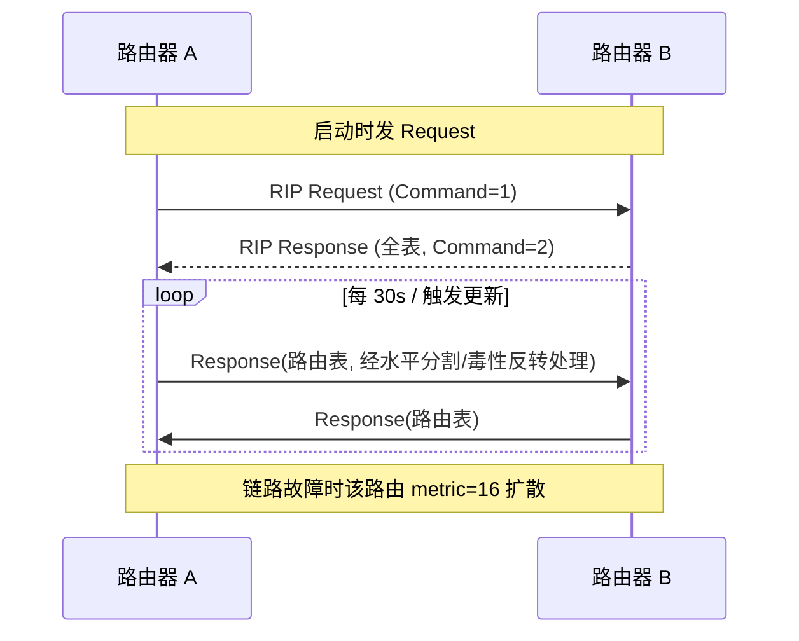
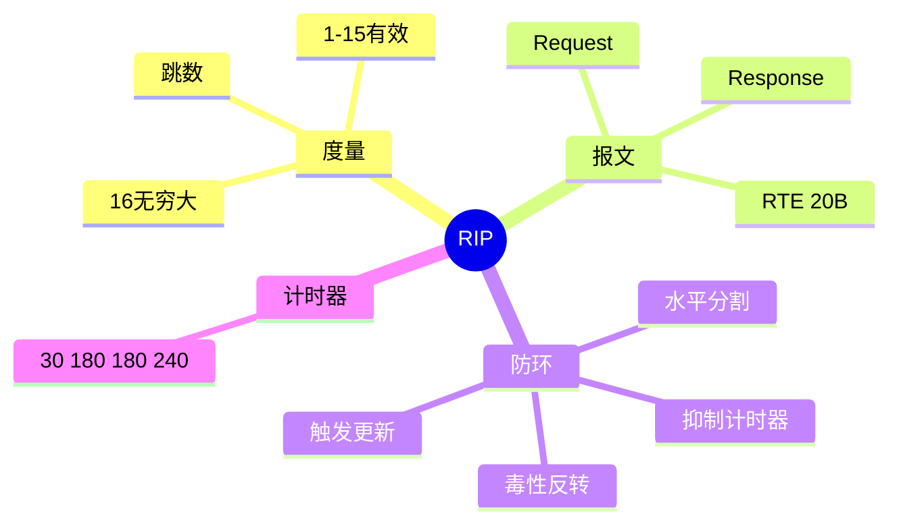

## 1. 工作原理

RIP 用 **Bellman-Ford（分布式）**：每个路由器维护"目的网—距离—下一跳"表。收到邻居通告后，对每条路由执行：

```
新距离 = 邻居到该网距离 + 1（到邻居的跳数）
若 新距离 < 现有距离 或 来源即原下一跳 → 更新（距离、下一跳、重置超时计时器）
若 新距离 ≥ 16 → 标记为不可达
```

跳数最小者入选；**16 = 无穷大（不可达）**。

## 2. 报文 / 头部结构

RIPv2 报文（UDP 520，组播 224.0.0.9）：

| 字段 | 字节 | 说明 |
|------|------|------|
| Command | 1 | 1=Request（要表），2=Response（给表） |
| Version | 1 | 2（v2） |
| Reserved / Route Domain | 2 | 保留 / 路由域 |
| **RTE × N（每条 20 字节）** | 20N | 路由表项，最多 **25 条/包** |
| 每个 RTE： | | |
| Address Family Id | 2 | 0xFFFF=认证项，否则=2(IPv4) |
| Route Tag | 2 | 外部路由标记（重分发用） |
| IP Address | 4 | 目的网络 |
| Subnet Mask | 4 | 子网掩码（v2 才带，支持 VLSM） |
| Next Hop | 4 | 下一跳（0.0.0.0=发此包的邻居） |
| Metric (跳数) | 4 | 1–16，16=不可达 |

> 一个 512 字节 UDP 包约可装 25 条 RTE；超出的路由分多个包发送。

## 3. 交互流程



## 4. 关键机制

| 计时器 | 默认 | 作用 |
|--------|------|------|
| Update（周期） | 30s | 发全表 |
| Invalid（失效） | 180s | 路由 180s 未刷新 → 标不可达 |
| Holddown（抑制） | 180s | 怀疑期内忽略更优更新，防环路 |
| Flush（刷新） | 240s | 从表中删除 |

- **水平分割**：不从学到路由的接口回发该路由。
- **毒性反转**：回发时把跳数置 16（明确"不可达"）。
- **触发更新**：度量变化时立即发送，不等 30s。
- **认证**：RIPv2 支持明文/MD5（RTE 中 AFI=0xFFFF）。

## 5. 知识框架


