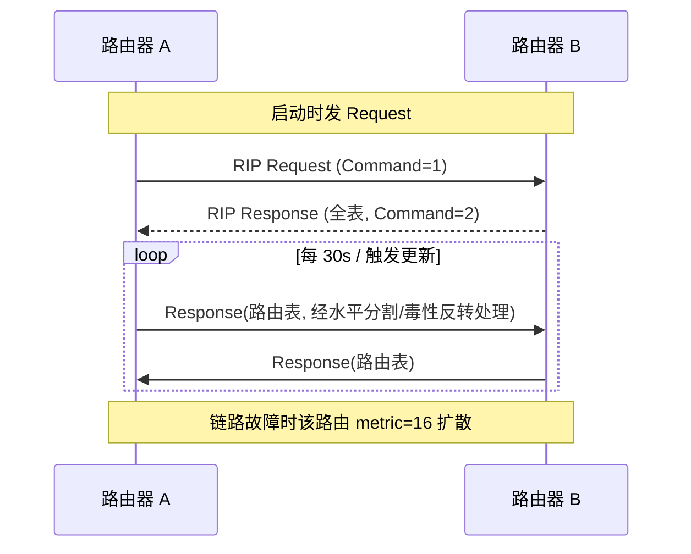
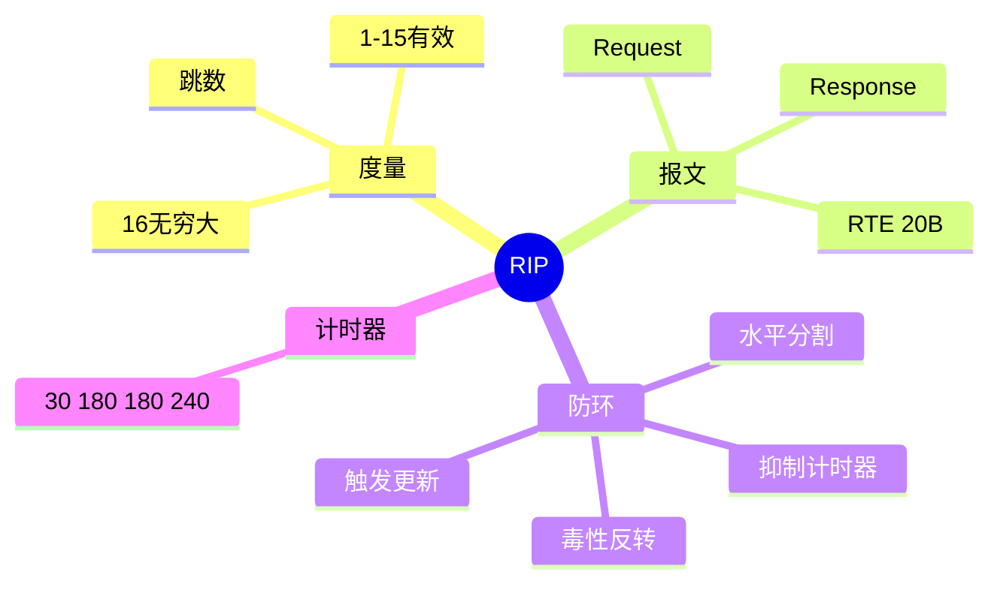

## 先建立直觉

RIP 就是一群"只跟隔壁邻居唠嗑"的路由器。

每台路由器手里只有一张小本子，记着"去某个地方，要走几步，从哪个邻居走"。它定期把整本子念给邻居听，邻居听完在每个数字上加个 1，再跟自己本子上的对比——**谁给的步数少，就听谁的**。

没有人拥有全局视野，也没人算过全网地图。整张网就靠这种"口口相传"，一轮一轮地把消息传开，最后大家的小本子慢慢就对上了。

## 它解决什么问题

如果没有它，网络里每一条通往远处的路线都得管理员一条条手写。网络小的时候还行，一旦某条线路断了，你得半夜爬起来手动改所有相关设备的路线表——改漏一台，流量就掉进黑洞。

RIP 让路由器自己商量着办：**线路通了自动学到，线路断了自动扩散"此路不通"**。它不追求最优，也不追求快，只追求"简单到几乎不会配错"，所以在小网络和教学场景里一直有它的位置。

## 工作流程（简化版）

1. 路由器一启动，先冲邻居喊一嗓子："把你的路由表给我看看。"（Request）
2. 邻居把自己整张表回给它。（Response）
3. 收到表后，对每条路线把步数加 1，跟自己表里的比一比，**更近的就采纳，并记下"从这个邻居走"**。
4. 之后每隔一段时间就把自己的整张表念给所有邻居听，如此循环，全网信息慢慢一致。
5. 一旦某条路走不通了，就把它的步数标成"无穷大"，让这个坏消息沿着同样的方式扩散出去。

## 1. 工作原理

RIP 用 **Bellman-Ford（分布式）**：每个路由器维护"目的网—距离—下一跳"表。收到邻居通告后，对每条路由执行：

```
新距离 = 邻居到该网距离 + 1（到邻居的跳数）
若 新距离 < 现有距离 或 来源即原下一跳 → 更新（距离、下一跳、重置超时计时器）
若 新距离 ≥ 16 → 标记为不可达
```

跳数最小者入选；**16 = 无穷大（不可达）**。

## 报文 / 头部长什么样

> 看这张表前先记住：RIP 报文的结构非常朴素——**前 4 字节是"信封抬头"（这是请求还是回复、什么版本），后面全是一条条 20 字节的路由记录（RTE）堆在一起**，一个包最多堆 25 条。真正的信息量全在 RTE 里。

RIPv2 报文（UDP 520，组播 224.0.0.9）：

字段中文全称对照：Command = 命令类型、Version = 版本号、Route Domain = 路由域、RTE = Route Table Entry（路由表项）、AFI = Address Family Identifier（地址族标识）、Route Tag = 路由标记、Subnet Mask = 子网掩码、Next Hop = 下一跳、Metric = 度量值（此处即跳数）。

| 字段 | 字节 | 说明 |
|------|------|------|
| Command | 1 | 1=Request（要表），2=Response（给表） |
| Version | 1 | 2（v2） |
| Reserved / Route Domain | 2 | 保留 / 路由域 |
| **RTE × N（每条 20 字节）** | 20N | 路由表项，最多 **25 条/包** |
| 每个 RTE： | | |
| Address Family Id | 2 | 0xFFFF=认证项，否则=2(IPv4) |
| Route Tag | 2 | 外部路由标记（重分发用） |
| IP Address | 4 | 目的网络 |
| Subnet Mask | 4 | 子网掩码（v2 才带，支持 VLSM） |
| Next Hop | 4 | 下一跳（0.0.0.0=发此包的邻居） |
| Metric (跳数) | 4 | 1–16，16=不可达 |

> 一个 512 字节 UDP 包约可装 25 条 RTE；超出的路由分多个包发送。

## 交互时序

> 一句话看懂这张图：开机先要一次全表，之后就进入"每 30 秒互念一遍路由表"的循环，出事了就把那条路由标成 16 传出去。



## 关键机制 / 变体

这四个计时器决定了"多久说一次话、多久判定一条路死了、多久彻底忘掉它"：

| 计时器 | 默认 | 作用 |
|--------|------|------|
| Update（周期） | 30s | 发全表 |
| Invalid（失效） | 180s | 路由 180s 未刷新 → 标不可达 |
| Holddown（抑制） | 180s | 怀疑期内忽略更优更新，防环路 |
| Flush（刷新） | 240s | 从表中删除 |

- **水平分割** —— 这是防止"把邻居教我的东西又教回给他"：不从学到路由的接口回发该路由。
- **毒性反转** —— 这是把"沉默"升级成"明说不通"：回发时把跳数置 16（明确"不可达"）。
- **触发更新** —— 这是给坏消息开快车道：度量变化时立即发送，不等 30s。
- **认证** —— 这是防止别人冒充邻居塞假路由：RIPv2 支持明文/MD5（RTE 中 AFI=0xFFFF）。

## 常见误区

1. **"跳数最多能到 16"** —— 错。有效跳数是 **1–15**，**16 专门表示无穷大/不可达**，不是一个可用距离。
2. **"RIP 走 UDP，所以丢包了路由就错了"** —— 不是。RIP 本来就靠每 30s 全表刷新达成最终一致，单包丢失下一轮补齐，不需要逐包可靠。
3. **"水平分割和毒性反转是一回事"** —— 不是。水平分割是**不回发**这条路由；毒性反转是**照样回发但把跳数写成 16**，后者能更快地把坏消息通知出去。
4. **"路由学到就立刻会被更好的替换"** —— 不一定。抑制计时器（Holddown，180s）期间会**故意忽略更优的更新**，这是防环的代价，也是 RIP 收敛慢的原因之一。

## 速记口诀

- **"跳数 15 到头，16 就是没有。"**
- **"三十报一次，一百八判死，再一百八别信新，两百四彻底清。"**（Update 30 / Invalid 180 / Holddown 180 / Flush 240）
- **"来路不回发（水平分割），要回发就报死（毒性反转），有变化不等钟（触发更新）。"**

## 知识框架


