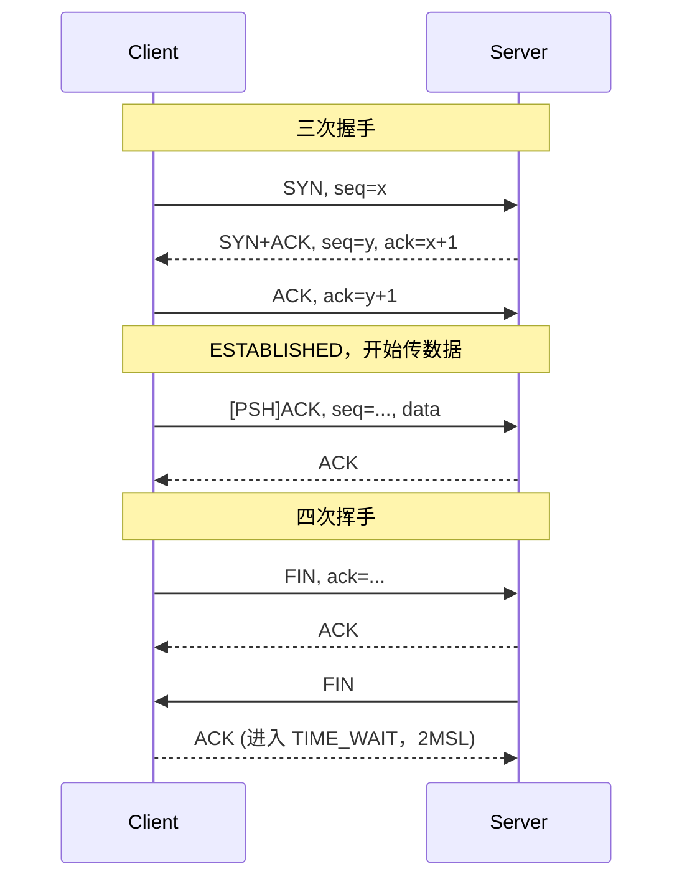
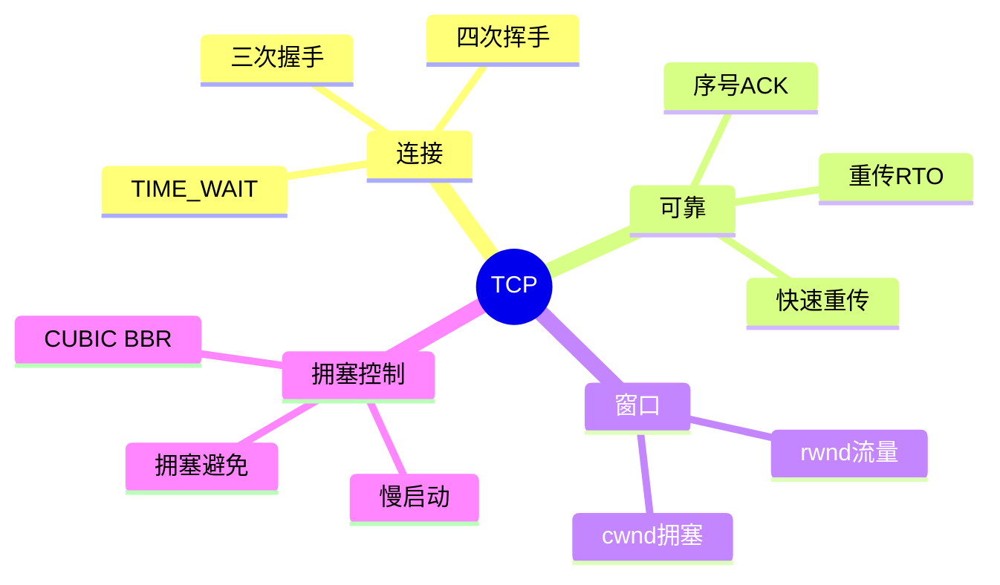

## 先建立直觉

TCP 要保证的事只有一件：**你从这头倒进去多少内容，那头就一模一样、一个不少、顺序不乱地流出来。**

想象两个人隔着嘈杂的房间对话：说话的人每说一句都等对方点头，没点头就再说一遍；对方说"太快了记不住"，他就放慢；房间越吵，他说得越慢越小心，房间安静了再逐渐加速。

整条通道的感觉更像一根**水管**而不是一箱一箱的包裹——你倒进去的是连续的水流，中间怎么切成小段传输是它自己的事，出口那头重新汇成一条完整的流。

## 它解决什么问题

底层网络本身是"尽力而为"的：包会丢、会乱序、会重复、会被拖慢。如果每个应用都要自己处理这些烂摊子，那每写一个程序都得重新发明一遍"确认、重发、排序、限速"。

而且还有两个更麻烦的问题：接收方处理不过来怎么办？大家一起猛发把整条路挤爆了怎么办？

TCP 把这些统统包办了——**它给应用一个假象：网络是可靠、有序、且自动懂得快慢的**。应用只管往里写字节，剩下的不用操心。

## 工作流程（简化版）

1. **建连**：双方互相打招呼并确认对方听得见（三次握手），连接进入可用状态。
2. **编号发送**：要发的数据被切成段，每个字节都有编号，发出去后先记着"还没被确认"。
3. **确认与重发**：接收方回复"我已经连续收到第几个字节了"；发送方迟迟等不到确认，就把那段重发一遍。
4. **动态调速**：一边看接收方还能收多少（rwnd），一边猜网络还堵不堵（cwnd），按两者里更小的那个发。
5. **拆连**：说完各自道别，双向分别关闭（四次挥手），主动关的那方还要等一会儿再彻底释放。

## 1. 工作原理

TCP 把应用数据切成段，逐字节编号（Sequence Number）。接收方对"连续收到的最大字节"回 ACK；发送方未收到 ACK 即重传。通过 rwnd（接收窗口）和 cwnd（拥塞窗口）联合限速，保证可靠且不过载。

## 报文 / 头部长什么样

> 看这张表前先记住：TCP 头里真正撑起整个协议的就三样东西——**"我发到第几个字节了"（Seq）、"我收到第几个字节了"（Ack）、"我还能收多少"（Window）**，再加一组开关（Flags）表示这个包是要建连、要断开还是普通数据。其余字段都是配角。

固定头 20 字节，含选项最长 60 字节：

字段中文全称对照：Source / Dest Port = 源/目的端口号、Sequence Number = 序列号、Acknowledgment Number = 确认号、Data Offset = 数据偏移（即头部长度）、Flags = 标志位、Window = 窗口大小（接收窗口）、Checksum = 校验和、Urgent Pointer = 紧急指针、Options = 选项、MSS = Maximum Segment Size（最大报文段长度）。

| 字段 | 位/字节 | 说明 |
|------|--------|------|
| Source / Dest Port | 各 16 bit | 端口号，标识会话两端 |
| **Sequence Number** | 32 bit | 本段首个字节的序号（SYN/FIN 各占 1 个序号） |
| **Acknowledgment Number** | 32 bit | 期望收到的下一个字节序号（ACK 置位才有效） |
| Data Offset | 4 bit | 头部长度（以 4 字节为单位） |
| **Flags** | 9 bit | SYN / ACK / FIN / RST / PSH / URG / ECE / CWR / NS |
| **Window** | 16 bit | 接收窗口 rwnd（流量控制） |
| Checksum | 16 bit | 含伪首部校验 |
| Urgent Pointer | 16 bit | URG 置位时有效 |
| Options | 变长 | MSS、SACK、Window Scale、Timestamp 等 |

> **MSS**（最大报文段）一般为 **1460**（1500−20IP−20TCP），经 MSS 协商确定。

## 交互时序

> 一句话看懂这张图：上半段是"确认双方都能收发"的三次握手，中间是数据来回，下半段是"两个方向分别关闭"的四次挥手——注意挥手时服务端的 ACK 和 FIN 是分开发的，这正是四次而非三次的原因。

## 关键机制 / 变体

- **滑动窗口 / 流量控制** —— 这是解决"别把接收方撑爆"的问题：发送方"已发送未确认"不得超 rwnd；窗口为 0 时发送方启动_probe。
- **重传** —— 这是解决"包丢了怎么补"的问题：超时 RTO（随 RTT 动态估算）或 **快速重传**（收 3 个重复 ACK 即重发，无需等超时）。
- **拥塞控制四阶段** —— 这是解决"别把整条路挤爆"的问题，核心思路是"试探着加速、出事就急刹"：
  1. **慢启动**：cwnd 指数增长（每 ACK 翻倍），至 ssthresh；
  2. **拥塞避免**：cwnd 线性 +1；
  3. **丢包（3 dup ACK）→ 快速重传 + 快速恢复**：ssthresh=cwnd/2，cwnd=ssthresh；
  4. **超时（RTO）→ 回到慢启动**，ssthresh=cwnd/2，cwnd=1。
  - 现代算法 **CUBIC**（Linux 默认）、**BBR**（基于带宽时延积）。
- **TIME_WAIT** —— 这是解决"最后一声再见有没有送到、旧包会不会串门"的问题：主动关闭方在 `TIME_WAIT` 等 **2MSL**（Linux 60s），确保最后 ACK 抵达、旧报文消散。

## 常见误区

1. **"TCP 会粘包，是 TCP 的 bug"** —— 不是。TCP 是**字节流、无消息边界**，从设计上就不保留应用一次 write 的边界。要分帧得应用层自己加长度前缀或分隔符。
2. **"看到大量 TIME_WAIT 就是出故障了"** —— 不是。TIME_WAIT 是主动关闭方按设计等待 **2MSL**（Linux 60s）的正常状态，作用是确保最后 ACK 抵达、让旧报文消散。只有在短连接高并发下堆积过多才需要处理。
3. **"快速重传和超时重传差不多"** —— 差很多。收到 **3 个重复 ACK** 触发快速重传，之后进入快速恢复，ssthresh=cwnd/2、cwnd=ssthresh；而 **RTO 超时**会把 cwnd 直接打回 **1** 并退回慢启动，代价大得多。
4. **"窗口大就一定跑得快"** —— 不一定。实际发送量受 `min(rwnd, cwnd)` 限制，rwnd 再大，只要 cwnd 被拥塞控制压着，吞吐照样上不去。
5. **"挥手为什么不能像握手一样合并成三次"** —— 因为被动方收到 FIN 时可能还有数据没发完，所以它的 ACK 和 FIN 必须分开发。

## 速记口诀

- **"三次握手才通话，四次挥手才挂断；挥手多一次，只因还有话没说完。"**
- **"序号管发、确认管收、窗口管快慢。"**
- **"慢启动翻倍冲，拥塞避免加一走；三个重复减一半，超时归一从头来。"**
- **"1500 减两个 20，MSS 就是 1460。"**

## 知识框架

