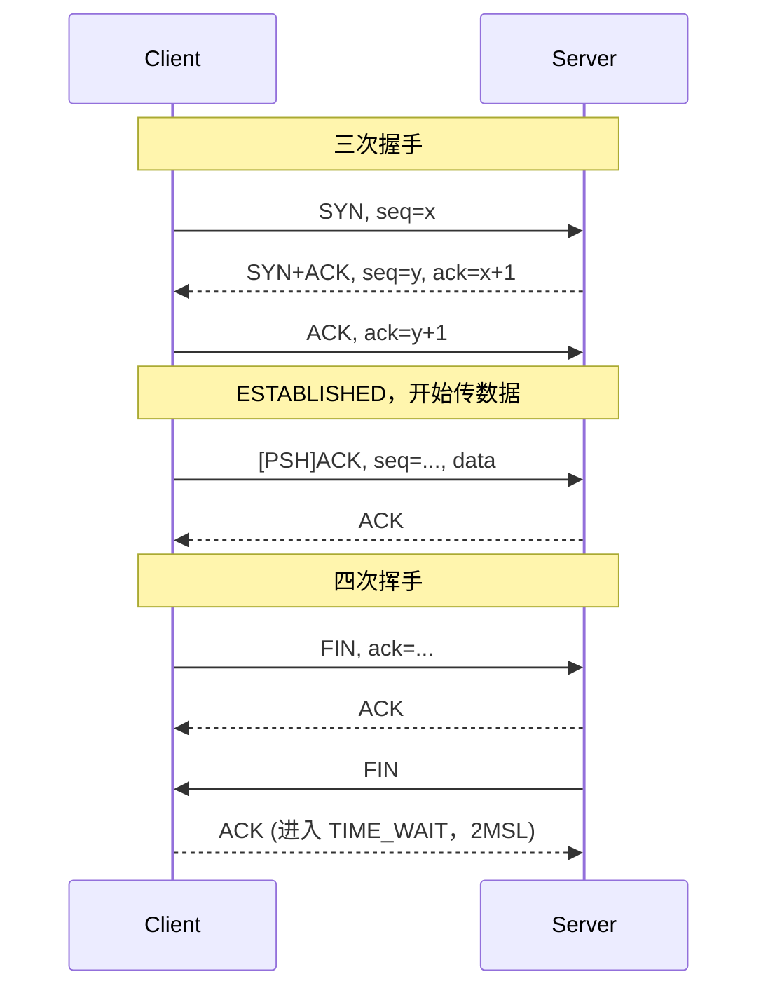
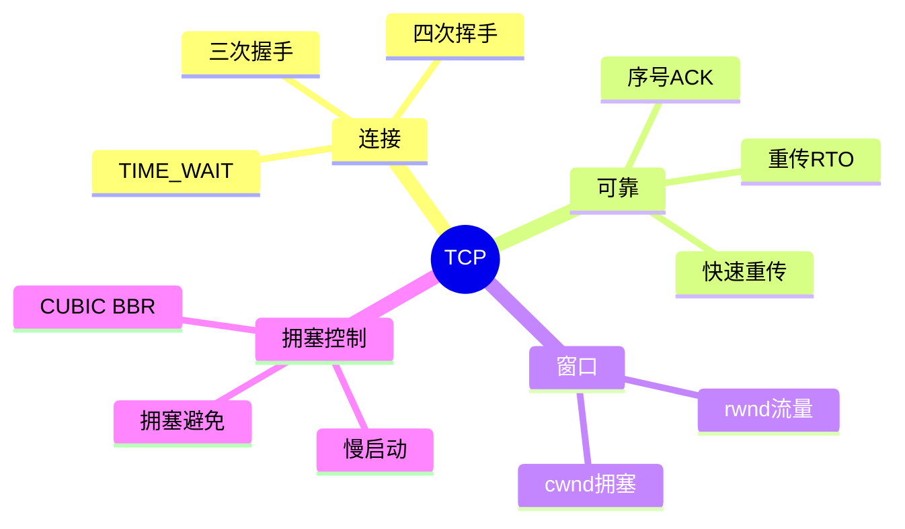

## 1. 工作原理

TCP 把应用数据切成段，逐字节编号（Sequence Number）。接收方对"连续收到的最大字节"回 ACK；发送方未收到 ACK 即重传。通过 rwnd（接收窗口）和 cwnd（拥塞窗口）联合限速，保证可靠且不过载。

## 2. 报文 / 头部结构

固定头 20 字节，含选项最长 60 字节：

| 字段 | 位/字节 | 说明 |
|------|--------|------|
| Source / Dest Port | 各 16 bit | 端口号，标识会话两端 |
| **Sequence Number** | 32 bit | 本段首个字节的序号（SYN/FIN 各占 1 个序号） |
| **Acknowledgment Number** | 32 bit | 期望收到的下一个字节序号（ACK 置位才有效） |
| Data Offset | 4 bit | 头部长度（以 4 字节为单位） |
| **Flags** | 9 bit | SYN / ACK / FIN / RST / PSH / URG / ECE / CWR / NS |
| **Window** | 16 bit | 接收窗口 rwnd（流量控制） |
| Checksum | 16 bit | 含伪首部校验 |
| Urgent Pointer | 16 bit | URG 置位时有效 |
| Options | 变长 | MSS、SACK、Window Scale、Timestamp 等 |

> **MSS**（最大报文段）一般为 **1460**（1500−20IP−20TCP），经 MSS 协商确定。

## 3. 交互流程

## 4. 关键机制

- **滑动窗口 / 流量控制**：发送方"已发送未确认"不得超 rwnd；窗口为 0 时发送方启动_probe。
- **重传**：超时 RTO（随 RTT 动态估算）或 **快速重传**（收 3 个重复 ACK 即重发，无需等超时）。
- **拥塞控制四阶段**：
  1. **慢启动**：cwnd 指数增长（每 ACK 翻倍），至 ssthresh；
  2. **拥塞避免**：cwnd 线性 +1；
  3. **丢包（3 dup ACK）→ 快速重传 + 快速恢复**：ssthresh=cwnd/2，cwnd=ssthresh；
  4. **超时（RTO）→ 回到慢启动**，ssthresh=cwnd/2，cwnd=1。
  - 现代算法 **CUBIC**（Linux 默认）、**BBR**（基于带宽时延积）。
- **TIME_WAIT**：主动关闭方在 `TIME_WAIT` 等 **2MSL**（Linux 60s），确保最后 ACK 抵达、旧报文消散。

## 5. 知识框架

