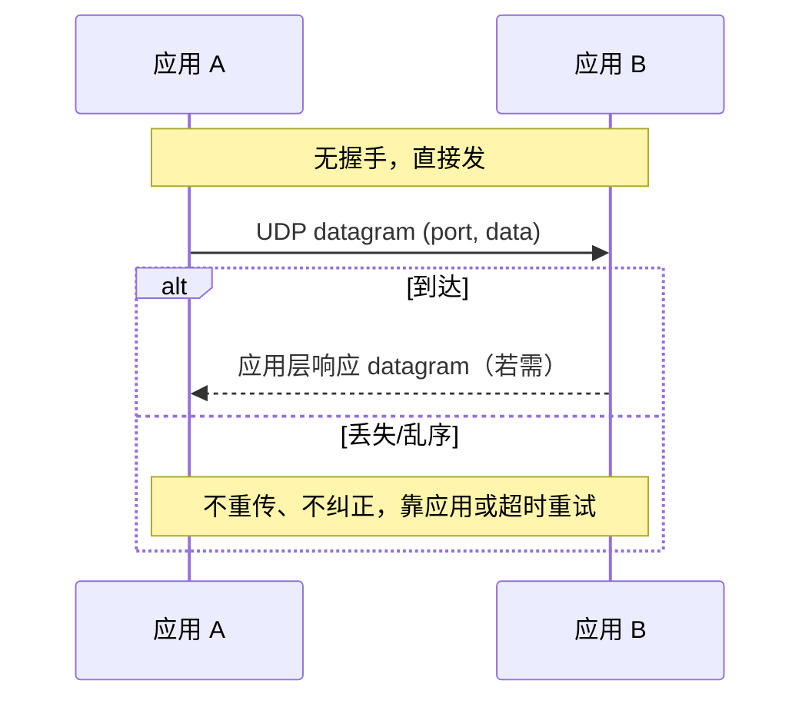
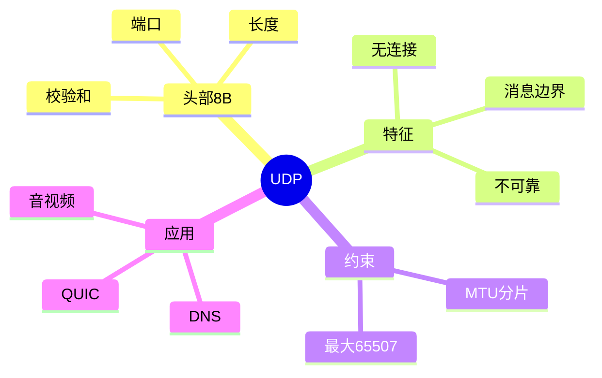

## 1. 工作原理

UDP 是"最小传输层"：应用把数据交给 UDP，UDP 加 8 字节头（含端口），直接交给 IP 发出。无连接状态、无确认、无重传。一条 datagram 即一个独立报文，接收方 `recvfrom` 一次收完整条，天然保留消息边界。

## 2. 报文 / 头部结构

固定 **8 字节**：

| 字段 | 字节 | 说明 |
|------|------|------|
| Source Port | 2 | 源端口（可选，0=无） |
| Destination Port | 2 | 目的端口 |
| Length | 2 | 头部+数据总长（最小 8，最大 65535） |
| Checksum | 2 | 伪首部+UDP头+数据的校验；IPv4 可置 0，IPv6 必填 |

**伪首部（仅校验用，不随包发送）**：源 IP、目的 IP、保留(0)、协议号(17)、UDP 长度——防止路由误投递。

> 最大载荷 = 65535 − 20(IP) − 8(UDP) = **65507** 字节。

## 3. 交互流程

## 4. 关键机制

- **无连接**：无 `socket` 全双工状态机，sendto/recvfrom 即可，连接仅"绑定默认对端地址"（不发包）。
- **消息边界**：datagram 是交付原子单位，不会像 TCP 那样拆分或合并。
- **MTU 与分片**：数据 > 链路 MTU 时由 IP 层分片，任一片丢失整 datagram 失败；**建议应用层把单包控制在 MSS 内**（如 ≤1400 字节）避免分片。
- **无拥塞控制**：高速 UDP（如视频）可能压垮网络，故 QUIC 在 UDP 之上自建拥塞控制。
- **广播/组播**：无需连接，可直接发 255.255.255.255 或组播地址。

## 5. 知识框架

