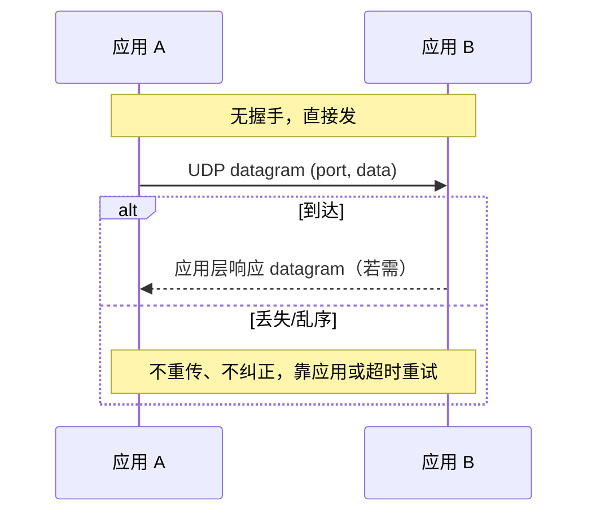
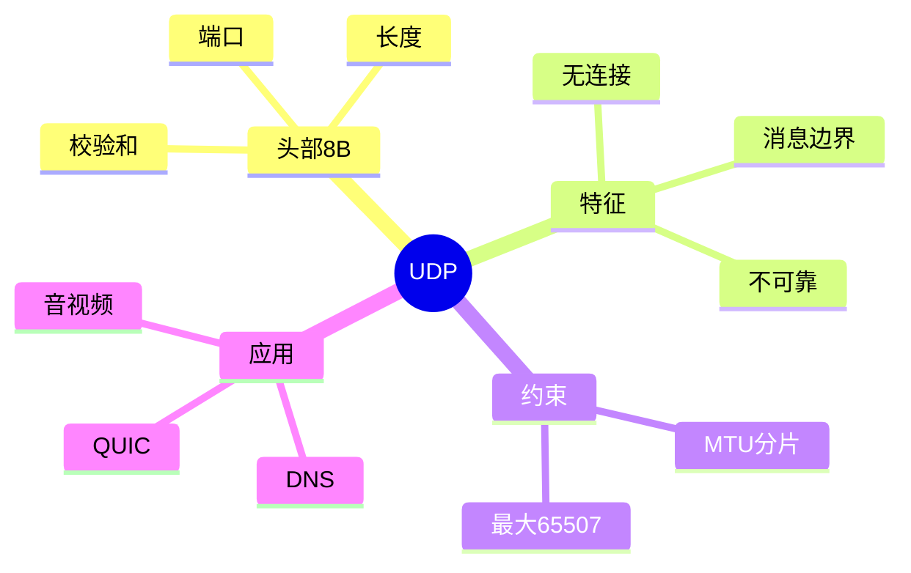

## 先建立直觉

UDP 是传输层里"最偷懒"的那个：**贴上收件人信息，丢出去，完事。**

它不打招呼、不等回音、不管对方在不在、更不管路上堵不堵。就像把一张明信片投进邮筒——投完你就转身走了，收没收到是另一回事。

但它有一点特别干脆：**你写的一张，对方收到就是完整的一张**，不会半张在这、半张在那。所以它虽然不负责任，却非常快、非常简单，边界还特别清楚。

## 它解决什么问题

不是所有场景都值得为"可靠"付出代价。

比如你只想问一句"某某网站的地址是多少"，对方答一句就完了——为这一问一答专门建连接、道别、维护状态，纯属浪费。再比如实时语音，一小段声音丢了就丢了，等它重传过来早就过时了，反而更卡。还有"通知在场所有人"这种一对多的活，需要先建连接的协议根本干不了。

UDP 就是为这些场景准备的：**不做多余的事，把选择权交还给应用**——你要可靠，自己加。

## 工作流程（简化版）

1. 应用把一条数据交给 UDP，并说明发给哪个地址的哪个端口。
2. UDP 加上一个很小的头（写明来自哪个端口、去往哪个端口、多长、校验值），别的什么都不做。
3. 直接交给下层发出去，本地不留任何"这次通信"的状态。
4. 对方收到后按端口交给对应的应用，一次就是完整的一条。
5. 如果路上丢了——**没人会知道，也没人会补**，要重试得应用自己来。

## 1. 工作原理

UDP 是"最小传输层"：应用把数据交给 UDP，UDP 加 8 字节头（含端口），直接交给 IP 发出。无连接状态、无确认、无重传。一条 datagram 即一个独立报文，接收方 `recvfrom` 一次收完整条，天然保留消息边界。

## 报文 / 头部长什么样

> 看这张表前先记住：UDP 头一共就 **8 字节、4 个字段**，可以说是传输层里最简单的头部——**两个端口回答"给谁"，一个长度回答"多长"，一个校验和回答"有没有坏"**，再没有别的了。没有序号、没有确认、没有窗口，因为它压根不做这些事。

固定 **8 字节**：

字段中文全称对照：Source Port = 源端口、Destination Port = 目的端口、Length = 长度、Checksum = 校验和。

| 字段 | 字节 | 说明 |
|------|------|------|
| Source Port | 2 | 源端口（可选，0=无） |
| Destination Port | 2 | 目的端口 |
| Length | 2 | 头部+数据总长（最小 8，最大 65535） |
| Checksum | 2 | 伪首部+UDP头+数据的校验；IPv4 可置 0，IPv6 必填 |

**伪首部（仅校验用，不随包发送）**：源 IP、目的 IP、保留(0)、协议号(17)、UDP 长度——防止路由误投递。

> 最大载荷 = 65535 − 20(IP) − 8(UDP) = **65507** 字节。

## 交互时序

> 一句话看懂这张图：没有握手也没有挥手，发出去只有两种结局——要么对方收到（要不要回是应用自己的事），要么悄无声息地丢了，协议本身不做任何补救。

## 关键机制 / 变体

- **无连接** —— 这是解释"为什么它这么轻"：无 `socket` 全双工状态机，sendto/recvfrom 即可，连接仅"绑定默认对端地址"（不发包）。
- **消息边界** —— 这是解释"为什么 UDP 不会粘包"：datagram 是交付原子单位，不会像 TCP 那样拆分或合并。
- **MTU 与分片** —— 这是解释"为什么大包特别容易丢"：数据 > 链路 MTU 时由 IP 层分片，任一片丢失整 datagram 失败；**建议应用层把单包控制在 MSS 内**（如 ≤1400 字节）避免分片。
- **无拥塞控制** —— 这是解释"为什么 UDP 会把网络压垮"：高速 UDP（如视频）可能压垮网络，故 QUIC 在 UDP 之上自建拥塞控制。
- **广播/组播** —— 这是解释"为什么一对多只能靠它"：无需连接，可直接发 255.255.255.255 或组播地址。

## 常见误区

1. **"UDP 也会粘包"** —— 不会。UDP 是 datagram 模型，一次 `recvfrom` 正好收到完整一条，边界由协议保留。看到数据"粘在一起"，那是应用自己拼的或用错了流式 API。
2. **"最大能发 65507 字节，那就放心发大包"** —— 危险。超过链路 MTU 就要由 IP 层分片，**任一分片丢失整条 datagram 就废了**，建议把单包控制在 ≤1400 字节。
3. **"校验和是可选的，所以 UDP 不校验"** —— 只说对一半。IPv4 下校验和**可以**置 0 表示不计算，但 **IPv6 下是必填的**。而且校验时还要带上伪首部（源 IP、目的 IP、协议号 17 等），用于防止路由误投递。
4. **"UDP 不可靠，所以不能用于重要场景"** —— 不对。可靠性可以在上层补：DNS 靠应用层超时重试，QUIC 干脆在 UDP 之上自建了完整的可靠传输和拥塞控制。

## 速记口诀

- **"两端口、一长度、一校验，八个字节全说完。"**
- **"不握手、不确认、不重传、不控速——四不像，就是 UDP。"**
- **"65535 减 20 减 8，最大载荷 65507。"**
- **"TCP 是水流没边界，UDP 是信封一封封。"**

## 知识框架

