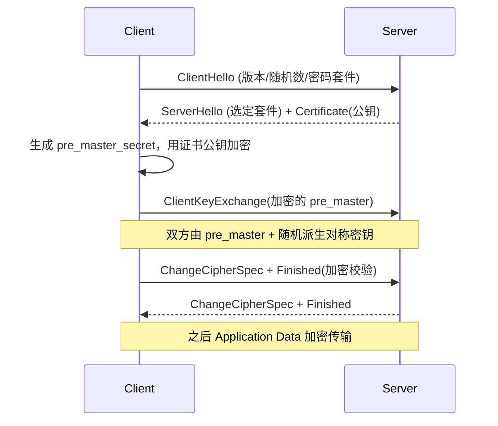
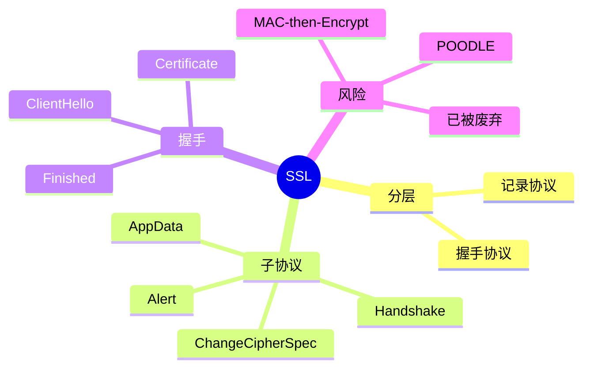

## 🚀 先建立直觉

SSL 要做的事，可以用一句话概括：**在正式聊之前，先确认"你是不是本人"，再商量一套"只有我俩懂的说话方式"。**

就像跟银行柜台打交道：先看对方的执照确认身份，然后约定一套暗号，之后所有对话都用暗号进行。旁人能看见你们在说话、说了多久，但听不懂内容，也没法偷偷改掉其中一句——因为一改对方核对时就会发现。

它不负责把话送到（那是下面一层的事），只负责**让这段对话变得听不懂、改不了、且对面确实是本人**。

## 🤔 它解决什么问题

没有它，网络上的通信就像在广场上大声念银行卡密码：路过的每一个人都能听见，能记下来，甚至能在你说到一半时替你改几个字，或者干脆假扮成银行来跟你对话。

三种危险同时存在：**被偷听、被篡改、被冒名顶替**。

SSL 把这三件事一次性解决：内容加密解决偷听，校验码解决篡改，证书解决冒名顶替。再加上会话复用，让第二次打交道时不用把整套流程重来一遍。

## 🔄 工作流程（简化版）

1. 客户端先开口打招呼，报上自己支持的版本和加密方式，并附带一串随机数。
2. 服务端回话，从里面挑一套双方都支持的加密方式，并把自己的证书（含公钥）亮出来。
3. 客户端验证证书没问题后，造出一份只有自己知道的秘密，用服务端公钥加密后送过去。
4. 双方各自用这份秘密加上两边的随机数，算出同一套对称密钥——**这套密钥从未在网上传输过**。
5. 双方互发"我要开始用加密了"和一条加密的校验消息，彼此核对无误后，正式进入加密通信。

## 1. 工作原理

SSL 分两层：**记录协议**（Record）负责把上层数据分片、压缩、加 MAC、加密后发出；**握手协议**负责协商版本/密码套件、交换证书、派生会话密钥。握手完成后，应用数据经记录协议加密批量传输。

## 📦 报文 / 记录头长什么样

> 看这张表前先记住：不管是握手、告警还是业务数据，**在 SSL 眼里都只是"一条记录"**，每条记录前面统一贴一个 5 字节的小标签，告诉对方"这条是什么类型、什么版本、多长"。你在 Wireshark 里看到的第一个字节（20/21/22/23），就是判断这条记录属于哪个子协议的关键。

每条 SSL 记录固定 **5 字节头**（承载于 TCP）：

字段中文全称对照：Content Type = 内容类型（标明属于哪个子协议）、Version = 协议版本、Length = 载荷长度；MAC = Message Authentication Code（消息认证码）。

| 字段 | 字节 | 说明 |
|------|------|------|
| **Content Type** | 1 | 20=ChangeCipherSpec，21=Alert，22=Handshake，23=App Data |
| **Version** | 2 | 如 0x0300(SSLv3)/0x0301(TLS1.0) |
| **Length** | 2 | 载荷长度（≤16384+MAC+填充） |

握手消息（ContentType=22）内常见类型：ClientHello、ServerHello、Certificate、ServerKeyExchange、ClientKeyExchange、Finished 等。

## 🔀 交互时序（以 RSA 密钥交换为例）

> 一句话看懂这张图：上半段是**明文**的"打招呼 + 亮证书"，中间客户端把一份秘密用公钥加密送过去，两边各自算出同一把密钥，最后互发 ChangeCipherSpec + Finished 表示"从下一条起全部加密"。

## 🔧 关键机制 / 变体

- **密钥派生** —— 这是解决"密钥怎么在不传输的前提下让双方都得到"的问题：Client/Server Random + pre_master_secret → PRF → master_secret → 拆成对称密钥、MAC 密钥、IV。
- **MAC-then-Encrypt（SSLv3）** —— 这是 SSL 最著名的一处设计失误，理解它才理解 POODLE：先对 `明文+序号+类型+长度` 算 MAC，再对"明文+MAC"加密。该顺序使填充 oracle 可利用 → **POODLE（CVE-2014-3566）**。TLS 改用 **Encrypt-then-MAC**（RFC 7366）或 AEAD（GCM/CCM）。
- **子协议职责** —— 这是解决"同一条通道里怎么区分不同用途的消息"的问题：Handshake 建参数；ChangeCipherSpec 通知"此后加密"；Alert 报错（如 close_notify）；Application Data 传业务。
- **会话复用** —— 这是解决"每次都重新握手太慢"的问题：Session ID / Session Ticket 缓存 master_secret，跳过密钥交换，缩短握手。

## ⚠️ 常见误区

1. **"SSL 就是现在的 HTTPS 协议"** —— 不是。SSLv3 已被 **RFC 7568 正式废弃**，现代只用 **TLS 1.2/1.3**。日常说的"SSL 证书"其实是 TLS 证书，只是名字沿用。
2. **"pre_master_secret 就是最终用来加密的密钥"** —— 不是。它只是原料，还要和 Client/Server Random 一起经 PRF 派生出 master_secret，再拆成对称密钥、MAC 密钥和 IV。
3. **"握手随机数只是随便加的"** —— 不是。Client/Server Random 用于防重放，并直接参与 master_secret 的派生，保证每次会话密钥都不同。
4. **"MAC 和加密谁先谁后无所谓"** —— 大有所谓。SSLv3 的 **MAC-then-Encrypt** 正是 POODLE（CVE-2014-3566）能成立的根源；TLS 因此改用 Encrypt-then-MAC（RFC 7366）或 AEAD。
5. **"看到 ChangeCipherSpec 就说明握手结束了"** —— 它只是通知"此后我发的内容开始加密"，真正确认握手无误的是随后那条加密的 **Finished**。

## 🧠 速记口诀

- **"20 换密、21 报警、22 握手、23 传数据。"**（ContentType 四个值）
- **"先验证书再换钥，换完钥匙才说话。"**
- **"记录协议管封装，握手协议管谈判。"**
- **"先 MAC 后加密出了 POODLE，TLS 改成先加密后 MAC。"**

## 🗺️ 知识框架

