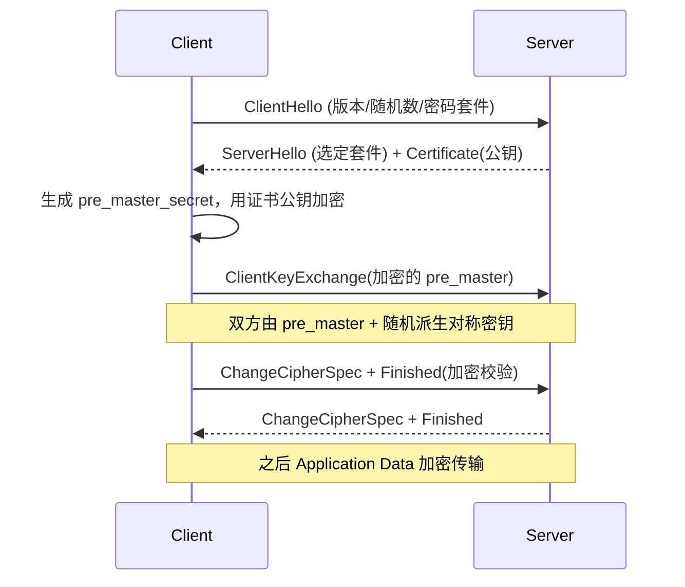
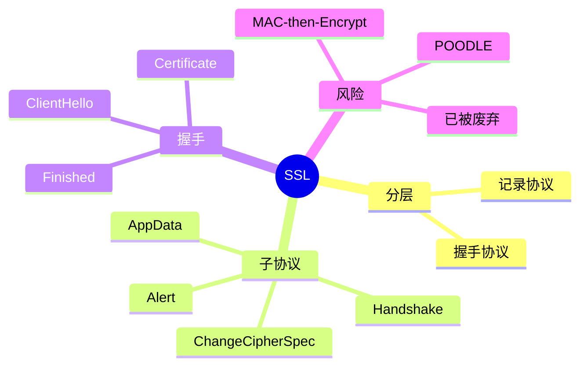

## 1. 工作原理

SSL 分两层：**记录协议**（Record）负责把上层数据分片、压缩、加 MAC、加密后发出；**握手协议**负责协商版本/密码套件、交换证书、派生会话密钥。握手完成后，应用数据经记录协议加密批量传输。

## 2. 报文 / 记录头结构

每条 SSL 记录固定 **5 字节头**（承载于 TCP）：

| 字段 | 字节 | 说明 |
|------|------|------|
| **Content Type** | 1 | 20=ChangeCipherSpec，21=Alert，22=Handshake，23=App Data |
| **Version** | 2 | 如 0x0300(SSLv3)/0x0301(TLS1.0) |
| **Length** | 2 | 载荷长度（≤16384+MAC+填充） |

握手消息（ContentType=22）内常见类型：ClientHello、ServerHello、Certificate、ServerKeyExchange、ClientKeyExchange、Finished 等。

## 3. 交互流程（以 RSA 密钥交换为例）

## 4. 关键机制

- **密钥派生**：Client/Server Random + pre_master_secret → PRF → master_secret → 拆成对称密钥、MAC 密钥、IV。
- **MAC-then-Encrypt（SSLv3）**：先对 `明文+序号+类型+长度` 算 MAC，再对"明文+MAC"加密。该顺序使填充 oracle 可利用 → **POODLE（CVE-2014-3566）**。TLS 改用 **Encrypt-then-MAC**（RFC 7366）或 AEAD（GCM/CCM）。
- **子协议职责**：Handshake 建参数；ChangeCipherSpec 通知"此后加密"；Alert 报错（如 close_notify）；Application Data 传业务。
- **会话复用**：Session ID / Session Ticket 缓存 master_secret，跳过密钥交换，缩短握手。

## 5. 知识框架

