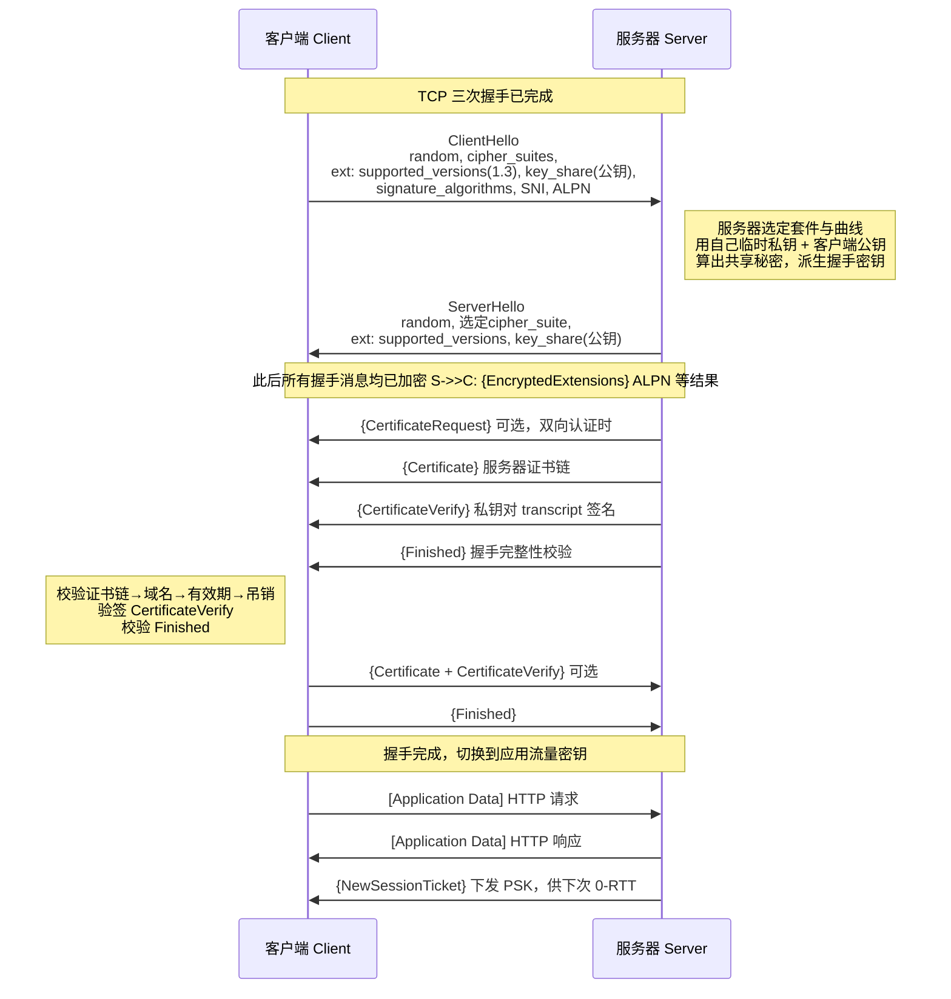
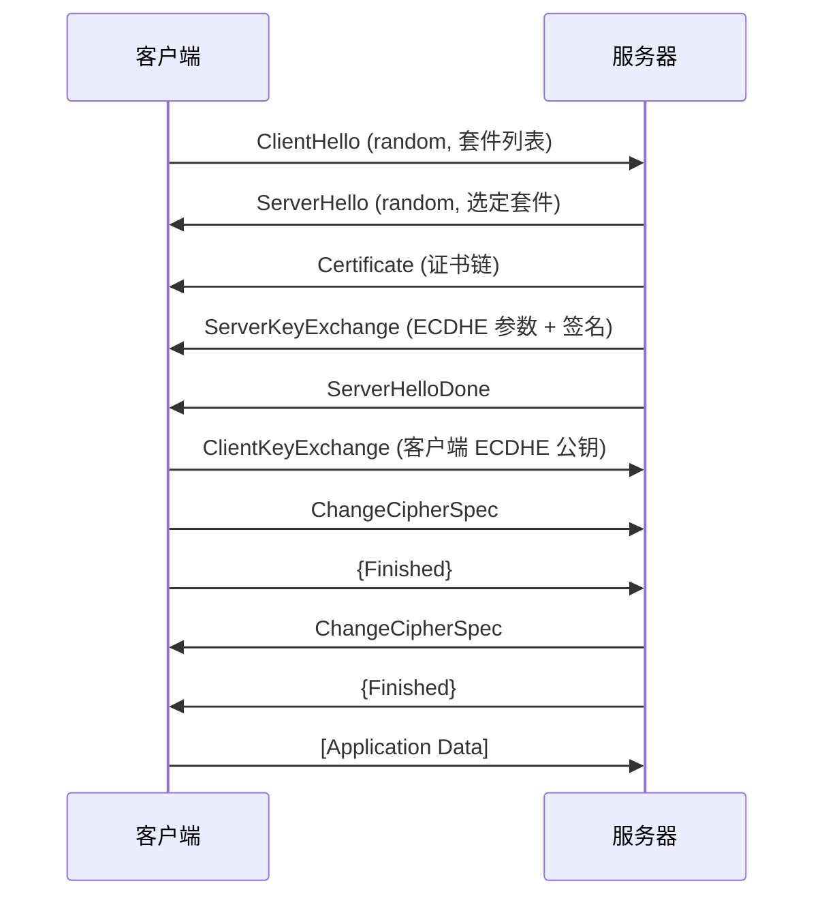
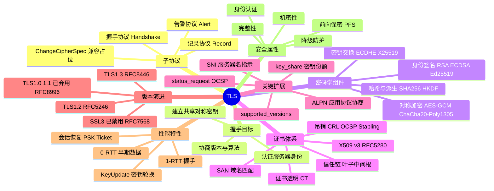

## 先建立直觉

两个陌生人想在人来人往的大街上说悄悄话，得先做两件事：一是确认对方真是自己要找的人，二是当场约定一套只有彼此懂的暗号。TLS 干的就是这两件事——**先验明正身，再约定暗号，然后所有对话都用暗号说**。

约定暗号的过程叫"握手"，只在最开始做一次；之后海量的正常通信都走"用暗号说话"这条快速通道。所以 TLS 的性能开销集中在开头那一小段，后面几乎察觉不到。

## 它解决什么问题

如果没有 TLS，数据在网络上就是一路裸奔的明文。具体会缺三样东西：

- **不知道对面是谁**。你以为在和银行说话，其实可能在和一个假装成银行的人说话。TLS 用证书 + 数字签名让服务器（必要时还有客户端）证明"我确实持有这个身份对应的私钥"。
- **没有只属于双方的密钥**。想加密就得先有共享密钥，可密钥本身怎么在公开网络上安全地约定？TLS 让双方各生成一对临时密钥，只交换公钥，各自算出同一个共享秘密——中间人即使把两个公钥都抄走也算不出来。
- **不知道数据有没有被改过**。TLS 给每一片数据附上认证标签，还在握手结束时对全部握手消息做一次哈希校验，一旦被动过手脚立刻能发现并断开。

背后那句核心权衡是：**非对称密码慢，但能在零预共享的前提下解决身份问题；对称密码快，但必须先有共享密钥**。于是用前者一次性建立后者——这就是"混合密码体系"。

## 工作流程（简化版）

用五步看懂 TLS 一次连接的全过程：

1. **打招呼并亮底牌**：客户端告诉服务器"我支持这些版本和算法，这是我的临时公钥"。
2. **服务器拍板并亮身份**：服务器从中挑一套算法，交出自己的临时公钥，并出示证书证明自己是谁。
3. **各自算出同一把钥匙**：双方用"自己的临时私钥 + 对方的临时公钥"算出完全相同的共享秘密，谁也没在网上传过这把钥匙。
4. **互相验收**：客户端校验证书链和签名，双方再用 Finished 消息核对"我们看到的握手过程完全一致，没被人改过"。
5. **进入高速加密通道**：之后所有应用数据都被切片、用对称密钥加密后发送，接收方解密并校验标签。

**展开细节（原理原文）**

TLS 的运行分为**两个阶段**，对应两个子协议：

**阶段一：握手（Handshake）** —— 明文起步，逐步转为加密。目标是达成三件事：
1. **协商参数**：TLS 版本、密码套件（Cipher Suite）、椭圆曲线组（Named Group）、签名算法。
2. **认证身份**：服务器（可选客户端）用证书 + 数字签名证明自己持有对应私钥。
3. **建立共享密钥**：双方各生成一对临时 ECDHE 密钥对，交换公钥后各自算出相同的共享秘密（Shared Secret），任何中间人即使抓到两个公钥也算不出来。

**阶段二：记录（Record）** —— 应用数据被切分成 ≤16384 字节的片段，每片用握手得出的对称密钥做 AEAD 加密后加上 5 字节记录头发出。接收方解密并校验认证标签，标签不匹配立即发 `bad_record_mac` 告警并断开。

密码学分工的核心思路是**"非对称慢但能解决身份，对称快但需要预共享密钥"**——用前者一次性建立后者，即混合密码体系。

## 报文 / 头部长什么样

### TLS 记录层头部（Record Header，固定 5 字节）

> 看这张表前先记住：**每一条 TLS 数据出门前都要戴上这顶 5 字节的"帽子"**，帽子只说三件事——里面装的是什么类型、假装自己是哪个版本、后面还有多长。

| 字段 | 长度 | 含义 |
|------|------|------|
| ContentType（内容类型） | 1 字节 | 内容类型：`20`=change_cipher_spec、`21`=alert、`22`=handshake、`23`=application_data。TLS 1.3 加密后一律伪装成 `23` |
| LegacyRecordVersion（历史版本号） | 2 字节 | 历史版本号。TLS 1.3 中固定填 `0x0303`（伪装成 1.2 以穿透中间设备），真实版本在 `supported_versions` 扩展中 |
| Length（长度） | 2 字节 | 后续密文（或明文）长度，明文 ≤ 2^14，密文 ≤ 2^14+256 |
| Fragment（载荷分片） | 可变 | 载荷。加密后为 `AEAD(明文 ‖ 真实ContentType ‖ 可选填充)` |

TLS 版本号编码：TLS 1.0=`0x0301`，1.1=`0x0302`，1.2=`0x0303`，1.3=`0x0304`。

### 握手消息类型（HandshakeType）

> 看这张表前先记住：**握手就是一场按剧本走的对话**，下面每一行都是剧本里的一句台词，编号就是台词的代号；抓包时看到的 `tls.handshake.type` 数字，对照这张表就知道演到哪一幕了。

| 值 | 名称 | 作用 |
|----|------|------|
| 1 | client_hello（客户端问候） | 客户端随机数、会话 ID、密码套件列表、扩展（SNI/ALPN/key_share/supported_versions） |
| 2 | server_hello（服务器问候） | 服务器随机数、选定的密码套件、服务器 key_share |
| 4 | new_session_ticket（新会话票据） | 下发 PSK 票据，用于后续会话恢复 / 0-RTT |
| 8 | encrypted_extensions（加密扩展） | **TLS 1.3 新增**，加密传输非密钥相关的扩展（ALPN 结果等） |
| 11 | certificate（证书） | 证书链（叶子证书在前，根证书通常省略） |
| 13 | certificate_request（证书请求） | 请求客户端证书（双向认证 mTLS） |
| 15 | certificate_verify（证书持有性验证） | 用证书私钥对握手记录（transcript hash）签名，证明"我真的持有私钥" |
| 20 | finished（握手完成校验） | 对全部握手消息做 HMAC，双向校验握手未被篡改 |

### 密码套件命名解析

> 看这张表前先记住：**密码套件的名字不是随便起的，它是一串"配方清单"**，按顺序告诉你这次连接用什么方式换钥匙、用什么方式验身份、用什么算法加密、用什么哈希。

TLS 1.2 格式：`TLS_ECDHE_RSA_WITH_AES_128_GCM_SHA256`

| 片段 | 含义 |
|------|------|
| `ECDHE`（临时椭圆曲线 Diffie-Hellman） | 密钥交换算法（临时椭圆曲线 DH，提供前向保密） |
| `RSA`（RSA 签名认证） | 证书签名/身份认证算法（也可为 ECDSA） |
| `AES_128_GCM`（高级加密标准 128 位 GCM 模式） | 对称加密算法 + 密钥长度 + 工作模式（GCM 属 AEAD） |
| `SHA256`（安全哈希算法 256 位） | PRF 哈希算法（GCM 模式下不再单独做 MAC） |

TLS 1.3 大幅简化，套件只描述"对称算法 + 哈希"，密钥交换与签名由扩展单独协商，仅 5 个：
`TLS_AES_128_GCM_SHA256`、`TLS_AES_256_GCM_SHA384`、`TLS_CHACHA20_POLY1305_SHA256`、`TLS_AES_128_CCM_SHA256`、`TLS_AES_128_CCM_8_SHA256`。

## 交互时序

### TLS 1.3 完整握手（1-RTT）

> 一句话看懂这张图：**客户端一开口就把临时公钥递了过去，服务器一回话就能算出密钥并立刻用它加密后面所有内容**，所以只用一个来回就谈妥了。



> `{}` 表示用握手密钥加密，`[]` 表示用应用数据密钥加密。**客户端在发出第 2 个 flight 的同时就能带上应用数据**，因此总耗时为 1 个 RTT。

### TLS 1.2 完整握手（2-RTT，对比用）

> 一句话看懂这张图：**1.2 把"换钥匙"拆成了两个来回**——服务器先把参数和证书摊开（且是明文），客户端第二轮才交出自己的公钥，所以要等两个 RTT 才能发第一个字节的业务数据。



关键差异：TLS 1.2 的**证书是明文传输**的（可被中间设备看到你访问哪个站点），且客户端必须等到第二个 RTT 才能发数据。

## 关键机制 / 变体

### 1. 密钥派生（Key Schedule，TLS 1.3）

**这是干什么的**：把握手中得到的"原料"（PSK、ECDHE 共享秘密）一步步熬成各个阶段真正要用的钥匙，保证每个用途一把钥匙、互不串味。

TLS 1.3 用 **HKDF**（RFC 5869）构建一条三级密钥链，每一级用 `HKDF-Extract` 吸收新的输入熵，用 `HKDF-Expand-Label` 派生具体用途的密钥：

```
       0
       |
     Extract ← PSK（无 PSK 时填 0）
       |
  Early Secret ──► client_early_traffic_secret（0-RTT 用）
       |
     Extract ← ECDHE 共享秘密
       |
 Handshake Secret ──► {client,server}_handshake_traffic_secret
       |
     Extract ← 0
       |
  Master Secret ──► {client,server}_application_traffic_secret_0
                 ──► exporter_master_secret / resumption_master_secret
```

每个 traffic_secret 再派生出实际的 `key` 与 `iv`。应用密钥还支持 **KeyUpdate** 主动轮换，长连接下限制单密钥加密的数据量。

### 2. 前向保密（Perfect Forward Secrecy, PFS）

**这是干什么的**：让"今天录下的流量，明天拿到私钥也解不开"，把长期私钥和会话密钥彻底解耦。

TLS 1.3 **删除了 RSA 密钥传输（Key Transport）模式**，强制使用 (EC)DHE。区别在于：

- **RSA 密钥传输（1.2 遗留）**：客户端生成 pre-master secret，用服务器公钥加密发过去。攻击者只要日后拿到服务器私钥，就能解密历史流量。
- **ECDHE**：双方临时公私钥对握手结束即销毁，服务器长期私钥只用于**签名**（证明身份），不参与密钥计算，泄露也无法回溯解密。

### 3. 证书校验（Certificate Validation）

**这是干什么的**：回答"对面出示的这张证书，凭什么值得我相信"，靠一串逐级上溯的检查把信任落到本地根 CA 上。

客户端收到 `Certificate` 后依次校验：

1. **链构建**：叶子证书的 Issuer 是否匹配上级证书的 Subject，逐级上溯到本地信任库中的根 CA。
2. **签名验证**：用上级公钥验证下级证书的签名。
3. **有效期**：`notBefore ≤ 当前时间 ≤ notAfter`。
4. **域名匹配**：访问的主机名必须出现在证书的 **SAN（Subject Alternative Name）** 扩展中（RFC 6125；CN 字段早已废弃）。
5. **用途约束**：`Key Usage` / `Extended Key Usage` 必须含 `serverAuth`；中间 CA 需有 `basicConstraints: CA:TRUE`。
6. **吊销状态**：CRL 或 OCSP；生产环境推荐 **OCSP Stapling**（服务器代查并把签名过的 OCSP 响应附在握手里），避免客户端额外一次网络请求泄露访问隐私。
7. **CertificateVerify 验签**：确认对端确实持有证书对应的私钥（而不是抄了一份别人的公开证书）。

### 4. 0-RTT 早期数据（Early Data）及其风险

**这是干什么的**：用上次留下的"票据"跳过重新协商，第一个包就带业务数据，把延迟压到零个 RTT——代价是牺牲了一部分安全性。

拿到 `NewSessionTicket` 后，客户端下次可在 `ClientHello` 中携带 `pre_shared_key` 扩展并**立刻附上应用数据**，实现 0-RTT。代价是：0-RTT 数据**不具备前向保密**，且**可被重放（Replay）**。因此规范要求 0-RTT 只用于幂等操作（如 `GET`），RFC 8470 定义了 `Early-Data` 头与 `425 Too Early` 状态码供服务端拒绝。

### 5. 降级攻击防护

**这是干什么的**：防止中间人把一次本可以用 1.3 的握手"忽悠"回老版本，从而用老版本的弱点下手。

若客户端支持 1.3 但服务器（或中间人）回落到 1.2，服务器需在 ServerHello Random 的最后 8 字节填入哨兵值 `44 4F 57 4E 47 52 44 01`（"DOWNGRD\x01"）。真 1.3 客户端检测到该值即中止握手。这是对 FREAK / Logjam 一类降级攻击的直接补丁。

## 常见误区

- **误区一：记录层里写的版本号就是真实版本。** 不是。TLS 1.3 的 `LegacyRecordVersion` 固定填 `0x0303`（也就是 1.2 的编码）来穿透中间设备，真实协商版本在 `supported_versions` 扩展里。
- **误区二：TLS 1.3 的 ContentType 能直接看出这条记录装的是什么。** 加密之后一律伪装成 `23`（application_data），真实的 ContentType 被塞进了加密载荷内部（`AEAD(明文 ‖ 真实ContentType ‖ 可选填充)`）。
- **误区三：有了服务器私钥就能解密任何历史流量。** 只有 RSA 密钥传输模式才如此。用 ECDHE 时服务器长期私钥只负责签名、不参与密钥计算，临时密钥对握手结束即销毁，这就是前向保密。
- **误区四：0-RTT 又快又好，能全面开启。** 0-RTT 数据不具备前向保密且可被重放，只能用于幂等操作（如 `GET`），服务端还可用 `425 Too Early` 拒绝。

## 速记口诀

> **握手一次谈，记录天天用；非对称验身份，对称跑数据。**

> **1.3 一个来回，1.2 两个来回；证书 1.2 明文走，1.3 藏进密文里。**

> **看版本别看记录头，`supported_versions` 才是真；ContentType 全成 23，别被 `0x0303` 骗了眼。**

## 知识框架


