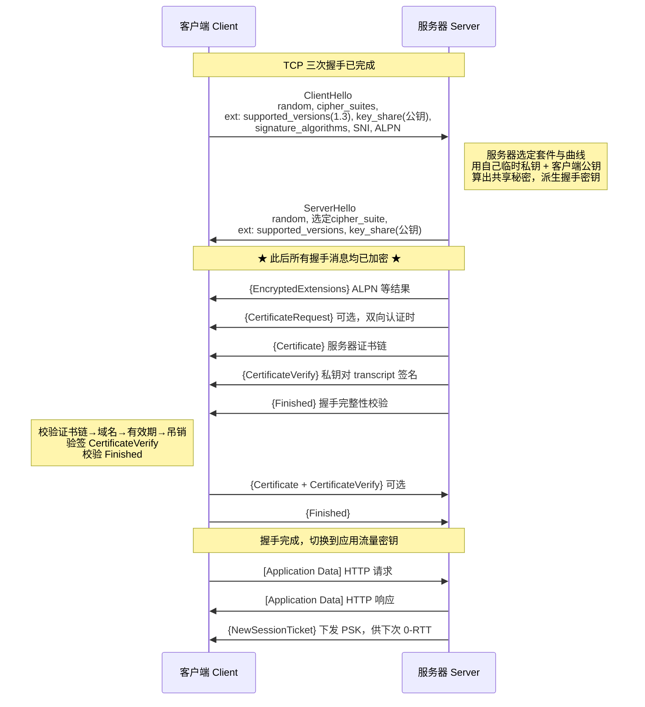
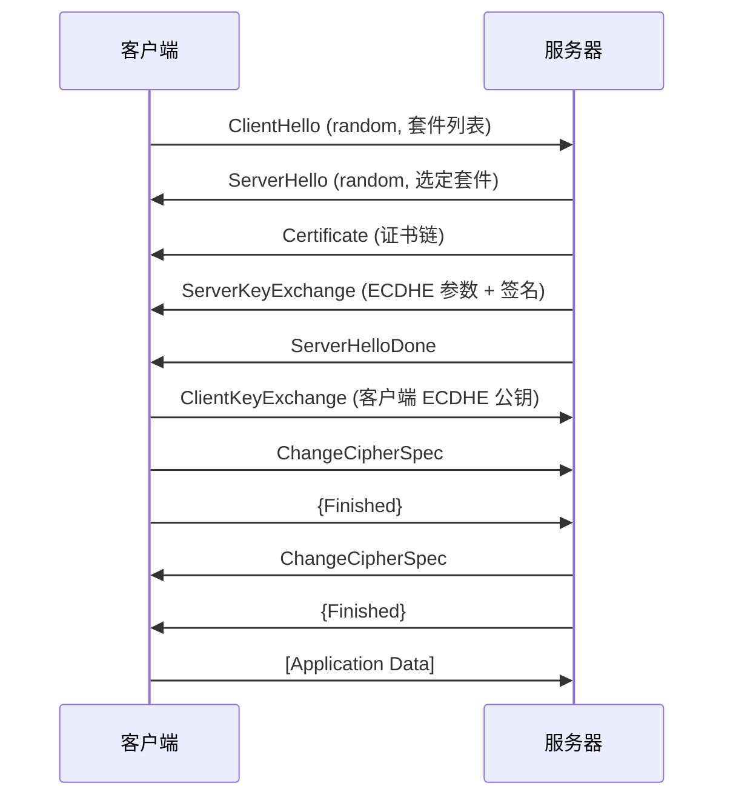
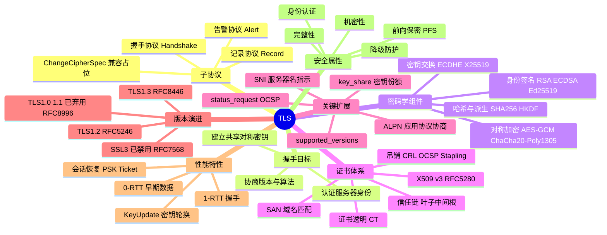

## 工作原理

TLS 的运行分为**两个阶段**，对应两个子协议：

**阶段一：握手（Handshake）** —— 明文起步，逐步转为加密。目标是达成三件事：
1. **协商参数**：TLS 版本、密码套件（Cipher Suite）、椭圆曲线组（Named Group）、签名算法。
2. **认证身份**：服务器（可选客户端）用证书 + 数字签名证明自己持有对应私钥。
3. **建立共享密钥**：双方各生成一对临时 ECDHE 密钥对，交换公钥后各自算出相同的共享秘密（Shared Secret），任何中间人即使抓到两个公钥也算不出来。

**阶段二：记录（Record）** —— 应用数据被切分成 ≤16384 字节的片段，每片用握手得出的对称密钥做 AEAD 加密后加上 5 字节记录头发出。接收方解密并校验认证标签，标签不匹配立即发 `bad_record_mac` 告警并断开。

密码学分工的核心思路是**"非对称慢但能解决身份，对称快但需要预共享密钥"**——用前者一次性建立后者，即混合密码体系。

## 报文 / 头部结构

### TLS 记录层头部（Record Header，固定 5 字节）

| 字段 | 长度 | 含义 |
|------|------|------|
| ContentType | 1 字节 | 内容类型：`20`=change_cipher_spec、`21`=alert、`22`=handshake、`23`=application_data。TLS 1.3 加密后一律伪装成 `23` |
| LegacyRecordVersion | 2 字节 | 历史版本号。TLS 1.3 中固定填 `0x0303`（伪装成 1.2 以穿透中间设备），真实版本在 `supported_versions` 扩展中 |
| Length | 2 字节 | 后续密文（或明文）长度，明文 ≤ 2^14，密文 ≤ 2^14+256 |
| Fragment | 可变 | 载荷。加密后为 `AEAD(明文 ‖ 真实ContentType ‖ 可选填充)` |

TLS 版本号编码：TLS 1.0=`0x0301`，1.1=`0x0302`，1.2=`0x0303`，1.3=`0x0304`。

### 握手消息类型（HandshakeType）

| 值 | 名称 | 作用 |
|----|------|------|
| 1 | client_hello | 客户端随机数、会话 ID、密码套件列表、扩展（SNI/ALPN/key_share/supported_versions） |
| 2 | server_hello | 服务器随机数、选定的密码套件、服务器 key_share |
| 4 | new_session_ticket | 下发 PSK 票据，用于后续会话恢复 / 0-RTT |
| 8 | encrypted_extensions | **TLS 1.3 新增**，加密传输非密钥相关的扩展（ALPN 结果等） |
| 11 | certificate | 证书链（叶子证书在前，根证书通常省略） |
| 13 | certificate_request | 请求客户端证书（双向认证 mTLS） |
| 15 | certificate_verify | 用证书私钥对握手记录（transcript hash）签名，证明"我真的持有私钥" |
| 20 | finished | 对全部握手消息做 HMAC，双向校验握手未被篡改 |

### 密码套件命名解析

TLS 1.2 格式：`TLS_ECDHE_RSA_WITH_AES_128_GCM_SHA256`

| 片段 | 含义 |
|------|------|
| `ECDHE` | 密钥交换算法（临时椭圆曲线 DH，提供前向保密） |
| `RSA` | 证书签名/身份认证算法（也可为 ECDSA） |
| `AES_128_GCM` | 对称加密算法 + 密钥长度 + 工作模式（GCM 属 AEAD） |
| `SHA256` | PRF 哈希算法（GCM 模式下不再单独做 MAC） |

TLS 1.3 大幅简化，套件只描述"对称算法 + 哈希"，密钥交换与签名由扩展单独协商，仅 5 个：
`TLS_AES_128_GCM_SHA256`、`TLS_AES_256_GCM_SHA384`、`TLS_CHACHA20_POLY1305_SHA256`、`TLS_AES_128_CCM_SHA256`、`TLS_AES_128_CCM_8_SHA256`。

## 交互流程

### TLS 1.3 完整握手（1-RTT）



> `{}` 表示用握手密钥加密，`[]` 表示用应用数据密钥加密。**客户端在发出第 2 个 flight 的同时就能带上应用数据**，因此总耗时为 1 个 RTT。

### TLS 1.2 完整握手（2-RTT，对比用）



关键差异：TLS 1.2 的**证书是明文传输**的（可被中间设备看到你访问哪个站点），且客户端必须等到第二个 RTT 才能发数据。

## 关键机制

### 1. 密钥派生（Key Schedule，TLS 1.3）

TLS 1.3 用 **HKDF**（RFC 5869）构建一条三级密钥链，每一级用 `HKDF-Extract` 吸收新的输入熵，用 `HKDF-Expand-Label` 派生具体用途的密钥：

```
       0
       |
     Extract ← PSK（无 PSK 时填 0）
       |
  Early Secret ──► client_early_traffic_secret（0-RTT 用）
       |
     Extract ← ECDHE 共享秘密
       |
 Handshake Secret ──► {client,server}_handshake_traffic_secret
       |
     Extract ← 0
       |
  Master Secret ──► {client,server}_application_traffic_secret_0
                 ──► exporter_master_secret / resumption_master_secret
```

每个 traffic_secret 再派生出实际的 `key` 与 `iv`。应用密钥还支持 **KeyUpdate** 主动轮换，长连接下限制单密钥加密的数据量。

### 2. 前向保密（Perfect Forward Secrecy, PFS）

TLS 1.3 **删除了 RSA 密钥传输（Key Transport）模式**，强制使用 (EC)DHE。区别在于：

- **RSA 密钥传输（1.2 遗留）**：客户端生成 pre-master secret，用服务器公钥加密发过去。攻击者只要日后拿到服务器私钥，就能解密历史流量。
- **ECDHE**：双方临时公私钥对握手结束即销毁，服务器长期私钥只用于**签名**（证明身份），不参与密钥计算，泄露也无法回溯解密。

### 3. 证书校验（Certificate Validation）

客户端收到 `Certificate` 后依次校验：

1. **链构建**：叶子证书的 Issuer 是否匹配上级证书的 Subject，逐级上溯到本地信任库中的根 CA。
2. **签名验证**：用上级公钥验证下级证书的签名。
3. **有效期**：`notBefore ≤ 当前时间 ≤ notAfter`。
4. **域名匹配**：访问的主机名必须出现在证书的 **SAN（Subject Alternative Name）** 扩展中（RFC 6125；CN 字段早已废弃）。
5. **用途约束**：`Key Usage` / `Extended Key Usage` 必须含 `serverAuth`；中间 CA 需有 `basicConstraints: CA:TRUE`。
6. **吊销状态**：CRL 或 OCSP；生产环境推荐 **OCSP Stapling**（服务器代查并把签名过的 OCSP 响应附在握手里），避免客户端额外一次网络请求泄露访问隐私。
7. **CertificateVerify 验签**：确认对端确实持有证书对应的私钥（而不是抄了一份别人的公开证书）。

### 4. 0-RTT 早期数据（Early Data）及其风险

拿到 `NewSessionTicket` 后，客户端下次可在 `ClientHello` 中携带 `pre_shared_key` 扩展并**立刻附上应用数据**，实现 0-RTT。代价是：0-RTT 数据**不具备前向保密**，且**可被重放（Replay）**。因此规范要求 0-RTT 只用于幂等操作（如 `GET`），RFC 8470 定义了 `Early-Data` 头与 `425 Too Early` 状态码供服务端拒绝。

### 5. 降级攻击防护

若客户端支持 1.3 但服务器（或中间人）回落到 1.2，服务器需在 ServerHello Random 的最后 8 字节填入哨兵值 `44 4F 57 4E 47 52 44 01`（"DOWNGRD\x01"）。真 1.3 客户端检测到该值即中止握手。这是对 FREAK / Logjam 一类降级攻击的直接补丁。

## 知识框架


