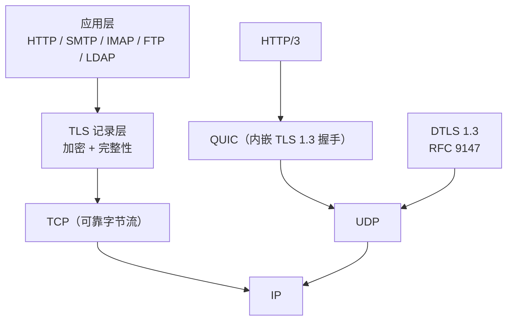

## 协议定位

| 项目 | 信息 |
|------|------|
| 所属层 | 表示/安全层（介于传输层 TCP 与应用层之间，OSI 第 5–6 层，TCP/IP 模型中常归入应用层） |
| 英文全称 | Transport Layer Security |
| 主要 RFC | RFC 8446（TLS 1.3，2018）、RFC 5246（TLS 1.2，2008）、RFC 4346（TLS 1.1）、RFC 2246（TLS 1.0）；RFC 8996 正式弃用 TLS 1.0/1.1 |
| 端口 | 无自有端口。由承载它的应用决定：HTTPS 443、SMTPS 465、IMAPS 993、POP3S 995、LDAPS 636、DoT 853 |
| 封装于 | TCP（可靠字节流）；基于 UDP 的变体为 DTLS（RFC 9147）；QUIC 直接内嵌 TLS 1.3 握手（RFC 9001） |
| 典型应用 | HTTPS、加密邮件（SMTP/IMAP/POP3 STARTTLS）、FTPS、MQTT over TLS、gRPC、VPN（OpenVPN）、DoT/DoH |

## 一句话理解

**TLS 是一层"套在 TCP 上的加密信封"**：它先用非对称密码学完成"你是谁 + 我们约定一个只有彼此知道的密钥"（握手阶段），之后所有应用数据都用这个对称密钥高速加密传输（记录阶段）。应用层协议（HTTP、SMTP…）几乎不用改动，只要把 `write()` 换成 `SSL_write()` 就获得了安全性。

## 生活化类比

想象你要去银行办业务。进门前你会先看柜台后面挂的**营业执照**，确认这真是银行而不是骗子搭的假门面——这就是 TLS 的**证书校验**。确认身份后，你和柜员约定一句只有你俩懂的暗号，之后所有对话都用暗号说，旁边排队的人听见了也不知道你在说什么——这就是**密钥协商 + 对称加密**。

再打个比方：TLS 就像给明信片套上了**不透明的密封信封**。裸 TCP 传的是明信片，沿途每个邮递员都能读、都能涂改；套上 TLS 信封后，只有收件人能拆开，而且信封一旦被撕过，收件人立刻能发现。

## 它解决什么问题

为什么没有它，网络就"缺了一块"：

裸 TCP 传输存在三类致命风险，TLS 分别给出对策：

| 风险 | 攻击示例 | TLS 对策 |
|------|---------|---------|
| **窃听（Confidentiality）** | 同一 Wi-Fi 下 ARP 欺骗后抓包读取明文密码 | 用协商出的对称密钥做 AEAD 加密（AES-GCM / ChaCha20-Poly1305） |
| **篡改（Integrity）** | 运营商在 HTTP 页面里插入广告 JS | 每条记录带 AEAD 认证标签；握手结束用 Finished 消息对全部握手报文做哈希校验 |
| **冒充（Authentication）** | DNS 劫持把你导向假银行站点 | 服务器出示由受信任 CA 签发的 X.509 证书，客户端校验签名链 + 域名 + 有效期 + 吊销状态 |

此外 TLS 1.3 强制**前向保密（PFS）**：即使服务器私钥日后泄露，攻击者也无法解密以前录下的流量——因为每次会话的对称密钥由临时 ECDHE 私钥生成，用完即弃。

## 核心特征

1. 【双子协议分层】**两个子协议分层**：`握手协议（Handshake Protocol）` 负责协商版本、算法、身份与密钥；`记录协议（Record Protocol）` 负责分片、加密、传输。另有 Alert（告警）、ChangeCipherSpec（1.3 中仅作兼容占位）等。
2. 【非对称+对称混用】**混合密码体系（Hybrid Cryptosystem）**：非对称算法（ECDSA/RSA 签名 + ECDHE 密钥交换）只用在握手，成本高但只做一次；对称 AEAD 算法用于海量数据，速度快。
3. 【算法可协商】**算法可协商**：客户端在 `ClientHello` 里列出支持的密码套件（Cipher Suite），服务器挑一个。这带来灵活性，也带来**降级攻击**风险（TLS 1.3 用 `supported_versions` 扩展 + ServerHello Random 中的降级哨兵值来防护）。
4. 【信任源自根 CA】**证书信任链（Chain of Trust）**：`叶子证书 → 中间 CA → 根 CA`。根 CA 预置在操作系统/浏览器信任库中，是整个体系的信任锚点（Trust Anchor）。
5. 【二次握手可提速】**会话恢复（Session Resumption）**：TLS 1.2 用 Session ID / Session Ticket，TLS 1.3 统一为 **PSK（Pre-Shared Key）+ NewSessionTicket**，可实现 0-RTT 数据发送。
6. 【功能靠扩展承载】**扩展机制（Extensions）**：SNI（RFC 6066，一个 IP 托管多域名的前提）、ALPN（RFC 7301，协商 h2/http/1.1）、OCSP Stapling、key_share 等都靠扩展承载。

## 与其他协议的关系

- **与 SSL**：TLS 是 SSL 的继任者。SSL 2.0/3.0 已被 RFC 6176 / RFC 7568 明令禁用。工程中"SSL 证书""OpenSSL"是历史遗留叫法，实际跑的都是 TLS。
- **与 HTTPS**：HTTPS = HTTP + TLS。TLS 是通用安全层，HTTPS 只是它最著名的一个使用者（详见 [14-https](/learn/network-protocols/14-https/)）。
- **与 IPSec**：IPSec 工作在**网络层**，保护整个 IP 包、对应用透明、适合站点到站点 VPN；TLS 工作在**传输层之上**，保护单条连接、需要应用支持、适合端到端的互联网服务（对比详见 [12-ipsec](/learn/network-protocols/12-ipsec/)）。
- **与 TCP**：TLS 依赖 TCP 的可靠有序交付。TCP 层的 RST 会导致 TLS 连接被"截断"，因此 TLS 定义了 `close_notify` 告警来标识优雅关闭。
- **与 QUIC**：QUIC 没有把 TLS 当作独立层，而是把 TLS 1.3 的握手消息直接嵌入 QUIC 的 CRYPTO 帧，实现了传输层与安全层的融合，握手可压缩到 1-RTT 甚至 0-RTT。

## 本目录学习路线

1. **[01-原理与报文](./01-原理与报文/)** — 记录层格式、握手消息类型、TLS 1.3 与 1.2 的握手时序对比、密钥派生（HKDF）、证书校验流程、前向保密原理。
2. **[02-实战与排错](./02-实战与排错/)** — Wireshark 过滤与解密、`openssl s_client` 实战、证书链检查、常见握手失败（证书过期 / SNI 不匹配 / 协议版本不兼容 / 密码套件无交集）的定位方法与速查表。

> 学习建议：先把 **TLS 1.3 的 1-RTT 握手**背下来（只有 4 组消息），再回头看 TLS 1.2 为什么需要 2-RTT，差异点会自然浮现。
>
> 初学者最常踩的坑：以为抓包里 Record Layer 显示的 `0x0303` 就是真实协商版本。TLS 1.3 为了穿透中间设备，会把记录层版本固定伪装成 1.2 的 `0x0303`，真实版本藏在 `supported_versions` 扩展里——不展开扩展看，就会误判"服务器不支持 1.3"。
>
> 另一个高频坑：把"SSL 证书"当成一种独立于 TLS 的东西。SSL 2.0/3.0 早已被 RFC 6176 / RFC 7568 禁用，今天所有所谓"SSL 证书"跑的都是 TLS，只是叫法沿用了历史。
